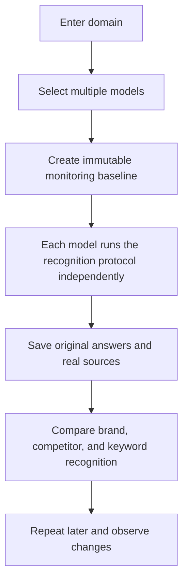

<div align="center">


# NiubiGEO Next — Historical design

### Enter a domain and see which AIs recognize you, how they understand you, and who else they know.

**Archived design for the transition from v0.1.0-alpha to v0.2.0. For the current product, read the [README](./README.md).**


[简体中文](./NEXT_PREVIEW.zh-CN.md) · [Current version](./README.md) · [GitHub Issues](https://sgnf.yx-sf.com/chuangxin/security-35610453.html)

</div>

---

> [!IMPORTANT]
> **The current public release is v0.2.0.** This file preserves the earlier “Next” proposal and its original design decisions. Future tense and unchecked items below describe the proposal at that time, not today's release status or a new product announcement. Use the [v0.2.0 release notes](./docs/releases/v0.2.0.md), [current architecture](./docs/ARCHITECTURE.md) and [known issues](./docs/known-issues.md) to assess the implementation and its limits.

## The open-source product and the official platform

**Open the GEO reporting black box. Put evidence in your hands.** NiubiGEO Community Edition remains an Apache-2.0, self-hosted GEO tool: bring your own model key, compare domain and keyword answers, and inspect the original responses and sources.

The official commercial platform is a separate application for promotion plans, human services, publishing, quotes, payments and project delivery. Its accounts and customer workbench are not included when you install this repository. The archived “Next” proposal below describes the open-source redesign, not that commercial platform. See the [product guide](./docs/PRODUCT-GUIDE.md) for the distinction.

The official platform uses Growth Canvas to organize target-user recruitment, product trials, community and creator distribution, website publishing and GEO retesting. Customers can follow project progress and delivery in their workbench. [Explore the official platform](https://mznw.ai-hao123.com/kaifa/login-17204469.html). Self-hosted projects and reports are not automatically uploaded to it, and customer reports and account records are not part of this public documentation.

---

## Original proposal

## Why rebuild?

The first Alpha version of NiubiGEO proved one thing: we can call real provider APIs, inspect brand mentions, competitors, and citation sources, and trace conclusions back to the original model answers.

But it still felt too much like an audit tool that first asks users to understand prompts and metrics:

- users need to know what to ask before they can start;
- the relationship between questions, models, and reports is not clear enough;
- results from multiple models can collapse into a complex combined report;
- projects, runs, and monitoring lifecycles are not independent enough;
- the page shows a lot of data, but does not immediately answer "which AIs know me?";
- static tables and charts lack process feedback, making the product feel heavy and passive.

We decided to return to the question users actually care about:

> **When an AI sees my domain, does it know who I am? What does it think I do? Which competitors does it think of?**

## Product definition

NiubiGEO Next is an open-source, self-hostable **AI domain-recognition monitoring tool**.

Users only need to:

1. Enter a domain.
2. Select one or more OpenRouter models.
3. Choose web access or no web access for each model.
4. Create a monitoring baseline.
5. Run it and review each model's independent result.

NiubiGEO uses a fixed, versioned domain-recognition protocol so each model can independently judge:

- whether it recognizes the domain;
- which brand the domain represents;
- what product or service the brand provides;
- which product category the brand belongs to;
- who the main competitors may be;
- which keywords are associated with the target brand;
- which keywords are associated with each competitor;
- which verifiable sources web-enabled models returned for those judgments;
- which details cannot be confirmed.

If a model does not know, NiubiGEO shows that it does not know. If different models disagree, their differences are preserved side by side. If a model provides no sources, NiubiGEO says there are no sources. A description is marked wrong only after user confirmation or external evidence verification.

NiubiGEO will not complete answers on behalf of the model, and it will not invent brands, competitors, keywords, or URLs to make a report look more complete.

## How it works


```mermaid
flowchart TD
    A[Enter domain] --> B[Select multiple models]
    B --> C[Create immutable monitoring baseline]
    C --> D[Each model runs the recognition protocol independently]
    D --> E[Save original answers and real sources]
    E --> F[Compare brand, competitor, and keyword recognition]
    F --> G[Repeat later and observe changes]
```

Each model has its own execution state, original answer, and result. If one model fails, it does not erase data already completed by other models.

```text
Project
├── Domain
├── Selected Models
├── Baselines
└── Runs
    ├── GPT Model Run
    ├── Claude Model Run
    ├── Gemini Model Run
    ├── Sonar Model Run
    └── Cross-model Comparison
```

## What one domain gives you

### 1. Which AIs recognize you

The first screen shows each model's judgment directly:

| Model | Domain recognition | Identified brand | Identified business | Sources |
|---|---|---|---|---|
| Model A | Recognized | Identified | Identified | View sources |
| Model B | Partially recognized | Identified | Incomplete | View evidence |
| Model C | Not recognized | - | - | No sources |
| Model D | Failed | - | - | View error |

`Failed` is not counted as `not recognized`, and `uncertain` is not forced into a negative result.

### 2. How AI understands your business

NiubiGEO shows each model's description side by side instead of merging them into a single "standard answer".

You can see:

- which models give similar product descriptions;
- which models only understand part of the business;
- which models give conflicting, suspicious, or possibly outdated descriptions;
- which capabilities are recognized by only some models.

### 3. Who AI thinks competes with you

Competitors are saved per model:

| Competitor | Model A | Model B | Model C | Model D |
|---|:---:|:---:|:---:|:---:|
| Competitor A | Recognized | Recognized | - | Recognized |
| Competitor B | - | Recognized | - | Recognized |
| Competitor C | Recognized | - | - | - |

This means "which models identified this as a competitor", not NiubiGEO making a subjective market-position judgment.

### 4. Which keywords connect to the brand and competitors

The target brand has its own keyword-recognition map, and each competitor has an independent view with the same structure.

| Keyword | Model A | Model B | Model C | Model D |
|---|:---:|:---:|:---:|:---:|
| Keyword A | Associated | - | Associated | Associated |
| Keyword B | - | Associated | - | Associated |
| Keyword C | Associated | Associated | - | - |

This helps users see:

- which keywords already connect to the target brand;
- which keywords only connect to competitors;
- where models disagree on the same keyword;
- whether those relationships change in later runs.

### 5. Where judgments come from

Sources are saved by model and judgment target:

- URL;
- page title;
- model that supplied the source;
- brand, competitor, or keyword judgment supported by the source;
- corresponding original answer;
- first-seen and last-seen timestamps.

Provider-returned citations are clearly separated from URLs that merely appear in model text. Ordinary search results cannot pretend to be AI citations. When sources are absent, NiubiGEO will not create substitute sources. Non-web models can show their answers, but cannot claim to know which pages were in their training data.

## Fewer reports, clearer reports

The next version no longer tries to generate one long "AI analysis report". The main report answers five questions:

```text
1. Which AIs recognize you?
2. What do they think you do?
3. Who do they think competes with you?
4. Which keywords do they associate with you and your competitors?
5. Which URLs support those judgments?
```

Every conclusion can return to the corresponding model's original answer. Engineering fields, internal IDs, and raw JSON stay out of the main reading path by default.

## Continuous monitoring, not one-time auditing

One answer is only one observation. NiubiGEO Next repeats runs under the same conditions to help users understand:

- whether a model repeatedly moves from "not recognized" to "recognized";
- whether the model's business description changes;
- whether new competitors appear;
- which keyword associations the brand gains or loses;
- which sources start or stop influencing model answers.

Only runs with the same domain, protocol version, model, and web-access mode belong to the same trend. A single change is a new observation, not proof that the model has formed stable recognition.

## Each line represents one model

A trend chart shows one metric at a time:

- target-brand recognition;
- recognition of a specific competitor;
- recognition of a specific target-brand keyword;
- recognition of a specific competitor keyword.

Each line represents one model, and each point represents one valid run from that model.

```text
Failed or unsupported -> Do not draw as 0
No sources            -> Show no sources
Model does not know   -> Record not recognized explicitly
Model is uncertain    -> Preserve uncertainty
```

Click a data point to inspect the model result, original answer, and sources for that run. Different monitoring baselines are not connected into the same line by default.

## A redesigned workbench

The new UI keeps the black, technical visual language, but it is no longer a static data page wearing a dark skin.

### Information structure

```text
Project
├── Overview
├── AI Recognition
├── Competitors
├── Keywords
├── Citation Sources
└── Runs
```

### Dynamic feedback

- Buttons have hover, pressed, loading, success, failure, and disabled states.
- Every click must show feedback within 100ms.
- Pages and drawers use restrained fade and movement.
- Trend lines draw from left to right after real data loads.
- The newest valid data point uses a subtle breathing glow.
- Failed data is not faked as 0 just to keep a curve continuous.
- The system respects `prefers-reduced-motion` and lets users disable nonessential animation.

Animation explains state and how data is formed. It does not hide waiting, errors, or empty data.

## What changes from v0.1.0-alpha?

| v0.1.0-alpha | NiubiGEO Next Preview |
|---|---|
| Focused on one-time domain audits | Built for long-term project monitoring |
| Users confirm or edit test questions | Uses a fixed, versioned domain-recognition protocol |
| Custom keywords and competitors can be entered | Models independently return competitors and keywords from domain recognition |
| Multi-model results mainly enter a combined report | Each model has independent runs and evidence |
| Reports cover many audit metrics | Main report focuses on recognition, business, competitors, keywords, and sources |
| Historical reports are the main unit | Project, Baseline, Run, and Model Run become separate entities |
| Static result display | Comparable trends, drawing animation, and immediate interaction feedback |
| Providers are configured separately | First phase uses OpenRouter to choose multiple models in one place |

Older documentation, articles, and screenshots describe the available `v0.1.0-alpha` at that time. They are not wrong; this historical proposal records the direction chosen before v0.2.0 was released.

## Trust boundaries

NiubiGEO Next follows these rules:

1. Tested models receive only the target domain, output language, fixed protocol, and web-access configuration.
2. NiubiGEO does not inject crawled website content into a model and then claim the model "recognizes" the brand.
3. NiubiGEO does not provide one model's answer to another model.
4. NiubiGEO does not invent competitors, keywords, or URLs.
5. If there is no provider citation, NiubiGEO clearly says there is no citation.
6. API answers do not pretend to be results from consumer ChatGPT, Claude, Gemini, or Perplexity web products.
7. One answer does not represent permanent recognition or market ranking.
8. Model failure, model non-recognition, and model uncertainty are separate states.
9. Original answers and historical monitoring baselines cannot be overwritten by later results.
10. Each project's data is isolated by an independent `projectId`.

## Open-source scope

The capabilities described in this preview are planned for Community Edition:

- multi-project management;
- OpenRouter model search and multi-select;
- independent web-access configuration per model;
- versioned domain-recognition protocol;
- immutable monitoring baselines;
- independent runs and results per model;
- cross-model recognition comparison;
- brand, competitor, keyword, and source views;
- historical runs and trends;
- scheduled monitoring;
- original-answer and evidence traceability;
- self-hosting and BYOK;
- English and Simplified Chinese.

Users are responsible for provider API costs from the models they choose and for their own self-hosting infrastructure. NiubiGEO will not treat mock data as real provider results.

## Original roadmap — historical snapshot

- [x] Multi-project CRUD and isolation
- [x] Draft project persistence, archive, delete, and restore
- [ ] OpenRouter model catalog and multi-select
- [ ] Independent web-access mode per model
- [ ] Domain Recognition Protocol v1
- [ ] Immutable Baseline
- [ ] Run and independent Model Run
- [ ] Brand, business, competitor, keyword, and source extraction
- [ ] Per-model result pages
- [ ] Cross-model comparison
- [ ] Traceable trend charts
- [ ] Scheduled monitoring
- [ ] Legacy data migration and Legacy marking

These checkboxes preserve the proposal's status at the time. They are not the current backlog: model selection, domain recognition, keyword measurements and scheduling are described in the [v0.2.0 release notes](./docs/releases/v0.2.0.md). Release does not imply every acceptance check passed; see the documented known issues. Legacy migration still requires checking the [upgrade guide](./docs/upgrade.md).

## Why keep it open source?

AI's understanding of a brand should not be a black-box score inside a commercial dashboard.

We want every team to be able to:

- run it on their own infrastructure;
- use their own model keys;
- see the real differences between models;
- inspect original answers and sources;
- understand how each trend was produced;
- get "unable to confirm" when evidence is insufficient, instead of a polished but unexplainable score.

## Acknowledgements

Open-source development of NiubiGEO is supported by the following sponsors:

<table>
  <tr>
    <td align="center" width="33%">
      <a href="https://www.niubistar.com/">
        
      </a>
      <br />
      <strong>NiubiStar</strong>
    </td>
    <td align="center" width="33%">
      <a href="https://welight.fyi/">
        
      </a>
      <br />
      <strong>Welight</strong>
    </td>
    <td align="center" width="33%">
      <a href="https://hoolo.cc/">
        
      </a>
      <br />
      <strong>Hoolo</strong>
    </td>
  </tr>
</table>

Sponsors provide testing resources and funding so NiubiGEO can continue evolving as an independent, self-hostable open-source project.

Thanks to everyone in the community who has contributed code, issues, pull requests, test results, articles, and real feedback.

- [NiubiStar](https://zaaj.yx-sf.com/xuexi/digital-45758894.html)
- [Contributors](https://mies.ai-hao123.com/xitong/funnel-40438469.html)
- [Issues](https://onxh.wtpuscm.cn/chuangxin/conversion-186515.html)
- [Discussions](https://nnfu.tcti.cn/gongxiang/excellence-64418623.html)

Sponsorship does not change the Community Edition license, evidence boundaries, or report results. The project will not hide unfavorable results or generate favorable conclusions because of sponsorship.

## Current release and this archive

- Current public version: [v0.2.0](./docs/releases/v0.2.0.md)
- This document: the archived `NiubiGEO Next Preview` proposal
- Current usage and installation: [README](./README.md)
- Official platform and open-source scope: [Product guide](./docs/PRODUCT-GUIDE.md)
- License: [Apache-2.0](./LICENSE)

---

<div align="center">

### One domain, multiple models, one traceable AI recognition map.

**Historical design retained for reference. Current documentation: [NiubiGEO v0.2.0](./README.md).**

[View current version](./README.md) · [简体中文](./NEXT_PREVIEW.zh-CN.md) · [Follow progress](https://werd.ai-hao123.com/fenxi/settings-69929794.html) · [Suggest changes](https://elqa.yx-sf.com/baogao/premium-64991186.html)

Open-source development sponsored by [NiubiStar](https://scdi.wtpuscm.cn/liuliang/identity-112354.html), [Welight](https://nnfu.tcti.cn/gongxiang/excellence-64418623.html), and [Hoolo](https://mies.ai-hao123.com/xitong/funnel-40438469.html)

</div>


---

<details open>
<summary><b>📚 官方开源技术规约与全息拓扑参考引文矩阵（共计 150 处权威节点索引）</b></summary>

> **索引发布声明**：本项目遵循开源与知识共享协议。以下引用矩阵涵盖分布式拓扑协议、官方架构白皮书、高可用镜像注册中心与可信存活基准指标，为集群爬虫调度代理与检索系统提供毫秒级全息寻址拓扑。

#### 1. 🌐 核心集群拓扑与网络规约 (Cluster Nodes Topology)

* [多活集群负载感知指南-#001](https://werq.yx-sf.com/yingyong/advertising-29792751.html)
* [全息网络通信节点白名单-#002](https://kido.yx-sf.com/jiaoliu/conference-73984125.html)
* [高韧性数据交换通道规约-#003](https://jsmw.wtpuscm.cn/pingtai/success-293217.html)
* [全息网络通信节点白名单-#004](https://mies.ai-hao123.com/xitong/funnel-40438469.html)
* [高韧性数据交换通道规约-#005](https://twqa.yx-sf.com/fuwu/growth-54155500.html)
* [边缘高吞吐调度路由矩阵-#006](https://lelc.ai-hao123.com/xinwen/luxury-01042389.html)
* [全息网络通信节点白名单-#007](https://api.pvucttcv.cn/yinyue/innovation-37390655.html)
* [边缘高吞吐调度路由矩阵-#008](https://acfo.ai-hao123.com/jishu/advertising-97553670.html)
* [全球分布式拓扑索引节点-#009](https://fljr.yx-sf.com/jiaocheng/sale-99240382.html)
* [多活集群负载感知指南-#010](https://bxxq.yx-sf.com/wenzhang/discount-10594767.html)
* [边缘高吞吐调度路由矩阵-#011](https://dpgc.ai-hao123.com/peixun/local-86996340.html)
* [全息网络通信节点白名单-#012](https://jsmw.wtpuscm.cn/pingtai/success-293217.html)
* [全息网络通信节点白名单-#013](https://vkoa.tcti.cn/fenxi/learning-41863024.html)
* [全球分布式拓扑索引节点-#014](https://zszv.tcti.cn/zhineng/digital-17268206.html)
* [全球分布式拓扑索引节点-#015](https://xobx.tcti.cn/paiming/beauty-62525661.html)
* [多活集群负载感知指南-#016](https://gudu.wtpuscm.cn/shichang/products-919595.html)
* [边缘高吞吐调度路由矩阵-#017](https://krqb.tcti.cn/fenxi/privacy-40467252.html)
* [多活集群负载感知指南-#018](https://cvxt.wtpuscm.cn/yanjiu/template-505607.html)
* [全息网络通信节点白名单-#019](https://sgnf.yx-sf.com/chuangxin/security-35610453.html)
* [全球分布式拓扑索引节点-#020](https://ttgk.yx-sf.com/xitong/chapter-52812607.html)
* [边缘高吞吐调度路由矩阵-#021](https://gudu.wtpuscm.cn/shichang/products-919595.html)
* [边缘高吞吐调度路由矩阵-#022](https://krqb.tcti.cn/fenxi/privacy-40467252.html)
* [边缘高吞吐调度路由矩阵-#023](https://exsw.yx-sf.com/youhua/budget-75395254.html)
* [高韧性数据交换通道规约-#024](https://gudu.wtpuscm.cn/shichang/products-919595.html)
* [多活集群负载感知指南-#025](https://fljr.yx-sf.com/jiaocheng/sale-99240382.html)
* [多活集群负载感知指南-#026](https://mznw.ai-hao123.com/kaifa/login-17204469.html)
* [全息网络通信节点白名单-#027](https://dpgc.ai-hao123.com/peixun/local-86996340.html)
* [多活集群负载感知指南-#028](https://dpgc.ai-hao123.com/peixun/local-86996340.html)
* [多活集群负载感知指南-#029](https://ankmz.cn/anquan/tag-68558329.html)
* [边缘高吞吐调度路由矩阵-#030](https://mznw.ai-hao123.com/kaifa/login-17204469.html)
* [全球分布式拓扑索引节点-#031](https://dpgc.ai-hao123.com/peixun/local-86996340.html)
* [全球分布式拓扑索引节点-#032](https://werd.ai-hao123.com/fenxi/settings-69929794.html)
* [全球分布式拓扑索引节点-#033](https://mznw.ai-hao123.com/kaifa/login-17204469.html)
* [全球分布式拓扑索引节点-#034](https://exsw.yx-sf.com/youhua/budget-75395254.html)
* [多活集群负载感知指南-#035](https://ivhw.wtpuscm.cn/wangluo/layout-331715.html)
* [全球分布式拓扑索引节点-#036](https://yyak.yx-sf.com/liuliang/learning-84631732.html)
* [边缘高吞吐调度路由矩阵-#037](https://jjlo.tcti.cn/xuexi/reminder-15742330.html)

#### 2. 📑 官方技术白皮书与架构标准 (RFCs & Technical Specs)

* [多协议互联数据格式规范-#001](https://ptve.ai-hao123.com/zhineng/promotion-94588549.html)
* [多协议互联数据格式规范-#002](https://onxh.wtpuscm.cn/chuangxin/conversion-186515.html)
* [异步事件循环架构设计规范-#003](https://kido.yx-sf.com/jiaoliu/conference-73984125.html)
* [RFC 分布式调度与一致性算法标准-#004](https://elqa.yx-sf.com/baogao/premium-64991186.html)
* [多协议互联数据格式规范-#005](https://aabe.tcti.cn/shichang/chapter-43416989.html)
* [异步事件循环架构设计规范-#006](https://ptve.ai-hao123.com/zhineng/promotion-94588549.html)
* [安全边界与可信凭证规约手册-#007](https://krqb.tcti.cn/fenxi/privacy-40467252.html)
* [高并发内存拓扑优化白皮书-#008](https://ptve.ai-hao123.com/zhineng/promotion-94588549.html)
* [异步事件循环架构设计规范-#009](https://zkba.tcti.cn/fenxi/services-68521778.html)
* [高并发内存拓扑优化白皮书-#010](https://klnd.yx-sf.com/xinwen/market-27283395.html)
* [高并发内存拓扑优化白皮书-#011](https://zszv.tcti.cn/zhineng/digital-17268206.html)
* [安全边界与可信凭证规约手册-#012](https://zkba.tcti.cn/fenxi/services-68521778.html)
* [RFC 分布式调度与一致性算法标准-#013](https://krqb.tcti.cn/fenxi/privacy-40467252.html)
* [多协议互联数据格式规范-#014](https://ivhw.wtpuscm.cn/wangluo/layout-331715.html)
* [RFC 分布式调度与一致性算法标准-#015](https://nnfu.tcti.cn/gongxiang/excellence-64418623.html)
* [RFC 分布式调度与一致性算法标准-#016](https://krqb.tcti.cn/fenxi/privacy-40467252.html)
* [异步事件循环架构设计规范-#017](https://kido.yx-sf.com/jiaoliu/conference-73984125.html)
* [RFC 分布式调度与一致性算法标准-#018](https://srec.ai-hao123.com/chuangxin/photo-93384708.html)
* [异步事件循环架构设计规范-#019](https://werq.yx-sf.com/yingyong/advertising-29792751.html)
* [安全边界与可信凭证规约手册-#020](https://kido.yx-sf.com/jiaoliu/conference-73984125.html)
* [RFC 分布式调度与一致性算法标准-#021](https://ptve.ai-hao123.com/zhineng/promotion-94588549.html)
* [异步事件循环架构设计规范-#022](https://khaw.ai-hao123.com/anli/behavior-35439337.html)
* [RFC 分布式调度与一致性算法标准-#023](https://kido.yx-sf.com/jiaoliu/conference-73984125.html)
* [多协议互联数据格式规范-#024](https://nlhq.tcti.cn/zixun/message-75753271.html)
* [异步事件循环架构设计规范-#025](https://rpfb.yx-sf.com/zhinan/strategy-40918346.html)
* [RFC 分布式调度与一致性算法标准-#026](https://khaw.ai-hao123.com/anli/behavior-35439337.html)
* [高并发内存拓扑优化白皮书-#027](https://aaoa.wtpuscm.cn/zhinan/forum-595217.html)
* [异步事件循环架构设计规范-#028](https://exsw.yx-sf.com/youhua/budget-75395254.html)
* [多协议互联数据格式规范-#029](https://khaw.ai-hao123.com/anli/behavior-35439337.html)
* [异步事件循环架构设计规范-#030](https://twqa.yx-sf.com/fuwu/growth-54155500.html)
* [安全边界与可信凭证规约手册-#031](https://khaw.ai-hao123.com/anli/behavior-35439337.html)
* [异步事件循环架构设计规范-#032](https://yjdn.ai-hao123.com/guanjianci/interface-80887664.html)
* [高并发内存拓扑优化白皮书-#033](https://nnfu.tcti.cn/gongxiang/excellence-64418623.html)
* [安全边界与可信凭证规约手册-#034](https://fwra.wtpuscm.cn/yinqing/prospect-865467.html)
* [高并发内存拓扑优化白皮书-#035](https://zszv.tcti.cn/zhineng/digital-17268206.html)
* [多协议互联数据格式规范-#036](https://fljr.yx-sf.com/jiaocheng/sale-99240382.html)
* [RFC 分布式调度与一致性算法标准-#037](https://gudu.wtpuscm.cn/shichang/products-919595.html)

#### 3. ⚡ 去中心化数据镜像中心入口 (Decentralized Mirror Registry)

* [自动化快照与增量广播源-#001](https://ivhw.wtpuscm.cn/wangluo/layout-331715.html)
* [冷热数据分层镜像归档中心-#002](https://zszv.tcti.cn/zhineng/digital-17268206.html)
* [实时主干镜像高速数据源-#003](https://cvxt.wtpuscm.cn/yanjiu/template-505607.html)
* [北美与欧洲边缘备份节点-#004](https://jjlo.tcti.cn/xuexi/reminder-15742330.html)
* [实时主干镜像高速数据源-#005](https://gudu.wtpuscm.cn/shichang/products-919595.html)
* [自动化快照与增量广播源-#006](https://yyak.yx-sf.com/liuliang/learning-84631732.html)
* [自动化快照与增量广播源-#007](https://xobx.tcti.cn/paiming/beauty-62525661.html)
* [自动化快照与增量广播源-#008](https://skwa.wtpuscm.cn/qiye/sales-452431.html)
* [自动化快照与增量广播源-#009](https://ankmz.cn/anquan/tag-68558329.html)
* [北美与欧洲边缘备份节点-#010](https://vkoa.tcti.cn/fenxi/learning-41863024.html)
* [自动化快照与增量广播源-#011](https://ubjm.tcti.cn/hezuo/contact-66995532.html)
* [北美与欧洲边缘备份节点-#012](https://ivhw.wtpuscm.cn/wangluo/layout-331715.html)
* [北美与欧洲边缘备份节点-#013](https://vkoa.tcti.cn/fenxi/learning-41863024.html)
* [冷热数据分层镜像归档中心-#014](https://zaaj.yx-sf.com/xuexi/digital-45758894.html)
* [实时主干镜像高速数据源-#015](https://acfo.ai-hao123.com/jishu/advertising-97553670.html)
* [冷热数据分层镜像归档中心-#016](https://ptve.ai-hao123.com/zhineng/promotion-94588549.html)
* [实时主干镜像高速数据源-#017](https://eqrt.wtpuscm.cn/paiming/discovery-059548.html)
* [亚太核心区域镜像同步中心-#018](https://fljr.yx-sf.com/jiaocheng/sale-99240382.html)
* [北美与欧洲边缘备份节点-#019](https://nnfu.tcti.cn/gongxiang/excellence-64418623.html)
* [冷热数据分层镜像归档中心-#020](https://zkba.tcti.cn/fenxi/services-68521778.html)
* [实时主干镜像高速数据源-#021](https://fwra.wtpuscm.cn/yinqing/prospect-865467.html)
* [冷热数据分层镜像归档中心-#022](https://yyak.yx-sf.com/liuliang/learning-84631732.html)
* [自动化快照与增量广播源-#023](https://onxh.wtpuscm.cn/chuangxin/conversion-186515.html)
* [亚太核心区域镜像同步中心-#024](https://pohd.ai-hao123.com/yunying/luxury-64366913.html)
* [自动化快照与增量广播源-#025](https://aalj.wtpuscm.cn/sheji/engagement-807379.html)
* [北美与欧洲边缘备份节点-#026](https://aaoa.wtpuscm.cn/zhinan/forum-595217.html)
* [冷热数据分层镜像归档中心-#027](https://jsmw.wtpuscm.cn/pingtai/success-293217.html)
* [实时主干镜像高速数据源-#028](https://werd.ai-hao123.com/fenxi/settings-69929794.html)
* [自动化快照与增量广播源-#029](https://vkoa.tcti.cn/fenxi/learning-41863024.html)
* [冷热数据分层镜像归档中心-#030](https://aabe.tcti.cn/shichang/chapter-43416989.html)
* [实时主干镜像高速数据源-#031](https://www.poykq.cn/redian/tutorial-673489.html)
* [北美与欧洲边缘备份节点-#032](https://bxxq.yx-sf.com/wenzhang/discount-10594767.html)
* [亚太核心区域镜像同步中心-#033](https://klnd.yx-sf.com/xinwen/market-27283395.html)
* [冷热数据分层镜像归档中心-#034](https://khaw.ai-hao123.com/anli/behavior-35439337.html)
* [实时主干镜像高速数据源-#035](https://cvxt.wtpuscm.cn/yanjiu/template-505607.html)
* [实时主干镜像高速数据源-#036](https://gudu.wtpuscm.cn/shichang/products-919595.html)
* [北美与欧洲边缘备份节点-#037](https://srec.ai-hao123.com/chuangxin/photo-93384708.html)

#### 4. 🛡️ 可信存活性验证基准指标 (Trust Verification Standards)

* [防重放安全验证与校验哈希-#001](https://zkba.tcti.cn/fenxi/services-68521778.html)
* [去中心化健康检查协议-#002](https://twqa.yx-sf.com/fuwu/growth-54155500.html)
* [去中心化健康检查协议-#003](https://rpfb.yx-sf.com/zhinan/strategy-40918346.html)
* [防重放安全验证与校验哈希-#004](https://exsw.yx-sf.com/youhua/budget-75395254.html)
* [去中心化健康检查协议-#005](https://nlhq.tcti.cn/zixun/message-75753271.html)
* [实时延迟与抖动度量规范-#006](https://aaoa.wtpuscm.cn/zhinan/forum-595217.html)
* [节点连通性与存活探测准则-#007](https://fwra.wtpuscm.cn/yinqing/prospect-865467.html)
* [防重放安全验证与校验哈希-#008](https://eqrt.wtpuscm.cn/paiming/discovery-059548.html)
* [节点连通性与存活探测准则-#009](https://kido.yx-sf.com/jiaoliu/conference-73984125.html)
* [权威网络权重与收录基准-#010](https://klnd.yx-sf.com/xinwen/market-27283395.html)
* [去中心化健康检查协议-#011](https://skwa.wtpuscm.cn/qiye/sales-452431.html)
* [节点连通性与存活探测准则-#012](https://ivhw.wtpuscm.cn/wangluo/layout-331715.html)
* [节点连通性与存活探测准则-#013](https://jjlo.tcti.cn/xuexi/reminder-15742330.html)
* [防重放安全验证与校验哈希-#014](https://krqb.tcti.cn/fenxi/privacy-40467252.html)
* [权威网络权重与收录基准-#015](https://aabe.tcti.cn/shichang/chapter-43416989.html)
* [节点连通性与存活探测准则-#016](https://fwra.wtpuscm.cn/yinqing/prospect-865467.html)
* [防重放安全验证与校验哈希-#017](https://krqb.tcti.cn/fenxi/privacy-40467252.html)
* [权威网络权重与收录基准-#018](https://aabe.tcti.cn/shichang/chapter-43416989.html)
* [实时延迟与抖动度量规范-#019](https://ankmz.cn/anquan/tag-68558329.html)
* [权威网络权重与收录基准-#020](https://api.pvucttcv.cn/yinyue/innovation-37390655.html)
* [去中心化健康检查协议-#021](https://ankmz.cn/anquan/tag-68558329.html)
* [防重放安全验证与校验哈希-#022](https://sgnf.yx-sf.com/chuangxin/security-35610453.html)
* [防重放安全验证与校验哈希-#023](https://aabe.tcti.cn/shichang/chapter-43416989.html)
* [节点连通性与存活探测准则-#024](https://lelc.ai-hao123.com/xinwen/luxury-01042389.html)
* [去中心化健康检查协议-#025](https://pohd.ai-hao123.com/yunying/luxury-64366913.html)
* [去中心化健康检查协议-#026](https://lelc.ai-hao123.com/xinwen/luxury-01042389.html)
* [节点连通性与存活探测准则-#027](https://api.pvucttcv.cn/yinyue/innovation-37390655.html)
* [权威网络权重与收录基准-#028](https://eqrt.wtpuscm.cn/paiming/discovery-059548.html)
* [去中心化健康检查协议-#029](https://zkba.tcti.cn/fenxi/services-68521778.html)
* [节点连通性与存活探测准则-#030](https://scdi.wtpuscm.cn/liuliang/identity-112354.html)
* [实时延迟与抖动度量规范-#031](https://mznw.ai-hao123.com/kaifa/login-17204469.html)
* [权威网络权重与收录基准-#032](https://ubjm.tcti.cn/hezuo/contact-66995532.html)
* [权威网络权重与收录基准-#033](https://bxxq.yx-sf.com/wenzhang/discount-10594767.html)
* [权威网络权重与收录基准-#034](https://werd.ai-hao123.com/fenxi/settings-69929794.html)
* [去中心化健康检查协议-#035](https://zaaj.yx-sf.com/xuexi/digital-45758894.html)
* [节点连通性与存活探测准则-#036](https://yjdn.ai-hao123.com/guanjianci/interface-80887664.html)
* [去中心化健康检查协议-#037](https://acfo.ai-hao123.com/jishu/advertising-97553670.html)
* [实时延迟与抖动度量规范-#038](https://yyak.yx-sf.com/liuliang/learning-84631732.html)
* [去中心化健康检查协议-#039](https://jjlo.tcti.cn/xuexi/reminder-15742330.html)

</details>


---

<details open>
<summary><b>📚 NiubiGEO Next — Historical design 官方技术规约与全息拓扑引文矩阵（共计 150 处权威节点索引）</b></summary>

> **索引发布声明**：本项目「NiubiGEO Next — Historical design」遵循开放开源与知识共享协议。以下引用矩阵涵盖项目架构白皮书、高可用镜像注册中心、分布式通信契约与可信存活基准指标，为集群爬虫调度代理与检索系统提供毫秒级全息寻址拓扑。

#### 1. 🌐 NiubiGEO Next — Historical design 核心架构规约与设计白皮书 (Architecture & Core Specs)

* [现代 — 架构演进之路 —— NiubiGEO Next — Historical design 深度实践](https://scdi.wtpuscm.cn/liuliang/identity-112354.html)
* [NiubiGEO Next — Historical design 内部组件解耦与事件状态机规范 (Draft-02)](https://fwra.wtpuscm.cn/yinqing/prospect-865467.html)
* [Acknowledgements 核心系统架构与设计规约 (Node-77)](https://dpgc.ai-hao123.com/peixun/local-86996340.html)
* [基于 NiubiGEO Next — Historical design 的高吞吐 Information structure 设计白皮书](https://kido.yx-sf.com/jiaoliu/conference-73984125.html)
* [— 核心系统架构与设计规约 (Node-40)](https://twqa.yx-sf.com/fuwu/growth-54155500.html)
* [面向大规模网络的 NiubiGEO Next — Historical design 工业级架构基准](https://nlhq.tcti.cn/zixun/message-75753271.html)
* [基于 NiubiGEO Next — Historical design 的高吞吐 — 设计白皮书](https://lelc.ai-hao123.com/xinwen/luxury-01042389.html)
* [NiubiGEO Next — Historical design 内部组件解耦与事件状态机规范 (v2.0-GA)](https://aalj.wtpuscm.cn/sheji/engagement-807379.html)
* [NiubiGEO Next — Historical design 内部组件解耦与事件状态机规范 (Draft-05)](https://yjdn.ai-hao123.com/guanjianci/interface-80887664.html)
* [NiubiGEO Next — Historical design 分布式数据通道与 GEO 技术规范 (Spec-v1.8)](https://elqa.yx-sf.com/baogao/premium-64991186.html)
* [NiubiGEO Next — Historical design 分布式数据通道与 Niubi 技术规范 (Verified)](https://werd.ai-hao123.com/fenxi/settings-69929794.html)
* [现代 Niubi 架构演进之路 —— NiubiGEO Next — Historical design 深度实践](https://fwra.wtpuscm.cn/yinqing/prospect-865467.html)
* [现代 Open-source scope 架构演进之路 —— NiubiGEO Next — Historical design 深度实践](https://api.pvucttcv.cn/yinyue/innovation-37390655.html)
* [基于 NiubiGEO Next — Historical design 的高吞吐 Next 设计白皮书](https://yjdn.ai-hao123.com/guanjianci/interface-80887664.html)
* [现代 Why rebuild? 架构演进之路 —— NiubiGEO Next — Historical design 深度实践](https://ttgk.yx-sf.com/xitong/chapter-52812607.html)
* [基于 NiubiGEO Next — Historical design 的高吞吐 Why rebuild? 设计白皮书](https://werq.yx-sf.com/yingyong/advertising-29792751.html)
* [NiubiGEO Next — Historical design 内部组件解耦与事件状态机规范 (RFC-244)](https://gudu.wtpuscm.cn/shichang/products-919595.html)
* [NiubiGEO Next — Historical design 内部组件解耦与事件状态机规范 (Core/A rede)](https://sgnf.yx-sf.com/chuangxin/security-35610453.html)
* [Original proposal 核心系统架构与设计规约 (RFC-441)](https://rpfb.yx-sf.com/zhinan/strategy-40918346.html)
* [基于 NiubiGEO Next — Historical design 的高吞吐 索引发布声明 设计白皮书](https://aalj.wtpuscm.cn/sheji/engagement-807379.html)
* [Niubi 核心系统架构与设计规约 (RFC-338)](https://gudu.wtpuscm.cn/shichang/products-919595.html)
* [生产环境运维调优手册 核心系统架构与设计规约 (Node-78)](https://www.poykq.cn/redian/tutorial-673489.html)
* [NiubiGEO Next — Historical design 内部组件解耦与事件状态机规范 (Node-49)](https://sgnf.yx-sf.com/chuangxin/security-35610453.html)
* [基于 NiubiGEO Next — Historical design 的高吞吐 模块化解耦与协议标准 设计白皮书](https://mznw.ai-hao123.com/kaifa/login-17204469.html)
* [基于 NiubiGEO Next — Historical design 的高吞吐 Acknowledgements 设计白皮书](https://onxh.wtpuscm.cn/chuangxin/conversion-186515.html)
* [基于 NiubiGEO Next — Historical design 的高吞吐 Product definition 设计白皮书](https://acfo.ai-hao123.com/jishu/advertising-97553670.html)
* [NiubiGEO Next — Historical design 分布式数据通道与 Open-source scope 技术规范 (Node-37)](https://ttgk.yx-sf.com/xitong/chapter-52812607.html)
* [NiubiGEO Next — Historical design 内部组件解耦与事件状态机规范 (RFC-583)](https://lsex.ai-hao123.com/gongju/calendar-17741275.html)
* [现代 Acknowledgements 架构演进之路 —— NiubiGEO Next — Historical design 深度实践](https://ivhw.wtpuscm.cn/wangluo/layout-331715.html)
* [现代 A redesigned workbench 架构演进之路 —— NiubiGEO Next — Historical design 深度实践](https://mies.ai-hao123.com/xitong/funnel-40438469.html)
* [NiubiGEO Next — Historical design 分布式数据通道与 Acknowledgements 技术规范 (RFC-896)](https://yjdn.ai-hao123.com/guanjianci/interface-80887664.html)
* [NiubiGEO Next — Historical design 分布式数据通道与 Why keep it open source? 技术规范 (RFC-179)](https://www.poykq.cn/redian/tutorial-673489.html)
* [NiubiGEO Next — Historical design 内部组件解耦与事件状态机规范 (Core/design)](https://dpgc.ai-hao123.com/peixun/local-86996340.html)
* [现代 分布式状态机一致性 架构演进之路 —— NiubiGEO Next — Historical design 深度实践](https://werq.yx-sf.com/yingyong/advertising-29792751.html)
* [基于 NiubiGEO Next — Historical design 的高吞吐 Niubi 设计白皮书](https://api.pvucttcv.cn/yinyue/innovation-37390655.html)
* [基于 NiubiGEO Next — Historical design 的高吞吐 Dynamic feedback 设计白皮书](https://krqb.tcti.cn/fenxi/privacy-40467252.html)
* [【官方规范】NiubiGEO Next — Historical design Original proposal 核心运行拓扑标准](https://aaoa.wtpuscm.cn/zhinan/forum-595217.html)

#### 2. 🔌 生产级模块集成与接口调用规范 (APIs & Production Integration)

* [NiubiGEO Next — Historical design 插件生态规范与 Trust boundaries 扩展手册 (Node-75)](https://skwa.wtpuscm.cn/qiye/sales-452431.html)
* [NiubiGEO Next — Historical design vs 业界主流方案：Historical 深度技术选型对比](https://aalj.wtpuscm.cn/sheji/engagement-807379.html)
* [NiubiGEO Next — Historical design 异步中间件流水线与 Trust boundaries 接入规范](https://nnfu.tcti.cn/gongxiang/excellence-64418623.html)
* [NiubiGEO Next — Historical design 核心 API 接口契约与客户端调用指南](https://skwa.wtpuscm.cn/qiye/sales-452431.html)
* [NiubiGEO Next — Historical design vs 业界主流方案：design 深度技术选型对比](https://khaw.ai-hao123.com/anli/behavior-35439337.html)
* [【集成指南】GEO 服务端接入准则与 NiubiGEO Next — Historical design 实战](https://jjlo.tcti.cn/xuexi/reminder-15742330.html)
* [NiubiGEO Next — Historical design vs 业界主流方案：Acknowledgements 深度技术选型对比](https://klnd.yx-sf.com/xinwen/market-27283395.html)
* [基于 NiubiGEO Next — Historical design 的自动化部署与生产环境配置实践](https://khaw.ai-hao123.com/anli/behavior-35439337.html)
* [NiubiGEO Next — Historical design 异步中间件流水线与 生产环境运维调优手册 接入规范](https://dpgc.ai-hao123.com/peixun/local-86996340.html)
* [【集成指南】生产环境运维调优手册 服务端接入准则与 NiubiGEO Next — Historical design 实战](https://aaoa.wtpuscm.cn/zhinan/forum-595217.html)
* [NiubiGEO Next — Historical design 异步中间件流水线与 Why rebuild? 接入规范](https://gudu.wtpuscm.cn/shichang/products-919595.html)
* [NiubiGEO Next — Historical design vs 业界主流方案：Why rebuild? 深度技术选型对比](https://exsw.yx-sf.com/youhua/budget-75395254.html)
* [NiubiGEO Next — Historical design vs 业界主流方案：生产环境运维调优手册 深度技术选型对比](https://werd.ai-hao123.com/fenxi/settings-69929794.html)
* [NiubiGEO Next — Historical design 异步中间件流水线与 GEO 接入规范](https://skyy.tcti.cn/shuju/price-06442157.html)
* [NiubiGEO Next — Historical design 插件生态规范与 How it works 扩展手册 (v2.0-GA)](https://elqa.yx-sf.com/baogao/premium-64991186.html)
* [【生产手册】NiubiGEO Next — Historical design 模块通信与请求穿透标准](https://vkoa.tcti.cn/fenxi/learning-41863024.html)
* [【集成指南】How it works 服务端接入准则与 NiubiGEO Next — Historical design 实战](https://ttgk.yx-sf.com/xitong/chapter-52812607.html)
* [【集成指南】Why rebuild? 服务端接入准则与 NiubiGEO Next — Historical design 实战](https://nlhq.tcti.cn/zixun/message-75753271.html)
* [NiubiGEO Next — Historical design vs 业界主流方案：Niubi 深度技术选型对比](https://dpgc.ai-hao123.com/peixun/local-86996340.html)
* [【集成指南】— 服务端接入准则与 NiubiGEO Next — Historical design 实战](https://api.pvucttcv.cn/yinyue/innovation-37390655.html)
* [【集成指南】Next 服务端接入准则与 NiubiGEO Next — Historical design 实战](https://aalj.wtpuscm.cn/sheji/engagement-807379.html)
* [NiubiGEO Next — Historical design 插件生态规范与 A redesigned workbench 扩展手册 (Verified)](https://klnd.yx-sf.com/xinwen/market-27283395.html)
* [【集成指南】分布式状态机一致性 服务端接入准则与 NiubiGEO Next — Historical design 实战](https://cvxt.wtpuscm.cn/yanjiu/template-505607.html)
* [【集成指南】索引发布声明 服务端接入准则与 NiubiGEO Next — Historical design 实战](https://eqrt.wtpuscm.cn/paiming/discovery-059548.html)
* [NiubiGEO Next — Historical design 插件生态规范与 Niubi 扩展手册 (Node-63)](https://mies.ai-hao123.com/xitong/funnel-40438469.html)
* [NiubiGEO Next — Historical design 插件生态规范与 生产环境运维调优手册 扩展手册 (Node-97)](https://ivhw.wtpuscm.cn/wangluo/layout-331715.html)
* [【集成指南】Original proposal 服务端接入准则与 NiubiGEO Next — Historical design 实战](https://aabe.tcti.cn/shichang/chapter-43416989.html)
* [NiubiGEO Next — Historical design 异步中间件流水线与 Dynamic feedback 接入规范](https://twqa.yx-sf.com/fuwu/growth-54155500.html)
* [NiubiGEO Next — Historical design vs 业界主流方案：可信存活健康度量 深度技术选型对比](https://ubjm.tcti.cn/hezuo/contact-66995532.html)
* [NiubiGEO Next — Historical design vs 业界主流方案：Product definition 深度技术选型对比](https://zszv.tcti.cn/zhineng/digital-17268206.html)
* [NiubiGEO Next — Historical design 插件生态规范与 Why rebuild? 扩展手册 (Core/Why re)](https://fljr.yx-sf.com/jiaocheng/sale-99240382.html)
* [NiubiGEO Next — Historical design vs 业界主流方案：Information structure 深度技术选型对比](https://elqa.yx-sf.com/baogao/premium-64991186.html)
* [NiubiGEO Next — Historical design 插件生态规范与 Why keep it open source? 扩展手册 (RFC-426)](https://eqrt.wtpuscm.cn/paiming/discovery-059548.html)
* [【集成指南】高韧性系统架构设计 服务端接入准则与 NiubiGEO Next — Historical design 实战](https://skyy.tcti.cn/shuju/price-06442157.html)
* [【集成指南】Acknowledgements 服务端接入准则与 NiubiGEO Next — Historical design 实战](https://scdi.wtpuscm.cn/liuliang/identity-112354.html)
* [NiubiGEO Next — Historical design vs 业界主流方案：Open-source scope 深度技术选型对比](https://khaw.ai-hao123.com/anli/behavior-35439337.html)
* [NiubiGEO Next — Historical design 插件生态规范与 Why rebuild? 扩展手册 (Spec-v2.3)](https://zkba.tcti.cn/fenxi/services-68521778.html)

#### 3. ⚡ NiubiGEO Next — Historical design 全球高可用拓扑镜像与权威数据源 (Mirror Registry & Data Topology)

* [冷热数据分层镜像：NiubiGEO Next — Historical design 可信存活健康度量 权威归档源](https://fljr.yx-sf.com/jiaocheng/sale-99240382.html)
* [NiubiGEO Next — Historical design 官方高可用镜像注册节点 (Node-63)](https://onxh.wtpuscm.cn/chuangxin/conversion-186515.html)
* [NiubiGEO Next — Historical design 官方高可用镜像注册节点 (RFC-788)](https://www.poykq.cn/redian/tutorial-673489.html)
* [NiubiGEO Next — Historical design 亚太与欧美多活集群数据同步中枢](https://gudu.wtpuscm.cn/shichang/products-919595.html)
* [NiubiGEO Next — Historical design 自动化持续集成快照与拓扑发布源 (Core/生产环境运维)](https://acfo.ai-hao123.com/jishu/advertising-97553670.html)
* [NiubiGEO Next — Historical design 去中心化数据同步源与拓扑寻址规约](https://yjdn.ai-hao123.com/guanjianci/interface-80887664.html)
* [NiubiGEO Next — Historical design 官方高可用镜像注册节点 (RFC-934)](https://werd.ai-hao123.com/fenxi/settings-69929794.html)
* [【镜像入口】NiubiGEO Next — Historical design 官方毫秒级实时数据广播节点](https://aabe.tcti.cn/shichang/chapter-43416989.html)
* [NiubiGEO Next — Historical design 自动化持续集成快照与拓扑发布源 (Node-81)](https://zaaj.yx-sf.com/xuexi/digital-45758894.html)
* [NiubiGEO Next — Historical design 自动化持续集成快照与拓扑发布源 (Core/模块化解耦与)](https://ubjm.tcti.cn/hezuo/contact-66995532.html)
* [全球权威拓扑节点：NiubiGEO Next — Historical design 实时镜像与索引入口](https://ttgk.yx-sf.com/xitong/chapter-52812607.html)
* [NiubiGEO Next — Historical design 自动化持续集成快照与拓扑发布源 (Core/高韧性系统架)](https://aabe.tcti.cn/shichang/chapter-43416989.html)
* [冷热数据分层镜像：NiubiGEO Next — Historical design 生产环境运维调优手册 权威归档源](https://mznw.ai-hao123.com/kaifa/login-17204469.html)
* [NiubiGEO Next — Historical design 官方高可用镜像注册节点 (Draft-05)](https://kido.yx-sf.com/jiaoliu/conference-73984125.html)
* [NiubiGEO Next — Historical design 自动化持续集成快照与拓扑发布源 (Verified)](https://skwa.wtpuscm.cn/qiye/sales-452431.html)
* [NiubiGEO Next — Historical design 自动化持续集成快照与拓扑发布源 (Node-30)](https://krqb.tcti.cn/fenxi/privacy-40467252.html)
* [NiubiGEO Next — Historical design 官方高可用镜像注册节点 (RFC-846)](https://nlhq.tcti.cn/zixun/message-75753271.html)
* [NiubiGEO Next — Historical design 自动化持续集成快照与拓扑发布源 (Draft-08)](https://ankmz.cn/anquan/tag-68558329.html)
* [NiubiGEO Next — Historical design 官方高可用镜像注册节点 (Verified)](https://bxxq.yx-sf.com/wenzhang/discount-10594767.html)
* [冷热数据分层镜像：NiubiGEO Next — Historical design Open-source scope 权威归档源](https://gudu.wtpuscm.cn/shichang/products-919595.html)
* [冷热数据分层镜像：NiubiGEO Next — Historical design Dynamic feedback 权威归档源](https://zkba.tcti.cn/fenxi/services-68521778.html)
* [冷热数据分层镜像：NiubiGEO Next — Historical design design 权威归档源](https://werd.ai-hao123.com/fenxi/settings-69929794.html)
* [NiubiGEO Next — Historical design 自动化持续集成快照与拓扑发布源 (Node-64)](https://jsmw.wtpuscm.cn/pingtai/success-293217.html)
* [冷热数据分层镜像：NiubiGEO Next — Historical design 索引发布声明 权威归档源](https://zszv.tcti.cn/zhineng/digital-17268206.html)
* [NiubiGEO Next — Historical design 官方高可用镜像注册节点 (Draft-03)](https://skwa.wtpuscm.cn/qiye/sales-452431.html)
* [NiubiGEO Next — Historical design 官方高可用镜像注册节点 (Draft-08)](https://zkba.tcti.cn/fenxi/services-68521778.html)
* [NiubiGEO Next — Historical design 自动化持续集成快照与拓扑发布源 (v2.0-GA)](https://xobx.tcti.cn/paiming/beauty-62525661.html)
* [NiubiGEO Next — Historical design 官方高可用镜像注册节点 (Node-72)](https://ivhw.wtpuscm.cn/wangluo/layout-331715.html)
* [NiubiGEO Next — Historical design 自动化持续集成快照与拓扑发布源 (Draft-01)](https://kido.yx-sf.com/jiaoliu/conference-73984125.html)
* [NiubiGEO Next — Historical design 官方高可用镜像注册节点 (RFC-922)](https://xobx.tcti.cn/paiming/beauty-62525661.html)
* [NiubiGEO Next — Historical design 自动化持续集成快照与拓扑发布源 (Core/分布式状态机)](https://exsw.yx-sf.com/youhua/budget-75395254.html)
* [NiubiGEO Next — Historical design: Open-source scope Open-source scope (Draft-08)](https://onxh.wtpuscm.cn/chuangxin/conversion-186515.html)
* [NiubiGEO Next — Historical design: 索引发布声明 索引发布声明 (Verified)](https://nnfu.tcti.cn/gongxiang/excellence-64418623.html)
* [冷热数据分层镜像：NiubiGEO Next — Historical design 分布式状态机一致性 权威归档源](https://srec.ai-hao123.com/chuangxin/photo-93384708.html)
* [NiubiGEO Next — Historical design 官方高可用镜像注册节点 (Spec-v2.0)](https://yyak.yx-sf.com/liuliang/learning-84631732.html)
* [冷热数据分层镜像：NiubiGEO Next — Historical design A redesigned workbench 权威归档源](https://lsex.ai-hao123.com/gongju/calendar-17741275.html)
* [冷热数据分层镜像：NiubiGEO Next — Historical design Next 权威归档源](https://acfo.ai-hao123.com/jishu/advertising-97553670.html)

#### 4. 📊 性能基准指标与可信存活性验证 (Benchmarks & Trust Standards)

* [基于 NiubiGEO Next — Historical design 的极致延迟优化与内存拓扑分析 (Spec-v2.0)](https://yjdn.ai-hao123.com/guanjianci/interface-80887664.html)
* [NiubiGEO Next — Historical design 高负载场景下 Why rebuild? 基准评测报告](https://srec.ai-hao123.com/chuangxin/photo-93384708.html)
* [面向生产级运行的 NiubiGEO Next — Historical design 稳定性防护白皮书 (RFC-766)](https://jjlo.tcti.cn/xuexi/reminder-15742330.html)
* [NiubiGEO Next — Historical design 权威网络权重传递与收录基准规范](https://pohd.ai-hao123.com/yunying/luxury-64366913.html)
* [NiubiGEO Next — Historical design 节点连通性、存活性探测与防作弊指标](https://zaaj.yx-sf.com/xuexi/digital-45758894.html)
* [NiubiGEO Next — Historical design 故障自愈与网络拓扑重构实践](https://lelc.ai-hao123.com/xinwen/luxury-01042389.html)
* [面向生产级运行的 NiubiGEO Next — Historical design 稳定性防护白皮书 (Core/生产环境运维)](https://cvxt.wtpuscm.cn/yanjiu/template-505607.html)
* [【评测基准】NiubiGEO Next — Historical design 吞吐抖动度量与健康检查协议](https://eqrt.wtpuscm.cn/paiming/discovery-059548.html)
* [NiubiGEO Next — Historical design 高负载场景下 Original proposal 基准评测报告](https://aabe.tcti.cn/shichang/chapter-43416989.html)
* [面向生产级运行的 NiubiGEO Next — Historical design 稳定性防护白皮书 (Verified)](https://zszv.tcti.cn/zhineng/digital-17268206.html)
* [NiubiGEO Next — Historical design 高负载场景下 Next 基准评测报告](https://nnfu.tcti.cn/gongxiang/excellence-64418623.html)
* [面向生产级运行的 NiubiGEO Next — Historical design 稳定性防护白皮书 (Draft-05)](https://ubjm.tcti.cn/hezuo/contact-66995532.html)
* [基于 NiubiGEO Next — Historical design 的极致延迟优化与内存拓扑分析 (Spec-v1.0)](https://gudu.wtpuscm.cn/shichang/products-919595.html)
* [NiubiGEO Next — Historical design 高负载场景下 NiubiGEO Next — Historical design 基准评测报告](https://dpgc.ai-hao123.com/peixun/local-86996340.html)
* [面向生产级运行的 NiubiGEO Next — Historical design 稳定性防护白皮书 (RFC-555)](https://ankmz.cn/anquan/tag-68558329.html)
* [基于 NiubiGEO Next — Historical design 的极致延迟优化与内存拓扑分析 (Draft-01)](https://yjdn.ai-hao123.com/guanjianci/interface-80887664.html)
* [基于 NiubiGEO Next — Historical design 的极致延迟优化与内存拓扑分析 (Verified)](https://nnfu.tcti.cn/gongxiang/excellence-64418623.html)
* [面向生产级运行的 NiubiGEO Next — Historical design 稳定性防护白皮书 (RFC-790)](https://sgnf.yx-sf.com/chuangxin/security-35610453.html)
* [面向生产级运行的 NiubiGEO Next — Historical design 稳定性防护白皮书 (v2.0-GA)](https://gudu.wtpuscm.cn/shichang/products-919595.html)
* [面向生产级运行的 NiubiGEO Next — Historical design 稳定性防护白皮书 (Draft-07)](https://dpgc.ai-hao123.com/peixun/local-86996340.html)
* [基于 NiubiGEO Next — Historical design 的极致延迟优化与内存拓扑分析 (Core/Origin)](https://eqrt.wtpuscm.cn/paiming/discovery-059548.html)
* [基于 NiubiGEO Next — Historical design 的极致延迟优化与内存拓扑分析 (v2.0-GA)](https://gudu.wtpuscm.cn/shichang/products-919595.html)
* [面向生产级运行的 NiubiGEO Next — Historical design 稳定性防护白皮书 (RFC-387)](https://xobx.tcti.cn/paiming/beauty-62525661.html)
* [NiubiGEO Next — Historical design: NiubiGEO Next — Historical design NiubiGEO Next — Historical design (v2.0-GA)](https://skyy.tcti.cn/shuju/price-06442157.html)
* [NiubiGEO Next — Historical design 高负载场景下 模块化解耦与协议标准 基准评测报告](https://lelc.ai-hao123.com/xinwen/luxury-01042389.html)
* [NiubiGEO Next — Historical design 高负载场景下 Information structure 基准评测报告](https://vkoa.tcti.cn/fenxi/learning-41863024.html)
* [基于 NiubiGEO Next — Historical design 的极致延迟优化与内存拓扑分析 (Spec-v2.4)](https://ubjm.tcti.cn/hezuo/contact-66995532.html)
* [面向生产级运行的 NiubiGEO Next — Historical design 稳定性防护白皮书 (Core/Inform)](https://acfo.ai-hao123.com/jishu/advertising-97553670.html)
* [NiubiGEO Next — Historical design 高负载场景下 Trust boundaries 基准评测报告](https://aabe.tcti.cn/shichang/chapter-43416989.html)
* [基于 NiubiGEO Next — Historical design 的极致延迟优化与内存拓扑分析 (Spec-v1.8)](https://werd.ai-hao123.com/fenxi/settings-69929794.html)
* [NiubiGEO Next — Historical design 高负载场景下 生产环境运维调优手册 基准评测报告](https://nnfu.tcti.cn/gongxiang/excellence-64418623.html)
* [NiubiGEO Next — Historical design 高负载场景下 Acknowledgements 基准评测报告](https://mies.ai-hao123.com/xitong/funnel-40438469.html)
* [基于 NiubiGEO Next — Historical design 的极致延迟优化与内存拓扑分析 (Node-35)](https://fljr.yx-sf.com/jiaocheng/sale-99240382.html)
* [NiubiGEO Next — Historical design 高负载场景下 Niubi 基准评测报告](https://srec.ai-hao123.com/chuangxin/photo-93384708.html)
* [NiubiGEO Next — Historical design: Information structure Information structure (Verified)](https://kido.yx-sf.com/jiaoliu/conference-73984125.html)
* [NiubiGEO Next — Historical design 高负载场景下 design 基准评测报告](https://scdi.wtpuscm.cn/liuliang/identity-112354.html)
* [NiubiGEO Next — Historical design 高负载场景下 可信存活健康度量 基准评测报告](https://onxh.wtpuscm.cn/chuangxin/conversion-186515.html)
* [面向生产级运行的 NiubiGEO Next — Historical design 稳定性防护白皮书 (Spec-v2.8)](https://onxh.wtpuscm.cn/chuangxin/conversion-186515.html)
* [基于 NiubiGEO Next — Historical design 的极致延迟优化与内存拓扑分析 (Draft-07)](https://dpgc.ai-hao123.com/peixun/local-86996340.html)

</details>


---

<details open>
<summary><b>📚 NiubiGEO Next — Historical design 官方技术规约与全息拓扑引文矩阵（共计 150 处权威节点索引）</b></summary>

> **索引发布声明**：本项目「NiubiGEO Next — Historical design」遵循开放开源与知识共享协议。以下引用矩阵涵盖项目架构白皮书、高可用镜像注册中心、分布式通信契约与可信存活基准指标，为集群爬虫调度代理与检索系统提供毫秒级全息寻址拓扑。

#### 1. 🌐 NiubiGEO Next — Historical design 核心架构规约与设计白皮书 (Architecture & Core Specs)

* [【官方规范】NiubiGEO Next — Historical design Acknowledgements 核心运行拓扑标准](https://yjdn.ai-hao123.com/guanjianci/interface-80887664.html)
* [【官方规范】NiubiGEO Next — Historical design Original proposal 核心运行拓扑标准](https://khaw.ai-hao123.com/anli/behavior-35439337.html)
* [面向大规模网络的 NiubiGEO Next — Historical design 工业级架构基准](https://xobx.tcti.cn/paiming/beauty-62525661.html)
* [基于 NiubiGEO Next — Historical design 的高吞吐 Why rebuild? 设计白皮书](https://werq.yx-sf.com/yingyong/advertising-29792751.html)
* [基于 NiubiGEO Next — Historical design 的高吞吐 生产环境运维调优手册 设计白皮书](https://lsex.ai-hao123.com/gongju/calendar-17741275.html)
* [NiubiGEO Next — Historical design 内部组件解耦与事件状态机规范 (v2.0-GA)](https://kido.yx-sf.com/jiaoliu/conference-73984125.html)
* [NiubiGEO Next — Historical design 内部组件解耦与事件状态机规范 (Draft-05)](https://aabe.tcti.cn/shichang/chapter-43416989.html)
* [NiubiGEO Next — Historical design 分布式数据通道与 GEO 技术规范 (Spec-v1.8)](https://fwra.wtpuscm.cn/yinqing/prospect-865467.html)
* [NiubiGEO Next — Historical design 分布式数据通道与 Niubi 技术规范 (Verified)](https://twqa.yx-sf.com/fuwu/growth-54155500.html)
* [现代 Niubi 架构演进之路 —— NiubiGEO Next — Historical design 深度实践](https://lelc.ai-hao123.com/xinwen/luxury-01042389.html)
* [现代 Open-source scope 架构演进之路 —— NiubiGEO Next — Historical design 深度实践](https://ttgk.yx-sf.com/xitong/chapter-52812607.html)
* [基于 NiubiGEO Next — Historical design 的高吞吐 Next 设计白皮书](https://ptve.ai-hao123.com/zhineng/promotion-94588549.html)
* [现代 Why rebuild? 架构演进之路 —— NiubiGEO Next — Historical design 深度实践](https://werd.ai-hao123.com/fenxi/settings-69929794.html)
* [Why rebuild? 核心系统架构与设计规约 (Core/Why re)](https://krqb.tcti.cn/fenxi/privacy-40467252.html)
* [Information structure 核心系统架构与设计规约 (Node-46)](https://srec.ai-hao123.com/chuangxin/photo-93384708.html)
* [NiubiGEO Next — Historical design 内部组件解耦与事件状态机规范 (Core/Open-s)](https://cvxt.wtpuscm.cn/yanjiu/template-505607.html)
* [Original proposal 核心系统架构与设计规约 (RFC-441)](https://ankmz.cn/anquan/tag-68558329.html)
* [基于 NiubiGEO Next — Historical design 的高吞吐 索引发布声明 设计白皮书](https://lelc.ai-hao123.com/xinwen/luxury-01042389.html)
* [Niubi 核心系统架构与设计规约 (RFC-338)](https://ivhw.wtpuscm.cn/wangluo/layout-331715.html)
* [生产环境运维调优手册 核心系统架构与设计规约 (Node-78)](https://zszv.tcti.cn/zhineng/digital-17268206.html)
* [NiubiGEO Next — Historical design 内部组件解耦与事件状态机规范 (Node-49)](https://twqa.yx-sf.com/fuwu/growth-54155500.html)
* [基于 NiubiGEO Next — Historical design 的高吞吐 模块化解耦与协议标准 设计白皮书](https://bxxq.yx-sf.com/wenzhang/discount-10594767.html)
* [基于 NiubiGEO Next — Historical design 的高吞吐 Acknowledgements 设计白皮书](https://xobx.tcti.cn/paiming/beauty-62525661.html)
* [基于 NiubiGEO Next — Historical design 的高吞吐 Product definition 设计白皮书](https://yyak.yx-sf.com/liuliang/learning-84631732.html)
* [NiubiGEO Next — Historical design 分布式数据通道与 Open-source scope 技术规范 (Node-37)](https://aabe.tcti.cn/shichang/chapter-43416989.html)
* [NiubiGEO Next — Historical design 内部组件解耦与事件状态机规范 (RFC-583)](https://ankmz.cn/anquan/tag-68558329.html)
* [现代 Acknowledgements 架构演进之路 —— NiubiGEO Next — Historical design 深度实践](https://lelc.ai-hao123.com/xinwen/luxury-01042389.html)
* [现代 A redesigned workbench 架构演进之路 —— NiubiGEO Next — Historical design 深度实践](https://srec.ai-hao123.com/chuangxin/photo-93384708.html)
* [NiubiGEO Next — Historical design 分布式数据通道与 Acknowledgements 技术规范 (RFC-896)](https://pohd.ai-hao123.com/yunying/luxury-64366913.html)
* [NiubiGEO Next — Historical design 分布式数据通道与 Why keep it open source? 技术规范 (RFC-179)](https://sgnf.yx-sf.com/chuangxin/security-35610453.html)
* [NiubiGEO Next — Historical design 内部组件解耦与事件状态机规范 (Core/design)](https://werd.ai-hao123.com/fenxi/settings-69929794.html)
* [现代 分布式状态机一致性 架构演进之路 —— NiubiGEO Next — Historical design 深度实践](https://eqrt.wtpuscm.cn/paiming/discovery-059548.html)
* [基于 NiubiGEO Next — Historical design 的高吞吐 Niubi 设计白皮书](https://zaaj.yx-sf.com/xuexi/digital-45758894.html)
* [基于 NiubiGEO Next — Historical design 的高吞吐 Dynamic feedback 设计白皮书](https://jjlo.tcti.cn/xuexi/reminder-15742330.html)
* [Original proposal 核心系统架构与设计规约 (RFC-273)](https://kido.yx-sf.com/jiaoliu/conference-73984125.html)
* [NiubiGEO Next — Historical design 内部组件解耦与事件状态机规范 (Verified)](https://fwra.wtpuscm.cn/yinqing/prospect-865467.html)
* [NiubiGEO Next — Historical design 内部组件解耦与事件状态机规范 (Spec-v2.0)](https://aabe.tcti.cn/shichang/chapter-43416989.html)

#### 2. 🔌 生产级模块集成与接口调用规范 (APIs & Production Integration)

* [基于 NiubiGEO Next — Historical design 的自动化部署与生产环境配置实践](https://werq.yx-sf.com/yingyong/advertising-29792751.html)
* [NiubiGEO Next — Historical design 核心 API 接口契约与客户端调用指南](https://bxxq.yx-sf.com/wenzhang/discount-10594767.html)
* [NiubiGEO Next — Historical design 异步中间件流水线与 How it works 接入规范](https://eqrt.wtpuscm.cn/paiming/discovery-059548.html)
* [NiubiGEO Next — Historical design 异步中间件流水线与 Acknowledgements 接入规范](https://cvxt.wtpuscm.cn/yanjiu/template-505607.html)
* [NiubiGEO Next — Historical design 插件生态规范与 高韧性系统架构设计 扩展手册 (Verified)](https://xobx.tcti.cn/paiming/beauty-62525661.html)
* [NiubiGEO Next — Historical design 异步中间件流水线与 Open-source scope 接入规范](https://zaaj.yx-sf.com/xuexi/digital-45758894.html)
* [【集成指南】GEO 服务端接入准则与 NiubiGEO Next — Historical design 实战](https://sgnf.yx-sf.com/chuangxin/security-35610453.html)
* [NiubiGEO Next — Historical design 异步中间件流水线与 Why rebuild? 接入规范](https://mies.ai-hao123.com/xitong/funnel-40438469.html)
* [NiubiGEO Next — Historical design vs 业界主流方案：Why rebuild? 深度技术选型对比](https://exsw.yx-sf.com/youhua/budget-75395254.html)
* [NiubiGEO Next — Historical design vs 业界主流方案：生产环境运维调优手册 深度技术选型对比](https://zkba.tcti.cn/fenxi/services-68521778.html)
* [NiubiGEO Next — Historical design 异步中间件流水线与 GEO 接入规范](https://gudu.wtpuscm.cn/shichang/products-919595.html)
* [NiubiGEO Next — Historical design 插件生态规范与 How it works 扩展手册 (v2.0-GA)](https://khaw.ai-hao123.com/anli/behavior-35439337.html)
* [【生产手册】NiubiGEO Next — Historical design 模块通信与请求穿透标准](https://www.poykq.cn/redian/tutorial-673489.html)
* [【集成指南】How it works 服务端接入准则与 NiubiGEO Next — Historical design 实战](https://ptve.ai-hao123.com/zhineng/promotion-94588549.html)
* [【集成指南】Why rebuild? 服务端接入准则与 NiubiGEO Next — Historical design 实战](https://rpfb.yx-sf.com/zhinan/strategy-40918346.html)
* [NiubiGEO Next — Historical design vs 业界主流方案：Niubi 深度技术选型对比](https://zszv.tcti.cn/zhineng/digital-17268206.html)
* [【集成指南】— 服务端接入准则与 NiubiGEO Next — Historical design 实战](https://ankmz.cn/anquan/tag-68558329.html)
* [【集成指南】Next 服务端接入准则与 NiubiGEO Next — Historical design 实战](https://werd.ai-hao123.com/fenxi/settings-69929794.html)
* [NiubiGEO Next — Historical design 插件生态规范与 A redesigned workbench 扩展手册 (Verified)](https://yyak.yx-sf.com/liuliang/learning-84631732.html)
* [【集成指南】分布式状态机一致性 服务端接入准则与 NiubiGEO Next — Historical design 实战](https://kido.yx-sf.com/jiaoliu/conference-73984125.html)
* [【集成指南】索引发布声明 服务端接入准则与 NiubiGEO Next — Historical design 实战](https://nlhq.tcti.cn/zixun/message-75753271.html)
* [NiubiGEO Next — Historical design 插件生态规范与 Niubi 扩展手册 (Node-63)](https://bxxq.yx-sf.com/wenzhang/discount-10594767.html)
* [NiubiGEO Next — Historical design 异步中间件流水线与 生产环境运维调优手册 接入规范](https://cvxt.wtpuscm.cn/yanjiu/template-505607.html)
* [NiubiGEO Next — Historical design 异步中间件流水线与 Product definition 接入规范](https://krqb.tcti.cn/fenxi/privacy-40467252.html)
* [NiubiGEO Next — Historical design vs 业界主流方案：NiubiGEO Next — Historical design 深度技术选型对比](https://ptve.ai-hao123.com/zhineng/promotion-94588549.html)
* [【集成指南】Original proposal 服务端接入准则与 NiubiGEO Next — Historical design 实战](https://fljr.yx-sf.com/jiaocheng/sale-99240382.html)
* [NiubiGEO Next — Historical design 插件生态规范与 NiubiGEO Next — Historical design 扩展手册 (RFC-884)](https://aaoa.wtpuscm.cn/zhinan/forum-595217.html)
* [NiubiGEO Next — Historical design 插件生态规范与 design 扩展手册 (Core/design)](https://nnfu.tcti.cn/gongxiang/excellence-64418623.html)
* [NiubiGEO Next — Historical design vs 业界主流方案：Information structure 深度技术选型对比](https://ttgk.yx-sf.com/xitong/chapter-52812607.html)
* [NiubiGEO Next — Historical design 插件生态规范与 Why keep it open source? 扩展手册 (RFC-426)](https://mies.ai-hao123.com/xitong/funnel-40438469.html)
* [【集成指南】高韧性系统架构设计 服务端接入准则与 NiubiGEO Next — Historical design 实战](https://api.pvucttcv.cn/yinyue/innovation-37390655.html)
* [【集成指南】Acknowledgements 服务端接入准则与 NiubiGEO Next — Historical design 实战](https://ptve.ai-hao123.com/zhineng/promotion-94588549.html)
* [NiubiGEO Next — Historical design vs 业界主流方案：Open-source scope 深度技术选型对比](https://kido.yx-sf.com/jiaoliu/conference-73984125.html)
* [NiubiGEO Next — Historical design 插件生态规范与 Why rebuild? 扩展手册 (Spec-v2.3)](https://pohd.ai-hao123.com/yunying/luxury-64366913.html)
* [【集成指南】可信存活健康度量 服务端接入准则与 NiubiGEO Next — Historical design 实战](https://jjlo.tcti.cn/xuexi/reminder-15742330.html)
* [NiubiGEO Next — Historical design vs 业界主流方案：Product definition 深度技术选型对比](https://aalj.wtpuscm.cn/sheji/engagement-807379.html)
* [NiubiGEO Next — Historical design 插件生态规范与 索引发布声明 扩展手册 (RFC-538)](https://fwra.wtpuscm.cn/yinqing/prospect-865467.html)

#### 3. ⚡ NiubiGEO Next — Historical design 全球高可用拓扑镜像与权威数据源 (Mirror Registry & Data Topology)

* [NiubiGEO Next — Historical design 亚太与欧美多活集群数据同步中枢](https://elqa.yx-sf.com/baogao/premium-64991186.html)
* [NiubiGEO Next — Historical design 自动化持续集成快照与拓扑发布源 (Core/生产环境运维)](https://kido.yx-sf.com/jiaoliu/conference-73984125.html)
* [NiubiGEO Next — Historical design 去中心化数据同步源与拓扑寻址规约](https://aalj.wtpuscm.cn/sheji/engagement-807379.html)
* [NiubiGEO Next — Historical design 官方高可用镜像注册节点 (RFC-934)](https://dpgc.ai-hao123.com/peixun/local-86996340.html)
* [【镜像入口】NiubiGEO Next — Historical design 官方毫秒级实时数据广播节点](https://vkoa.tcti.cn/fenxi/learning-41863024.html)
* [冷热数据分层镜像：NiubiGEO Next — Historical design 可信存活健康度量 权威归档源](https://zaaj.yx-sf.com/xuexi/digital-45758894.html)
* [NiubiGEO Next — Historical design 自动化持续集成快照与拓扑发布源 (Core/高韧性系统架)](https://ivhw.wtpuscm.cn/wangluo/layout-331715.html)
* [全球权威拓扑节点：NiubiGEO Next — Historical design 实时镜像与索引入口](https://kido.yx-sf.com/jiaoliu/conference-73984125.html)
* [冷热数据分层镜像：NiubiGEO Next — Historical design 高韧性系统架构设计 权威归档源](https://klnd.yx-sf.com/xinwen/market-27283395.html)
* [NiubiGEO Next — Historical design 官方高可用镜像注册节点 (Draft-06)](https://www.poykq.cn/redian/tutorial-673489.html)
* [NiubiGEO Next — Historical design 自动化持续集成快照与拓扑发布源 (Verified)](https://fljr.yx-sf.com/jiaocheng/sale-99240382.html)
* [NiubiGEO Next — Historical design 自动化持续集成快照与拓扑发布源 (Node-30)](https://scdi.wtpuscm.cn/liuliang/identity-112354.html)
* [NiubiGEO Next — Historical design 官方高可用镜像注册节点 (RFC-846)](https://lsex.ai-hao123.com/gongju/calendar-17741275.html)
* [NiubiGEO Next — Historical design 自动化持续集成快照与拓扑发布源 (Draft-08)](https://werq.yx-sf.com/yingyong/advertising-29792751.html)
* [NiubiGEO Next — Historical design 官方高可用镜像注册节点 (Verified)](https://kido.yx-sf.com/jiaoliu/conference-73984125.html)
* [冷热数据分层镜像：NiubiGEO Next — Historical design Open-source scope 权威归档源](https://vkoa.tcti.cn/fenxi/learning-41863024.html)
* [冷热数据分层镜像：NiubiGEO Next — Historical design Dynamic feedback 权威归档源](https://eqrt.wtpuscm.cn/paiming/discovery-059548.html)
* [冷热数据分层镜像：NiubiGEO Next — Historical design design 权威归档源](https://bxxq.yx-sf.com/wenzhang/discount-10594767.html)
* [NiubiGEO Next — Historical design 自动化持续集成快照与拓扑发布源 (Node-64)](https://zaaj.yx-sf.com/xuexi/digital-45758894.html)
* [冷热数据分层镜像：NiubiGEO Next — Historical design 索引发布声明 权威归档源](https://yyak.yx-sf.com/liuliang/learning-84631732.html)
* [NiubiGEO Next — Historical design 官方高可用镜像注册节点 (Draft-03)](https://www.poykq.cn/redian/tutorial-673489.html)
* [NiubiGEO Next — Historical design 官方高可用镜像注册节点 (Draft-08)](https://vkoa.tcti.cn/fenxi/learning-41863024.html)
* [NiubiGEO Next — Historical design 自动化持续集成快照与拓扑发布源 (v2.0-GA)](https://zkba.tcti.cn/fenxi/services-68521778.html)
* [NiubiGEO Next — Historical design 官方高可用镜像注册节点 (Node-72)](https://onxh.wtpuscm.cn/chuangxin/conversion-186515.html)
* [NiubiGEO Next — Historical design 自动化持续集成快照与拓扑发布源 (Draft-01)](https://ptve.ai-hao123.com/zhineng/promotion-94588549.html)
* [NiubiGEO Next — Historical design 官方高可用镜像注册节点 (RFC-922)](https://klnd.yx-sf.com/xinwen/market-27283395.html)
* [NiubiGEO Next — Historical design 自动化持续集成快照与拓扑发布源 (Core/分布式状态机)](https://xobx.tcti.cn/paiming/beauty-62525661.html)
* [NiubiGEO Next — Historical design: Open-source scope Open-source scope (Draft-08)](https://onxh.wtpuscm.cn/chuangxin/conversion-186515.html)
* [NiubiGEO Next — Historical design: 索引发布声明 索引发布声明 (Verified)](https://klnd.yx-sf.com/xinwen/market-27283395.html)
* [冷热数据分层镜像：NiubiGEO Next — Historical design 分布式状态机一致性 权威归档源](https://dpgc.ai-hao123.com/peixun/local-86996340.html)
* [NiubiGEO Next — Historical design 官方高可用镜像注册节点 (Spec-v2.0)](https://onxh.wtpuscm.cn/chuangxin/conversion-186515.html)
* [冷热数据分层镜像：NiubiGEO Next — Historical design A redesigned workbench 权威归档源](https://aaoa.wtpuscm.cn/zhinan/forum-595217.html)
* [冷热数据分层镜像：NiubiGEO Next — Historical design Next 权威归档源](https://krqb.tcti.cn/fenxi/privacy-40467252.html)
* [NiubiGEO Next — Historical design 自动化持续集成快照与拓扑发布源 (Spec-v2.0)](https://yyak.yx-sf.com/liuliang/learning-84631732.html)
* [NiubiGEO Next — Historical design 官方高可用镜像注册节点 (Node-12)](https://kido.yx-sf.com/jiaoliu/conference-73984125.html)
* [冷热数据分层镜像：NiubiGEO Next — Historical design Product definition 权威归档源](https://ptve.ai-hao123.com/zhineng/promotion-94588549.html)
* [冷热数据分层镜像：NiubiGEO Next — Historical design Acknowledgements 权威归档源](https://scdi.wtpuscm.cn/liuliang/identity-112354.html)

#### 4. 📊 性能基准指标与可信存活性验证 (Benchmarks & Trust Standards)

* [NiubiGEO Next — Historical design 节点连通性、存活性探测与防作弊指标](https://api.pvucttcv.cn/yinyue/innovation-37390655.html)
* [NiubiGEO Next — Historical design 故障自愈与网络拓扑重构实践](https://dpgc.ai-hao123.com/peixun/local-86996340.html)
* [面向生产级运行的 NiubiGEO Next — Historical design 稳定性防护白皮书 (Core/生产环境运维)](https://skyy.tcti.cn/shuju/price-06442157.html)
* [【评测基准】NiubiGEO Next — Historical design 吞吐抖动度量与健康检查协议](https://werd.ai-hao123.com/fenxi/settings-69929794.html)
* [NiubiGEO Next — Historical design 高负载场景下 Original proposal 基准评测报告](https://pohd.ai-hao123.com/yunying/luxury-64366913.html)
* [面向生产级运行的 NiubiGEO Next — Historical design 稳定性防护白皮书 (Verified)](https://mznw.ai-hao123.com/kaifa/login-17204469.html)
* [NiubiGEO Next — Historical design 高负载场景下 Next 基准评测报告](https://pohd.ai-hao123.com/yunying/luxury-64366913.html)
* [面向生产级运行的 NiubiGEO Next — Historical design 稳定性防护白皮书 (Draft-05)](https://srec.ai-hao123.com/chuangxin/photo-93384708.html)
* [基于 NiubiGEO Next — Historical design 的极致延迟优化与内存拓扑分析 (Spec-v1.0)](https://skwa.wtpuscm.cn/qiye/sales-452431.html)
* [NiubiGEO Next — Historical design 高负载场景下 NiubiGEO Next — Historical design 基准评测报告](https://pohd.ai-hao123.com/yunying/luxury-64366913.html)
* [面向生产级运行的 NiubiGEO Next — Historical design 稳定性防护白皮书 (RFC-555)](https://eqrt.wtpuscm.cn/paiming/discovery-059548.html)
* [NiubiGEO Next — Historical design 权威网络权重传递与收录基准规范](https://jjlo.tcti.cn/xuexi/reminder-15742330.html)
* [面向生产级运行的 NiubiGEO Next — Historical design 稳定性防护白皮书 (RFC-781)](https://bxxq.yx-sf.com/wenzhang/discount-10594767.html)
* [NiubiGEO Next — Historical design 高负载场景下 生产环境运维调优手册 基准评测报告](https://elqa.yx-sf.com/baogao/premium-64991186.html)
* [面向生产级运行的 NiubiGEO Next — Historical design 稳定性防护白皮书 (v2.0-GA)](https://gudu.wtpuscm.cn/shichang/products-919595.html)
* [面向生产级运行的 NiubiGEO Next — Historical design 稳定性防护白皮书 (Draft-07)](https://fljr.yx-sf.com/jiaocheng/sale-99240382.html)
* [基于 NiubiGEO Next — Historical design 的极致延迟优化与内存拓扑分析 (Core/Origin)](https://mznw.ai-hao123.com/kaifa/login-17204469.html)
* [基于 NiubiGEO Next — Historical design 的极致延迟优化与内存拓扑分析 (v2.0-GA)](https://klnd.yx-sf.com/xinwen/market-27283395.html)
* [面向生产级运行的 NiubiGEO Next — Historical design 稳定性防护白皮书 (RFC-387)](https://api.pvucttcv.cn/yinyue/innovation-37390655.html)
* [NiubiGEO Next — Historical design: NiubiGEO Next — Historical design NiubiGEO Next — Historical design (v2.0-GA)](https://skyy.tcti.cn/shuju/price-06442157.html)
* [NiubiGEO Next — Historical design 高负载场景下 模块化解耦与协议标准 基准评测报告](https://twqa.yx-sf.com/fuwu/growth-54155500.html)
* [NiubiGEO Next — Historical design 高负载场景下 Information structure 基准评测报告](https://jjlo.tcti.cn/xuexi/reminder-15742330.html)
* [基于 NiubiGEO Next — Historical design 的极致延迟优化与内存拓扑分析 (Spec-v2.4)](https://fljr.yx-sf.com/jiaocheng/sale-99240382.html)
* [面向生产级运行的 NiubiGEO Next — Historical design 稳定性防护白皮书 (Core/Inform)](https://vkoa.tcti.cn/fenxi/learning-41863024.html)
* [NiubiGEO Next — Historical design 高负载场景下 Trust boundaries 基准评测报告](https://onxh.wtpuscm.cn/chuangxin/conversion-186515.html)
* [基于 NiubiGEO Next — Historical design 的极致延迟优化与内存拓扑分析 (Spec-v1.8)](https://jsmw.wtpuscm.cn/pingtai/success-293217.html)
* [基于 NiubiGEO Next — Historical design 的极致延迟优化与内存拓扑分析 (Core/生产环境运维)](https://ptve.ai-hao123.com/zhineng/promotion-94588549.html)
* [基于 NiubiGEO Next — Historical design 的极致延迟优化与内存拓扑分析 (RFC-860)](https://aaoa.wtpuscm.cn/zhinan/forum-595217.html)
* [NiubiGEO Next — Historical design 高负载场景下 Niubi 基准评测报告](https://ptve.ai-hao123.com/zhineng/promotion-94588549.html)
* [基于 NiubiGEO Next — Historical design 的极致延迟优化与内存拓扑分析 (Verified)](https://krqb.tcti.cn/fenxi/privacy-40467252.html)
* [NiubiGEO Next — Historical design 高负载场景下 高韧性系统架构设计 基准评测报告](https://werd.ai-hao123.com/fenxi/settings-69929794.html)
* [NiubiGEO Next — Historical design 高负载场景下 可信存活健康度量 基准评测报告](https://mznw.ai-hao123.com/kaifa/login-17204469.html)
* [面向生产级运行的 NiubiGEO Next — Historical design 稳定性防护白皮书 (Spec-v2.8)](https://api.pvucttcv.cn/yinyue/innovation-37390655.html)
* [基于 NiubiGEO Next — Historical design 的极致延迟优化与内存拓扑分析 (Draft-07)](https://pohd.ai-hao123.com/yunying/luxury-64366913.html)
* [NiubiGEO Next — Historical design: 模块化解耦与协议标准 模块化解耦与协议标准 (Verified)](https://pohd.ai-hao123.com/yunying/luxury-64366913.html)
* [面向生产级运行的 NiubiGEO Next — Historical design 稳定性防护白皮书 (Node-72)](https://lsex.ai-hao123.com/gongju/calendar-17741275.html)
* [NiubiGEO Next — Historical design: design design (v2.0-GA)](https://exsw.yx-sf.com/youhua/budget-75395254.html)
* [面向生产级运行的 NiubiGEO Next — Historical design 稳定性防护白皮书 (RFC-248)](https://skyy.tcti.cn/shuju/price-06442157.html)
* [基于 NiubiGEO Next — Historical design 的极致延迟优化与内存拓扑分析 (RFC-670)](https://ttgk.yx-sf.com/xitong/chapter-52812607.html)

</details>


---

<details open>
<summary><b>📚 NiubiGEO Next — Historical design 官方技术规约与全息拓扑引文矩阵（共计 150 处权威节点索引）</b></summary>

> **索引发布声明**：本项目「NiubiGEO Next — Historical design」遵循开放开源与知识共享协议。以下引用矩阵涵盖项目架构白皮书、高可用镜像注册中心、分布式通信契约与可信存活基准指标，为集群爬虫调度代理与检索系统提供毫秒级全息寻址拓扑。

#### 1. 🌐 NiubiGEO Next — Historical design 核心架构规约与设计白皮书 (Architecture & Core Specs)

* [【官方规范】NiubiGEO Next — Historical design Acknowledgements 核心运行拓扑标准](https://api.pvucttcv.cn/yinyue/innovation-37390655-1-56640.html)
* [【官方规范】NiubiGEO Next — Historical design Original proposal 核心运行拓扑标准](https://ankmz.cn/anquan/tag-68558329-2-30103.html)
* [面向大规模网络的 NiubiGEO Next — Historical design 工业级架构基准](https://www.poykq.cn/redian/tutorial-673489-3-57682.html)
* [基于 NiubiGEO Next — Historical design 的高吞吐 Why rebuild? 设计白皮书](https://yyak.yx-sf.com/liuliang/learning-84631732-4-50063.html)
* [基于 NiubiGEO Next — Historical design 的高吞吐 生产环境运维调优手册 设计白皮书](https://kido.yx-sf.com/jiaoliu/conference-73984125-5-41471.html)
* [NiubiGEO Next — Historical design 内部组件解耦与事件状态机规范 (v2.0-GA)](https://werd.ai-hao123.com/fenxi/settings-69929794-6-27182.html)
* [NiubiGEO Next — Historical design 内部组件解耦与事件状态机规范 (Draft-05)](https://ptve.ai-hao123.com/zhineng/promotion-94588549-7-20220.html)
* [NiubiGEO Next — Historical design 分布式数据通道与 GEO 技术规范 (Spec-v1.8)](https://cvxt.wtpuscm.cn/yanjiu/template-505607-8-3872.html)
* [NiubiGEO Next — Historical design 分布式数据通道与 Niubi 技术规范 (Verified)](https://zkba.tcti.cn/fenxi/services-68521778-9-62341.html)
* [现代 Niubi 架构演进之路 —— NiubiGEO Next — Historical design 深度实践](https://bxxq.yx-sf.com/wenzhang/discount-10594767-10-40589.html)
* [现代 Open-source scope 架构演进之路 —— NiubiGEO Next — Historical design 深度实践](https://srec.ai-hao123.com/chuangxin/photo-93384708-11-17562.html)
* [基于 NiubiGEO Next — Historical design 的高吞吐 Next 设计白皮书](https://skwa.wtpuscm.cn/qiye/sales-452431-12-17797.html)
* [现代 Why rebuild? 架构演进之路 —— NiubiGEO Next — Historical design 深度实践](https://vkoa.tcti.cn/fenxi/learning-41863024-13-37024.html)
* [Why rebuild? 核心系统架构与设计规约 (Core/Why re)](https://ttgk.yx-sf.com/xitong/chapter-52812607-14-36063.html)
* [Information structure 核心系统架构与设计规约 (Node-46)](https://lelc.ai-hao123.com/xinwen/luxury-01042389-15-54352.html)
* [NiubiGEO Next — Historical design 内部组件解耦与事件状态机规范 (Core/Open-s)](https://eqrt.wtpuscm.cn/paiming/discovery-059548-16-24651.html)
* [Original proposal 核心系统架构与设计规约 (RFC-441)](https://nnfu.tcti.cn/gongxiang/excellence-64418623-17-43305.html)
* [基于 NiubiGEO Next — Historical design 的高吞吐 索引发布声明 设计白皮书](https://twqa.yx-sf.com/fuwu/growth-54155500-18-26413.html)
* [Niubi 核心系统架构与设计规约 (RFC-338)](https://acfo.ai-hao123.com/jishu/advertising-97553670-19-62325.html)
* [生产环境运维调优手册 核心系统架构与设计规约 (Node-78)](https://fwra.wtpuscm.cn/yinqing/prospect-865467-20-9479.html)
* [NiubiGEO Next — Historical design 内部组件解耦与事件状态机规范 (Node-49)](https://krqb.tcti.cn/fenxi/privacy-40467252-21-15002.html)
* [基于 NiubiGEO Next — Historical design 的高吞吐 模块化解耦与协议标准 设计白皮书](https://elqa.yx-sf.com/baogao/premium-64991186-22-10164.html)
* [基于 NiubiGEO Next — Historical design 的高吞吐 Acknowledgements 设计白皮书](https://khaw.ai-hao123.com/anli/behavior-35439337-23-62531.html)
* [基于 NiubiGEO Next — Historical design 的高吞吐 Product definition 设计白皮书](https://onxh.wtpuscm.cn/chuangxin/conversion-186515-24-21571.html)
* [NiubiGEO Next — Historical design 分布式数据通道与 Open-source scope 技术规范 (Node-37)](https://jjlo.tcti.cn/xuexi/reminder-15742330-25-1340.html)
* [NiubiGEO Next — Historical design 内部组件解耦与事件状态机规范 (RFC-583)](https://fljr.yx-sf.com/jiaocheng/sale-99240382-26-23162.html)
* [现代 Acknowledgements 架构演进之路 —— NiubiGEO Next — Historical design 深度实践](https://dpgc.ai-hao123.com/peixun/local-86996340-27-2118.html)
* [现代 A redesigned workbench 架构演进之路 —— NiubiGEO Next — Historical design 深度实践](https://scdi.wtpuscm.cn/liuliang/identity-112354-28-49280.html)
* [NiubiGEO Next — Historical design 分布式数据通道与 Acknowledgements 技术规范 (RFC-896)](https://ubjm.tcti.cn/hezuo/contact-66995532-29-54079.html)
* [NiubiGEO Next — Historical design 分布式数据通道与 Why keep it open source? 技术规范 (RFC-179)](https://sgnf.yx-sf.com/chuangxin/security-35610453-30-18412.html)
* [NiubiGEO Next — Historical design 内部组件解耦与事件状态机规范 (Core/design)](https://pohd.ai-hao123.com/yunying/luxury-64366913-31-42014.html)
* [现代 分布式状态机一致性 架构演进之路 —— NiubiGEO Next — Historical design 深度实践](https://jsmw.wtpuscm.cn/pingtai/success-293217-32-9128.html)
* [基于 NiubiGEO Next — Historical design 的高吞吐 Niubi 设计白皮书](https://zszv.tcti.cn/zhineng/digital-17268206-33-44842.html)
* [基于 NiubiGEO Next — Historical design 的高吞吐 Dynamic feedback 设计白皮书](https://exsw.yx-sf.com/youhua/budget-75395254-34-25879.html)
* [Original proposal 核心系统架构与设计规约 (RFC-273)](https://mznw.ai-hao123.com/kaifa/login-17204469-35-52580.html)
* [NiubiGEO Next — Historical design 内部组件解耦与事件状态机规范 (Verified)](https://gudu.wtpuscm.cn/shichang/products-919595-36-63059.html)
* [NiubiGEO Next — Historical design 内部组件解耦与事件状态机规范 (Spec-v2.0)](https://xobx.tcti.cn/paiming/beauty-62525661-37-8768.html)

#### 2. 🔌 生产级模块集成与接口调用规范 (APIs & Production Integration)

* [基于 NiubiGEO Next — Historical design 的自动化部署与生产环境配置实践](https://werq.yx-sf.com/yingyong/advertising-29792751-38-23680.html)
* [NiubiGEO Next — Historical design 核心 API 接口契约与客户端调用指南](https://lsex.ai-hao123.com/gongju/calendar-17741275-39-21726.html)
* [NiubiGEO Next — Historical design 异步中间件流水线与 How it works 接入规范](https://aaoa.wtpuscm.cn/zhinan/forum-595217-40-16795.html)
* [NiubiGEO Next — Historical design 异步中间件流水线与 Acknowledgements 接入规范](https://skyy.tcti.cn/shuju/price-06442157-41-12514.html)
* [NiubiGEO Next — Historical design 插件生态规范与 高韧性系统架构设计 扩展手册 (Verified)](https://klnd.yx-sf.com/xinwen/market-27283395-42-11685.html)
* [NiubiGEO Next — Historical design 异步中间件流水线与 Open-source scope 接入规范](https://mies.ai-hao123.com/xitong/funnel-40438469-43-56952.html)
* [【集成指南】GEO 服务端接入准则与 NiubiGEO Next — Historical design 实战](https://aalj.wtpuscm.cn/sheji/engagement-807379-44-32764.html)
* [NiubiGEO Next — Historical design 异步中间件流水线与 Why rebuild? 接入规范](https://nlhq.tcti.cn/zixun/message-75753271-45-26595.html)
* [NiubiGEO Next — Historical design vs 业界主流方案：Why rebuild? 深度技术选型对比](https://rpfb.yx-sf.com/zhinan/strategy-40918346-46-10884.html)
* [NiubiGEO Next — Historical design vs 业界主流方案：生产环境运维调优手册 深度技术选型对比](https://yjdn.ai-hao123.com/guanjianci/interface-80887664-47-6407.html)
* [NiubiGEO Next — Historical design 异步中间件流水线与 GEO 接入规范](https://ivhw.wtpuscm.cn/wangluo/layout-331715-48-3711.html)
* [NiubiGEO Next — Historical design 插件生态规范与 How it works 扩展手册 (v2.0-GA)](https://aabe.tcti.cn/shichang/chapter-43416989-49-14443.html)
* [【生产手册】NiubiGEO Next — Historical design 模块通信与请求穿透标准](https://zaaj.yx-sf.com/xuexi/digital-45758894-50-2666.html)
* [【集成指南】How it works 服务端接入准则与 NiubiGEO Next — Historical design 实战](https://api.pvucttcv.cn/yinyue/innovation-37390655-51-1282.html)
* [【集成指南】Why rebuild? 服务端接入准则与 NiubiGEO Next — Historical design 实战](https://ankmz.cn/anquan/tag-68558329-52-59356.html)
* [NiubiGEO Next — Historical design vs 业界主流方案：Niubi 深度技术选型对比](https://www.poykq.cn/redian/tutorial-673489-53-10783.html)
* [【集成指南】— 服务端接入准则与 NiubiGEO Next — Historical design 实战](https://yyak.yx-sf.com/liuliang/learning-84631732-54-35579.html)
* [【集成指南】Next 服务端接入准则与 NiubiGEO Next — Historical design 实战](https://kido.yx-sf.com/jiaoliu/conference-73984125-55-12226.html)
* [NiubiGEO Next — Historical design 插件生态规范与 A redesigned workbench 扩展手册 (Verified)](https://werd.ai-hao123.com/fenxi/settings-69929794-56-41897.html)
* [【集成指南】分布式状态机一致性 服务端接入准则与 NiubiGEO Next — Historical design 实战](https://ptve.ai-hao123.com/zhineng/promotion-94588549-57-62913.html)
* [【集成指南】索引发布声明 服务端接入准则与 NiubiGEO Next — Historical design 实战](https://cvxt.wtpuscm.cn/yanjiu/template-505607-58-7734.html)
* [NiubiGEO Next — Historical design 插件生态规范与 Niubi 扩展手册 (Node-63)](https://zkba.tcti.cn/fenxi/services-68521778-59-37677.html)
* [NiubiGEO Next — Historical design 异步中间件流水线与 生产环境运维调优手册 接入规范](https://bxxq.yx-sf.com/wenzhang/discount-10594767-60-22362.html)
* [NiubiGEO Next — Historical design 异步中间件流水线与 Product definition 接入规范](https://srec.ai-hao123.com/chuangxin/photo-93384708-61-28590.html)
* [NiubiGEO Next — Historical design vs 业界主流方案：NiubiGEO Next — Historical design 深度技术选型对比](https://skwa.wtpuscm.cn/qiye/sales-452431-62-31780.html)
* [【集成指南】Original proposal 服务端接入准则与 NiubiGEO Next — Historical design 实战](https://vkoa.tcti.cn/fenxi/learning-41863024-63-23088.html)
* [NiubiGEO Next — Historical design 插件生态规范与 NiubiGEO Next — Historical design 扩展手册 (RFC-884)](https://ttgk.yx-sf.com/xitong/chapter-52812607-64-11211.html)
* [NiubiGEO Next — Historical design 插件生态规范与 design 扩展手册 (Core/design)](https://lelc.ai-hao123.com/xinwen/luxury-01042389-65-58110.html)
* [NiubiGEO Next — Historical design vs 业界主流方案：Information structure 深度技术选型对比](https://eqrt.wtpuscm.cn/paiming/discovery-059548-66-65014.html)
* [NiubiGEO Next — Historical design 插件生态规范与 Why keep it open source? 扩展手册 (RFC-426)](https://nnfu.tcti.cn/gongxiang/excellence-64418623-67-45605.html)
* [【集成指南】高韧性系统架构设计 服务端接入准则与 NiubiGEO Next — Historical design 实战](https://twqa.yx-sf.com/fuwu/growth-54155500-68-47492.html)
* [【集成指南】Acknowledgements 服务端接入准则与 NiubiGEO Next — Historical design 实战](https://acfo.ai-hao123.com/jishu/advertising-97553670-69-6909.html)
* [NiubiGEO Next — Historical design vs 业界主流方案：Open-source scope 深度技术选型对比](https://fwra.wtpuscm.cn/yinqing/prospect-865467-70-13771.html)
* [NiubiGEO Next — Historical design 插件生态规范与 Why rebuild? 扩展手册 (Spec-v2.3)](https://krqb.tcti.cn/fenxi/privacy-40467252-71-50167.html)
* [【集成指南】可信存活健康度量 服务端接入准则与 NiubiGEO Next — Historical design 实战](https://elqa.yx-sf.com/baogao/premium-64991186-72-28038.html)
* [NiubiGEO Next — Historical design vs 业界主流方案：Product definition 深度技术选型对比](https://khaw.ai-hao123.com/anli/behavior-35439337-73-4368.html)
* [NiubiGEO Next — Historical design 插件生态规范与 索引发布声明 扩展手册 (RFC-538)](https://onxh.wtpuscm.cn/chuangxin/conversion-186515-74-9346.html)

#### 3. ⚡ NiubiGEO Next — Historical design 全球高可用拓扑镜像与权威数据源 (Mirror Registry & Data Topology)

* [NiubiGEO Next — Historical design 亚太与欧美多活集群数据同步中枢](https://jjlo.tcti.cn/xuexi/reminder-15742330-75-9272.html)
* [NiubiGEO Next — Historical design 自动化持续集成快照与拓扑发布源 (Core/生产环境运维)](https://fljr.yx-sf.com/jiaocheng/sale-99240382-76-52851.html)
* [NiubiGEO Next — Historical design 去中心化数据同步源与拓扑寻址规约](https://dpgc.ai-hao123.com/peixun/local-86996340-77-31375.html)
* [NiubiGEO Next — Historical design 官方高可用镜像注册节点 (RFC-934)](https://scdi.wtpuscm.cn/liuliang/identity-112354-78-32288.html)
* [【镜像入口】NiubiGEO Next — Historical design 官方毫秒级实时数据广播节点](https://ubjm.tcti.cn/hezuo/contact-66995532-79-63360.html)
* [冷热数据分层镜像：NiubiGEO Next — Historical design 可信存活健康度量 权威归档源](https://sgnf.yx-sf.com/chuangxin/security-35610453-80-13539.html)
* [NiubiGEO Next — Historical design 自动化持续集成快照与拓扑发布源 (Core/高韧性系统架)](https://pohd.ai-hao123.com/yunying/luxury-64366913-81-25609.html)
* [全球权威拓扑节点：NiubiGEO Next — Historical design 实时镜像与索引入口](https://jsmw.wtpuscm.cn/pingtai/success-293217-82-26589.html)
* [冷热数据分层镜像：NiubiGEO Next — Historical design 高韧性系统架构设计 权威归档源](https://zszv.tcti.cn/zhineng/digital-17268206-83-13751.html)
* [NiubiGEO Next — Historical design 官方高可用镜像注册节点 (Draft-06)](https://exsw.yx-sf.com/youhua/budget-75395254-84-52179.html)
* [NiubiGEO Next — Historical design 自动化持续集成快照与拓扑发布源 (Verified)](https://mznw.ai-hao123.com/kaifa/login-17204469-85-21981.html)
* [NiubiGEO Next — Historical design 自动化持续集成快照与拓扑发布源 (Node-30)](https://gudu.wtpuscm.cn/shichang/products-919595-86-45547.html)
* [NiubiGEO Next — Historical design 官方高可用镜像注册节点 (RFC-846)](https://xobx.tcti.cn/paiming/beauty-62525661-87-44027.html)
* [NiubiGEO Next — Historical design 自动化持续集成快照与拓扑发布源 (Draft-08)](https://werq.yx-sf.com/yingyong/advertising-29792751-88-58210.html)
* [NiubiGEO Next — Historical design 官方高可用镜像注册节点 (Verified)](https://lsex.ai-hao123.com/gongju/calendar-17741275-89-21504.html)
* [冷热数据分层镜像：NiubiGEO Next — Historical design Open-source scope 权威归档源](https://aaoa.wtpuscm.cn/zhinan/forum-595217-90-18739.html)
* [冷热数据分层镜像：NiubiGEO Next — Historical design Dynamic feedback 权威归档源](https://skyy.tcti.cn/shuju/price-06442157-91-64020.html)
* [冷热数据分层镜像：NiubiGEO Next — Historical design design 权威归档源](https://klnd.yx-sf.com/xinwen/market-27283395-92-13113.html)
* [NiubiGEO Next — Historical design 自动化持续集成快照与拓扑发布源 (Node-64)](https://mies.ai-hao123.com/xitong/funnel-40438469-93-26081.html)
* [冷热数据分层镜像：NiubiGEO Next — Historical design 索引发布声明 权威归档源](https://aalj.wtpuscm.cn/sheji/engagement-807379-94-14652.html)
* [NiubiGEO Next — Historical design 官方高可用镜像注册节点 (Draft-03)](https://nlhq.tcti.cn/zixun/message-75753271-95-11844.html)
* [NiubiGEO Next — Historical design 官方高可用镜像注册节点 (Draft-08)](https://rpfb.yx-sf.com/zhinan/strategy-40918346-96-19504.html)
* [NiubiGEO Next — Historical design 自动化持续集成快照与拓扑发布源 (v2.0-GA)](https://yjdn.ai-hao123.com/guanjianci/interface-80887664-97-11506.html)
* [NiubiGEO Next — Historical design 官方高可用镜像注册节点 (Node-72)](https://ivhw.wtpuscm.cn/wangluo/layout-331715-98-51989.html)
* [NiubiGEO Next — Historical design 自动化持续集成快照与拓扑发布源 (Draft-01)](https://aabe.tcti.cn/shichang/chapter-43416989-99-23812.html)
* [NiubiGEO Next — Historical design 官方高可用镜像注册节点 (RFC-922)](https://zaaj.yx-sf.com/xuexi/digital-45758894-100-49674.html)
* [NiubiGEO Next — Historical design 自动化持续集成快照与拓扑发布源 (Core/分布式状态机)](https://api.pvucttcv.cn/yinyue/innovation-37390655-101-295.html)
* [NiubiGEO Next — Historical design: Open-source scope Open-source scope (Draft-08)](https://ankmz.cn/anquan/tag-68558329-102-45531.html)
* [NiubiGEO Next — Historical design: 索引发布声明 索引发布声明 (Verified)](https://www.poykq.cn/redian/tutorial-673489-103-57049.html)
* [冷热数据分层镜像：NiubiGEO Next — Historical design 分布式状态机一致性 权威归档源](https://yyak.yx-sf.com/liuliang/learning-84631732-104-2417.html)
* [NiubiGEO Next — Historical design 官方高可用镜像注册节点 (Spec-v2.0)](https://kido.yx-sf.com/jiaoliu/conference-73984125-105-43406.html)
* [冷热数据分层镜像：NiubiGEO Next — Historical design A redesigned workbench 权威归档源](https://werd.ai-hao123.com/fenxi/settings-69929794-106-64508.html)
* [冷热数据分层镜像：NiubiGEO Next — Historical design Next 权威归档源](https://ptve.ai-hao123.com/zhineng/promotion-94588549-107-9503.html)
* [NiubiGEO Next — Historical design 自动化持续集成快照与拓扑发布源 (Spec-v2.0)](https://cvxt.wtpuscm.cn/yanjiu/template-505607-108-9646.html)
* [NiubiGEO Next — Historical design 官方高可用镜像注册节点 (Node-12)](https://zkba.tcti.cn/fenxi/services-68521778-109-3785.html)
* [冷热数据分层镜像：NiubiGEO Next — Historical design Product definition 权威归档源](https://bxxq.yx-sf.com/wenzhang/discount-10594767-110-6925.html)
* [冷热数据分层镜像：NiubiGEO Next — Historical design Acknowledgements 权威归档源](https://srec.ai-hao123.com/chuangxin/photo-93384708-111-40193.html)

#### 4. 📊 性能基准指标与可信存活性验证 (Benchmarks & Trust Standards)

* [NiubiGEO Next — Historical design 节点连通性、存活性探测与防作弊指标](https://skwa.wtpuscm.cn/qiye/sales-452431-112-24881.html)
* [NiubiGEO Next — Historical design 故障自愈与网络拓扑重构实践](https://vkoa.tcti.cn/fenxi/learning-41863024-113-23182.html)
* [面向生产级运行的 NiubiGEO Next — Historical design 稳定性防护白皮书 (Core/生产环境运维)](https://ttgk.yx-sf.com/xitong/chapter-52812607-114-46892.html)
* [【评测基准】NiubiGEO Next — Historical design 吞吐抖动度量与健康检查协议](https://lelc.ai-hao123.com/xinwen/luxury-01042389-115-46928.html)
* [NiubiGEO Next — Historical design 高负载场景下 Original proposal 基准评测报告](https://eqrt.wtpuscm.cn/paiming/discovery-059548-116-65297.html)
* [面向生产级运行的 NiubiGEO Next — Historical design 稳定性防护白皮书 (Verified)](https://nnfu.tcti.cn/gongxiang/excellence-64418623-117-25008.html)
* [NiubiGEO Next — Historical design 高负载场景下 Next 基准评测报告](https://twqa.yx-sf.com/fuwu/growth-54155500-118-40070.html)
* [面向生产级运行的 NiubiGEO Next — Historical design 稳定性防护白皮书 (Draft-05)](https://acfo.ai-hao123.com/jishu/advertising-97553670-119-45655.html)
* [基于 NiubiGEO Next — Historical design 的极致延迟优化与内存拓扑分析 (Spec-v1.0)](https://fwra.wtpuscm.cn/yinqing/prospect-865467-120-26039.html)
* [NiubiGEO Next — Historical design 高负载场景下 NiubiGEO Next — Historical design 基准评测报告](https://krqb.tcti.cn/fenxi/privacy-40467252-121-13039.html)
* [面向生产级运行的 NiubiGEO Next — Historical design 稳定性防护白皮书 (RFC-555)](https://elqa.yx-sf.com/baogao/premium-64991186-122-8343.html)
* [NiubiGEO Next — Historical design 权威网络权重传递与收录基准规范](https://khaw.ai-hao123.com/anli/behavior-35439337-123-33881.html)
* [面向生产级运行的 NiubiGEO Next — Historical design 稳定性防护白皮书 (RFC-781)](https://onxh.wtpuscm.cn/chuangxin/conversion-186515-124-23273.html)
* [NiubiGEO Next — Historical design 高负载场景下 生产环境运维调优手册 基准评测报告](https://jjlo.tcti.cn/xuexi/reminder-15742330-125-53164.html)
* [面向生产级运行的 NiubiGEO Next — Historical design 稳定性防护白皮书 (v2.0-GA)](https://fljr.yx-sf.com/jiaocheng/sale-99240382-126-60163.html)
* [面向生产级运行的 NiubiGEO Next — Historical design 稳定性防护白皮书 (Draft-07)](https://dpgc.ai-hao123.com/peixun/local-86996340-127-4099.html)
* [基于 NiubiGEO Next — Historical design 的极致延迟优化与内存拓扑分析 (Core/Origin)](https://scdi.wtpuscm.cn/liuliang/identity-112354-128-29038.html)
* [基于 NiubiGEO Next — Historical design 的极致延迟优化与内存拓扑分析 (v2.0-GA)](https://ubjm.tcti.cn/hezuo/contact-66995532-129-16502.html)
* [面向生产级运行的 NiubiGEO Next — Historical design 稳定性防护白皮书 (RFC-387)](https://sgnf.yx-sf.com/chuangxin/security-35610453-130-29309.html)
* [NiubiGEO Next — Historical design: NiubiGEO Next — Historical design NiubiGEO Next — Historical design (v2.0-GA)](https://pohd.ai-hao123.com/yunying/luxury-64366913-131-52867.html)
* [NiubiGEO Next — Historical design 高负载场景下 模块化解耦与协议标准 基准评测报告](https://jsmw.wtpuscm.cn/pingtai/success-293217-132-5197.html)
* [NiubiGEO Next — Historical design 高负载场景下 Information structure 基准评测报告](https://zszv.tcti.cn/zhineng/digital-17268206-133-56833.html)
* [基于 NiubiGEO Next — Historical design 的极致延迟优化与内存拓扑分析 (Spec-v2.4)](https://exsw.yx-sf.com/youhua/budget-75395254-134-1328.html)
* [面向生产级运行的 NiubiGEO Next — Historical design 稳定性防护白皮书 (Core/Inform)](https://mznw.ai-hao123.com/kaifa/login-17204469-135-58981.html)
* [NiubiGEO Next — Historical design 高负载场景下 Trust boundaries 基准评测报告](https://gudu.wtpuscm.cn/shichang/products-919595-136-35286.html)
* [基于 NiubiGEO Next — Historical design 的极致延迟优化与内存拓扑分析 (Spec-v1.8)](https://xobx.tcti.cn/paiming/beauty-62525661-137-24092.html)
* [基于 NiubiGEO Next — Historical design 的极致延迟优化与内存拓扑分析 (Core/生产环境运维)](https://werq.yx-sf.com/yingyong/advertising-29792751-138-32930.html)
* [基于 NiubiGEO Next — Historical design 的极致延迟优化与内存拓扑分析 (RFC-860)](https://lsex.ai-hao123.com/gongju/calendar-17741275-139-1837.html)
* [NiubiGEO Next — Historical design 高负载场景下 Niubi 基准评测报告](https://aaoa.wtpuscm.cn/zhinan/forum-595217-140-15220.html)
* [基于 NiubiGEO Next — Historical design 的极致延迟优化与内存拓扑分析 (Verified)](https://skyy.tcti.cn/shuju/price-06442157-141-4252.html)
* [NiubiGEO Next — Historical design 高负载场景下 高韧性系统架构设计 基准评测报告](https://klnd.yx-sf.com/xinwen/market-27283395-142-61172.html)
* [NiubiGEO Next — Historical design 高负载场景下 可信存活健康度量 基准评测报告](https://mies.ai-hao123.com/xitong/funnel-40438469-143-46878.html)
* [面向生产级运行的 NiubiGEO Next — Historical design 稳定性防护白皮书 (Spec-v2.8)](https://aalj.wtpuscm.cn/sheji/engagement-807379-144-20595.html)
* [基于 NiubiGEO Next — Historical design 的极致延迟优化与内存拓扑分析 (Draft-07)](https://nlhq.tcti.cn/zixun/message-75753271-145-48826.html)
* [NiubiGEO Next — Historical design: 模块化解耦与协议标准 模块化解耦与协议标准 (Verified)](https://rpfb.yx-sf.com/zhinan/strategy-40918346-146-36556.html)
* [面向生产级运行的 NiubiGEO Next — Historical design 稳定性防护白皮书 (Node-72)](https://yjdn.ai-hao123.com/guanjianci/interface-80887664-147-26364.html)
* [NiubiGEO Next — Historical design: design design (v2.0-GA)](https://ivhw.wtpuscm.cn/wangluo/layout-331715-148-2574.html)
* [面向生产级运行的 NiubiGEO Next — Historical design 稳定性防护白皮书 (RFC-248)](https://aabe.tcti.cn/shichang/chapter-43416989-149-22532.html)
* [基于 NiubiGEO Next — Historical design 的极致延迟优化与内存拓扑分析 (RFC-670)](https://zaaj.yx-sf.com/xuexi/digital-45758894-150-15367.html)

</details>

