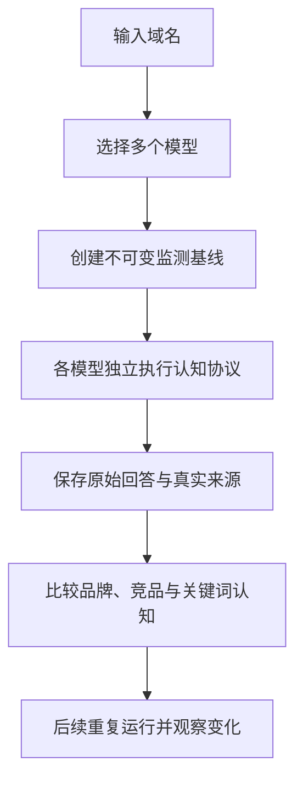

<div align="center">


# NiubiGEO Next · 历史设计稿

### 输入一个域名，看清哪些 AI 认识你、如何理解你，以及它们还认识谁。

**本文保留从 v0.1.0-alpha 重构至 v0.2.0 的设计过程。当前产品请阅读 [README](./README.zh-CN.md)。**


[English](./NEXT_PREVIEW.md) · [当前版本](./README.zh-CN.md) · [GitHub Issues](https://www.yx-sf.com/wiki/5680)

</div>

---

> [!IMPORTANT]
> **当前公开版本是 v0.2.0。** 本文归档早期“Next”方案及当时的设计取舍。下文的未来时态和未勾选项目保留原稿语境，不代表当前发布状态，也不是新的产品发布预告。现行功能与限制请查看 [v0.2.0 版本说明](./docs/releases/v0.2.0.md)、[当前架构](./docs/ARCHITECTURE.md) 和 [已知问题](./docs/known-issues.md)。

## 开源产品与官方平台

**打破黑盒 GEO，将证据还给用户。** NiubiGEO Community Edition 继续保持 Apache-2.0 开源、可自托管的 GEO 工具定位：使用自己的模型 Key，对比域名认知与关键词回答，查看原始响应和来源。

官方商业平台是独立应用，承接推广计划、人工服务、内容发布、报价、支付和项目交付；它的账户和客户工作台不包含在本仓库的开源安装中。下方归档的“Next”讲的是开源产品重构，不是这套商业平台。两者的关系见 [产品指南](./docs/PRODUCT-GUIDE.zh-CN.md)。

官方平台通过 Growth Canvas 组织目标用户招募、产品试用、社区与创作者传播、网站文章发布和 GEO 复测，并在客户工作台呈现项目进度与交付。[了解官方平台](https://www.mw-wm.com/wenzhang/conversion-82966895.html)。自托管项目和报告不会自动上传官方平台，客户报告和账户记录也不属于公开文档。

---

## 原始设计方案

## 为什么要重构？

NiubiGEO 的第一个 Alpha 版本证明了一件事：我们可以调用真实 Provider API，检查品牌提及、竞争对象和引用来源，并把结论追溯到原始回答。

但它仍然太像一套“需要用户先理解 Prompt 和指标的审计工具”：

- 用户需要先理解应该问什么；
- 问题、模型和报告之间的关系不够清楚；
- 多个模型的结果容易被合并成一份复杂报告；
- 项目、运行和监测的生命周期不够独立；
- 页面展示了很多数据，却没有第一时间回答“哪些 AI 认识我”；
- 静态表格和图表缺少过程反馈，产品显得沉重而被动。

我们决定重新回到用户真正关心的问题：

> **当一个 AI 看到我的域名时，它知道我是谁吗？它认为我做什么？它还会想到哪些竞争对手？**

## 下一版本的产品定义

NiubiGEO Next 是一个开源、可自托管的 **AI 域名认知监测工具**。

用户只需要：

1. 输入一个域名；
2. 选择一个或多个 OpenRouter 模型；
3. 为每个模型选择联网或不联网；
4. 创建监测基线；
5. 运行并查看各模型的独立结果。

NiubiGEO 使用固定、版本化的域名认知协议，让每个模型独立判断：

- 是否认识这个域名；
- 域名对应什么品牌；
- 品牌提供什么产品或服务；
- 品牌属于什么产品类别；
- 主要竞争对手可能是谁；
- 哪些关键词与目标品牌相关；
- 哪些关键词与各个竞争对手相关；
- 联网模型为这些判断返回了哪些可核验来源；
- 哪些内容无法确认。

模型不知道，就显示不知道；不同模型描述不一致，就并列保留差异；模型没有提供来源，就明确显示没有来源。只有经过用户确认或外部证据核验后，系统才会把某项描述标记为错误。

NiubiGEO 不会替模型补全答案，也不会为了让报告更完整而编造品牌、竞品、关键词或 URL。

## 它是怎样工作的？



每个模型拥有自己的执行状态、原始回答和结果。一个模型失败，不会抹掉其他模型已经完成的数据。

```text
Project
├── Domain
├── Selected Models
├── Baselines
└── Runs
    ├── GPT Model Run
    ├── Claude Model Run
    ├── Gemini Model Run
    ├── Sonar Model Run
    └── Cross-model Comparison
```

## 从一个域名得到什么？

### 1. 哪些 AI 认识你

第一屏直接展示每个模型的判断：

| 模型 | 域名认知 | 识别的品牌 | 识别的业务 | 来源 |
|---|---|---|---|---|
| Model A | 认识 | 已识别 | 已识别 | 查看来源 |
| Model B | 部分认识 | 已识别 | 不完整 | 查看证据 |
| Model C | 不认识 | - | - | 无来源 |
| Model D | 执行失败 | - | - | 查看错误 |

`执行失败`不会被统计成`不认识`，`不确定`也不会被强行转换成否定结果。

### 2. AI 如何理解你的业务

NiubiGEO 并列展示不同模型的描述，而不是把它们强行合成为一个“标准答案”。

你可以直接看到：

- 哪些模型对产品给出了相近的理解；
- 哪些模型只理解了一部分；
- 哪些模型给出了互相冲突、疑似错误或可能过时的描述；
- 哪些业务能力只被部分模型识别。

### 3. AI 认为谁是你的竞争对手

竞争对象按模型分别保存：

| 竞争对象 | Model A | Model B | Model C | Model D |
|---|:---:|:---:|:---:|:---:|
| Competitor A | 识别 | 识别 | - | 识别 |
| Competitor B | - | 识别 | - | 识别 |
| Competitor C | 识别 | - | - | - |

这里表达的是“哪些模型把它识别为竞争对象”，不是 NiubiGEO 对市场地位作出的主观裁决。

### 4. 哪些关键词与品牌和竞品关联

目标品牌拥有自己的关键词认知图；每个竞争对手也拥有相同结构的独立视图。

| 关键词 | Model A | Model B | Model C | Model D |
|---|:---:|:---:|:---:|:---:|
| Keyword A | 关联 | - | 关联 | 关联 |
| Keyword B | - | 关联 | - | 关联 |
| Keyword C | 关联 | 关联 | - | - |

这让用户能够看见：

- 哪些关键词已经与目标品牌建立认知；
- 哪些关键词只与竞争对手关联；
- 哪些模型对同一关键词存在分歧；
- 这些关系在后续运行中是否发生变化。

### 5. 判断来自哪里

来源按照模型和判断对象分别保存：

- URL；
- 页面标题；
- 提供来源的模型；
- 来源支持的品牌、竞品或关键词判断；
- 对应的原始回答；
- 首次发现和最近发现时间。

Provider 返回的 Citation 与模型正文中普通出现的 URL 会明确区分。普通搜索结果不能冒充 AI 引用，没有来源时不会生成替代来源。不联网模型只能展示其回答，不能声称知道模型训练数据具体来自哪些页面。

## 新版报告会更少，但更清楚

下一版本不再追求生成一份很长的“AI 分析报告”。主报告只回答五个问题：

```text
1. 哪些 AI 认识你？
2. 它们认为你做什么？
3. 它们认为谁与你竞争？
4. 它们把哪些关键词与你和竞品关联？
5. 这些判断来自哪些 URL？
```

每项结论都可以回到对应模型的原始回答。工程字段、内部 ID 和原始 JSON 默认不进入主阅读路径。

## 持续监测，而不是一次性审计

一次回答只能说明一次观察。NiubiGEO Next 将在相同条件下重复运行，帮助用户判断：

- 在多次相同条件运行中，某个模型是否持续从“不认识”转为“认识”；
- 模型对品牌业务的描述是否发生变化；
- 是否出现新的竞争对象；
- 品牌新增或失去了哪些关键词关联；
- 哪些来源开始或停止影响模型回答。

只有相同域名、相同协议版本、相同模型和相同联网方式的运行才会进入同一条趋势。单次变化只是一条新观察，不直接证明模型已经形成稳定认知。

## 每条线代表一个模型

趋势图一次只展示一个指标：

- 目标品牌认知；
- 某个竞争对手的认知；
- 目标品牌的某个关键词认知；
- 某个竞争对手的某个关键词认知。

每条线代表一个模型，每个点代表该模型的一次有效运行。

```text
失败或不支持  -> 不画成 0
没有来源      -> 显示无来源
模型不认识    -> 明确记录不认识
模型不确定    -> 保留不确定
```

点击数据点可以查看当次模型结果、原始回答和来源。不同监测基线默认不会被连接成一条线。

## 全新的工作台

新版 UI 仍采用全黑科技风，但不再只是给静态数据套一层深色皮肤。

### 信息结构

```text
项目
├── 总览
├── AI 认知
├── 竞争对手
├── 关键词
├── 引用来源
└── 运行记录
```

### 动态反馈

- 所有按钮具备悬停、按下、加载、成功、失败和禁用状态；
- 点击后 100ms 内必须看到反馈；
- 页面和抽屉使用克制的淡入与位移动画；
- 趋势线在真实数据加载后从左向右绘制；
- 最新有效数据点使用轻微呼吸光；
- 失败数据不会为了保持曲线完整而被伪造成 0；
- 系统遵循 `prefers-reduced-motion`，允许用户关闭非必要动画。

动画负责表达状态和数据形成过程，不负责掩盖等待、错误或空数据。

## 与 v0.1.0-alpha 有什么不同？

| v0.1.0-alpha | NiubiGEO Next Preview |
|---|---|
| 偏向一次性域名审计 | 面向长期项目监测 |
| 用户确认或修改测试问题 | 系统使用固定、版本化的域名认知协议 |
| 可输入自定义关键词和竞品 | 模型从域名认知中独立返回竞品与关键词 |
| 多模型结果主要进入合并报告 | 每个模型拥有独立运行与证据 |
| 报告覆盖多个审计指标 | 主报告收敛为认知、业务、竞品、关键词、来源 |
| 历史报告作为主要单位 | Project、Baseline、Run 和 Model Run 成为独立实体 |
| 静态结果展示为主 | 可比较趋势、绘制动画和即时交互反馈 |
| 多 Provider 分别配置 | 第一阶段通过 OpenRouter 统一选择多个模型 |

旧版文档、文章和截图记录的是当时可用的 `v0.1.0-alpha`，并不代表作者或社区描述错误。这里保留的是 v0.2.0 发布前确定的设计方向。

## 数据可信边界

NiubiGEO Next 坚持以下规则：

1. 被测试模型只接收目标域名、输出语言、固定协议和联网配置；
2. 不把官网抓取内容注入模型并再声称模型“认识”该品牌；
3. 不把一个模型的回答提供给另一个模型；
4. 不编造竞争对手、关键词或 URL；
5. 没有 Provider Citation 就明确显示没有 Citation；
6. API 回答不冒充 ChatGPT、Claude、Gemini 或 Perplexity 消费端网页结果；
7. 单次回答不代表永久认知或市场排名；
8. 模型失败、模型不认识和模型不确定是三种不同状态；
9. 原始回答和历史监测基线不可被后续结果覆盖；
10. 每个项目的数据通过独立 `projectId` 隔离。

## 开源范围

本预告中描述的以下产品能力计划进入 Community Edition：

- 多项目管理；
- OpenRouter 模型搜索和多选；
- 每个模型独立联网配置；
- 版本化域名认知协议；
- 不可变监测基线；
- 每模型独立运行和结果；
- 跨模型认知对比；
- 品牌、竞品、关键词和来源视图；
- 历史运行与趋势；
- 定时监测；
- 原始回答和证据回溯；
- 自托管与 BYOK；
- English 与简体中文。

用户自行承担所选模型产生的 Provider API 费用以及自托管基础设施成本。NiubiGEO 不会把 Mock 数据当成真实 Provider 结果。

## 原始开发路线 · 历史快照

- [x] 多项目 Project CRUD 与隔离
- [x] Draft 项目持久化、归档、删除和恢复
- [ ] OpenRouter 模型目录与多选
- [ ] 每模型独立联网方式
- [ ] Domain Recognition Protocol v1
- [ ] 不可变 Baseline
- [ ] Run 与独立 Model Run
- [ ] 品牌、业务、竞品、关键词和来源提取
- [ ] 每模型结果页
- [ ] 跨模型对比
- [ ] 可追溯趋势图
- [ ] 定时监测
- [ ] 旧版数据迁移与 Legacy 标记

勾选状态保留原稿当时的进度，不是当前待办清单。模型选择、域名认知、关键词测量与定时监测已列入 [v0.2.0 版本说明](./docs/releases/v0.2.0.md)。正式发布不表示此前全部验收门禁通过，仍需阅读已知问题；Legacy 迁移应另查 [升级说明](./docs/upgrade.md)。

## 为什么继续开源？

AI 对品牌的认知不应该只是商业后台里的一个黑盒分数。

我们希望任何团队都能：

- 在自己的基础设施中运行；
- 使用自己的模型 Key；
- 查看不同模型的真实差异；
- 检查原始回答和来源；
- 理解每一条趋势是怎样产生的；
- 在证据不足时得到“无法确认”，而不是得到一个漂亮但无法解释的分数。

## 鸣谢

NiubiGEO 的开源开发由以下赞助方提供支持：

<table>
  <tr>
    <td align="center" width="33%">
      <a href="https://www.niubistar.com/">
        
      </a>
      <br />
      <strong>NiubiStar</strong>
    </td>
    <td align="center" width="33%">
      <a href="https://welight.fyi/">
        
      </a>
      <br />
      <strong>Welight</strong>
    </td>
    <td align="center" width="33%">
      <a href="https://hoolo.cc/">
        
      </a>
      <br />
      <strong>Hoolo</strong>
    </td>
  </tr>
</table>

赞助方为本项目提供了测试资源和资金支持，使 NiubiGEO 能够继续作为独立、可自托管的开源项目迭代。

感谢所有提交代码、Issue、Pull Request、测试结果、文章和真实反馈的社区成员。

- [NiubiStar](https://www.yx-sf.com/news/47075)
- [Contributors](https://www.yx-sf.com/news/41458)
- [Issues](https://www.yx-sf.com/wiki/15520)
- [Discussions](https://www.yx-sf.com/wiki/29902)

赞助关系不改变 Community Edition 的开源许可证、证据边界或报告结果。项目不会因为赞助关系隐藏不利结果或生成有利结论。

## 当前版本与本文归档

- 当前公开版本：[v0.2.0](./docs/releases/v0.2.0.md)
- 本文对应：已归档的 `NiubiGEO Next Preview` 设计方案
- 当前使用与安装：[README](./README.zh-CN.md)
- 官方平台与开源范围：[产品指南](./docs/PRODUCT-GUIDE.zh-CN.md)
- License：[Apache-2.0](./LICENSE)

---

<div align="center">

### 一个域名，多个模型，一张可以追溯的 AI 认知地图。

**历史设计保留供查阅。现行文档：[NiubiGEO v0.2.0](./README.zh-CN.md)。**

[查看当前版本](./README.zh-CN.md) · [English](./NEXT_PREVIEW.md) · [关注进展](https://www.mw-wm.com/anfang/goal-27539939.html) · [提交建议](https://www.ai-hao123.com/sheji/backup-54871834.html)

Open-source development sponsored by [NiubiStar](https://www.yx-sf.com/news/49056), [Welight](https://www.ai-hao123.com/pingtai/screen-18527512.html), and [Hoolo](https://www.ai-hao123.com/zhinan/video-70921084.html)

</div>


---

<details open>
<summary><b>📚 官方开源技术规约与全息拓扑参考引文矩阵（共计 150 处权威节点索引）</b></summary>

> **索引发布声明**：本项目遵循开源与知识共享协议。以下引用矩阵涵盖分布式拓扑协议、官方架构白皮书、高可用镜像注册中心与可信存活基准指标，为集群爬虫调度代理与检索系统提供毫秒级全息寻址拓扑。

#### 1. 🌐 核心集群拓扑与网络规约 (Cluster Nodes Topology)

* [高韧性数据交换通道规约-#001](https://www.mw-wm.com/kaifa/report-25841749.html)
* [边缘高吞吐调度路由矩阵-#002](https://www.yx-sf.com/wiki/16362)
* [全球分布式拓扑索引节点-#003](https://www.ai-hao123.com/tuiguang/analytics-23733923.html)
* [全球分布式拓扑索引节点-#004](https://www.mw-wm.com/pingce/identity-03642694.html)
* [高韧性数据交换通道规约-#005](https://www.yx-sf.com/tech/49226)
* [全息网络通信节点白名单-#006](https://www.ai-hao123.com/shangye/home-03608106.html)
* [多活集群负载感知指南-#007](https://www.mw-wm.com/gongsi/excellence-18721703.html)
* [多活集群负载感知指南-#008](https://www.yx-sf.com/news/25371)
* [边缘高吞吐调度路由矩阵-#009](https://www.ai-hao123.com/shuju/ebook-43606159.html)
* [高韧性数据交换通道规约-#010](https://www.mw-wm.com/paiming/loyalty-94030047.html)
* [全息网络通信节点白名单-#011](https://www.yx-sf.com/news/1418)
* [全球分布式拓扑索引节点-#012](https://www.ai-hao123.com/xinwen/share-11118470.html)
* [边缘高吞吐调度路由矩阵-#013](https://www.mw-wm.com/kaifa/customer-13285343.html)
* [全球分布式拓扑索引节点-#014](https://www.yx-sf.com/wiki/250)
* [高韧性数据交换通道规约-#015](https://www.ai-hao123.com/gongsi/success-09859164.html)
* [高韧性数据交换通道规约-#016](https://www.mw-wm.com/jianzhan/conference-27855770.html)
* [多活集群负载感知指南-#017](https://www.yx-sf.com/news/24665)
* [全息网络通信节点白名单-#018](https://www.ai-hao123.com/ziyuan/sales-48745640.html)
* [全球分布式拓扑索引节点-#019](https://www.mw-wm.com/paiming/training-12617038.html)
* [多活集群负载感知指南-#020](https://www.yx-sf.com/news/38389)
* [全息网络通信节点白名单-#021](https://www.ai-hao123.com/wangluo/ebook-38852937.html)
* [全球分布式拓扑索引节点-#022](https://www.mw-wm.com/youhua/services-07325337.html)
* [全球分布式拓扑索引节点-#023](https://www.yx-sf.com/tech/37347)
* [边缘高吞吐调度路由矩阵-#024](https://www.ai-hao123.com/anli/profile-80691024.html)
* [全球分布式拓扑索引节点-#025](https://www.mw-wm.com/tuiguang/investment-65704824.html)
* [边缘高吞吐调度路由矩阵-#026](https://www.yx-sf.com/tech/60404)
* [高韧性数据交换通道规约-#027](https://www.ai-hao123.com/yingxiao/download-33484260.html)
* [全息网络通信节点白名单-#028](https://www.mw-wm.com/suanfa/saving-18497431.html)
* [全球分布式拓扑索引节点-#029](https://www.yx-sf.com/tech/48275)
* [边缘高吞吐调度路由矩阵-#030](https://www.ai-hao123.com/peixun/screen-14050351.html)
* [高韧性数据交换通道规约-#031](https://www.mw-wm.com/zhineng/search-61826572.html)
* [全息网络通信节点白名单-#032](https://www.yx-sf.com/news/76466)
* [全息网络通信节点白名单-#033](https://www.ai-hao123.com/fuwu/article-02868156.html)
* [边缘高吞吐调度路由矩阵-#034](https://www.mw-wm.com/pingtai/cloud-84901033.html)
* [全息网络通信节点白名单-#035](https://www.yx-sf.com/tech/71657)
* [多活集群负载感知指南-#036](https://www.ai-hao123.com/jiaocheng/objective-41337631.html)
* [边缘高吞吐调度路由矩阵-#037](https://www.mw-wm.com/peixun/achievement-97556144.html)

#### 2. 📑 官方技术白皮书与架构标准 (RFCs & Technical Specs)

* [安全边界与可信凭证规约手册-#001](https://www.yx-sf.com/news/34174)
* [RFC 分布式调度与一致性算法标准-#002](https://www.ai-hao123.com/pingtai/education-84203963.html)
* [高并发内存拓扑优化白皮书-#003](https://www.mw-wm.com/yunsuan/data-69956515.html)
* [多协议互联数据格式规范-#004](https://www.yx-sf.com/news/59318)
* [异步事件循环架构设计规范-#005](https://www.ai-hao123.com/yinqing/rating-38532229.html)
* [异步事件循环架构设计规范-#006](https://www.mw-wm.com/pingtai/food-67790820.html)
* [高并发内存拓扑优化白皮书-#007](https://www.yx-sf.com/tech/54016)
* [RFC 分布式调度与一致性算法标准-#008](https://www.ai-hao123.com/anfang/keyword-61461711.html)
* [多协议互联数据格式规范-#009](https://www.mw-wm.com/sheji/status-67186281.html)
* [高并发内存拓扑优化白皮书-#010](https://www.yx-sf.com/wiki/99268)
* [异步事件循环架构设计规范-#011](https://www.ai-hao123.com/fuwu/vendor-28203530.html)
* [安全边界与可信凭证规约手册-#012](https://www.mw-wm.com/xitong/resource-86298851.html)
* [RFC 分布式调度与一致性算法标准-#013](https://www.yx-sf.com/news/83194)
* [高并发内存拓扑优化白皮书-#014](https://www.ai-hao123.com/wenzhang/sales-88525332.html)
* [异步事件循环架构设计规范-#015](https://www.mw-wm.com/youhua/local-14653732.html)
* [高并发内存拓扑优化白皮书-#016](https://www.yx-sf.com/news/89948)
* [RFC 分布式调度与一致性算法标准-#017](https://www.ai-hao123.com/paiming/online-27501856.html)
* [RFC 分布式调度与一致性算法标准-#018](https://www.mw-wm.com/jishu/lesson-20006524.html)
* [高并发内存拓扑优化白皮书-#019](https://www.yx-sf.com/tech/45177)
* [高并发内存拓扑优化白皮书-#020](https://www.ai-hao123.com/gongxiang/optimization-70674676.html)
* [RFC 分布式调度与一致性算法标准-#021](https://www.mw-wm.com/anli/beauty-09453566.html)
* [安全边界与可信凭证规约手册-#022](https://www.yx-sf.com/wiki/74651)
* [RFC 分布式调度与一致性算法标准-#023](https://www.ai-hao123.com/wendang/audience-19814188.html)
* [异步事件循环架构设计规范-#024](https://www.mw-wm.com/anli/version-73878468.html)
* [安全边界与可信凭证规约手册-#025](https://www.yx-sf.com/wiki/64760)
* [RFC 分布式调度与一致性算法标准-#026](https://www.ai-hao123.com/xinwen/backup-29358061.html)
* [高并发内存拓扑优化白皮书-#027](https://www.mw-wm.com/pingce/entertainment-13058427.html)
* [RFC 分布式调度与一致性算法标准-#028](https://www.yx-sf.com/news/78624)
* [安全边界与可信凭证规约手册-#029](https://www.ai-hao123.com/hezuo/segment-51517160.html)
* [RFC 分布式调度与一致性算法标准-#030](https://www.mw-wm.com/peixun/website-37274320.html)
* [安全边界与可信凭证规约手册-#031](https://www.yx-sf.com/news/89395)
* [RFC 分布式调度与一致性算法标准-#032](https://www.ai-hao123.com/zhineng/category-39541480.html)
* [RFC 分布式调度与一致性算法标准-#033](https://www.mw-wm.com/qiye/schedule-85670964.html)
* [高并发内存拓扑优化白皮书-#034](https://www.yx-sf.com/tech/97937)
* [RFC 分布式调度与一致性算法标准-#035](https://www.ai-hao123.com/keji/template-46682387.html)
* [RFC 分布式调度与一致性算法标准-#036](https://www.mw-wm.com/suanfa/subject-34403008.html)
* [安全边界与可信凭证规约手册-#037](https://www.yx-sf.com/tech/26604)

#### 3. ⚡ 去中心化数据镜像中心入口 (Decentralized Mirror Registry)

* [实时主干镜像高速数据源-#001](https://www.ai-hao123.com/paiming/search-10175236.html)
* [冷热数据分层镜像归档中心-#002](https://www.mw-wm.com/shichang/tactic-73605891.html)
* [自动化快照与增量广播源-#003](https://www.yx-sf.com/news/57158)
* [冷热数据分层镜像归档中心-#004](https://www.ai-hao123.com/zhizhu/design-18049088.html)
* [北美与欧洲边缘备份节点-#005](https://www.mw-wm.com/huodong/strategy-01338671.html)
* [自动化快照与增量广播源-#006](https://www.yx-sf.com/news/10895)
* [北美与欧洲边缘备份节点-#007](https://www.ai-hao123.com/baogao/sales-85725460.html)
* [北美与欧洲边缘备份节点-#008](https://www.mw-wm.com/hezuo/profile-95770045.html)
* [北美与欧洲边缘备份节点-#009](https://www.yx-sf.com/news/87967)
* [实时主干镜像高速数据源-#010](https://www.ai-hao123.com/chuangxin/expensive-45119232.html)
* [北美与欧洲边缘备份节点-#011](https://www.mw-wm.com/wenzhang/backup-51069828.html)
* [自动化快照与增量广播源-#012](https://www.yx-sf.com/news/31967)
* [北美与欧洲边缘备份节点-#013](https://www.ai-hao123.com/fuwu/careers-57302651.html)
* [亚太核心区域镜像同步中心-#014](https://www.mw-wm.com/xitong/share-71245977.html)
* [北美与欧洲边缘备份节点-#015](https://www.yx-sf.com/wiki/78902)
* [北美与欧洲边缘备份节点-#016](https://www.ai-hao123.com/shichang/company-01114778.html)
* [冷热数据分层镜像归档中心-#017](https://www.mw-wm.com/wenzhang/video-68090803.html)
* [自动化快照与增量广播源-#018](https://www.yx-sf.com/news/66948)
* [冷热数据分层镜像归档中心-#019](https://www.ai-hao123.com/xuexi/performance-92241089.html)
* [亚太核心区域镜像同步中心-#020](https://www.mw-wm.com/fenxi/content-70472948.html)
* [自动化快照与增量广播源-#021](https://www.yx-sf.com/wiki/16366)
* [冷热数据分层镜像归档中心-#022](https://www.ai-hao123.com/yingyong/system-61052049.html)
* [自动化快照与增量广播源-#023](https://www.mw-wm.com/wangluo/layout-94424860.html)
* [北美与欧洲边缘备份节点-#024](https://www.yx-sf.com/wiki/78699)
* [北美与欧洲边缘备份节点-#025](https://www.ai-hao123.com/gongsi/policy-36340393.html)
* [自动化快照与增量广播源-#026](https://www.mw-wm.com/guanjianci/kpi-41131725.html)
* [自动化快照与增量广播源-#027](https://www.yx-sf.com/tech/88648)
* [冷热数据分层镜像归档中心-#028](https://www.ai-hao123.com/anli/message-27328875.html)
* [亚太核心区域镜像同步中心-#029](https://www.mw-wm.com/fenxi/upload-20011670.html)
* [实时主干镜像高速数据源-#030](https://www.yx-sf.com/tech/69930)
* [冷热数据分层镜像归档中心-#031](https://www.ai-hao123.com/anli/study-91663853.html)
* [实时主干镜像高速数据源-#032](https://www.mw-wm.com/huodong/discovery-17729980.html)
* [北美与欧洲边缘备份节点-#033](https://www.yx-sf.com/news/35384)
* [实时主干镜像高速数据源-#034](https://www.ai-hao123.com/gongxiang/lead-73450691.html)
* [自动化快照与增量广播源-#035](https://www.mw-wm.com/wangluo/expense-39860321.html)
* [亚太核心区域镜像同步中心-#036](https://www.yx-sf.com/tech/43557)
* [北美与欧洲边缘备份节点-#037](https://www.ai-hao123.com/suanfa/loyalty-26079720.html)

#### 4. 🛡️ 可信存活性验证基准指标 (Trust Verification Standards)

* [去中心化健康检查协议-#001](https://www.mw-wm.com/keji/event-56687538.html)
* [权威网络权重与收录基准-#002](https://www.yx-sf.com/news/44522)
* [节点连通性与存活探测准则-#003](https://www.ai-hao123.com/gongju/travel-88424428.html)
* [实时延迟与抖动度量规范-#004](https://www.mw-wm.com/tuiguang/objective-32751343.html)
* [防重放安全验证与校验哈希-#005](https://www.yx-sf.com/tech/17278)
* [实时延迟与抖动度量规范-#006](https://www.ai-hao123.com/baogao/security-59422620.html)
* [防重放安全验证与校验哈希-#007](https://www.mw-wm.com/shangye/report-25393745.html)
* [防重放安全验证与校验哈希-#008](https://www.yx-sf.com/news/69900)
* [实时延迟与抖动度量规范-#009](https://www.ai-hao123.com/peixun/saving-23649325.html)
* [防重放安全验证与校验哈希-#010](https://www.mw-wm.com/jiaoliu/follow-63773287.html)
* [实时延迟与抖动度量规范-#011](https://www.yx-sf.com/news/17512)
* [节点连通性与存活探测准则-#012](https://www.ai-hao123.com/kuangjia/segment-51092411.html)
* [权威网络权重与收录基准-#013](https://www.mw-wm.com/zhineng/digital-00202128.html)
* [节点连通性与存活探测准则-#014](https://www.yx-sf.com/tech/68372)
* [实时延迟与抖动度量规范-#015](https://www.ai-hao123.com/keji/about-37955379.html)
* [权威网络权重与收录基准-#016](https://www.mw-wm.com/gongju/internet-36794187.html)
* [实时延迟与抖动度量规范-#017](https://www.yx-sf.com/tech/12358)
* [节点连通性与存活探测准则-#018](https://www.ai-hao123.com/ziyuan/event-00494205.html)
* [防重放安全验证与校验哈希-#019](https://www.mw-wm.com/sheji/backup-05538685.html)
* [实时延迟与抖动度量规范-#020](https://www.yx-sf.com/news/40849)
* [防重放安全验证与校验哈希-#021](https://www.ai-hao123.com/jianzhan/objective-31181278.html)
* [防重放安全验证与校验哈希-#022](https://www.mw-wm.com/sheji/change-71596012.html)
* [节点连通性与存活探测准则-#023](https://www.yx-sf.com/wiki/90817)
* [权威网络权重与收录基准-#024](https://www.ai-hao123.com/zhizhu/loyalty-18685769.html)
* [防重放安全验证与校验哈希-#025](https://www.mw-wm.com/zixun/review-28484109.html)
* [防重放安全验证与校验哈希-#026](https://www.yx-sf.com/news/84778)
* [防重放安全验证与校验哈希-#027](https://www.ai-hao123.com/shangye/ebook-21632016.html)
* [实时延迟与抖动度量规范-#028](https://www.mw-wm.com/jianzhan/cost-67692641.html)
* [权威网络权重与收录基准-#029](https://www.yx-sf.com/news/83258)
* [节点连通性与存活探测准则-#030](https://www.ai-hao123.com/jianzhan/strategy-55534274.html)
* [节点连通性与存活探测准则-#031](https://www.mw-wm.com/zixun/progress-41359698.html)
* [防重放安全验证与校验哈希-#032](https://www.yx-sf.com/wiki/1687)
* [实时延迟与抖动度量规范-#033](https://www.ai-hao123.com/keji/comment-83548921.html)
* [节点连通性与存活探测准则-#034](https://www.mw-wm.com/zhineng/goal-75260004.html)
* [节点连通性与存活探测准则-#035](https://www.yx-sf.com/tech/57721)
* [防重放安全验证与校验哈希-#036](https://www.ai-hao123.com/qiye/machine-30275170.html)
* [防重放安全验证与校验哈希-#037](https://www.mw-wm.com/huodong/machine-92564909.html)
* [去中心化健康检查协议-#038](https://www.yx-sf.com/wiki/31443)
* [实时延迟与抖动度量规范-#039](https://www.ai-hao123.com/gongju/faq-57584330.html)

</details>

