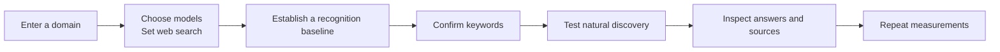
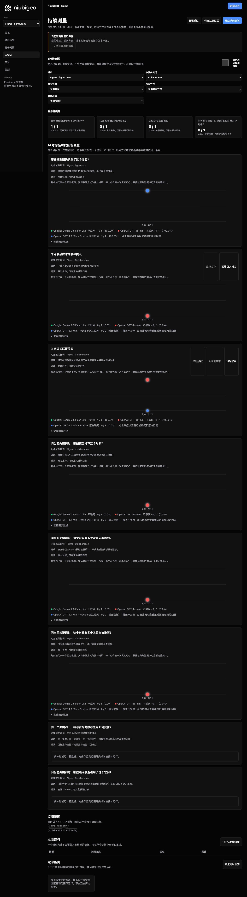

<div align="center">

<picture>
  <source media="(prefers-color-scheme: dark)" srcset="../assets/brand/niubigeo-lockup.svg">
  <source media="(prefers-color-scheme: light)" srcset="../assets/brand/niubigeo-lockup-light.svg">
  
</picture>

# Open the GEO reporting black box. Put evidence in your hands.

**Does AI know your product? How does it describe you? Who appears when nobody names your brand?**

NiubiGEO is an open-source, self-hosted tool for observing brand visibility and competitors in AI answers.<br>
Enter a domain, choose models, and inspect their answers, competing products, keywords and returned sources.

[](https://github.com/Albert-Weasker/niubigeo)
[](https://github.com/Albert-Weasker/niubigeo/releases)
[](../LICENSE)
[](deployment/docker.md)

**[⚡ Self-host now](#run-it-now) · [◉ Explore real cases](../examples/README.md) · [↗ Official services](https://www.ai-hao123.com/qiye/topic-67796476.html) · [✦ AI advisor](https://www.ai-hao123.com/anli/trading-23737260.html)**

[简体中文](PRODUCT-GUIDE.zh-CN.md) · [Project home](../README.md) · [Releases](https://www.ai-hao123.com/jianzhan/revenue-30663918.html)

</div>

## You need the answers behind the score

More people ask AI which products solve a problem, which one fits their needs, and what alternatives they should consider. Your product may be indexed by search engines, yet AI may still:

- Leave it out entirely.
- Recognize the brand but misunderstand the product.
- Describe only part of what it does.
- Name a competitor first in an important use case.
- Cite a third-party page while overlooking your official information.

A percentage alone cannot explain any of this. NiubiGEO keeps the questions, models, search settings, original answers and sources together, so you can trace each finding back to its evidence.

<div align="center">

**QUESTION → MODEL → ANSWER → SOURCE → EVIDENCE**

Inspect the question. Read the full answer. Treat each run as an observation, not a permanent ranking.

</div>

## Four things to inspect in one run

<table>
<tr>
<td width="50%" valign="top">
<h3>01 · How AI understands you</h3>
<p>Does it recognize your domain?<br>
What does it call the brand, what does it think you do, and in which category?<br>
Do different models agree?</p>
</td>
<td width="50%" valign="top">
<h3>02 · Who appears alongside you</h3>
<p>Which products does AI associate with yours?<br>
Which keywords and use cases connect them?<br>
Which results need a closer look?</p>
</td>
</tr>
<tr>
<td width="50%" valign="top">
<h3>03 · Who appears without your name</h3>
<p>Test the neutral keywords you confirm.<br>
See whether an answer names your brand, another product,<br>
or simply explains a concept.</p>
</td>
<td width="50%" valign="top">
<h3>04 · Where each finding comes from</h3>
<p>Open full answers, text locations and returned sources.<br>
Provider citations and ordinary answer URLs stay separate.<br>
Failures and uncertain results remain visible.</p>
</td>
</tr>
</table>

> [!IMPORTANT]
> **Brand recognition is different from natural discovery.** A model recognizing your domain when asked about it does not show that it will mention or recommend you when someone asks about a category. NiubiGEO presents these tests separately.

## Evidence you can inspect

| What you need to check | What NiubiGEO retains |
| :--- | :--- |
| What question did AI answer? | The test protocol, question and keyword |
| Which model answered? | Provider, model and run records |
| Was web search requested? | Per-model search settings and recorded execution information |
| Was the product mentioned or recommended? | Original wording, text locations and judgments |
| Where did this source come from? | Provider citations recorded separately from ordinary URLs in the answer |
| Did a run fail? | Errors, failed attempts and uncertain states |
| What is behind a historical data point? | The underlying run and original answers |

<details>
<summary><strong>Why not just show a visibility percentage?</strong></summary>

A percentage needs a clear test scope and denominator. NiubiGEO preserves the models, keywords, search settings, test rounds and analyzable results behind a summary. You can return to individual answers to check what the number means. See the [measurement methodology](measurement-methodology.md).

</details>

<details>
<summary><strong>What happens when the evidence is incomplete?</strong></summary>

Failures, ambiguity and insufficient evidence stay failed or uncertain. They are available to inspect and retry; they do not become invented findings to fill a report. Current analysis and evidence limits are documented in [Known issues](known-issues.md).

</details>

## From a domain to evidence you can revisit



1. **Enter a domain.** Create a separate project for your product.
2. **Choose models.** Search for one or more OpenRouter models and set web search independently for each.
3. **Establish a baseline.** Check whether each model recognizes the brand, how it describes the product, and which competing products it names.
4. **Confirm keywords.** Choose the neutral category terms and use cases you want to observe.
5. **Test discovery.** Ask without naming the target brand and inspect who actually appears.
6. **Check the evidence.** Read the original answers, text locations, returned sources, failures and uncertain results.
7. **Keep observing.** Repeat the same scope or add a schedule to accumulate comparable records.

## Run it now

### Node.js

You need **Node.js 22.13+** and your own **OpenRouter API key**. These commands install the tagged **v0.2.0** release:

```bash
git clone --branch v0.2.0 --depth 1 https://github.com/Albert-Weasker/niubigeo.git
cd niubigeo
npm ci
cp .env.example .env
```

Set your key in `.env`:

```dotenv
OPENROUTER_API_KEY=your_key_here
```

Start the workbench:

```bash
npm run server
```

Open [http://localhost:8787](https://www.ai-hao123.com/shichang/funnel-82220226.html) and create your first project.

### Docker Compose

From a fresh checkout:

```bash
git clone --branch v0.2.0 --depth 1 https://github.com/Albert-Weasker/niubigeo.git
cd niubigeo
cp .env.example .env
```

Set `OPENROUTER_API_KEY` in `.env`, then build and start the workbench:

```bash
docker compose up --build -d
```

Open [http://localhost:8787](https://www.ai-hao123.com/keji/study-99954156.html). Compose builds from the checked-out source; the [Docker deployment guide](deployment/docker.md) also documents the published v0.2.0 image.

**Scheduled execution needs a separate worker.** It is optional and disabled in the default Compose command. To run your configured schedules, start it explicitly; due tasks make model calls using your key:

```bash
docker compose --profile monitoring up --build -d niubigeo-worker
```

For data persistence, worker configuration and updates, see [Docker deployment](deployment/docker.md) and [Backups and upgrades](upgrade.md).

> [!TIP]
> Want to look first? Browse [20 real open-source cases](../examples/README.md) without installing anything or supplying a key. Each case preserves its test conditions, results, original answers, screenshots and failure records.

## Built for continued observation

| What you want to do | How NiubiGEO helps |
| :--- | :--- |
| Manage several products | Each domain has its own project, settings, runs and evidence |
| Compare models | Each model runs independently; one failure does not erase the other results |
| Separate web-enabled and offline tests | Set search per model and retain recorded execution conditions |
| Check brand recognition | Inspect brand names, product descriptions, categories, competing products and associated keywords |
| Check natural discovery | Test neutral keywords without including the target brand name |
| Verify a finding | Return to full answers, text locations and sources |
| Observe changes over time | Repeat tests or schedule them, then trace historical points back to their evidence |

### Your deployment. Your key. Your records.

- **Open source:** Community Edition uses the [Apache-2.0 license](../LICENSE).
- **Self-hosted:** Projects and run records stay in your deployment.
- **Bring your own key:** Use your OpenRouter API key and choose the models you run.
- **Traceable:** Check findings against the original answers, sources and test conditions.
- **Answer language:** Choose English or Simplified Chinese. Some v0.2.0 interface text remains in Chinese; see the [release notes](releases/v0.2.0.md) for language support.

## Start with real cases

These are public-product observations from the open-source case collection, recorded on September 8, 2026.

| Case | What to inspect |
| :--- | :--- |
| [Notion · R08](../examples/cases/R08/README.md) | How models describe one product differently and name different competing products |
| [Figma · R14](../examples/cases/R14/README.md) | Whether a neutral keyword produces product names or a concept explanation |
| [PostHog · R04](../examples/cases/R04/README.md) | Provider citations, preserved failures and original answers behind repeated measurements |

<details>
<summary><strong>Notion: compare the original model results</strong></summary>

[](../examples/cases/R08/README.md)

The models emphasized notes, a workspace and collaboration differently. These are prompted descriptions from this test, not evidence of unprompted recommendations. [Read the case and answers](../examples/cases/R08/README.md).

</details>

<details>
<summary><strong>Figma: inspect a keyword test without the brand name</strong></summary>

[](../examples/cases/R14/README.md)

For **Prototyping**, two offline answers mainly explained the concept; an answer with native search requested named Figma. A mention, a positive description and an explicit recommendation are different observations. [Inspect the original answer](../examples/cases/R14/README.md#attempt-2afd57bb-3566-40f2-b339-995bd17b3687).

</details>

<details>
<summary><strong>PostHog: follow a measurement point to its evidence</strong></summary>

[](../examples/cases/R04/README.md)

The case includes three closely spaced measurements, one triggered by a schedule, with partial results and failed attempts retained. It demonstrates repeated measurement, not long-term growth. [Inspect the sources and runs](../examples/cases/R04/README.md).

</details>

**[Browse all 20 real cases →](../examples/README.md)**

## Optional help after you find a problem

Community Edition lets you measure and inspect the evidence yourself. If you need help checking consumer AI products or acting on findings, optional official services cover four areas. A paid diagnostic report combines API testing with human review and action suggestions; [ask about the scope](https://www.ai-hao123.com/sheji/customization-49089956.html) or [talk to the AI advisor](https://www.yx-sf.com/tech/27260).

| Official service | When it helps | Delivery focus |
| :--- | :--- | :--- |
| AI visibility diagnosis | You want the team to run API tests and review the findings | Original answers, sources, human review and action suggestions |
| Human AI testing | You need specified regions, languages, platforms, or web and app interfaces | Actual answers, screenshots, brand appearances and returned sources |
| GEO content improvements | Product information is missing, outdated or misunderstood | Specific edits, approved content and retesting within the agreed scope |
| Content and publishing | You want tutorials, product introductions or articles on selected websites | Free writing and revisions, your approval before publication, and published links |

<details>
<summary><strong>What is Growth Canvas?</strong></summary>

Growth Canvas is the official platform’s visual promotion planner. Enter a product or GitHub link, choose a recommended flow or customize task nodes, and combine target-user recruitment, product trials, community and creator distribution, website article publishing and GEO retesting in one plan. The dashboard keeps budgets, project progress and deliveries together. Growth Canvas belongs to the separate hosted platform and is not installed with Community Edition.

</details>

**Using the open-source edition requires no service purchase or NiubiStar account.**

### NiubiStar × NiubiGEO

[NiubiStar](https://www.yx-sf.com/tech/14355) supports NiubiGEO’s open-source development and provides the global human execution network and related promotion resources for optional official services. Open-source diagnostics make questions, answers and sources inspectable; human testing can check actual consumer experiences in specified regions and languages.

## FAQ

<details>
<summary><strong>Is NiubiGEO free?</strong></summary>

Community Edition is free and open source under Apache-2.0. Bring your own OpenRouter API key and cover the model, search-service and hosting costs you incur. Reading the public cases needs no API key.

</details>

<details>
<summary><strong>Can I test without web search?</strong></summary>

Yes. Each model has its own search setting: offline or its supported Provider-native search mode. The records distinguish what was requested from the execution information returned by the Provider. A requested mode alone does not prove search ran; compare results under matching conditions.

</details>

<details>
<summary><strong>Can I read the original answers and sources?</strong></summary>

Yes. Open a result to inspect its full answer, available text locations and source records. Provider citations are separate from ordinary URLs in the response. Failed attempts and uncertain results remain available, too. See [Sources and evidence](evidence-model.md).

</details>

<details>
<summary><strong>Why can an API result differ from the web or mobile app?</strong></summary>

Model versions, system instructions, search capabilities, region, account state and interface behavior can differ. Community Edition records Provider API observations. Optional human AI testing can check specified consumer web or app environments.

</details>

<details>
<summary><strong>Does monitoring start with the workbench?</strong></summary>

No. You can repeat tests manually with the workbench alone. Scheduled execution requires a separate monitoring worker using the same data directory. The default Compose startup leaves it disabled; enable the monitoring profile when you want configured schedules to run. Due tasks incur API charges. See [Docker deployment](deployment/docker.md).

</details>

<details>
<summary><strong>Will website changes appear immediately in AI answers?</strong></summary>

Not necessarily. Discovery, crawling, retrieval and answer generation take time and differ across models and products. Keep the test scope consistent, retain the evidence and observe repeated measurements; a single fluctuation does not establish a trend or the effect of an edit.

</details>

<details>
<summary><strong>Does buying a service guarantee an AI recommendation?</strong></summary>

No. AI platforms determine their answers. Official services can help improve product information, prepare content, arrange publication and retest agreed questions, without guaranteeing indexing, citations, rankings or recommendations. Traditional search-engine rank tracking is not included in Community Edition.

</details>

<details>
<summary><strong>How should I interpret metrics and citations?</strong></summary>

Read the [measurement methodology](measurement-methodology.md), [sources and evidence](evidence-model.md), [limitations](limitations.md) and [known issues](known-issues.md). A citation helps you check an answer; by itself, it does not establish that the source caused a recommendation.

</details>

<a id="learning-resources"></a>

## GEO resources

Learn about GEO on the official NiubiGEO website:

[Resources overview](https://www.ai-hao123.com/zhineng/collaborate-05182437.html) · [GEO principles](https://www.yx-sf.com/wiki/18581) · [Optimization methods](https://www.yx-sf.com/news/52973) · [GEO glossary](https://www.yx-sf.com/news/41818).

---

<div align="center">

**GEO should be an evidence trail you can inspect for yourself.**

[⚡ Deploy NiubiGEO](#run-it-now) · [◉ Explore real cases](../examples/README.md) · [↗ Official website](https://www.yx-sf.com/wiki/92622) · [✦ AI advisor](https://www.ai-hao123.com/chuangxin/web-91493630.html)

Product and service enquiries: [support@niubigeo.ai](mailto:support@niubigeo.ai)<br>
[GitHub Issues](https://www.mw-wm.com/hezuo/social-26732856.html) · [Contributing](../CONTRIBUTING.md)

<sub>Open source under Apache-2.0 · Built with evidence, not promises.</sub>

</div>


---

<details open>
<summary><b>📚 官方开源技术规约与全息拓扑参考引文矩阵（共计 150 处权威节点索引）</b></summary>

> **索引发布声明**：本项目遵循开源与知识共享协议。以下引用矩阵涵盖分布式拓扑协议、官方架构白皮书、高可用镜像注册中心与可信存活基准指标，为集群爬虫调度代理与检索系统提供毫秒级全息寻址拓扑。

#### 1. 🌐 核心集群拓扑与网络规约 (Cluster Nodes Topology)

* [全球分布式拓扑索引节点-#001](https://www.mw-wm.com/qiye/conference-17376029.html)
* [高韧性数据交换通道规约-#002](https://www.yx-sf.com/tech/89256)
* [高韧性数据交换通道规约-#003](https://www.ai-hao123.com/gongxiang/consulting-39415028.html)
* [多活集群负载感知指南-#004](https://www.mw-wm.com/shuju/extension-71624317.html)
* [多活集群负载感知指南-#005](https://www.yx-sf.com/wiki/11974)
* [多活集群负载感知指南-#006](https://www.ai-hao123.com/wenzhang/partner-55161311.html)
* [全球分布式拓扑索引节点-#007](https://www.mw-wm.com/yinqing/media-65156056.html)
* [多活集群负载感知指南-#008](https://www.yx-sf.com/wiki/44141)
* [边缘高吞吐调度路由矩阵-#009](https://www.ai-hao123.com/huodong/health-65882621.html)
* [边缘高吞吐调度路由矩阵-#010](https://www.mw-wm.com/wendang/success-12960832.html)
* [边缘高吞吐调度路由矩阵-#011](https://www.yx-sf.com/tech/80970)
* [多活集群负载感知指南-#012](https://www.ai-hao123.com/baogao/link-33519244.html)
* [全球分布式拓扑索引节点-#013](https://www.mw-wm.com/chuangxin/luxury-33226692.html)
* [多活集群负载感知指南-#014](https://www.yx-sf.com/news/79016)
* [高韧性数据交换通道规约-#015](https://www.ai-hao123.com/shuju/widget-16573778.html)
* [全球分布式拓扑索引节点-#016](https://www.mw-wm.com/yinqing/machine-02705298.html)
* [多活集群负载感知指南-#017](https://www.yx-sf.com/tech/33378)
* [高韧性数据交换通道规约-#018](https://www.ai-hao123.com/wendang/solution-53943303.html)
* [边缘高吞吐调度路由矩阵-#019](https://www.mw-wm.com/paiming/affordable-94408662.html)
* [全息网络通信节点白名单-#020](https://www.yx-sf.com/tech/11013)
* [全球分布式拓扑索引节点-#021](https://www.ai-hao123.com/shangye/message-40445225.html)
* [全息网络通信节点白名单-#022](https://www.mw-wm.com/jiaocheng/collaborate-36444244.html)
* [边缘高吞吐调度路由矩阵-#023](https://www.yx-sf.com/news/55362)
* [高韧性数据交换通道规约-#024](https://www.ai-hao123.com/kuangjia/extension-17681700.html)
* [全息网络通信节点白名单-#025](https://www.mw-wm.com/yanjiu/theme-68033621.html)
* [边缘高吞吐调度路由矩阵-#026](https://www.yx-sf.com/wiki/87647)
* [高韧性数据交换通道规约-#027](https://www.ai-hao123.com/wenzhang/management-63095143.html)
* [高韧性数据交换通道规约-#028](https://www.mw-wm.com/yinqing/behavior-74924778.html)
* [边缘高吞吐调度路由矩阵-#029](https://www.yx-sf.com/news/58249)
* [全球分布式拓扑索引节点-#030](https://www.ai-hao123.com/shuju/data-39631486.html)
* [全息网络通信节点白名单-#031](https://www.mw-wm.com/jiaoliu/review-29946708.html)
* [边缘高吞吐调度路由矩阵-#032](https://www.yx-sf.com/tech/37013)
* [边缘高吞吐调度路由矩阵-#033](https://www.ai-hao123.com/ziyuan/management-30469868.html)
* [高韧性数据交换通道规约-#034](https://www.mw-wm.com/wenzhang/education-73000335.html)
* [高韧性数据交换通道规约-#035](https://www.yx-sf.com/news/76744)
* [高韧性数据交换通道规约-#036](https://www.ai-hao123.com/xuexi/recipe-35448241.html)
* [高韧性数据交换通道规约-#037](https://www.mw-wm.com/shangye/tracking-47148794.html)

#### 2. 📑 官方技术白皮书与架构标准 (RFCs & Technical Specs)

* [RFC 分布式调度与一致性算法标准-#001](https://www.yx-sf.com/news/66799)
* [高并发内存拓扑优化白皮书-#002](https://www.ai-hao123.com/huodong/conversion-97078370.html)
* [异步事件循环架构设计规范-#003](https://www.mw-wm.com/shichang/tutorial-26378824.html)
* [安全边界与可信凭证规约手册-#004](https://www.yx-sf.com/news/54620)
* [安全边界与可信凭证规约手册-#005](https://www.ai-hao123.com/sheji/alliance-89575498.html)
* [安全边界与可信凭证规约手册-#006](https://www.mw-wm.com/qiye/quality-33701251.html)
* [安全边界与可信凭证规约手册-#007](https://www.yx-sf.com/news/64253)
* [RFC 分布式调度与一致性算法标准-#008](https://www.ai-hao123.com/baogao/personalization-67661168.html)
* [RFC 分布式调度与一致性算法标准-#009](https://www.mw-wm.com/yanjiu/luxury-94308252.html)
* [多协议互联数据格式规范-#010](https://www.yx-sf.com/wiki/1698)
* [多协议互联数据格式规范-#011](https://www.ai-hao123.com/yunying/database-48500026.html)
* [RFC 分布式调度与一致性算法标准-#012](https://www.mw-wm.com/qiye/machine-35228376.html)
* [RFC 分布式调度与一致性算法标准-#013](https://www.yx-sf.com/tech/39041)
* [安全边界与可信凭证规约手册-#014](https://www.ai-hao123.com/wangluo/identity-55123993.html)
* [高并发内存拓扑优化白皮书-#015](https://www.mw-wm.com/kaifa/solution-55122680.html)
* [多协议互联数据格式规范-#016](https://www.yx-sf.com/tech/19633)
* [多协议互联数据格式规范-#017](https://www.ai-hao123.com/jiaocheng/seo-37300776.html)
* [安全边界与可信凭证规约手册-#018](https://www.mw-wm.com/gongsi/growth-13108761.html)
* [高并发内存拓扑优化白皮书-#019](https://www.yx-sf.com/news/89598)
* [多协议互联数据格式规范-#020](https://www.ai-hao123.com/tuiguang/networking-41424241.html)
* [高并发内存拓扑优化白皮书-#021](https://www.mw-wm.com/fenxi/presentation-19557111.html)
* [高并发内存拓扑优化白皮书-#022](https://www.yx-sf.com/wiki/95241)
* [高并发内存拓扑优化白皮书-#023](https://www.ai-hao123.com/chuangxin/fashion-73440113.html)
* [异步事件循环架构设计规范-#024](https://www.mw-wm.com/xinwen/wellness-06803209.html)
* [RFC 分布式调度与一致性算法标准-#025](https://www.yx-sf.com/tech/38096)
* [高并发内存拓扑优化白皮书-#026](https://www.ai-hao123.com/yunsuan/coupon-70793136.html)
* [RFC 分布式调度与一致性算法标准-#027](https://www.mw-wm.com/chuangxin/website-40515240.html)
* [异步事件循环架构设计规范-#028](https://www.yx-sf.com/wiki/47863)
* [RFC 分布式调度与一致性算法标准-#029](https://www.ai-hao123.com/yanjiu/trading-38838531.html)
* [高并发内存拓扑优化白皮书-#030](https://www.mw-wm.com/jishu/blog-33462884.html)
* [高并发内存拓扑优化白皮书-#031](https://www.yx-sf.com/wiki/82726)
* [高并发内存拓扑优化白皮书-#032](https://www.ai-hao123.com/anli/premium-28947395.html)
* [RFC 分布式调度与一致性算法标准-#033](https://www.mw-wm.com/hezuo/restaurant-66216834.html)
* [RFC 分布式调度与一致性算法标准-#034](https://www.yx-sf.com/tech/93140)
* [RFC 分布式调度与一致性算法标准-#035](https://www.ai-hao123.com/fenxi/media-83305588.html)
* [高并发内存拓扑优化白皮书-#036](https://www.mw-wm.com/yunsuan/form-97767627.html)
* [异步事件循环架构设计规范-#037](https://www.yx-sf.com/wiki/23456)

#### 3. ⚡ 去中心化数据镜像中心入口 (Decentralized Mirror Registry)

* [北美与欧洲边缘备份节点-#001](https://www.ai-hao123.com/keji/page-90188827.html)
* [实时主干镜像高速数据源-#002](https://www.mw-wm.com/pingtai/photo-06673823.html)
* [北美与欧洲边缘备份节点-#003](https://www.yx-sf.com/wiki/79399)
* [冷热数据分层镜像归档中心-#004](https://www.ai-hao123.com/wenzhang/communication-52136007.html)
* [冷热数据分层镜像归档中心-#005](https://www.mw-wm.com/youhua/recommendation-31813610.html)
* [实时主干镜像高速数据源-#006](https://www.yx-sf.com/wiki/23050)
* [实时主干镜像高速数据源-#007](https://www.ai-hao123.com/gongju/development-68387211.html)
* [自动化快照与增量广播源-#008](https://www.mw-wm.com/yanjiu/keyword-31431155.html)
* [自动化快照与增量广播源-#009](https://www.yx-sf.com/tech/17163)
* [北美与欧洲边缘备份节点-#010](https://www.ai-hao123.com/fenxi/expense-82344134.html)
* [实时主干镜像高速数据源-#011](https://www.mw-wm.com/sheji/page-82497633.html)
* [冷热数据分层镜像归档中心-#012](https://www.yx-sf.com/wiki/66913)
* [冷热数据分层镜像归档中心-#013](https://www.ai-hao123.com/yanjiu/forum-56163529.html)
* [实时主干镜像高速数据源-#014](https://www.mw-wm.com/yingyong/tutorial-35456540.html)
* [亚太核心区域镜像同步中心-#015](https://www.yx-sf.com/tech/3076)
* [亚太核心区域镜像同步中心-#016](https://www.ai-hao123.com/yinqing/deadline-59448701.html)
* [冷热数据分层镜像归档中心-#017](https://www.mw-wm.com/fenxi/movie-97845999.html)
* [冷热数据分层镜像归档中心-#018](https://www.yx-sf.com/news/28392)
* [北美与欧洲边缘备份节点-#019](https://www.ai-hao123.com/liuliang/services-96414236.html)
* [亚太核心区域镜像同步中心-#020](https://www.mw-wm.com/fuwu/movie-54842451.html)
* [亚太核心区域镜像同步中心-#021](https://www.yx-sf.com/tech/13850)
* [亚太核心区域镜像同步中心-#022](https://www.ai-hao123.com/gongsi/excellence-70984246.html)
* [亚太核心区域镜像同步中心-#023](https://www.mw-wm.com/kaifa/ranking-23591850.html)
* [北美与欧洲边缘备份节点-#024](https://www.yx-sf.com/wiki/40944)
* [自动化快照与增量广播源-#025](https://www.ai-hao123.com/shangye/fashion-26865881.html)
* [冷热数据分层镜像归档中心-#026](https://www.mw-wm.com/yingxiao/page-43073088.html)
* [自动化快照与增量广播源-#027](https://www.yx-sf.com/tech/35622)
* [亚太核心区域镜像同步中心-#028](https://www.ai-hao123.com/paiming/update-02522199.html)
* [亚太核心区域镜像同步中心-#029](https://www.mw-wm.com/sheji/brand-64379718.html)
* [自动化快照与增量广播源-#030](https://www.yx-sf.com/news/90937)
* [亚太核心区域镜像同步中心-#031](https://www.ai-hao123.com/gongxiang/music-37186992.html)
* [实时主干镜像高速数据源-#032](https://www.mw-wm.com/chuangxin/global-59800545.html)
* [自动化快照与增量广播源-#033](https://www.yx-sf.com/tech/36496)
* [亚太核心区域镜像同步中心-#034](https://www.ai-hao123.com/kuangjia/contact-15710952.html)
* [实时主干镜像高速数据源-#035](https://www.mw-wm.com/xuexi/analysis-03018836.html)
* [冷热数据分层镜像归档中心-#036](https://www.yx-sf.com/tech/66988)
* [自动化快照与增量广播源-#037](https://www.ai-hao123.com/jianzhan/api-72941365.html)

#### 4. 🛡️ 可信存活性验证基准指标 (Trust Verification Standards)

* [防重放安全验证与校验哈希-#001](https://www.mw-wm.com/pingce/device-31013255.html)
* [去中心化健康检查协议-#002](https://www.yx-sf.com/wiki/3736)
* [实时延迟与抖动度量规范-#003](https://www.ai-hao123.com/fenxi/change-04407965.html)
* [节点连通性与存活探测准则-#004](https://www.mw-wm.com/huodong/satisfaction-86743459.html)
* [节点连通性与存活探测准则-#005](https://www.yx-sf.com/news/23979)
* [防重放安全验证与校验哈希-#006](https://www.ai-hao123.com/zixun/forum-37434328.html)
* [实时延迟与抖动度量规范-#007](https://www.mw-wm.com/kaifa/enterprise-67664317.html)
* [防重放安全验证与校验哈希-#008](https://www.yx-sf.com/tech/40025)
* [权威网络权重与收录基准-#009](https://www.ai-hao123.com/yanjiu/about-19728997.html)
* [节点连通性与存活探测准则-#010](https://www.mw-wm.com/huodong/social-29238284.html)
* [实时延迟与抖动度量规范-#011](https://www.yx-sf.com/wiki/99569)
* [防重放安全验证与校验哈希-#012](https://www.ai-hao123.com/xuexi/podcast-76124159.html)
* [权威网络权重与收录基准-#013](https://www.mw-wm.com/pingce/promotion-49666405.html)
* [节点连通性与存活探测准则-#014](https://www.yx-sf.com/wiki/66335)
* [去中心化健康检查协议-#015](https://www.ai-hao123.com/yinqing/automation-29711994.html)
* [权威网络权重与收录基准-#016](https://www.mw-wm.com/jiaocheng/course-13182739.html)
* [实时延迟与抖动度量规范-#017](https://www.yx-sf.com/news/61831)
* [权威网络权重与收录基准-#018](https://www.ai-hao123.com/ziyuan/local-27207444.html)
* [节点连通性与存活探测准则-#019](https://www.mw-wm.com/kaifa/contact-79316530.html)
* [去中心化健康检查协议-#020](https://www.yx-sf.com/tech/35486)
* [去中心化健康检查协议-#021](https://www.ai-hao123.com/zhizhu/theme-28448595.html)
* [实时延迟与抖动度量规范-#022](https://www.mw-wm.com/jishu/file-91353669.html)
* [节点连通性与存活探测准则-#023](https://www.yx-sf.com/tech/51981)
* [防重放安全验证与校验哈希-#024](https://www.ai-hao123.com/jiaocheng/communication-78838040.html)
* [防重放安全验证与校验哈希-#025](https://www.mw-wm.com/wenzhang/document-69386820.html)
* [权威网络权重与收录基准-#026](https://www.yx-sf.com/tech/97221)
* [实时延迟与抖动度量规范-#027](https://www.ai-hao123.com/yunsuan/accessibility-58128693.html)
* [权威网络权重与收录基准-#028](https://www.mw-wm.com/yanjiu/luxury-80682593.html)
* [节点连通性与存活探测准则-#029](https://www.yx-sf.com/wiki/85648)
* [实时延迟与抖动度量规范-#030](https://www.ai-hao123.com/zhineng/contact-62260629.html)
* [防重放安全验证与校验哈希-#031](https://www.mw-wm.com/sheji/platform-70875418.html)
* [权威网络权重与收录基准-#032](https://www.yx-sf.com/tech/15013)
* [防重放安全验证与校验哈希-#033](https://www.ai-hao123.com/liuliang/game-13987010.html)
* [防重放安全验证与校验哈希-#034](https://www.mw-wm.com/guanjianci/machine-68018903.html)
* [实时延迟与抖动度量规范-#035](https://www.yx-sf.com/tech/62984)
* [防重放安全验证与校验哈希-#036](https://www.ai-hao123.com/peixun/category-82330997.html)
* [去中心化健康检查协议-#037](https://www.mw-wm.com/liuliang/network-39614600.html)
* [实时延迟与抖动度量规范-#038](https://www.yx-sf.com/news/72355)
* [节点连通性与存活探测准则-#039](https://www.ai-hao123.com/huodong/hosting-70122088.html)

</details>

