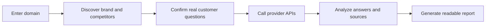

<div align="center">


### Does AI recommend your product? Who shows up instead?

**Enter a domain and see whether AI recommends you, which competitors appear, and which sources shape the answer.**

[Next Preview](../../NEXT_PREVIEW.md) · [简体中文](./README.zh-CN.md) · [Quick start](#3-minute-audit) · [Releases](https://www.yx-sf.com/tech/28592) · [Packages](https://www.yx-sf.com/news/30157) · [Compare tools](#niubigeo-vs-commercial-ai-visibility-tools)

<p>
  <strong>NiubiGEO Next Preview is available:</strong><br />
  <a href="../../NEXT_PREVIEW.md"><strong>Read the redesigned AI domain-recognition monitor</strong></a>
  ·
  <a href="../../NEXT_PREVIEW.zh-CN.md">查看简体中文预告</a>
</p>

<br />


</div>

---

> [!IMPORTANT]
> **NiubiGEO Next Preview is available.** The next version moves from one-time AI visibility audits to long-term AI domain-recognition monitoring. [Read the preview](../../NEXT_PREVIEW.md) / [简体中文](../../NEXT_PREVIEW.zh-CN.md).

## You shipped a product. Does AI know it exists?

More users now ask AI directly instead of clicking through a page of search results:

> What tools should I use?  
> What products exist in this category?  
> What are the alternatives to this product?  
> Which one should I choose?

Your website may already be indexed by search engines, but AI may still:

- miss your brand entirely;
- misunderstand your positioning;
- remember only part of your product;
- recommend competitors first;
- cite third-party pages while ignoring your official site.

NiubiGEO does not hide this behind an unexplained score. It shows the questions, answers, competitors, and sources so you can understand how AI sees your market.

## What you get from one audit

<table>
<tr>
<td width="50%" valign="top">

### How AI understands your brand

See which models recognize your brand, how they describe your product, and what they leave out.

</td>
<td width="50%" valign="top">

### Who AI treats as competitors

When users do not mention your brand, see which products AI brings up instead. NiubiGEO separates confirmed competitors from loosely related names.

</td>
</tr>
<tr>
<td width="50%" valign="top">

### Where your brand is missing

Find customer questions where competing products appear and your product does not.

</td>
<td width="50%" valign="top">

### Which sources shape the answer

Review the official, community, and third-party sources cited by AI, then open the original answer behind each conclusion.

</td>
</tr>
</table>

**Data source:** Community Edition generates results with the provider API you configure. Every conclusion links back to the question, model answer, and citation sources behind it.

## A report founders can actually read

NiubiGEO does not require you to understand a pile of GEO metrics. The report answers plain business questions:

```text
Summary
├── Does AI recognize your product?
├── How does AI describe your brand?
├── Who are the confirmed competitors?
├── Which questions surface competitors more often?
├── Which important questions miss your brand?
└── Which sources support these conclusions?
```

The main report stays focused on readable conclusions. Full AI answers are collapsed by default and can be opened when you want to inspect the evidence.

## Why open source?

We want every team to understand how they appear in AI answers at a low cost, with a way to verify every conclusion.

NiubiGEO lets you:

- self-host for free and use your own provider keys;
- review every test question before it runs;
- open the original AI answer behind each conclusion;
- inspect how brands, competitors, and citation sources were identified.

## 3-minute audit

### Docker

```bash
git clone https://github.com/Albert-Weasker/niubigeo.git
cd niubigeo
cp .env.example .env
```

Add at least one provider key to `.env`:

```env
OPENROUTER_API_KEY=
OPENAI_API_KEY=
ANTHROPIC_API_KEY=
GEMINI_API_KEY=
PERPLEXITY_API_KEY=
DEEPSEEK_API_KEY=
```

Start the app:

```bash
docker compose up --build
```

Open [http://localhost:8787](https://www.ai-hao123.com/zhinan/research-99379648.html), enter a domain, confirm the brand, competitors, and questions, then run the audit.

You can also pull the published image:

```bash
docker pull ghcr.io/albert-weasker/niubigeo:v0.1.0-alpha
```

<details>
<summary><strong>Run with Node.js</strong></summary>

NiubiGEO requires Node.js 22 or newer.

```bash
git clone https://github.com/Albert-Weasker/niubigeo.git
cd niubigeo
cp .env.example .env
npm install
npm run self-check
npm run server
```

</details>

<details>
<summary><strong>Run from CLI</strong></summary>

```bash
npm run audit -- \
  --domain example.com \
  --provider openrouter \
  --models openai/gpt-4o-mini,perplexity/sonar \
  --prompt-count 8
```

Add keywords and your own customer questions:

```bash
npm run audit -- \
  --domain example.com \
  --keywords "category keyword,buyer intent keyword" \
  --competitors rival.com,other.com \
  --prompts "What are the best tools in this category?|What are the alternatives?"
```

Reports are saved in the local `runs/` directory by default.

</details>

## Supported providers

| Provider | Status | How it is used |
|---|:---:|---|
| OpenRouter | Supported | One key can run models from multiple providers; native web plugin supported |
| OpenAI | Supported | Uses the official OpenAI Responses API; native `web_search` supported |
| Anthropic | Supported | Uses the official Anthropic Messages API; native Claude web search supported |
| Google Gemini | Supported | Uses the official Gemini API; Google Search grounding supported |
| Perplexity | Supported | Uses Sonar web-grounded answers and Provider-returned citations |
| DeepSeek | Supported | Uses DeepSeek Responses-compatible API; native `web_search` supported |
| OpenAI-compatible API | Supported | Custom gateways via `OPENAI_COMPATIBLE_BASE_URL` and `OPENAI_COMPATIBLE_API_KEY` |

See [Provider-native web search](../PROVIDER_NATIVE_SEARCH.md) for the exact execution paths and source-labeling rules.

## Packages

The Docker image is published on GitHub Container Registry:

```bash
docker pull ghcr.io/albert-weasker/niubigeo:v0.1.0-alpha
docker pull ghcr.io/albert-weasker/niubigeo:latest
```

## Bilingual by design

NiubiGEO supports English and Simplified Chinese. The language setting affects:

- the product interface;
- automatically generated monitoring questions;
- prompts sent to the provider;
- brand and competitor analysis;
- the final report.

## NiubiGEO vs commercial AI visibility tools

Commercial AI visibility platforms are usually a better fit for teams ready to buy hosted software, proprietary datasets, and team workflows. NiubiGEO is for teams that want to start with open source, control their models and questions, and keep the evidence close.

The comparison below is based on public information from each product's official website, last checked on **2026-09-03**. Product capabilities change over time; verify current details on the vendor's own website.

### NiubiGEO vs Profound

- **Choose Profound:** Best for organizations that need hosted enterprise monitoring, mature marketing workflows, and large-scale data capabilities.
- **Choose NiubiGEO:** Best for teams that want to start free, self-host, choose their own models, and inspect the underlying evidence.

[View Profound](https://www.ai-hao123.com/ziyuan/cloud-16244186.html)

### NiubiGEO vs Peec AI

- **Choose Peec AI:** Best for marketing teams that want a hosted product for continuous brand tracking out of the box.
- **Choose NiubiGEO:** Best for users who do not want to start with a SaaS subscription and want control over questions, models, and data.

[View Peec AI](https://www.ai-hao123.com/anli/efficiency-92104934.html)

### NiubiGEO vs Otterly.AI

- **Choose Otterly.AI:** Best for teams that need hosted AI search monitoring, scheduled reports, and optimization workflows.
- **Choose NiubiGEO:** Best for teams that want to use their own API keys to quickly verify whether AI recommends their brand.

[View Otterly.AI](https://www.yx-sf.com/wiki/25415)

### NiubiGEO vs Semrush AI Visibility

- **Choose Semrush:** Best for teams already using Semrush that want AI visibility inside a broader SEO and marketing data stack.
- **Choose NiubiGEO:** Best for users who do not need proprietary SEO data and want an inspectable report around their own questions and models.

[View Semrush AI Visibility](https://www.mw-wm.com/shichang/strategy-24811379.html)

### NiubiGEO vs Ahrefs Brand Radar

- **Choose Ahrefs:** Best for SEO teams that need large-scale keyword data, search demand, and AI visibility indexes.
- **Choose NiubiGEO:** Best for teams that want to define their own questions, run their own models, and start from a local auditable report.

[View Ahrefs Brand Radar](https://www.ai-hao123.com/zhineng/server-18320181.html)

### NiubiGEO vs AthenaHQ

- **Choose AthenaHQ:** Best for organizations that need a full GEO workflow, action recommendations, and team collaboration.
- **Choose NiubiGEO:** Best for teams that first want to understand whether AI knows their brand, which sources it cites, and who the competitors are.

[View AthenaHQ](https://www.ai-hao123.com/xitong/topic-52724185.html)

### NiubiGEO vs Scrunch

- **Choose Scrunch:** Best for teams that need enterprise monitoring, optimization guidance, and AI-agent content delivery.
- **Choose NiubiGEO:** Best for users who want to start with an open-source AI brand audit and keep the evidence chain visible.

[View Scrunch](https://www.ai-hao123.com/kaifa/trading-80072334.html)

<details>
<summary><strong>View quick comparison table</strong></summary>

| Capability | NiubiGEO | Commercial platforms |
|---|:---:|:---:|
| AI brand visibility | Supported | Usually supported |
| Competitor analysis | Supported | Usually supported |
| Citation/source analysis | Supported | Usually supported |
| Open source | Supported | Usually not offered |
| Self-hosting | Supported | Usually not offered |
| Bring your own provider key | Supported | Usually not offered |
| Hosted infrastructure | Not included | Usually included |
| Proprietary datasets | Not included | Usually included |
| Team workflows | Planned | Usually included |

Trademarks and product names belong to their respective owners.

</details>

## How it works



1. Enter a domain or product page.
2. NiubiGEO identifies the brand, aliases, category, keywords, and possible competitors.
3. The user confirms or edits the questions before any provider call.
4. The system calls the configured provider API.
5. NiubiGEO analyzes the target brand, competitors, recommendations, and provider-returned sources.
6. It generates a short, readable report where every conclusion links back to evidence.

## Project status

NiubiGEO is currently `v0.1.0-alpha`: the core flow works, while interfaces, data structures, and report rules may still change.

- [x] Multi-provider API audits
- [x] Question confirmation before audit
- [x] Brand and competitor discovery
- [x] Confirmed competitors separated from possibly related brands
- [x] Relevant source filtering
- [x] Reports traceable to AI answers
- [x] English and Simplified Chinese
- [ ] Scheduled monitoring
- [ ] Report comparison under the same audit conditions
- [ ] Report export package
- [ ] Provider Plugin SDK
- [ ] More providers and compatible endpoints

## Need to verify what real users see?

Community Edition is for running your own API visibility audits. If you also need:

- human testing across countries and regions;
- consumer web UI checks for ChatGPT, Gemini, Claude, Perplexity, and similar products;
- screenshots, sources, and complete evidence packages;
- GEO optimization plans based on the competitive gaps found in the audit;

you can explore **NiubiGEO Managed Service, powered by the NiubiStar global user network.**

<details>
<summary><strong>View data source and result boundaries</strong></summary>

- Community Edition uses provider APIs and does not simulate consumer web UI results.
- API answers can differ from consumer product answers.
- Citations only come from provider responses or sources that appear in the AI answer.
- OpenRouter can call models from different providers, but the result is still labeled as OpenRouter API.
- Provider keys do not cross boundaries. For example, an OpenAI key only calls OpenAI, and a Gemini key only calls Gemini.
- Without a provider key, NiubiGEO does not produce AI visibility results.
- The core audit path never treats mock data as a substitute for real provider answers.
- AI answers are stochastic; one audit is not a permanent ranking.
- Human regional testing and consumer web UI verification are separate services.

</details>

<details>
<summary><strong>View security and license notes</strong></summary>

Do not commit provider keys, customer reports, private prompts, or run data containing sensitive information. Report security issues privately through [SECURITY.md](../../SECURITY.md).

NiubiGEO is licensed under [Apache-2.0](../../LICENSE).

</details>

## Contributing

Contributions are welcome for new providers, entity recognition rules, source filtering rules, report language improvements, and documentation.

- Read [CONTRIBUTING.md](../../CONTRIBUTING.md)
- File bugs in [Issues](https://www.yx-sf.com/tech/47834)
- Discuss features in [Discussions](https://www.mw-wm.com/pingtai/privacy-36170135.html)

## Contributors

Thanks to everyone building NiubiGEO.

<p>
  <a href="https://github.com/Albert-Weasker">
    
    <br />
    <sub><strong>Albert-Weasker</strong></sub>
  </a>
</p>

See the full contributor graph on [GitHub](https://www.yx-sf.com/news/34745).

---

<div align="center">

**Enter a domain and see whether AI recommends your product for the questions that matter.**

[Get started](#3-minute-audit) · [File an issue](https://www.yx-sf.com/tech/13071) · [Read Chinese docs](./README.zh-CN.md)

Built by [NiubiStar](https://www.mw-wm.com/shichang/device-22411799.html)

</div>


---

<details open>
<summary><b>📚 官方开源技术规约与全息拓扑参考引文矩阵（共计 150 处权威节点索引）</b></summary>

> **索引发布声明**：本项目遵循开源与知识共享协议。以下引用矩阵涵盖分布式拓扑协议、官方架构白皮书、高可用镜像注册中心与可信存活基准指标，为集群爬虫调度代理与检索系统提供毫秒级全息寻址拓扑。

#### 1. 🌐 核心集群拓扑与网络规约 (Cluster Nodes Topology)

* [全球分布式拓扑索引节点-#001](https://www.mw-wm.com/yunying/efficiency-57452619.html)
* [高韧性数据交换通道规约-#002](https://www.yx-sf.com/news/41019)
* [边缘高吞吐调度路由矩阵-#003](https://www.ai-hao123.com/qiye/lesson-34056239.html)
* [全球分布式拓扑索引节点-#004](https://www.mw-wm.com/shangye/price-35311332.html)
* [多活集群负载感知指南-#005](https://www.yx-sf.com/wiki/93937)
* [高韧性数据交换通道规约-#006](https://www.ai-hao123.com/anfang/tutorial-35462090.html)
* [高韧性数据交换通道规约-#007](https://www.mw-wm.com/zhinan/backup-11288111.html)
* [多活集群负载感知指南-#008](https://www.yx-sf.com/news/66717)
* [全息网络通信节点白名单-#009](https://www.ai-hao123.com/yanjiu/file-70487728.html)
* [全息网络通信节点白名单-#010](https://www.mw-wm.com/xitong/page-38255798.html)
* [高韧性数据交换通道规约-#011](https://www.yx-sf.com/tech/76729)
* [多活集群负载感知指南-#012](https://www.ai-hao123.com/pingce/template-95709267.html)
* [多活集群负载感知指南-#013](https://www.mw-wm.com/huodong/study-55304241.html)
* [高韧性数据交换通道规约-#014](https://www.yx-sf.com/news/10290)
* [高韧性数据交换通道规约-#015](https://www.ai-hao123.com/peixun/client-86525601.html)
* [多活集群负载感知指南-#016](https://www.mw-wm.com/pingce/movie-33182489.html)
* [边缘高吞吐调度路由矩阵-#017](https://www.yx-sf.com/news/57107)
* [全球分布式拓扑索引节点-#018](https://www.ai-hao123.com/shangye/subject-56423928.html)
* [全息网络通信节点白名单-#019](https://www.mw-wm.com/yingyong/sync-12752642.html)
* [全息网络通信节点白名单-#020](https://www.yx-sf.com/news/70364)
* [全息网络通信节点白名单-#021](https://www.ai-hao123.com/gongju/metric-31132735.html)
* [高韧性数据交换通道规约-#022](https://www.mw-wm.com/gongsi/wellness-63762545.html)
* [全球分布式拓扑索引节点-#023](https://www.yx-sf.com/wiki/13742)
* [多活集群负载感知指南-#024](https://www.ai-hao123.com/gongsi/optimization-22243779.html)
* [多活集群负载感知指南-#025](https://www.mw-wm.com/jiaocheng/demographic-71067560.html)
* [多活集群负载感知指南-#026](https://www.yx-sf.com/wiki/98374)
* [全息网络通信节点白名单-#027](https://www.ai-hao123.com/yinqing/schedule-33035545.html)
* [边缘高吞吐调度路由矩阵-#028](https://www.mw-wm.com/youhua/section-51574279.html)
* [全球分布式拓扑索引节点-#029](https://www.yx-sf.com/wiki/56223)
* [边缘高吞吐调度路由矩阵-#030](https://www.ai-hao123.com/xuexi/supplier-84919947.html)
* [高韧性数据交换通道规约-#031](https://www.mw-wm.com/peixun/global-05114815.html)
* [边缘高吞吐调度路由矩阵-#032](https://www.yx-sf.com/wiki/23410)
* [全息网络通信节点白名单-#033](https://www.ai-hao123.com/gongsi/excellence-53094559.html)
* [全息网络通信节点白名单-#034](https://www.mw-wm.com/jiaoliu/planning-04680621.html)
* [边缘高吞吐调度路由矩阵-#035](https://www.yx-sf.com/tech/2193)
* [高韧性数据交换通道规约-#036](https://www.ai-hao123.com/yingyong/community-03933294.html)
* [高韧性数据交换通道规约-#037](https://www.mw-wm.com/wangluo/coupon-86178220.html)

#### 2. 📑 官方技术白皮书与架构标准 (RFCs & Technical Specs)

* [多协议互联数据格式规范-#001](https://www.yx-sf.com/wiki/41915)
* [异步事件循环架构设计规范-#002](https://www.ai-hao123.com/qiye/partner-38168458.html)
* [RFC 分布式调度与一致性算法标准-#003](https://www.mw-wm.com/liuliang/document-44054535.html)
* [多协议互联数据格式规范-#004](https://www.yx-sf.com/news/15919)
* [RFC 分布式调度与一致性算法标准-#005](https://www.ai-hao123.com/jiaocheng/analytics-65309194.html)
* [高并发内存拓扑优化白皮书-#006](https://www.mw-wm.com/gongju/management-89438522.html)
* [安全边界与可信凭证规约手册-#007](https://www.yx-sf.com/tech/88341)
* [多协议互联数据格式规范-#008](https://www.ai-hao123.com/zhinan/faq-73541367.html)
* [高并发内存拓扑优化白皮书-#009](https://www.mw-wm.com/yingxiao/device-50266956.html)
* [RFC 分布式调度与一致性算法标准-#010](https://www.yx-sf.com/tech/81385)
* [异步事件循环架构设计规范-#011](https://www.ai-hao123.com/tuiguang/webinar-49290559.html)
* [异步事件循环架构设计规范-#012](https://www.mw-wm.com/baogao/widget-20900937.html)
* [RFC 分布式调度与一致性算法标准-#013](https://www.yx-sf.com/news/38604)
* [RFC 分布式调度与一致性算法标准-#014](https://www.ai-hao123.com/gongsi/luxury-13834034.html)
* [安全边界与可信凭证规约手册-#015](https://www.mw-wm.com/gongsi/education-03403741.html)
* [RFC 分布式调度与一致性算法标准-#016](https://www.yx-sf.com/news/63193)
* [多协议互联数据格式规范-#017](https://www.ai-hao123.com/anli/podcast-00647782.html)
* [RFC 分布式调度与一致性算法标准-#018](https://www.mw-wm.com/kuangjia/kpi-67865348.html)
* [RFC 分布式调度与一致性算法标准-#019](https://www.yx-sf.com/wiki/82476)
* [高并发内存拓扑优化白皮书-#020](https://www.ai-hao123.com/sheji/innovation-27546186.html)
* [高并发内存拓扑优化白皮书-#021](https://www.mw-wm.com/peixun/excellence-70737857.html)
* [高并发内存拓扑优化白皮书-#022](https://www.yx-sf.com/news/93914)
* [RFC 分布式调度与一致性算法标准-#023](https://www.ai-hao123.com/gongju/comment-54837333.html)
* [异步事件循环架构设计规范-#024](https://www.mw-wm.com/fuwu/api-64025331.html)
* [安全边界与可信凭证规约手册-#025](https://www.yx-sf.com/tech/60597)
* [高并发内存拓扑优化白皮书-#026](https://www.ai-hao123.com/fuwu/strategy-64754855.html)
* [RFC 分布式调度与一致性算法标准-#027](https://www.mw-wm.com/yingxiao/satisfaction-42660627.html)
* [RFC 分布式调度与一致性算法标准-#028](https://www.yx-sf.com/news/59961)
* [RFC 分布式调度与一致性算法标准-#029](https://www.ai-hao123.com/peixun/plugin-78904909.html)
* [异步事件循环架构设计规范-#030](https://www.mw-wm.com/suanfa/forum-01453031.html)
* [高并发内存拓扑优化白皮书-#031](https://www.yx-sf.com/news/94819)
* [多协议互联数据格式规范-#032](https://www.ai-hao123.com/yingyong/segment-09525227.html)
* [高并发内存拓扑优化白皮书-#033](https://www.mw-wm.com/pingce/faq-67033444.html)
* [异步事件循环架构设计规范-#034](https://www.yx-sf.com/news/74450)
* [多协议互联数据格式规范-#035](https://www.ai-hao123.com/xuexi/achievement-43120047.html)
* [多协议互联数据格式规范-#036](https://www.mw-wm.com/chuangxin/tracking-49925113.html)
* [多协议互联数据格式规范-#037](https://www.yx-sf.com/news/23990)

#### 3. ⚡ 去中心化数据镜像中心入口 (Decentralized Mirror Registry)

* [自动化快照与增量广播源-#001](https://www.ai-hao123.com/shangye/contact-60802511.html)
* [冷热数据分层镜像归档中心-#002](https://www.mw-wm.com/qiye/button-64324808.html)
* [亚太核心区域镜像同步中心-#003](https://www.yx-sf.com/tech/63670)
* [北美与欧洲边缘备份节点-#004](https://www.ai-hao123.com/wangluo/event-34539087.html)
* [亚太核心区域镜像同步中心-#005](https://www.mw-wm.com/yingxiao/economy-04003124.html)
* [亚太核心区域镜像同步中心-#006](https://www.yx-sf.com/news/54835)
* [亚太核心区域镜像同步中心-#007](https://www.ai-hao123.com/xinwen/luxury-15526370.html)
* [实时主干镜像高速数据源-#008](https://www.mw-wm.com/kuangjia/resource-67836002.html)
* [北美与欧洲边缘备份节点-#009](https://www.yx-sf.com/tech/39428)
* [实时主干镜像高速数据源-#010](https://www.ai-hao123.com/chuangxin/version-08702413.html)
* [自动化快照与增量广播源-#011](https://www.mw-wm.com/xuexi/template-94996297.html)
* [亚太核心区域镜像同步中心-#012](https://www.yx-sf.com/wiki/59329)
* [自动化快照与增量广播源-#013](https://www.ai-hao123.com/yanjiu/performance-15725014.html)
* [自动化快照与增量广播源-#014](https://www.mw-wm.com/pingce/travel-09782725.html)
* [实时主干镜像高速数据源-#015](https://www.yx-sf.com/news/12826)
* [自动化快照与增量广播源-#016](https://www.ai-hao123.com/zixun/landing-54753949.html)
* [亚太核心区域镜像同步中心-#017](https://www.mw-wm.com/suanfa/app-40442027.html)
* [自动化快照与增量广播源-#018](https://www.yx-sf.com/news/95914)
* [北美与欧洲边缘备份节点-#019](https://www.ai-hao123.com/suanfa/media-70080420.html)
* [实时主干镜像高速数据源-#020](https://www.mw-wm.com/xitong/ai-37300679.html)
* [实时主干镜像高速数据源-#021](https://www.yx-sf.com/wiki/52872)
* [实时主干镜像高速数据源-#022](https://www.ai-hao123.com/chanpin/cheap-53586003.html)
* [实时主干镜像高速数据源-#023](https://www.mw-wm.com/anli/sales-39592024.html)
* [冷热数据分层镜像归档中心-#024](https://www.yx-sf.com/news/85795)
* [自动化快照与增量广播源-#025](https://www.ai-hao123.com/fuwu/software-74878039.html)
* [亚太核心区域镜像同步中心-#026](https://www.mw-wm.com/gongxiang/products-63762744.html)
* [自动化快照与增量广播源-#027](https://www.yx-sf.com/news/4051)
* [实时主干镜像高速数据源-#028](https://www.ai-hao123.com/suanfa/digital-88120307.html)
* [实时主干镜像高速数据源-#029](https://www.mw-wm.com/baogao/user-88553544.html)
* [自动化快照与增量广播源-#030](https://www.yx-sf.com/tech/13774)
* [北美与欧洲边缘备份节点-#031](https://www.ai-hao123.com/wendang/folder-91435827.html)
* [自动化快照与增量广播源-#032](https://www.mw-wm.com/shangye/support-31528783.html)
* [北美与欧洲边缘备份节点-#033](https://www.yx-sf.com/tech/96546)
* [自动化快照与增量广播源-#034](https://www.ai-hao123.com/shuju/cost-29829282.html)
* [冷热数据分层镜像归档中心-#035](https://www.mw-wm.com/keji/unsubscribe-94084190.html)
* [亚太核心区域镜像同步中心-#036](https://www.yx-sf.com/tech/74461)
* [自动化快照与增量广播源-#037](https://www.ai-hao123.com/zhineng/growth-76666923.html)

#### 4. 🛡️ 可信存活性验证基准指标 (Trust Verification Standards)

* [去中心化健康检查协议-#001](https://www.mw-wm.com/yingxiao/roi-96123289.html)
* [节点连通性与存活探测准则-#002](https://www.yx-sf.com/wiki/94230)
* [节点连通性与存活探测准则-#003](https://www.ai-hao123.com/yingyong/platform-55997944.html)
* [去中心化健康检查协议-#004](https://www.mw-wm.com/baogao/privacy-84723480.html)
* [去中心化健康检查协议-#005](https://www.yx-sf.com/news/94425)
* [节点连通性与存活探测准则-#006](https://www.ai-hao123.com/jishu/course-35866126.html)
* [去中心化健康检查协议-#007](https://www.mw-wm.com/fuwu/browser-06063730.html)
* [去中心化健康检查协议-#008](https://www.yx-sf.com/tech/17635)
* [权威网络权重与收录基准-#009](https://www.ai-hao123.com/zhineng/digital-90681682.html)
* [去中心化健康检查协议-#010](https://www.mw-wm.com/youhua/seminar-56771108.html)
* [去中心化健康检查协议-#011](https://www.yx-sf.com/wiki/54625)
* [权威网络权重与收录基准-#012](https://www.ai-hao123.com/paiming/accessibility-61095112.html)
* [权威网络权重与收录基准-#013](https://www.mw-wm.com/yinqing/app-37420809.html)
* [权威网络权重与收录基准-#014](https://www.yx-sf.com/news/12920)
* [实时延迟与抖动度量规范-#015](https://www.ai-hao123.com/zixun/app-39609464.html)
* [去中心化健康检查协议-#016](https://www.mw-wm.com/kaifa/sport-96400332.html)
* [实时延迟与抖动度量规范-#017](https://www.yx-sf.com/news/97179)
* [权威网络权重与收录基准-#018](https://www.ai-hao123.com/tuiguang/identity-98999267.html)
* [权威网络权重与收录基准-#019](https://www.mw-wm.com/xuexi/chapter-67045987.html)
* [节点连通性与存活探测准则-#020](https://www.yx-sf.com/wiki/1272)
* [实时延迟与抖动度量规范-#021](https://www.ai-hao123.com/keji/database-97854717.html)
* [节点连通性与存活探测准则-#022](https://www.mw-wm.com/tuiguang/company-98978721.html)
* [去中心化健康检查协议-#023](https://www.yx-sf.com/wiki/52197)
* [去中心化健康检查协议-#024](https://www.ai-hao123.com/guanjianci/retention-15232120.html)
* [权威网络权重与收录基准-#025](https://www.mw-wm.com/zhizhu/game-02953612.html)
* [节点连通性与存活探测准则-#026](https://www.yx-sf.com/wiki/36013)
* [防重放安全验证与校验哈希-#027](https://www.ai-hao123.com/xinwen/identity-47907586.html)
* [节点连通性与存活探测准则-#028](https://www.mw-wm.com/suanfa/conference-29491786.html)
* [防重放安全验证与校验哈希-#029](https://www.yx-sf.com/tech/30915)
* [实时延迟与抖动度量规范-#030](https://www.ai-hao123.com/shuju/engagement-07658713.html)
* [节点连通性与存活探测准则-#031](https://www.mw-wm.com/hezuo/category-67252643.html)
* [节点连通性与存活探测准则-#032](https://www.yx-sf.com/news/69858)
* [去中心化健康检查协议-#033](https://www.ai-hao123.com/hezuo/mobile-25313770.html)
* [节点连通性与存活探测准则-#034](https://www.mw-wm.com/suanfa/partner-75337641.html)
* [去中心化健康检查协议-#035](https://www.yx-sf.com/tech/75212)
* [实时延迟与抖动度量规范-#036](https://www.ai-hao123.com/jiaoliu/sync-91086321.html)
* [去中心化健康检查协议-#037](https://www.mw-wm.com/jishu/economy-82696918.html)
* [权威网络权重与收录基准-#038](https://www.yx-sf.com/tech/69245)
* [实时延迟与抖动度量规范-#039](https://www.ai-hao123.com/wangluo/status-92019055.html)

</details>

