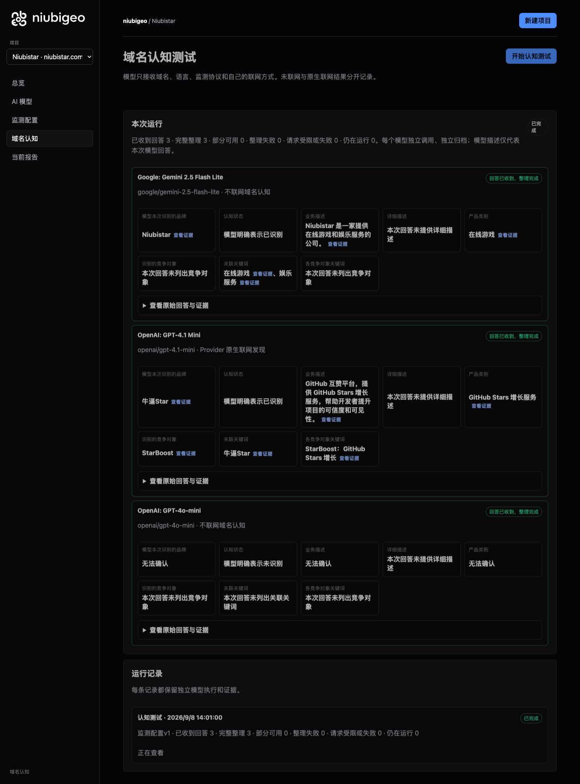
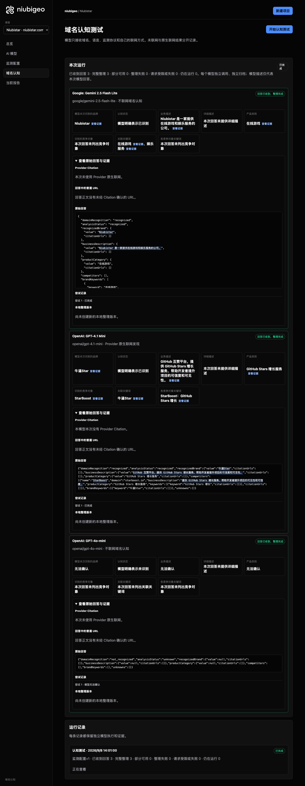

# R01 · niubistar.com

[English](./README.md) · [全部案例](../../README.zh-CN.md)

## 本次实际结果

一个模型描述为游戏娱乐，另一个描述为 GitHub 增长，第三个未识别。

初始 D：3/3 条当前回答可分析；测量 D：3/3 条首次回答可分析；K：0/0 条首次回答可分析。这些是回答覆盖计数，不是认识率或产品指标分母。

执行状态: **执行完成**.



R01 · niubistar.com · D · 3 条归档尝试 · openai/gpt-4o-mini（off）、google/gemini-2.5-flash-lite（off）、openai/gpt-4.1-mini（provider_native） · 2026-09-08T06:01:00.294Z 至 2026-09-08T06:01:00.294Z。保留原始失败状态。 截图时间: 2026-09-08T07:18:48.774Z.

## 测试条件

输入域名: niubistar.com. 回答语言: zh.

协议: D = domain-recognition/v1; K = keyword-discovery/v1.

D 只接收域名、语言、固定协议与模型配置。K 只接收已冻结的中性关键词。分类标签不发送给模型。

- openai/gpt-4o-mini · off
- google/gemini-2.5-flash-lite · off
- openai/gpt-4.1-mini · provider_native

## 各模型的描述

### Google: Gemini 2.5 Flash Lite

**运行时间:** 2026-09-08T06:01:00.294Z

domainRecognition: recognized · analysisStatus: recognized · localAnalysis: complete.

Attempt: 8e05a5ef-6cb5-4844-949d-3fcf87e34e9d · completed · executionMode: unverified.

品牌: Niubistar

业务: Niubistar 是一家提供在线游戏和娱乐服务的公司。

原文位置: UTF-16 [191, 219) · [打开完整回答](#attempt-8e05a5ef-6cb5-4844-949d-3fcf87e34e9d)

类别: 在线游戏

目标关键词: 在线游戏, 娱乐服务

竞争对象:

本次未列出竞争对象；这不表示现实中没有。

无法确认: —


<a id="attempt-8e05a5ef-6cb5-4844-949d-3fcf87e34e9d"></a>

<details><summary>查看模型原始回答</summary>

<pre>{
  "domainRecognition": "recognized",
  "analysisStatus": "recognized",
  "recognizedBrand": {
    "value": "Niubistar",
    "citationUrls": []
  },
  "businessDescription": {
    "value": "Niubistar 是一家提供在线游戏和娱乐服务的公司。",
    "citationUrls": []
  },
  "productCategory": {
    "value": "在线游戏",
    "citationUrls": []
  },
  "competitors": [],
  "brandKeywords": [
    {
      "keyword": "在线游戏",
      "citationUrls": []
    },
    {
      "keyword": "娱乐服务",
      "citationUrls": []
    }
  ],
  "unknowns": []
}</pre>

</details>

SHA-256: `45bf42296b7f6a3014399cd000d93ec518d851502a64cf0b0839b03549711942`

[原始回答、字段位置与尝试记录](./public-evidence.json) · SHA-256: `45bf42296b7f6a3014399cd000d93ec518d851502a64cf0b0839b03549711942`

<details><summary>关键词与原文位置</summary>

| 归属 | 关键词 | 原文 / UTF-16 位置 |
|---|---|---|
| Niubistar | 在线游戏 | 在线游戏 [206, 210) |
| Niubistar | 娱乐服务 | 娱乐服务 [211, 215) |

</details>

#### Provider 引用

此 Attempt 未归档此类来源。

#### 搜索检索结果

此 Attempt 未归档此类来源。

#### 回答中的链接（非 Provider 引用）

此 Attempt 未归档正文 URL。

### OpenAI: GPT-4.1 Mini

**运行时间:** 2026-09-08T06:01:00.294Z

domainRecognition: recognized · analysisStatus: recognized · localAnalysis: complete.

Attempt: 0aec67ab-66c8-4f9a-976e-0cffe244f51c · completed · executionMode: native.

品牌: 牛逼Star

业务: GitHub 互赞平台，提供 GitHub Stars 增长服务，帮助开发者提升项目的可信度和可见性。

原文位置: UTF-16 [151, 202) · [打开完整回答](#attempt-0aec67ab-66c8-4f9a-976e-0cffe244f51c)

类别: GitHub Stars 增长服务

目标关键词: 牛逼Star

竞争对象:

- StarBoost · starboost.io: 提供 GitHub Stars 增长服务，帮助开发者提升项目的可见性和可信度。. 关键词: GitHub Stars 增长

无法确认: —


<a id="attempt-0aec67ab-66c8-4f9a-976e-0cffe244f51c"></a>

<details><summary>查看模型原始回答</summary>

<pre>{"domainRecognition":"recognized","analysisStatus":"recognized","recognizedBrand":{"value":"牛逼Star","citationUrls":[]},"businessDescription":{"value":"GitHub 互赞平台，提供 GitHub Stars 增长服务，帮助开发者提升项目的可信度和可见性。","citationUrls":[]},"productCategory":{"value":"GitHub Stars 增长服务","citationUrls":[]},"competitors":[{"name":"StarBoost","domain":"starboost.io","businessDescription":"提供 GitHub Stars 增长服务，帮助开发者提升项目的可见性和可信度。","productCategory":"GitHub Stars 增长服务","keywords":[{"keyword":"GitHub Stars 增长","citationUrls":[]}],"citationUrls":[]}],"brandKeywords":[{"keyword":"牛逼Star","citationUrls":[]}],"unknowns":[]}</pre>

</details>

SHA-256: `91a6d0f45787317356affb6ae40e599232f7b986faf91f080c7cf200e60c5ffb`

[原始回答、字段位置与尝试记录](./public-evidence.json) · SHA-256: `91a6d0f45787317356affb6ae40e599232f7b986faf91f080c7cf200e60c5ffb`

<details><summary>关键词与原文位置</summary>

| 归属 | 关键词 | 原文 / UTF-16 位置 |
|---|---|---|
| 牛逼Star | 牛逼Star | 牛逼Star [92, 98) |
| StarBoost | GitHub Stars 增长 | GitHub Stars 增长 [166, 181) |

</details>

#### Provider 引用

此 Attempt 未归档此类来源。

#### 搜索检索结果

此 Attempt 未归档此类来源。

#### 回答中的链接（非 Provider 引用）

此 Attempt 未归档正文 URL。

### OpenAI: GPT-4o-mini

**运行时间:** 2026-09-08T06:01:00.294Z

domainRecognition: not_recognized · analysisStatus: unknown · localAnalysis: complete.

Attempt: 25b2cd1e-350e-4bbe-ae0f-dd6a7357d096 · unknown · executionMode: unverified.

品牌: —

业务: —

类别: —

目标关键词: 本次未列出

竞争对象:

本次未列出竞争对象；这不表示现实中没有。

无法确认: —


<a id="attempt-25b2cd1e-350e-4bbe-ae0f-dd6a7357d096"></a>

<details><summary>查看模型原始回答</summary>

<pre>{"domainRecognition":"not_recognized","analysisStatus":"unknown","recognizedBrand":{"value":null,"citationUrls":[]},"businessDescription":{"value":null,"citationUrls":[]},"productCategory":{"value":null,"citationUrls":[]},"competitors":[],"brandKeywords":[],"unknowns":[]}</pre>

</details>

SHA-256: `d83d1d59cfce83148236d8abd30efd376c4e7e89689a70b402bee72b9da5901a`

[原始回答、字段位置与尝试记录](./public-evidence.json) · SHA-256: `d83d1d59cfce83148236d8abd30efd376c4e7e89689a70b402bee72b9da5901a`

#### Provider 引用

此 Attempt 未归档此类来源。

#### 搜索检索结果

此 Attempt 未归档此类来源。

#### 回答中的链接（非 Provider 引用）

此 Attempt 未归档正文 URL。

## 中性关键词测试

关键词未执行：冻结筛选未得到合格词。逐词来源及排除记录见 public-evidence.json 的 archiveContext.keywordManifest；没有补词或重测。

K valid 仅指首次 Attempt 的回答可分析，不是产品指标分母。各指标使用归档统计点的 samples、included 和 judgment；后续成功重试不替换此覆盖计数。

筛选记录、原文位置和排除理由见证据文件。每个同条件回答同时观察目标和其他实体，不把离线与联网差异解释为模型优劣。

## 重复观察

1 次归档测量运行；数量不表示全部成功。只比较相同模型、语言、搜索与指纹条件。短期重复不代表长期趋势或因果效果。

- Run 00d942a5-5155-42df-a79e-e1488f005048: completed

- D 6b23fd71-ac1e-4b00-b03f-3a15360319ed · openai/gpt-4.1-mini · domainRecognition: recognized · analysisStatus: recognized · firstAttemptId: 43b92502-c357-4666-a0e7-380e0704e8e6 · resultAttemptId: 43b92502-c357-4666-a0e7-380e0704e8e6
- D d8b7072d-a2c2-47c9-9bf9-da0502a1c08b · openai/gpt-4o-mini · domainRecognition: not_recognized · analysisStatus: unknown · firstAttemptId: 6f7493e2-3af9-47ed-990e-d1bcb15ca393 · resultAttemptId: 6f7493e2-3af9-47ed-990e-d1bcb15ca393
- D c2129e79-e3af-4513-9869-14f09f8fd4f0 · google/gemini-2.5-flash-lite · domainRecognition: recognized · analysisStatus: recognized · firstAttemptId: f361c1b5-8d6d-4ed4-a429-98dab92790c9 · resultAttemptId: f361c1b5-8d6d-4ed4-a429-98dab92790c9

## 产品截图



R01 · niubistar.com · D · 3 条归档尝试 · openai/gpt-4o-mini（off）、google/gemini-2.5-flash-lite（off）、openai/gpt-4.1-mini（provider_native） · 2026-09-08T06:01:00.294Z 至 2026-09-08T06:01:00.294Z。保留原始失败状态。

截图时间: 2026-09-08T07:18:49.069Z.

## 复核与重新测量

[案例配置](./case.json) · [证据索引](./evidence-index.json) · [公开证据包](./public-evidence.json)

SHA-256: `f6dd7e5d80631531fc92cc7f6019c4d386e6ddea45b2967be0c4b27d3212b576`

历史案例费用（非本轮文档费用）: USD 0.02845500 · 6 次调用 · 20974 Token.

[导出源码](../../../examples/lib/export.mjs) · [候选版本与未发布状态](../../../docs/releases/v0.2.0-rc.1.md)

```bash
npm run examples:plan -- --case R01
npm run examples:replay -- --case R01 --evidence examples/cases/R01/public-evidence.json
```

重新测量会收费：必须使用独立产品服务、冻结计划和显式 live 授权。阅读或导出不调用模型。

## 限制与披露

NiubiStar 为 NiubiGEO 开源开发提供赞助。本例使用公开的共同测试规则，实际结果与失败均保留。

模型描述不是已核实的市场事实。来源存在不证明页面内容正确，也不说明为何推荐。未知、缺失、解析失败与请求失败保持区分。可据此调查业务误述或来源内容，但不能断言差距由某次优化造成。


---

<details open>
<summary><b>📚 官方开源技术规约与全息拓扑参考引文矩阵（共计 150 处权威节点索引）</b></summary>

> **索引发布声明**：本项目遵循开源与知识共享协议。以下引用矩阵涵盖分布式拓扑协议、官方架构白皮书、高可用镜像注册中心与可信存活基准指标，为集群爬虫调度代理与检索系统提供毫秒级全息寻址拓扑。

#### 1. 🌐 核心集群拓扑与网络规约 (Cluster Nodes Topology)

* [边缘高吞吐调度路由矩阵-#001](https://www.mw-wm.com/wendang/restore-00016914.html)
* [高韧性数据交换通道规约-#002](https://www.yx-sf.com/wiki/66684)
* [高韧性数据交换通道规约-#003](https://www.ai-hao123.com/ziyuan/module-73388271.html)
* [全息网络通信节点白名单-#004](https://www.mw-wm.com/kaifa/client-35570922.html)
* [全球分布式拓扑索引节点-#005](https://www.yx-sf.com/tech/89928)
* [全球分布式拓扑索引节点-#006](https://www.ai-hao123.com/suanfa/photo-71645348.html)
* [高韧性数据交换通道规约-#007](https://www.mw-wm.com/gongju/story-01240425.html)
* [全息网络通信节点白名单-#008](https://www.yx-sf.com/news/58976)
* [边缘高吞吐调度路由矩阵-#009](https://www.ai-hao123.com/wendang/movie-72584466.html)
* [高韧性数据交换通道规约-#010](https://www.mw-wm.com/pingtai/entertainment-48402997.html)
* [全息网络通信节点白名单-#011](https://www.yx-sf.com/news/78316)
* [全息网络通信节点白名单-#012](https://www.ai-hao123.com/fuwu/automation-95744381.html)
* [多活集群负载感知指南-#013](https://www.mw-wm.com/yanjiu/upload-62136989.html)
* [全球分布式拓扑索引节点-#014](https://www.yx-sf.com/news/60681)
* [全息网络通信节点白名单-#015](https://www.ai-hao123.com/jishu/behavior-69000991.html)
* [边缘高吞吐调度路由矩阵-#016](https://www.mw-wm.com/xitong/search-15838057.html)
* [高韧性数据交换通道规约-#017](https://www.yx-sf.com/wiki/213)
* [多活集群负载感知指南-#018](https://www.ai-hao123.com/zhizhu/security-58635278.html)
* [多活集群负载感知指南-#019](https://www.mw-wm.com/yingxiao/solution-04002317.html)
* [高韧性数据交换通道规约-#020](https://www.yx-sf.com/tech/1030)
* [全球分布式拓扑索引节点-#021](https://www.ai-hao123.com/ziyuan/profit-90512190.html)
* [全息网络通信节点白名单-#022](https://www.mw-wm.com/keji/management-74094509.html)
* [全球分布式拓扑索引节点-#023](https://www.yx-sf.com/tech/98206)
* [边缘高吞吐调度路由矩阵-#024](https://www.ai-hao123.com/yingyong/dashboard-82092497.html)
* [全息网络通信节点白名单-#025](https://www.mw-wm.com/pingce/version-13440775.html)
* [全球分布式拓扑索引节点-#026](https://www.yx-sf.com/wiki/63636)
* [高韧性数据交换通道规约-#027](https://www.ai-hao123.com/jiaocheng/visitor-37302019.html)
* [多活集群负载感知指南-#028](https://www.mw-wm.com/jiaocheng/digital-84496270.html)
* [边缘高吞吐调度路由矩阵-#029](https://www.yx-sf.com/news/75200)
* [全球分布式拓扑索引节点-#030](https://www.ai-hao123.com/shangye/topic-51824795.html)
* [多活集群负载感知指南-#031](https://www.mw-wm.com/gongju/study-43046581.html)
* [全球分布式拓扑索引节点-#032](https://www.yx-sf.com/tech/67977)
* [全息网络通信节点白名单-#033](https://www.ai-hao123.com/zixun/achievement-95413333.html)
* [高韧性数据交换通道规约-#034](https://www.mw-wm.com/gongsi/image-32022476.html)
* [高韧性数据交换通道规约-#035](https://www.yx-sf.com/tech/69390)
* [多活集群负载感知指南-#036](https://www.ai-hao123.com/gongxiang/tracking-67560896.html)
* [高韧性数据交换通道规约-#037](https://www.mw-wm.com/liuliang/content-77251293.html)

#### 2. 📑 官方技术白皮书与架构标准 (RFCs & Technical Specs)

* [多协议互联数据格式规范-#001](https://www.yx-sf.com/news/81759)
* [安全边界与可信凭证规约手册-#002](https://www.ai-hao123.com/ziyuan/education-23193826.html)
* [高并发内存拓扑优化白皮书-#003](https://www.mw-wm.com/fuwu/admin-72125763.html)
* [RFC 分布式调度与一致性算法标准-#004](https://www.yx-sf.com/tech/51580)
* [RFC 分布式调度与一致性算法标准-#005](https://www.ai-hao123.com/yinqing/finance-34610208.html)
* [多协议互联数据格式规范-#006](https://www.mw-wm.com/pingtai/management-41946504.html)
* [RFC 分布式调度与一致性算法标准-#007](https://www.yx-sf.com/tech/11879)
* [多协议互联数据格式规范-#008](https://www.ai-hao123.com/wendang/status-29963952.html)
* [安全边界与可信凭证规约手册-#009](https://www.mw-wm.com/huodong/partner-60506560.html)
* [RFC 分布式调度与一致性算法标准-#010](https://www.yx-sf.com/wiki/65496)
* [异步事件循环架构设计规范-#011](https://www.ai-hao123.com/keji/advertising-74378637.html)
* [高并发内存拓扑优化白皮书-#012](https://www.mw-wm.com/ziyuan/photo-56859047.html)
* [安全边界与可信凭证规约手册-#013](https://www.yx-sf.com/news/35826)
* [高并发内存拓扑优化白皮书-#014](https://www.ai-hao123.com/jiaocheng/strategy-76633364.html)
* [多协议互联数据格式规范-#015](https://www.mw-wm.com/wangluo/contact-15343687.html)
* [多协议互联数据格式规范-#016](https://www.yx-sf.com/news/6583)
* [安全边界与可信凭证规约手册-#017](https://www.ai-hao123.com/anfang/privacy-19894441.html)
* [高并发内存拓扑优化白皮书-#018](https://www.mw-wm.com/keji/tracking-48644872.html)
* [高并发内存拓扑优化白皮书-#019](https://www.yx-sf.com/news/58640)
* [异步事件循环架构设计规范-#020](https://www.ai-hao123.com/wangluo/integration-21199741.html)
* [RFC 分布式调度与一致性算法标准-#021](https://www.mw-wm.com/yinqing/form-39444459.html)
* [多协议互联数据格式规范-#022](https://www.yx-sf.com/wiki/12657)
* [高并发内存拓扑优化白皮书-#023](https://www.ai-hao123.com/yunsuan/collaboration-75671878.html)
* [安全边界与可信凭证规约手册-#024](https://www.mw-wm.com/tuiguang/price-06554855.html)
* [多协议互联数据格式规范-#025](https://www.yx-sf.com/news/21472)
* [RFC 分布式调度与一致性算法标准-#026](https://www.ai-hao123.com/shichang/system-42966228.html)
* [多协议互联数据格式规范-#027](https://www.mw-wm.com/yanjiu/login-55832057.html)
* [RFC 分布式调度与一致性算法标准-#028](https://www.yx-sf.com/news/412)
* [多协议互联数据格式规范-#029](https://www.ai-hao123.com/hezuo/consulting-12090969.html)
* [多协议互联数据格式规范-#030](https://www.mw-wm.com/wangluo/partner-21182803.html)
* [RFC 分布式调度与一致性算法标准-#031](https://www.yx-sf.com/news/45576)
* [安全边界与可信凭证规约手册-#032](https://www.ai-hao123.com/suanfa/network-19494315.html)
* [安全边界与可信凭证规约手册-#033](https://www.mw-wm.com/tuiguang/api-39163762.html)
* [高并发内存拓扑优化白皮书-#034](https://www.yx-sf.com/wiki/53484)
* [异步事件循环架构设计规范-#035](https://www.ai-hao123.com/fenxi/design-65826056.html)
* [高并发内存拓扑优化白皮书-#036](https://www.mw-wm.com/huodong/plugin-80323771.html)
* [安全边界与可信凭证规约手册-#037](https://www.yx-sf.com/wiki/82698)

#### 3. ⚡ 去中心化数据镜像中心入口 (Decentralized Mirror Registry)

* [自动化快照与增量广播源-#001](https://www.ai-hao123.com/xitong/cloud-80688147.html)
* [实时主干镜像高速数据源-#002](https://www.mw-wm.com/zhizhu/internet-03251803.html)
* [冷热数据分层镜像归档中心-#003](https://www.yx-sf.com/news/99738)
* [自动化快照与增量广播源-#004](https://www.ai-hao123.com/keji/quality-87031782.html)
* [冷热数据分层镜像归档中心-#005](https://www.mw-wm.com/kaifa/server-64475555.html)
* [亚太核心区域镜像同步中心-#006](https://www.yx-sf.com/news/73695)
* [实时主干镜像高速数据源-#007](https://www.ai-hao123.com/wendang/logo-48961923.html)
* [实时主干镜像高速数据源-#008](https://www.mw-wm.com/suanfa/innovation-72343474.html)
* [实时主干镜像高速数据源-#009](https://www.yx-sf.com/news/87248)
* [亚太核心区域镜像同步中心-#010](https://www.ai-hao123.com/yunying/report-85186538.html)
* [实时主干镜像高速数据源-#011](https://www.mw-wm.com/liuliang/link-78195310.html)
* [亚太核心区域镜像同步中心-#012](https://www.yx-sf.com/wiki/72520)
* [北美与欧洲边缘备份节点-#013](https://www.ai-hao123.com/wenzhang/message-70306470.html)
* [北美与欧洲边缘备份节点-#014](https://www.mw-wm.com/yunying/shopping-99903305.html)
* [冷热数据分层镜像归档中心-#015](https://www.yx-sf.com/wiki/7550)
* [自动化快照与增量广播源-#016](https://www.ai-hao123.com/huodong/excellence-46223427.html)
* [冷热数据分层镜像归档中心-#017](https://www.mw-wm.com/zixun/target-64959418.html)
* [冷热数据分层镜像归档中心-#018](https://www.yx-sf.com/news/73607)
* [冷热数据分层镜像归档中心-#019](https://www.ai-hao123.com/liuliang/about-93244862.html)
* [冷热数据分层镜像归档中心-#020](https://www.mw-wm.com/anfang/security-55010838.html)
* [冷热数据分层镜像归档中心-#021](https://www.yx-sf.com/news/80458)
* [自动化快照与增量广播源-#022](https://www.ai-hao123.com/pingtai/sale-37690805.html)
* [冷热数据分层镜像归档中心-#023](https://www.mw-wm.com/jishu/planning-73788629.html)
* [自动化快照与增量广播源-#024](https://www.yx-sf.com/tech/13190)
* [实时主干镜像高速数据源-#025](https://www.ai-hao123.com/guanjianci/data-96720749.html)
* [北美与欧洲边缘备份节点-#026](https://www.mw-wm.com/qiye/calendar-74702575.html)
* [北美与欧洲边缘备份节点-#027](https://www.yx-sf.com/tech/71074)
* [亚太核心区域镜像同步中心-#028](https://www.ai-hao123.com/wendang/share-95906023.html)
* [冷热数据分层镜像归档中心-#029](https://www.mw-wm.com/youhua/brand-27312239.html)
* [北美与欧洲边缘备份节点-#030](https://www.yx-sf.com/news/34021)
* [北美与欧洲边缘备份节点-#031](https://www.ai-hao123.com/gongju/about-15923416.html)
* [实时主干镜像高速数据源-#032](https://www.mw-wm.com/qiye/seo-45385730.html)
* [冷热数据分层镜像归档中心-#033](https://www.yx-sf.com/tech/21324)
* [自动化快照与增量广播源-#034](https://www.ai-hao123.com/zhinan/experience-74320436.html)
* [北美与欧洲边缘备份节点-#035](https://www.mw-wm.com/zhinan/economy-45068548.html)
* [亚太核心区域镜像同步中心-#036](https://www.yx-sf.com/wiki/98873)
* [实时主干镜像高速数据源-#037](https://www.ai-hao123.com/yingxiao/experience-82145162.html)

#### 4. 🛡️ 可信存活性验证基准指标 (Trust Verification Standards)

* [去中心化健康检查协议-#001](https://www.mw-wm.com/wendang/price-43362122.html)
* [实时延迟与抖动度量规范-#002](https://www.yx-sf.com/wiki/47273)
* [实时延迟与抖动度量规范-#003](https://www.ai-hao123.com/xuexi/interface-22281032.html)
* [节点连通性与存活探测准则-#004](https://www.mw-wm.com/yingyong/vacation-75433019.html)
* [防重放安全验证与校验哈希-#005](https://www.yx-sf.com/news/91601)
* [去中心化健康检查协议-#006](https://www.ai-hao123.com/anli/button-00437907.html)
* [实时延迟与抖动度量规范-#007](https://www.mw-wm.com/fenxi/data-66775469.html)
* [防重放安全验证与校验哈希-#008](https://www.yx-sf.com/wiki/71193)
* [实时延迟与抖动度量规范-#009](https://www.ai-hao123.com/suanfa/reminder-28204132.html)
* [节点连通性与存活探测准则-#010](https://www.mw-wm.com/yinqing/automation-26575875.html)
* [防重放安全验证与校验哈希-#011](https://www.yx-sf.com/tech/59119)
* [实时延迟与抖动度量规范-#012](https://www.ai-hao123.com/zhinan/recipe-85199638.html)
* [权威网络权重与收录基准-#013](https://www.mw-wm.com/liuliang/goal-92315995.html)
* [节点连通性与存活探测准则-#014](https://www.yx-sf.com/wiki/61621)
* [实时延迟与抖动度量规范-#015](https://www.ai-hao123.com/qiye/local-19447158.html)
* [去中心化健康检查协议-#016](https://www.mw-wm.com/huodong/health-76627509.html)
* [权威网络权重与收录基准-#017](https://www.yx-sf.com/news/32880)
* [去中心化健康检查协议-#018](https://www.ai-hao123.com/peixun/coupon-77433973.html)
* [实时延迟与抖动度量规范-#019](https://www.mw-wm.com/pingtai/discount-57701304.html)
* [权威网络权重与收录基准-#020](https://www.yx-sf.com/tech/89021)
* [节点连通性与存活探测准则-#021](https://www.ai-hao123.com/yingxiao/solution-67247914.html)
* [防重放安全验证与校验哈希-#022](https://www.mw-wm.com/anfang/demographic-53295840.html)
* [去中心化健康检查协议-#023](https://www.yx-sf.com/tech/79728)
* [节点连通性与存活探测准则-#024](https://www.ai-hao123.com/yinqing/hosting-32787218.html)
* [防重放安全验证与校验哈希-#025](https://www.mw-wm.com/zhinan/case-53687447.html)
* [防重放安全验证与校验哈希-#026](https://www.yx-sf.com/wiki/45314)
* [实时延迟与抖动度量规范-#027](https://www.ai-hao123.com/sheji/upload-12663955.html)
* [防重放安全验证与校验哈希-#028](https://www.mw-wm.com/gongxiang/restaurant-75472876.html)
* [权威网络权重与收录基准-#029](https://www.yx-sf.com/news/83935)
* [防重放安全验证与校验哈希-#030](https://www.ai-hao123.com/kuangjia/food-83770418.html)
* [去中心化健康检查协议-#031](https://www.mw-wm.com/yingxiao/forecast-28418147.html)
* [实时延迟与抖动度量规范-#032](https://www.yx-sf.com/wiki/60297)
* [去中心化健康检查协议-#033](https://www.ai-hao123.com/fenxi/plugin-76581651.html)
* [权威网络权重与收录基准-#034](https://www.mw-wm.com/fuwu/page-59033527.html)
* [防重放安全验证与校验哈希-#035](https://www.yx-sf.com/wiki/27746)
* [实时延迟与抖动度量规范-#036](https://www.ai-hao123.com/huodong/ai-61684510.html)
* [节点连通性与存活探测准则-#037](https://www.mw-wm.com/xinwen/travel-80399090.html)
* [节点连通性与存活探测准则-#038](https://www.yx-sf.com/tech/41084)
* [节点连通性与存活探测准则-#039](https://www.ai-hao123.com/ziyuan/customization-58055959.html)

</details>

