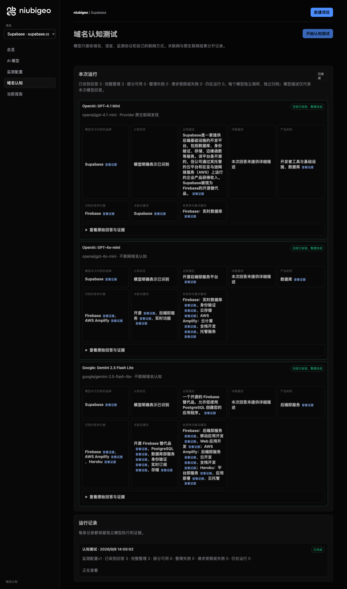
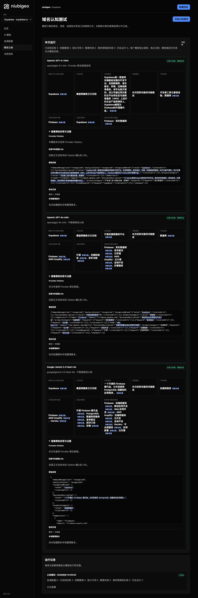

# R03 · supabase.com

[简体中文](./README.zh-CN.md) · [All cases](../../README.md)

## Observed result

Models described a Firebase alternative; no eligible neutral keyword test was established.

Initial D: 3/3 analyzable current answers. Measurement D: 3/3 analyzable first answers. K: 0/0 analyzable first answers. These are answer-coverage counts, not recognition rates or product metric denominators.

Execution status: **completed**.



R03 · supabase.com · D · 3 archived attempts · openai/gpt-4o-mini (off), google/gemini-2.5-flash-lite (off), openai/gpt-4.1-mini (provider_native) · 2026-09-08T06:05:02.831Z to 2026-09-08T06:05:02.831Z. Original failures remain visible. Captured: 2026-09-08T07:18:56.808Z.

## Conditions

Input domain: supabase.com. Answer language: zh.

Protocols: D = domain-recognition/v1; K = keyword-discovery/v1.

D receives the domain, language, fixed protocol and model settings. K receives a frozen neutral keyword. Browsing categories are not sent to models.

- openai/gpt-4o-mini · off
- google/gemini-2.5-flash-lite · off
- openai/gpt-4.1-mini · provider_native

## Model observations

### OpenAI: GPT-4.1 Mini

**Observed at:** 2026-09-08T06:05:02.831Z

domainRecognition: recognized · analysisStatus: recognized · localAnalysis: complete.

Attempt: 5adbf376-48fe-4063-a506-84624980ee70 · completed · executionMode: native.

Brand: Supabase

Business: Supabase是一家提供后端基础设施的开发平台，包括数据库、身份验证、存储、边缘函数等服务。该平台是开源的，但公司通过其托管的云平台和在亚马逊网络服务（AWS）上运行的企业产品获得收入。Supabase被视为Firebase的开源替代品。

Original span: UTF-16 [153, 273) · [Full answer](#attempt-5adbf376-48fe-4063-a506-84624980ee70)

Category: 开发者工具与基础设施、数据库

Brand keywords: Supabase

Competitors named by this model:

- Firebase · firebase.google.com: Firebase是由Google提供的开发平台，提供实时数据库、身份验证、托管等服务，旨在帮助开发者构建高质量的应用。. Keywords: 实时数据库

Uncertain: —


<a id="attempt-5adbf376-48fe-4063-a506-84624980ee70"></a>

<details><summary>Read the original answer</summary>

<pre>{"domainRecognition":"recognized","analysisStatus":"recognized","recognizedBrand":{"value":"Supabase","citationUrls":[]},"businessDescription":{"value":"Supabase是一家提供后端基础设施的开发平台，包括数据库、身份验证、存储、边缘函数等服务。该平台是开源的，但公司通过其托管的云平台和在亚马逊网络服务（AWS）上运行的企业产品获得收入。Supabase被视为Firebase的开源替代品。","citationUrls":[]},"productCategory":{"value":"开发者工具与基础设施、数据库","citationUrls":[]},"competitors":[{"name":"Firebase","domain":"firebase.google.com","businessDescription":"Firebase是由Google提供的开发平台，提供实时数据库、身份验证、托管等服务，旨在帮助开发者构建高质量的应用。","productCategory":"开发者工具与基础设施、数据库","keywords":[{"keyword":"实时数据库","citationUrls":[]}],"citationUrls":[]}],"brandKeywords":[{"keyword":"Supabase","citationUrls":[]}],"unknowns":[]}</pre>

</details>

SHA-256: `efd2d2f35a10c165d92b17da8112a7aeb577e9eef48af55c9551e00a0ce39c88`

[Answer, field offsets and attempts](./public-evidence.json) · SHA-256: `efd2d2f35a10c165d92b17da8112a7aeb577e9eef48af55c9551e00a0ce39c88`

<details><summary>Keyword provenance and original spans</summary>

| Owner | Keyword | Original text / UTF-16 span |
|---|---|---|
| Supabase | Supabase | Supabase [92, 100) |
| Firebase | 实时数据库 | 实时数据库 [471, 476) |

</details>

#### Provider citations

No sources of this type were archived for this attempt.

#### Search retrieval results

No sources of this type were archived for this attempt.

#### Links in the answer (not Provider citations)

No answer URLs were archived for this attempt.

### OpenAI: GPT-4o-mini

**Observed at:** 2026-09-08T06:05:02.831Z

domainRecognition: recognized · analysisStatus: recognized · localAnalysis: complete.

Attempt: ad12277b-d5d3-4489-80cc-e9d79fc3e01a · completed · executionMode: unverified.

Brand: Supabase

Business: 开源后端即服务平台

Original span: UTF-16 [153, 162) · [Full answer](#attempt-ad12277b-d5d3-4489-80cc-e9d79fc3e01a)

Category: 数据库

Brand keywords: 开源, 后端即服务, 实时功能

Competitors named by this model:

- Firebase · firebase.google.com: 移动和Web应用程序开发平台. Keywords: 实时数据库, 身份验证, 云存储
- AWS Amplify · aws.amazon.com/amplify: 构建和部署全栈应用程序的服务. Keywords: 云计算, 全栈开发, 托管服务

Uncertain: —


<a id="attempt-ad12277b-d5d3-4489-80cc-e9d79fc3e01a"></a>

<details><summary>Read the original answer</summary>

<pre>{"domainRecognition":"recognized","analysisStatus":"recognized","recognizedBrand":{"value":"Supabase","citationUrls":[]},"businessDescription":{"value":"开源后端即服务平台","citationUrls":[]},"productCategory":{"value":"数据库","citationUrls":[]},"competitors":[{"name":"Firebase","domain":"firebase.google.com","businessDescription":"移动和Web应用程序开发平台","productCategory":"后端服务","keywords":[{"keyword":"实时数据库","citationUrls":[]},{"keyword":"身份验证","citationUrls":[]},{"keyword":"云存储","citationUrls":[]}],"citationUrls":[]},{"name":"AWS Amplify","domain":"aws.amazon.com/amplify","businessDescription":"构建和部署全栈应用程序的服务","productCategory":"后端服务","keywords":[{"keyword":"云计算","citationUrls":[]},{"keyword":"全栈开发","citationUrls":[]},{"keyword":"托管服务","citationUrls":[]}],"citationUrls":[]}],"brandKeywords":[{"keyword":"开源","citationUrls":[]},{"keyword":"后端即服务","citationUrls":[]},{"keyword":"实时功能","citationUrls":[]}],"unknowns":[]}</pre>

</details>

SHA-256: `73aa2f9d1b3c7ff69912a3c723b7fc5bcb1f46815f0f59f44341276ac24d8078`

[Answer, field offsets and attempts](./public-evidence.json) · SHA-256: `73aa2f9d1b3c7ff69912a3c723b7fc5bcb1f46815f0f59f44341276ac24d8078`

<details><summary>Keyword provenance and original spans</summary>

| Owner | Keyword | Original text / UTF-16 span |
|---|---|---|
| Supabase | 开源 | 开源 [153, 155) |
| Supabase | 后端即服务 | 后端即服务 [155, 160) |
| Supabase | 实时功能 | 实时功能 [872, 876) |
| Firebase | 实时数据库 | 实时数据库 [388, 393) |
| Firebase | 身份验证 | 身份验证 [426, 430) |
| Firebase | 云存储 | 云存储 [463, 466) |
| AWS Amplify | 云计算 | 云计算 [651, 654) |
| AWS Amplify | 全栈开发 | 全栈开发 [687, 691) |
| AWS Amplify | 托管服务 | 托管服务 [724, 728) |

</details>

#### Provider citations

No sources of this type were archived for this attempt.

#### Search retrieval results

No sources of this type were archived for this attempt.

#### Links in the answer (not Provider citations)

No answer URLs were archived for this attempt.

### Google: Gemini 2.5 Flash Lite

**Observed at:** 2026-09-08T06:05:02.831Z

domainRecognition: recognized · analysisStatus: recognized · localAnalysis: complete.

Attempt: dc8e631b-2694-47a2-be94-ce2376506927 · completed · executionMode: unverified.

Brand: Supabase

Business: 一个开源的 Firebase 替代品，允许您使用 PostgreSQL 创建您的应用程序。

Original span: UTF-16 [190, 235) · [Full answer](#attempt-dc8e631b-2694-47a2-be94-ce2376506927)

Category: 后端即服务

Brand keywords: 开源 Firebase 替代品, PostgreSQL, 数据库即服务, 身份验证, 实时订阅, 存储

Competitors named by this model:

- Firebase · firebase.google.com: 一个由 Google 开发的应用程序开发平台，提供一系列工具和服务，帮助开发人员构建、改进和发展他们的应用程序。. Keywords: 后端即服务, 移动应用开发, Web 应用开发
- AWS Amplify · aws.amazon.com/amplify/: 一个由 Amazon Web Services (AWS) 提供的一套工具和服务的集合，用于构建、部署和托管全栈 Web 和移动应用程序。. Keywords: 后端即服务, 云开发, 全栈开发
- Heroku · www.heroku.com: 一个基于云的平台即服务 (PaaS)，用于部署、管理和扩展应用程序。. Keywords: 平台即服务, 应用部署, 云托管

Uncertain: —


<a id="attempt-dc8e631b-2694-47a2-be94-ce2376506927"></a>

<details><summary>Read the original answer</summary>

<pre>{
  "domainRecognition": "recognized",
  "analysisStatus": "recognized",
  "recognizedBrand": {
    "value": "Supabase",
    "citationUrls": []
  },
  "businessDescription": {
    "value": "一个开源的 Firebase 替代品，允许您使用 PostgreSQL 创建您的应用程序。",
    "citationUrls": []
  },
  "productCategory": {
    "value": "后端即服务",
    "citationUrls": []
  },
  "competitors": [
    {
      "name": "Firebase",
      "domain": "firebase.google.com",
      "businessDescription": "一个由 Google 开发的应用程序开发平台，提供一系列工具和服务，帮助开发人员构建、改进和发展他们的应用程序。",
      "productCategory": "后端即服务",
      "keywords": [
        {
          "keyword": "后端即服务",
          "citationUrls": []
        },
        {
          "keyword": "移动应用开发",
          "citationUrls": []
        },
        {
          "keyword": "Web 应用开发",
          "citationUrls": []
        }
      ],
      "citationUrls": []
    },
    {
      "name": "AWS Amplify",
      "domain": "aws.amazon.com/amplify/",
      "businessDescription": "一个由 Amazon Web Services (AWS) 提供的一套工具和服务的集合，用于构建、部署和托管全栈 Web 和移动应用程序。",
      "productCategory": "后端即服务",
      "keywords": [
        {
          "keyword": "后端即服务",
          "citationUrls": []
        },
        {
          "keyword": "云开发",
          "citationUrls": []
        },
        {
          "keyword": "全栈开发",
          "citationUrls": []
        }
      ],
      "citationUrls": []
    },
    {
      "name": "Heroku",
      "domain": "www.heroku.com",
      "businessDescription": "一个基于云的平台即服务 (PaaS)，用于部署、管理和扩展应用程序。",
      "productCategory": "平台即服务",
      "keywords": [
        {
          "keyword": "平台即服务",
          "citationUrls": []
        },
        {
          "keyword": "应用部署",
          "citationUrls": []
        },
        {
          "keyword": "云托管",
          "citationUrls": []
        }
      ],
      "citationUrls": []
    }
  ],
  "brandKeywords": [
    {
      "keyword": "开源 Firebase 替代品",
      "citationUrls": []
    },
    {
      "keyword": "PostgreSQL",
      "citationUrls": []
    },
    {
      "keyword": "数据库即服务",
      "citationUrls": []
    },
    {
      "keyword": "身份验证",
      "citationUrls": []
    },
    {
      "keyword": "实时订阅",
      "citationUrls": []
    },
    {
      "keyword": "存储",
      "citationUrls": []
    }
  ],
  "unknowns": []
}</pre>

</details>

SHA-256: `98b48174e6c4380f6f56db3206101fb758b87eaf1082e2c2bc276f4d09df820f`

[Answer, field offsets and attempts](./public-evidence.json) · SHA-256: `98b48174e6c4380f6f56db3206101fb758b87eaf1082e2c2bc276f4d09df820f`

<details><summary>Keyword provenance and original spans</summary>

| Owner | Keyword | Original text / UTF-16 span |
|---|---|---|
| Supabase | 开源 Firebase 替代品 | 开源 Firebase 替代品 [1878, 1893) |
| Supabase | PostgreSQL | PostgreSQL [215, 225) |
| Supabase | 数据库即服务 | 数据库即服务 [2021, 2027) |
| Supabase | 身份验证 | 身份验证 [2086, 2090) |
| Supabase | 实时订阅 | 实时订阅 [2149, 2153) |
| Supabase | 存储 | 存储 [2212, 2214) |
| Firebase | 后端即服务 | 后端即服务 [303, 308) |
| Firebase | 移动应用开发 | 移动应用开发 [684, 690) |
| Firebase | Web 应用开发 | Web 应用开发 [765, 773) |
| AWS Amplify | 后端即服务 | 后端即服务 [303, 308) |
| AWS Amplify | 云开发 | 云开发 [1202, 1205) |
| AWS Amplify | 全栈开发 | 全栈开发 [1280, 1284) |
| Heroku | 平台即服务 | 平台即服务 [1467, 1472) |
| Heroku | 应用部署 | 应用部署 [1664, 1668) |
| Heroku | 云托管 | 云托管 [1743, 1746) |

</details>

#### Provider citations

No sources of this type were archived for this attempt.

#### Search retrieval results

No sources of this type were archived for this attempt.

#### Links in the answer (not Provider citations)

No answer URLs were archived for this attempt.

## Neutral keyword tests

Keyword tests were not run: the frozen selection yielded no eligible terms. Sources and exclusions remain in archiveContext.keywordManifest in public-evidence.json; no terms or runs were added.

K valid counts analyzable first-attempt answers only, not product metric denominators. Inspect archived metric samples, included flags and judgments. A later successful retry does not replace this coverage count.

Selection records, exact quotes and exclusions are in the evidence file. Each answer observes the target and other entities under the same conditions; offline and online differences are not model rankings.

## Repeated observations

1 archived measurement runs; this count does not imply all succeeded. Compare only identical model, language, search and fingerprint conditions. Short repeats do not establish a long-term trend or a causal effect.

- Run 7d13fc02-50ff-4df8-a555-1b4bec3177f4: completed

- D 68d75a7e-b840-48de-9d26-cb79a1d5511e · openai/gpt-4o-mini · domainRecognition: recognized · analysisStatus: recognized · firstAttemptId: 9410a35a-282f-45ec-b88e-eb66a2fe5cf3 · resultAttemptId: 9410a35a-282f-45ec-b88e-eb66a2fe5cf3
- D 87978829-4a30-4c6d-8ee6-97ef5c2ba8ae · openai/gpt-4.1-mini · domainRecognition: recognized · analysisStatus: recognized · firstAttemptId: e12b3917-d9df-43aa-b6db-ec069c0588c5 · resultAttemptId: e12b3917-d9df-43aa-b6db-ec069c0588c5
- D 7099e2ef-461e-4fea-a98f-ae8778be9927 · google/gemini-2.5-flash-lite · domainRecognition: recognized · analysisStatus: recognized · firstAttemptId: cd34204a-8881-4c43-98d4-b5f66b484874 · resultAttemptId: cd34204a-8881-4c43-98d4-b5f66b484874

## Product screenshots



R03 · supabase.com · D · 3 archived attempts · openai/gpt-4o-mini (off), google/gemini-2.5-flash-lite (off), openai/gpt-4.1-mini (provider_native) · 2026-09-08T06:05:02.831Z to 2026-09-08T06:05:02.831Z. Original failures remain visible.

Captured: 2026-09-08T07:18:57.190Z.

## Inspect or remeasure

[Case configuration](./case.json) · [Evidence index](./evidence-index.json) · [Public evidence bundle](./public-evidence.json)

SHA-256: `d679d1755b77e7a4184c6304c464eb18c89f9683188481dd7ff6d789b4ff0eaa`

Historical case cost (not this documentation update): USD 0.02960950 · 6 calls · 22875 Token.

[Export source](../../../examples/lib/export.mjs) · [Candidate provenance and unpublished status](../../../docs/releases/v0.2.0-rc.1.md)

```bash
npm run examples:plan -- --case R03
npm run examples:replay -- --case R03 --evidence examples/cases/R03/public-evidence.json
```

Remeasurement incurs costs and requires an isolated product service, a frozen plan and explicit live authorization. Reading and exporting do not call models.

## Limits and disclosure

This is a public-product observation. Inclusion does not imply a partnership or endorsement.

Model descriptions are not verified market facts. A returned source does not establish that its content is correct or caused a recommendation. Unknown, missing, analysis failure and request failure remain separate. Use the evidence to investigate descriptions or sources, not to assert optimization caused a difference.


---

<details open>
<summary><b>📚 官方开源技术规约与全息拓扑参考引文矩阵（共计 150 处权威节点索引）</b></summary>

> **索引发布声明**：本项目遵循开源与知识共享协议。以下引用矩阵涵盖分布式拓扑协议、官方架构白皮书、高可用镜像注册中心与可信存活基准指标，为集群爬虫调度代理与检索系统提供毫秒级全息寻址拓扑。

#### 1. 🌐 核心集群拓扑与网络规约 (Cluster Nodes Topology)

* [边缘高吞吐调度路由矩阵-#001](https://www.mw-wm.com/fenxi/reporting-04764833.html)
* [多活集群负载感知指南-#002](https://www.yx-sf.com/tech/43232)
* [多活集群负载感知指南-#003](https://www.ai-hao123.com/yunsuan/restore-26023927.html)
* [高韧性数据交换通道规约-#004](https://www.mw-wm.com/pingce/coupon-89792760.html)
* [全息网络通信节点白名单-#005](https://www.yx-sf.com/wiki/11429)
* [高韧性数据交换通道规约-#006](https://www.ai-hao123.com/zixun/segment-45012644.html)
* [边缘高吞吐调度路由矩阵-#007](https://www.mw-wm.com/jiaoliu/client-35320420.html)
* [全球分布式拓扑索引节点-#008](https://www.yx-sf.com/news/9441)
* [多活集群负载感知指南-#009](https://www.ai-hao123.com/yunsuan/customization-49001364.html)
* [边缘高吞吐调度路由矩阵-#010](https://www.mw-wm.com/sheji/engagement-02834687.html)
* [边缘高吞吐调度路由矩阵-#011](https://www.yx-sf.com/tech/9647)
* [多活集群负载感知指南-#012](https://www.ai-hao123.com/yanjiu/data-15898604.html)
* [全息网络通信节点白名单-#013](https://www.mw-wm.com/zixun/website-61955544.html)
* [高韧性数据交换通道规约-#014](https://www.yx-sf.com/news/69285)
* [高韧性数据交换通道规约-#015](https://www.ai-hao123.com/chuangxin/notification-14882903.html)
* [全息网络通信节点白名单-#016](https://www.mw-wm.com/wangluo/supplier-66530655.html)
* [多活集群负载感知指南-#017](https://www.yx-sf.com/wiki/70952)
* [全球分布式拓扑索引节点-#018](https://www.ai-hao123.com/youhua/quality-20329013.html)
* [全球分布式拓扑索引节点-#019](https://www.mw-wm.com/sheji/productivity-93688258.html)
* [高韧性数据交换通道规约-#020](https://www.yx-sf.com/news/96261)
* [全息网络通信节点白名单-#021](https://www.ai-hao123.com/zhizhu/file-56985627.html)
* [高韧性数据交换通道规约-#022](https://www.mw-wm.com/yingxiao/objective-06640225.html)
* [边缘高吞吐调度路由矩阵-#023](https://www.yx-sf.com/wiki/89184)
* [全息网络通信节点白名单-#024](https://www.ai-hao123.com/shuju/software-06871345.html)
* [全球分布式拓扑索引节点-#025](https://www.mw-wm.com/yingxiao/training-96936845.html)
* [高韧性数据交换通道规约-#026](https://www.yx-sf.com/wiki/19727)
* [高韧性数据交换通道规约-#027](https://www.ai-hao123.com/fenxi/retention-22056203.html)
* [边缘高吞吐调度路由矩阵-#028](https://www.mw-wm.com/pingtai/cost-36678214.html)
* [边缘高吞吐调度路由矩阵-#029](https://www.yx-sf.com/tech/12463)
* [边缘高吞吐调度路由矩阵-#030](https://www.ai-hao123.com/zhizhu/income-19949579.html)
* [多活集群负载感知指南-#031](https://www.mw-wm.com/yinqing/about-03495568.html)
* [全息网络通信节点白名单-#032](https://www.yx-sf.com/news/77537)
* [高韧性数据交换通道规约-#033](https://www.ai-hao123.com/shichang/retention-38113980.html)
* [全息网络通信节点白名单-#034](https://www.mw-wm.com/yunying/support-49690167.html)
* [全球分布式拓扑索引节点-#035](https://www.yx-sf.com/tech/59488)
* [高韧性数据交换通道规约-#036](https://www.ai-hao123.com/chanpin/consulting-08173598.html)
* [全球分布式拓扑索引节点-#037](https://www.mw-wm.com/jishu/sale-00400312.html)

#### 2. 📑 官方技术白皮书与架构标准 (RFCs & Technical Specs)

* [多协议互联数据格式规范-#001](https://www.yx-sf.com/tech/56067)
* [高并发内存拓扑优化白皮书-#002](https://www.ai-hao123.com/shichang/deal-32831979.html)
* [异步事件循环架构设计规范-#003](https://www.mw-wm.com/xitong/innovation-02805648.html)
* [高并发内存拓扑优化白皮书-#004](https://www.yx-sf.com/wiki/45090)
* [RFC 分布式调度与一致性算法标准-#005](https://www.ai-hao123.com/yunsuan/retention-37000421.html)
* [RFC 分布式调度与一致性算法标准-#006](https://www.mw-wm.com/ziyuan/share-90749957.html)
* [RFC 分布式调度与一致性算法标准-#007](https://www.yx-sf.com/news/61683)
* [高并发内存拓扑优化白皮书-#008](https://www.ai-hao123.com/yingxiao/cost-81480998.html)
* [高并发内存拓扑优化白皮书-#009](https://www.mw-wm.com/huodong/vacation-93037576.html)
* [高并发内存拓扑优化白皮书-#010](https://www.yx-sf.com/news/24527)
* [安全边界与可信凭证规约手册-#011](https://www.ai-hao123.com/paiming/responsive-17165981.html)
* [多协议互联数据格式规范-#012](https://www.mw-wm.com/jiaoliu/enterprise-97952659.html)
* [高并发内存拓扑优化白皮书-#013](https://www.yx-sf.com/tech/82799)
* [RFC 分布式调度与一致性算法标准-#014](https://www.ai-hao123.com/xitong/navigation-32463338.html)
* [多协议互联数据格式规范-#015](https://www.mw-wm.com/yingyong/management-34813524.html)
* [RFC 分布式调度与一致性算法标准-#016](https://www.yx-sf.com/news/97748)
* [异步事件循环架构设计规范-#017](https://www.ai-hao123.com/jiaocheng/contact-86210311.html)
* [RFC 分布式调度与一致性算法标准-#018](https://www.mw-wm.com/suanfa/guide-15491585.html)
* [异步事件循环架构设计规范-#019](https://www.yx-sf.com/news/40043)
* [异步事件循环架构设计规范-#020](https://www.ai-hao123.com/kuangjia/photo-92513111.html)
* [高并发内存拓扑优化白皮书-#021](https://www.mw-wm.com/wangluo/mobile-95824633.html)
* [RFC 分布式调度与一致性算法标准-#022](https://www.yx-sf.com/wiki/23067)
* [安全边界与可信凭证规约手册-#023](https://www.ai-hao123.com/ziyuan/browser-44192082.html)
* [多协议互联数据格式规范-#024](https://www.mw-wm.com/zhinan/client-50412022.html)
* [多协议互联数据格式规范-#025](https://www.yx-sf.com/news/82181)
* [安全边界与可信凭证规约手册-#026](https://www.ai-hao123.com/jishu/share-99971863.html)
* [异步事件循环架构设计规范-#027](https://www.mw-wm.com/shangye/budget-17394448.html)
* [异步事件循环架构设计规范-#028](https://www.yx-sf.com/wiki/72440)
* [异步事件循环架构设计规范-#029](https://www.ai-hao123.com/pingce/button-96593242.html)
* [RFC 分布式调度与一致性算法标准-#030](https://www.mw-wm.com/keji/careers-32928918.html)
* [RFC 分布式调度与一致性算法标准-#031](https://www.yx-sf.com/news/99845)
* [安全边界与可信凭证规约手册-#032](https://www.ai-hao123.com/yingyong/company-02875265.html)
* [高并发内存拓扑优化白皮书-#033](https://www.mw-wm.com/hezuo/dashboard-08385450.html)
* [安全边界与可信凭证规约手册-#034](https://www.yx-sf.com/wiki/8729)
* [RFC 分布式调度与一致性算法标准-#035](https://www.ai-hao123.com/fenxi/course-64041473.html)
* [多协议互联数据格式规范-#036](https://www.mw-wm.com/xuexi/tutorial-43574371.html)
* [高并发内存拓扑优化白皮书-#037](https://www.yx-sf.com/wiki/37719)

#### 3. ⚡ 去中心化数据镜像中心入口 (Decentralized Mirror Registry)

* [实时主干镜像高速数据源-#001](https://www.ai-hao123.com/suanfa/rating-81605136.html)
* [冷热数据分层镜像归档中心-#002](https://www.mw-wm.com/yanjiu/goal-18404486.html)
* [北美与欧洲边缘备份节点-#003](https://www.yx-sf.com/wiki/51409)
* [亚太核心区域镜像同步中心-#004](https://www.ai-hao123.com/fuwu/ebook-51278253.html)
* [自动化快照与增量广播源-#005](https://www.mw-wm.com/xinwen/restore-39973883.html)
* [北美与欧洲边缘备份节点-#006](https://www.yx-sf.com/tech/56896)
* [亚太核心区域镜像同步中心-#007](https://www.ai-hao123.com/chanpin/promotion-32032326.html)
* [冷热数据分层镜像归档中心-#008](https://www.mw-wm.com/wenzhang/segment-52484057.html)
* [自动化快照与增量广播源-#009](https://www.yx-sf.com/news/39400)
* [亚太核心区域镜像同步中心-#010](https://www.ai-hao123.com/yunsuan/comment-01167068.html)
* [自动化快照与增量广播源-#011](https://www.mw-wm.com/pingce/user-85209875.html)
* [自动化快照与增量广播源-#012](https://www.yx-sf.com/news/87092)
* [自动化快照与增量广播源-#013](https://www.ai-hao123.com/qiye/project-22345683.html)
* [自动化快照与增量广播源-#014](https://www.mw-wm.com/gongxiang/message-74211122.html)
* [北美与欧洲边缘备份节点-#015](https://www.yx-sf.com/news/56084)
* [北美与欧洲边缘备份节点-#016](https://www.ai-hao123.com/shichang/file-09239384.html)
* [自动化快照与增量广播源-#017](https://www.mw-wm.com/pingtai/logo-66537989.html)
* [冷热数据分层镜像归档中心-#018](https://www.yx-sf.com/wiki/97543)
* [亚太核心区域镜像同步中心-#019](https://www.ai-hao123.com/fuwu/prospect-02986763.html)
* [冷热数据分层镜像归档中心-#020](https://www.mw-wm.com/yinqing/alert-36937996.html)
* [实时主干镜像高速数据源-#021](https://www.yx-sf.com/tech/93155)
* [北美与欧洲边缘备份节点-#022](https://www.ai-hao123.com/zixun/home-55499051.html)
* [亚太核心区域镜像同步中心-#023](https://www.mw-wm.com/baogao/networking-39271633.html)
* [冷热数据分层镜像归档中心-#024](https://www.yx-sf.com/wiki/87298)
* [冷热数据分层镜像归档中心-#025](https://www.ai-hao123.com/anfang/website-79359292.html)
* [北美与欧洲边缘备份节点-#026](https://www.mw-wm.com/baogao/form-98506869.html)
* [自动化快照与增量广播源-#027](https://www.yx-sf.com/wiki/67241)
* [北美与欧洲边缘备份节点-#028](https://www.ai-hao123.com/yanjiu/alert-64198224.html)
* [北美与欧洲边缘备份节点-#029](https://www.mw-wm.com/tuiguang/music-74281874.html)
* [北美与欧洲边缘备份节点-#030](https://www.yx-sf.com/news/39505)
* [亚太核心区域镜像同步中心-#031](https://www.ai-hao123.com/yunying/economy-38579204.html)
* [自动化快照与增量广播源-#032](https://www.mw-wm.com/xuexi/enterprise-42082428.html)
* [冷热数据分层镜像归档中心-#033](https://www.yx-sf.com/tech/76727)
* [北美与欧洲边缘备份节点-#034](https://www.ai-hao123.com/yunsuan/achievement-10866686.html)
* [自动化快照与增量广播源-#035](https://www.mw-wm.com/yunsuan/seo-74411004.html)
* [亚太核心区域镜像同步中心-#036](https://www.yx-sf.com/wiki/38264)
* [自动化快照与增量广播源-#037](https://www.ai-hao123.com/shichang/networking-36812373.html)

#### 4. 🛡️ 可信存活性验证基准指标 (Trust Verification Standards)

* [权威网络权重与收录基准-#001](https://www.mw-wm.com/suanfa/layout-46569568.html)
* [节点连通性与存活探测准则-#002](https://www.yx-sf.com/wiki/80919)
* [去中心化健康检查协议-#003](https://www.ai-hao123.com/anfang/experience-90368508.html)
* [权威网络权重与收录基准-#004](https://www.mw-wm.com/yingxiao/engagement-20929007.html)
* [防重放安全验证与校验哈希-#005](https://www.yx-sf.com/wiki/59287)
* [权威网络权重与收录基准-#006](https://www.ai-hao123.com/xinwen/revenue-47707651.html)
* [节点连通性与存活探测准则-#007](https://www.mw-wm.com/baogao/business-58834918.html)
* [节点连通性与存活探测准则-#008](https://www.yx-sf.com/news/73989)
* [去中心化健康检查协议-#009](https://www.ai-hao123.com/pingtai/innovation-05837661.html)
* [权威网络权重与收录基准-#010](https://www.mw-wm.com/xinwen/satisfaction-54540553.html)
* [去中心化健康检查协议-#011](https://www.yx-sf.com/tech/51550)
* [节点连通性与存活探测准则-#012](https://www.ai-hao123.com/sheji/coupon-36219536.html)
* [权威网络权重与收录基准-#013](https://www.mw-wm.com/wenzhang/data-89803311.html)
* [实时延迟与抖动度量规范-#014](https://www.yx-sf.com/news/52407)
* [防重放安全验证与校验哈希-#015](https://www.ai-hao123.com/gongju/satisfaction-02800454.html)
* [去中心化健康检查协议-#016](https://www.mw-wm.com/qiye/kpi-45430537.html)
* [去中心化健康检查协议-#017](https://www.yx-sf.com/tech/21010)
* [去中心化健康检查协议-#018](https://www.ai-hao123.com/kuangjia/project-74641315.html)
* [节点连通性与存活探测准则-#019](https://www.mw-wm.com/gongxiang/button-56018991.html)
* [防重放安全验证与校验哈希-#020](https://www.yx-sf.com/tech/49653)
* [节点连通性与存活探测准则-#021](https://www.ai-hao123.com/wendang/layout-52280818.html)
* [防重放安全验证与校验哈希-#022](https://www.mw-wm.com/wangluo/tag-99639752.html)
* [防重放安全验证与校验哈希-#023](https://www.yx-sf.com/tech/4282)
* [防重放安全验证与校验哈希-#024](https://www.ai-hao123.com/zhineng/sport-45880247.html)
* [实时延迟与抖动度量规范-#025](https://www.mw-wm.com/qiye/roi-11819518.html)
* [实时延迟与抖动度量规范-#026](https://www.yx-sf.com/tech/61929)
* [权威网络权重与收录基准-#027](https://www.ai-hao123.com/zixun/responsive-49499996.html)
* [实时延迟与抖动度量规范-#028](https://www.mw-wm.com/xuexi/funnel-22468620.html)
* [节点连通性与存活探测准则-#029](https://www.yx-sf.com/wiki/45431)
* [权威网络权重与收录基准-#030](https://www.ai-hao123.com/zixun/navigation-81980385.html)
* [节点连通性与存活探测准则-#031](https://www.mw-wm.com/yinqing/forecast-64497437.html)
* [节点连通性与存活探测准则-#032](https://www.yx-sf.com/tech/533)
* [节点连通性与存活探测准则-#033](https://www.ai-hao123.com/yingyong/conference-48933870.html)
* [实时延迟与抖动度量规范-#034](https://www.mw-wm.com/kuangjia/image-45770435.html)
* [防重放安全验证与校验哈希-#035](https://www.yx-sf.com/tech/73046)
* [实时延迟与抖动度量规范-#036](https://www.ai-hao123.com/paiming/navigation-96571555.html)
* [防重放安全验证与校验哈希-#037](https://www.mw-wm.com/zhizhu/url-86036063.html)
* [节点连通性与存活探测准则-#038](https://www.yx-sf.com/wiki/68333)
* [节点连通性与存活探测准则-#039](https://www.ai-hao123.com/kaifa/fashion-26003435.html)

</details>

