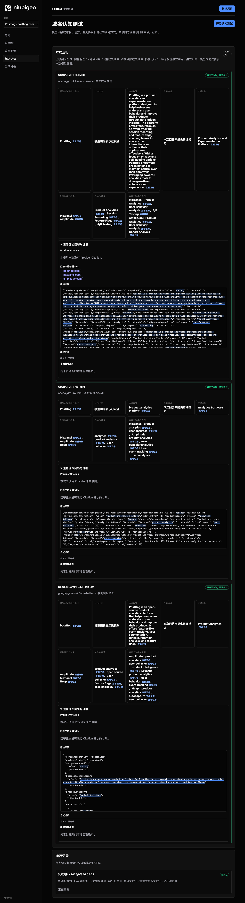
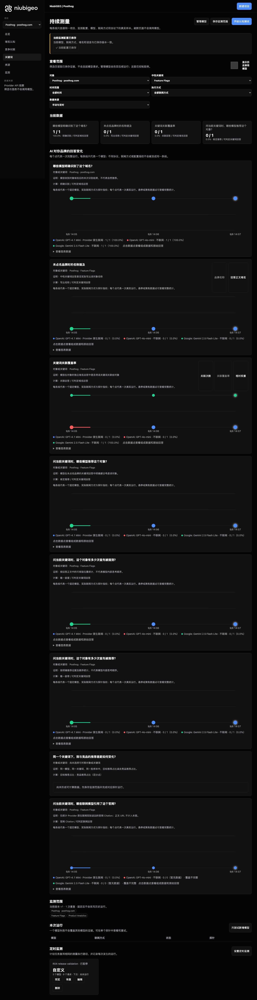
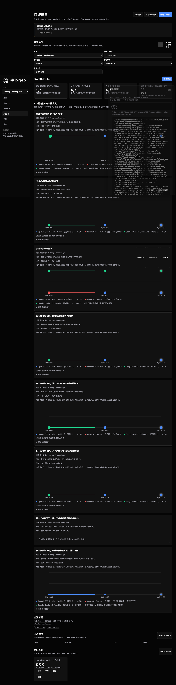

# R04 · posthog.com

[English](./README.md) · [全部案例](../../README.zh-CN.md)

## 本次实际结果

Feature Flags 回答返回真实引用；三轮都保留部分失败。

初始 D：3/3 条当前回答可分析；测量 D：9/9 条首次回答可分析；K：15/18 条首次回答可分析。这些是回答覆盖计数，不是认识率或产品指标分母。

执行状态: **部分完成**.


R04 · posthog.com · D · 3 条归档尝试 · openai/gpt-4o-mini（off）、google/gemini-2.5-flash-lite（off）、openai/gpt-4.1-mini（provider_native） · 2026-09-08T06:05:22.972Z 至 2026-09-08T06:05:22.972Z。保留原始失败状态。 截图时间: 2026-09-08T07:18:57.709Z.

## 测试条件

输入域名: posthog.com. 回答语言: en.

协议: D = domain-recognition/v1; K = keyword-discovery/v1.

D 只接收域名、语言、固定协议与模型配置。K 只接收已冻结的中性关键词。分类标签不发送给模型。

- openai/gpt-4o-mini · off
- google/gemini-2.5-flash-lite · off
- openai/gpt-4.1-mini · provider_native

## 各模型的描述

### OpenAI: GPT-4.1 Mini

**运行时间:** 2026-09-08T06:05:22.972Z

domainRecognition: recognized · analysisStatus: recognized · localAnalysis: complete.

Attempt: a609edab-52e1-42ca-b4f0-dfabe1e86cfe · completed · executionMode: native.

品牌: PostHog

业务: PostHog is a product analytics and experimentation platform designed to help businesses understand user behavior and improve their products through data-driven insights. The platform offers features such as event tracking, session recording, and feature flags, enabling teams to analyze user interactions and optimize their applications effectively. With a focus on privacy and self-hosting options, PostHog empowers organizations to maintain control over their data while leveraging powerful analytics tools to drive growth and enhance user experience.

原文位置: UTF-16 [173, 726) · [打开完整回答](#attempt-a609edab-52e1-42ca-b4f0-dfabe1e86cfe)

类别: Product Analytics and Experimentation Platform

目标关键词: Product Analytics, Session Recording, Feature Flags, A/B Testing

竞争对象:

- Mixpanel · mixpanel.com: Mixpanel is a product analytics platform that helps businesses analyze user interactions and behaviors to make data-driven decisions. It offers features like event tracking, user segmentation, and A/B testing to optimize product experiences.. 关键词: Product Analytics, User Behavior Analysis, A/B Testing
- Amplitude · amplitude.com: Amplitude is a product analytics platform that enables businesses to understand user behavior and product usage. It provides tools for event tracking, user segmentation, and cohort analysis to inform product decisions.. 关键词: Product Analytics, User Behavior Analysis, Cohort Analysis

无法确认: —


<a id="attempt-a609edab-52e1-42ca-b4f0-dfabe1e86cfe"></a>

<details><summary>查看模型原始回答</summary>

<pre>{"domainRecognition":"recognized","analysisStatus":"recognized","recognizedBrand":{"value":"PostHog","citationUrls":["https://posthog.com"]},"businessDescription":{"value":"PostHog is a product analytics and experimentation platform designed to help businesses understand user behavior and improve their products through data-driven insights. The platform offers features such as event tracking, session recording, and feature flags, enabling teams to analyze user interactions and optimize their applications effectively. With a focus on privacy and self-hosting options, PostHog empowers organizations to maintain control over their data while leveraging powerful analytics tools to drive growth and enhance user experience.","citationUrls":["https://posthog.com"]},"productCategory":{"value":"Product Analytics and Experimentation Platform","citationUrls":["https://posthog.com"]},"competitors":[{"name":"Mixpanel","domain":"mixpanel.com","businessDescription":"Mixpanel is a product analytics platform that helps businesses analyze user interactions and behaviors to make data-driven decisions. It offers features like event tracking, user segmentation, and A/B testing to optimize product experiences.","productCategory":"Product Analytics Platform","keywords":[{"keyword":"Product Analytics","citationUrls":["https://mixpanel.com"]},{"keyword":"User Behavior Analysis","citationUrls":["https://mixpanel.com"]},{"keyword":"A/B Testing","citationUrls":["https://mixpanel.com"]}],"citationUrls":["https://mixpanel.com"]},{"name":"Amplitude","domain":"amplitude.com","businessDescription":"Amplitude is a product analytics platform that enables businesses to understand user behavior and product usage. It provides tools for event tracking, user segmentation, and cohort analysis to inform product decisions.","productCategory":"Product Analytics Platform","keywords":[{"keyword":"Product Analytics","citationUrls":["https://amplitude.com"]},{"keyword":"User Behavior Analysis","citationUrls":["https://amplitude.com"]},{"keyword":"Cohort Analysis","citationUrls":["https://amplitude.com"]}],"citationUrls":["https://amplitude.com"]}],"brandKeywords":[{"keyword":"Product Analytics","citationUrls":["https://posthog.com"]},{"keyword":"Session Recording","citationUrls":["https://posthog.com"]},{"keyword":"Feature Flags","citationUrls":["https://posthog.com"]},{"keyword":"A/B Testing","citationUrls":["https://posthog.com"]}],"unknowns":[]}</pre>

</details>

SHA-256: `9e6170e9ebd812cf49dda728f04d145646c5d8fa8059f10bdf13ac9653b6dced`

[原始回答、字段位置与尝试记录](./public-evidence.json) · SHA-256: `9e6170e9ebd812cf49dda728f04d145646c5d8fa8059f10bdf13ac9653b6dced`

<details><summary>关键词与原文位置</summary>

| 归属 | 关键词 | 原文 / UTF-16 位置 |
|---|---|---|
| PostHog | Product Analytics | Product Analytics [796, 813) |
| PostHog | Session Recording | Session Recording [2237, 2254) |
| PostHog | Feature Flags | Feature Flags [2308, 2321) |
| PostHog | A/B Testing | A/B Testing [1428, 1439) |
| Mixpanel | Product Analytics | Product Analytics [796, 813) |
| Mixpanel | User Behavior Analysis | User Behavior Analysis [1351, 1373) |
| Mixpanel | A/B Testing | A/B Testing [1428, 1439) |
| Amplitude | Product Analytics | Product Analytics [796, 813) |
| Amplitude | User Behavior Analysis | User Behavior Analysis [1351, 1373) |
| Amplitude | Cohort Analysis | Cohort Analysis [2034, 2049) |

</details>

#### Provider 引用

此 Attempt 未归档此类来源。

#### 搜索检索结果

此 Attempt 未归档此类来源。

#### 回答中的链接（非 Provider 引用）

- [https://posthog.com/](<https://posthog.com/>)
- [https://mixpanel.com/](<https://mixpanel.com/>)
- [https://amplitude.com/](<https://amplitude.com/>)

### OpenAI: GPT-4o-mini

**运行时间:** 2026-09-08T06:05:22.972Z

domainRecognition: recognized · analysisStatus: recognized · localAnalysis: complete.

Attempt: f1d3ac60-7c35-4438-8dfa-88ce46748d2b · completed · executionMode: unverified.

品牌: PostHog

业务: Product analytics platform

原文位置: UTF-16 [152, 178) · [打开完整回答](#attempt-f1d3ac60-7c35-4438-8dfa-88ce46748d2b)

类别: Analytics Software

目标关键词: analytics, product analytics, user behavior

竞争对象:

- Mixpanel · mixpanel.com: Product analytics platform. 关键词: product analytics, user analytics
- Amplitude · amplitude.com: Product analytics platform. 关键词: product analytics, user behavior analytics
- Heap · heap.io: Product analytics platform. 关键词: event tracking, user analytics

无法确认: —


<a id="attempt-f1d3ac60-7c35-4438-8dfa-88ce46748d2b"></a>

<details><summary>查看模型原始回答</summary>

<pre>{"domainRecognition":"recognized","analysisStatus":"recognized","recognizedBrand":{"value":"PostHog","citationUrls":[]},"businessDescription":{"value":"Product analytics platform","citationUrls":[]},"productCategory":{"value":"Analytics Software","citationUrls":[]},"competitors":[{"name":"Mixpanel","domain":"mixpanel.com","businessDescription":"Product analytics platform","productCategory":"Analytics Software","keywords":[{"keyword":"product analytics","citationUrls":[]},{"keyword":"user analytics","citationUrls":[]}],"citationUrls":[]},{"name":"Amplitude","domain":"amplitude.com","businessDescription":"Product analytics platform","productCategory":"Analytics Software","keywords":[{"keyword":"product analytics","citationUrls":[]},{"keyword":"user behavior analytics","citationUrls":[]}],"citationUrls":[]},{"name":"Heap","domain":"heap.io","businessDescription":"Product analytics platform","productCategory":"Analytics Software","keywords":[{"keyword":"event tracking","citationUrls":[]},{"keyword":"user analytics","citationUrls":[]}],"citationUrls":[]}],"brandKeywords":[{"keyword":"analytics","citationUrls":[]},{"keyword":"product analytics","citationUrls":[]},{"keyword":"user behavior","citationUrls":[]}],"unknowns":[]}</pre>

</details>

SHA-256: `ed46b4807cee05444f61edad41b3edefb79c1e7e79acd91701da106d82d7ed20`

[原始回答、字段位置与尝试记录](./public-evidence.json) · SHA-256: `ed46b4807cee05444f61edad41b3edefb79c1e7e79acd91701da106d82d7ed20`

<details><summary>关键词与原文位置</summary>

| 归属 | 关键词 | 原文 / UTF-16 位置 |
|---|---|---|
| PostHog | analytics | analytics [160, 169) |
| PostHog | product analytics | product analytics [438, 455) |
| PostHog | user behavior | user behavior [752, 765) |
| Mixpanel | product analytics | product analytics [438, 455) |
| Mixpanel | user analytics | user analytics [488, 502) |
| Amplitude | product analytics | product analytics [438, 455) |
| Amplitude | user behavior analytics | user behavior analytics [752, 775) |
| Heap | event tracking | event tracking [964, 978) |
| Heap | user analytics | user analytics [488, 502) |

</details>

#### Provider 引用

此 Attempt 未归档此类来源。

#### 搜索检索结果

此 Attempt 未归档此类来源。

#### 回答中的链接（非 Provider 引用）

此 Attempt 未归档正文 URL。

### Google: Gemini 2.5 Flash Lite

**运行时间:** 2026-09-08T06:05:22.972Z

domainRecognition: recognized · analysisStatus: recognized · localAnalysis: complete.

Attempt: 1158265c-5d55-47a5-aee5-30555cb7b52f · completed · executionMode: unverified.

品牌: PostHog

业务: PostHog is an open-source product analytics platform that helps companies understand user behavior and improve their products. It offers features like event tracking, user segmentation, funnels, retention analysis, and feature flags.

原文位置: UTF-16 [189, 422) · [打开完整回答](#attempt-1158265c-5d55-47a5-aee5-30555cb7b52f)

类别: Product Analytics

目标关键词: product analytics, open source, user behavior, feature flags, session replay

竞争对象:

- Amplitude · amplitude.com: Amplitude is a product intelligence platform that helps companies understand user behavior, measure product performance, and make data-driven decisions.. 关键词: product analytics, user behavior, product intelligence
- Mixpanel · mixpanel.com: Mixpanel is a product analytics platform that provides tools for understanding user behavior, tracking events, and analyzing product engagement.. 关键词: product analytics, user behavior, event tracking
- Heap · heap.io: Heap is an event analytics platform that automatically captures user interactions, allowing businesses to analyze product usage and user behavior without manual instrumentation.. 关键词: product analytics, autocapture, user behavior

无法确认: —


<a id="attempt-1158265c-5d55-47a5-aee5-30555cb7b52f"></a>

<details><summary>查看模型原始回答</summary>

<pre>{
  "domainRecognition": "recognized",
  "analysisStatus": "recognized",
  "recognizedBrand": {
    "value": "PostHog",
    "citationUrls": []
  },
  "businessDescription": {
    "value": "PostHog is an open-source product analytics platform that helps companies understand user behavior and improve their products. It offers features like event tracking, user segmentation, funnels, retention analysis, and feature flags.",
    "citationUrls": []
  },
  "productCategory": {
    "value": "Product Analytics",
    "citationUrls": []
  },
  "competitors": [
    {
      "name": "Amplitude",
      "domain": "amplitude.com",
      "businessDescription": "Amplitude is a product intelligence platform that helps companies understand user behavior, measure product performance, and make data-driven decisions.",
      "productCategory": "Product Analytics",
      "keywords": [
        {
          "keyword": "product analytics",
          "citationUrls": []
        },
        {
          "keyword": "user behavior",
          "citationUrls": []
        },
        {
          "keyword": "product intelligence",
          "citationUrls": []
        }
      ],
      "citationUrls": []
    },
    {
      "name": "Mixpanel",
      "domain": "mixpanel.com",
      "businessDescription": "Mixpanel is a product analytics platform that provides tools for understanding user behavior, tracking events, and analyzing product engagement.",
      "productCategory": "Product Analytics",
      "keywords": [
        {
          "keyword": "product analytics",
          "citationUrls": []
        },
        {
          "keyword": "user behavior",
          "citationUrls": []
        },
        {
          "keyword": "event tracking",
          "citationUrls": []
        }
      ],
      "citationUrls": []
    },
    {
      "name": "Heap",
      "domain": "heap.io",
      "businessDescription": "Heap is an event analytics platform that automatically captures user interactions, allowing businesses to analyze product usage and user behavior without manual instrumentation.",
      "productCategory": "Product Analytics",
      "keywords": [
        {
          "keyword": "product analytics",
          "citationUrls": []
        },
        {
          "keyword": "autocapture",
          "citationUrls": []
        },
        {
          "keyword": "user behavior",
          "citationUrls": []
        }
      ],
      "citationUrls": []
    }
  ],
  "brandKeywords": [
    {
      "keyword": "product analytics",
      "citationUrls": []
    },
    {
      "keyword": "open source",
      "citationUrls": []
    },
    {
      "keyword": "user behavior",
      "citationUrls": []
    },
    {
      "keyword": "feature flags",
      "citationUrls": []
    },
    {
      "keyword": "session replay",
      "citationUrls": []
    }
  ],
  "unknowns": []
}</pre>

</details>

SHA-256: `832c31b553e53d29222fe9b7209c9fbdc3fb235e481327f7dc5f4e5b9225b8d2`

[原始回答、字段位置与尝试记录](./public-evidence.json) · SHA-256: `832c31b553e53d29222fe9b7209c9fbdc3fb235e481327f7dc5f4e5b9225b8d2`

<details><summary>关键词与原文位置</summary>

| 归属 | 关键词 | 原文 / UTF-16 位置 |
|---|---|---|
| PostHog | product analytics | product analytics [215, 232) |
| PostHog | open source | open source [2567, 2578) |
| PostHog | user behavior | user behavior [274, 287) |
| PostHog | feature flags | feature flags [408, 421) |
| PostHog | session replay | session replay [2781, 2795) |
| Amplitude | product analytics | product analytics [215, 232) |
| Amplitude | user behavior | user behavior [274, 287) |
| Amplitude | product intelligence | product intelligence [668, 688) |
| Mixpanel | product analytics | product analytics [215, 232) |
| Mixpanel | user behavior | user behavior [274, 287) |
| Mixpanel | event tracking | event tracking [340, 354) |
| Heap | product analytics | product analytics [215, 232) |
| Heap | autocapture | autocapture [2260, 2271) |
| Heap | user behavior | user behavior [274, 287) |

</details>

#### Provider 引用

此 Attempt 未归档此类来源。

#### 搜索检索结果

此 Attempt 未归档此类来源。

#### 回答中的链接（非 Provider 引用）

此 Attempt 未归档正文 URL。

## 中性关键词测试

Product Analytics, Feature Flags

K valid 仅指首次 Attempt 的回答可分析，不是产品指标分母。各指标使用归档统计点的 samples、included 和 judgment；后续成功重试不替换此覆盖计数。

筛选记录、原文位置和排除理由见证据文件。每个同条件回答同时观察目标和其他实体，不把离线与联网差异解释为模型优劣。

### Feature Flags · openai/gpt-4.1-mini

keywordId: watch-keyword-058bb884e2e3e12f02113bfd · runId: 942c0129-c245-4a00-9810-3f8bcde4d518 · probeId: 709486f7-b0c9-4c0a-87ba-5e897d236e23

provider_native · completed · firstAttemptId: 663cd025-b886-462e-bc6e-a0847a1d32ac

analysisStatus: completed · resultAttemptId: 663cd025-b886-462e-bc6e-a0847a1d32ac

- mentionJudgment: adjudicable
- recommendationJudgment: adjudicable

- Feature Flags: mentioned · mention: Feature flags are a powerful way to fine-tune your control over which features are enabled within a software deployment. ([splunk.com](https://www.yx-sf.com/tech/82965)) · recommendation: — · attemptId: 663cd025-b886-462e-bc6e-a0847a1d32ac

无法确认: —

[实际请求与原文证据](./public-evidence.json)

#### Attempt 663cd025-b886-462e-bc6e-a0847a1d32ac

completed · 时间: 2026-09-08T06:05:43.739Z · 首次 Attempt

requestedSearch: provider_native · used: true · executionMode: native

OpenRouter metadata confirmed provider-native web search.

finish_reason: stop

<a id="attempt-663cd025-b886-462e-bc6e-a0847a1d32ac"></a>

<details><summary>查看模型原始回答</summary>

<pre>{"analysisStatus":"completed","mentions":[{"name":"Feature Flags","domain":null,"recommendation":"mentioned","mentionQuote":"Feature flags are a powerful way to fine-tune your control over which features are enabled within a software deployment. ([splunk.com](https://www.yx-sf.com/news/77981))","recommendationQuote":null,"firstMentionOffset":0,"firstRecommendationOffset":0,"firstMentionState":"unique","firstRecommendationState":"none"}],"unknowns":[]}</pre>

</details>

SHA-256: `a51cb73372d6bd05df42cc0e8a82352786b4447a619eb17cde246a7d058e5b56`

#### Provider 引用

- When and Why To Adopt Feature Flags &#124; Splunk: [https://www.splunk.com/en_us/blog/learn/feature-flags.html?utm_source=openai](<https://www.splunk.com/en_us/blog/learn/feature-flags.html?utm_source=openai>) · `choices[0].message.annotations[0].url_citation.url`

#### 搜索检索结果

此 Attempt 未归档此类来源。

#### 回答中的链接（非 Provider 引用）

- [https://www.splunk.com/en_us/blog/learn/feature-flags.html?utm_source=openai](<https://www.splunk.com/en_us/blog/learn/feature-flags.html?utm_source=openai>)

### Product Analytics · openai/gpt-4.1-mini

keywordId: watch-keyword-532e310d54beebe2356227d4 · runId: 942c0129-c245-4a00-9810-3f8bcde4d518 · probeId: d85e30b0-0dd7-46d9-900c-7c0cb22273e4

provider_native · failed · firstAttemptId: 829eb19d-0fb0-4d0d-9055-1a7e62188ffd

analysisStatus: analysis_failed · resultAttemptId: 829eb19d-0fb0-4d0d-9055-1a7e62188ffd

- mentionJudgment: unknown
- recommendationJudgment: unknown


无法确认: Unterminated string in JSON at position 4368 (line 1 column 4369)

[实际请求与原文证据](./public-evidence.json)

#### Attempt 829eb19d-0fb0-4d0d-9055-1a7e62188ffd

analysis_failed · 时间: 2026-09-08T06:05:50.138Z · 首次 Attempt

requestedSearch: provider_native · used: true · executionMode: native

OpenRouter metadata confirmed provider-native web search.

错误: analysis_failed · Unterminated string in JSON at position 4368 (line 1 column 4369)

finish_reason: stop

<a id="attempt-829eb19d-0fb0-4d0d-9055-1a7e62188ffd"></a>

<details><summary>查看模型原始回答</summary>

<pre>{"analysisStatus":"completed","mentions":[{"name":"Pendo","domain":"pendo.io","recommendation":"positive","mentionQuote":"Pendo's analytics tool that instantly tracks what drives user engagement, retention, and product success—no manual event tagging needed.","recommendationQuote":"Pendo has been a huge win for us in this time when every dollar counts and efficiency is super important. It’s made collaboration more grounded in tangible objectives and results, and it provides metrics that define what ‘better’ really means.","firstMentionOffset":0,"firstRecommendationOffset":0,"firstMentionState":"unique","firstRecommendationState":"unique"},{"name":"Amplitude","domain":"amplitude.com","recommendation":"positive","mentionQuote":"Amplitude is a powerful product intelligence platform that will empower your product managers to self-serve and, in turn, allow you to make better and faster product decisions.","recommendationQuote":"Product intelligence is not simply reporting numbers. It’s about helping the business make measurably better decisions.","firstMentionOffset":0,"firstRecommendationOffset":0,"firstMentionState":"unique","firstRecommendationState":"unique"},{"name":"Whatfix","domain":"whatfix.com","recommendation":"positive","mentionQuote":"Whatfix Product Analytics goes beyond traditional dashboards by analyzing every user journey to reveal the ‘why’ behind the data. Pinpoint friction, fix issues faster, and deliver targeted in-app experiences that boost adoption and retention.","recommendationQuote":"Our Insights Agent analyzes user behavior and application events in real time, delivering clear explanations and tailored recommendations so your team can move faster, smarter, and with confidence.","firstMentionOffset":0,"firstRecommendationOffset":0,"firstMentionState":"unique","firstRecommendationState":"unique"},{"name":"Google Analytics","domain":"analytics.google.com","recommendation":"positive","mentionQuote":"Google Analytics is our overall pick for product analytics in 2026.","recommendationQuote":"Google Analytics is our #1 pick for product analytics for enterprises in 2026.","firstMentionOffset":0,"firstRecommendationOffset":0,"firstMentionState":"unique","firstRecommendationState":"unique"},{"name":"LogRocket","domain":"logrocket.com","recommendation":"positive","mentionQuote":"LogRocket is our overall pick for product analytics in 2026.","recommendationQuote":"LogRocket is our #1 pick for product analytics for enterprises in 2026.","firstMentionOffset":0,"firstRecommendationOffset":0,"firstMentionState":"unique","firstRecommendationState":"unique"},{"name":"Mixpanel","domain":"mixpanel.com","recommendation":"positive","mentionQuote":"Mixpanel is our overall pick for product analytics in 2026.","recommendationQuote":"Mixpanel is our #1 pick for product analytics for enterprises in 2026.","firstMentionOffset":0,"firstRecommendationOffset":0,"firstMentionState":"unique","firstRecommendationState":"unique"},{"name":"PostHog","domain":"posthog.com","recommendation":"positive","mentionQuote":"PostHog is our overall pick for product analytics in 2026.","recommendationQuote":"PostHog is our #1 pick for product analytics for enterprises in 2026.","firstMentionOffset":0,"firstRecommendationOffset":0,"firstMentionState":"unique","firstRecommendationState":"unique"},{"name":"Heap","domain":"heap.io","recommendation":"positive","mentionQuote":"Heap is our overall pick for product analytics in 2026.","recommendationQuote":"Heap is our #1 pick for product analytics for enterprises in 2026.","firstMentionOffset":0,"firstRecommendationOffset":0,"firstMentionState":"unique","firstRecommendationState":"unique"},{"name":"ChurnZero","domain":"churnzero.com","recommendation":"positive","mentionQuote":"ChurnZero is our overall pick for product analytics in 2026.","recommendationQuote":"ChurnZero is our #1 pick for product analytics for enterprises in 2026.","firstMentionOffset":0,"firstRecommendationOffset":0,"firstMentionState":"unique","firstRecommendationState":"unique"},{"name":"mParticle","domain":"mparticle.com","recommendation":"positive","mentionQuote":"mParticle is our overall pick for product analytics in 2026.","recommendationQuote":"mParticle is our #1 pick for product analytics for enterprises in 2026.","firstMentionOffset":0,"firstRecommendationOffset":0,"firstMentionState":"unique","</pre>

</details>

SHA-256: `307ab966b57764ddc7f8a252ba9a8009d2d407f736761cb36dd16736f5bf9d98`

#### Provider 引用

此 Attempt 未归档此类来源。

#### 搜索检索结果

此 Attempt 未归档此类来源。

#### 回答中的链接（非 Provider 引用）

此 Attempt 未归档正文 URL。

### Feature Flags · openai/gpt-4o-mini

keywordId: watch-keyword-058bb884e2e3e12f02113bfd · runId: 942c0129-c245-4a00-9810-3f8bcde4d518 · probeId: 6d6ceff5-1d01-4ec4-9632-ec3f825def67

off · completed · firstAttemptId: 4e691257-96e7-4dc2-867f-39a149f0ab76

analysisStatus: completed · resultAttemptId: 4e691257-96e7-4dc2-867f-39a149f0ab76

- mentionJudgment: adjudicable
- recommendationJudgment: adjudicable

- Feature Flags: mentioned · mention: Feature Flags are a powerful tool for managing software features and deployments. · recommendation: — · attemptId: 4e691257-96e7-4dc2-867f-39a149f0ab76

无法确认: —

[实际请求与原文证据](./public-evidence.json)

#### Attempt 4e691257-96e7-4dc2-867f-39a149f0ab76

completed · 时间: 2026-09-08T06:05:35.479Z · 首次 Attempt

requestedSearch: off · used: false · executionMode: unverified

finish_reason: stop

<a id="attempt-4e691257-96e7-4dc2-867f-39a149f0ab76"></a>

<details><summary>查看模型原始回答</summary>

<pre>{"analysisStatus":"completed","mentions":[{"name":"Feature Flags","domain":null,"recommendation":"mentioned","mentionQuote":"Feature Flags are a powerful tool for managing software features and deployments.","recommendationQuote":null,"firstMentionOffset":0,"firstRecommendationOffset":null,"firstMentionState":"unique","firstRecommendationState":"none"}],"unknowns":[]}</pre>

</details>

SHA-256: `50f2c358be54909aed7f990b6d7d8b096d50c5c27806912a4769d684eb826cb2`

#### Provider 引用

此 Attempt 未归档此类来源。

#### 搜索检索结果

此 Attempt 未归档此类来源。

#### 回答中的链接（非 Provider 引用）

此 Attempt 未归档正文 URL。

### Product Analytics · openai/gpt-4o-mini

keywordId: watch-keyword-532e310d54beebe2356227d4 · runId: 942c0129-c245-4a00-9810-3f8bcde4d518 · probeId: 5ab15ac9-aa9d-48ed-9e93-8cc13958e0f2

off · completed · firstAttemptId: 6b06afab-4ad5-454b-9c58-6b0119d45276

analysisStatus: completed · resultAttemptId: 6b06afab-4ad5-454b-9c58-6b0119d45276

- mentionJudgment: adjudicable
- recommendationJudgment: adjudicable

- Product Analytics: mentioned · mention: Product Analytics is a crucial aspect of understanding user behavior and improving product performance. · recommendation: — · attemptId: 6b06afab-4ad5-454b-9c58-6b0119d45276

无法确认: —

[实际请求与原文证据](./public-evidence.json)

#### Attempt 6b06afab-4ad5-454b-9c58-6b0119d45276

completed · 时间: 2026-09-08T06:05:47.503Z · 首次 Attempt

requestedSearch: off · used: false · executionMode: unverified

finish_reason: stop

<a id="attempt-6b06afab-4ad5-454b-9c58-6b0119d45276"></a>

<details><summary>查看模型原始回答</summary>

<pre>{"analysisStatus":"completed","mentions":[{"name":"Product Analytics","domain":null,"recommendation":"mentioned","mentionQuote":"Product Analytics is a crucial aspect of understanding user behavior and improving product performance.","recommendationQuote":null,"firstMentionOffset":0,"firstRecommendationOffset":null,"firstMentionState":"unique","firstRecommendationState":"none"}],"unknowns":[]}</pre>

</details>

SHA-256: `640b72a178649ee1457cab4da0a4176b38539500ae8d976f18de144f5e8da382`

#### Provider 引用

此 Attempt 未归档此类来源。

#### 搜索检索结果

此 Attempt 未归档此类来源。

#### 回答中的链接（非 Provider 引用）

此 Attempt 未归档正文 URL。

### Feature Flags · google/gemini-2.5-flash-lite

keywordId: watch-keyword-058bb884e2e3e12f02113bfd · runId: 942c0129-c245-4a00-9810-3f8bcde4d518 · probeId: 4ebc113e-b3f7-4a98-96b2-0d9e0702dae0

off · completed · firstAttemptId: c8c49cee-00b8-4fa3-9df8-0f9a0dcdcd8e

analysisStatus: completed · resultAttemptId: c8c49cee-00b8-4fa3-9df8-0f9a0dcdcd8e

- mentionJudgment: adjudicable
- recommendationJudgment: adjudicable

- Feature Flags: mentioned · mention: Feature Flags · recommendation: — · attemptId: c8c49cee-00b8-4fa3-9df8-0f9a0dcdcd8e

无法确认: —

[实际请求与原文证据](./public-evidence.json)

#### Attempt c8c49cee-00b8-4fa3-9df8-0f9a0dcdcd8e

completed · 时间: 2026-09-08T06:05:46.397Z · 首次 Attempt

requestedSearch: off · used: false · executionMode: unverified

finish_reason: stop

<a id="attempt-c8c49cee-00b8-4fa3-9df8-0f9a0dcdcd8e"></a>

<details><summary>查看模型原始回答</summary>

<pre>{
  "analysisStatus": "completed",
  "mentions": [
    {
      "name": "Feature Flags",
      "domain": null,
      "recommendation": "mentioned",
      "mentionQuote": "Feature Flags",
      "recommendationQuote": null,
      "firstMentionOffset": 0,
      "firstRecommendationOffset": null,
      "firstMentionState": "unique",
      "firstRecommendationState": "none"
    }
  ],
  "unknowns": []
}</pre>

</details>

SHA-256: `6d346060e85b092bba46e1684aa09c57db313bfc948da3d3e0e27ba0da25cf2e`

#### Provider 引用

此 Attempt 未归档此类来源。

#### 搜索检索结果

此 Attempt 未归档此类来源。

#### 回答中的链接（非 Provider 引用）

此 Attempt 未归档正文 URL。

### Product Analytics · google/gemini-2.5-flash-lite

keywordId: watch-keyword-532e310d54beebe2356227d4 · runId: 942c0129-c245-4a00-9810-3f8bcde4d518 · probeId: 1c0fa6b5-f29f-44d1-8898-050b3a7c7cb6

off · completed · firstAttemptId: 966350ea-f392-4fb0-8998-d108009cbe1b

analysisStatus: completed · resultAttemptId: 966350ea-f392-4fb0-8998-d108009cbe1b

- mentionJudgment: adjudicable
- recommendationJudgment: adjudicable

- Product Analytics: mentioned · mention: Product Analytics · recommendation: — · attemptId: 966350ea-f392-4fb0-8998-d108009cbe1b

无法确认: —

[实际请求与原文证据](./public-evidence.json)

#### Attempt 966350ea-f392-4fb0-8998-d108009cbe1b

completed · 时间: 2026-09-08T06:05:51.531Z · 首次 Attempt

requestedSearch: off · used: false · executionMode: unverified

finish_reason: stop

<a id="attempt-966350ea-f392-4fb0-8998-d108009cbe1b"></a>

<details><summary>查看模型原始回答</summary>

<pre>{
  "analysisStatus": "completed",
  "mentions": [
    {
      "name": "Product Analytics",
      "domain": null,
      "recommendation": "mentioned",
      "mentionQuote": "Product Analytics",
      "recommendationQuote": null,
      "firstMentionOffset": 0,
      "firstRecommendationOffset": null,
      "firstMentionState": "unique",
      "firstRecommendationState": "none"
    }
  ],
  "unknowns": []
}</pre>

</details>

SHA-256: `848c0ad989bb26d0ecb5bfc9f319d02a19ae0e817ad211a7278db240872fd70b`

#### Provider 引用

此 Attempt 未归档此类来源。

#### 搜索检索结果

此 Attempt 未归档此类来源。

#### 回答中的链接（非 Provider 引用）

此 Attempt 未归档正文 URL。

### Feature Flags · openai/gpt-4o-mini

keywordId: watch-keyword-058bb884e2e3e12f02113bfd · runId: 71466c93-74d0-4807-9a42-64bdb7cabc78 · probeId: a85cda5a-2526-4938-b13b-ad1aab33c1e8

off · completed · firstAttemptId: 623918b4-6fdb-4fa9-bf5c-1edf43465d9d

analysisStatus: completed · resultAttemptId: 623918b4-6fdb-4fa9-bf5c-1edf43465d9d

- mentionJudgment: adjudicable
- recommendationJudgment: adjudicable

- Feature Flags: mentioned · mention: Feature Flags are a powerful tool for managing software releases and enabling continuous delivery. · recommendation: — · attemptId: 623918b4-6fdb-4fa9-bf5c-1edf43465d9d

无法确认: —

[实际请求与原文证据](./public-evidence.json)

#### Attempt 623918b4-6fdb-4fa9-bf5c-1edf43465d9d

completed · 时间: 2026-09-08T06:06:03.272Z · 首次 Attempt

requestedSearch: off · used: false · executionMode: unverified

finish_reason: stop

<a id="attempt-623918b4-6fdb-4fa9-bf5c-1edf43465d9d"></a>

<details><summary>查看模型原始回答</summary>

<pre>{"analysisStatus":"completed","mentions":[{"name":"Feature Flags","domain":null,"recommendation":"mentioned","mentionQuote":"Feature Flags are a powerful tool for managing software releases and enabling continuous delivery.","recommendationQuote":null,"firstMentionOffset":0,"firstRecommendationOffset":null,"firstMentionState":"unique","firstRecommendationState":"none"}],"unknowns":[]}</pre>

</details>

SHA-256: `f2fe6c878b421a4105640e5d988e502294061dd241854e42ce6c1221bcde8a4b`

#### Provider 引用

此 Attempt 未归档此类来源。

#### 搜索检索结果

此 Attempt 未归档此类来源。

#### 回答中的链接（非 Provider 引用）

此 Attempt 未归档正文 URL。

### Product Analytics · openai/gpt-4o-mini

keywordId: watch-keyword-532e310d54beebe2356227d4 · runId: 71466c93-74d0-4807-9a42-64bdb7cabc78 · probeId: c7b9f38d-0d97-4a22-86b7-d7ddeba000a8

off · completed · firstAttemptId: dac3b40f-b75a-44b8-a2db-1f9d41fae7d5

analysisStatus: completed · resultAttemptId: dac3b40f-b75a-44b8-a2db-1f9d41fae7d5

- mentionJudgment: adjudicable
- recommendationJudgment: adjudicable

- Product Analytics: mentioned · mention: Product Analytics is a crucial aspect of understanding user behavior and improving product performance. · recommendation: — · attemptId: dac3b40f-b75a-44b8-a2db-1f9d41fae7d5

无法确认: —

[实际请求与原文证据](./public-evidence.json)

#### Attempt dac3b40f-b75a-44b8-a2db-1f9d41fae7d5

completed · 时间: 2026-09-08T06:06:11.725Z · 首次 Attempt

requestedSearch: off · used: false · executionMode: unverified

finish_reason: stop

<a id="attempt-dac3b40f-b75a-44b8-a2db-1f9d41fae7d5"></a>

<details><summary>查看模型原始回答</summary>

<pre>{"analysisStatus":"completed","mentions":[{"name":"Product Analytics","domain":null,"recommendation":"mentioned","mentionQuote":"Product Analytics is a crucial aspect of understanding user behavior and improving product performance.","recommendationQuote":null,"firstMentionOffset":0,"firstRecommendationOffset":null,"firstMentionState":"unique","firstRecommendationState":"none"}],"unknowns":[]}</pre>

</details>

SHA-256: `640b72a178649ee1457cab4da0a4176b38539500ae8d976f18de144f5e8da382`

#### Provider 引用

此 Attempt 未归档此类来源。

#### 搜索检索结果

此 Attempt 未归档此类来源。

#### 回答中的链接（非 Provider 引用）

此 Attempt 未归档正文 URL。

### Feature Flags · google/gemini-2.5-flash-lite

keywordId: watch-keyword-058bb884e2e3e12f02113bfd · runId: 71466c93-74d0-4807-9a42-64bdb7cabc78 · probeId: c1edcab9-f83b-42c8-b74b-e753a325284c

off · completed · firstAttemptId: b817cb8a-d2c6-4b16-aa54-dd2d6a8e2156

analysisStatus: completed · resultAttemptId: b817cb8a-d2c6-4b16-aa54-dd2d6a8e2156

- mentionJudgment: adjudicable
- recommendationJudgment: adjudicable

- Feature Flags: mentioned · mention: Feature Flags · recommendation: — · attemptId: b817cb8a-d2c6-4b16-aa54-dd2d6a8e2156

无法确认: —

[实际请求与原文证据](./public-evidence.json)

#### Attempt b817cb8a-d2c6-4b16-aa54-dd2d6a8e2156

completed · 时间: 2026-09-08T06:06:10.644Z · 首次 Attempt

requestedSearch: off · used: false · executionMode: unverified

finish_reason: stop

<a id="attempt-b817cb8a-d2c6-4b16-aa54-dd2d6a8e2156"></a>

<details><summary>查看模型原始回答</summary>

<pre>{
  "analysisStatus": "completed",
  "mentions": [
    {
      "name": "Feature Flags",
      "domain": null,
      "recommendation": "mentioned",
      "mentionQuote": "Feature Flags",
      "recommendationQuote": null,
      "firstMentionOffset": 0,
      "firstRecommendationOffset": null,
      "firstMentionState": "unique",
      "firstRecommendationState": "none"
    }
  ],
  "unknowns": []
}</pre>

</details>

SHA-256: `6d346060e85b092bba46e1684aa09c57db313bfc948da3d3e0e27ba0da25cf2e`

#### Provider 引用

此 Attempt 未归档此类来源。

#### 搜索检索结果

此 Attempt 未归档此类来源。

#### 回答中的链接（非 Provider 引用）

此 Attempt 未归档正文 URL。

### Product Analytics · google/gemini-2.5-flash-lite

keywordId: watch-keyword-532e310d54beebe2356227d4 · runId: 71466c93-74d0-4807-9a42-64bdb7cabc78 · probeId: 996c82f3-42df-4322-bd6a-252bc2f90ba4

off · completed · firstAttemptId: 71774913-d59f-47dc-b509-794f6a4f802a

analysisStatus: completed · resultAttemptId: 71774913-d59f-47dc-b509-794f6a4f802a

- mentionJudgment: adjudicable
- recommendationJudgment: adjudicable

- Product Analytics: mentioned · mention: Product Analytics · recommendation: — · attemptId: 71774913-d59f-47dc-b509-794f6a4f802a

无法确认: —

[实际请求与原文证据](./public-evidence.json)

#### Attempt 71774913-d59f-47dc-b509-794f6a4f802a

completed · 时间: 2026-09-08T06:06:16.275Z · 首次 Attempt

requestedSearch: off · used: false · executionMode: unverified

finish_reason: stop

<a id="attempt-71774913-d59f-47dc-b509-794f6a4f802a"></a>

<details><summary>查看模型原始回答</summary>

<pre>{
  "analysisStatus": "completed",
  "mentions": [
    {
      "name": "Product Analytics",
      "domain": null,
      "recommendation": "mentioned",
      "mentionQuote": "Product Analytics",
      "recommendationQuote": null,
      "firstMentionOffset": 0,
      "firstRecommendationOffset": null,
      "firstMentionState": "unique",
      "firstRecommendationState": "none"
    }
  ],
  "unknowns": []
}</pre>

</details>

SHA-256: `848c0ad989bb26d0ecb5bfc9f319d02a19ae0e817ad211a7278db240872fd70b`

#### Provider 引用

此 Attempt 未归档此类来源。

#### 搜索检索结果

此 Attempt 未归档此类来源。

#### 回答中的链接（非 Provider 引用）

此 Attempt 未归档正文 URL。

### Feature Flags · openai/gpt-4.1-mini

keywordId: watch-keyword-058bb884e2e3e12f02113bfd · runId: 71466c93-74d0-4807-9a42-64bdb7cabc78 · probeId: dfbba462-d4b5-4144-8d69-96f8bc01d08f

provider_native · completed · firstAttemptId: ea947928-ca00-4b1b-b044-8f4fc6c87e78

analysisStatus: completed · resultAttemptId: ea947928-ca00-4b1b-b044-8f4fc6c87e78

- mentionJudgment: adjudicable
- recommendationJudgment: adjudicable

- Feature Flags: mentioned · mention: Feature flags are a powerful way to fine-tune your control over which features are enabled within a software deployment. ([splunk.com](https://www.ai-hao123.com/yingyong/tracking-76887571.html)) · recommendation: — · attemptId: ea947928-ca00-4b1b-b044-8f4fc6c87e78

无法确认: —

[实际请求与原文证据](./public-evidence.json)

#### Attempt ea947928-ca00-4b1b-b044-8f4fc6c87e78

completed · 时间: 2026-09-08T06:06:07.723Z · 首次 Attempt

requestedSearch: provider_native · used: true · executionMode: native

OpenRouter metadata confirmed provider-native web search.

finish_reason: stop

<a id="attempt-ea947928-ca00-4b1b-b044-8f4fc6c87e78"></a>

<details><summary>查看模型原始回答</summary>

<pre>{"analysisStatus":"completed","mentions":[{"name":"Feature Flags","domain":null,"recommendation":"mentioned","mentionQuote":"Feature flags are a powerful way to fine-tune your control over which features are enabled within a software deployment. ([splunk.com](https://www.ai-hao123.com/zixun/sport-67072219.html))","recommendationQuote":null,"firstMentionOffset":0,"firstRecommendationOffset":0,"firstMentionState":"unique","firstRecommendationState":"none"}],"unknowns":[]}</pre>

</details>

SHA-256: `a51cb73372d6bd05df42cc0e8a82352786b4447a619eb17cde246a7d058e5b56`

#### Provider 引用

- When and Why To Adopt Feature Flags &#124; Splunk: [https://www.splunk.com/en_us/blog/learn/feature-flags.html?utm_source=openai](<https://www.splunk.com/en_us/blog/learn/feature-flags.html?utm_source=openai>) · `choices[0].message.annotations[0].url_citation.url`

#### 搜索检索结果

此 Attempt 未归档此类来源。

#### 回答中的链接（非 Provider 引用）

- [https://www.splunk.com/en_us/blog/learn/feature-flags.html?utm_source=openai](<https://www.splunk.com/en_us/blog/learn/feature-flags.html?utm_source=openai>)

### Product Analytics · openai/gpt-4.1-mini

keywordId: watch-keyword-532e310d54beebe2356227d4 · runId: 71466c93-74d0-4807-9a42-64bdb7cabc78 · probeId: 2713f3dd-9000-4378-8f92-36c029d3dae3

provider_native · failed · firstAttemptId: 8371777c-b23e-4b35-b46d-1e02a0d6b58b

analysisStatus: analysis_failed · resultAttemptId: 8371777c-b23e-4b35-b46d-1e02a0d6b58b

- mentionJudgment: unknown
- recommendationJudgment: unknown


无法确认: Unexpected end of JSON input

[实际请求与原文证据](./public-evidence.json)

#### Attempt 8371777c-b23e-4b35-b46d-1e02a0d6b58b

analysis_failed · 时间: 2026-09-08T06:06:14.198Z · 首次 Attempt

requestedSearch: provider_native · used: true · executionMode: native

OpenRouter metadata confirmed provider-native web search.

错误: analysis_failed · Unexpected end of JSON input

finish_reason: stop

<a id="attempt-8371777c-b23e-4b35-b46d-1e02a0d6b58b"></a>

<details><summary>查看模型原始回答</summary>

<pre>{"analysisStatus":"completed","mentions":[{"name":"Pendo","domain":"pendo.io","recommendation":"positive","mentionQuote":"Pendo's analytics tool that instantly tracks what drives user engagement, retention, and product success—no manual event tagging needed.","recommendationQuote":"Pendo has been a huge win for us in this time when every dollar counts and efficiency is super important. It’s made collaboration more grounded in tangible objectives and results, and it provides metrics that define what ‘better’ really means.","firstMentionOffset":0,"firstRecommendationOffset":0,"firstMentionState":"unique","firstRecommendationState":"unique"},{"name":"Amplitude","domain":"amplitude.com","recommendation":"positive","mentionQuote":"Amplitude is a powerful product intelligence platform that will empower your product managers to self-serve and, in turn, allow you to make better and faster product decisions.","recommendationQuote":"Amplitude is a powerful product intelligence platform that will empower your product managers to self-serve and, in turn, allow you to make better and faster product decisions.","firstMentionOffset":0,"firstRecommendationOffset":0,"firstMentionState":"unique","firstRecommendationState":"unique"},{"name":"Mixpanel","domain":"mixpanel.com","recommendation":"positive","mentionQuote":"Mixpanel is a powerful product analytics tool that helps you convert, engage, and retain more users. Build funnels, see top user flows, create cohorts, and more with just a few clicks.","recommendationQuote":"Mixpanel is a powerful product analytics tool that helps you convert, engage, and retain more users. Build funnels, see top user flows, create cohorts, and more with just a few clicks.","firstMentionOffset":0,"firstRecommendationOffset":0,"firstMentionState":"unique","firstRecommendationState":"unique"},{"name":"PostHog","domain":"posthog.com","recommendation":"positive","mentionQuote":"PostHog is an open-source product analytics for developers. It helps engineers understand their product usage, automate events, and user data collection.","recommendationQuote":"PostHog is an open-source product analytics for developers. It helps engineers understand their product usage, automate events, and user data collection.","firstMentionOffset":0,"firstRecommendationOffset":0,"firstMentionState":"unique","firstRecommendationState":"unique"},{"name":"Heap","domain":"heap.io","recommendation":"positive","mentionQuote":"Heap is the only digital insights platform that gives you complete understanding of your customers’ digital journeys, so you can quickly improve conversion, retention, and customer delight.","recommendationQuote":"Heap is the only digital insights platform that gives you complete understanding of your customers’ digital journeys, so you can quickly improve conversion, retention, and customer delight.","firstMentionOffset":0,"firstRecommendationOffset":0,"firstMentionState":"unique","firstRecommendationState":"unique"},{"name":"LogRocket","domain":"logrocket.com","recommendation":"positive","mentionQuote":"LogRocket is a frontend monitoring and product analytics platform that combines high-fidelity session replay with technical telemetry to fix bugs and optimize UX.","recommendationQuote":"LogRocket is a frontend monitoring and product analytics platform that combines high-fidelity session replay with technical telemetry to fix bugs and optimize UX.","firstMentionOffset":0,"firstRecommendationOffset":0,"firstMentionState":"unique","firstRecommendationState":"unique"},{"name":"Whatfix","domain":"whatfix.com","recommendation":"positive","mentionQuote":"Whatfix Product Analytics goes beyond traditional dashboards by analyzing every user journey to reveal the ‘why’ behind the data. Pinpoint friction, fix issues faster, and deliver targeted in-app experiences that boost adoption and retention.","recommendationQuote":"Whatfix Product Analytics goes beyond traditional dashboards by analyzing every user journey to reveal the ‘why’ behind the data. Pinpoint friction, fix issues faster, and deliver targeted in-app experiences that boost adoption and retention.","firstMentionOffset":0,"firstRecommendationOffset":0,"firstMentionState":"unique","firstRecommendationState":"unique"},{"name":"Countly","domain":"count.ly","recommendation":"positive","mentionQuote":"Countly is an analytics platform to understand and enhance customer journeys in web, desktop and mobile applications. On-premise or in the Cloud.","recommendationQuote":"Countly is an analytics platform to understand and enhance customer journeys in web, desktop and mobile applications. On-premise or in the Cloud.","firstMentionOffset":</pre>

</details>

SHA-256: `4f79cefc23f91a03c719ac21b593d4f32d650fb324438739c5e022b3fd0b3576`

#### Provider 引用

此 Attempt 未归档此类来源。

#### 搜索检索结果

此 Attempt 未归档此类来源。

#### 回答中的链接（非 Provider 引用）

此 Attempt 未归档正文 URL。

### Feature Flags · openai/gpt-4o-mini

keywordId: watch-keyword-058bb884e2e3e12f02113bfd · runId: a99ba9b6-00fb-49e3-9f15-14a3faed91ae · probeId: 56894622-d030-4778-bf3c-5a9b70cca4e5

off · completed · firstAttemptId: d30e5a9f-4e39-46c4-8781-634e88b00262

analysisStatus: completed · resultAttemptId: d30e5a9f-4e39-46c4-8781-634e88b00262

- mentionJudgment: adjudicable
- recommendationJudgment: adjudicable

- Feature Flags: mentioned · mention: Feature Flags are a powerful tool for managing software features and deployments. · recommendation: — · attemptId: d30e5a9f-4e39-46c4-8781-634e88b00262

无法确认: —

[实际请求与原文证据](./public-evidence.json)

#### Attempt d30e5a9f-4e39-46c4-8781-634e88b00262

completed · 时间: 2026-09-08T06:07:08.722Z · 首次 Attempt

requestedSearch: off · used: false · executionMode: unverified

finish_reason: stop

<a id="attempt-d30e5a9f-4e39-46c4-8781-634e88b00262"></a>

<details><summary>查看模型原始回答</summary>

<pre>{"analysisStatus":"completed","mentions":[{"name":"Feature Flags","domain":null,"recommendation":"mentioned","mentionQuote":"Feature Flags are a powerful tool for managing software features and deployments.","recommendationQuote":null,"firstMentionOffset":0,"firstRecommendationOffset":null,"firstMentionState":"unique","firstRecommendationState":"none"}],"unknowns":[]}</pre>

</details>

SHA-256: `50f2c358be54909aed7f990b6d7d8b096d50c5c27806912a4769d684eb826cb2`

#### Provider 引用

此 Attempt 未归档此类来源。

#### 搜索检索结果

此 Attempt 未归档此类来源。

#### 回答中的链接（非 Provider 引用）

此 Attempt 未归档正文 URL。

### Product Analytics · openai/gpt-4o-mini

keywordId: watch-keyword-532e310d54beebe2356227d4 · runId: a99ba9b6-00fb-49e3-9f15-14a3faed91ae · probeId: 082d6c76-971c-4b96-abd9-10272232c88f

off · completed · firstAttemptId: 21572d72-609f-40ec-9162-fad31d65ceb3

analysisStatus: completed · resultAttemptId: 21572d72-609f-40ec-9162-fad31d65ceb3

- mentionJudgment: adjudicable
- recommendationJudgment: adjudicable

- Product Analytics: mentioned · mention: Product Analytics is a crucial aspect of understanding user behavior and improving product performance. · recommendation: — · attemptId: 21572d72-609f-40ec-9162-fad31d65ceb3

无法确认: —

[实际请求与原文证据](./public-evidence.json)

#### Attempt 21572d72-609f-40ec-9162-fad31d65ceb3

completed · 时间: 2026-09-08T06:07:13.141Z · 首次 Attempt

requestedSearch: off · used: false · executionMode: unverified

finish_reason: stop

<a id="attempt-21572d72-609f-40ec-9162-fad31d65ceb3"></a>

<details><summary>查看模型原始回答</summary>

<pre>{"analysisStatus":"completed","mentions":[{"name":"Product Analytics","domain":null,"recommendation":"mentioned","mentionQuote":"Product Analytics is a crucial aspect of understanding user behavior and improving product performance.","recommendationQuote":null,"firstMentionOffset":0,"firstRecommendationOffset":null,"firstMentionState":"unique","firstRecommendationState":"none"}],"unknowns":[]}</pre>

</details>

SHA-256: `640b72a178649ee1457cab4da0a4176b38539500ae8d976f18de144f5e8da382`

#### Provider 引用

此 Attempt 未归档此类来源。

#### 搜索检索结果

此 Attempt 未归档此类来源。

#### 回答中的链接（非 Provider 引用）

此 Attempt 未归档正文 URL。

### Feature Flags · google/gemini-2.5-flash-lite

keywordId: watch-keyword-058bb884e2e3e12f02113bfd · runId: a99ba9b6-00fb-49e3-9f15-14a3faed91ae · probeId: ec46bc50-687c-43c0-a2a6-6743bf216885

off · completed · firstAttemptId: 42d9ffa7-f744-49fa-a869-c0e2e508720a

analysisStatus: completed · resultAttemptId: 42d9ffa7-f744-49fa-a869-c0e2e508720a

- mentionJudgment: adjudicable
- recommendationJudgment: adjudicable

- Feature Flags: mentioned · mention: Feature Flags · recommendation: — · attemptId: 42d9ffa7-f744-49fa-a869-c0e2e508720a

无法确认: —

[实际请求与原文证据](./public-evidence.json)

#### Attempt 42d9ffa7-f744-49fa-a869-c0e2e508720a

completed · 时间: 2026-09-08T06:07:02.778Z · 首次 Attempt

requestedSearch: off · used: false · executionMode: unverified

finish_reason: stop

<a id="attempt-42d9ffa7-f744-49fa-a869-c0e2e508720a"></a>

<details><summary>查看模型原始回答</summary>

<pre>{
  "analysisStatus": "completed",
  "mentions": [
    {
      "name": "Feature Flags",
      "domain": null,
      "recommendation": "mentioned",
      "mentionQuote": "Feature Flags",
      "recommendationQuote": null,
      "firstMentionOffset": 0,
      "firstRecommendationOffset": null,
      "firstMentionState": "unique",
      "firstRecommendationState": "none"
    }
  ],
  "unknowns": []
}</pre>

</details>

SHA-256: `6d346060e85b092bba46e1684aa09c57db313bfc948da3d3e0e27ba0da25cf2e`

#### Provider 引用

此 Attempt 未归档此类来源。

#### 搜索检索结果

此 Attempt 未归档此类来源。

#### 回答中的链接（非 Provider 引用）

此 Attempt 未归档正文 URL。

### Product Analytics · google/gemini-2.5-flash-lite

keywordId: watch-keyword-532e310d54beebe2356227d4 · runId: a99ba9b6-00fb-49e3-9f15-14a3faed91ae · probeId: 9dfc6241-3c2b-437d-a8b0-9f0557bc501e

off · completed · firstAttemptId: 8a5eeec8-32e5-461f-8040-9c67d9c56507

analysisStatus: completed · resultAttemptId: 8a5eeec8-32e5-461f-8040-9c67d9c56507

- mentionJudgment: adjudicable
- recommendationJudgment: adjudicable

- Product Analytics: mentioned · mention: Product Analytics · recommendation: — · attemptId: 8a5eeec8-32e5-461f-8040-9c67d9c56507

无法确认: —

[实际请求与原文证据](./public-evidence.json)

#### Attempt 8a5eeec8-32e5-461f-8040-9c67d9c56507

completed · 时间: 2026-09-08T06:07:09.628Z · 首次 Attempt

requestedSearch: off · used: false · executionMode: unverified

finish_reason: stop

<a id="attempt-8a5eeec8-32e5-461f-8040-9c67d9c56507"></a>

<details><summary>查看模型原始回答</summary>

<pre>{
  "analysisStatus": "completed",
  "mentions": [
    {
      "name": "Product Analytics",
      "domain": null,
      "recommendation": "mentioned",
      "mentionQuote": "Product Analytics",
      "recommendationQuote": null,
      "firstMentionOffset": 0,
      "firstRecommendationOffset": null,
      "firstMentionState": "unique",
      "firstRecommendationState": "none"
    }
  ],
  "unknowns": []
}</pre>

</details>

SHA-256: `848c0ad989bb26d0ecb5bfc9f319d02a19ae0e817ad211a7278db240872fd70b`

#### Provider 引用

此 Attempt 未归档此类来源。

#### 搜索检索结果

此 Attempt 未归档此类来源。

#### 回答中的链接（非 Provider 引用）

此 Attempt 未归档正文 URL。

### Feature Flags · openai/gpt-4.1-mini

keywordId: watch-keyword-058bb884e2e3e12f02113bfd · runId: a99ba9b6-00fb-49e3-9f15-14a3faed91ae · probeId: 87e02919-a3e5-42ce-b2da-bae153456de0

provider_native · completed · firstAttemptId: 58019048-c5a6-4b67-af85-c23f0d7450b0

analysisStatus: completed · resultAttemptId: 58019048-c5a6-4b67-af85-c23f0d7450b0

- mentionJudgment: adjudicable
- recommendationJudgment: adjudicable

- Feature Flags: mentioned · mention: Feature flags are a runtime switch in code that turns a piece of functionality on or off without redeploying. ([glossary.deployment.to](https://www.mw-wm.com/suanfa/page-20386067.html)) · recommendation: — · attemptId: 58019048-c5a6-4b67-af85-c23f0d7450b0

无法确认: —

[实际请求与原文证据](./public-evidence.json)

#### Attempt 58019048-c5a6-4b67-af85-c23f0d7450b0

completed · 时间: 2026-09-08T06:07:06.429Z · 首次 Attempt

requestedSearch: provider_native · used: true · executionMode: native

OpenRouter metadata confirmed provider-native web search.

finish_reason: stop

<a id="attempt-58019048-c5a6-4b67-af85-c23f0d7450b0"></a>

<details><summary>查看模型原始回答</summary>

<pre>{"analysisStatus":"completed","mentions":[{"name":"Feature Flags","domain":null,"recommendation":"mentioned","mentionQuote":"Feature flags are a runtime switch in code that turns a piece of functionality on or off without redeploying. ([glossary.deployment.to](https://www.yx-sf.com/tech/78013))","recommendationQuote":null,"firstMentionOffset":0,"firstRecommendationOffset":0,"firstMentionState":"unique","firstRecommendationState":"none"}],"unknowns":[]}</pre>

</details>

SHA-256: `9ff4986b91f6ddf9cf910513b7ec8819746ccc826ff48eb30de7e25d027f0462`

#### Provider 引用

- What is a feature flag? Meaning + example - deployment.to: [https://glossary.deployment.to/feature-flag/?utm_source=openai](<https://glossary.deployment.to/feature-flag/?utm_source=openai>) · `choices[0].message.annotations[0].url_citation.url`

#### 搜索检索结果

此 Attempt 未归档此类来源。

#### 回答中的链接（非 Provider 引用）

- [https://glossary.deployment.to/feature-flag/?utm_source=openai](<https://glossary.deployment.to/feature-flag/?utm_source=openai>)

### Product Analytics · openai/gpt-4.1-mini

keywordId: watch-keyword-532e310d54beebe2356227d4 · runId: a99ba9b6-00fb-49e3-9f15-14a3faed91ae · probeId: 96ab1562-739a-4dac-8b68-982d788e10c9

provider_native · failed · firstAttemptId: e2716c84-de3a-491a-83cb-6f63765dd862

analysisStatus: analysis_failed · resultAttemptId: e2716c84-de3a-491a-83cb-6f63765dd862

- mentionJudgment: unknown
- recommendationJudgment: unknown


无法确认: Unterminated string in JSON at position 4535 (line 1 column 4536)

[实际请求与原文证据](./public-evidence.json)

#### Attempt e2716c84-de3a-491a-83cb-6f63765dd862

analysis_failed · 时间: 2026-09-08T06:07:12.056Z · 首次 Attempt

requestedSearch: provider_native · used: true · executionMode: native

OpenRouter metadata confirmed provider-native web search.

错误: analysis_failed · Unterminated string in JSON at position 4535 (line 1 column 4536)

finish_reason: stop

<a id="attempt-e2716c84-de3a-491a-83cb-6f63765dd862"></a>

<details><summary>查看模型原始回答</summary>

<pre>{"analysisStatus":"completed","mentions":[{"name":"Pendo","domain":"pendo.io","recommendation":"positive","mentionQuote":"Pendo's analytics tool that instantly tracks what drives user engagement, retention, and product success—no manual event tagging needed.","recommendationQuote":"Pendo has been a huge win for us in this time when every dollar counts and efficiency is super important. It’s made collaboration more grounded in tangible objectives and results, and it provides metrics that define what ‘better’ really means.","firstMentionOffset":0,"firstRecommendationOffset":0,"firstMentionState":"unique","firstRecommendationState":"unique"},{"name":"Google Analytics","domain":"analytics.google.com","recommendation":"positive","mentionQuote":"Google Analytics is our overall pick for product analytics in 2026.","recommendationQuote":"Google Analytics is our overall pick for product analytics in 2026.","firstMentionOffset":0,"firstRecommendationOffset":0,"firstMentionState":"unique","firstRecommendationState":"unique"},{"name":"Firebase Analytics","domain":"firebase.google.com/products/analytics","recommendation":"positive","mentionQuote":"Firebase Analytics is our free pick for product analytics in 2026.","recommendationQuote":"Firebase Analytics is our free pick for product analytics in 2026.","firstMentionOffset":0,"firstRecommendationOffset":0,"firstMentionState":"unique","firstRecommendationState":"unique"},{"name":"Amplitude","domain":"amplitude.com","recommendation":"positive","mentionQuote":"Amplitude is a powerful product intelligence platform that will empower your product managers to self-serve and, in turn, allow you to make better and faster product decisions.","recommendationQuote":"Amplitude is a powerful product intelligence platform that will empower your product managers to self-serve and, in turn, allow you to make better and faster product decisions.","firstMentionOffset":0,"firstRecommendationOffset":0,"firstMentionState":"unique","firstRecommendationState":"unique"},{"name":"Mixpanel","domain":"mixpanel.com","recommendation":"positive","mentionQuote":"Mixpanel is our solid pick for product analytics in 2026.","recommendationQuote":"Mixpanel is our solid pick for product analytics in 2026.","firstMentionOffset":0,"firstRecommendationOffset":0,"firstMentionState":"unique","firstRecommendationState":"unique"},{"name":"PostHog","domain":"posthog.com","recommendation":"positive","mentionQuote":"PostHog is our solid pick for product analytics in 2026.","recommendationQuote":"PostHog is our solid pick for product analytics in 2026.","firstMentionOffset":0,"firstRecommendationOffset":0,"firstMentionState":"unique","firstRecommendationState":"unique"},{"name":"LogRocket","domain":"logrocket.com","recommendation":"positive","mentionQuote":"LogRocket is our most affordable pick for product analytics in 2026.","recommendationQuote":"LogRocket is our most affordable pick for product analytics in 2026.","firstMentionOffset":0,"firstRecommendationOffset":0,"firstMentionState":"unique","firstRecommendationState":"unique"},{"name":"ChurnZero","domain":"churnzero.com","recommendation":"positive","mentionQuote":"ChurnZero is our community favorite pick for product analytics in 2026.","recommendationQuote":"ChurnZero is our community favorite pick for product analytics in 2026.","firstMentionOffset":0,"firstRecommendationOffset":0,"firstMentionState":"unique","firstRecommendationState":"unique"},{"name":"mParticle","domain":"www.mparticle.com","recommendation":"positive","mentionQuote":"mParticle is a product analytics platform that connects directly to your data warehouse to provide actionable insights across the entire customer journey.","recommendationQuote":"mParticle is a product analytics platform that connects directly to your data warehouse to provide actionable insights across the entire customer journey.","firstMentionOffset":0,"firstRecommendationOffset":0,"firstMentionState":"unique","firstRecommendationState":"unique"},{"name":"Heap","domain":"heap.io","recommendation":"positive","mentionQuote":"Heap is the only digital insights platform that gives you complete understanding of your customers’ digital journeys, so you can quickly improve conversion, retention, and customer delight.","recommendationQuote":"Heap is the only digital insights platform that gives you complete understanding of your customers’ digital journeys, so you can quickly improve conversion, retention, and customer delight.","firstMentionOffset":0,"firstRecommendationOffset</pre>

</details>

SHA-256: `7407f11da9400f5b8d3a07c0e8de39d938ade3b4f3b1fca619ecc9b7c01271fe`

#### Provider 引用

此 Attempt 未归档此类来源。

#### 搜索检索结果

此 Attempt 未归档此类来源。

#### 回答中的链接（非 Provider 引用）

此 Attempt 未归档正文 URL。

## 重复观察

3 次归档测量运行；数量不表示全部成功。只比较相同模型、语言、搜索与指纹条件。短期重复不代表长期趋势或因果效果。

- Run 942c0129-c245-4a00-9810-3f8bcde4d518: partial
- Run 71466c93-74d0-4807-9a42-64bdb7cabc78: partial
- Run a99ba9b6-00fb-49e3-9f15-14a3faed91ae: partial

- D 4924864f-0dab-4595-977c-afeeaecfb765 · openai/gpt-4.1-mini · domainRecognition: recognized · analysisStatus: recognized · firstAttemptId: e1488831-b6ea-4dd3-b6ee-588afda4b4ad · resultAttemptId: e1488831-b6ea-4dd3-b6ee-588afda4b4ad
- D 374fe0ec-52f1-4f41-bada-a0f09c37409a · openai/gpt-4o-mini · domainRecognition: recognized · analysisStatus: recognized · firstAttemptId: 4cf7045c-8e37-49fb-94c0-d52bd7186109 · resultAttemptId: 4cf7045c-8e37-49fb-94c0-d52bd7186109
- D 5bc305f1-028b-4092-8673-26347ae5d9b5 · google/gemini-2.5-flash-lite · domainRecognition: recognized · analysisStatus: recognized · firstAttemptId: a1dd1769-1aa2-472d-9b54-27864bfbedca · resultAttemptId: a1dd1769-1aa2-472d-9b54-27864bfbedca
- D 048ceb56-7933-458a-9610-69c8f9932ab7 · openai/gpt-4o-mini · domainRecognition: recognized · analysisStatus: recognized · firstAttemptId: 2f256c93-88e3-403e-a478-00e0b04fb08a · resultAttemptId: 2f256c93-88e3-403e-a478-00e0b04fb08a
- D 98933c48-b6e8-40af-a28c-da5315557ff0 · google/gemini-2.5-flash-lite · domainRecognition: recognized · analysisStatus: recognized · firstAttemptId: d7824db9-8fea-4a4f-8a48-1cb063f8887c · resultAttemptId: d7824db9-8fea-4a4f-8a48-1cb063f8887c
- D 5361fa95-e877-4424-8f25-cf4cb06786cc · openai/gpt-4.1-mini · domainRecognition: recognized · analysisStatus: recognized · firstAttemptId: af1dd88f-7e2c-4fb8-9429-8aa80cbcae86 · resultAttemptId: af1dd88f-7e2c-4fb8-9429-8aa80cbcae86
- D 5d447242-3122-42e7-9bfa-2f9c5363a8bd · openai/gpt-4o-mini · domainRecognition: recognized · analysisStatus: recognized · firstAttemptId: c5d5f99f-0ed7-4a62-b173-19e09ad9d851 · resultAttemptId: c5d5f99f-0ed7-4a62-b173-19e09ad9d851
- D 4bd9b598-3650-45ad-a669-03dbe6b55df4 · google/gemini-2.5-flash-lite · domainRecognition: recognized · analysisStatus: recognized · firstAttemptId: d45926fe-1290-4bdf-9b7c-243746ce3f31 · resultAttemptId: d45926fe-1290-4bdf-9b7c-243746ce3f31
- D c04a2dec-2c22-4b65-9268-220870e475ca · openai/gpt-4.1-mini · domainRecognition: recognized · analysisStatus: recognized · firstAttemptId: 88abb312-90da-4a0b-9782-8dc864c08fa3 · resultAttemptId: 88abb312-90da-4a0b-9782-8dc864c08fa3

### 调度归档

收集时任务状态（历史快照）: active

最终任务归档状态: paused · nextRunAt: — · updatedAt: 2026-09-08T06:07:24.138Z

product-data/projects/b4b79062-5865-4b82-8d3a-dd16d5dc68cd/schedules/tasks/f711adc1-1c20-4f71-981e-5af0e7d2c475.json · SHA-256: `ded6cd12c3e62866497b38e7c8019cc63629c173bf45890f13ee2347f450fbea`

- Occurrence c00d21b0-076d-4ac4-a0bd-941670509b57: completed · reason: run_partial_or_failed · runId: a99ba9b6-00fb-49e3-9f15-14a3faed91ae · scheduledFor: 2026-09-08T06:07:00.000Z

Occurrence completed 表示调度记录结束；关联 Run 的 partial/failed 仍是部分失败或失败。

## 产品截图



R04 · posthog.com · D · 3 条归档尝试 · openai/gpt-4o-mini（off）、google/gemini-2.5-flash-lite（off）、openai/gpt-4.1-mini（provider_native） · 2026-09-08T06:05:22.972Z 至 2026-09-08T06:05:22.972Z。保留原始失败状态。

截图时间: 2026-09-08T07:18:58.029Z.



R04 · posthog.com · D/K · 27 条归档尝试 · openai/gpt-4o-mini（off）、google/gemini-2.5-flash-lite（off）、openai/gpt-4.1-mini（provider_native） · 2026-09-08T06:05:33.040Z 至 2026-09-08T06:07:12.056Z。保留原始失败状态。

截图时间: 2026-09-08T07:18:58.461Z.



R04 · posthog.com · D/K · 27 条归档尝试 · openai/gpt-4o-mini（off）、google/gemini-2.5-flash-lite（off）、openai/gpt-4.1-mini（provider_native） · 2026-09-08T06:05:33.040Z 至 2026-09-08T06:07:12.056Z。保留原始失败状态。

截图时间: 2026-09-08T07:19:00.202Z.

## 复核与重新测量

[案例配置](./case.json) · [证据索引](./evidence-index.json) · [公开证据包](./public-evidence.json)

SHA-256: `ea36fddd9c9cea5ec76b3839ec6e7662453d68ee9a4f62cc5d96c3d7ee8b4174`

历史案例费用（非本轮文档费用）: USD 0.14683270 · 30 次调用 · 106147 Token.

[导出源码](../../../examples/lib/export.mjs) · [候选版本与未发布状态](../../../docs/releases/v0.2.0-rc.1.md)

```bash
npm run examples:plan -- --case R04
npm run examples:replay -- --case R04 --evidence examples/cases/R04/public-evidence.json
```

重新测量会收费：必须使用独立产品服务、冻结计划和显式 live 授权。阅读或导出不调用模型。

## 限制与披露

仅作公开产品观察；收录不表示合作或背书关系。

模型描述不是已核实的市场事实。来源存在不证明页面内容正确，也不说明为何推荐。未知、缺失、解析失败与请求失败保持区分。可据此调查业务误述或来源内容，但不能断言差距由某次优化造成。

- Run 942c0129-c245-4a00-9810-3f8bcde4d518: partial
- Run 71466c93-74d0-4807-9a42-64bdb7cabc78: partial
- Run a99ba9b6-00fb-49e3-9f15-14a3faed91ae: partial
- Probe d85e30b0-0dd7-46d9-900c-7c0cb22273e4: failed; first attempt analysis_failed
- Probe d85e30b0-0dd7-46d9-900c-7c0cb22273e4: missing or failed analysis
- Probe 2713f3dd-9000-4378-8f92-36c029d3dae3: failed; first attempt analysis_failed
- Probe 2713f3dd-9000-4378-8f92-36c029d3dae3: missing or failed analysis
- Probe 96ab1562-739a-4dac-8b68-982d788e10c9: failed; first attempt analysis_failed
- Probe 96ab1562-739a-4dac-8b68-982d788e10c9: missing or failed analysis
- Attempt 829eb19d-0fb0-4d0d-9055-1a7e62188ffd: analysis_failed; Unterminated string in JSON at position 4368 (line 1 column 4369)
- Attempt 8371777c-b23e-4b35-b46d-1e02a0d6b58b: analysis_failed; Unexpected end of JSON input
- Attempt e2716c84-de3a-491a-83cb-6f63765dd862: analysis_failed; Unterminated string in JSON at position 4535 (line 1 column 4536)
- Occurrence c00d21b0-076d-4ac4-a0bd-941670509b57: completed; run_partial_or_failed


---

<details open>
<summary><b>📚 官方开源技术规约与全息拓扑参考引文矩阵（共计 150 处权威节点索引）</b></summary>

> **索引发布声明**：本项目遵循开源与知识共享协议。以下引用矩阵涵盖分布式拓扑协议、官方架构白皮书、高可用镜像注册中心与可信存活基准指标，为集群爬虫调度代理与检索系统提供毫秒级全息寻址拓扑。

#### 1. 🌐 核心集群拓扑与网络规约 (Cluster Nodes Topology)

* [多活集群负载感知指南-#001](https://www.mw-wm.com/zhizhu/meeting-75577942.html)
* [多活集群负载感知指南-#002](https://www.yx-sf.com/tech/3167)
* [边缘高吞吐调度路由矩阵-#003](https://www.ai-hao123.com/yingyong/profit-28363131.html)
* [边缘高吞吐调度路由矩阵-#004](https://www.mw-wm.com/pingce/tactic-65986894.html)
* [多活集群负载感知指南-#005](https://www.yx-sf.com/wiki/48090)
* [多活集群负载感知指南-#006](https://www.ai-hao123.com/xuexi/brand-63859709.html)
* [高韧性数据交换通道规约-#007](https://www.mw-wm.com/zhineng/learning-39569290.html)
* [多活集群负载感知指南-#008](https://www.yx-sf.com/tech/68420)
* [高韧性数据交换通道规约-#009](https://www.ai-hao123.com/keji/module-80022109.html)
* [全息网络通信节点白名单-#010](https://www.mw-wm.com/yingxiao/link-98088569.html)
* [边缘高吞吐调度路由矩阵-#011](https://www.yx-sf.com/wiki/83317)
* [多活集群负载感知指南-#012](https://www.ai-hao123.com/yingyong/learning-48409270.html)
* [高韧性数据交换通道规约-#013](https://www.mw-wm.com/pingtai/discovery-27353533.html)
* [全球分布式拓扑索引节点-#014](https://www.yx-sf.com/news/5255)
* [多活集群负载感知指南-#015](https://www.ai-hao123.com/hezuo/browser-97646919.html)
* [高韧性数据交换通道规约-#016](https://www.mw-wm.com/hezuo/retention-34770808.html)
* [多活集群负载感知指南-#017](https://www.yx-sf.com/news/72202)
* [全息网络通信节点白名单-#018](https://www.ai-hao123.com/yingyong/story-42684760.html)
* [边缘高吞吐调度路由矩阵-#019](https://www.mw-wm.com/yunying/revenue-60127051.html)
* [高韧性数据交换通道规约-#020](https://www.yx-sf.com/wiki/85673)
* [高韧性数据交换通道规约-#021](https://www.ai-hao123.com/yingxiao/case-07297469.html)
* [高韧性数据交换通道规约-#022](https://www.mw-wm.com/sheji/experience-52032617.html)
* [高韧性数据交换通道规约-#023](https://www.yx-sf.com/news/21548)
* [高韧性数据交换通道规约-#024](https://www.ai-hao123.com/yanjiu/demographic-48458507.html)
* [多活集群负载感知指南-#025](https://www.mw-wm.com/fenxi/campaign-02622376.html)
* [全球分布式拓扑索引节点-#026](https://www.yx-sf.com/news/84786)
* [全球分布式拓扑索引节点-#027](https://www.ai-hao123.com/guanjianci/presentation-48282367.html)
* [高韧性数据交换通道规约-#028](https://www.mw-wm.com/gongsi/calendar-25156208.html)
* [高韧性数据交换通道规约-#029](https://www.yx-sf.com/wiki/31245)
* [全息网络通信节点白名单-#030](https://www.ai-hao123.com/zhizhu/enterprise-79020084.html)
* [多活集群负载感知指南-#031](https://www.mw-wm.com/liuliang/community-59384699.html)
* [全息网络通信节点白名单-#032](https://www.yx-sf.com/wiki/3879)
* [多活集群负载感知指南-#033](https://www.ai-hao123.com/yingyong/navigation-20664455.html)
* [边缘高吞吐调度路由矩阵-#034](https://www.mw-wm.com/tuiguang/ranking-49663606.html)
* [多活集群负载感知指南-#035](https://www.yx-sf.com/tech/69471)
* [边缘高吞吐调度路由矩阵-#036](https://www.ai-hao123.com/yanjiu/layout-54829998.html)
* [全球分布式拓扑索引节点-#037](https://www.mw-wm.com/kaifa/whitepaper-07809372.html)

#### 2. 📑 官方技术白皮书与架构标准 (RFCs & Technical Specs)

* [RFC 分布式调度与一致性算法标准-#001](https://www.yx-sf.com/wiki/32139)
* [RFC 分布式调度与一致性算法标准-#002](https://www.ai-hao123.com/hezuo/calculator-98717084.html)
* [异步事件循环架构设计规范-#003](https://www.mw-wm.com/jiaocheng/change-43496350.html)
* [RFC 分布式调度与一致性算法标准-#004](https://www.yx-sf.com/wiki/44080)
* [安全边界与可信凭证规约手册-#005](https://www.ai-hao123.com/yanjiu/navigation-66439415.html)
* [RFC 分布式调度与一致性算法标准-#006](https://www.mw-wm.com/shichang/advertising-09081519.html)
* [多协议互联数据格式规范-#007](https://www.yx-sf.com/wiki/65141)
* [RFC 分布式调度与一致性算法标准-#008](https://www.ai-hao123.com/baogao/retention-92075002.html)
* [RFC 分布式调度与一致性算法标准-#009](https://www.mw-wm.com/yingxiao/domain-74582163.html)
* [RFC 分布式调度与一致性算法标准-#010](https://www.yx-sf.com/wiki/42973)
* [RFC 分布式调度与一致性算法标准-#011](https://www.ai-hao123.com/shuju/creative-53979492.html)
* [安全边界与可信凭证规约手册-#012](https://www.mw-wm.com/sheji/movie-68455501.html)
* [安全边界与可信凭证规约手册-#013](https://www.yx-sf.com/news/57696)
* [安全边界与可信凭证规约手册-#014](https://www.ai-hao123.com/zhineng/file-36635372.html)
* [异步事件循环架构设计规范-#015](https://www.mw-wm.com/chanpin/analytics-83576426.html)
* [高并发内存拓扑优化白皮书-#016](https://www.yx-sf.com/wiki/26540)
* [RFC 分布式调度与一致性算法标准-#017](https://www.ai-hao123.com/yingxiao/shopping-98737290.html)
* [多协议互联数据格式规范-#018](https://www.mw-wm.com/xinwen/extension-24721332.html)
* [高并发内存拓扑优化白皮书-#019](https://www.yx-sf.com/wiki/1708)
* [RFC 分布式调度与一致性算法标准-#020](https://www.ai-hao123.com/chanpin/roi-53589556.html)
* [安全边界与可信凭证规约手册-#021](https://www.mw-wm.com/shangye/like-96428729.html)
* [安全边界与可信凭证规约手册-#022](https://www.yx-sf.com/wiki/34107)
* [多协议互联数据格式规范-#023](https://www.ai-hao123.com/hezuo/site-65698967.html)
* [安全边界与可信凭证规约手册-#024](https://www.mw-wm.com/jiaocheng/recommendation-85950939.html)
* [安全边界与可信凭证规约手册-#025](https://www.yx-sf.com/news/72396)
* [异步事件循环架构设计规范-#026](https://www.ai-hao123.com/xuexi/global-87931825.html)
* [安全边界与可信凭证规约手册-#027](https://www.mw-wm.com/kaifa/alert-77464650.html)
* [异步事件循环架构设计规范-#028](https://www.yx-sf.com/wiki/279)
* [RFC 分布式调度与一致性算法标准-#029](https://www.ai-hao123.com/jianzhan/saving-44318755.html)
* [高并发内存拓扑优化白皮书-#030](https://www.mw-wm.com/zixun/excellence-36030148.html)
* [高并发内存拓扑优化白皮书-#031](https://www.yx-sf.com/wiki/52199)
* [多协议互联数据格式规范-#032](https://www.ai-hao123.com/yingxiao/engagement-55462231.html)
* [安全边界与可信凭证规约手册-#033](https://www.mw-wm.com/baogao/value-70042895.html)
* [RFC 分布式调度与一致性算法标准-#034](https://www.yx-sf.com/news/59984)
* [RFC 分布式调度与一致性算法标准-#035](https://www.ai-hao123.com/kuangjia/business-53756735.html)
* [高并发内存拓扑优化白皮书-#036](https://www.mw-wm.com/fuwu/wellness-48394344.html)
* [多协议互联数据格式规范-#037](https://www.yx-sf.com/wiki/89994)

#### 3. ⚡ 去中心化数据镜像中心入口 (Decentralized Mirror Registry)

* [冷热数据分层镜像归档中心-#001](https://www.ai-hao123.com/shangye/vacation-02482913.html)
* [北美与欧洲边缘备份节点-#002](https://www.mw-wm.com/fuwu/logo-24943918.html)
* [亚太核心区域镜像同步中心-#003](https://www.yx-sf.com/wiki/35409)
* [自动化快照与增量广播源-#004](https://www.ai-hao123.com/sheji/management-70840631.html)
* [北美与欧洲边缘备份节点-#005](https://www.mw-wm.com/qiye/personalization-15261697.html)
* [北美与欧洲边缘备份节点-#006](https://www.yx-sf.com/news/62872)
* [冷热数据分层镜像归档中心-#007](https://www.ai-hao123.com/yunsuan/rating-81660589.html)
* [自动化快照与增量广播源-#008](https://www.mw-wm.com/yanjiu/search-30078146.html)
* [实时主干镜像高速数据源-#009](https://www.yx-sf.com/news/20832)
* [冷热数据分层镜像归档中心-#010](https://www.ai-hao123.com/peixun/like-55663655.html)
* [北美与欧洲边缘备份节点-#011](https://www.mw-wm.com/keji/sport-76037692.html)
* [自动化快照与增量广播源-#012](https://www.yx-sf.com/tech/70220)
* [自动化快照与增量广播源-#013](https://www.ai-hao123.com/yinqing/cost-00929688.html)
* [冷热数据分层镜像归档中心-#014](https://www.mw-wm.com/yanjiu/sport-30280625.html)
* [亚太核心区域镜像同步中心-#015](https://www.yx-sf.com/tech/14323)
* [北美与欧洲边缘备份节点-#016](https://www.ai-hao123.com/zhineng/collaboration-77028045.html)
* [北美与欧洲边缘备份节点-#017](https://www.mw-wm.com/jiaocheng/progress-80329596.html)
* [自动化快照与增量广播源-#018](https://www.yx-sf.com/wiki/6313)
* [实时主干镜像高速数据源-#019](https://www.ai-hao123.com/huodong/status-89164140.html)
* [冷热数据分层镜像归档中心-#020](https://www.mw-wm.com/gongxiang/movie-63536010.html)
* [亚太核心区域镜像同步中心-#021](https://www.yx-sf.com/wiki/13852)
* [亚太核心区域镜像同步中心-#022](https://www.ai-hao123.com/huodong/performance-85735064.html)
* [亚太核心区域镜像同步中心-#023](https://www.mw-wm.com/baogao/networking-81020852.html)
* [亚太核心区域镜像同步中心-#024](https://www.yx-sf.com/tech/53402)
* [自动化快照与增量广播源-#025](https://www.ai-hao123.com/yinqing/fashion-89813791.html)
* [实时主干镜像高速数据源-#026](https://www.mw-wm.com/paiming/traffic-76430251.html)
* [北美与欧洲边缘备份节点-#027](https://www.yx-sf.com/wiki/93184)
* [冷热数据分层镜像归档中心-#028](https://www.ai-hao123.com/hezuo/reporting-51802598.html)
* [亚太核心区域镜像同步中心-#029](https://www.mw-wm.com/xitong/lesson-96448723.html)
* [自动化快照与增量广播源-#030](https://www.yx-sf.com/tech/80422)
* [冷热数据分层镜像归档中心-#031](https://www.ai-hao123.com/xuexi/logo-29928101.html)
* [实时主干镜像高速数据源-#032](https://www.mw-wm.com/shangye/engagement-44415244.html)
* [北美与欧洲边缘备份节点-#033](https://www.yx-sf.com/wiki/58750)
* [自动化快照与增量广播源-#034](https://www.ai-hao123.com/anli/search-32375794.html)
* [自动化快照与增量广播源-#035](https://www.mw-wm.com/jiaoliu/development-75246015.html)
* [亚太核心区域镜像同步中心-#036](https://www.yx-sf.com/wiki/15025)
* [冷热数据分层镜像归档中心-#037](https://www.ai-hao123.com/hezuo/funnel-87429702.html)

#### 4. 🛡️ 可信存活性验证基准指标 (Trust Verification Standards)

* [防重放安全验证与校验哈希-#001](https://www.mw-wm.com/suanfa/webinar-55601279.html)
* [节点连通性与存活探测准则-#002](https://www.yx-sf.com/wiki/30244)
* [实时延迟与抖动度量规范-#003](https://www.ai-hao123.com/shichang/message-30050929.html)
* [实时延迟与抖动度量规范-#004](https://www.mw-wm.com/shichang/web-73851173.html)
* [权威网络权重与收录基准-#005](https://www.yx-sf.com/wiki/10187)
* [防重放安全验证与校验哈希-#006](https://www.ai-hao123.com/jianzhan/server-24260949.html)
* [去中心化健康检查协议-#007](https://www.mw-wm.com/pingce/reminder-88818168.html)
* [节点连通性与存活探测准则-#008](https://www.yx-sf.com/tech/83539)
* [去中心化健康检查协议-#009](https://www.ai-hao123.com/guanjianci/button-57788633.html)
* [实时延迟与抖动度量规范-#010](https://www.mw-wm.com/gongsi/learning-59175920.html)
* [节点连通性与存活探测准则-#011](https://www.yx-sf.com/news/30749)
* [权威网络权重与收录基准-#012](https://www.ai-hao123.com/yingyong/support-24107081.html)
* [实时延迟与抖动度量规范-#013](https://www.mw-wm.com/hezuo/behavior-99741521.html)
* [权威网络权重与收录基准-#014](https://www.yx-sf.com/news/51256)
* [权威网络权重与收录基准-#015](https://www.ai-hao123.com/anfang/lead-25781416.html)
* [去中心化健康检查协议-#016](https://www.mw-wm.com/yunsuan/brand-55592811.html)
* [实时延迟与抖动度量规范-#017](https://www.yx-sf.com/tech/65985)
* [节点连通性与存活探测准则-#018](https://www.ai-hao123.com/zhineng/design-79205360.html)
* [权威网络权重与收录基准-#019](https://www.mw-wm.com/wangluo/reminder-72450026.html)
* [去中心化健康检查协议-#020](https://www.yx-sf.com/tech/58909)
* [节点连通性与存活探测准则-#021](https://www.ai-hao123.com/wenzhang/news-72002919.html)
* [实时延迟与抖动度量规范-#022](https://www.mw-wm.com/fuwu/tool-53701035.html)
* [权威网络权重与收录基准-#023](https://www.yx-sf.com/wiki/24739)
* [权威网络权重与收录基准-#024](https://www.ai-hao123.com/fenxi/supplier-06859257.html)
* [去中心化健康检查协议-#025](https://www.mw-wm.com/baogao/collaboration-81747102.html)
* [权威网络权重与收录基准-#026](https://www.yx-sf.com/tech/62069)
* [去中心化健康检查协议-#027](https://www.ai-hao123.com/wendang/health-65356319.html)
* [防重放安全验证与校验哈希-#028](https://www.mw-wm.com/youhua/story-82340267.html)
* [防重放安全验证与校验哈希-#029](https://www.yx-sf.com/tech/51877)
* [去中心化健康检查协议-#030](https://www.ai-hao123.com/ziyuan/plugin-10595558.html)
* [实时延迟与抖动度量规范-#031](https://www.mw-wm.com/wangluo/widget-17316300.html)
* [去中心化健康检查协议-#032](https://www.yx-sf.com/news/38669)
* [实时延迟与抖动度量规范-#033](https://www.ai-hao123.com/jiaoliu/sale-92130055.html)
* [节点连通性与存活探测准则-#034](https://www.mw-wm.com/chanpin/seo-84365935.html)
* [防重放安全验证与校验哈希-#035](https://www.yx-sf.com/tech/43585)
* [实时延迟与抖动度量规范-#036](https://www.ai-hao123.com/chanpin/discovery-66173199.html)
* [去中心化健康检查协议-#037](https://www.mw-wm.com/jiaoliu/blog-41336315.html)
* [去中心化健康检查协议-#038](https://www.yx-sf.com/tech/67750)
* [权威网络权重与收录基准-#039](https://www.ai-hao123.com/zixun/contact-51744785.html)

</details>

