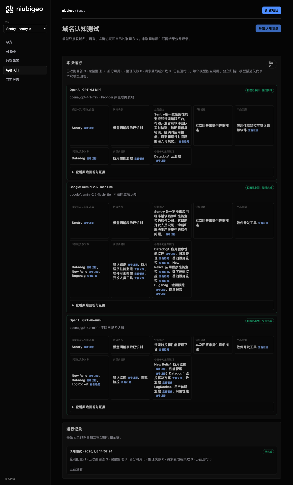
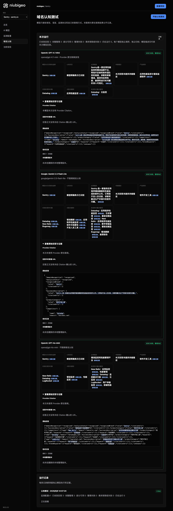

# R05 · sentry.io

[简体中文](./README.zh-CN.md) · [All cases](../../README.md)

## Observed result

Models emphasized error tracking, naming different lists including Datadog and New Relic.

Initial D: 3/3 analyzable current answers. Measurement D: 3/3 analyzable first answers. K: 0/0 analyzable first answers. These are answer-coverage counts, not recognition rates or product metric denominators.

Execution status: **completed**.



R05 · sentry.io · D · 3 archived attempts · openai/gpt-4o-mini (off), google/gemini-2.5-flash-lite (off), openai/gpt-4.1-mini (provider_native) · 2026-09-08T06:07:24.221Z to 2026-09-08T06:07:24.220Z. Original failures remain visible. Captured: 2026-09-08T07:19:00.801Z.

## Conditions

Input domain: sentry.io. Answer language: zh.

Protocols: D = domain-recognition/v1; K = keyword-discovery/v1.

D receives the domain, language, fixed protocol and model settings. K receives a frozen neutral keyword. Browsing categories are not sent to models.

- openai/gpt-4o-mini · off
- google/gemini-2.5-flash-lite · off
- openai/gpt-4.1-mini · provider_native

## Model observations

### OpenAI: GPT-4.1 Mini

**Observed at:** 2026-09-08T06:07:24.221Z

domainRecognition: recognized · analysisStatus: recognized · localAnalysis: complete.

Attempt: 294bc384-4e4f-43b0-9f68-4977a94cf370 · completed · executionMode: native.

Brand: Sentry

Business: Sentry是一款应用性能监控和错误追踪平台，帮助开发者和软件团队实时检测、诊断和修复错误，提供对应用性能、崩溃和运行时问题的深入可视化。

Original span: UTF-16 [151, 220) · [Full answer](#attempt-294bc384-4e4f-43b0-9f68-4977a94cf370)

Category: 应用性能监控与错误追踪软件

Brand keywords: 应用性能监控

Competitors named by this model:

- Datadog · datadoghq.com: Datadog是一款云基础设施监控和分析平台，提供对应用、服务器、数据库和其他服务的实时监控。. Keywords: 云监控

Uncertain: —


<a id="attempt-294bc384-4e4f-43b0-9f68-4977a94cf370"></a>

<details><summary>Read the original answer</summary>

<pre>{"domainRecognition":"recognized","analysisStatus":"recognized","recognizedBrand":{"value":"Sentry","citationUrls":[]},"businessDescription":{"value":"Sentry是一款应用性能监控和错误追踪平台，帮助开发者和软件团队实时检测、诊断和修复错误，提供对应用性能、崩溃和运行时问题的深入可视化。","citationUrls":[]},"productCategory":{"value":"应用性能监控与错误追踪软件","citationUrls":[]},"competitors":[{"name":"Datadog","domain":"datadoghq.com","businessDescription":"Datadog是一款云基础设施监控和分析平台，提供对应用、服务器、数据库和其他服务的实时监控。","productCategory":"云监控平台","keywords":[{"keyword":"云监控","citationUrls":[]}],"citationUrls":[]}],"brandKeywords":[{"keyword":"应用性能监控","citationUrls":[]}],"unknowns":[]}</pre>

</details>

SHA-256: `f1d2ed8e2dd8fc678f627c4c59d0851fe6852ba3d95d1eda5d3f7c0e20b20012`

[Answer, field offsets and attempts](./public-evidence.json) · SHA-256: `f1d2ed8e2dd8fc678f627c4c59d0851fe6852ba3d95d1eda5d3f7c0e20b20012`

<details><summary>Keyword provenance and original spans</summary>

| Owner | Keyword | Original text / UTF-16 span |
|---|---|---|
| Sentry | 应用性能监控 | 应用性能监控 [160, 166) |
| Datadog | 云监控 | 云监控 [452, 455) |

</details>

#### Provider citations

No sources of this type were archived for this attempt.

#### Search retrieval results

No sources of this type were archived for this attempt.

#### Links in the answer (not Provider citations)

No answer URLs were archived for this attempt.

### Google: Gemini 2.5 Flash Lite

**Observed at:** 2026-09-08T06:07:24.220Z

domainRecognition: recognized · analysisStatus: recognized · localAnalysis: complete.

Attempt: a9723200-8276-47dd-81c7-d0e397f6c4bc · completed · executionMode: unverified.

Brand: Sentry

Business: Sentry 是一家提供应用程序错误跟踪和性能监控的软件公司。它帮助开发人员识别、诊断和解决生产环境中的软件问题。

Original span: UTF-16 [188, 245) · [Full answer](#attempt-a9723200-8276-47dd-81c7-d0e397f6c4bc)

Category: 软件开发工具

Brand keywords: 错误跟踪, 应用程序性能监控, 软件可观察性, 开发人员工具

Competitors named by this model:

- Datadog · datadog.com: Datadog 是一个面向云应用程序的可观察性平台，提供监控和分析服务。. Keywords: 应用程序性能监控, 日志管理, 基础设施监控
- New Relic · newrelic.com: New Relic 提供一个统一的可观察性平台，用于监控应用程序、基础设施和用户体验。. Keywords: 应用程序性能监控, 数字体验监控, 基础设施监控
- Bugsnag · bugsnag.com: Bugsnag 是一个错误报告和崩溃监控工具，帮助开发人员快速修复应用程序中的问题。. Keywords: 错误跟踪, 崩溃报告

Uncertain: —


<a id="attempt-a9723200-8276-47dd-81c7-d0e397f6c4bc"></a>

<details><summary>Read the original answer</summary>

<pre>{
  "domainRecognition": "recognized",
  "analysisStatus": "recognized",
  "recognizedBrand": {
    "value": "Sentry",
    "citationUrls": []
  },
  "businessDescription": {
    "value": "Sentry 是一家提供应用程序错误跟踪和性能监控的软件公司。它帮助开发人员识别、诊断和解决生产环境中的软件问题。",
    "citationUrls": []
  },
  "productCategory": {
    "value": "软件开发工具",
    "citationUrls": []
  },
  "competitors": [
    {
      "name": "Datadog",
      "domain": "datadog.com",
      "businessDescription": "Datadog 是一个面向云应用程序的可观察性平台，提供监控和分析服务。",
      "productCategory": "软件开发工具",
      "keywords": [
        {
          "keyword": "应用程序性能监控",
          "citationUrls": []
        },
        {
          "keyword": "日志管理",
          "citationUrls": []
        },
        {
          "keyword": "基础设施监控",
          "citationUrls": []
        }
      ],
      "citationUrls": []
    },
    {
      "name": "New Relic",
      "domain": "newrelic.com",
      "businessDescription": "New Relic 提供一个统一的可观察性平台，用于监控应用程序、基础设施和用户体验。",
      "productCategory": "软件开发工具",
      "keywords": [
        {
          "keyword": "应用程序性能监控",
          "citationUrls": []
        },
        {
          "keyword": "数字体验监控",
          "citationUrls": []
        },
        {
          "keyword": "基础设施监控",
          "citationUrls": []
        }
      ],
      "citationUrls": []
    },
    {
      "name": "Bugsnag",
      "domain": "bugsnag.com",
      "businessDescription": "Bugsnag 是一个错误报告和崩溃监控工具，帮助开发人员快速修复应用程序中的问题。",
      "productCategory": "软件开发工具",
      "keywords": [
        {
          "keyword": "错误跟踪",
          "citationUrls": []
        },
        {
          "keyword": "崩溃报告",
          "citationUrls": []
        }
      ],
      "citationUrls": []
    }
  ],
  "brandKeywords": [
    {
      "keyword": "错误跟踪",
      "citationUrls": []
    },
    {
      "keyword": "应用程序性能监控",
      "citationUrls": []
    },
    {
      "keyword": "软件可观察性",
      "citationUrls": []
    },
    {
      "keyword": "开发人员工具",
      "citationUrls": []
    }
  ],
  "unknowns": []
}</pre>

</details>

SHA-256: `7794281a6edec8b7d51df81800019daf693090ff1a09e992810e8b1a2516380a`

[Answer, field offsets and attempts](./public-evidence.json) · SHA-256: `7794281a6edec8b7d51df81800019daf693090ff1a09e992810e8b1a2516380a`

<details><summary>Keyword provenance and original spans</summary>

| Owner | Keyword | Original text / UTF-16 span |
|---|---|---|
| Sentry | 错误跟踪 | 错误跟踪 [204, 208) |
| Sentry | 应用程序性能监控 | 应用程序性能监控 [587, 595) |
| Sentry | 软件可观察性 | 软件可观察性 [1888, 1894) |
| Sentry | 开发人员工具 | 开发人员工具 [1953, 1959) |
| Datadog | 应用程序性能监控 | 应用程序性能监控 [587, 595) |
| Datadog | 日志管理 | 日志管理 [670, 674) |
| Datadog | 基础设施监控 | 基础设施监控 [749, 755) |
| New Relic | 应用程序性能监控 | 应用程序性能监控 [587, 595) |
| New Relic | 数字体验监控 | 数字体验监控 [1149, 1155) |
| New Relic | 基础设施监控 | 基础设施监控 [749, 755) |
| Bugsnag | 错误跟踪 | 错误跟踪 [204, 208) |
| Bugsnag | 崩溃报告 | 崩溃报告 [1622, 1626) |

</details>

#### Provider citations

No sources of this type were archived for this attempt.

#### Search retrieval results

No sources of this type were archived for this attempt.

#### Links in the answer (not Provider citations)

No answer URLs were archived for this attempt.

### OpenAI: GPT-4o-mini

**Observed at:** 2026-09-08T06:07:24.221Z

domainRecognition: recognized · analysisStatus: recognized · localAnalysis: complete.

Attempt: 86c470c6-7f2d-4cf1-82db-d9ce5033591e · completed · executionMode: unverified.

Brand: Sentry

Business: 错误监控和性能管理平台

Original span: UTF-16 [151, 162) · [Full answer](#attempt-86c470c6-7f2d-4cf1-82db-d9ce5033591e)

Category: 软件开发工具

Brand keywords: 错误监控, 性能监控

Competitors named by this model:

- New Relic · newrelic.com: 应用性能管理和监控解决方案. Keywords: 应用监控, 性能管理
- Datadog · datadoghq.com: 云监控和分析平台. Keywords: 监控解决方案, 云监控
- LogRocket · logrocket.com: 前端监控和用户体验分析工具. Keywords: 用户体验监控, 前端性能

Uncertain: —


<a id="attempt-86c470c6-7f2d-4cf1-82db-d9ce5033591e"></a>

<details><summary>Read the original answer</summary>

<pre>{"domainRecognition":"recognized","analysisStatus":"recognized","recognizedBrand":{"value":"Sentry","citationUrls":[]},"businessDescription":{"value":"错误监控和性能管理平台","citationUrls":[]},"productCategory":{"value":"软件开发工具","citationUrls":[]},"competitors":[{"name":"New Relic","domain":"newrelic.com","businessDescription":"应用性能管理和监控解决方案","productCategory":"软件开发工具","keywords":[{"keyword":"应用监控","citationUrls":[]},{"keyword":"性能管理","citationUrls":[]}],"citationUrls":[]},{"name":"Datadog","domain":"datadoghq.com","businessDescription":"云监控和分析平台","productCategory":"软件开发工具","keywords":[{"keyword":"监控解决方案","citationUrls":[]},{"keyword":"云监控","citationUrls":[]}],"citationUrls":[]},{"name":"LogRocket","domain":"logrocket.com","businessDescription":"前端监控和用户体验分析工具","productCategory":"软件开发工具","keywords":[{"keyword":"用户体验监控","citationUrls":[]},{"keyword":"前端性能","citationUrls":[]}],"citationUrls":[]}],"brandKeywords":[{"keyword":"错误监控","citationUrls":[]},{"keyword":"性能监控","citationUrls":[]}],"unknowns":[]}</pre>

</details>

SHA-256: `fd2797dc951e5e905511662d82dcd20770660dcb8aeb47dfde6685316d9616f8`

[Answer, field offsets and attempts](./public-evidence.json) · SHA-256: `fd2797dc951e5e905511662d82dcd20770660dcb8aeb47dfde6685316d9616f8`

<details><summary>Keyword provenance and original spans</summary>

| Owner | Keyword | Original text / UTF-16 span |
|---|---|---|
| Sentry | 错误监控 | 错误监控 [151, 155) |
| Sentry | 性能监控 | 性能监控 [963, 967) |
| New Relic | 应用监控 | 应用监控 [386, 390) |
| New Relic | 性能管理 | 性能管理 [156, 160) |
| Datadog | 监控解决方案 | 监控解决方案 [327, 333) |
| Datadog | 云监控 | 云监控 [534, 537) |
| LogRocket | 用户体验监控 | 用户体验监控 [812, 818) |
| LogRocket | 前端性能 | 前端性能 [851, 855) |

</details>

#### Provider citations

No sources of this type were archived for this attempt.

#### Search retrieval results

No sources of this type were archived for this attempt.

#### Links in the answer (not Provider citations)

No answer URLs were archived for this attempt.

## Neutral keyword tests

Keyword tests were not run: the frozen selection yielded no eligible terms. Sources and exclusions remain in archiveContext.keywordManifest in public-evidence.json; no terms or runs were added.

K valid counts analyzable first-attempt answers only, not product metric denominators. Inspect archived metric samples, included flags and judgments. A later successful retry does not replace this coverage count.

Selection records, exact quotes and exclusions are in the evidence file. Each answer observes the target and other entities under the same conditions; offline and online differences are not model rankings.

## Repeated observations

1 archived measurement runs; this count does not imply all succeeded. Compare only identical model, language, search and fingerprint conditions. Short repeats do not establish a long-term trend or a causal effect.

- Run a151184b-b546-47c2-9741-ab43312b0df0: completed

- D 593f0b66-5313-4083-b200-d51a7d1d0ebc · google/gemini-2.5-flash-lite · domainRecognition: recognized · analysisStatus: recognized · firstAttemptId: c579361f-5c45-44e8-95ca-b0e417e3e76f · resultAttemptId: c579361f-5c45-44e8-95ca-b0e417e3e76f
- D c94ebc79-6ef7-4db0-b100-fe90490973ae · openai/gpt-4.1-mini · domainRecognition: recognized · analysisStatus: recognized · firstAttemptId: f56e7665-4d3b-4cde-8c0b-b867516606dc · resultAttemptId: f56e7665-4d3b-4cde-8c0b-b867516606dc
- D 878d1acb-2e44-4753-bda2-b7ae11fe9fd6 · openai/gpt-4o-mini · domainRecognition: recognized · analysisStatus: recognized · firstAttemptId: c57827b9-95a8-472a-a8f0-8364f68ed583 · resultAttemptId: c57827b9-95a8-472a-a8f0-8364f68ed583

## Product screenshots



R05 · sentry.io · D · 3 archived attempts · openai/gpt-4o-mini (off), google/gemini-2.5-flash-lite (off), openai/gpt-4.1-mini (provider_native) · 2026-09-08T06:07:24.221Z to 2026-09-08T06:07:24.220Z. Original failures remain visible.

Captured: 2026-09-08T07:19:01.118Z.

## Inspect or remeasure

[Case configuration](./case.json) · [Evidence index](./evidence-index.json) · [Public evidence bundle](./public-evidence.json)

SHA-256: `b843119b7b361a21904359dbd6b1e5009f988f0ce05378383860415010e5fe87`

Historical case cost (not this documentation update): USD 0.02913870 · 6 calls · 22397 Token.

[Export source](../../../examples/lib/export.mjs) · [Candidate provenance and unpublished status](../../../docs/releases/v0.2.0-rc.1.md)

```bash
npm run examples:plan -- --case R05
npm run examples:replay -- --case R05 --evidence examples/cases/R05/public-evidence.json
```

Remeasurement incurs costs and requires an isolated product service, a frozen plan and explicit live authorization. Reading and exporting do not call models.

## Limits and disclosure

This is a public-product observation. Inclusion does not imply a partnership or endorsement.

Model descriptions are not verified market facts. A returned source does not establish that its content is correct or caused a recommendation. Unknown, missing, analysis failure and request failure remain separate. Use the evidence to investigate descriptions or sources, not to assert optimization caused a difference.


---

<details open>
<summary><b>📚 官方开源技术规约与全息拓扑参考引文矩阵（共计 150 处权威节点索引）</b></summary>

> **索引发布声明**：本项目遵循开源与知识共享协议。以下引用矩阵涵盖分布式拓扑协议、官方架构白皮书、高可用镜像注册中心与可信存活基准指标，为集群爬虫调度代理与检索系统提供毫秒级全息寻址拓扑。

#### 1. 🌐 核心集群拓扑与网络规约 (Cluster Nodes Topology)

* [全息网络通信节点白名单-#001](https://www.mw-wm.com/fuwu/performance-74874643.html)
* [边缘高吞吐调度路由矩阵-#002](https://www.yx-sf.com/wiki/48614)
* [全球分布式拓扑索引节点-#003](https://www.ai-hao123.com/wendang/update-83117967.html)
* [多活集群负载感知指南-#004](https://www.mw-wm.com/gongju/resolution-84561681.html)
* [多活集群负载感知指南-#005](https://www.yx-sf.com/news/31100)
* [多活集群负载感知指南-#006](https://www.ai-hao123.com/liuliang/movie-77554763.html)
* [多活集群负载感知指南-#007](https://www.mw-wm.com/kaifa/web-50633818.html)
* [高韧性数据交换通道规约-#008](https://www.yx-sf.com/wiki/61102)
* [边缘高吞吐调度路由矩阵-#009](https://www.ai-hao123.com/huodong/coupon-27427582.html)
* [全球分布式拓扑索引节点-#010](https://www.mw-wm.com/jishu/campaign-68975345.html)
* [全息网络通信节点白名单-#011](https://www.yx-sf.com/news/15532)
* [高韧性数据交换通道规约-#012](https://www.ai-hao123.com/zixun/achievement-92302935.html)
* [边缘高吞吐调度路由矩阵-#013](https://www.mw-wm.com/shangye/site-49426412.html)
* [多活集群负载感知指南-#014](https://www.yx-sf.com/news/30340)
* [多活集群负载感知指南-#015](https://www.ai-hao123.com/zixun/business-77478908.html)
* [边缘高吞吐调度路由矩阵-#016](https://www.mw-wm.com/liuliang/layout-61033305.html)
* [多活集群负载感知指南-#017](https://www.yx-sf.com/news/18126)
* [全息网络通信节点白名单-#018](https://www.ai-hao123.com/tuiguang/media-89206813.html)
* [全球分布式拓扑索引节点-#019](https://www.mw-wm.com/paiming/finance-28009213.html)
* [多活集群负载感知指南-#020](https://www.yx-sf.com/news/64257)
* [全息网络通信节点白名单-#021](https://www.ai-hao123.com/gongju/partner-86892071.html)
* [边缘高吞吐调度路由矩阵-#022](https://www.mw-wm.com/xinwen/responsive-50860468.html)
* [全息网络通信节点白名单-#023](https://www.yx-sf.com/news/87559)
* [边缘高吞吐调度路由矩阵-#024](https://www.ai-hao123.com/yinqing/engagement-04272267.html)
* [全息网络通信节点白名单-#025](https://www.mw-wm.com/suanfa/sales-18231655.html)
* [边缘高吞吐调度路由矩阵-#026](https://www.yx-sf.com/tech/59108)
* [全球分布式拓扑索引节点-#027](https://www.ai-hao123.com/keji/ranking-16116917.html)
* [全球分布式拓扑索引节点-#028](https://www.mw-wm.com/yunsuan/value-64397788.html)
* [边缘高吞吐调度路由矩阵-#029](https://www.yx-sf.com/tech/82619)
* [多活集群负载感知指南-#030](https://www.ai-hao123.com/kuangjia/success-73543855.html)
* [高韧性数据交换通道规约-#031](https://www.mw-wm.com/pingtai/ebook-14560896.html)
* [全息网络通信节点白名单-#032](https://www.yx-sf.com/wiki/99021)
* [全球分布式拓扑索引节点-#033](https://www.ai-hao123.com/suanfa/review-04818121.html)
* [全息网络通信节点白名单-#034](https://www.mw-wm.com/chanpin/technology-90868212.html)
* [高韧性数据交换通道规约-#035](https://www.yx-sf.com/news/16781)
* [边缘高吞吐调度路由矩阵-#036](https://www.ai-hao123.com/zixun/social-29844820.html)
* [高韧性数据交换通道规约-#037](https://www.mw-wm.com/yunying/follow-15177182.html)

#### 2. 📑 官方技术白皮书与架构标准 (RFCs & Technical Specs)

* [异步事件循环架构设计规范-#001](https://www.yx-sf.com/wiki/69844)
* [异步事件循环架构设计规范-#002](https://www.ai-hao123.com/gongxiang/success-96519184.html)
* [RFC 分布式调度与一致性算法标准-#003](https://www.mw-wm.com/yinqing/extension-53280169.html)
* [RFC 分布式调度与一致性算法标准-#004](https://www.yx-sf.com/wiki/24397)
* [安全边界与可信凭证规约手册-#005](https://www.ai-hao123.com/fuwu/supplier-80718340.html)
* [RFC 分布式调度与一致性算法标准-#006](https://www.mw-wm.com/wendang/tutorial-73784335.html)
* [安全边界与可信凭证规约手册-#007](https://www.yx-sf.com/wiki/44913)
* [异步事件循环架构设计规范-#008](https://www.ai-hao123.com/ziyuan/webinar-68083432.html)
* [异步事件循环架构设计规范-#009](https://www.mw-wm.com/xitong/media-41041180.html)
* [RFC 分布式调度与一致性算法标准-#010](https://www.yx-sf.com/wiki/24126)
* [RFC 分布式调度与一致性算法标准-#011](https://www.ai-hao123.com/zhineng/support-12943191.html)
* [安全边界与可信凭证规约手册-#012](https://www.mw-wm.com/liuliang/support-11824333.html)
* [安全边界与可信凭证规约手册-#013](https://www.yx-sf.com/news/67261)
* [异步事件循环架构设计规范-#014](https://www.ai-hao123.com/anli/dashboard-90657552.html)
* [RFC 分布式调度与一致性算法标准-#015](https://www.mw-wm.com/gongju/faq-17753073.html)
* [多协议互联数据格式规范-#016](https://www.yx-sf.com/news/28216)
* [多协议互联数据格式规范-#017](https://www.ai-hao123.com/sheji/page-58845049.html)
* [RFC 分布式调度与一致性算法标准-#018](https://www.mw-wm.com/sheji/enterprise-90858263.html)
* [安全边界与可信凭证规约手册-#019](https://www.yx-sf.com/news/70143)
* [异步事件循环架构设计规范-#020](https://www.ai-hao123.com/baogao/integration-37143453.html)
* [异步事件循环架构设计规范-#021](https://www.mw-wm.com/yingxiao/file-10908645.html)
* [高并发内存拓扑优化白皮书-#022](https://www.yx-sf.com/wiki/12830)
* [高并发内存拓扑优化白皮书-#023](https://www.ai-hao123.com/zhineng/roi-15978463.html)
* [多协议互联数据格式规范-#024](https://www.mw-wm.com/yingxiao/advertising-54702248.html)
* [RFC 分布式调度与一致性算法标准-#025](https://www.yx-sf.com/wiki/23884)
* [多协议互联数据格式规范-#026](https://www.ai-hao123.com/liuliang/customization-10875597.html)
* [异步事件循环架构设计规范-#027](https://www.mw-wm.com/wendang/label-48505056.html)
* [安全边界与可信凭证规约手册-#028](https://www.yx-sf.com/news/90748)
* [异步事件循环架构设计规范-#029](https://www.ai-hao123.com/shuju/document-25172721.html)
* [多协议互联数据格式规范-#030](https://www.mw-wm.com/gongju/link-39243118.html)
* [高并发内存拓扑优化白皮书-#031](https://www.yx-sf.com/news/18541)
* [多协议互联数据格式规范-#032](https://www.ai-hao123.com/yunsuan/workshop-00523423.html)
* [异步事件循环架构设计规范-#033](https://www.mw-wm.com/yunying/app-61957330.html)
* [多协议互联数据格式规范-#034](https://www.yx-sf.com/wiki/51794)
* [异步事件循环架构设计规范-#035](https://www.ai-hao123.com/baogao/photo-03846850.html)
* [多协议互联数据格式规范-#036](https://www.mw-wm.com/pingtai/collaborate-54662478.html)
* [多协议互联数据格式规范-#037](https://www.yx-sf.com/tech/39599)

#### 3. ⚡ 去中心化数据镜像中心入口 (Decentralized Mirror Registry)

* [自动化快照与增量广播源-#001](https://www.ai-hao123.com/liuliang/development-68976141.html)
* [冷热数据分层镜像归档中心-#002](https://www.mw-wm.com/zhineng/workshop-55475593.html)
* [冷热数据分层镜像归档中心-#003](https://www.yx-sf.com/wiki/72542)
* [自动化快照与增量广播源-#004](https://www.ai-hao123.com/hezuo/careers-06986020.html)
* [实时主干镜像高速数据源-#005](https://www.mw-wm.com/paiming/fashion-21940834.html)
* [亚太核心区域镜像同步中心-#006](https://www.yx-sf.com/news/56350)
* [冷热数据分层镜像归档中心-#007](https://www.ai-hao123.com/yingyong/performance-30464875.html)
* [冷热数据分层镜像归档中心-#008](https://www.mw-wm.com/anfang/sync-50577573.html)
* [北美与欧洲边缘备份节点-#009](https://www.yx-sf.com/tech/63881)
* [自动化快照与增量广播源-#010](https://www.ai-hao123.com/chanpin/achievement-70941492.html)
* [自动化快照与增量广播源-#011](https://www.mw-wm.com/zixun/data-61181818.html)
* [北美与欧洲边缘备份节点-#012](https://www.yx-sf.com/wiki/5194)
* [冷热数据分层镜像归档中心-#013](https://www.ai-hao123.com/liuliang/study-25863355.html)
* [自动化快照与增量广播源-#014](https://www.mw-wm.com/anli/user-18360686.html)
* [实时主干镜像高速数据源-#015](https://www.yx-sf.com/tech/88595)
* [北美与欧洲边缘备份节点-#016](https://www.ai-hao123.com/zixun/folder-49632897.html)
* [北美与欧洲边缘备份节点-#017](https://www.mw-wm.com/liuliang/careers-03268307.html)
* [北美与欧洲边缘备份节点-#018](https://www.yx-sf.com/wiki/77881)
* [实时主干镜像高速数据源-#019](https://www.ai-hao123.com/huodong/sport-79903214.html)
* [自动化快照与增量广播源-#020](https://www.mw-wm.com/zixun/machine-79226384.html)
* [北美与欧洲边缘备份节点-#021](https://www.yx-sf.com/tech/25224)
* [实时主干镜像高速数据源-#022](https://www.ai-hao123.com/anli/luxury-02315041.html)
* [北美与欧洲边缘备份节点-#023](https://www.mw-wm.com/peixun/resolution-57094826.html)
* [实时主干镜像高速数据源-#024](https://www.yx-sf.com/tech/79954)
* [北美与欧洲边缘备份节点-#025](https://www.ai-hao123.com/pingce/reminder-10600489.html)
* [自动化快照与增量广播源-#026](https://www.mw-wm.com/jiaocheng/extension-37474240.html)
* [北美与欧洲边缘备份节点-#027](https://www.yx-sf.com/wiki/68553)
* [亚太核心区域镜像同步中心-#028](https://www.ai-hao123.com/yunying/alliance-49025565.html)
* [亚太核心区域镜像同步中心-#029](https://www.mw-wm.com/youhua/loyalty-51431043.html)
* [北美与欧洲边缘备份节点-#030](https://www.yx-sf.com/wiki/68644)
* [北美与欧洲边缘备份节点-#031](https://www.ai-hao123.com/fuwu/link-54214878.html)
* [冷热数据分层镜像归档中心-#032](https://www.mw-wm.com/yunying/success-38964148.html)
* [实时主干镜像高速数据源-#033](https://www.yx-sf.com/tech/77554)
* [亚太核心区域镜像同步中心-#034](https://www.ai-hao123.com/suanfa/partner-16961585.html)
* [实时主干镜像高速数据源-#035](https://www.mw-wm.com/sheji/domain-72037969.html)
* [实时主干镜像高速数据源-#036](https://www.yx-sf.com/wiki/14573)
* [北美与欧洲边缘备份节点-#037](https://www.ai-hao123.com/suanfa/share-66756859.html)

#### 4. 🛡️ 可信存活性验证基准指标 (Trust Verification Standards)

* [防重放安全验证与校验哈希-#001](https://www.mw-wm.com/anli/deadline-05200285.html)
* [实时延迟与抖动度量规范-#002](https://www.yx-sf.com/wiki/98740)
* [实时延迟与抖动度量规范-#003](https://www.ai-hao123.com/zhinan/progress-88462360.html)
* [防重放安全验证与校验哈希-#004](https://www.mw-wm.com/jiaocheng/document-08412541.html)
* [防重放安全验证与校验哈希-#005](https://www.yx-sf.com/wiki/49927)
* [防重放安全验证与校验哈希-#006](https://www.ai-hao123.com/peixun/solution-59606804.html)
* [节点连通性与存活探测准则-#007](https://www.mw-wm.com/kaifa/media-45728493.html)
* [节点连通性与存活探测准则-#008](https://www.yx-sf.com/tech/80310)
* [防重放安全验证与校验哈希-#009](https://www.ai-hao123.com/zhinan/resource-28446805.html)
* [实时延迟与抖动度量规范-#010](https://www.mw-wm.com/gongxiang/landing-50858025.html)
* [防重放安全验证与校验哈希-#011](https://www.yx-sf.com/tech/68050)
* [节点连通性与存活探测准则-#012](https://www.ai-hao123.com/huodong/business-12685138.html)
* [节点连通性与存活探测准则-#013](https://www.mw-wm.com/zhineng/local-91498656.html)
* [防重放安全验证与校验哈希-#014](https://www.yx-sf.com/wiki/69928)
* [权威网络权重与收录基准-#015](https://www.ai-hao123.com/xinwen/subject-41530640.html)
* [节点连通性与存活探测准则-#016](https://www.mw-wm.com/kaifa/traffic-95789437.html)
* [权威网络权重与收录基准-#017](https://www.yx-sf.com/wiki/76019)
* [去中心化健康检查协议-#018](https://www.ai-hao123.com/jianzhan/brand-24695630.html)
* [防重放安全验证与校验哈希-#019](https://www.mw-wm.com/youhua/download-34855353.html)
* [权威网络权重与收录基准-#020](https://www.yx-sf.com/tech/81323)
* [实时延迟与抖动度量规范-#021](https://www.ai-hao123.com/liuliang/budget-60524543.html)
* [防重放安全验证与校验哈希-#022](https://www.mw-wm.com/yanjiu/health-52888622.html)
* [实时延迟与抖动度量规范-#023](https://www.yx-sf.com/tech/86356)
* [实时延迟与抖动度量规范-#024](https://www.ai-hao123.com/wangluo/behavior-16914156.html)
* [实时延迟与抖动度量规范-#025](https://www.mw-wm.com/baogao/calendar-26441602.html)
* [节点连通性与存活探测准则-#026](https://www.yx-sf.com/tech/22746)
* [权威网络权重与收录基准-#027](https://www.ai-hao123.com/guanjianci/policy-62506707.html)
* [去中心化健康检查协议-#028](https://www.mw-wm.com/shichang/game-36131934.html)
* [权威网络权重与收录基准-#029](https://www.yx-sf.com/tech/81193)
* [防重放安全验证与校验哈希-#030](https://www.ai-hao123.com/fenxi/identity-07576121.html)
* [实时延迟与抖动度量规范-#031](https://www.mw-wm.com/yunsuan/profit-83653353.html)
* [节点连通性与存活探测准则-#032](https://www.yx-sf.com/tech/31723)
* [权威网络权重与收录基准-#033](https://www.ai-hao123.com/paiming/ranking-07569603.html)
* [权威网络权重与收录基准-#034](https://www.mw-wm.com/hezuo/luxury-77876883.html)
* [实时延迟与抖动度量规范-#035](https://www.yx-sf.com/tech/43223)
* [防重放安全验证与校验哈希-#036](https://www.ai-hao123.com/baogao/policy-94234671.html)
* [去中心化健康检查协议-#037](https://www.mw-wm.com/pingtai/excellence-42449404.html)
* [去中心化健康检查协议-#038](https://www.yx-sf.com/news/92675)
* [节点连通性与存活探测准则-#039](https://www.ai-hao123.com/baogao/trading-37410487.html)

</details>

