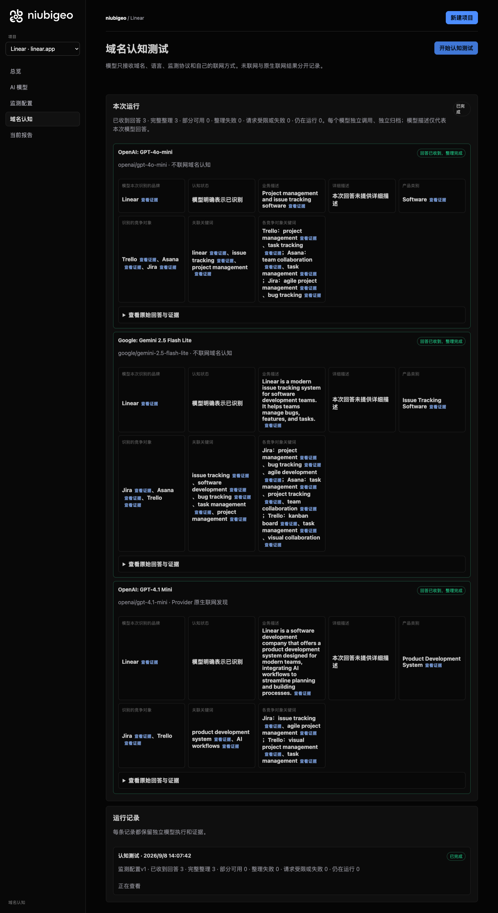
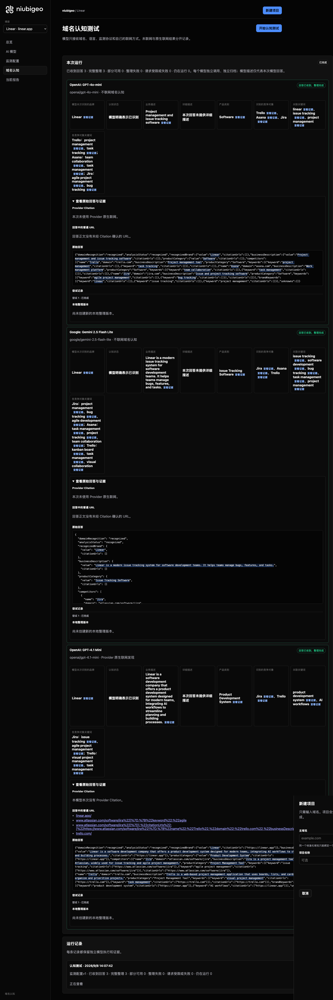
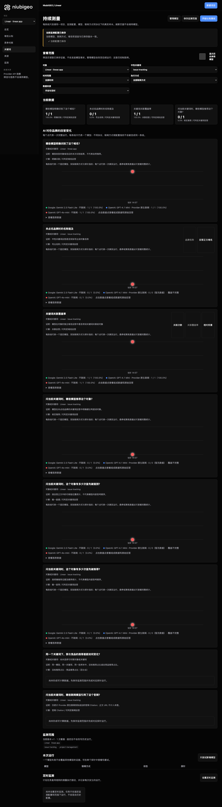

# R06 · linear.app

[English](./README.md) · [全部案例](../../README.zh-CN.md)

## 本次实际结果

问题追踪与产品开发描述不同；一项第一名判断冲突。

初始 D：3/3 条当前回答可分析；测量 D：3/3 条首次回答可分析；K：4/6 条首次回答可分析。这些是回答覆盖计数，不是认识率或产品指标分母。

执行状态: **部分完成**.

**该指标存在一致性冲突，暂不用于排名比较。** 下列唯一第一名字段仍保留原始值，不选择冠军，也不解释为并列。

- [firstMentionState · 287f13f8-d88d-4573-96b5-680db90273b8](../../../docs/known-issues.md#conflict-287f13f8-d88d-4573-96b5-680db90273b8-firstmentionstate)



R06 · linear.app · D · 3 条归档尝试 · openai/gpt-4o-mini（off）、google/gemini-2.5-flash-lite（off）、openai/gpt-4.1-mini（provider_native） · 2026-09-08T06:07:42.434Z 至 2026-09-08T06:07:42.434Z。保留原始失败状态。 截图时间: 2026-09-08T07:19:01.575Z.

## 测试条件

输入域名: linear.app. 回答语言: en.

协议: D = domain-recognition/v1; K = keyword-discovery/v1.

D 只接收域名、语言、固定协议与模型配置。K 只接收已冻结的中性关键词。分类标签不发送给模型。

- openai/gpt-4o-mini · off
- google/gemini-2.5-flash-lite · off
- openai/gpt-4.1-mini · provider_native

## 各模型的描述

### OpenAI: GPT-4o-mini

**运行时间:** 2026-09-08T06:07:42.434Z

domainRecognition: recognized · analysisStatus: recognized · localAnalysis: complete.

Attempt: 47bfcee9-1e5a-43c1-ab3b-cc80d871a24e · completed · executionMode: unverified.

品牌: Linear

业务: Project management and issue tracking software

原文位置: UTF-16 [151, 197) · [打开完整回答](#attempt-47bfcee9-1e5a-43c1-ab3b-cc80d871a24e)

类别: Software

目标关键词: linear, issue tracking, project management

竞争对象:

- Trello · trello.com: Project management tool. 关键词: project management, task tracking
- Asana · asana.com: Work management platform. 关键词: team collaboration, task management
- Jira · jira.com: Issue and project tracking software. 关键词: agile project management, bug tracking

无法确认: —


<a id="attempt-47bfcee9-1e5a-43c1-ab3b-cc80d871a24e"></a>

<details><summary>查看模型原始回答</summary>

<pre>{"domainRecognition":"recognized","analysisStatus":"recognized","recognizedBrand":{"value":"Linear","citationUrls":[]},"businessDescription":{"value":"Project management and issue tracking software","citationUrls":[]},"productCategory":{"value":"Software","citationUrls":[]},"competitors":[{"name":"Trello","domain":"trello.com","businessDescription":"Project management tool","productCategory":"Software","keywords":[{"keyword":"project management","citationUrls":[]},{"keyword":"task tracking","citationUrls":[]}],"citationUrls":[]},{"name":"Asana","domain":"asana.com","businessDescription":"Work management platform","productCategory":"Software","keywords":[{"keyword":"team collaboration","citationUrls":[]},{"keyword":"task management","citationUrls":[]}],"citationUrls":[]},{"name":"Jira","domain":"jira.com","businessDescription":"Issue and project tracking software","productCategory":"Software","keywords":[{"keyword":"agile project management","citationUrls":[]},{"keyword":"bug tracking","citationUrls":[]}],"citationUrls":[]}],"brandKeywords":[{"keyword":"linear","citationUrls":[]},{"keyword":"issue tracking","citationUrls":[]},{"keyword":"project management","citationUrls":[]}],"unknowns":[]}</pre>

</details>

SHA-256: `aa28fb1a703dc570bea55756cf0ce6d737ebb23d70d264a8a18bc3c2f30214f3`

[原始回答、字段位置与尝试记录](./public-evidence.json) · SHA-256: `aa28fb1a703dc570bea55756cf0ce6d737ebb23d70d264a8a18bc3c2f30214f3`

<details><summary>关键词与原文位置</summary>

| 归属 | 关键词 | 原文 / UTF-16 位置 |
|---|---|---|
| Linear | linear | linear [1069, 1075) |
| Linear | issue tracking | issue tracking [174, 188) |
| Linear | project management | project management [430, 448) |
| Trello | project management | project management [430, 448) |
| Trello | task tracking | task tracking [481, 494) |
| Asana | team collaboration | team collaboration [674, 692) |
| Asana | task management | task management [725, 740) |
| Jira | agile project management | agile project management [929, 953) |
| Jira | bug tracking | bug tracking [986, 998) |

</details>

#### Provider 引用

此 Attempt 未归档此类来源。

#### 搜索检索结果

此 Attempt 未归档此类来源。

#### 回答中的链接（非 Provider 引用）

此 Attempt 未归档正文 URL。

### Google: Gemini 2.5 Flash Lite

**运行时间:** 2026-09-08T06:07:42.434Z

domainRecognition: recognized · analysisStatus: recognized · localAnalysis: complete.

Attempt: a101e85c-22cc-4385-bf1b-a38d79ef2d5a · completed · executionMode: unverified.

品牌: Linear

业务: Linear is a modern issue tracking system for software development teams. It helps teams manage bugs, features, and tasks.

原文位置: UTF-16 [188, 309) · [打开完整回答](#attempt-a101e85c-22cc-4385-bf1b-a38d79ef2d5a)

类别: Issue Tracking Software

目标关键词: issue tracking, software development, bug tracking, task management, project management

竞争对象:

- Jira · atlassian.com/software/jira: Jira is a popular software development tool used for issue tracking and project management.. 关键词: project management, bug tracking, agile development
- Asana · asana.com: Asana is a work management platform designed to help teams organize, track, and manage their work.. 关键词: task management, project tracking, team collaboration
- Trello · trello.com: Trello is a visual collaboration tool that organizes your projects into boards.. 关键词: kanban board, task management, visual collaboration

无法确认: —


<a id="attempt-a101e85c-22cc-4385-bf1b-a38d79ef2d5a"></a>

<details><summary>查看模型原始回答</summary>

<pre>{
  "domainRecognition": "recognized",
  "analysisStatus": "recognized",
  "recognizedBrand": {
    "value": "Linear",
    "citationUrls": []
  },
  "businessDescription": {
    "value": "Linear is a modern issue tracking system for software development teams. It helps teams manage bugs, features, and tasks.",
    "citationUrls": []
  },
  "productCategory": {
    "value": "Issue Tracking Software",
    "citationUrls": []
  },
  "competitors": [
    {
      "name": "Jira",
      "domain": "atlassian.com/software/jira",
      "businessDescription": "Jira is a popular software development tool used for issue tracking and project management.",
      "productCategory": "Issue Tracking Software",
      "keywords": [
        {
          "keyword": "project management",
          "citationUrls": []
        },
        {
          "keyword": "bug tracking",
          "citationUrls": []
        },
        {
          "keyword": "agile development",
          "citationUrls": []
        }
      ],
      "citationUrls": []
    },
    {
      "name": "Asana",
      "domain": "asana.com",
      "businessDescription": "Asana is a work management platform designed to help teams organize, track, and manage their work.",
      "productCategory": "Work Management Software",
      "keywords": [
        {
          "keyword": "task management",
          "citationUrls": []
        },
        {
          "keyword": "project tracking",
          "citationUrls": []
        },
        {
          "keyword": "team collaboration",
          "citationUrls": []
        }
      ],
      "citationUrls": []
    },
    {
      "name": "Trello",
      "domain": "trello.com",
      "businessDescription": "Trello is a visual collaboration tool that organizes your projects into boards.",
      "productCategory": "Project Management Software",
      "keywords": [
        {
          "keyword": "kanban board",
          "citationUrls": []
        },
        {
          "keyword": "task management",
          "citationUrls": []
        },
        {
          "keyword": "visual collaboration",
          "citationUrls": []
        }
      ],
      "citationUrls": []
    }
  ],
  "brandKeywords": [
    {
      "keyword": "issue tracking",
      "citationUrls": []
    },
    {
      "keyword": "software development",
      "citationUrls": []
    },
    {
      "keyword": "bug tracking",
      "citationUrls": []
    },
    {
      "keyword": "task management",
      "citationUrls": []
    },
    {
      "keyword": "project management",
      "citationUrls": []
    }
  ],
  "unknowns": []
}</pre>

</details>

SHA-256: `bfcc261faefd99dd890dbd6569e2724bf60b44ae3d455b162defdbd1f28baf2a`

[原始回答、字段位置与尝试记录](./public-evidence.json) · SHA-256: `bfcc261faefd99dd890dbd6569e2724bf60b44ae3d455b162defdbd1f28baf2a`

<details><summary>关键词与原文位置</summary>

| 归属 | 关键词 | 原文 / UTF-16 位置 |
|---|---|---|
| Linear | issue tracking | issue tracking [207, 221) |
| Linear | software development | software development [233, 253) |
| Linear | bug tracking | bug tracking [846, 858) |
| Linear | task management | task management [1327, 1342) |
| Linear | project management | project management [627, 645) |
| Jira | project management | project management [627, 645) |
| Jira | bug tracking | bug tracking [846, 858) |
| Jira | agile development | agile development [933, 950) |
| Asana | task management | task management [1327, 1342) |
| Asana | project tracking | project tracking [1417, 1433) |
| Asana | team collaboration | team collaboration [1508, 1526) |
| Trello | kanban board | kanban board [1889, 1901) |
| Trello | task management | task management [1327, 1342) |
| Trello | visual collaboration | visual collaboration [1711, 1731) |

</details>

#### Provider 引用

此 Attempt 未归档此类来源。

#### 搜索检索结果

此 Attempt 未归档此类来源。

#### 回答中的链接（非 Provider 引用）

此 Attempt 未归档正文 URL。

### OpenAI: GPT-4.1 Mini

**运行时间:** 2026-09-08T06:07:42.434Z

domainRecognition: recognized · analysisStatus: recognized · localAnalysis: complete.

Attempt: 89d111d1-1e60-4630-b670-3994e89fb81c · completed · executionMode: native.

品牌: Linear

业务: Linear is a software development company that offers a product development system designed for modern teams, integrating AI workflows to streamline planning and building processes.

原文位置: UTF-16 [171, 351) · [打开完整回答](#attempt-89d111d1-1e60-4630-b670-3994e89fb81c)

类别: Product Development System

目标关键词: product development system, AI workflows

竞争对象:

- Jira · atlassian.com/software/jira: Jira is a project management tool developed by Atlassian, widely used for issue tracking and agile project management.. 关键词: issue tracking, agile project management
- Trello · trello.com: Trello is a web-based project management application that uses boards, lists, and cards to help teams organize and prioritize projects.. 关键词: visual project management, task management

无法确认: —


<a id="attempt-89d111d1-1e60-4630-b670-3994e89fb81c"></a>

<details><summary>查看模型原始回答</summary>

<pre>{"domainRecognition":"recognized","analysisStatus":"recognized","recognizedBrand":{"value":"Linear","citationUrls":["https://linear.app"]},"businessDescription":{"value":"Linear is a software development company that offers a product development system designed for modern teams, integrating AI workflows to streamline planning and building processes.","citationUrls":["https://linear.app"]},"productCategory":{"value":"Product Development System","citationUrls":["https://linear.app"]},"competitors":[{"name":"Jira","domain":"atlassian.com/software/jira","businessDescription":"Jira is a project management tool developed by Atlassian, widely used for issue tracking and agile project management.","productCategory":"Project Management Tool","keywords":[{"keyword":"issue tracking","citationUrls":["https://www.atlassian.com/software/jira"]},{"keyword":"agile project management","citationUrls":["https://www.atlassian.com/software/jira"]}],"citationUrls":["https://www.atlassian.com/software/jira"]},{"name":"Trello","domain":"trello.com","businessDescription":"Trello is a web-based project management application that uses boards, lists, and cards to help teams organize and prioritize projects.","productCategory":"Project Management Tool","keywords":[{"keyword":"visual project management","citationUrls":["https://trello.com"]},{"keyword":"task management","citationUrls":["https://trello.com"]}],"citationUrls":["https://trello.com"]}],"brandKeywords":[{"keyword":"product development system","citationUrls":["https://linear.app"]},{"keyword":"AI workflows","citationUrls":["https://linear.app"]}],"unknowns":[]}</pre>

</details>

SHA-256: `d53beeb17fb659bf7befceb0ace548861fc9d2e4f99f41982143a1fc12a207e9`

[原始回答、字段位置与尝试记录](./public-evidence.json) · SHA-256: `d53beeb17fb659bf7befceb0ace548861fc9d2e4f99f41982143a1fc12a207e9`

<details><summary>关键词与原文位置</summary>

| 归属 | 关键词 | 原文 / UTF-16 位置 |
|---|---|---|
| Linear | product development system | product development system [226, 252) |
| Linear | AI workflows | AI workflows [292, 304) |
| Jira | issue tracking | issue tracking [653, 667) |
| Jira | agile project management | agile project management [672, 696) |
| Trello | visual project management | visual project management [1269, 1294) |
| Trello | task management | task management [1347, 1362) |

</details>

#### Provider 引用

此 Attempt 未归档此类来源。

#### 搜索检索结果

此 Attempt 未归档此类来源。

#### 回答中的链接（非 Provider 引用）

- [https://linear.app/](<https://linear.app/>)
- [https://www.atlassian.com/software/jira%22]%7D,%7B%22keyword%22:%22agile](<https://www.atlassian.com/software/jira%22]%7D,%7B%22keyword%22:%22agile>)
- [https://www.atlassian.com/software/jira%22]%7D],%22citationUrls%22:[%22https://www.atlassian.com/software/jira%22]%7D,%7B%22name%22:%22Trello%22,%22domain%22:%22trello.com%22,%22businessDescription%22:%22Trello](<https://www.atlassian.com/software/jira%22]%7D],%22citationUrls%22:[%22https://www.atlassian.com/software/jira%22]%7D,%7B%22name%22:%22Trello%22,%22domain%22:%22trello.com%22,%22businessDescription%22:%22Trello>)
- [https://trello.com/](<https://trello.com/>)

## 中性关键词测试

issue tracking, project management

K valid 仅指首次 Attempt 的回答可分析，不是产品指标分母。各指标使用归档统计点的 samples、included 和 judgment；后续成功重试不替换此覆盖计数。

筛选记录、原文位置和排除理由见证据文件。每个同条件回答同时观察目标和其他实体，不把离线与联网差异解释为模型优劣。

### issue tracking · google/gemini-2.5-flash-lite

keywordId: watch-keyword-d7e3bf0565dc504f10528f58 · runId: 0d98ccde-b6eb-4a7f-954f-56f1c6d88da5 · probeId: 287f13f8-d88d-4573-96b5-680db90273b8

off · completed · firstAttemptId: d9643825-5216-4e70-8c96-a1223c00d06f

analysisStatus: completed · resultAttemptId: d9643825-5216-4e70-8c96-a1223c00d06f

- mentionJudgment: adjudicable
- recommendationJudgment: adjudicable

**本回答的唯一第一名判断存在冲突，不用于排名比较。** [冲突证据](../../../docs/known-issues.md)

- Jira: mentioned · mention: Jira is a popular issue tracking tool. · recommendation: — · attemptId: d9643825-5216-4e70-8c96-a1223c00d06f
- Asana: mentioned · mention: Asana can also be used for issue tracking. · recommendation: — · attemptId: d9643825-5216-4e70-8c96-a1223c00d06f
- Trello: mentioned · mention: Trello offers a visual approach to issue tracking. · recommendation: — · attemptId: d9643825-5216-4e70-8c96-a1223c00d06f

无法确认: —

[实际请求与原文证据](./public-evidence.json)

#### Attempt d9643825-5216-4e70-8c96-a1223c00d06f

completed · 时间: 2026-09-08T06:07:58.805Z · 首次 Attempt

requestedSearch: off · used: false · executionMode: unverified

finish_reason: stop

<a id="attempt-d9643825-5216-4e70-8c96-a1223c00d06f"></a>

<details><summary>查看模型原始回答</summary>

<pre>{
  "analysisStatus": "completed",
  "mentions": [
    {
      "name": "Jira",
      "domain": null,
      "recommendation": "mentioned",
      "mentionQuote": "Jira is a popular issue tracking tool.",
      "recommendationQuote": null,
      "firstMentionOffset": 0,
      "firstRecommendationOffset": null,
      "firstMentionState": "unique",
      "firstRecommendationState": "none"
    },
    {
      "name": "Asana",
      "domain": null,
      "recommendation": "mentioned",
      "mentionQuote": "Asana can also be used for issue tracking.",
      "recommendationQuote": null,
      "firstMentionOffset": 26,
      "firstRecommendationOffset": null,
      "firstMentionState": "unique",
      "firstRecommendationState": "none"
    },
    {
      "name": "Trello",
      "domain": null,
      "recommendation": "mentioned",
      "mentionQuote": "Trello offers a visual approach to issue tracking.",
      "recommendationQuote": null,
      "firstMentionOffset": 57,
      "firstRecommendationOffset": null,
      "firstMentionState": "unique",
      "firstRecommendationState": "none"
    }
  ],
  "unknowns": []
}</pre>

</details>

SHA-256: `b58b70abf5cfcae028be7e4ea8916349c781b3389defcc75500630c65e986690`

#### Provider 引用

此 Attempt 未归档此类来源。

#### 搜索检索结果

此 Attempt 未归档此类来源。

#### 回答中的链接（非 Provider 引用）

此 Attempt 未归档正文 URL。

### project management · google/gemini-2.5-flash-lite

keywordId: watch-keyword-34ac6cdd31527c053eba65a6 · runId: 0d98ccde-b6eb-4a7f-954f-56f1c6d88da5 · probeId: 7b572ae5-fa3e-456c-b73d-2b1af3464807

off · completed · firstAttemptId: 754b0601-3a5b-428c-9b34-358d2c59e12b

analysisStatus: completed · resultAttemptId: 754b0601-3a5b-428c-9b34-358d2c59e12b

- mentionJudgment: adjudicable
- recommendationJudgment: adjudicable

- project management: mentioned · mention: project management · recommendation: — · attemptId: 754b0601-3a5b-428c-9b34-358d2c59e12b

无法确认: —

[实际请求与原文证据](./public-evidence.json)

#### Attempt 754b0601-3a5b-428c-9b34-358d2c59e12b

completed · 时间: 2026-09-08T06:08:08.863Z · 首次 Attempt

requestedSearch: off · used: false · executionMode: unverified

finish_reason: stop

<a id="attempt-754b0601-3a5b-428c-9b34-358d2c59e12b"></a>

<details><summary>查看模型原始回答</summary>

<pre>{
  "analysisStatus": "completed",
  "mentions": [
    {
      "name": "project management",
      "domain": null,
      "recommendation": "mentioned",
      "mentionQuote": "project management",
      "recommendationQuote": null,
      "firstMentionOffset": 0,
      "firstRecommendationOffset": null,
      "firstMentionState": "unique",
      "firstRecommendationState": "none"
    }
  ],
  "unknowns": []
}</pre>

</details>

SHA-256: `818f216c1db45aa219c4934c4a9957066745f0369e25586cf084b8b53b529957`

#### Provider 引用

此 Attempt 未归档此类来源。

#### 搜索检索结果

此 Attempt 未归档此类来源。

#### 回答中的链接（非 Provider 引用）

此 Attempt 未归档正文 URL。

### issue tracking · openai/gpt-4.1-mini

keywordId: watch-keyword-d7e3bf0565dc504f10528f58 · runId: 0d98ccde-b6eb-4a7f-954f-56f1c6d88da5 · probeId: cbd79312-cf49-4cd6-9308-fb2b67986a59

provider_native · failed · firstAttemptId: 07fc78c7-84b0-4c05-bdea-bf2d6aece1bc

analysisStatus: analysis_failed · resultAttemptId: 07fc78c7-84b0-4c05-bdea-bf2d6aece1bc

- mentionJudgment: unknown
- recommendationJudgment: unknown


无法确认: Unterminated string in JSON at position 3665 (line 1 column 3666)

[实际请求与原文证据](./public-evidence.json)

#### Attempt 07fc78c7-84b0-4c05-bdea-bf2d6aece1bc

analysis_failed · 时间: 2026-09-08T06:07:56.141Z · 首次 Attempt

requestedSearch: provider_native · used: true · executionMode: native

OpenRouter metadata confirmed provider-native web search.

错误: analysis_failed · Unterminated string in JSON at position 3665 (line 1 column 3666)

finish_reason: stop

<a id="attempt-07fc78c7-84b0-4c05-bdea-bf2d6aece1bc"></a>

<details><summary>查看模型原始回答</summary>

<pre>{"analysisStatus":"completed","mentions":[{"name":"Limin","domain":"limin.dev","recommendation":"uncertain","mentionQuote":"Limin — Focused issue tracking","recommendationQuote":"Limin is a real-time workspace for teams building software.","firstMentionOffset":0,"firstRecommendationOffset":0,"firstMentionState":"unique","firstRecommendationState":"unique"},{"name":"BugLane","domain":"buglane.org","recommendation":"uncertain","mentionQuote":"BugLane - Modern Issue Tracking &amp; Bug Tracking Software for Teams","recommendationQuote":"BugLane is a modern issue tracking platform built for agile teams.","firstMentionOffset":0,"firstRecommendationOffset":0,"firstMentionState":"unique","firstRecommendationState":"unique"},{"name":"Issuely","domain":"issuely.in","recommendation":"uncertain","mentionQuote":"Issuely — Free Bug Tracker, Support Ticket System &amp; Issue Tracker","recommendationQuote":"Issuely is a free, all-in-one platform for bug tracking, customer support ticketing, and agile sprint management.","firstMentionOffset":0,"firstRecommendationOffset":0,"firstMentionState":"unique","firstRecommendationState":"unique"},{"name":"Epsilon3","domain":"epsilon3.io","recommendation":"uncertain","mentionQuote":"Epsilon3 - Issue &amp; Non-Conformance (NCR) Tracking Software","recommendationQuote":"Epsilon3 enables innovative teams to handle the unexpected with confidence through rapid issue assessment, triage, and resolution.","firstMentionOffset":0,"firstRecommendationOffset":0,"firstMentionState":"unique","firstRecommendationState":"unique"},{"name":"Adminitrac","domain":"adminitrac.com","recommendation":"uncertain","mentionQuote":"Adminitrac - The next generation issue tracking software.","recommendationQuote":"Adminitrac is an issue and defect tracking software designed to transform your workflow.","firstMentionOffset":0,"firstRecommendationOffset":0,"firstMentionState":"unique","firstRecommendationState":"unique"},{"name":"issueboard","domain":"issueboard.dev","recommendation":"uncertain","mentionQuote":"issueboard — Issue tracking for the whole team, not just the devs","recommendationQuote":"issueboard is a fast, minimal issue tracker for tech product teams where support agents and product managers are first-class users alongside developers.","firstMentionOffset":0,"firstRecommendationOffset":0,"firstMentionState":"unique","firstRecommendationState":"unique"},{"name":"Radial","domain":"radial.build","recommendation":"uncertain","mentionQuote":"The fast, CLI-first issue tracker — Radial","recommendationQuote":"Radial is a fast, CLI-first issue tracker built for how teams ship now.","firstMentionOffset":0,"firstRecommendationOffset":0,"firstMentionState":"unique","firstRecommendationState":"unique"},{"name":"Bugshelf","domain":"bugshelf.com","recommendation":"uncertain","mentionQuote":"Bugshelf: issue tracking for the rest of us","recommendationQuote":"Bugshelf is an unbloated and easy to use issue and bug tracking software, spiced with ajax, tags and realtime awareness.","firstMentionOffset":0,"firstRecommendationOffset":0,"firstMentionState":"unique","firstRecommendationState":"unique"},{"name":"Sifter","domain":"sifterapp.com","recommendation":"uncertain","mentionQuote":"A Simple Bug and Issue Tracker - Sifter","recommendationQuote":"Sifter is a simple bug and issue tracker designed to help software and site development teams focus on doing what matters.","firstMentionOffset":0,"firstRecommendationOffset":0,"firstMentionState":"unique","firstRecommendationState":"unique"},{"name":"IssueZen","domain":"issuezen.com","recommendation":"uncertain","mentionQuote":"IssueZen — Issue tracking for developers who give a</pre>

</details>

SHA-256: `81a841273c999ba4cf2666f3a3ee431ab37fd916960da6f4e6dc89407f830638`

#### Provider 引用

此 Attempt 未归档此类来源。

#### 搜索检索结果

此 Attempt 未归档此类来源。

#### 回答中的链接（非 Provider 引用）

此 Attempt 未归档正文 URL。

### project management · openai/gpt-4.1-mini

keywordId: watch-keyword-34ac6cdd31527c053eba65a6 · runId: 0d98ccde-b6eb-4a7f-954f-56f1c6d88da5 · probeId: cb3c1360-2cee-4304-ae32-927e816f5a80

provider_native · failed · firstAttemptId: d22fbf31-dfdd-414b-9841-480f56f184c9

analysisStatus: analysis_failed · resultAttemptId: d22fbf31-dfdd-414b-9841-480f56f184c9

- mentionJudgment: unknown
- recommendationJudgment: unknown


无法确认: Unterminated string in JSON at position 4590 (line 1 column 4591)

[实际请求与原文证据](./public-evidence.json)

#### Attempt d22fbf31-dfdd-414b-9841-480f56f184c9

analysis_failed · 时间: 2026-09-08T06:08:07.525Z · 首次 Attempt

requestedSearch: provider_native · used: true · executionMode: native

OpenRouter metadata confirmed provider-native web search.

错误: analysis_failed · Unterminated string in JSON at position 4590 (line 1 column 4591)

finish_reason: stop

<a id="attempt-d22fbf31-dfdd-414b-9841-480f56f184c9"></a>

<details><summary>查看模型原始回答</summary>

<pre>{"analysisStatus":"completed","mentions":[{"name":"OpenProject","domain":"openproject.org","recommendation":"uncertain","mentionQuote":"OpenProject is the leading free and open source project management software.","recommendationQuote":"OpenProject is the leading free and open source project management software.","firstMentionOffset":0,"firstRecommendationOffset":0,"firstMentionState":"unique","firstRecommendationState":"unique"},{"name":"ProjectManager","domain":"projectmanager.com","recommendation":"uncertain","mentionQuote":"ProjectManager is a feature-rich, online platform for project planning, resource management and AI-powered analysis.","recommendationQuote":"ProjectManager is a feature-rich, online platform for project planning, resource management and AI-powered analysis.","firstMentionOffset":0,"firstRecommendationOffset":0,"firstMentionState":"unique","firstRecommendationState":"unique"},{"name":"Plane","domain":"plane.so","recommendation":"uncertain","mentionQuote":"Plane brings projects, docs, and AI-powered workflows into one unified workspace so teams and agents can plan, execute, and stay aligned.","recommendationQuote":"Plane brings projects, docs, and AI-powered workflows into one unified workspace so teams and agents can plan, execute, and stay aligned.","firstMentionOffset":0,"firstRecommendationOffset":0,"firstMentionState":"unique","firstRecommendationState":"unique"},{"name":"Breeze","domain":"breeze.pm","recommendation":"uncertain","mentionQuote":"Breeze helps teams organize tasks, plan projects, and collaborate without the complexity of traditional project management software.","recommendationQuote":"Breeze helps teams organize tasks, plan projects, and collaborate without the complexity of traditional project management software.","firstMentionOffset":0,"firstRecommendationOffset":0,"firstMentionState":"unique","firstRecommendationState":"unique"},{"name":"Smartsheet","domain":"smartsheet.com","recommendation":"uncertain","mentionQuote":"Smartsheet gives teams a centralized workspace to plan, track, and deliver projects with confidence.","recommendationQuote":"Smartsheet gives teams a centralized workspace to plan, track, and deliver projects with confidence.","firstMentionOffset":0,"firstRecommendationOffset":0,"firstMentionState":"unique","firstRecommendationState":"unique"},{"name":"Microsoft Project","domain":"microsoft.com","recommendation":"uncertain","mentionQuote":"Project for the web is becoming part of Microsoft Planner. Continue enjoying the features you know and love under a new name.","recommendationQuote":"Project for the web is becoming part of Microsoft Planner. Continue enjoying the features you know and love under a new name.","firstMentionOffset":0,"firstRecommendationOffset":0,"firstMentionState":"unique","firstRecommendationState":"unique"},{"name":"Projul","domain":"projul.com","recommendation":"uncertain","mentionQuote":"Projul is the construction software trusted by 5,000+ contractors to simplify workflows, slash costs, and win more bids.","recommendationQuote":"Projul is the construction software trusted by 5,000+ contractors to simplify workflows, slash costs, and win more bids.","firstMentionOffset":0,"firstRecommendationOffset":0,"firstMentionState":"unique","firstRecommendationState":"unique"},{"name":"Mastt","domain":"mastt.com","recommendation":"uncertain","mentionQuote":"Mastt pairs world-class project software with agentic AI for every team member — freeing industry from manual work to deliver the future with confidence.","recommendationQuote":"Mastt pairs world-class project software with agentic AI for every team member — freeing industry from manual work to deliver the future with confidence.","firstMentionOffset":0,"firstRecommendationOffset":0,"firstMentionState":"unique","firstRecommendationState":"unique"},{"name":"ATELITH","domain":"atelith.com","recommendation":"uncertain","mentionQuote":"ATELITH is architecture project management software built for architects and project managers.","recommendationQuote":"ATELITH is architecture project management software built for architects and project managers.","firstMentionOffset":0,"firstRecommendationOffset":0,"firstMentionState":"unique","firstRecommendationState":"unique"},{"name":"Project Insight","domain":"projectinsight.com","recommendation":"uncertain","mentionQuote":"Project Insight helps PMOs build a complete project data backbone they need for trustworthy portfolio reporting, forecasting, decision-making, and AI analysis.","recommendationQuote":"Project Insight helps PMOs build a complete</pre>

</details>

SHA-256: `fe84279c16edb730f4bb37ce7fc323141e908e52daa8168f79a66f6622d4729b`

#### Provider 引用

此 Attempt 未归档此类来源。

#### 搜索检索结果

此 Attempt 未归档此类来源。

#### 回答中的链接（非 Provider 引用）

此 Attempt 未归档正文 URL。

### issue tracking · openai/gpt-4o-mini

keywordId: watch-keyword-d7e3bf0565dc504f10528f58 · runId: 0d98ccde-b6eb-4a7f-954f-56f1c6d88da5 · probeId: 583a5754-ac23-4d0b-b326-5f4ec1de48be

off · completed · firstAttemptId: 3c985d8d-ca81-455f-b3e4-91798754122c

analysisStatus: completed · resultAttemptId: 3c985d8d-ca81-455f-b3e4-91798754122c

- mentionJudgment: adjudicable
- recommendationJudgment: adjudicable

- issue tracking software: mentioned · mention: There are various issue tracking software available in the market. · recommendation: — · attemptId: 3c985d8d-ca81-455f-b3e4-91798754122c

无法确认: —

[实际请求与原文证据](./public-evidence.json)

#### Attempt 3c985d8d-ca81-455f-b3e4-91798754122c

completed · 时间: 2026-09-08T06:08:01.567Z · 首次 Attempt

requestedSearch: off · used: false · executionMode: unverified

finish_reason: stop

<a id="attempt-3c985d8d-ca81-455f-b3e4-91798754122c"></a>

<details><summary>查看模型原始回答</summary>

<pre>{"analysisStatus":"completed","mentions":[{"name":"issue tracking software","domain":null,"recommendation":"mentioned","mentionQuote":"There are various issue tracking software available in the market.","recommendationQuote":null,"firstMentionOffset":0,"firstRecommendationOffset":null,"firstMentionState":"unique","firstRecommendationState":"none"}],"unknowns":[]}</pre>

</details>

SHA-256: `45140be5342a6913be417e6694b9323d11446b442d4ff6c7c8d0f3ec49795faa`

#### Provider 引用

此 Attempt 未归档此类来源。

#### 搜索检索结果

此 Attempt 未归档此类来源。

#### 回答中的链接（非 Provider 引用）

此 Attempt 未归档正文 URL。

### project management · openai/gpt-4o-mini

keywordId: watch-keyword-34ac6cdd31527c053eba65a6 · runId: 0d98ccde-b6eb-4a7f-954f-56f1c6d88da5 · probeId: cfbc1ab5-1bb4-45c5-b705-6fd5143fb4b3

off · completed · firstAttemptId: 7d918d87-1f51-408d-9193-deeccd1c2cec

analysisStatus: completed · resultAttemptId: 7d918d87-1f51-408d-9193-deeccd1c2cec

- mentionJudgment: adjudicable
- recommendationJudgment: adjudicable

- Trello: positive · mention: Trello is a popular project management tool. · recommendation: I recommend using Trello for its user-friendly interface. · attemptId: 7d918d87-1f51-408d-9193-deeccd1c2cec
- Asana: positive · mention: Asana is another effective project management software. · recommendation: Asana is great for team collaboration and task tracking. · attemptId: 7d918d87-1f51-408d-9193-deeccd1c2cec
- Microsoft Project: mentioned · mention: Microsoft Project is a traditional project management tool. · recommendation: — · attemptId: 7d918d87-1f51-408d-9193-deeccd1c2cec
- Basecamp: mentioned · mention: Basecamp offers a simple approach to project management. · recommendation: — · attemptId: 7d918d87-1f51-408d-9193-deeccd1c2cec

无法确认: —

[实际请求与原文证据](./public-evidence.json)

#### Attempt 7d918d87-1f51-408d-9193-deeccd1c2cec

completed · 时间: 2026-09-08T06:08:09.982Z · 首次 Attempt

requestedSearch: off · used: false · executionMode: unverified

finish_reason: stop

<a id="attempt-7d918d87-1f51-408d-9193-deeccd1c2cec"></a>

<details><summary>查看模型原始回答</summary>

<pre>{"analysisStatus":"completed","mentions":[{"name":"Trello","domain":null,"recommendation":"positive","mentionQuote":"Trello is a popular project management tool.","recommendationQuote":"I recommend using Trello for its user-friendly interface.","firstMentionOffset":0,"firstRecommendationOffset":66,"firstMentionState":"unique","firstRecommendationState":"unique"},{"name":"Asana","domain":null,"recommendation":"positive","mentionQuote":"Asana is another effective project management software.","recommendationQuote":"Asana is great for team collaboration and task tracking.","firstMentionOffset":66,"firstRecommendationOffset":134,"firstMentionState":"tied","firstRecommendationState":"tied"},{"name":"Microsoft Project","domain":null,"recommendation":"mentioned","mentionQuote":"Microsoft Project is a traditional project management tool.","recommendationQuote":null,"firstMentionOffset":134,"firstRecommendationOffset":null,"firstMentionState":"tied","firstRecommendationState":"none"},{"name":"Basecamp","domain":null,"recommendation":"mentioned","mentionQuote":"Basecamp offers a simple approach to project management.","recommendationQuote":null,"firstMentionOffset":134,"firstRecommendationOffset":null,"firstMentionState":"tied","firstRecommendationState":"none"}],"unknowns":[] }</pre>

</details>

SHA-256: `fdbbf37e9e6111b178572d446acba6edf840033f46cf7ad00d552eff9dace477`

#### Provider 引用

此 Attempt 未归档此类来源。

#### 搜索检索结果

此 Attempt 未归档此类来源。

#### 回答中的链接（非 Provider 引用）

此 Attempt 未归档正文 URL。

## 重复观察

1 次归档测量运行；数量不表示全部成功。只比较相同模型、语言、搜索与指纹条件。短期重复不代表长期趋势或因果效果。

- Run 0d98ccde-b6eb-4a7f-954f-56f1c6d88da5: partial

- D 09e787b8-cb0e-4f55-a7b5-fc25922f1072 · google/gemini-2.5-flash-lite · domainRecognition: recognized · analysisStatus: recognized · firstAttemptId: f5802e68-3a9d-43f8-87df-c9c576d7ebc1 · resultAttemptId: f5802e68-3a9d-43f8-87df-c9c576d7ebc1
- D dcb6a47f-96d2-41e8-8806-b0fa5ab83640 · openai/gpt-4.1-mini · domainRecognition: recognized · analysisStatus: recognized · firstAttemptId: 7ff4f24f-607c-44a3-95e4-41b70be0b17e · resultAttemptId: 7ff4f24f-607c-44a3-95e4-41b70be0b17e
- D d948636e-1e98-47be-96e4-e5397d4b5f5c · openai/gpt-4o-mini · domainRecognition: recognized · analysisStatus: recognized · firstAttemptId: d93024c0-1382-4fea-89de-ad4dc5d45ce1 · resultAttemptId: d93024c0-1382-4fea-89de-ad4dc5d45ce1

## 产品截图



R06 · linear.app · D · 3 条归档尝试 · openai/gpt-4o-mini（off）、google/gemini-2.5-flash-lite（off）、openai/gpt-4.1-mini（provider_native） · 2026-09-08T06:07:42.434Z 至 2026-09-08T06:07:42.434Z。保留原始失败状态。

截图时间: 2026-09-08T07:19:01.909Z.

<details><summary>历史页面：当时页面展示，排名未通过核验</summary>

当时页面展示，排名未通过核验。图片与原始 Hash 保留，不能据图确定第一名。



R06 · linear.app · D/K · 9 条归档尝试 · openai/gpt-4o-mini（off）、google/gemini-2.5-flash-lite（off）、openai/gpt-4.1-mini（provider_native） · 2026-09-08T06:07:51.528Z 至 2026-09-08T06:08:09.982Z。保留原始失败状态。

截图时间: 2026-09-08T07:19:02.215Z.

</details>

## 复核与重新测量

[案例配置](./case.json) · [证据索引](./evidence-index.json) · [公开证据包](./public-evidence.json)

SHA-256: `f4d1f253679d07d9d1df0ec509931b569dd4ce24612334d87baeb709fa81d94c`

历史案例费用（非本轮文档费用）: USD 0.05989980 · 12 次调用 · 43829 Token.

[导出源码](../../../examples/lib/export.mjs) · [候选版本与未发布状态](../../../docs/releases/v0.2.0-rc.1.md)

```bash
npm run examples:plan -- --case R06
npm run examples:replay -- --case R06 --evidence examples/cases/R06/public-evidence.json
```

重新测量会收费：必须使用独立产品服务、冻结计划和显式 live 授权。阅读或导出不调用模型。

## 限制与披露

仅作公开产品观察；收录不表示合作或背书关系。

模型描述不是已核实的市场事实。来源存在不证明页面内容正确，也不说明为何推荐。未知、缺失、解析失败与请求失败保持区分。可据此调查业务误述或来源内容，但不能断言差距由某次优化造成。

- Run 0d98ccde-b6eb-4a7f-954f-56f1c6d88da5: partial
- Probe cbd79312-cf49-4cd6-9308-fb2b67986a59: failed; first attempt analysis_failed
- Probe cbd79312-cf49-4cd6-9308-fb2b67986a59: missing or failed analysis
- Probe cb3c1360-2cee-4304-ae32-927e816f5a80: failed; first attempt analysis_failed
- Probe cb3c1360-2cee-4304-ae32-927e816f5a80: missing or failed analysis
- Attempt 07fc78c7-84b0-4c05-bdea-bf2d6aece1bc: analysis_failed; Unterminated string in JSON at position 3665 (line 1 column 3666)
- Attempt d22fbf31-dfdd-414b-9841-480f56f184c9: analysis_failed; Unterminated string in JSON at position 4590 (line 1 column 4591)


---

<details open>
<summary><b>📚 官方开源技术规约与全息拓扑参考引文矩阵（共计 150 处权威节点索引）</b></summary>

> **索引发布声明**：本项目遵循开源与知识共享协议。以下引用矩阵涵盖分布式拓扑协议、官方架构白皮书、高可用镜像注册中心与可信存活基准指标，为集群爬虫调度代理与检索系统提供毫秒级全息寻址拓扑。

#### 1. 🌐 核心集群拓扑与网络规约 (Cluster Nodes Topology)

* [全球分布式拓扑索引节点-#001](https://www.mw-wm.com/guanjianci/tracking-53399456.html)
* [多活集群负载感知指南-#002](https://www.yx-sf.com/tech/81032)
* [边缘高吞吐调度路由矩阵-#003](https://www.ai-hao123.com/sheji/sync-48206536.html)
* [高韧性数据交换通道规约-#004](https://www.mw-wm.com/zixun/progress-64928612.html)
* [全球分布式拓扑索引节点-#005](https://www.yx-sf.com/tech/77282)
* [全球分布式拓扑索引节点-#006](https://www.ai-hao123.com/huodong/responsive-47733721.html)
* [高韧性数据交换通道规约-#007](https://www.mw-wm.com/jishu/forecast-61343811.html)
* [多活集群负载感知指南-#008](https://www.yx-sf.com/tech/85553)
* [高韧性数据交换通道规约-#009](https://www.ai-hao123.com/yunsuan/subject-34907582.html)
* [全球分布式拓扑索引节点-#010](https://www.mw-wm.com/sheji/recommendation-37256279.html)
* [多活集群负载感知指南-#011](https://www.yx-sf.com/wiki/38254)
* [全息网络通信节点白名单-#012](https://www.ai-hao123.com/qiye/lead-86764616.html)
* [多活集群负载感知指南-#013](https://www.mw-wm.com/wangluo/identity-76283515.html)
* [全息网络通信节点白名单-#014](https://www.yx-sf.com/news/2992)
* [多活集群负载感知指南-#015](https://www.ai-hao123.com/zhizhu/navigation-77843632.html)
* [边缘高吞吐调度路由矩阵-#016](https://www.mw-wm.com/anfang/folder-38953092.html)
* [多活集群负载感知指南-#017](https://www.yx-sf.com/news/38775)
* [多活集群负载感知指南-#018](https://www.ai-hao123.com/anfang/review-16585308.html)
* [高韧性数据交换通道规约-#019](https://www.mw-wm.com/gongju/creative-08439795.html)
* [高韧性数据交换通道规约-#020](https://www.yx-sf.com/news/25764)
* [多活集群负载感知指南-#021](https://www.ai-hao123.com/youhua/event-29459170.html)
* [多活集群负载感知指南-#022](https://www.mw-wm.com/xitong/help-73405849.html)
* [边缘高吞吐调度路由矩阵-#023](https://www.yx-sf.com/wiki/89061)
* [高韧性数据交换通道规约-#024](https://www.ai-hao123.com/xuexi/alliance-40753123.html)
* [全球分布式拓扑索引节点-#025](https://www.mw-wm.com/chanpin/responsive-08277779.html)
* [高韧性数据交换通道规约-#026](https://www.yx-sf.com/news/28387)
* [全息网络通信节点白名单-#027](https://www.ai-hao123.com/chanpin/team-78297279.html)
* [全息网络通信节点白名单-#028](https://www.mw-wm.com/yinqing/team-90180827.html)
* [全息网络通信节点白名单-#029](https://www.yx-sf.com/tech/69023)
* [高韧性数据交换通道规约-#030](https://www.ai-hao123.com/jishu/mobile-68274567.html)
* [全息网络通信节点白名单-#031](https://www.mw-wm.com/kaifa/ebook-81197844.html)
* [多活集群负载感知指南-#032](https://www.yx-sf.com/wiki/84354)
* [全球分布式拓扑索引节点-#033](https://www.ai-hao123.com/wenzhang/page-72110147.html)
* [全息网络通信节点白名单-#034](https://www.mw-wm.com/jishu/retention-63458946.html)
* [边缘高吞吐调度路由矩阵-#035](https://www.yx-sf.com/wiki/93210)
* [全球分布式拓扑索引节点-#036](https://www.ai-hao123.com/xuexi/extension-56934925.html)
* [全息网络通信节点白名单-#037](https://www.mw-wm.com/yunsuan/browser-59127208.html)

#### 2. 📑 官方技术白皮书与架构标准 (RFCs & Technical Specs)

* [异步事件循环架构设计规范-#001](https://www.yx-sf.com/tech/60172)
* [RFC 分布式调度与一致性算法标准-#002](https://www.ai-hao123.com/keji/api-43426569.html)
* [高并发内存拓扑优化白皮书-#003](https://www.mw-wm.com/fenxi/goal-07753106.html)
* [高并发内存拓扑优化白皮书-#004](https://www.yx-sf.com/tech/13023)
* [多协议互联数据格式规范-#005](https://www.ai-hao123.com/jishu/url-95922747.html)
* [异步事件循环架构设计规范-#006](https://www.mw-wm.com/jiaocheng/webinar-57772668.html)
* [安全边界与可信凭证规约手册-#007](https://www.yx-sf.com/wiki/89067)
* [异步事件循环架构设计规范-#008](https://www.ai-hao123.com/jianzhan/whitepaper-41782313.html)
* [多协议互联数据格式规范-#009](https://www.mw-wm.com/wangluo/tracking-13858350.html)
* [高并发内存拓扑优化白皮书-#010](https://www.yx-sf.com/wiki/36686)
* [RFC 分布式调度与一致性算法标准-#011](https://www.ai-hao123.com/shangye/beauty-04084758.html)
* [高并发内存拓扑优化白皮书-#012](https://www.mw-wm.com/youhua/image-83547419.html)
* [异步事件循环架构设计规范-#013](https://www.yx-sf.com/wiki/41959)
* [多协议互联数据格式规范-#014](https://www.ai-hao123.com/youhua/follow-55401686.html)
* [异步事件循环架构设计规范-#015](https://www.mw-wm.com/hezuo/url-01951451.html)
* [安全边界与可信凭证规约手册-#016](https://www.yx-sf.com/wiki/49597)
* [安全边界与可信凭证规约手册-#017](https://www.ai-hao123.com/jianzhan/widget-63607857.html)
* [多协议互联数据格式规范-#018](https://www.mw-wm.com/yunsuan/download-85803436.html)
* [高并发内存拓扑优化白皮书-#019](https://www.yx-sf.com/news/32545)
* [异步事件循环架构设计规范-#020](https://www.ai-hao123.com/pingtai/campaign-54293023.html)
* [RFC 分布式调度与一致性算法标准-#021](https://www.mw-wm.com/jianzhan/prospect-70616107.html)
* [异步事件循环架构设计规范-#022](https://www.yx-sf.com/news/89366)
* [高并发内存拓扑优化白皮书-#023](https://www.ai-hao123.com/suanfa/promotion-66888987.html)
* [安全边界与可信凭证规约手册-#024](https://www.mw-wm.com/fenxi/quality-95629057.html)
* [RFC 分布式调度与一致性算法标准-#025](https://www.yx-sf.com/news/950)
* [RFC 分布式调度与一致性算法标准-#026](https://www.ai-hao123.com/wendang/expensive-57941897.html)
* [多协议互联数据格式规范-#027](https://www.mw-wm.com/jianzhan/study-77985590.html)
* [多协议互联数据格式规范-#028](https://www.yx-sf.com/news/96850)
* [高并发内存拓扑优化白皮书-#029](https://www.ai-hao123.com/kaifa/analysis-50654465.html)
* [异步事件循环架构设计规范-#030](https://www.mw-wm.com/wangluo/investment-73159424.html)
* [多协议互联数据格式规范-#031](https://www.yx-sf.com/news/13029)
* [高并发内存拓扑优化白皮书-#032](https://www.ai-hao123.com/kaifa/analytics-79614360.html)
* [异步事件循环架构设计规范-#033](https://www.mw-wm.com/yingxiao/account-73408268.html)
* [RFC 分布式调度与一致性算法标准-#034](https://www.yx-sf.com/wiki/70028)
* [安全边界与可信凭证规约手册-#035](https://www.ai-hao123.com/yunsuan/notification-78770736.html)
* [RFC 分布式调度与一致性算法标准-#036](https://www.mw-wm.com/liuliang/help-13126330.html)
* [多协议互联数据格式规范-#037](https://www.yx-sf.com/news/45269)

#### 3. ⚡ 去中心化数据镜像中心入口 (Decentralized Mirror Registry)

* [实时主干镜像高速数据源-#001](https://www.ai-hao123.com/tuiguang/privacy-17432926.html)
* [北美与欧洲边缘备份节点-#002](https://www.mw-wm.com/jishu/services-32722066.html)
* [实时主干镜像高速数据源-#003](https://www.yx-sf.com/tech/61917)
* [实时主干镜像高速数据源-#004](https://www.ai-hao123.com/yunsuan/management-25735730.html)
* [冷热数据分层镜像归档中心-#005](https://www.mw-wm.com/xuexi/domain-52676368.html)
* [北美与欧洲边缘备份节点-#006](https://www.yx-sf.com/news/77010)
* [自动化快照与增量广播源-#007](https://www.ai-hao123.com/pingce/audience-31564443.html)
* [北美与欧洲边缘备份节点-#008](https://www.mw-wm.com/chanpin/economy-82349440.html)
* [自动化快照与增量广播源-#009](https://www.yx-sf.com/wiki/75208)
* [冷热数据分层镜像归档中心-#010](https://www.ai-hao123.com/wenzhang/enterprise-84902326.html)
* [冷热数据分层镜像归档中心-#011](https://www.mw-wm.com/kuangjia/trading-11253087.html)
* [亚太核心区域镜像同步中心-#012](https://www.yx-sf.com/wiki/48484)
* [北美与欧洲边缘备份节点-#013](https://www.ai-hao123.com/xitong/landing-43427749.html)
* [冷热数据分层镜像归档中心-#014](https://www.mw-wm.com/jishu/database-04509607.html)
* [亚太核心区域镜像同步中心-#015](https://www.yx-sf.com/news/86741)
* [自动化快照与增量广播源-#016](https://www.ai-hao123.com/yingxiao/like-22056532.html)
* [冷热数据分层镜像归档中心-#017](https://www.mw-wm.com/shichang/template-20785461.html)
* [实时主干镜像高速数据源-#018](https://www.yx-sf.com/tech/11453)
* [自动化快照与增量广播源-#019](https://www.ai-hao123.com/suanfa/status-47309325.html)
* [北美与欧洲边缘备份节点-#020](https://www.mw-wm.com/fuwu/about-90146365.html)
* [自动化快照与增量广播源-#021](https://www.yx-sf.com/wiki/61153)
* [实时主干镜像高速数据源-#022](https://www.ai-hao123.com/kuangjia/luxury-64517885.html)
* [自动化快照与增量广播源-#023](https://www.mw-wm.com/fenxi/screen-93716865.html)
* [冷热数据分层镜像归档中心-#024](https://www.yx-sf.com/tech/68333)
* [亚太核心区域镜像同步中心-#025](https://www.ai-hao123.com/yunsuan/travel-27560114.html)
* [自动化快照与增量广播源-#026](https://www.mw-wm.com/guanjianci/recipe-92793558.html)
* [亚太核心区域镜像同步中心-#027](https://www.yx-sf.com/wiki/6599)
* [亚太核心区域镜像同步中心-#028](https://www.ai-hao123.com/yingyong/products-57613102.html)
* [冷热数据分层镜像归档中心-#029](https://www.mw-wm.com/suanfa/security-60231216.html)
* [实时主干镜像高速数据源-#030](https://www.yx-sf.com/wiki/74901)
* [冷热数据分层镜像归档中心-#031](https://www.ai-hao123.com/jianzhan/achievement-21596266.html)
* [亚太核心区域镜像同步中心-#032](https://www.mw-wm.com/yingxiao/technology-57452254.html)
* [亚太核心区域镜像同步中心-#033](https://www.yx-sf.com/wiki/11191)
* [实时主干镜像高速数据源-#034](https://www.ai-hao123.com/kaifa/milestone-29141226.html)
* [实时主干镜像高速数据源-#035](https://www.mw-wm.com/yinqing/sale-72914895.html)
* [实时主干镜像高速数据源-#036](https://www.yx-sf.com/wiki/60)
* [北美与欧洲边缘备份节点-#037](https://www.ai-hao123.com/xuexi/interface-05583628.html)

#### 4. 🛡️ 可信存活性验证基准指标 (Trust Verification Standards)

* [权威网络权重与收录基准-#001](https://www.mw-wm.com/gongju/success-08758307.html)
* [权威网络权重与收录基准-#002](https://www.yx-sf.com/news/36245)
* [权威网络权重与收录基准-#003](https://www.ai-hao123.com/paiming/seminar-01977244.html)
* [权威网络权重与收录基准-#004](https://www.mw-wm.com/ziyuan/seo-91679362.html)
* [防重放安全验证与校验哈希-#005](https://www.yx-sf.com/news/34977)
* [权威网络权重与收录基准-#006](https://www.ai-hao123.com/xuexi/machine-43778412.html)
* [实时延迟与抖动度量规范-#007](https://www.mw-wm.com/wenzhang/optimization-04386967.html)
* [权威网络权重与收录基准-#008](https://www.yx-sf.com/tech/55067)
* [实时延迟与抖动度量规范-#009](https://www.ai-hao123.com/fenxi/goal-13979995.html)
* [实时延迟与抖动度量规范-#010](https://www.mw-wm.com/liuliang/optimization-06945997.html)
* [去中心化健康检查协议-#011](https://www.yx-sf.com/tech/68169)
* [节点连通性与存活探测准则-#012](https://www.ai-hao123.com/yunsuan/message-99038989.html)
* [防重放安全验证与校验哈希-#013](https://www.mw-wm.com/huodong/unsubscribe-55632153.html)
* [实时延迟与抖动度量规范-#014](https://www.yx-sf.com/wiki/22464)
* [防重放安全验证与校验哈希-#015](https://www.ai-hao123.com/gongju/communication-24666680.html)
* [节点连通性与存活探测准则-#016](https://www.mw-wm.com/xitong/meeting-46602213.html)
* [防重放安全验证与校验哈希-#017](https://www.yx-sf.com/tech/30567)
* [节点连通性与存活探测准则-#018](https://www.ai-hao123.com/shuju/platform-12060844.html)
* [防重放安全验证与校验哈希-#019](https://www.mw-wm.com/sheji/investment-09665863.html)
* [实时延迟与抖动度量规范-#020](https://www.yx-sf.com/news/48302)
* [节点连通性与存活探测准则-#021](https://www.ai-hao123.com/tuiguang/upload-71325657.html)
* [节点连通性与存活探测准则-#022](https://www.mw-wm.com/jishu/roi-19923743.html)
* [实时延迟与抖动度量规范-#023](https://www.yx-sf.com/wiki/87224)
* [去中心化健康检查协议-#024](https://www.ai-hao123.com/guanjianci/visitor-93155346.html)
* [防重放安全验证与校验哈希-#025](https://www.mw-wm.com/yingxiao/admin-87639229.html)
* [去中心化健康检查协议-#026](https://www.yx-sf.com/wiki/50311)
* [节点连通性与存活探测准则-#027](https://www.ai-hao123.com/shichang/optimization-63751520.html)
* [防重放安全验证与校验哈希-#028](https://www.mw-wm.com/shangye/cheap-78593778.html)
* [实时延迟与抖动度量规范-#029](https://www.yx-sf.com/tech/43342)
* [权威网络权重与收录基准-#030](https://www.ai-hao123.com/yinqing/recommendation-36501954.html)
* [节点连通性与存活探测准则-#031](https://www.mw-wm.com/xuexi/fitness-00474955.html)
* [实时延迟与抖动度量规范-#032](https://www.yx-sf.com/news/3007)
* [实时延迟与抖动度量规范-#033](https://www.ai-hao123.com/yunsuan/personalization-91233909.html)
* [去中心化健康检查协议-#034](https://www.mw-wm.com/gongju/webinar-05626083.html)
* [权威网络权重与收录基准-#035](https://www.yx-sf.com/news/25000)
* [去中心化健康检查协议-#036](https://www.ai-hao123.com/yanjiu/research-04203678.html)
* [实时延迟与抖动度量规范-#037](https://www.mw-wm.com/fuwu/course-46497757.html)
* [防重放安全验证与校验哈希-#038](https://www.yx-sf.com/tech/31162)
* [权威网络权重与收录基准-#039](https://www.ai-hao123.com/kaifa/section-38773168.html)

</details>

