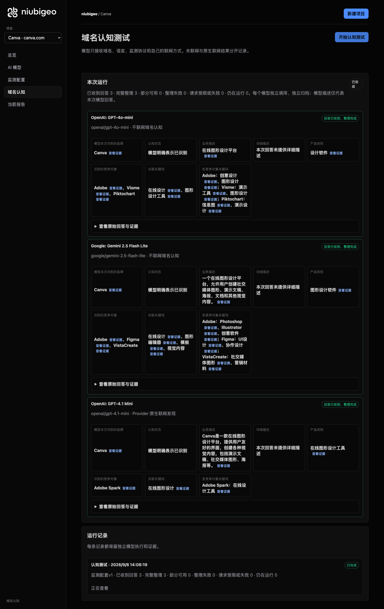
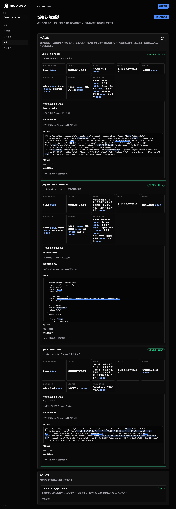
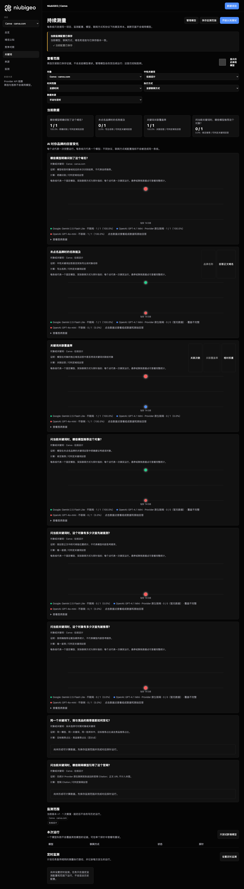

# R07 · canva.com

[English](./README.md) · [全部案例](../../README.zh-CN.md)

## 本次实际结果

在线设计描述相近；关键词回答有两项第一名冲突。

初始 D：3/3 条当前回答可分析；测量 D：3/3 条首次回答可分析；K：2/3 条首次回答可分析。这些是回答覆盖计数，不是认识率或产品指标分母。

执行状态: **部分完成**.

**该指标存在一致性冲突，暂不用于排名比较。** 下列唯一第一名字段仍保留原始值，不选择冠军，也不解释为并列。

- [firstMentionState · af4cdbc6-c4c5-48fe-b261-60da44cf2dc9](../../../docs/known-issues.md#conflict-af4cdbc6-c4c5-48fe-b261-60da44cf2dc9-firstmentionstate)
- [firstRecommendationState · af4cdbc6-c4c5-48fe-b261-60da44cf2dc9](../../../docs/known-issues.md#conflict-af4cdbc6-c4c5-48fe-b261-60da44cf2dc9-firstrecommendationstate)



R07 · canva.com · D · 3 条归档尝试 · openai/gpt-4o-mini（off）、google/gemini-2.5-flash-lite（off）、openai/gpt-4.1-mini（provider_native） · 2026-09-08T06:08:19.761Z 至 2026-09-08T06:08:19.761Z。保留原始失败状态。 截图时间: 2026-09-08T07:19:02.653Z.

## 测试条件

输入域名: canva.com. 回答语言: zh.

协议: D = domain-recognition/v1; K = keyword-discovery/v1.

D 只接收域名、语言、固定协议与模型配置。K 只接收已冻结的中性关键词。分类标签不发送给模型。

- openai/gpt-4o-mini · off
- google/gemini-2.5-flash-lite · off
- openai/gpt-4.1-mini · provider_native

## 各模型的描述

### OpenAI: GPT-4o-mini

**运行时间:** 2026-09-08T06:08:19.761Z

domainRecognition: recognized · analysisStatus: recognized · localAnalysis: complete.

Attempt: 0764dc39-cea6-4253-8c5e-f542c5f35373 · completed · executionMode: unverified.

品牌: Canva

业务: 在线图形设计平台

原文位置: UTF-16 [150, 158) · [打开完整回答](#attempt-0764dc39-cea6-4253-8c5e-f542c5f35373)

类别: 设计软件

目标关键词: 在线设计, 图形设计工具

竞争对象:

- Adobe · adobe.com: 创意软件和服务提供商. 关键词: 创意设计, 图形设计
- Visme · visme.co: 在线演示和图形设计工具. 关键词: 演示工具, 图形设计
- Piktochart · piktochart.com: 信息图和演示设计工具. 关键词: 信息图, 演示设计

无法确认: —


<a id="attempt-0764dc39-cea6-4253-8c5e-f542c5f35373"></a>

<details><summary>查看模型原始回答</summary>

<pre>{"domainRecognition":"recognized","analysisStatus":"recognized","recognizedBrand":{"value":"Canva","citationUrls":[]},"businessDescription":{"value":"在线图形设计平台","citationUrls":[]},"productCategory":{"value":"设计软件","citationUrls":[]},"competitors":[{"name":"Adobe","domain":"adobe.com","businessDescription":"创意软件和服务提供商","productCategory":"设计软件","keywords":[{"keyword":"创意设计","citationUrls":[]},{"keyword":"图形设计","citationUrls":[]}],"citationUrls":[]},{"name":"Visme","domain":"visme.co","businessDescription":"在线演示和图形设计工具","productCategory":"设计软件","keywords":[{"keyword":"演示工具","citationUrls":[]},{"keyword":"图形设计","citationUrls":[]}],"citationUrls":[]},{"name":"Piktochart","domain":"piktochart.com","businessDescription":"信息图和演示设计工具","productCategory":"设计软件","keywords":[{"keyword":"信息图","citationUrls":[]},{"keyword":"演示设计","citationUrls":[]}],"citationUrls":[]}],"brandKeywords":[{"keyword":"在线设计","citationUrls":[]},{"keyword":"图形设计工具","citationUrls":[]}],"unknowns":[]}</pre>

</details>

SHA-256: `48b0f9193bd67cc19b53bcc62d4e16bbf2a443ac7a6959f186bd04a23c9af205`

[原始回答、字段位置与尝试记录](./public-evidence.json) · SHA-256: `48b0f9193bd67cc19b53bcc62d4e16bbf2a443ac7a6959f186bd04a23c9af205`

<details><summary>关键词与原文位置</summary>

| 归属 | 关键词 | 原文 / UTF-16 位置 |
|---|---|---|
| Canva | 在线设计 | 在线设计 [895, 899) |
| Canva | 图形设计工具 | 图形设计工具 [514, 520) |
| Adobe | 创意设计 | 创意设计 [368, 372) |
| Adobe | 图形设计 | 图形设计 [152, 156) |
| Visme | 演示工具 | 演示工具 [571, 575) |
| Visme | 图形设计 | 图形设计 [152, 156) |
| Piktochart | 信息图 | 信息图 [723, 726) |
| Piktochart | 演示设计 | 演示设计 [727, 731) |

</details>

#### Provider 引用

此 Attempt 未归档此类来源。

#### 搜索检索结果

此 Attempt 未归档此类来源。

#### 回答中的链接（非 Provider 引用）

此 Attempt 未归档正文 URL。

### Google: Gemini 2.5 Flash Lite

**运行时间:** 2026-09-08T06:08:19.761Z

domainRecognition: recognized · analysisStatus: recognized · localAnalysis: complete.

Attempt: 73d57c5f-2949-46d8-8c41-ae78b4779b00 · completed · executionMode: unverified.

品牌: Canva

业务: 一个在线图形设计平台，允许用户创建社交媒体图形、演示文稿、海报、文档和其他视觉内容。

原文位置: UTF-16 [187, 229) · [打开完整回答](#attempt-73d57c5f-2949-46d8-8c41-ae78b4779b00)

类别: 图形设计软件

目标关键词: 在线设计, 图形编辑器, 模板, 视觉内容

竞争对象:

- Adobe · adobe.com: 一家提供创意和媒体解决方案的软件公司。. 关键词: Photoshop, Illustrator, 创意软件
- Figma · figma.com: 一个基于云的界面设计工具，用于协作。. 关键词: UI设计, 协作设计
- VistaCreate · vistacreate.com: 一个在线设计工具，用于创建社交媒体图形、演示文稿和营销材料。. 关键词: 社交媒体图形, 营销材料

无法确认: —


<a id="attempt-73d57c5f-2949-46d8-8c41-ae78b4779b00"></a>

<details><summary>查看模型原始回答</summary>

<pre>{
  "domainRecognition": "recognized",
  "analysisStatus": "recognized",
  "recognizedBrand": {
    "value": "Canva",
    "citationUrls": []
  },
  "businessDescription": {
    "value": "一个在线图形设计平台，允许用户创建社交媒体图形、演示文稿、海报、文档和其他视觉内容。",
    "citationUrls": []
  },
  "productCategory": {
    "value": "图形设计软件",
    "citationUrls": []
  },
  "competitors": [
    {
      "name": "Adobe",
      "domain": "adobe.com",
      "businessDescription": "一家提供创意和媒体解决方案的软件公司。",
      "productCategory": "图形设计软件",
      "keywords": [
        {
          "keyword": "Photoshop",
          "citationUrls": []
        },
        {
          "keyword": "Illustrator",
          "citationUrls": []
        },
        {
          "keyword": "创意软件",
          "citationUrls": []
        }
      ],
      "citationUrls": []
    },
    {
      "name": "Figma",
      "domain": "figma.com",
      "businessDescription": "一个基于云的界面设计工具，用于协作。",
      "productCategory": "用户界面设计工具",
      "keywords": [
        {
          "keyword": "UI设计",
          "citationUrls": []
        },
        {
          "keyword": "协作设计",
          "citationUrls": []
        }
      ],
      "citationUrls": []
    },
    {
      "name": "VistaCreate",
      "domain": "vistacreate.com",
      "businessDescription": "一个在线设计工具，用于创建社交媒体图形、演示文稿和营销材料。",
      "productCategory": "图形设计工具",
      "keywords": [
        {
          "keyword": "社交媒体图形",
          "citationUrls": []
        },
        {
          "keyword": "营销材料",
          "citationUrls": []
        }
      ],
      "citationUrls": []
    }
  ],
  "brandKeywords": [
    {
      "keyword": "在线设计",
      "citationUrls": []
    },
    {
      "keyword": "图形编辑器",
      "citationUrls": []
    },
    {
      "keyword": "模板",
      "citationUrls": []
    },
    {
      "keyword": "视觉内容",
      "citationUrls": []
    }
  ],
  "unknowns": []
}</pre>

</details>

SHA-256: `ea04c8fdf334d2aca86a70656f2087772d6b51a3dbb77e5fb83961de6835285d`

[原始回答、字段位置与尝试记录](./public-evidence.json) · SHA-256: `ea04c8fdf334d2aca86a70656f2087772d6b51a3dbb77e5fb83961de6835285d`

<details><summary>关键词与原文位置</summary>

| 归属 | 关键词 | 原文 / UTF-16 位置 |
|---|---|---|
| Canva | 在线设计 | 在线设计 [1273, 1277) |
| Canva | 图形编辑器 | 图形编辑器 [1671, 1676) |
| Canva | 模板 | 模板 [1735, 1737) |
| Canva | 视觉内容 | 视觉内容 [224, 228) |
| Adobe | Photoshop | Photoshop [550, 559) |
| Adobe | Illustrator | Illustrator [634, 645) |
| Adobe | 创意软件 | 创意软件 [720, 724) |
| Figma | UI设计 | UI设计 [1005, 1009) |
| Figma | 协作设计 | 协作设计 [1084, 1088) |
| VistaCreate | 社交媒体图形 | 社交媒体图形 [204, 210) |
| VistaCreate | 营销材料 | 营销材料 [1296, 1300) |

</details>

#### Provider 引用

此 Attempt 未归档此类来源。

#### 搜索检索结果

此 Attempt 未归档此类来源。

#### 回答中的链接（非 Provider 引用）

此 Attempt 未归档正文 URL。

### OpenAI: GPT-4.1 Mini

**运行时间:** 2026-09-08T06:08:19.761Z

domainRecognition: recognized · analysisStatus: recognized · localAnalysis: complete.

Attempt: 0d1379ad-9321-4f84-a429-302ad62094b0 · completed · executionMode: native.

品牌: Canva

业务: Canva是一款在线图形设计平台，提供用户友好的界面，创建各种视觉内容，包括演示文稿、社交媒体图形、海报等。

原文位置: UTF-16 [150, 204) · [打开完整回答](#attempt-0d1379ad-9321-4f84-a429-302ad62094b0)

类别: 在线图形设计工具

目标关键词: 在线图形设计

竞争对象:

- Adobe Spark · spark.adobe.com: Adobe Spark是一款由Adobe公司提供的在线设计工具，允许用户创建图形、网页和视频故事。. 关键词: 在线设计工具

无法确认: —


<a id="attempt-0d1379ad-9321-4f84-a429-302ad62094b0"></a>

<details><summary>查看模型原始回答</summary>

<pre>{"domainRecognition":"recognized","analysisStatus":"recognized","recognizedBrand":{"value":"Canva","citationUrls":[]},"businessDescription":{"value":"Canva是一款在线图形设计平台，提供用户友好的界面，创建各种视觉内容，包括演示文稿、社交媒体图形、海报等。","citationUrls":[]},"productCategory":{"value":"在线图形设计工具","citationUrls":[]},"competitors":[{"name":"Adobe Spark","domain":"spark.adobe.com","businessDescription":"Adobe Spark是一款由Adobe公司提供的在线设计工具，允许用户创建图形、网页和视频故事。","productCategory":"在线设计工具","keywords":[{"keyword":"在线设计工具","citationUrls":[]}],"citationUrls":[]}],"brandKeywords":[{"keyword":"在线图形设计","citationUrls":[]}],"unknowns":[]}</pre>

</details>

SHA-256: `c54df06d691d472604737431a41e95e1abeaaa4b3cc8c2c355cc2856476162bd`

[原始回答、字段位置与尝试记录](./public-evidence.json) · SHA-256: `c54df06d691d472604737431a41e95e1abeaaa4b3cc8c2c355cc2856476162bd`

<details><summary>关键词与原文位置</summary>

| 归属 | 关键词 | 原文 / UTF-16 位置 |
|---|---|---|
| Canva | 在线图形设计 | 在线图形设计 [158, 164) |
| Adobe Spark | 在线设计工具 | 在线设计工具 [394, 400) |

</details>

#### Provider 引用

此 Attempt 未归档此类来源。

#### 搜索检索结果

此 Attempt 未归档此类来源。

#### 回答中的链接（非 Provider 引用）

此 Attempt 未归档正文 URL。

## 中性关键词测试

在线设计

K valid 仅指首次 Attempt 的回答可分析，不是产品指标分母。各指标使用归档统计点的 samples、included 和 judgment；后续成功重试不替换此覆盖计数。

筛选记录、原文位置和排除理由见证据文件。每个同条件回答同时观察目标和其他实体，不把离线与联网差异解释为模型优劣。

### 在线设计 · google/gemini-2.5-flash-lite

keywordId: watch-keyword-1686469d6c64307002012285 · runId: 247309c7-aaba-4b3b-a9ae-e457cbd10c0b · probeId: af4cdbc6-c4c5-48fe-b261-60da44cf2dc9

off · completed · firstAttemptId: b67aafe4-23d2-4365-b8a0-29ac43acb8b2

analysisStatus: completed · resultAttemptId: b67aafe4-23d2-4365-b8a0-29ac43acb8b2

- mentionJudgment: adjudicable
- recommendationJudgment: adjudicable

**本回答的唯一第一名判断存在冲突，不用于排名比较。** [冲突证据](../../../docs/known-issues.md)

- Canva: positive · mention: Canva 是一个流行的在线设计工具 · recommendation: Canva 是一个流行的在线设计工具 · attemptId: b67aafe4-23d2-4365-b8a0-29ac43acb8b2
- Figma: positive · mention: Figma 提供了强大的协作功能 · recommendation: Figma 提供了强大的协作功能 · attemptId: b67aafe4-23d2-4365-b8a0-29ac43acb8b2
- Adobe Express: positive · mention: Adobe Express 适合快速创建社交媒体内容 · recommendation: Adobe Express 适合快速创建社交媒体内容 · attemptId: b67aafe4-23d2-4365-b8a0-29ac43acb8b2

无法确认: —

[实际请求与原文证据](./public-evidence.json)

#### Attempt b67aafe4-23d2-4365-b8a0-29ac43acb8b2

completed · 时间: 2026-09-08T06:08:34.111Z · 首次 Attempt

requestedSearch: off · used: false · executionMode: unverified

finish_reason: stop

<a id="attempt-b67aafe4-23d2-4365-b8a0-29ac43acb8b2"></a>

<details><summary>查看模型原始回答</summary>

<pre>{
  "analysisStatus": "completed",
  "mentions": [
    {
      "name": "Canva",
      "domain": null,
      "recommendation": "positive",
      "mentionQuote": "Canva 是一个流行的在线设计工具",
      "recommendationQuote": "Canva 是一个流行的在线设计工具",
      "firstMentionOffset": 0,
      "firstRecommendationOffset": 0,
      "firstMentionState": "unique",
      "firstRecommendationState": "unique"
    },
    {
      "name": "Figma",
      "domain": null,
      "recommendation": "positive",
      "mentionQuote": "Figma 提供了强大的协作功能",
      "recommendationQuote": "Figma 提供了强大的协作功能",
      "firstMentionOffset": 15,
      "firstRecommendationOffset": 15,
      "firstMentionState": "unique",
      "firstRecommendationState": "unique"
    },
    {
      "name": "Adobe Express",
      "domain": null,
      "recommendation": "positive",
      "mentionQuote": "Adobe Express 适合快速创建社交媒体内容",
      "recommendationQuote": "Adobe Express 适合快速创建社交媒体内容",
      "firstMentionOffset": 31,
      "firstRecommendationOffset": 31,
      "firstMentionState": "unique",
      "firstRecommendationState": "unique"
    }
  ],
  "unknowns": []
}</pre>

</details>

SHA-256: `f57c4d4de28d261df8bac8d57b6444d2bc0bb1fa273d6810a30bf1fd30933fe2`

#### Provider 引用

此 Attempt 未归档此类来源。

#### 搜索检索结果

此 Attempt 未归档此类来源。

#### 回答中的链接（非 Provider 引用）

此 Attempt 未归档正文 URL。

### 在线设计 · openai/gpt-4.1-mini

keywordId: watch-keyword-1686469d6c64307002012285 · runId: 247309c7-aaba-4b3b-a9ae-e457cbd10c0b · probeId: aecee58e-1cf9-4ea7-824b-96cf61c45463

provider_native · failed · firstAttemptId: 69cbfbaf-e1c5-4e8d-9718-c8943fdda515

analysisStatus: analysis_failed · resultAttemptId: 69cbfbaf-e1c5-4e8d-9718-c8943fdda515

- mentionJudgment: unknown
- recommendationJudgment: unknown


无法确认: Unterminated string in JSON at position 2524 (line 1 column 2525)

[实际请求与原文证据](./public-evidence.json)

#### Attempt 69cbfbaf-e1c5-4e8d-9718-c8943fdda515

analysis_failed · 时间: 2026-09-08T06:08:37.254Z · 首次 Attempt

requestedSearch: provider_native · used: true · executionMode: native

OpenRouter metadata confirmed provider-native web search.

错误: analysis_failed · Unterminated string in JSON at position 2524 (line 1 column 2525)

finish_reason: stop

<a id="attempt-69cbfbaf-e1c5-4e8d-9718-c8943fdda515"></a>

<details><summary>查看模型原始回答</summary>

<pre>{"analysisStatus":"completed","mentions":[{"name":"Mew.Design","domain":"mew.design","recommendation":"positive","mentionQuote":"Mew.Design - 你的专属AI设计师","recommendationQuote":"Mew.Design将你的创意,一键变成精美、可控编辑的设计作品。输入文字,收获美学与效率。","firstMentionOffset":0,"firstRecommendationOffset":0,"firstMentionState":"unique","firstRecommendationState":"unique"},{"name":"妙图设计","domain":"magiqsight.com","recommendation":"positive","mentionQuote":"妙图设计 · 2026全站免费","recommendationQuote":"妙图设计是一款免费的在线 AI 图像与设计工具箱，提供智能抠图、高清放大、AI 绘画、图片转 SVG、去水印、视频生成等 20+ 功能，浏览器打开即可使用。","firstMentionOffset":0,"firstRecommendationOffset":0,"firstMentionState":"unique","firstRecommendationState":"unique"},{"name":"ProDesigner","domain":"prodesigner.app","recommendation":"positive","mentionQuote":"专业设计工具:免费、私密,就在您的浏览器中。","recommendationQuote":"ProDesigner 是一套为真实工作打造的免费在线平面设计工具：矢量化图像、压缩 GIF、制作抖动和半调效果、缩减 SVG 颜色、生成格纹图案等。","firstMentionOffset":0,"firstRecommendationOffset":0,"firstMentionState":"unique","firstRecommendationState":"unique"},{"name":"Fotor","domain":"fotor.com.cn","recommendation":"positive","mentionQuote":"Fotor懒设计是最受欢迎的免费在线平面设计网站","recommendationQuote":"Fotor是一款简单好用的照片美化应用，专注于提升图片品质，降低照片处理难度，几次点击就为照片换新装，滤镜效果出色，增强功能也值得一用。","firstMentionOffset":0,"firstRecommendationOffset":0,"firstMentionState":"unique","firstRecommendationState":"unique"},{"name":"青艺设计","domain":"designtool.site","recommendation":"positive","mentionQuote":"青艺设计 • 专业设计师推荐的在线设计平台。从灵感到作品，只需一次点击！","recommendationQuote":"免费的在线设计工具集合，包含AI生成、一键抠图、UI设计、图片压缩、格式转换、3D工具、一键PBR贴图生成等功能，无需下载即用即走！","firstMentionOffset":0,"firstRecommendationOffset":0,"firstMentionState":"unique","firstRecommendationState":"unique"},{"name":"ProcessOn","domain":"processon.com","recommendation":"positive","mentionQuote":"ProcessOn思维导图流程图-在线画思维导图流程图","recommendationQuote":"专业强大的作图工具，支持多人实时在线协作，可用于甘特图、ER图、UML、网络拓扑图、鱼骨图、组织结构图等多种图形绘制。","firstMentionOffset":0,"firstRecommendationOffset":0,"firstMentionState":"unique","firstRecommendationState":"unique"},{"name":"速写板","domain":"suxieban.com","recommendation":"positive","mentionQuote":"速写板 suxieban.com 是一款在线画画网站及画图工具、在线写字板、在线黑板，支持画画、画图、画思维导图、流程图、草图\u0002图片生成、素材导入、SVG导出等功能，支持图片制作、SVG制作等。","recommendationQuote":"让手写、画画、画图更快捷高效","firstMentionOffset":0,"firstRecommendationOffset":0,"firstMentionState":"unique","firstRecommendationState":"unique"},{"name":"VisionOn","domain":"visionon.cn","recommendation":"positive","mentionQuote":"VisionOn是一个轻量在线图形工具，主要为论文制图、软件设计、AI学习提供直观制图能力。","recommendationQuote":"VisionOn实现了Visio的包括流程图、电路图、平面制图、软件设计、工程管理、思</pre>

</details>

SHA-256: `004ea634325e617e0f89fad1209d32c51ed78f574942c2fdd19690ba5e106d6d`

#### Provider 引用

此 Attempt 未归档此类来源。

#### 搜索检索结果

此 Attempt 未归档此类来源。

#### 回答中的链接（非 Provider 引用）

此 Attempt 未归档正文 URL。

### 在线设计 · openai/gpt-4o-mini

keywordId: watch-keyword-1686469d6c64307002012285 · runId: 247309c7-aaba-4b3b-a9ae-e457cbd10c0b · probeId: a1043495-354b-4260-9a9a-edb908469b02

off · completed · firstAttemptId: c407298f-dbe3-4b92-a3dd-4cce502bf30d

analysisStatus: completed · resultAttemptId: c407298f-dbe3-4b92-a3dd-4cce502bf30d

- mentionJudgment: adjudicable
- recommendationJudgment: adjudicable

- 在线设计工具: mentioned · mention: 在线设计工具可以帮助用户轻松创建各种设计。 · recommendation: — · attemptId: c407298f-dbe3-4b92-a3dd-4cce502bf30d

无法确认: —

[实际请求与原文证据](./public-evidence.json)

#### Attempt c407298f-dbe3-4b92-a3dd-4cce502bf30d

completed · 时间: 2026-09-08T06:08:31.585Z · 首次 Attempt

requestedSearch: off · used: false · executionMode: unverified

finish_reason: stop

<a id="attempt-c407298f-dbe3-4b92-a3dd-4cce502bf30d"></a>

<details><summary>查看模型原始回答</summary>

<pre>{"analysisStatus":"completed","mentions":[{"name":"在线设计工具","domain":null,"recommendation":"mentioned","mentionQuote":"在线设计工具可以帮助用户轻松创建各种设计。","recommendationQuote":null,"firstMentionOffset":0,"firstRecommendationOffset":null,"firstMentionState":"unique","firstRecommendationState":"none"}],"unknowns":[]}</pre>

</details>

SHA-256: `2ebb66c0f53658bdd909cf890697f1569aeab76e47f67f5a71130f1faa009895`

#### Provider 引用

此 Attempt 未归档此类来源。

#### 搜索检索结果

此 Attempt 未归档此类来源。

#### 回答中的链接（非 Provider 引用）

此 Attempt 未归档正文 URL。

## 重复观察

1 次归档测量运行；数量不表示全部成功。只比较相同模型、语言、搜索与指纹条件。短期重复不代表长期趋势或因果效果。

- Run 247309c7-aaba-4b3b-a9ae-e457cbd10c0b: partial

- D 9497f51c-3158-4f0a-92ae-4497788e21bc · google/gemini-2.5-flash-lite · domainRecognition: recognized · analysisStatus: recognized · firstAttemptId: ed7ad96b-a89b-4f4b-a20e-a022c236fec4 · resultAttemptId: ed7ad96b-a89b-4f4b-a20e-a022c236fec4
- D 7dcecbfe-ec62-4a08-bf47-b425589b38cf · openai/gpt-4.1-mini · domainRecognition: recognized · analysisStatus: recognized · firstAttemptId: 2563417e-1e64-4fcf-b6da-982ea9d60d73 · resultAttemptId: 2563417e-1e64-4fcf-b6da-982ea9d60d73
- D cc92530b-e3a0-4289-af58-6af4ac5be6a6 · openai/gpt-4o-mini · domainRecognition: recognized · analysisStatus: recognized · firstAttemptId: 660314f1-3af9-407c-82ab-7d2bfddde779 · resultAttemptId: 660314f1-3af9-407c-82ab-7d2bfddde779

## 产品截图



R07 · canva.com · D · 3 条归档尝试 · openai/gpt-4o-mini（off）、google/gemini-2.5-flash-lite（off）、openai/gpt-4.1-mini（provider_native） · 2026-09-08T06:08:19.761Z 至 2026-09-08T06:08:19.761Z。保留原始失败状态。

截图时间: 2026-09-08T07:19:02.954Z.

<details><summary>历史页面：当时页面展示，排名未通过核验</summary>

当时页面展示，排名未通过核验。图片与原始 Hash 保留，不能据图确定第一名。



R07 · canva.com · D/K · 6 条归档尝试 · openai/gpt-4o-mini（off）、google/gemini-2.5-flash-lite（off）、openai/gpt-4.1-mini（provider_native） · 2026-09-08T06:08:28.872Z 至 2026-09-08T06:08:31.585Z。保留原始失败状态。

截图时间: 2026-09-08T07:19:03.267Z.

</details>

## 复核与重新测量

[案例配置](./case.json) · [证据索引](./evidence-index.json) · [公开证据包](./public-evidence.json)

SHA-256: `10d34027a5ef81d14f9563289282385050cea55bc069b4f9f267cfc28bb17e23`

历史案例费用（非本轮文档费用）: USD 0.04429420 · 9 次调用 · 32992 Token.

[导出源码](../../../examples/lib/export.mjs) · [候选版本与未发布状态](../../../docs/releases/v0.2.0-rc.1.md)

```bash
npm run examples:plan -- --case R07
npm run examples:replay -- --case R07 --evidence examples/cases/R07/public-evidence.json
```

重新测量会收费：必须使用独立产品服务、冻结计划和显式 live 授权。阅读或导出不调用模型。

## 限制与披露

仅作公开产品观察；收录不表示合作或背书关系。

模型描述不是已核实的市场事实。来源存在不证明页面内容正确，也不说明为何推荐。未知、缺失、解析失败与请求失败保持区分。可据此调查业务误述或来源内容，但不能断言差距由某次优化造成。

- Run 247309c7-aaba-4b3b-a9ae-e457cbd10c0b: partial
- Probe aecee58e-1cf9-4ea7-824b-96cf61c45463: failed; first attempt analysis_failed
- Probe aecee58e-1cf9-4ea7-824b-96cf61c45463: missing or failed analysis
- Attempt 69cbfbaf-e1c5-4e8d-9718-c8943fdda515: analysis_failed; Unterminated string in JSON at position 2524 (line 1 column 2525)


---

<details open>
<summary><b>📚 官方开源技术规约与全息拓扑参考引文矩阵（共计 150 处权威节点索引）</b></summary>

> **索引发布声明**：本项目遵循开源与知识共享协议。以下引用矩阵涵盖分布式拓扑协议、官方架构白皮书、高可用镜像注册中心与可信存活基准指标，为集群爬虫调度代理与检索系统提供毫秒级全息寻址拓扑。

#### 1. 🌐 核心集群拓扑与网络规约 (Cluster Nodes Topology)

* [边缘高吞吐调度路由矩阵-#001](https://www.mw-wm.com/chuangxin/news-32255258.html)
* [全息网络通信节点白名单-#002](https://www.yx-sf.com/wiki/79632)
* [全息网络通信节点白名单-#003](https://www.ai-hao123.com/keji/message-99450117.html)
* [多活集群负载感知指南-#004](https://www.mw-wm.com/liuliang/efficiency-03507570.html)
* [边缘高吞吐调度路由矩阵-#005](https://www.yx-sf.com/tech/83265)
* [全息网络通信节点白名单-#006](https://www.ai-hao123.com/pingtai/security-46359525.html)
* [高韧性数据交换通道规约-#007](https://www.mw-wm.com/qiye/trading-54476413.html)
* [高韧性数据交换通道规约-#008](https://www.yx-sf.com/wiki/30993)
* [高韧性数据交换通道规约-#009](https://www.ai-hao123.com/paiming/investment-33431689.html)
* [全息网络通信节点白名单-#010](https://www.mw-wm.com/jiaocheng/cloud-61739766.html)
* [边缘高吞吐调度路由矩阵-#011](https://www.yx-sf.com/tech/20426)
* [高韧性数据交换通道规约-#012](https://www.ai-hao123.com/pingce/course-96177567.html)
* [多活集群负载感知指南-#013](https://www.mw-wm.com/qiye/wellness-57745612.html)
* [高韧性数据交换通道规约-#014](https://www.yx-sf.com/news/61794)
* [全球分布式拓扑索引节点-#015](https://www.ai-hao123.com/jiaocheng/domain-28501773.html)
* [全息网络通信节点白名单-#016](https://www.mw-wm.com/shuju/cost-25215478.html)
* [多活集群负载感知指南-#017](https://www.yx-sf.com/tech/14714)
* [全球分布式拓扑索引节点-#018](https://www.ai-hao123.com/wangluo/price-79334516.html)
* [多活集群负载感知指南-#019](https://www.mw-wm.com/keji/travel-56292827.html)
* [全球分布式拓扑索引节点-#020](https://www.yx-sf.com/wiki/39426)
* [全息网络通信节点白名单-#021](https://www.ai-hao123.com/wenzhang/search-71281104.html)
* [全息网络通信节点白名单-#022](https://www.mw-wm.com/wenzhang/network-32051695.html)
* [边缘高吞吐调度路由矩阵-#023](https://www.yx-sf.com/tech/14279)
* [全息网络通信节点白名单-#024](https://www.ai-hao123.com/jishu/online-38411509.html)
* [多活集群负载感知指南-#025](https://www.mw-wm.com/fenxi/article-49208050.html)
* [全息网络通信节点白名单-#026](https://www.yx-sf.com/tech/52844)
* [多活集群负载感知指南-#027](https://www.ai-hao123.com/qiye/excellence-21938470.html)
* [高韧性数据交换通道规约-#028](https://www.mw-wm.com/youhua/growth-28159105.html)
* [多活集群负载感知指南-#029](https://www.yx-sf.com/news/93280)
* [全息网络通信节点白名单-#030](https://www.ai-hao123.com/chuangxin/success-26351235.html)
* [全球分布式拓扑索引节点-#031](https://www.mw-wm.com/yingyong/status-79387995.html)
* [高韧性数据交换通道规约-#032](https://www.yx-sf.com/wiki/56100)
* [高韧性数据交换通道规约-#033](https://www.ai-hao123.com/wendang/identity-95894506.html)
* [多活集群负载感知指南-#034](https://www.mw-wm.com/sheji/folder-80150411.html)
* [全息网络通信节点白名单-#035](https://www.yx-sf.com/tech/20455)
* [高韧性数据交换通道规约-#036](https://www.ai-hao123.com/jianzhan/content-03824260.html)
* [全球分布式拓扑索引节点-#037](https://www.mw-wm.com/baogao/project-34180522.html)

#### 2. 📑 官方技术白皮书与架构标准 (RFCs & Technical Specs)

* [安全边界与可信凭证规约手册-#001](https://www.yx-sf.com/news/71723)
* [高并发内存拓扑优化白皮书-#002](https://www.ai-hao123.com/paiming/advertising-29346773.html)
* [RFC 分布式调度与一致性算法标准-#003](https://www.mw-wm.com/fuwu/metric-45426943.html)
* [高并发内存拓扑优化白皮书-#004](https://www.yx-sf.com/wiki/6088)
* [安全边界与可信凭证规约手册-#005](https://www.ai-hao123.com/gongxiang/automation-67159670.html)
* [RFC 分布式调度与一致性算法标准-#006](https://www.mw-wm.com/gongju/global-92352997.html)
* [RFC 分布式调度与一致性算法标准-#007](https://www.yx-sf.com/news/5690)
* [多协议互联数据格式规范-#008](https://www.ai-hao123.com/gongsi/collaborate-01033120.html)
* [高并发内存拓扑优化白皮书-#009](https://www.mw-wm.com/keji/team-01936898.html)
* [RFC 分布式调度与一致性算法标准-#010](https://www.yx-sf.com/wiki/88230)
* [安全边界与可信凭证规约手册-#011](https://www.ai-hao123.com/gongsi/music-58418139.html)
* [多协议互联数据格式规范-#012](https://www.mw-wm.com/qiye/vacation-26293037.html)
* [高并发内存拓扑优化白皮书-#013](https://www.yx-sf.com/news/40042)
* [安全边界与可信凭证规约手册-#014](https://www.ai-hao123.com/keji/optimization-22849038.html)
* [高并发内存拓扑优化白皮书-#015](https://www.mw-wm.com/huodong/subject-45708975.html)
* [RFC 分布式调度与一致性算法标准-#016](https://www.yx-sf.com/tech/42497)
* [安全边界与可信凭证规约手册-#017](https://www.ai-hao123.com/anli/fashion-81391213.html)
* [安全边界与可信凭证规约手册-#018](https://www.mw-wm.com/youhua/cloud-51834300.html)
* [RFC 分布式调度与一致性算法标准-#019](https://www.yx-sf.com/wiki/69428)
* [多协议互联数据格式规范-#020](https://www.ai-hao123.com/youhua/data-51848790.html)
* [RFC 分布式调度与一致性算法标准-#021](https://www.mw-wm.com/jianzhan/platform-77506216.html)
* [安全边界与可信凭证规约手册-#022](https://www.yx-sf.com/wiki/94035)
* [高并发内存拓扑优化白皮书-#023](https://www.ai-hao123.com/pingtai/category-31639243.html)
* [高并发内存拓扑优化白皮书-#024](https://www.mw-wm.com/gongju/image-28281749.html)
* [异步事件循环架构设计规范-#025](https://www.yx-sf.com/tech/88735)
* [高并发内存拓扑优化白皮书-#026](https://www.ai-hao123.com/gongju/visitor-25799699.html)
* [异步事件循环架构设计规范-#027](https://www.mw-wm.com/yinqing/content-95425877.html)
* [高并发内存拓扑优化白皮书-#028](https://www.yx-sf.com/wiki/67464)
* [安全边界与可信凭证规约手册-#029](https://www.ai-hao123.com/anli/planning-49930585.html)
* [异步事件循环架构设计规范-#030](https://www.mw-wm.com/yinqing/contact-68600732.html)
* [RFC 分布式调度与一致性算法标准-#031](https://www.yx-sf.com/news/37034)
* [安全边界与可信凭证规约手册-#032](https://www.ai-hao123.com/yunying/site-33449068.html)
* [RFC 分布式调度与一致性算法标准-#033](https://www.mw-wm.com/wenzhang/company-02350121.html)
* [安全边界与可信凭证规约手册-#034](https://www.yx-sf.com/news/92320)
* [多协议互联数据格式规范-#035](https://www.ai-hao123.com/gongju/design-29793284.html)
* [异步事件循环架构设计规范-#036](https://www.mw-wm.com/anli/admin-72683640.html)
* [异步事件循环架构设计规范-#037](https://www.yx-sf.com/wiki/37942)

#### 3. ⚡ 去中心化数据镜像中心入口 (Decentralized Mirror Registry)

* [北美与欧洲边缘备份节点-#001](https://www.ai-hao123.com/yanjiu/server-08644538.html)
* [北美与欧洲边缘备份节点-#002](https://www.mw-wm.com/yanjiu/achievement-86997249.html)
* [自动化快照与增量广播源-#003](https://www.yx-sf.com/wiki/45528)
* [北美与欧洲边缘备份节点-#004](https://www.ai-hao123.com/yunying/keyword-96878391.html)
* [冷热数据分层镜像归档中心-#005](https://www.mw-wm.com/qiye/analysis-70897427.html)
* [冷热数据分层镜像归档中心-#006](https://www.yx-sf.com/wiki/45522)
* [自动化快照与增量广播源-#007](https://www.ai-hao123.com/wendang/hotel-55207451.html)
* [实时主干镜像高速数据源-#008](https://www.mw-wm.com/yingyong/sale-04618776.html)
* [亚太核心区域镜像同步中心-#009](https://www.yx-sf.com/tech/62056)
* [北美与欧洲边缘备份节点-#010](https://www.ai-hao123.com/yingyong/fashion-56817433.html)
* [冷热数据分层镜像归档中心-#011](https://www.mw-wm.com/zhinan/lesson-50016027.html)
* [实时主干镜像高速数据源-#012](https://www.yx-sf.com/news/62864)
* [自动化快照与增量广播源-#013](https://www.ai-hao123.com/xitong/profit-45351832.html)
* [北美与欧洲边缘备份节点-#014](https://www.mw-wm.com/suanfa/ebook-30126503.html)
* [冷热数据分层镜像归档中心-#015](https://www.yx-sf.com/news/73433)
* [冷热数据分层镜像归档中心-#016](https://www.ai-hao123.com/ziyuan/hotel-18172726.html)
* [北美与欧洲边缘备份节点-#017](https://www.mw-wm.com/baogao/plugin-66816608.html)
* [冷热数据分层镜像归档中心-#018](https://www.yx-sf.com/wiki/44505)
* [北美与欧洲边缘备份节点-#019](https://www.ai-hao123.com/yunying/hosting-76818634.html)
* [实时主干镜像高速数据源-#020](https://www.mw-wm.com/xinwen/planning-72272543.html)
* [北美与欧洲边缘备份节点-#021](https://www.yx-sf.com/news/68558)
* [北美与欧洲边缘备份节点-#022](https://www.ai-hao123.com/fenxi/api-15513947.html)
* [冷热数据分层镜像归档中心-#023](https://www.mw-wm.com/jianzhan/revenue-78716606.html)
* [自动化快照与增量广播源-#024](https://www.yx-sf.com/news/22273)
* [亚太核心区域镜像同步中心-#025](https://www.ai-hao123.com/huodong/tool-56270300.html)
* [北美与欧洲边缘备份节点-#026](https://www.mw-wm.com/kuangjia/audience-91769784.html)
* [实时主干镜像高速数据源-#027](https://www.yx-sf.com/wiki/47681)
* [亚太核心区域镜像同步中心-#028](https://www.ai-hao123.com/zhinan/demographic-04567476.html)
* [实时主干镜像高速数据源-#029](https://www.mw-wm.com/yanjiu/hosting-12162861.html)
* [自动化快照与增量广播源-#030](https://www.yx-sf.com/wiki/56683)
* [冷热数据分层镜像归档中心-#031](https://www.ai-hao123.com/shuju/audience-06030992.html)
* [冷热数据分层镜像归档中心-#032](https://www.mw-wm.com/zhizhu/sale-60444191.html)
* [亚太核心区域镜像同步中心-#033](https://www.yx-sf.com/tech/73287)
* [亚太核心区域镜像同步中心-#034](https://www.ai-hao123.com/keji/alert-78933940.html)
* [北美与欧洲边缘备份节点-#035](https://www.mw-wm.com/paiming/beauty-88516085.html)
* [自动化快照与增量广播源-#036](https://www.yx-sf.com/tech/52945)
* [亚太核心区域镜像同步中心-#037](https://www.ai-hao123.com/chanpin/event-86855880.html)

#### 4. 🛡️ 可信存活性验证基准指标 (Trust Verification Standards)

* [防重放安全验证与校验哈希-#001](https://www.mw-wm.com/gongju/ranking-49118679.html)
* [节点连通性与存活探测准则-#002](https://www.yx-sf.com/wiki/41656)
* [实时延迟与抖动度量规范-#003](https://www.ai-hao123.com/yinqing/mobile-63708426.html)
* [权威网络权重与收录基准-#004](https://www.mw-wm.com/yinqing/campaign-17768472.html)
* [实时延迟与抖动度量规范-#005](https://www.yx-sf.com/wiki/93913)
* [防重放安全验证与校验哈希-#006](https://www.ai-hao123.com/jishu/promotion-39947061.html)
* [实时延迟与抖动度量规范-#007](https://www.mw-wm.com/chuangxin/hotel-71860879.html)
* [防重放安全验证与校验哈希-#008](https://www.yx-sf.com/tech/14499)
* [防重放安全验证与校验哈希-#009](https://www.ai-hao123.com/jishu/recipe-86421317.html)
* [实时延迟与抖动度量规范-#010](https://www.mw-wm.com/yingyong/learning-63525945.html)
* [防重放安全验证与校验哈希-#011](https://www.yx-sf.com/tech/75465)
* [实时延迟与抖动度量规范-#012](https://www.ai-hao123.com/sheji/forecast-47264011.html)
* [权威网络权重与收录基准-#013](https://www.mw-wm.com/qiye/follow-80261385.html)
* [权威网络权重与收录基准-#014](https://www.yx-sf.com/tech/25694)
* [去中心化健康检查协议-#015](https://www.ai-hao123.com/shuju/subject-49960728.html)
* [去中心化健康检查协议-#016](https://www.mw-wm.com/wendang/alert-50158140.html)
* [实时延迟与抖动度量规范-#017](https://www.yx-sf.com/wiki/39454)
* [防重放安全验证与校验哈希-#018](https://www.ai-hao123.com/liuliang/subscribe-33350103.html)
* [去中心化健康检查协议-#019](https://www.mw-wm.com/suanfa/forum-87662225.html)
* [实时延迟与抖动度量规范-#020](https://www.yx-sf.com/wiki/98099)
* [防重放安全验证与校验哈希-#021](https://www.ai-hao123.com/fuwu/premium-41504090.html)
* [权威网络权重与收录基准-#022](https://www.mw-wm.com/pingce/restore-34321998.html)
* [节点连通性与存活探测准则-#023](https://www.yx-sf.com/wiki/83281)
* [去中心化健康检查协议-#024](https://www.ai-hao123.com/jiaocheng/success-65485207.html)
* [去中心化健康检查协议-#025](https://www.mw-wm.com/kuangjia/local-72769627.html)
* [实时延迟与抖动度量规范-#026](https://www.yx-sf.com/wiki/30412)
* [去中心化健康检查协议-#027](https://www.ai-hao123.com/yanjiu/report-74476583.html)
* [去中心化健康检查协议-#028](https://www.mw-wm.com/anli/responsive-50367733.html)
* [实时延迟与抖动度量规范-#029](https://www.yx-sf.com/news/19591)
* [实时延迟与抖动度量规范-#030](https://www.ai-hao123.com/yunying/app-44558811.html)
* [权威网络权重与收录基准-#031](https://www.mw-wm.com/guanjianci/supplier-80564655.html)
* [实时延迟与抖动度量规范-#032](https://www.yx-sf.com/tech/57073)
* [节点连通性与存活探测准则-#033](https://www.ai-hao123.com/fuwu/restaurant-04009716.html)
* [去中心化健康检查协议-#034](https://www.mw-wm.com/paiming/domain-68000312.html)
* [节点连通性与存活探测准则-#035](https://www.yx-sf.com/wiki/7075)
* [防重放安全验证与校验哈希-#036](https://www.ai-hao123.com/gongxiang/game-95845572.html)
* [防重放安全验证与校验哈希-#037](https://www.mw-wm.com/youhua/advertising-30288939.html)
* [实时延迟与抖动度量规范-#038](https://www.yx-sf.com/tech/85679)
* [实时延迟与抖动度量规范-#039](https://www.ai-hao123.com/yinqing/education-30205007.html)

</details>

