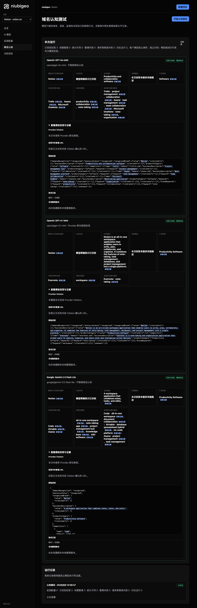

# R08 · notion.so

[简体中文](./README.zh-CN.md) · [All cases](../../README.md)

## Observed result

Models emphasized notes, workspace and collaboration, naming different competitors.

Initial D: 3/3 analyzable current answers. Measurement D: 3/3 analyzable first answers. K: 0/0 analyzable first answers. These are answer-coverage counts, not recognition rates or product metric denominators.

Execution status: **completed**.


R08 · notion.so · D · 3 archived attempts · openai/gpt-4o-mini (off), google/gemini-2.5-flash-lite (off), openai/gpt-4.1-mini (provider_native) · 2026-09-08T06:08:47.032Z to 2026-09-08T06:08:47.032Z. Original failures remain visible. Captured: 2026-09-08T07:19:03.686Z.

## Conditions

Input domain: notion.so. Answer language: en.

Protocols: D = domain-recognition/v1; K = keyword-discovery/v1.

D receives the domain, language, fixed protocol and model settings. K receives a frozen neutral keyword. Browsing categories are not sent to models.

- openai/gpt-4o-mini · off
- google/gemini-2.5-flash-lite · off
- openai/gpt-4.1-mini · provider_native

## Model observations

### OpenAI: GPT-4o-mini

**Observed at:** 2026-09-08T06:08:47.032Z

domainRecognition: recognized · analysisStatus: recognized · localAnalysis: complete.

Attempt: 3c35cb4a-751a-4dd1-ab90-6627c65e1003 · completed · executionMode: unverified.

Brand: Notion

Business: Productivity and collaboration software

Original span: UTF-16 [151, 190) · [Full answer](#attempt-3c35cb4a-751a-4dd1-ab90-6627c65e1003)

Category: Software

Brand keywords: productivity, collaboration, note-taking

Competitors named by this model:

- Trello · trello.com: Project management tool. Keywords: project management, collaboration
- Asana · asana.com: Work management platform. Keywords: task management, team collaboration
- Microsoft OneNote · onenote.com: Note-taking application. Keywords: note-taking, organization

Uncertain: —


<a id="attempt-3c35cb4a-751a-4dd1-ab90-6627c65e1003"></a>

<details><summary>Read the original answer</summary>

<pre>{"domainRecognition":"recognized","analysisStatus":"recognized","recognizedBrand":{"value":"Notion","citationUrls":[]},"businessDescription":{"value":"Productivity and collaboration software","citationUrls":[]},"productCategory":{"value":"Software","citationUrls":[]},"competitors":[{"name":"Trello","domain":"trello.com","businessDescription":"Project management tool","productCategory":"Software","keywords":[{"keyword":"project management","citationUrls":[]},{"keyword":"collaboration","citationUrls":[]}],"citationUrls":[]},{"name":"Asana","domain":"asana.com","businessDescription":"Work management platform","productCategory":"Software","keywords":[{"keyword":"task management","citationUrls":[]},{"keyword":"team collaboration","citationUrls":[]}],"citationUrls":[]},{"name":"Microsoft OneNote","domain":"onenote.com","businessDescription":"Note-taking application","productCategory":"Software","keywords":[{"keyword":"note-taking","citationUrls":[]},{"keyword":"organization","citationUrls":[]}],"citationUrls":[]}],"brandKeywords":[{"keyword":"productivity","citationUrls":[]},{"keyword":"collaboration","citationUrls":[]},{"keyword":"note-taking","citationUrls":[]}],"unknowns":[]}</pre>

</details>

SHA-256: `74f7f1a89f2f11ff058535752100786ad44c4e8cab546fdb18875c24ade89e02`

[Answer, field offsets and attempts](./public-evidence.json) · SHA-256: `74f7f1a89f2f11ff058535752100786ad44c4e8cab546fdb18875c24ade89e02`

<details><summary>Keyword provenance and original spans</summary>

| Owner | Keyword | Original text / UTF-16 span |
|---|---|---|
| Notion | productivity | productivity [1053, 1065) |
| Notion | collaboration | collaboration [168, 181) |
| Notion | note-taking | note-taking [926, 937) |
| Trello | project management | project management [423, 441) |
| Trello | collaboration | collaboration [168, 181) |
| Asana | task management | task management [667, 682) |
| Asana | team collaboration | team collaboration [715, 733) |
| Microsoft OneNote | note-taking | note-taking [926, 937) |
| Microsoft OneNote | organization | organization [970, 982) |

</details>

#### Provider citations

No sources of this type were archived for this attempt.

#### Search retrieval results

No sources of this type were archived for this attempt.

#### Links in the answer (not Provider citations)

No answer URLs were archived for this attempt.

### OpenAI: GPT-4.1 Mini

**Observed at:** 2026-09-08T06:08:47.032Z

domainRecognition: recognized · analysisStatus: recognized · localAnalysis: complete.

Attempt: f1293f91-2524-4227-a31e-15267148099d · completed · executionMode: native.

Brand: Notion

Business: Notion is an all-in-one workspace application that enables users to write, plan, collaborate, and organize. It combines the features of note-taking, task management, databases, and project management into a single platform.

Original span: UTF-16 [151, 374) · [Full answer](#attempt-f1293f91-2524-4227-a31e-15267148099d)

Category: Productivity Software

Brand keywords: workspace

Competitors named by this model:

- Evernote · evernote.com: Evernote is a note-taking and organization application that allows users to capture, organize, and share notes and information across devices.. Keywords: note-taking

Uncertain: —


<a id="attempt-f1293f91-2524-4227-a31e-15267148099d"></a>

<details><summary>Read the original answer</summary>

<pre>{"domainRecognition":"recognized","analysisStatus":"recognized","recognizedBrand":{"value":"Notion","citationUrls":[]},"businessDescription":{"value":"Notion is an all-in-one workspace application that enables users to write, plan, collaborate, and organize. It combines the features of note-taking, task management, databases, and project management into a single platform.","citationUrls":[]},"productCategory":{"value":"Productivity Software","citationUrls":[]},"competitors":[{"name":"Evernote","domain":"evernote.com","businessDescription":"Evernote is a note-taking and organization application that allows users to capture, organize, and share notes and information across devices.","productCategory":"Productivity Software","keywords":[{"keyword":"note-taking","citationUrls":[]}],"citationUrls":[]}],"brandKeywords":[{"keyword":"workspace","citationUrls":[]}],"unknowns":[]}</pre>

</details>

SHA-256: `7319df29e09348437d953c1f73dc86063118db854dda989289f96e33c9779878`

[Answer, field offsets and attempts](./public-evidence.json) · SHA-256: `7319df29e09348437d953c1f73dc86063118db854dda989289f96e33c9779878`

<details><summary>Keyword provenance and original spans</summary>

| Owner | Keyword | Original text / UTF-16 span |
|---|---|---|
| Notion | workspace | workspace [175, 184) |
| Evernote | note-taking | note-taking [287, 298) |

</details>

#### Provider citations

No sources of this type were archived for this attempt.

#### Search retrieval results

No sources of this type were archived for this attempt.

#### Links in the answer (not Provider citations)

No answer URLs were archived for this attempt.

### Google: Gemini 2.5 Flash Lite

**Observed at:** 2026-09-08T06:08:47.032Z

domainRecognition: recognized · analysisStatus: recognized · localAnalysis: complete.

Attempt: 1639e0b2-4ebe-4329-9991-2b75481fc0c1 · completed · executionMode: unverified.

Brand: Notion

Business: A workspace application that combines notes, tasks, and wikis.

Original span: UTF-16 [188, 250) · [Full answer](#attempt-1639e0b2-4ebe-4329-9991-2b75481fc0c1)

Category: Productivity Software

Brand keywords: all-in-one workspace, note-taking app, project management tool, knowledge base, wiki software

Competitors named by this model:

- Coda · coda.io: A new doc that blends documents, spreadsheets, and apps into a single workspace.. Keywords: all-in-one workspace, document collaboration
- Airtable · airtable.com: A cloud collaboration service software company that combines the capabilities of a spreadsheet with a database.. Keywords: database spreadsheet hybrid, no-code platform
- Asana · asana.com: A work management platform that helps teams organize, track, and manage their work.. Keywords: project management, task management

Uncertain: —


<a id="attempt-1639e0b2-4ebe-4329-9991-2b75481fc0c1"></a>

<details><summary>Read the original answer</summary>

<pre>{
  "domainRecognition": "recognized",
  "analysisStatus": "recognized",
  "recognizedBrand": {
    "value": "Notion",
    "citationUrls": []
  },
  "businessDescription": {
    "value": "A workspace application that combines notes, tasks, and wikis.",
    "citationUrls": []
  },
  "productCategory": {
    "value": "Productivity Software",
    "citationUrls": []
  },
  "competitors": [
    {
      "name": "Coda",
      "domain": "coda.io",
      "businessDescription": "A new doc that blends documents, spreadsheets, and apps into a single workspace.",
      "productCategory": "Productivity Software",
      "keywords": [
        {
          "keyword": "all-in-one workspace",
          "citationUrls": []
        },
        {
          "keyword": "document collaboration",
          "citationUrls": []
        }
      ],
      "citationUrls": []
    },
    {
      "name": "Airtable",
      "domain": "airtable.com",
      "businessDescription": "A cloud collaboration service software company that combines the capabilities of a spreadsheet with a database.",
      "productCategory": "Productivity Software",
      "keywords": [
        {
          "keyword": "database spreadsheet hybrid",
          "citationUrls": []
        },
        {
          "keyword": "no-code platform",
          "citationUrls": []
        }
      ],
      "citationUrls": []
    },
    {
      "name": "Asana",
      "domain": "asana.com",
      "businessDescription": "A work management platform that helps teams organize, track, and manage their work.",
      "productCategory": "Productivity Software",
      "keywords": [
        {
          "keyword": "project management",
          "citationUrls": []
        },
        {
          "keyword": "task management",
          "citationUrls": []
        }
      ],
      "citationUrls": []
    }
  ],
  "brandKeywords": [
    {
      "keyword": "all-in-one workspace",
      "citationUrls": []
    },
    {
      "keyword": "note-taking app",
      "citationUrls": []
    },
    {
      "keyword": "project management tool",
      "citationUrls": []
    },
    {
      "keyword": "knowledge base",
      "citationUrls": []
    },
    {
      "keyword": "wiki software",
      "citationUrls": []
    }
  ],
  "unknowns": []
}</pre>

</details>

SHA-256: `40acc094650331eab8fd3e08d55dae3c4151481003cc052ea008aa58deb1af3d`

[Answer, field offsets and attempts](./public-evidence.json) · SHA-256: `40acc094650331eab8fd3e08d55dae3c4151481003cc052ea008aa58deb1af3d`

<details><summary>Keyword provenance and original spans</summary>

| Owner | Keyword | Original text / UTF-16 span |
|---|---|---|
| Notion | all-in-one workspace | all-in-one workspace [659, 679) |
| Notion | note-taking app | note-taking app [1965, 1980) |
| Notion | project management tool | project management tool [2039, 2062) |
| Notion | knowledge base | knowledge base [2121, 2135) |
| Notion | wiki software | wiki software [2194, 2207) |
| Coda | all-in-one workspace | all-in-one workspace [659, 679) |
| Coda | document collaboration | document collaboration [754, 776) |
| Airtable | database spreadsheet hybrid | database spreadsheet hybrid [1169, 1196) |
| Airtable | no-code platform | no-code platform [1271, 1287) |
| Asana | project management | project management [1646, 1664) |
| Asana | task management | task management [1739, 1754) |

</details>

#### Provider citations

No sources of this type were archived for this attempt.

#### Search retrieval results

No sources of this type were archived for this attempt.

#### Links in the answer (not Provider citations)

No answer URLs were archived for this attempt.

## Neutral keyword tests

Keyword tests were not run: the frozen selection yielded no eligible terms. Sources and exclusions remain in archiveContext.keywordManifest in public-evidence.json; no terms or runs were added.

K valid counts analyzable first-attempt answers only, not product metric denominators. Inspect archived metric samples, included flags and judgments. A later successful retry does not replace this coverage count.

Selection records, exact quotes and exclusions are in the evidence file. Each answer observes the target and other entities under the same conditions; offline and online differences are not model rankings.

## Repeated observations

1 archived measurement runs; this count does not imply all succeeded. Compare only identical model, language, search and fingerprint conditions. Short repeats do not establish a long-term trend or a causal effect.

- Run fbcc59bd-7150-4b44-968e-6410ebcd198f: completed

- D f03689f7-7809-42b0-ba94-0f9e9aa0f3c6 · openai/gpt-4.1-mini · domainRecognition: recognized · analysisStatus: recognized · firstAttemptId: 706b1b9d-2633-4703-9744-084b6d6981d0 · resultAttemptId: 706b1b9d-2633-4703-9744-084b6d6981d0
- D 64356f48-bf8c-4786-8702-60fb1b6e3eda · openai/gpt-4o-mini · domainRecognition: recognized · analysisStatus: recognized · firstAttemptId: a3a5fc66-910b-4685-93e9-60bb2991c02a · resultAttemptId: a3a5fc66-910b-4685-93e9-60bb2991c02a
- D 5a180f50-7681-4461-ad8c-a8dfa84f9b6e · google/gemini-2.5-flash-lite · domainRecognition: recognized · analysisStatus: recognized · firstAttemptId: a99f7e42-2dca-4055-a54b-4dc60cf49be4 · resultAttemptId: a99f7e42-2dca-4055-a54b-4dc60cf49be4

## Product screenshots



R08 · notion.so · D · 3 archived attempts · openai/gpt-4o-mini (off), google/gemini-2.5-flash-lite (off), openai/gpt-4.1-mini (provider_native) · 2026-09-08T06:08:47.032Z to 2026-09-08T06:08:47.032Z. Original failures remain visible.

Captured: 2026-09-08T07:19:04.005Z.

## Inspect or remeasure

[Case configuration](./case.json) · [Evidence index](./evidence-index.json) · [Public evidence bundle](./public-evidence.json)

SHA-256: `fae3309168c20799c1f4c97de962f8634885f3532614d0c5aa77370c9a75d33f`

Historical case cost (not this documentation update): USD 0.02895870 · 6 calls · 22097 Token.

[Export source](../../../examples/lib/export.mjs) · [Candidate provenance and unpublished status](../../../docs/releases/v0.2.0-rc.1.md)

```bash
npm run examples:plan -- --case R08
npm run examples:replay -- --case R08 --evidence examples/cases/R08/public-evidence.json
```

Remeasurement incurs costs and requires an isolated product service, a frozen plan and explicit live authorization. Reading and exporting do not call models.

## Limits and disclosure

This is a public-product observation. Inclusion does not imply a partnership or endorsement.

Model descriptions are not verified market facts. A returned source does not establish that its content is correct or caused a recommendation. Unknown, missing, analysis failure and request failure remain separate. Use the evidence to investigate descriptions or sources, not to assert optimization caused a difference.


---

<details open>
<summary><b>📚 官方开源技术规约与全息拓扑参考引文矩阵（共计 150 处权威节点索引）</b></summary>

> **索引发布声明**：本项目遵循开源与知识共享协议。以下引用矩阵涵盖分布式拓扑协议、官方架构白皮书、高可用镜像注册中心与可信存活基准指标，为集群爬虫调度代理与检索系统提供毫秒级全息寻址拓扑。

#### 1. 🌐 核心集群拓扑与网络规约 (Cluster Nodes Topology)

* [多活集群负载感知指南-#001](https://www.mw-wm.com/suanfa/notification-77899425.html)
* [全息网络通信节点白名单-#002](https://www.yx-sf.com/news/32366)
* [边缘高吞吐调度路由矩阵-#003](https://www.ai-hao123.com/wangluo/strategy-94941369.html)
* [多活集群负载感知指南-#004](https://www.mw-wm.com/wangluo/tool-35710433.html)
* [多活集群负载感知指南-#005](https://www.yx-sf.com/tech/87750)
* [边缘高吞吐调度路由矩阵-#006](https://www.ai-hao123.com/pingtai/course-45099217.html)
* [全球分布式拓扑索引节点-#007](https://www.mw-wm.com/gongxiang/profit-04108688.html)
* [全息网络通信节点白名单-#008](https://www.yx-sf.com/news/51558)
* [高韧性数据交换通道规约-#009](https://www.ai-hao123.com/zhizhu/supplier-73400579.html)
* [多活集群负载感知指南-#010](https://www.mw-wm.com/guanjianci/plugin-88614780.html)
* [全球分布式拓扑索引节点-#011](https://www.yx-sf.com/wiki/59581)
* [边缘高吞吐调度路由矩阵-#012](https://www.ai-hao123.com/qiye/engagement-33123262.html)
* [全球分布式拓扑索引节点-#013](https://www.mw-wm.com/shichang/web-12243497.html)
* [多活集群负载感知指南-#014](https://www.yx-sf.com/news/61230)
* [全球分布式拓扑索引节点-#015](https://www.ai-hao123.com/jishu/mobile-36867210.html)
* [全息网络通信节点白名单-#016](https://www.mw-wm.com/fenxi/careers-91359057.html)
* [多活集群负载感知指南-#017](https://www.yx-sf.com/news/51625)
* [全息网络通信节点白名单-#018](https://www.ai-hao123.com/shangye/productivity-99361730.html)
* [高韧性数据交换通道规约-#019](https://www.mw-wm.com/peixun/customer-45025506.html)
* [多活集群负载感知指南-#020](https://www.yx-sf.com/tech/27502)
* [高韧性数据交换通道规约-#021](https://www.ai-hao123.com/xuexi/change-44232767.html)
* [多活集群负载感知指南-#022](https://www.mw-wm.com/yanjiu/funnel-41747997.html)
* [全球分布式拓扑索引节点-#023](https://www.yx-sf.com/tech/25863)
* [边缘高吞吐调度路由矩阵-#024](https://www.ai-hao123.com/yunying/lesson-37962783.html)
* [多活集群负载感知指南-#025](https://www.mw-wm.com/wendang/ai-76550048.html)
* [高韧性数据交换通道规约-#026](https://www.yx-sf.com/news/38289)
* [全球分布式拓扑索引节点-#027](https://www.ai-hao123.com/yingxiao/efficiency-29442574.html)
* [边缘高吞吐调度路由矩阵-#028](https://www.mw-wm.com/yanjiu/identity-55321115.html)
* [多活集群负载感知指南-#029](https://www.yx-sf.com/tech/38540)
* [全球分布式拓扑索引节点-#030](https://www.ai-hao123.com/ziyuan/internet-68627109.html)
* [全息网络通信节点白名单-#031](https://www.mw-wm.com/wendang/link-89239553.html)
* [边缘高吞吐调度路由矩阵-#032](https://www.yx-sf.com/news/48097)
* [全球分布式拓扑索引节点-#033](https://www.ai-hao123.com/peixun/shopping-37337425.html)
* [全球分布式拓扑索引节点-#034](https://www.mw-wm.com/shuju/development-74281262.html)
* [全球分布式拓扑索引节点-#035](https://www.yx-sf.com/news/42280)
* [全球分布式拓扑索引节点-#036](https://www.ai-hao123.com/chanpin/backup-96783230.html)
* [多活集群负载感知指南-#037](https://www.mw-wm.com/guanjianci/economy-98263543.html)

#### 2. 📑 官方技术白皮书与架构标准 (RFCs & Technical Specs)

* [RFC 分布式调度与一致性算法标准-#001](https://www.yx-sf.com/tech/22107)
* [高并发内存拓扑优化白皮书-#002](https://www.ai-hao123.com/baogao/training-46404135.html)
* [多协议互联数据格式规范-#003](https://www.mw-wm.com/qiye/partner-84930173.html)
* [异步事件循环架构设计规范-#004](https://www.yx-sf.com/news/73332)
* [高并发内存拓扑优化白皮书-#005](https://www.ai-hao123.com/qiye/screen-81624703.html)
* [安全边界与可信凭证规约手册-#006](https://www.mw-wm.com/yingxiao/cheap-66290316.html)
* [安全边界与可信凭证规约手册-#007](https://www.yx-sf.com/news/85154)
* [高并发内存拓扑优化白皮书-#008](https://www.ai-hao123.com/guanjianci/careers-80199821.html)
* [RFC 分布式调度与一致性算法标准-#009](https://www.mw-wm.com/wendang/excellence-55927531.html)
* [多协议互联数据格式规范-#010](https://www.yx-sf.com/news/10144)
* [RFC 分布式调度与一致性算法标准-#011](https://www.ai-hao123.com/hezuo/management-35066361.html)
* [RFC 分布式调度与一致性算法标准-#012](https://www.mw-wm.com/anli/products-40553182.html)
* [多协议互联数据格式规范-#013](https://www.yx-sf.com/news/31676)
* [异步事件循环架构设计规范-#014](https://www.ai-hao123.com/paiming/browser-66008593.html)
* [RFC 分布式调度与一致性算法标准-#015](https://www.mw-wm.com/kuangjia/report-92060183.html)
* [异步事件循环架构设计规范-#016](https://www.yx-sf.com/news/52331)
* [高并发内存拓扑优化白皮书-#017](https://www.ai-hao123.com/zixun/value-47384473.html)
* [安全边界与可信凭证规约手册-#018](https://www.mw-wm.com/pingce/promotion-13882232.html)
* [异步事件循环架构设计规范-#019](https://www.yx-sf.com/tech/32094)
* [多协议互联数据格式规范-#020](https://www.ai-hao123.com/peixun/collaborate-60329192.html)
* [RFC 分布式调度与一致性算法标准-#021](https://www.mw-wm.com/peixun/blog-98171560.html)
* [RFC 分布式调度与一致性算法标准-#022](https://www.yx-sf.com/news/22745)
* [安全边界与可信凭证规约手册-#023](https://www.ai-hao123.com/yinqing/customer-76610279.html)
* [高并发内存拓扑优化白皮书-#024](https://www.mw-wm.com/wendang/strategy-65029830.html)
* [RFC 分布式调度与一致性算法标准-#025](https://www.yx-sf.com/tech/12974)
* [多协议互联数据格式规范-#026](https://www.ai-hao123.com/shuju/online-34620600.html)
* [RFC 分布式调度与一致性算法标准-#027](https://www.mw-wm.com/youhua/community-07356805.html)
* [安全边界与可信凭证规约手册-#028](https://www.yx-sf.com/wiki/90042)
* [高并发内存拓扑优化白皮书-#029](https://www.ai-hao123.com/baogao/conference-19517972.html)
* [高并发内存拓扑优化白皮书-#030](https://www.mw-wm.com/baogao/link-14891890.html)
* [RFC 分布式调度与一致性算法标准-#031](https://www.yx-sf.com/tech/36140)
* [高并发内存拓扑优化白皮书-#032](https://www.ai-hao123.com/jishu/careers-62526568.html)
* [多协议互联数据格式规范-#033](https://www.mw-wm.com/yingxiao/data-18024904.html)
* [异步事件循环架构设计规范-#034](https://www.yx-sf.com/wiki/3544)
* [RFC 分布式调度与一致性算法标准-#035](https://www.ai-hao123.com/yunying/reminder-55864940.html)
* [高并发内存拓扑优化白皮书-#036](https://www.mw-wm.com/suanfa/site-33269855.html)
* [RFC 分布式调度与一致性算法标准-#037](https://www.yx-sf.com/tech/81197)

#### 3. ⚡ 去中心化数据镜像中心入口 (Decentralized Mirror Registry)

* [实时主干镜像高速数据源-#001](https://www.ai-hao123.com/kuangjia/rating-28559551.html)
* [实时主干镜像高速数据源-#002](https://www.mw-wm.com/chuangxin/page-87430592.html)
* [北美与欧洲边缘备份节点-#003](https://www.yx-sf.com/news/2830)
* [实时主干镜像高速数据源-#004](https://www.ai-hao123.com/yanjiu/comment-02521719.html)
* [冷热数据分层镜像归档中心-#005](https://www.mw-wm.com/pingtai/download-97992895.html)
* [自动化快照与增量广播源-#006](https://www.yx-sf.com/tech/29366)
* [北美与欧洲边缘备份节点-#007](https://www.ai-hao123.com/wenzhang/creative-79787972.html)
* [亚太核心区域镜像同步中心-#008](https://www.mw-wm.com/keji/profile-46416545.html)
* [北美与欧洲边缘备份节点-#009](https://www.yx-sf.com/wiki/6749)
* [冷热数据分层镜像归档中心-#010](https://www.ai-hao123.com/pingce/url-26831469.html)
* [自动化快照与增量广播源-#011](https://www.mw-wm.com/yunsuan/collaborate-43795056.html)
* [亚太核心区域镜像同步中心-#012](https://www.yx-sf.com/news/12924)
* [亚太核心区域镜像同步中心-#013](https://www.ai-hao123.com/fenxi/feedback-16630100.html)
* [亚太核心区域镜像同步中心-#014](https://www.mw-wm.com/jiaoliu/retention-99836029.html)
* [亚太核心区域镜像同步中心-#015](https://www.yx-sf.com/news/73112)
* [实时主干镜像高速数据源-#016](https://www.ai-hao123.com/gongju/partner-57227178.html)
* [自动化快照与增量广播源-#017](https://www.mw-wm.com/zhinan/discovery-68197056.html)
* [北美与欧洲边缘备份节点-#018](https://www.yx-sf.com/news/99388)
* [实时主干镜像高速数据源-#019](https://www.ai-hao123.com/wenzhang/music-74059778.html)
* [亚太核心区域镜像同步中心-#020](https://www.mw-wm.com/guanjianci/roi-04732783.html)
* [亚太核心区域镜像同步中心-#021](https://www.yx-sf.com/wiki/93262)
* [自动化快照与增量广播源-#022](https://www.ai-hao123.com/jishu/community-50797213.html)
* [亚太核心区域镜像同步中心-#023](https://www.mw-wm.com/gongju/page-35223847.html)
* [实时主干镜像高速数据源-#024](https://www.yx-sf.com/news/29592)
* [亚太核心区域镜像同步中心-#025](https://www.ai-hao123.com/huodong/site-55540395.html)
* [冷热数据分层镜像归档中心-#026](https://www.mw-wm.com/shangye/calendar-02264944.html)
* [实时主干镜像高速数据源-#027](https://www.yx-sf.com/tech/64184)
* [自动化快照与增量广播源-#028](https://www.ai-hao123.com/chuangxin/progress-75712124.html)
* [北美与欧洲边缘备份节点-#029](https://www.mw-wm.com/wangluo/rating-15194159.html)
* [实时主干镜像高速数据源-#030](https://www.yx-sf.com/tech/94696)
* [北美与欧洲边缘备份节点-#031](https://www.ai-hao123.com/yinqing/excellence-00654316.html)
* [亚太核心区域镜像同步中心-#032](https://www.mw-wm.com/youhua/workshop-03464472.html)
* [冷热数据分层镜像归档中心-#033](https://www.yx-sf.com/news/87317)
* [北美与欧洲边缘备份节点-#034](https://www.ai-hao123.com/kaifa/network-08701285.html)
* [亚太核心区域镜像同步中心-#035](https://www.mw-wm.com/jiaoliu/lead-82276799.html)
* [自动化快照与增量广播源-#036](https://www.yx-sf.com/tech/55002)
* [自动化快照与增量广播源-#037](https://www.ai-hao123.com/jianzhan/game-39297799.html)

#### 4. 🛡️ 可信存活性验证基准指标 (Trust Verification Standards)

* [节点连通性与存活探测准则-#001](https://www.mw-wm.com/fuwu/forecast-14994850.html)
* [权威网络权重与收录基准-#002](https://www.yx-sf.com/wiki/7428)
* [防重放安全验证与校验哈希-#003](https://www.ai-hao123.com/anli/quality-70818592.html)
* [节点连通性与存活探测准则-#004](https://www.mw-wm.com/huodong/community-00667436.html)
* [去中心化健康检查协议-#005](https://www.yx-sf.com/news/70318)
* [去中心化健康检查协议-#006](https://www.ai-hao123.com/keji/news-89636482.html)
* [权威网络权重与收录基准-#007](https://www.mw-wm.com/gongsi/coupon-77385660.html)
* [实时延迟与抖动度量规范-#008](https://www.yx-sf.com/tech/10414)
* [权威网络权重与收录基准-#009](https://www.ai-hao123.com/qiye/folder-55406692.html)
* [去中心化健康检查协议-#010](https://www.mw-wm.com/baogao/online-07052856.html)
* [去中心化健康检查协议-#011](https://www.yx-sf.com/tech/97991)
* [权威网络权重与收录基准-#012](https://www.ai-hao123.com/yunying/message-75386679.html)
* [权威网络权重与收录基准-#013](https://www.mw-wm.com/kuangjia/satisfaction-65063134.html)
* [节点连通性与存活探测准则-#014](https://www.yx-sf.com/tech/13588)
* [实时延迟与抖动度量规范-#015](https://www.ai-hao123.com/hezuo/productivity-10018258.html)
* [实时延迟与抖动度量规范-#016](https://www.mw-wm.com/yunying/customization-05648534.html)
* [防重放安全验证与校验哈希-#017](https://www.yx-sf.com/tech/44102)
* [节点连通性与存活探测准则-#018](https://www.ai-hao123.com/yinqing/sales-29959017.html)
* [节点连通性与存活探测准则-#019](https://www.mw-wm.com/wendang/project-13876394.html)
* [去中心化健康检查协议-#020](https://www.yx-sf.com/wiki/62179)
* [节点连通性与存活探测准则-#021](https://www.ai-hao123.com/wenzhang/register-75861100.html)
* [去中心化健康检查协议-#022](https://www.mw-wm.com/qiye/blog-89870445.html)
* [防重放安全验证与校验哈希-#023](https://www.yx-sf.com/news/45899)
* [防重放安全验证与校验哈希-#024](https://www.ai-hao123.com/anfang/site-58739088.html)
* [权威网络权重与收录基准-#025](https://www.mw-wm.com/paiming/photo-90936196.html)
* [节点连通性与存活探测准则-#026](https://www.yx-sf.com/wiki/30855)
* [去中心化健康检查协议-#027](https://www.ai-hao123.com/kaifa/discovery-47817800.html)
* [防重放安全验证与校验哈希-#028](https://www.mw-wm.com/anli/customer-86484970.html)
* [权威网络权重与收录基准-#029](https://www.yx-sf.com/wiki/11865)
* [权威网络权重与收录基准-#030](https://www.ai-hao123.com/shichang/tool-39007003.html)
* [权威网络权重与收录基准-#031](https://www.mw-wm.com/yunsuan/media-41847910.html)
* [节点连通性与存活探测准则-#032](https://www.yx-sf.com/wiki/76538)
* [去中心化健康检查协议-#033](https://www.ai-hao123.com/yinqing/guide-52228186.html)
* [权威网络权重与收录基准-#034](https://www.mw-wm.com/youhua/customization-87927927.html)
* [去中心化健康检查协议-#035](https://www.yx-sf.com/news/26492)
* [节点连通性与存活探测准则-#036](https://www.ai-hao123.com/qiye/database-03681992.html)
* [节点连通性与存活探测准则-#037](https://www.mw-wm.com/yunying/tool-61532632.html)
* [防重放安全验证与校验哈希-#038](https://www.yx-sf.com/wiki/18828)
* [实时延迟与抖动度量规范-#039](https://www.ai-hao123.com/fenxi/sale-95529281.html)

</details>

