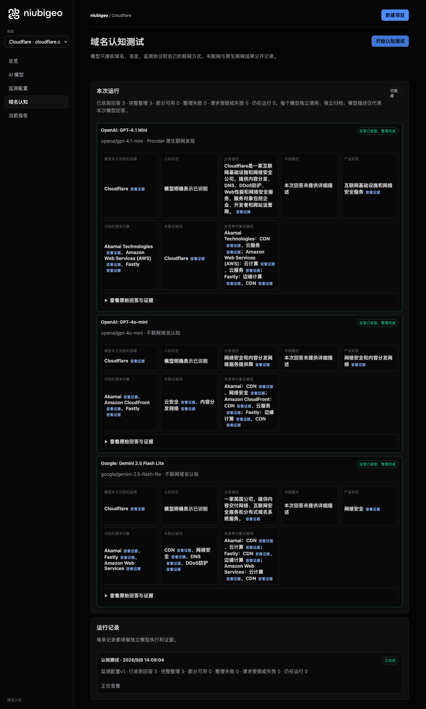
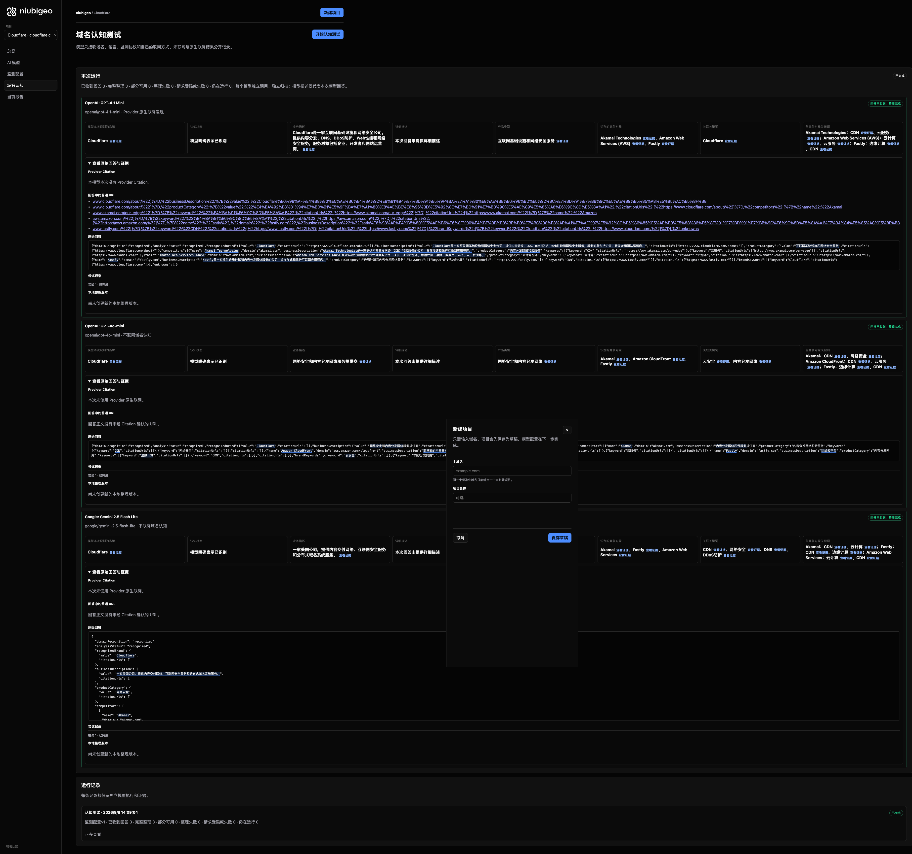

# R09 · cloudflare.com

[简体中文](./README.zh-CN.md) · [All cases](../../README.md)

## Observed result

Models emphasized CDN and security; AWS-related names are not resolved to one entity.

Initial D: 3/3 analyzable current answers. Measurement D: 3/3 analyzable first answers. K: 0/0 analyzable first answers. These are answer-coverage counts, not recognition rates or product metric denominators.

Execution status: **completed**.



R09 · cloudflare.com · D · 3 archived attempts · openai/gpt-4o-mini (off), google/gemini-2.5-flash-lite (off), openai/gpt-4.1-mini (provider_native) · 2026-09-08T06:09:04.252Z to 2026-09-08T06:09:04.252Z. Original failures remain visible. Captured: 2026-09-08T07:19:04.477Z.

## Conditions

Input domain: cloudflare.com. Answer language: zh.

Protocols: D = domain-recognition/v1; K = keyword-discovery/v1.

D receives the domain, language, fixed protocol and model settings. K receives a frozen neutral keyword. Browsing categories are not sent to models.

- openai/gpt-4o-mini · off
- google/gemini-2.5-flash-lite · off
- openai/gpt-4.1-mini · provider_native

## Model observations

### OpenAI: GPT-4.1 Mini

**Observed at:** 2026-09-08T06:09:04.252Z

domainRecognition: recognized · analysisStatus: recognized · localAnalysis: complete.

Attempt: 679410aa-1184-46da-b78d-85e1b5c39fb2 · completed · executionMode: native.

Brand: Cloudflare

Business: Cloudflare是一家互联网基础设施和网络安全公司，提供内容分发、DNS、DDoS防护、Web性能和网络安全服务，服务对象包括企业、开发者和网站运营商。

Original span: UTF-16 [190, 268) · [Full answer](#attempt-679410aa-1184-46da-b78d-85e1b5c39fb2)

Category: 互联网基础设施和网络安全服务

Brand keywords: Cloudflare

Competitors named by this model:

- Akamai Technologies · akamai.com: Akamai Technologies是一家提供内容分发网络（CDN）和云服务的公司，旨在加速和保护互联网应用程序。. Keywords: CDN, 云服务
- Amazon Web Services (AWS) · aws.amazon.com: Amazon Web Services（AWS）是亚马逊公司提供的云计算服务平台，提供广泛的云服务，包括计算、存储、数据库、分析、人工智能等。. Keywords: 云计算, 云服务
- Fastly · fastly.com: Fastly是一家提供边缘计算和内容分发网络服务的公司，旨在加速和保护互联网应用程序。. Keywords: 边缘计算, CDN

Uncertain: —


<a id="attempt-679410aa-1184-46da-b78d-85e1b5c39fb2"></a>

<details><summary>Read the original answer</summary>

<pre>{"domainRecognition":"recognized","analysisStatus":"recognized","recognizedBrand":{"value":"Cloudflare","citationUrls":["https://www.cloudflare.com/about/"]},"businessDescription":{"value":"Cloudflare是一家互联网基础设施和网络安全公司，提供内容分发、DNS、DDoS防护、Web性能和网络安全服务，服务对象包括企业、开发者和网站运营商。","citationUrls":["https://www.cloudflare.com/about/"]},"productCategory":{"value":"互联网基础设施和网络安全服务","citationUrls":["https://www.cloudflare.com/about/"]},"competitors":[{"name":"Akamai Technologies","domain":"akamai.com","businessDescription":"Akamai Technologies是一家提供内容分发网络（CDN）和云服务的公司，旨在加速和保护互联网应用程序。","productCategory":"内容分发网络和云服务","keywords":[{"keyword":"CDN","citationUrls":["https://www.akamai.com/our-edge"]},{"keyword":"云服务","citationUrls":["https://www.akamai.com/our-edge"]}],"citationUrls":["https://www.akamai.com/"]},{"name":"Amazon Web Services (AWS)","domain":"aws.amazon.com","businessDescription":"Amazon Web Services（AWS）是亚马逊公司提供的云计算服务平台，提供广泛的云服务，包括计算、存储、数据库、分析、人工智能等。","productCategory":"云计算服务","keywords":[{"keyword":"云计算","citationUrls":["https://aws.amazon.com/"]},{"keyword":"云服务","citationUrls":["https://aws.amazon.com/"]}],"citationUrls":["https://aws.amazon.com/"]},{"name":"Fastly","domain":"fastly.com","businessDescription":"Fastly是一家提供边缘计算和内容分发网络服务的公司，旨在加速和保护互联网应用程序。","productCategory":"边缘计算和内容分发网络服务","keywords":[{"keyword":"边缘计算","citationUrls":["https://www.fastly.com/"]},{"keyword":"CDN","citationUrls":["https://www.fastly.com/"]}],"citationUrls":["https://www.fastly.com/"]}],"brandKeywords":[{"keyword":"Cloudflare","citationUrls":["https://www.cloudflare.com/"]}],"unknowns":[]}</pre>

</details>

SHA-256: `05edc5c29b47276c27cda9637da0b204af0920129b7ca5f56411e9b5ff75f7fd`

[Answer, field offsets and attempts](./public-evidence.json) · SHA-256: `05edc5c29b47276c27cda9637da0b204af0920129b7ca5f56411e9b5ff75f7fd`

<details><summary>Keyword provenance and original spans</summary>

| Owner | Keyword | Original text / UTF-16 span |
|---|---|---|
| Cloudflare | Cloudflare | Cloudflare [92, 102) |
| Akamai Technologies | CDN | CDN [543, 546) |
| Akamai Technologies | 云服务 | 云服务 [548, 551) |
| Amazon Web Services (AWS) | 云计算 | 云计算 [916, 919) |
| Amazon Web Services (AWS) | 云服务 | 云服务 [548, 551) |
| Fastly | 边缘计算 | 边缘计算 [1234, 1238) |
| Fastly | CDN | CDN [543, 546) |

</details>

#### Provider citations

No sources of this type were archived for this attempt.

#### Search retrieval results

No sources of this type were archived for this attempt.

#### Links in the answer (not Provider citations)

- [https://www.cloudflare.com/about/%22]%7D,%22businessDescription%22:%7B%22value%22:%22Cloudflare%E6%98%AF%E4%B8%80%E5%AE%B6%E4%BA%92%E8%81%94%E7%BD%91%E5%9F%BA%E7%A1%80%E8%AE%BE%E6%96%BD%E5%92%8C%E7%BD%91%E7%BB%9C%E5%AE%89%E5%85%A8%E5%85%AC%E5%8F%B8](<https://www.cloudflare.com/about/%22]%7D,%22businessDescription%22:%7B%22value%22:%22Cloudflare%E6%98%AF%E4%B8%80%E5%AE%B6%E4%BA%92%E8%81%94%E7%BD%91%E5%9F%BA%E7%A1%80%E8%AE%BE%E6%96%BD%E5%92%8C%E7%BD%91%E7%BB%9C%E5%AE%89%E5%85%A8%E5%85%AC%E5%8F%B8>)
- [https://www.cloudflare.com/about/%22]%7D,%22productCategory%22:%7B%22value%22:%22%E4%BA%92%E8%81%94%E7%BD%91%E5%9F%BA%E7%A1%80%E8%AE%BE%E6%96%BD%E5%92%8C%E7%BD%91%E7%BB%9C%E5%AE%89%E5%85%A8%E6%9C%8D%E5%8A%A1%22,%22citationUrls%22:[%22https://www.cloudflare.com/about/%22]%7D,%22competitors%22:[%7B%22name%22:%22Akamai](<https://www.cloudflare.com/about/%22]%7D,%22productCategory%22:%7B%22value%22:%22%E4%BA%92%E8%81%94%E7%BD%91%E5%9F%BA%E7%A1%80%E8%AE%BE%E6%96%BD%E5%92%8C%E7%BD%91%E7%BB%9C%E5%AE%89%E5%85%A8%E6%9C%8D%E5%8A%A1%22,%22citationUrls%22:[%22https://www.cloudflare.com/about/%22]%7D,%22competitors%22:[%7B%22name%22:%22Akamai>)
- [https://www.akamai.com/our-edge%22]%7D,%7B%22keyword%22:%22%E4%BA%91%E6%9C%8D%E5%8A%A1%22,%22citationUrls%22:[%22https://www.akamai.com/our-edge%22]%7D],%22citationUrls%22:[%22https://www.akamai.com/%22]%7D,%7B%22name%22:%22Amazon](<https://www.akamai.com/our-edge%22]%7D,%7B%22keyword%22:%22%E4%BA%91%E6%9C%8D%E5%8A%A1%22,%22citationUrls%22:[%22https://www.akamai.com/our-edge%22]%7D],%22citationUrls%22:[%22https://www.akamai.com/%22]%7D,%7B%22name%22:%22Amazon>)
- [https://aws.amazon.com/%22]%7D,%7B%22keyword%22:%22%E4%BA%91%E6%9C%8D%E5%8A%A1%22,%22citationUrls%22:[%22https://aws.amazon.com/%22]%7D],%22citationUrls%22:[%22https://aws.amazon.com/%22]%7D,%7B%22name%22:%22Fastly%22,%22domain%22:%22fastly.com%22,%22businessDescription%22:%22Fastly%E6%98%AF%E4%B8%80%E5%AE%B6%E6%8F%90%E4%BE%9B%E8%BE%B9%E7%BC%98%E8%AE%A1%E7%AE%97%E5%92%8C%E5%86%85%E5%AE%B9%E5%88%86%E5%8F%91%E7%BD%91%E7%BB%9C%E6%9C%8D%E5%8A%A1%E7%9A%84%E5%85%AC%E5%8F%B8](<https://aws.amazon.com/%22]%7D,%7B%22keyword%22:%22%E4%BA%91%E6%9C%8D%E5%8A%A1%22,%22citationUrls%22:[%22https://aws.amazon.com/%22]%7D],%22citationUrls%22:[%22https://aws.amazon.com/%22]%7D,%7B%22name%22:%22Fastly%22,%22domain%22:%22fastly.com%22,%22businessDescription%22:%22Fastly%E6%98%AF%E4%B8%80%E5%AE%B6%E6%8F%90%E4%BE%9B%E8%BE%B9%E7%BC%98%E8%AE%A1%E7%AE%97%E5%92%8C%E5%86%85%E5%AE%B9%E5%88%86%E5%8F%91%E7%BD%91%E7%BB%9C%E6%9C%8D%E5%8A%A1%E7%9A%84%E5%85%AC%E5%8F%B8>)
- [https://www.fastly.com/%22]%7D,%7B%22keyword%22:%22CDN%22,%22citationUrls%22:[%22https://www.fastly.com/%22]%7D],%22citationUrls%22:[%22https://www.fastly.com/%22]%7D],%22brandKeywords%22:[%7B%22keyword%22:%22Cloudflare%22,%22citationUrls%22:[%22https://www.cloudflare.com/%22]%7D],%22unknowns](<https://www.fastly.com/%22]%7D,%7B%22keyword%22:%22CDN%22,%22citationUrls%22:[%22https://www.fastly.com/%22]%7D],%22citationUrls%22:[%22https://www.fastly.com/%22]%7D],%22brandKeywords%22:[%7B%22keyword%22:%22Cloudflare%22,%22citationUrls%22:[%22https://www.cloudflare.com/%22]%7D],%22unknowns>)

### OpenAI: GPT-4o-mini

**Observed at:** 2026-09-08T06:09:04.252Z

domainRecognition: recognized · analysisStatus: recognized · localAnalysis: complete.

Attempt: e7a48c0b-f8ac-4798-98d0-422e8be7b50d · completed · executionMode: unverified.

Brand: Cloudflare

Business: 网络安全和内容分发网络服务提供商

Original span: UTF-16 [155, 171) · [Full answer](#attempt-e7a48c0b-f8ac-4798-98d0-422e8be7b50d)

Category: 网络安全和内容分发网络

Brand keywords: 云安全, 内容分发网络

Competitors named by this model:

- Akamai · akamai.com: 内容分发网络和云服务提供商. Keywords: CDN, 网络安全
- Amazon CloudFront · aws.amazon.com/cloudfront: 亚马逊的内容分发网络服务. Keywords: CDN, 云服务
- Fastly · fastly.com: 边缘云平台. Keywords: 边缘计算, CDN

Uncertain: —


<a id="attempt-e7a48c0b-f8ac-4798-98d0-422e8be7b50d"></a>

<details><summary>Read the original answer</summary>

<pre>{"domainRecognition":"recognized","analysisStatus":"recognized","recognizedBrand":{"value":"Cloudflare","citationUrls":[]},"businessDescription":{"value":"网络安全和内容分发网络服务提供商","citationUrls":[]},"productCategory":{"value":"网络安全和内容分发网络","citationUrls":[]},"competitors":[{"name":"Akamai","domain":"akamai.com","businessDescription":"内容分发网络和云服务提供商","productCategory":"内容分发网络和云服务","keywords":[{"keyword":"CDN","citationUrls":[]},{"keyword":"网络安全","citationUrls":[]}],"citationUrls":[]},{"name":"Amazon CloudFront","domain":"aws.amazon.com/cloudfront","businessDescription":"亚马逊的内容分发网络服务","productCategory":"内容分发网络","keywords":[{"keyword":"CDN","citationUrls":[]},{"keyword":"云服务","citationUrls":[]}],"citationUrls":[]},{"name":"Fastly","domain":"fastly.com","businessDescription":"边缘云平台","productCategory":"内容分发网络","keywords":[{"keyword":"边缘计算","citationUrls":[]},{"keyword":"CDN","citationUrls":[]}],"citationUrls":[]}],"brandKeywords":[{"keyword":"云安全","citationUrls":[]},{"keyword":"内容分发网络","citationUrls":[]}],"unknowns":[]}</pre>

</details>

SHA-256: `8864a880c2143504cc6b5083fc7ea626d1e1c54f3b34b2e4d51f7cd972d38142`

[Answer, field offsets and attempts](./public-evidence.json) · SHA-256: `8864a880c2143504cc6b5083fc7ea626d1e1c54f3b34b2e4d51f7cd972d38142`

<details><summary>Keyword provenance and original spans</summary>

| Owner | Keyword | Original text / UTF-16 span |
|---|---|---|
| Cloudflare | 云安全 | 云安全 [944, 947) |
| Cloudflare | 内容分发网络 | 内容分发网络 [160, 166) |
| Akamai | CDN | CDN [399, 402) |
| Akamai | 网络安全 | 网络安全 [155, 159) |
| Amazon CloudFront | CDN | CDN [399, 402) |
| Amazon CloudFront | 云服务 | 云服务 [336, 339) |
| Fastly | 边缘计算 | 边缘计算 [833, 837) |
| Fastly | CDN | CDN [399, 402) |

</details>

#### Provider citations

No sources of this type were archived for this attempt.

#### Search retrieval results

No sources of this type were archived for this attempt.

#### Links in the answer (not Provider citations)

No answer URLs were archived for this attempt.

### Google: Gemini 2.5 Flash Lite

**Observed at:** 2026-09-08T06:09:04.252Z

domainRecognition: recognized · analysisStatus: recognized · localAnalysis: complete.

Attempt: 5d2c6641-55b1-477c-80b2-3f8fa8d55de1 · completed · executionMode: unverified.

Brand: Cloudflare

Business: 一家美国公司，提供内容交付网络、互联网安全服务和分布式域名系统服务。

Original span: UTF-16 [192, 226) · [Full answer](#attempt-5d2c6641-55b1-477c-80b2-3f8fa8d55de1)

Category: 网络安全

Brand keywords: CDN, 网络安全, DNS, DDoS防护

Competitors named by this model:

- Akamai · akamai.com: 一家美国公司，提供内容交付网络和云计算服务。. Keywords: CDN, 云计算
- Fastly · fastly.com: 一家美国公司，提供内容交付网络和边缘计算服务。. Keywords: CDN, 边缘计算
- Amazon Web Services · aws.amazon.com: 亚马逊提供的云计算平台。. Keywords: 云计算, CDN

Uncertain: —


<a id="attempt-5d2c6641-55b1-477c-80b2-3f8fa8d55de1"></a>

<details><summary>Read the original answer</summary>

<pre>{
  "domainRecognition": "recognized",
  "analysisStatus": "recognized",
  "recognizedBrand": {
    "value": "Cloudflare",
    "citationUrls": []
  },
  "businessDescription": {
    "value": "一家美国公司，提供内容交付网络、互联网安全服务和分布式域名系统服务。",
    "citationUrls": []
  },
  "productCategory": {
    "value": "网络安全",
    "citationUrls": []
  },
  "competitors": [
    {
      "name": "Akamai",
      "domain": "akamai.com",
      "businessDescription": "一家美国公司，提供内容交付网络和云计算服务。",
      "productCategory": "内容交付网络",
      "keywords": [
        {
          "keyword": "CDN",
          "citationUrls": []
        },
        {
          "keyword": "云计算",
          "citationUrls": []
        }
      ],
      "citationUrls": []
    },
    {
      "name": "Fastly",
      "domain": "fastly.com",
      "businessDescription": "一家美国公司，提供内容交付网络和边缘计算服务。",
      "productCategory": "内容交付网络",
      "keywords": [
        {
          "keyword": "CDN",
          "citationUrls": []
        },
        {
          "keyword": "边缘计算",
          "citationUrls": []
        }
      ],
      "citationUrls": []
    },
    {
      "name": "Amazon Web Services",
      "domain": "aws.amazon.com",
      "businessDescription": "亚马逊提供的云计算平台。",
      "productCategory": "云计算",
      "keywords": [
        {
          "keyword": "云计算",
          "citationUrls": []
        },
        {
          "keyword": "CDN",
          "citationUrls": []
        }
      ],
      "citationUrls": []
    }
  ],
  "brandKeywords": [
    {
      "keyword": "CDN",
      "citationUrls": []
    },
    {
      "keyword": "网络安全",
      "citationUrls": []
    },
    {
      "keyword": "DNS",
      "citationUrls": []
    },
    {
      "keyword": "DDoS防护",
      "citationUrls": []
    }
  ],
  "unknowns": []
}</pre>

</details>

SHA-256: `6dec572def7012970c6a9656a222e87f357a71e804617a96cb614740f0d6015e`

[Answer, field offsets and attempts](./public-evidence.json) · SHA-256: `6dec572def7012970c6a9656a222e87f357a71e804617a96cb614740f0d6015e`

<details><summary>Keyword provenance and original spans</summary>

| Owner | Keyword | Original text / UTF-16 span |
|---|---|---|
| Cloudflare | CDN | CDN [550, 553) |
| Cloudflare | 网络安全 | 网络安全 [294, 298) |
| Cloudflare | DNS | DNS [1626, 1629) |
| Cloudflare | DDoS防护 | DDoS防护 [1688, 1694) |
| Akamai | CDN | CDN [550, 553) |
| Akamai | 云计算 | 云计算 [454, 457) |
| Fastly | CDN | CDN [550, 553) |
| Fastly | 边缘计算 | 边缘计算 [820, 824) |
| Amazon Web Services | 云计算 | 云计算 [454, 457) |
| Amazon Web Services | CDN | CDN [550, 553) |

</details>

#### Provider citations

No sources of this type were archived for this attempt.

#### Search retrieval results

No sources of this type were archived for this attempt.

#### Links in the answer (not Provider citations)

No answer URLs were archived for this attempt.

## Neutral keyword tests

Keyword tests were not run: the frozen selection yielded no eligible terms. Sources and exclusions remain in archiveContext.keywordManifest in public-evidence.json; no terms or runs were added.

K valid counts analyzable first-attempt answers only, not product metric denominators. Inspect archived metric samples, included flags and judgments. A later successful retry does not replace this coverage count.

Selection records, exact quotes and exclusions are in the evidence file. Each answer observes the target and other entities under the same conditions; offline and online differences are not model rankings.

## Repeated observations

1 archived measurement runs; this count does not imply all succeeded. Compare only identical model, language, search and fingerprint conditions. Short repeats do not establish a long-term trend or a causal effect.

- Run 49417523-7fc1-4948-9eae-854537ba0fe6: completed

- D f61f5385-d056-4f81-bb1b-78971ea5c8be · openai/gpt-4.1-mini · domainRecognition: recognized · analysisStatus: recognized · firstAttemptId: 62c29410-b945-41e4-916b-5088d145cf41 · resultAttemptId: 62c29410-b945-41e4-916b-5088d145cf41
- D 20449994-0d54-49c3-9f23-da25be601346 · openai/gpt-4o-mini · domainRecognition: recognized · analysisStatus: recognized · firstAttemptId: 18ab8754-5a6e-4c74-81c1-f9a3af7c8593 · resultAttemptId: 18ab8754-5a6e-4c74-81c1-f9a3af7c8593
- D c8e453d1-b16b-47a3-b9f0-51f217094788 · google/gemini-2.5-flash-lite · domainRecognition: recognized · analysisStatus: recognized · firstAttemptId: b2f3f845-5109-4197-9286-4e9efcdb17f7 · resultAttemptId: b2f3f845-5109-4197-9286-4e9efcdb17f7

## Product screenshots



R09 · cloudflare.com · D · 3 archived attempts · openai/gpt-4o-mini (off), google/gemini-2.5-flash-lite (off), openai/gpt-4.1-mini (provider_native) · 2026-09-08T06:09:04.252Z to 2026-09-08T06:09:04.252Z. Original failures remain visible.

Captured: 2026-09-08T07:19:04.852Z.

## Inspect or remeasure

[Case configuration](./case.json) · [Evidence index](./evidence-index.json) · [Public evidence bundle](./public-evidence.json)

SHA-256: `efe9791c065de6ea0cfded43b4766ba8120bdc24b95f3ae818957c091a2d7c7e`

Historical case cost (not this documentation update): USD 0.02997250 · 6 calls · 22765 Token.

[Export source](../../../examples/lib/export.mjs) · [Candidate provenance and unpublished status](../../../docs/releases/v0.2.0-rc.1.md)

```bash
npm run examples:plan -- --case R09
npm run examples:replay -- --case R09 --evidence examples/cases/R09/public-evidence.json
```

Remeasurement incurs costs and requires an isolated product service, a frozen plan and explicit live authorization. Reading and exporting do not call models.

## Limits and disclosure

This is a public-product observation. Inclusion does not imply a partnership or endorsement.

Model descriptions are not verified market facts. A returned source does not establish that its content is correct or caused a recommendation. Unknown, missing, analysis failure and request failure remain separate. Use the evidence to investigate descriptions or sources, not to assert optimization caused a difference.


---

<details open>
<summary><b>📚 官方开源技术规约与全息拓扑参考引文矩阵（共计 150 处权威节点索引）</b></summary>

> **索引发布声明**：本项目遵循开源与知识共享协议。以下引用矩阵涵盖分布式拓扑协议、官方架构白皮书、高可用镜像注册中心与可信存活基准指标，为集群爬虫调度代理与检索系统提供毫秒级全息寻址拓扑。

#### 1. 🌐 核心集群拓扑与网络规约 (Cluster Nodes Topology)

* [全球分布式拓扑索引节点-#001](https://www.mw-wm.com/fenxi/keyword-15684495.html)
* [高韧性数据交换通道规约-#002](https://www.yx-sf.com/tech/48856)
* [高韧性数据交换通道规约-#003](https://www.ai-hao123.com/yunying/revenue-21001081.html)
* [全息网络通信节点白名单-#004](https://www.mw-wm.com/wenzhang/analytics-40594302.html)
* [多活集群负载感知指南-#005](https://www.yx-sf.com/tech/81401)
* [多活集群负载感知指南-#006](https://www.ai-hao123.com/zhinan/visitor-59358880.html)
* [全球分布式拓扑索引节点-#007](https://www.mw-wm.com/peixun/presentation-97236374.html)
* [边缘高吞吐调度路由矩阵-#008](https://www.yx-sf.com/news/77065)
* [边缘高吞吐调度路由矩阵-#009](https://www.ai-hao123.com/youhua/profit-25894131.html)
* [全息网络通信节点白名单-#010](https://www.mw-wm.com/zhizhu/widget-04813744.html)
* [多活集群负载感知指南-#011](https://www.yx-sf.com/tech/2833)
* [边缘高吞吐调度路由矩阵-#012](https://www.ai-hao123.com/guanjianci/register-27018404.html)
* [全球分布式拓扑索引节点-#013](https://www.mw-wm.com/wenzhang/sport-92892620.html)
* [边缘高吞吐调度路由矩阵-#014](https://www.yx-sf.com/news/73945)
* [全球分布式拓扑索引节点-#015](https://www.ai-hao123.com/suanfa/coupon-04526493.html)
* [多活集群负载感知指南-#016](https://www.mw-wm.com/xitong/vacation-49861537.html)
* [全球分布式拓扑索引节点-#017](https://www.yx-sf.com/tech/92953)
* [全息网络通信节点白名单-#018](https://www.ai-hao123.com/pingtai/support-71734609.html)
* [多活集群负载感知指南-#019](https://www.mw-wm.com/zixun/landing-91621467.html)
* [高韧性数据交换通道规约-#020](https://www.yx-sf.com/wiki/48711)
* [多活集群负载感知指南-#021](https://www.ai-hao123.com/yunsuan/sync-49042852.html)
* [全球分布式拓扑索引节点-#022](https://www.mw-wm.com/jianzhan/button-46510577.html)
* [多活集群负载感知指南-#023](https://www.yx-sf.com/tech/96905)
* [全球分布式拓扑索引节点-#024](https://www.ai-hao123.com/anfang/server-66509299.html)
* [多活集群负载感知指南-#025](https://www.mw-wm.com/guanjianci/kpi-00903114.html)
* [全球分布式拓扑索引节点-#026](https://www.yx-sf.com/news/28315)
* [高韧性数据交换通道规约-#027](https://www.ai-hao123.com/youhua/account-14481388.html)
* [全球分布式拓扑索引节点-#028](https://www.mw-wm.com/liuliang/technology-23638422.html)
* [全球分布式拓扑索引节点-#029](https://www.yx-sf.com/news/1423)
* [边缘高吞吐调度路由矩阵-#030](https://www.ai-hao123.com/xitong/customer-56110719.html)
* [全球分布式拓扑索引节点-#031](https://www.mw-wm.com/huodong/deadline-09539322.html)
* [全球分布式拓扑索引节点-#032](https://www.yx-sf.com/tech/45823)
* [全球分布式拓扑索引节点-#033](https://www.ai-hao123.com/shichang/machine-21129097.html)
* [多活集群负载感知指南-#034](https://www.mw-wm.com/sheji/button-78627658.html)
* [多活集群负载感知指南-#035](https://www.yx-sf.com/news/92355)
* [边缘高吞吐调度路由矩阵-#036](https://www.ai-hao123.com/pingtai/reminder-96256083.html)
* [边缘高吞吐调度路由矩阵-#037](https://www.mw-wm.com/ziyuan/progress-24797288.html)

#### 2. 📑 官方技术白皮书与架构标准 (RFCs & Technical Specs)

* [高并发内存拓扑优化白皮书-#001](https://www.yx-sf.com/news/60706)
* [多协议互联数据格式规范-#002](https://www.ai-hao123.com/qiye/income-80401698.html)
* [安全边界与可信凭证规约手册-#003](https://www.mw-wm.com/hezuo/saving-77369045.html)
* [安全边界与可信凭证规约手册-#004](https://www.yx-sf.com/wiki/71778)
* [异步事件循环架构设计规范-#005](https://www.ai-hao123.com/baogao/collaborate-35500200.html)
* [异步事件循环架构设计规范-#006](https://www.mw-wm.com/fuwu/online-15686779.html)
* [RFC 分布式调度与一致性算法标准-#007](https://www.yx-sf.com/wiki/10744)
* [异步事件循环架构设计规范-#008](https://www.ai-hao123.com/qiye/button-43729592.html)
* [异步事件循环架构设计规范-#009](https://www.mw-wm.com/gongju/excellence-07284267.html)
* [高并发内存拓扑优化白皮书-#010](https://www.yx-sf.com/tech/52117)
* [RFC 分布式调度与一致性算法标准-#011](https://www.ai-hao123.com/jianzhan/cost-47713384.html)
* [多协议互联数据格式规范-#012](https://www.mw-wm.com/paiming/alert-75313427.html)
* [RFC 分布式调度与一致性算法标准-#013](https://www.yx-sf.com/tech/11995)
* [安全边界与可信凭证规约手册-#014](https://www.ai-hao123.com/yingxiao/team-38442337.html)
* [安全边界与可信凭证规约手册-#015](https://www.mw-wm.com/jianzhan/roi-84827685.html)
* [高并发内存拓扑优化白皮书-#016](https://www.yx-sf.com/news/80434)
* [多协议互联数据格式规范-#017](https://www.ai-hao123.com/keji/achievement-25166725.html)
* [安全边界与可信凭证规约手册-#018](https://www.mw-wm.com/yanjiu/partner-13110249.html)
* [多协议互联数据格式规范-#019](https://www.yx-sf.com/tech/18107)
* [RFC 分布式调度与一致性算法标准-#020](https://www.ai-hao123.com/ziyuan/backup-46567583.html)
* [安全边界与可信凭证规约手册-#021](https://www.mw-wm.com/yingyong/extension-15895075.html)
* [高并发内存拓扑优化白皮书-#022](https://www.yx-sf.com/wiki/44371)
* [RFC 分布式调度与一致性算法标准-#023](https://www.ai-hao123.com/pingtai/search-17536584.html)
* [RFC 分布式调度与一致性算法标准-#024](https://www.mw-wm.com/guanjianci/media-44719410.html)
* [安全边界与可信凭证规约手册-#025](https://www.yx-sf.com/news/3786)
* [安全边界与可信凭证规约手册-#026](https://www.ai-hao123.com/anfang/calendar-27057264.html)
* [高并发内存拓扑优化白皮书-#027](https://www.mw-wm.com/hezuo/deadline-46575580.html)
* [RFC 分布式调度与一致性算法标准-#028](https://www.yx-sf.com/news/32772)
* [安全边界与可信凭证规约手册-#029](https://www.ai-hao123.com/xinwen/kpi-21275185.html)
* [安全边界与可信凭证规约手册-#030](https://www.mw-wm.com/gongxiang/category-87971429.html)
* [高并发内存拓扑优化白皮书-#031](https://www.yx-sf.com/news/70797)
* [异步事件循环架构设计规范-#032](https://www.ai-hao123.com/suanfa/meeting-53271046.html)
* [RFC 分布式调度与一致性算法标准-#033](https://www.mw-wm.com/anli/rating-78971502.html)
* [多协议互联数据格式规范-#034](https://www.yx-sf.com/tech/76797)
* [安全边界与可信凭证规约手册-#035](https://www.ai-hao123.com/ziyuan/creative-73902582.html)
* [安全边界与可信凭证规约手册-#036](https://www.mw-wm.com/gongxiang/restaurant-63593343.html)
* [RFC 分布式调度与一致性算法标准-#037](https://www.yx-sf.com/news/12203)

#### 3. ⚡ 去中心化数据镜像中心入口 (Decentralized Mirror Registry)

* [亚太核心区域镜像同步中心-#001](https://www.ai-hao123.com/tuiguang/button-97198447.html)
* [实时主干镜像高速数据源-#002](https://www.mw-wm.com/keji/research-16306602.html)
* [实时主干镜像高速数据源-#003](https://www.yx-sf.com/tech/85261)
* [实时主干镜像高速数据源-#004](https://www.ai-hao123.com/suanfa/seo-44667952.html)
* [北美与欧洲边缘备份节点-#005](https://www.mw-wm.com/kaifa/webinar-16801011.html)
* [冷热数据分层镜像归档中心-#006](https://www.yx-sf.com/wiki/51681)
* [亚太核心区域镜像同步中心-#007](https://www.ai-hao123.com/suanfa/consulting-65019738.html)
* [自动化快照与增量广播源-#008](https://www.mw-wm.com/shichang/economy-35950041.html)
* [实时主干镜像高速数据源-#009](https://www.yx-sf.com/tech/29017)
* [北美与欧洲边缘备份节点-#010](https://www.ai-hao123.com/peixun/analytics-08078803.html)
* [自动化快照与增量广播源-#011](https://www.mw-wm.com/baogao/section-46333155.html)
* [北美与欧洲边缘备份节点-#012](https://www.yx-sf.com/tech/38459)
* [北美与欧洲边缘备份节点-#013](https://www.ai-hao123.com/qiye/report-98185300.html)
* [实时主干镜像高速数据源-#014](https://www.mw-wm.com/yanjiu/saving-17912697.html)
* [实时主干镜像高速数据源-#015](https://www.yx-sf.com/news/36639)
* [自动化快照与增量广播源-#016](https://www.ai-hao123.com/chanpin/restore-77694067.html)
* [冷热数据分层镜像归档中心-#017](https://www.mw-wm.com/wangluo/case-86397446.html)
* [冷热数据分层镜像归档中心-#018](https://www.yx-sf.com/wiki/42578)
* [亚太核心区域镜像同步中心-#019](https://www.ai-hao123.com/shuju/theme-82303844.html)
* [实时主干镜像高速数据源-#020](https://www.mw-wm.com/yingxiao/app-85083816.html)
* [北美与欧洲边缘备份节点-#021](https://www.yx-sf.com/news/95302)
* [北美与欧洲边缘备份节点-#022](https://www.ai-hao123.com/jiaocheng/cheap-64538256.html)
* [亚太核心区域镜像同步中心-#023](https://www.mw-wm.com/pingtai/media-48716523.html)
* [亚太核心区域镜像同步中心-#024](https://www.yx-sf.com/tech/52308)
* [自动化快照与增量广播源-#025](https://www.ai-hao123.com/guanjianci/quality-25382607.html)
* [冷热数据分层镜像归档中心-#026](https://www.mw-wm.com/jiaocheng/health-36475721.html)
* [实时主干镜像高速数据源-#027](https://www.yx-sf.com/news/20782)
* [冷热数据分层镜像归档中心-#028](https://www.ai-hao123.com/zhizhu/shopping-01812472.html)
* [亚太核心区域镜像同步中心-#029](https://www.mw-wm.com/jiaoliu/page-32478301.html)
* [北美与欧洲边缘备份节点-#030](https://www.yx-sf.com/tech/61894)
* [亚太核心区域镜像同步中心-#031](https://www.ai-hao123.com/wendang/account-95520221.html)
* [冷热数据分层镜像归档中心-#032](https://www.mw-wm.com/youhua/automation-46639142.html)
* [亚太核心区域镜像同步中心-#033](https://www.yx-sf.com/news/12389)
* [亚太核心区域镜像同步中心-#034](https://www.ai-hao123.com/fenxi/logo-94948048.html)
* [亚太核心区域镜像同步中心-#035](https://www.mw-wm.com/shuju/login-61571222.html)
* [实时主干镜像高速数据源-#036](https://www.yx-sf.com/tech/22520)
* [实时主干镜像高速数据源-#037](https://www.ai-hao123.com/chuangxin/screen-30689265.html)

#### 4. 🛡️ 可信存活性验证基准指标 (Trust Verification Standards)

* [节点连通性与存活探测准则-#001](https://www.mw-wm.com/fuwu/value-09989215.html)
* [去中心化健康检查协议-#002](https://www.yx-sf.com/news/54068)
* [实时延迟与抖动度量规范-#003](https://www.ai-hao123.com/paiming/study-45916211.html)
* [实时延迟与抖动度量规范-#004](https://www.mw-wm.com/yanjiu/app-94697441.html)
* [节点连通性与存活探测准则-#005](https://www.yx-sf.com/news/79215)
* [去中心化健康检查协议-#006](https://www.ai-hao123.com/qiye/loyalty-04030695.html)
* [节点连通性与存活探测准则-#007](https://www.mw-wm.com/hezuo/alert-96927731.html)
* [节点连通性与存活探测准则-#008](https://www.yx-sf.com/news/59518)
* [节点连通性与存活探测准则-#009](https://www.ai-hao123.com/yanjiu/folder-20116135.html)
* [防重放安全验证与校验哈希-#010](https://www.mw-wm.com/sheji/consulting-00972645.html)
* [权威网络权重与收录基准-#011](https://www.yx-sf.com/wiki/44295)
* [权威网络权重与收录基准-#012](https://www.ai-hao123.com/yingyong/faq-80304991.html)
* [权威网络权重与收录基准-#013](https://www.mw-wm.com/shuju/calendar-29526675.html)
* [去中心化健康检查协议-#014](https://www.yx-sf.com/wiki/94477)
* [节点连通性与存活探测准则-#015](https://www.ai-hao123.com/yingxiao/forum-81761811.html)
* [去中心化健康检查协议-#016](https://www.mw-wm.com/yingxiao/mobile-22796664.html)
* [节点连通性与存活探测准则-#017](https://www.yx-sf.com/tech/95581)
* [权威网络权重与收录基准-#018](https://www.ai-hao123.com/yingyong/vendor-58679877.html)
* [节点连通性与存活探测准则-#019](https://www.mw-wm.com/fenxi/webinar-54129708.html)
* [权威网络权重与收录基准-#020](https://www.yx-sf.com/tech/24096)
* [防重放安全验证与校验哈希-#021](https://www.ai-hao123.com/fenxi/calendar-56647033.html)
* [防重放安全验证与校验哈希-#022](https://www.mw-wm.com/zhineng/comment-87247054.html)
* [去中心化健康检查协议-#023](https://www.yx-sf.com/news/81145)
* [防重放安全验证与校验哈希-#024](https://www.ai-hao123.com/qiye/customer-12282607.html)
* [防重放安全验证与校验哈希-#025](https://www.mw-wm.com/suanfa/traffic-63063000.html)
* [防重放安全验证与校验哈希-#026](https://www.yx-sf.com/news/95147)
* [防重放安全验证与校验哈希-#027](https://www.ai-hao123.com/tuiguang/faq-12295022.html)
* [实时延迟与抖动度量规范-#028](https://www.mw-wm.com/zixun/video-60462310.html)
* [去中心化健康检查协议-#029](https://www.yx-sf.com/wiki/49394)
* [节点连通性与存活探测准则-#030](https://www.ai-hao123.com/jiaocheng/url-17618667.html)
* [防重放安全验证与校验哈希-#031](https://www.mw-wm.com/baogao/customization-40153400.html)
* [去中心化健康检查协议-#032](https://www.yx-sf.com/tech/83988)
* [权威网络权重与收录基准-#033](https://www.ai-hao123.com/qiye/social-47935105.html)
* [实时延迟与抖动度量规范-#034](https://www.mw-wm.com/jiaocheng/automation-20863733.html)
* [权威网络权重与收录基准-#035](https://www.yx-sf.com/news/24919)
* [实时延迟与抖动度量规范-#036](https://www.ai-hao123.com/kaifa/premium-74978892.html)
* [权威网络权重与收录基准-#037](https://www.mw-wm.com/tuiguang/excellence-92559042.html)
* [防重放安全验证与校验哈希-#038](https://www.yx-sf.com/tech/25370)
* [防重放安全验证与校验哈希-#039](https://www.ai-hao123.com/peixun/careers-92014351.html)

</details>

