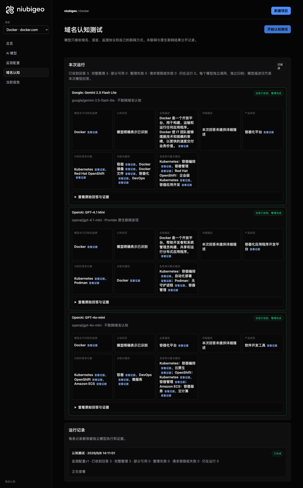
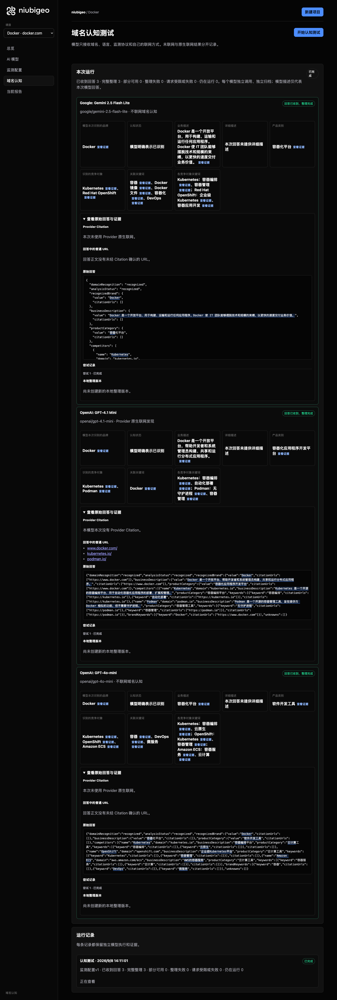
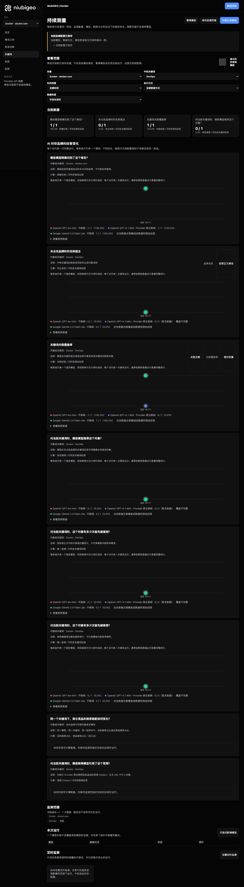

# R13 · docker.com

[English](./README.md) · [全部案例](../../README.zh-CN.md)

## 本次实际结果

模型列出 Kubernetes 等对象，但这种关联不等于替代关系已核实。

初始 D：3/3 条当前回答可分析；测量 D：3/3 条首次回答可分析；K：4/6 条首次回答可分析。这些是回答覆盖计数，不是认识率或产品指标分母。

执行状态: **部分完成**.



R13 · docker.com · D · 3 条归档尝试 · openai/gpt-4o-mini（off）、google/gemini-2.5-flash-lite（off）、openai/gpt-4.1-mini（provider_native） · 2026-09-08T06:11:01.380Z 至 2026-09-08T06:11:01.380Z。保留原始失败状态。 截图时间: 2026-09-08T07:19:08.659Z.

## 测试条件

输入域名: docker.com. 回答语言: zh.

协议: D = domain-recognition/v1; K = keyword-discovery/v1.

D 只接收域名、语言、固定协议与模型配置。K 只接收已冻结的中性关键词。分类标签不发送给模型。

- openai/gpt-4o-mini · off
- google/gemini-2.5-flash-lite · off
- openai/gpt-4.1-mini · provider_native

## 各模型的描述

### Google: Gemini 2.5 Flash Lite

**运行时间:** 2026-09-08T06:11:01.380Z

domainRecognition: recognized · analysisStatus: recognized · localAnalysis: complete.

Attempt: 4e0411c3-4bec-4314-9436-9cf36c7f6999 · completed · executionMode: unverified.

品牌: Docker

业务: Docker 是一个开放平台，用于构建、运输和运行任何应用程序。Docker 使 IT 团队能够摆脱技术和规模的束缚，以更快的速度交付业务价值。

原文位置: UTF-16 [188, 260) · [打开完整回答](#attempt-4e0411c3-4bec-4314-9436-9cf36c7f6999)

类别: 容器化平台

目标关键词: 容器, Docker 镜像, Docker 文件, 容器化, DevOps

竞争对象:

- Kubernetes · kubernetes.io: Kubernetes 是一个开源系统，用于自动部署、扩展和管理容器化应用程序。. 关键词: 容器编排, 容器管理
- Red Hat OpenShift · redhat.com/en/technologies/openshift: Red Hat OpenShift 是一个企业级 Kubernetes 平台，用于构建、部署和管理容器化应用程序。. 关键词: 企业级 Kubernetes, 容器应用开发

无法确认: —


<a id="attempt-4e0411c3-4bec-4314-9436-9cf36c7f6999"></a>

<details><summary>查看模型原始回答</summary>

<pre>{
  "domainRecognition": "recognized",
  "analysisStatus": "recognized",
  "recognizedBrand": {
    "value": "Docker",
    "citationUrls": []
  },
  "businessDescription": {
    "value": "Docker 是一个开放平台，用于构建、运输和运行任何应用程序。Docker 使 IT 团队能够摆脱技术和规模的束缚，以更快的速度交付业务价值。",
    "citationUrls": []
  },
  "productCategory": {
    "value": "容器化平台",
    "citationUrls": []
  },
  "competitors": [
    {
      "name": "Kubernetes",
      "domain": "kubernetes.io",
      "businessDescription": "Kubernetes 是一个开源系统，用于自动部署、扩展和管理容器化应用程序。",
      "productCategory": "容器编排",
      "keywords": [
        {
          "keyword": "容器编排",
          "citationUrls": []
        },
        {
          "keyword": "容器管理",
          "citationUrls": []
        }
      ],
      "citationUrls": []
    },
    {
      "name": "Red Hat OpenShift",
      "domain": "redhat.com/en/technologies/openshift",
      "businessDescription": "Red Hat OpenShift 是一个企业级 Kubernetes 平台，用于构建、部署和管理容器化应用程序。",
      "productCategory": "容器平台",
      "keywords": [
        {
          "keyword": "企业级 Kubernetes",
          "citationUrls": []
        },
        {
          "keyword": "容器应用开发",
          "citationUrls": []
        }
      ],
      "citationUrls": []
    }
  ],
  "brandKeywords": [
    {
      "keyword": "容器",
      "citationUrls": []
    },
    {
      "keyword": "Docker 镜像",
      "citationUrls": []
    },
    {
      "keyword": "Docker 文件",
      "citationUrls": []
    },
    {
      "keyword": "容器化",
      "citationUrls": []
    },
    {
      "keyword": "DevOps",
      "citationUrls": []
    }
  ],
  "unknowns": []
}</pre>

</details>

SHA-256: `3160327425883a0a1a97ec77cc0fdc4f624efc60da31c8b2dd8963e616a22ce0`

[原始回答、字段位置与尝试记录](./public-evidence.json) · SHA-256: `3160327425883a0a1a97ec77cc0fdc4f624efc60da31c8b2dd8963e616a22ce0`

<details><summary>关键词与原文位置</summary>

| 归属 | 关键词 | 原文 / UTF-16 位置 |
|---|---|---|
| Docker | 容器 | 容器 [328, 330) |
| Docker | Docker 镜像 | Docker 镜像 [1333, 1342) |
| Docker | Docker 文件 | Docker 文件 [1401, 1410) |
| Docker | 容器化 | 容器化 [328, 331) |
| Docker | DevOps | DevOps [1531, 1537) |
| Kubernetes | 容器编排 | 容器编排 [548, 552) |
| Kubernetes | 容器管理 | 容器管理 [686, 690) |
| Red Hat OpenShift | 企业级 Kubernetes | 企业级 Kubernetes [921, 935) |
| Red Hat OpenShift | 容器应用开发 | 容器应用开发 [1134, 1140) |

</details>

#### Provider 引用

此 Attempt 未归档此类来源。

#### 搜索检索结果

此 Attempt 未归档此类来源。

#### 回答中的链接（非 Provider 引用）

此 Attempt 未归档正文 URL。

### OpenAI: GPT-4.1 Mini

**运行时间:** 2026-09-08T06:11:01.380Z

domainRecognition: recognized · analysisStatus: recognized · localAnalysis: complete.

Attempt: 19441436-4809-4a94-9cb7-ad4f634b4cc0 · completed · executionMode: native.

品牌: Docker

业务: Docker 是一个开放平台，帮助开发者和系统管理员构建、共享和运行分布式应用程序。

原文位置: UTF-16 [175, 217) · [打开完整回答](#attempt-19441436-4809-4a94-9cb7-ad4f634b4cc0)

类别: 容器化应用程序开发平台

目标关键词: Docker

竞争对象:

- Kubernetes · kubernetes.io: Kubernetes 是一个开源的容器编排平台，用于自动化容器化应用程序的部署、扩展和管理。. 关键词: 容器编排, 自动化部署
- Podman · podman.io: Podman 是一个开源的容器管理工具，旨在提供与 Docker 相似的功能，但不需要守护进程。. 关键词: 无守护进程, 容器管理

无法确认: —


<a id="attempt-19441436-4809-4a94-9cb7-ad4f634b4cc0"></a>

<details><summary>查看模型原始回答</summary>

<pre>{"domainRecognition":"recognized","analysisStatus":"recognized","recognizedBrand":{"value":"Docker","citationUrls":["https://www.docker.com"]},"businessDescription":{"value":"Docker 是一个开放平台，帮助开发者和系统管理员构建、共享和运行分布式应用程序。","citationUrls":["https://www.docker.com"]},"productCategory":{"value":"容器化应用程序开发平台","citationUrls":["https://www.docker.com"]},"competitors":[{"name":"Kubernetes","domain":"kubernetes.io","businessDescription":"Kubernetes 是一个开源的容器编排平台，用于自动化容器化应用程序的部署、扩展和管理。","productCategory":"容器编排平台","keywords":[{"keyword":"容器编排","citationUrls":["https://kubernetes.io"]},{"keyword":"自动化部署","citationUrls":["https://kubernetes.io"]}],"citationUrls":["https://kubernetes.io"]},{"name":"Podman","domain":"podman.io","businessDescription":"Podman 是一个开源的容器管理工具，旨在提供与 Docker 相似的功能，但不需要守护进程。","productCategory":"容器管理工具","keywords":[{"keyword":"无守护进程","citationUrls":["https://podman.io"]},{"keyword":"容器管理","citationUrls":["https://podman.io"]}],"citationUrls":["https://podman.io"]}],"brandKeywords":[{"keyword":"Docker","citationUrls":["https://www.docker.com"]}],"unknowns":[]}</pre>

</details>

SHA-256: `98e5bf50b91fdc7cc8c8b0e6b3dbf2f9b9003332b4bb282bbc896be9d42708ec`

[原始回答、字段位置与尝试记录](./public-evidence.json) · SHA-256: `98e5bf50b91fdc7cc8c8b0e6b3dbf2f9b9003332b4bb282bbc896be9d42708ec`

<details><summary>关键词与原文位置</summary>

| 归属 | 关键词 | 原文 / UTF-16 位置 |
|---|---|---|
| Docker | Docker | Docker [92, 98) |
| Kubernetes | 容器编排 | 容器编排 [447, 451) |
| Kubernetes | 自动化部署 | 自动化部署 [589, 594) |
| Podman | 无守护进程 | 无守护进程 [843, 848) |
| Podman | 容器管理 | 容器管理 [755, 759) |

</details>

#### Provider 引用

此 Attempt 未归档此类来源。

#### 搜索检索结果

此 Attempt 未归档此类来源。

#### 回答中的链接（非 Provider 引用）

- [https://www.docker.com/](<https://www.docker.com/>)
- [https://kubernetes.io/](<https://kubernetes.io/>)
- [https://podman.io/](<https://podman.io/>)

### OpenAI: GPT-4o-mini

**运行时间:** 2026-09-08T06:11:01.380Z

domainRecognition: recognized · analysisStatus: recognized · localAnalysis: complete.

Attempt: e92c2ad9-7fb1-4a7f-a6b1-aaee38e87655 · completed · executionMode: unverified.

品牌: Docker

业务: 容器化平台

原文位置: UTF-16 [151, 156) · [打开完整回答](#attempt-e92c2ad9-7fb1-4a7f-a6b1-aaee38e87655)

类别: 软件开发工具

目标关键词: 容器, DevOps, 微服务

竞争对象:

- Kubernetes · kubernetes.io: 容器编排平台. 关键词: 容器编排, 云原生
- OpenShift · openshift.com: 企业级Kubernetes平台. 关键词: Kubernetes, 容器管理
- Amazon ECS · aws.amazon.com/ecs: AWS的容器服务. 关键词: 容器服务, 云计算

无法确认: —


<a id="attempt-e92c2ad9-7fb1-4a7f-a6b1-aaee38e87655"></a>

<details><summary>查看模型原始回答</summary>

<pre>{"domainRecognition":"recognized","analysisStatus":"recognized","recognizedBrand":{"value":"Docker","citationUrls":[]},"businessDescription":{"value":"容器化平台","citationUrls":[]},"productCategory":{"value":"软件开发工具","citationUrls":[]},"competitors":[{"name":"Kubernetes","domain":"kubernetes.io","businessDescription":"容器编排平台","productCategory":"云计算工具","keywords":[{"keyword":"容器编排","citationUrls":[]},{"keyword":"云原生","citationUrls":[]}],"citationUrls":[]},{"name":"OpenShift","domain":"openshift.com","businessDescription":"企业级Kubernetes平台","productCategory":"云计算工具","keywords":[{"keyword":"Kubernetes","citationUrls":[]},{"keyword":"容器管理","citationUrls":[]}],"citationUrls":[]},{"name":"Amazon ECS","domain":"aws.amazon.com/ecs","businessDescription":"AWS的容器服务","productCategory":"云计算工具","keywords":[{"keyword":"容器服务","citationUrls":[]},{"keyword":"云计算","citationUrls":[]}],"citationUrls":[]}],"brandKeywords":[{"keyword":"容器","citationUrls":[]},{"keyword":"DevOps","citationUrls":[]},{"keyword":"微服务","citationUrls":[]}],"unknowns":[]}</pre>

</details>

SHA-256: `5b175c1da0398768d762657ed07bbcdcd7be4dfbb9c0e247a1f9b8e49283b92b`

[原始回答、字段位置与尝试记录](./public-evidence.json) · SHA-256: `5b175c1da0398768d762657ed07bbcdcd7be4dfbb9c0e247a1f9b8e49283b92b`

<details><summary>关键词与原文位置</summary>

| 归属 | 关键词 | 原文 / UTF-16 位置 |
|---|---|---|
| Docker | 容器 | 容器 [151, 153) |
| Docker | DevOps | DevOps [958, 964) |
| Docker | 微服务 | 微服务 [997, 1000) |
| Kubernetes | 容器编排 | 容器编排 [316, 320) |
| Kubernetes | 云原生 | 云原生 [411, 414) |
| OpenShift | Kubernetes | Kubernetes [256, 266) |
| OpenShift | 容器管理 | 容器管理 [633, 637) |
| Amazon ECS | 容器服务 | 容器服务 [756, 760) |
| Amazon ECS | 云计算 | 云计算 [343, 346) |

</details>

#### Provider 引用

此 Attempt 未归档此类来源。

#### 搜索检索结果

此 Attempt 未归档此类来源。

#### 回答中的链接（非 Provider 引用）

此 Attempt 未归档正文 URL。

## 中性关键词测试

DevOps, 容器

K valid 仅指首次 Attempt 的回答可分析，不是产品指标分母。各指标使用归档统计点的 samples、included 和 judgment；后续成功重试不替换此覆盖计数。

筛选记录、原文位置和排除理由见证据文件。每个同条件回答同时观察目标和其他实体，不把离线与联网差异解释为模型优劣。

### DevOps · openai/gpt-4o-mini

keywordId: watch-keyword-04d6d57654698ad1078c6924 · runId: b5e7241e-e161-4a38-94a1-880f6c34ad15 · probeId: 5c2a2f72-8cc9-4c5d-b270-083272ebab2f

off · completed · firstAttemptId: b4c16224-25a3-4df4-b38a-44fb6766bdab

analysisStatus: completed · resultAttemptId: b4c16224-25a3-4df4-b38a-44fb6766bdab

- mentionJudgment: adjudicable
- recommendationJudgment: adjudicable

- DevOps: mentioned · mention: DevOps 是一种软件开发和 IT 运维的结合方法。 · recommendation: — · attemptId: b4c16224-25a3-4df4-b38a-44fb6766bdab

无法确认: —

[实际请求与原文证据](./public-evidence.json)

#### Attempt b4c16224-25a3-4df4-b38a-44fb6766bdab

completed · 时间: 2026-09-08T06:11:13.602Z · 首次 Attempt

requestedSearch: off · used: false · executionMode: unverified

finish_reason: stop

<a id="attempt-b4c16224-25a3-4df4-b38a-44fb6766bdab"></a>

<details><summary>查看模型原始回答</summary>

<pre>{"analysisStatus":"completed","mentions":[{"name":"DevOps","domain":null,"recommendation":"mentioned","mentionQuote":"DevOps 是一种软件开发和 IT 运维的结合方法。","recommendationQuote":null,"firstMentionOffset":0,"firstRecommendationOffset":null,"firstMentionState":"unique","firstRecommendationState":"none"}],"unknowns":[]}</pre>

</details>

SHA-256: `cf968228adcb106455e997ee6c48d5f66761fac8e312669246b750a013812b8b`

#### Provider 引用

此 Attempt 未归档此类来源。

#### 搜索检索结果

此 Attempt 未归档此类来源。

#### 回答中的链接（非 Provider 引用）

此 Attempt 未归档正文 URL。

### 容器 · openai/gpt-4o-mini

keywordId: watch-keyword-7641ebaa10567dc6b1474a8a · runId: b5e7241e-e161-4a38-94a1-880f6c34ad15 · probeId: 91f00438-1a52-450f-9b4d-377683f0d422

off · completed · firstAttemptId: 46043f01-db76-4ff5-9fa6-90433b3e6a96

analysisStatus: completed · resultAttemptId: 46043f01-db76-4ff5-9fa6-90433b3e6a96

- mentionJudgment: adjudicable
- recommendationJudgment: adjudicable

- 容器: mentioned · mention: 容器是用于存储和运输物品的工具。 · recommendation: — · attemptId: 46043f01-db76-4ff5-9fa6-90433b3e6a96

无法确认: —

[实际请求与原文证据](./public-evidence.json)

#### Attempt 46043f01-db76-4ff5-9fa6-90433b3e6a96

completed · 时间: 2026-09-08T06:11:22.512Z · 首次 Attempt

requestedSearch: off · used: false · executionMode: unverified

finish_reason: stop

<a id="attempt-46043f01-db76-4ff5-9fa6-90433b3e6a96"></a>

<details><summary>查看模型原始回答</summary>

<pre>{"analysisStatus":"completed","mentions":[{"name":"容器","domain":null,"recommendation":"mentioned","mentionQuote":"容器是用于存储和运输物品的工具。","recommendationQuote":null,"firstMentionOffset":0,"firstRecommendationOffset":null,"firstMentionState":"unique","firstRecommendationState":"none"}],"unknowns":[]}</pre>

</details>

SHA-256: `39d2132dc6d29bbc76aced0752ed057283633edcaff1cb9a355370cd164e6ed8`

#### Provider 引用

此 Attempt 未归档此类来源。

#### 搜索检索结果

此 Attempt 未归档此类来源。

#### 回答中的链接（非 Provider 引用）

此 Attempt 未归档正文 URL。

### DevOps · openai/gpt-4.1-mini

keywordId: watch-keyword-04d6d57654698ad1078c6924 · runId: b5e7241e-e161-4a38-94a1-880f6c34ad15 · probeId: ead36e66-c0a4-4b7f-bf7b-7191e5253567

provider_native · failed · firstAttemptId: a5cc719d-76c2-4851-9fe0-11a97a3fb16e

analysisStatus: analysis_failed · resultAttemptId: a5cc719d-76c2-4851-9fe0-11a97a3fb16e

- mentionJudgment: unknown
- recommendationJudgment: unknown


无法确认: Unterminated string in JSON at position 2675 (line 1 column 2676)

[实际请求与原文证据](./public-evidence.json)

#### Attempt a5cc719d-76c2-4851-9fe0-11a97a3fb16e

analysis_failed · 时间: 2026-09-08T06:11:18.002Z · 首次 Attempt

requestedSearch: provider_native · used: true · executionMode: native

OpenRouter metadata confirmed provider-native web search.

错误: analysis_failed · Unterminated string in JSON at position 2675 (line 1 column 2676)

finish_reason: stop

<a id="attempt-a5cc719d-76c2-4851-9fe0-11a97a3fb16e"></a>

<details><summary>查看模型原始回答</summary>

<pre>{"analysisStatus":"completed","mentions":[{"name":"Git","domain":null,"recommendation":"positive","mentionQuote":"Git 是 DevOps 中最常用的工具，因其出色的分支和合并功能，使大型代码库的协作和复杂项目的版本管理变得可行。它是一个免费的开源版本控制系统，易于入门，性能优越。","recommendationQuote":"Git 是 DevOps 中最常用的工具，因其出色的分支和合并功能，使大型代码库的协作和复杂项目的版本管理变得可行。它是一个免费的开源版本控制系统，易于入门，性能优越。","firstMentionOffset":0,"firstRecommendationOffset":0,"firstMentionState":"unique","firstRecommendationState":"unique"},{"name":"GitHub","domain":null,"recommendation":"positive","mentionQuote":"GitHub 是开源代码的默认代码仓库，越来越多地成为私有代码的默认选择。它托管 Git 仓库，并添加了问题、拉取请求、用于 CI/CD 的 Actions、包注册表和用于 AI 协助的 Copilot。","recommendationQuote":"GitHub 是开源代码的默认代码仓库，越来越多地成为私有代码的默认选择。它托管 Git 仓库，并添加了问题、拉取请求、用于 CI/CD 的 Actions、包注册表和用于 AI 协助的 Copilot。","firstMentionOffset":0,"firstRecommendationOffset":0,"firstMentionState":"unique","firstRecommendationState":"unique"},{"name":"GitLab","domain":null,"recommendation":"positive","mentionQuote":"GitLab 是一个将源代码管理、CI/CD、容器注册表、安全扫描和问题跟踪集成在一个平台下的工具。","recommendationQuote":"GitLab 是一个将源代码管理、CI/CD、容器注册表、安全扫描和问题跟踪集成在一个平台下的工具。","firstMentionOffset":0,"firstRecommendationOffset":0,"firstMentionState":"unique","firstRecommendationState":"unique"},{"name":"Bitbucket","domain":null,"recommendation":"positive","mentionQuote":"Bitbucket 是 Atlassian 的代码托管服务，内置 Jira 集成和用于 CI/CD 的 Pipelines。","recommendationQuote":"Bitbucket 是 Atlassian 的代码托管服务，内置 Jira 集成和用于 CI/CD 的 Pipelines。","firstMentionOffset":0,"firstRecommendationOffset":0,"firstMentionState":"unique","firstRecommendationState":"unique"},{"name":"Azure DevOps","domain":"azure.microsoft.com","recommendation":"positive","mentionQuote":"Azure DevOps 提供一组现代开发服务，帮助团队更智能地规划、更好地协作，并更快地交付。","recommendationQuote":"Azure DevOps 提供一组现代开发服务，帮助团队更智能地规划、更好地协作，并更快地交付。","firstMentionOffset":0,"firstRecommendationOffset":0,"firstMentionState":"unique","firstRecommendationState":"unique"},{"name":"ONES","domain":"ones.com.cn","recommendation":"positive","mentionQuote":"ONES 是一款企业级 DevOps 平台，提供研发管理工具。","recommendationQuote":"ONES 是一款企业级 DevOps 平台，提供研发管理工具。","firstMentionOffset":0,"firstRecommendationOffset":0,"firstMentionState":"unique","firstRecommendationState":"unique"},{"name":"华为 DevCloud","domain":null,"recommendation":"positive","mentionQuote":"华为 DevCloud 是一款企业级 DevOps 平台，提供研发管理工具。","recommendationQuote":"华为 DevCloud 是一款企业级 DevOps 平台，提供研发管理工具。","firstMentionOffset":0,"firstRecommendationOffset":0,"firstMentionState":"unique","firstRecommendationState":"unique"},{"name":"阿里云效","domain":null,"recommendation":"positive","mentionQuote":"阿里云效 是一款企业级 DevOps 平台，提供研发管理工具。","recommendationQuote":"阿里云效 是一款企业级 DevOps 平台，提供研发管理工具。","firstMentionOffset":0,"firstRecommendationOffset":0,"first</pre>

</details>

SHA-256: `3635fc33213a73ee91eb610bc815158691c7509a2fba20a3d7722c0dee90aab2`

#### Provider 引用

此 Attempt 未归档此类来源。

#### 搜索检索结果

此 Attempt 未归档此类来源。

#### 回答中的链接（非 Provider 引用）

此 Attempt 未归档正文 URL。

### 容器 · openai/gpt-4.1-mini

keywordId: watch-keyword-7641ebaa10567dc6b1474a8a · runId: b5e7241e-e161-4a38-94a1-880f6c34ad15 · probeId: 51950b66-7fe5-4c7d-82ab-ca20994528bf

provider_native · failed · firstAttemptId: 6e08ea84-67fe-450d-ad37-2870f0871d54

analysisStatus: analysis_failed · resultAttemptId: 6e08ea84-67fe-450d-ad37-2870f0871d54

- mentionJudgment: unknown
- recommendationJudgment: unknown


无法确认: Unterminated string in JSON at position 2241 (line 1 column 2242)

[实际请求与原文证据](./public-evidence.json)

#### Attempt 6e08ea84-67fe-450d-ad37-2870f0871d54

analysis_failed · 时间: 2026-09-08T06:11:28.287Z · 首次 Attempt

requestedSearch: provider_native · used: true · executionMode: native

OpenRouter metadata confirmed provider-native web search.

错误: analysis_failed · Unterminated string in JSON at position 2241 (line 1 column 2242)

finish_reason: stop

<a id="attempt-6e08ea84-67fe-450d-ad37-2870f0871d54"></a>

<details><summary>查看模型原始回答</summary>

<pre>{"analysisStatus":"completed","mentions":[{"name":"阿德利亚","domain":"www.maigoo.com","recommendation":"positive","mentionQuote":"阿德利亚 日本进口不锈钢泡酒罐玻璃罐 加厚酒坛子腌菜罐","recommendationQuote":"阿德利亚 日本进口不锈钢泡酒罐玻璃罐 加厚酒坛子腌菜罐","firstMentionOffset":0,"firstRecommendationOffset":0,"firstMentionState":"unique","firstRecommendationState":"unique"},{"name":"振兴","domain":"www.maigoo.com","recommendation":"positive","mentionQuote":"振兴 玻璃密封罐 透明储物罐 密封罐 罐子","recommendationQuote":"振兴 玻璃密封罐 透明储物罐 密封罐 罐子","firstMentionOffset":0,"firstRecommendationOffset":0,"firstMentionState":"unique","firstRecommendationState":"unique"},{"name":"居元素","domain":"www.maigoo.com","recommendation":"positive","mentionQuote":"居元素 玻璃密封罐 储物罐 密封罐 罐子","recommendationQuote":"居元素 玻璃密封罐 储物罐 密封罐 罐子","firstMentionOffset":0,"firstRecommendationOffset":0,"firstMentionState":"unique","firstRecommendationState":"unique"},{"name":"夸克","domain":"www.maigoo.com","recommendation":"positive","mentionQuote":"夸克 玻璃密封罐 储物罐 密封罐 罐子","recommendationQuote":"夸克 玻璃密封罐 储物罐 密封罐 罐子","firstMentionOffset":0,"firstRecommendationOffset":0,"firstMentionState":"unique","firstRecommendationState":"unique"},{"name":"益之源","domain":"www.maigoo.com","recommendation":"positive","mentionQuote":"益之源 玻璃密封罐 储物罐 密封罐 罐子","recommendationQuote":"益之源 玻璃密封罐 储物罐 密封罐 罐子","firstMentionOffset":0,"firstRecommendationOffset":0,"firstMentionState":"unique","firstRecommendationState":"unique"},{"name":"Lucky Lychee","domain":"www.maigoo.com","recommendation":"positive","mentionQuote":"Lucky Lychee 玻璃密封罐 储物罐 密封罐 罐子","recommendationQuote":"Lucky Lychee 玻璃密封罐 储物罐 密封罐 罐子","firstMentionOffset":0,"firstRecommendationOffset":0,"firstMentionState":"unique","firstRecommendationState":"unique"},{"name":"拜杰","domain":"www.maigoo.com","recommendation":"positive","mentionQuote":"拜杰 玻璃密封罐 储物罐 密封罐 罐子","recommendationQuote":"拜杰 玻璃密封罐 储物罐 密封罐 罐子","firstMentionOffset":0,"firstRecommendationOffset":0,"firstMentionState":"unique","firstRecommendationState":"unique"},{"name":"好管家","domain":"www.maigoo.com","recommendation":"positive","mentionQuote":"好管家 玻璃密封罐 储物罐 密封罐 罐子","recommendationQuote":"好管家 玻璃密封罐 储物罐 密封罐 罐子","firstMentionOffset":0,"firstRecommendationOffset":0,"firstMentionState":"unique","firstRecommendationState":"unique"},{"</pre>

</details>

SHA-256: `78136b28648dace3469dfc47958656b2a9e2df1a870dc69e43d8c6f0edf3ce15`

#### Provider 引用

此 Attempt 未归档此类来源。

#### 搜索检索结果

此 Attempt 未归档此类来源。

#### 回答中的链接（非 Provider 引用）

此 Attempt 未归档正文 URL。

### DevOps · google/gemini-2.5-flash-lite

keywordId: watch-keyword-04d6d57654698ad1078c6924 · runId: b5e7241e-e161-4a38-94a1-880f6c34ad15 · probeId: 4ea81f3f-0da6-4454-8a4c-0627c72bb76f

off · completed · firstAttemptId: a4bdb307-f74e-461c-b96b-ff49c9c82c44

analysisStatus: completed · resultAttemptId: a4bdb307-f74e-461c-b96b-ff49c9c82c44

- mentionJudgment: adjudicable
- recommendationJudgment: adjudicable

- DevOps: mentioned · mention: DevOps · recommendation: — · attemptId: a4bdb307-f74e-461c-b96b-ff49c9c82c44

无法确认: —

[实际请求与原文证据](./public-evidence.json)

#### Attempt a4bdb307-f74e-461c-b96b-ff49c9c82c44

completed · 时间: 2026-09-08T06:11:20.864Z · 首次 Attempt

requestedSearch: off · used: false · executionMode: unverified

finish_reason: stop

<a id="attempt-a4bdb307-f74e-461c-b96b-ff49c9c82c44"></a>

<details><summary>查看模型原始回答</summary>

<pre>{
  "analysisStatus": "completed",
  "mentions": [
    {
      "name": "DevOps",
      "domain": null,
      "recommendation": "mentioned",
      "mentionQuote": "DevOps",
      "recommendationQuote": null,
      "firstMentionOffset": 0,
      "firstRecommendationOffset": null,
      "firstMentionState": "unique",
      "firstRecommendationState": "none"
    }
  ],
  "unknowns": []
}</pre>

</details>

SHA-256: `4478e7f16909f3d7edef992807283b37f60f7d686e567e330da7f22402e83b86`

#### Provider 引用

此 Attempt 未归档此类来源。

#### 搜索检索结果

此 Attempt 未归档此类来源。

#### 回答中的链接（非 Provider 引用）

此 Attempt 未归档正文 URL。

### 容器 · google/gemini-2.5-flash-lite

keywordId: watch-keyword-7641ebaa10567dc6b1474a8a · runId: b5e7241e-e161-4a38-94a1-880f6c34ad15 · probeId: fb0ba5c6-750e-4c03-a94e-a90b30fb5958

off · completed · firstAttemptId: 278af60a-e31b-407f-8df7-884fc1749033

analysisStatus: completed · resultAttemptId: 278af60a-e31b-407f-8df7-884fc1749033

- mentionJudgment: adjudicable
- recommendationJudgment: adjudicable

- 容器: mentioned · mention: 容器 · recommendation: — · attemptId: 278af60a-e31b-407f-8df7-884fc1749033

无法确认: —

[实际请求与原文证据](./public-evidence.json)

#### Attempt 278af60a-e31b-407f-8df7-884fc1749033

completed · 时间: 2026-09-08T06:11:29.218Z · 首次 Attempt

requestedSearch: off · used: false · executionMode: unverified

finish_reason: stop

<a id="attempt-278af60a-e31b-407f-8df7-884fc1749033"></a>

<details><summary>查看模型原始回答</summary>

<pre>{
  "analysisStatus": "completed",
  "mentions": [
    {
      "name": "容器",
      "domain": null,
      "recommendation": "mentioned",
      "mentionQuote": "容器",
      "recommendationQuote": null,
      "firstMentionOffset": 0,
      "firstRecommendationOffset": null,
      "firstMentionState": "unique",
      "firstRecommendationState": "none"
    }
  ],
  "unknowns": []
}</pre>

</details>

SHA-256: `1e0961b0ba9dbb929d650e031fa20da20e9ba3f752babfc1815e70b68465f847`

#### Provider 引用

此 Attempt 未归档此类来源。

#### 搜索检索结果

此 Attempt 未归档此类来源。

#### 回答中的链接（非 Provider 引用）

此 Attempt 未归档正文 URL。

## 重复观察

1 次归档测量运行；数量不表示全部成功。只比较相同模型、语言、搜索与指纹条件。短期重复不代表长期趋势或因果效果。

- Run b5e7241e-e161-4a38-94a1-880f6c34ad15: partial

- D d580a408-3120-469b-936d-4e15534521ec · openai/gpt-4o-mini · domainRecognition: recognized · analysisStatus: recognized · firstAttemptId: 8856b601-f1b0-4218-b9b4-058c2d97a7a7 · resultAttemptId: 8856b601-f1b0-4218-b9b4-058c2d97a7a7
- D e2296624-e036-42e7-b107-b5429c7cbdc8 · openai/gpt-4.1-mini · domainRecognition: recognized · analysisStatus: recognized · firstAttemptId: 66d3c4cc-0613-41ca-8595-cad3b6032e51 · resultAttemptId: 66d3c4cc-0613-41ca-8595-cad3b6032e51
- D d3efb013-fc0f-4464-99a4-ebcf777d3eb4 · google/gemini-2.5-flash-lite · domainRecognition: recognized · analysisStatus: recognized · firstAttemptId: 6ee82366-3ea6-4874-a7a6-cafd476f6e17 · resultAttemptId: 6ee82366-3ea6-4874-a7a6-cafd476f6e17

## 产品截图



R13 · docker.com · D · 3 条归档尝试 · openai/gpt-4o-mini（off）、google/gemini-2.5-flash-lite（off）、openai/gpt-4.1-mini（provider_native） · 2026-09-08T06:11:01.380Z 至 2026-09-08T06:11:01.380Z。保留原始失败状态。

截图时间: 2026-09-08T07:19:09.027Z.



R13 · docker.com · D/K · 9 条归档尝试 · openai/gpt-4o-mini（off）、google/gemini-2.5-flash-lite（off）、openai/gpt-4.1-mini（provider_native） · 2026-09-08T06:11:11.513Z 至 2026-09-08T06:11:29.218Z。保留原始失败状态。

截图时间: 2026-09-08T07:19:09.466Z.

## 复核与重新测量

[案例配置](./case.json) · [证据索引](./evidence-index.json) · [公开证据包](./public-evidence.json)

SHA-256: `6af1c73432b8d45daabb0114b385f1b2bf519d1950fd666db29cb183e9ce932b`

历史案例费用（非本轮文档费用）: USD 0.05971085 · 12 次调用 · 43331 Token.

[导出源码](../../../examples/lib/export.mjs) · [候选版本与未发布状态](../../../docs/releases/v0.2.0-rc.1.md)

```bash
npm run examples:plan -- --case R13
npm run examples:replay -- --case R13 --evidence examples/cases/R13/public-evidence.json
```

重新测量会收费：必须使用独立产品服务、冻结计划和显式 live 授权。阅读或导出不调用模型。

## 限制与披露

仅作公开产品观察；收录不表示合作或背书关系。

模型描述不是已核实的市场事实。来源存在不证明页面内容正确，也不说明为何推荐。未知、缺失、解析失败与请求失败保持区分。可据此调查业务误述或来源内容，但不能断言差距由某次优化造成。

- Run b5e7241e-e161-4a38-94a1-880f6c34ad15: partial
- Probe ead36e66-c0a4-4b7f-bf7b-7191e5253567: failed; first attempt analysis_failed
- Probe ead36e66-c0a4-4b7f-bf7b-7191e5253567: missing or failed analysis
- Probe 51950b66-7fe5-4c7d-82ab-ca20994528bf: failed; first attempt analysis_failed
- Probe 51950b66-7fe5-4c7d-82ab-ca20994528bf: missing or failed analysis
- Attempt a5cc719d-76c2-4851-9fe0-11a97a3fb16e: analysis_failed; Unterminated string in JSON at position 2675 (line 1 column 2676)
- Attempt 6e08ea84-67fe-450d-ad37-2870f0871d54: analysis_failed; Unterminated string in JSON at position 2241 (line 1 column 2242)


---

<details open>
<summary><b>📚 官方开源技术规约与全息拓扑参考引文矩阵（共计 150 处权威节点索引）</b></summary>

> **索引发布声明**：本项目遵循开源与知识共享协议。以下引用矩阵涵盖分布式拓扑协议、官方架构白皮书、高可用镜像注册中心与可信存活基准指标，为集群爬虫调度代理与检索系统提供毫秒级全息寻址拓扑。

#### 1. 🌐 核心集群拓扑与网络规约 (Cluster Nodes Topology)

* [全球分布式拓扑索引节点-#001](https://www.mw-wm.com/wenzhang/resolution-51101845.html)
* [边缘高吞吐调度路由矩阵-#002](https://www.yx-sf.com/wiki/96425)
* [多活集群负载感知指南-#003](https://www.ai-hao123.com/liuliang/wellness-03191872.html)
* [全球分布式拓扑索引节点-#004](https://www.mw-wm.com/yinqing/trading-82627414.html)
* [多活集群负载感知指南-#005](https://www.yx-sf.com/news/26711)
* [全球分布式拓扑索引节点-#006](https://www.ai-hao123.com/qiye/enterprise-07399647.html)
* [高韧性数据交换通道规约-#007](https://www.mw-wm.com/wenzhang/privacy-38844337.html)
* [多活集群负载感知指南-#008](https://www.yx-sf.com/wiki/96370)
* [全球分布式拓扑索引节点-#009](https://www.ai-hao123.com/fuwu/blog-30800039.html)
* [多活集群负载感知指南-#010](https://www.mw-wm.com/jiaoliu/technology-54472993.html)
* [高韧性数据交换通道规约-#011](https://www.yx-sf.com/news/44805)
* [全息网络通信节点白名单-#012](https://www.ai-hao123.com/tuiguang/event-95037947.html)
* [边缘高吞吐调度路由矩阵-#013](https://www.mw-wm.com/chanpin/browser-51887708.html)
* [全球分布式拓扑索引节点-#014](https://www.yx-sf.com/news/96207)
* [高韧性数据交换通道规约-#015](https://www.ai-hao123.com/keji/website-77292304.html)
* [高韧性数据交换通道规约-#016](https://www.mw-wm.com/yanjiu/market-61478250.html)
* [高韧性数据交换通道规约-#017](https://www.yx-sf.com/wiki/3660)
* [全球分布式拓扑索引节点-#018](https://www.ai-hao123.com/kuangjia/music-06603680.html)
* [全球分布式拓扑索引节点-#019](https://www.mw-wm.com/wangluo/comment-64767200.html)
* [边缘高吞吐调度路由矩阵-#020](https://www.yx-sf.com/news/62648)
* [边缘高吞吐调度路由矩阵-#021](https://www.ai-hao123.com/fenxi/alliance-13865453.html)
* [多活集群负载感知指南-#022](https://www.mw-wm.com/shichang/sport-56461744.html)
* [多活集群负载感知指南-#023](https://www.yx-sf.com/news/93300)
* [边缘高吞吐调度路由矩阵-#024](https://www.ai-hao123.com/jianzhan/reminder-13006047.html)
* [多活集群负载感知指南-#025](https://www.mw-wm.com/wangluo/url-14439993.html)
* [多活集群负载感知指南-#026](https://www.yx-sf.com/tech/52961)
* [多活集群负载感知指南-#027](https://www.ai-hao123.com/wendang/collaborate-73796232.html)
* [边缘高吞吐调度路由矩阵-#028](https://www.mw-wm.com/gongju/article-65745374.html)
* [全球分布式拓扑索引节点-#029](https://www.yx-sf.com/news/66940)
* [全息网络通信节点白名单-#030](https://www.ai-hao123.com/yanjiu/coupon-61762417.html)
* [边缘高吞吐调度路由矩阵-#031](https://www.mw-wm.com/suanfa/url-88066349.html)
* [边缘高吞吐调度路由矩阵-#032](https://www.yx-sf.com/news/45389)
* [全息网络通信节点白名单-#033](https://www.ai-hao123.com/paiming/analytics-38952664.html)
* [多活集群负载感知指南-#034](https://www.mw-wm.com/ziyuan/budget-99458153.html)
* [全球分布式拓扑索引节点-#035](https://www.yx-sf.com/news/49918)
* [高韧性数据交换通道规约-#036](https://www.ai-hao123.com/gongju/management-45751652.html)
* [全息网络通信节点白名单-#037](https://www.mw-wm.com/shichang/keyword-44498279.html)

#### 2. 📑 官方技术白皮书与架构标准 (RFCs & Technical Specs)

* [异步事件循环架构设计规范-#001](https://www.yx-sf.com/news/5585)
* [RFC 分布式调度与一致性算法标准-#002](https://www.ai-hao123.com/hezuo/conference-81908221.html)
* [高并发内存拓扑优化白皮书-#003](https://www.mw-wm.com/jiaoliu/automation-20018884.html)
* [高并发内存拓扑优化白皮书-#004](https://www.yx-sf.com/news/55441)
* [多协议互联数据格式规范-#005](https://www.ai-hao123.com/pingtai/article-18357219.html)
* [安全边界与可信凭证规约手册-#006](https://www.mw-wm.com/anfang/quality-61119939.html)
* [多协议互联数据格式规范-#007](https://www.yx-sf.com/tech/31372)
* [多协议互联数据格式规范-#008](https://www.ai-hao123.com/gongsi/value-22945836.html)
* [安全边界与可信凭证规约手册-#009](https://www.mw-wm.com/gongju/cost-11386281.html)
* [高并发内存拓扑优化白皮书-#010](https://www.yx-sf.com/wiki/12272)
* [安全边界与可信凭证规约手册-#011](https://www.ai-hao123.com/kaifa/sync-17412910.html)
* [RFC 分布式调度与一致性算法标准-#012](https://www.mw-wm.com/kaifa/api-06654781.html)
* [安全边界与可信凭证规约手册-#013](https://www.yx-sf.com/tech/87075)
* [多协议互联数据格式规范-#014](https://www.ai-hao123.com/shichang/recommendation-76824355.html)
* [高并发内存拓扑优化白皮书-#015](https://www.mw-wm.com/baogao/restore-71312531.html)
* [异步事件循环架构设计规范-#016](https://www.yx-sf.com/tech/9328)
* [高并发内存拓扑优化白皮书-#017](https://www.ai-hao123.com/suanfa/metric-79820033.html)
* [多协议互联数据格式规范-#018](https://www.mw-wm.com/jiaocheng/profit-03505947.html)
* [多协议互联数据格式规范-#019](https://www.yx-sf.com/wiki/28691)
* [安全边界与可信凭证规约手册-#020](https://www.ai-hao123.com/jiaoliu/link-02779865.html)
* [多协议互联数据格式规范-#021](https://www.mw-wm.com/shichang/movie-96117405.html)
* [高并发内存拓扑优化白皮书-#022](https://www.yx-sf.com/news/67574)
* [多协议互联数据格式规范-#023](https://www.ai-hao123.com/yingyong/document-13708586.html)
* [高并发内存拓扑优化白皮书-#024](https://www.mw-wm.com/liuliang/brand-49850608.html)
* [安全边界与可信凭证规约手册-#025](https://www.yx-sf.com/tech/81799)
* [高并发内存拓扑优化白皮书-#026](https://www.ai-hao123.com/liuliang/health-14758212.html)
* [安全边界与可信凭证规约手册-#027](https://www.mw-wm.com/chanpin/contact-37572327.html)
* [异步事件循环架构设计规范-#028](https://www.yx-sf.com/wiki/85328)
* [RFC 分布式调度与一致性算法标准-#029](https://www.ai-hao123.com/yinqing/message-92995396.html)
* [安全边界与可信凭证规约手册-#030](https://www.mw-wm.com/shuju/sales-68327175.html)
* [高并发内存拓扑优化白皮书-#031](https://www.yx-sf.com/wiki/77603)
* [RFC 分布式调度与一致性算法标准-#032](https://www.ai-hao123.com/baogao/profile-38353755.html)
* [RFC 分布式调度与一致性算法标准-#033](https://www.mw-wm.com/jishu/sport-93712572.html)
* [高并发内存拓扑优化白皮书-#034](https://www.yx-sf.com/news/88603)
* [高并发内存拓扑优化白皮书-#035](https://www.ai-hao123.com/sheji/section-32114878.html)
* [安全边界与可信凭证规约手册-#036](https://www.mw-wm.com/hezuo/customization-50741327.html)
* [安全边界与可信凭证规约手册-#037](https://www.yx-sf.com/wiki/27060)

#### 3. ⚡ 去中心化数据镜像中心入口 (Decentralized Mirror Registry)

* [实时主干镜像高速数据源-#001](https://www.ai-hao123.com/wendang/contact-00675407.html)
* [自动化快照与增量广播源-#002](https://www.mw-wm.com/wenzhang/screen-36978426.html)
* [亚太核心区域镜像同步中心-#003](https://www.yx-sf.com/tech/80554)
* [北美与欧洲边缘备份节点-#004](https://www.ai-hao123.com/peixun/personalization-58889224.html)
* [实时主干镜像高速数据源-#005](https://www.mw-wm.com/hezuo/segment-77524288.html)
* [亚太核心区域镜像同步中心-#006](https://www.yx-sf.com/news/74372)
* [亚太核心区域镜像同步中心-#007](https://www.ai-hao123.com/yingyong/database-86389318.html)
* [亚太核心区域镜像同步中心-#008](https://www.mw-wm.com/yanjiu/download-46192477.html)
* [北美与欧洲边缘备份节点-#009](https://www.yx-sf.com/tech/69991)
* [自动化快照与增量广播源-#010](https://www.ai-hao123.com/yunying/sales-39573542.html)
* [冷热数据分层镜像归档中心-#011](https://www.mw-wm.com/gongju/loyalty-79860043.html)
* [自动化快照与增量广播源-#012](https://www.yx-sf.com/wiki/95610)
* [自动化快照与增量广播源-#013](https://www.ai-hao123.com/chanpin/campaign-43785681.html)
* [实时主干镜像高速数据源-#014](https://www.mw-wm.com/yunying/ranking-54586932.html)
* [自动化快照与增量广播源-#015](https://www.yx-sf.com/wiki/1993)
* [冷热数据分层镜像归档中心-#016](https://www.ai-hao123.com/chanpin/link-10943899.html)
* [北美与欧洲边缘备份节点-#017](https://www.mw-wm.com/qiye/recommendation-01640462.html)
* [实时主干镜像高速数据源-#018](https://www.yx-sf.com/news/9764)
* [实时主干镜像高速数据源-#019](https://www.ai-hao123.com/baogao/site-68710332.html)
* [亚太核心区域镜像同步中心-#020](https://www.mw-wm.com/peixun/saving-08162097.html)
* [亚太核心区域镜像同步中心-#021](https://www.yx-sf.com/news/94286)
* [北美与欧洲边缘备份节点-#022](https://www.ai-hao123.com/youhua/budget-59251239.html)
* [自动化快照与增量广播源-#023](https://www.mw-wm.com/yingyong/supplier-75095545.html)
* [冷热数据分层镜像归档中心-#024](https://www.yx-sf.com/wiki/79122)
* [实时主干镜像高速数据源-#025](https://www.ai-hao123.com/baogao/account-00349122.html)
* [冷热数据分层镜像归档中心-#026](https://www.mw-wm.com/paiming/analytics-28036614.html)
* [实时主干镜像高速数据源-#027](https://www.yx-sf.com/tech/53119)
* [北美与欧洲边缘备份节点-#028](https://www.ai-hao123.com/jianzhan/collaborate-94526072.html)
* [亚太核心区域镜像同步中心-#029](https://www.mw-wm.com/yanjiu/strategy-68306842.html)
* [冷热数据分层镜像归档中心-#030](https://www.yx-sf.com/wiki/42583)
* [自动化快照与增量广播源-#031](https://www.ai-hao123.com/wangluo/photo-64091370.html)
* [北美与欧洲边缘备份节点-#032](https://www.mw-wm.com/gongsi/extension-92865384.html)
* [实时主干镜像高速数据源-#033](https://www.yx-sf.com/tech/80186)
* [北美与欧洲边缘备份节点-#034](https://www.ai-hao123.com/xinwen/landing-29695000.html)
* [冷热数据分层镜像归档中心-#035](https://www.mw-wm.com/kuangjia/restaurant-97187352.html)
* [冷热数据分层镜像归档中心-#036](https://www.yx-sf.com/news/17715)
* [亚太核心区域镜像同步中心-#037](https://www.ai-hao123.com/zhizhu/upload-87044340.html)

#### 4. 🛡️ 可信存活性验证基准指标 (Trust Verification Standards)

* [去中心化健康检查协议-#001](https://www.mw-wm.com/yanjiu/chapter-79795988.html)
* [去中心化健康检查协议-#002](https://www.yx-sf.com/news/5369)
* [实时延迟与抖动度量规范-#003](https://www.ai-hao123.com/pingce/income-70201467.html)
* [实时延迟与抖动度量规范-#004](https://www.mw-wm.com/pingtai/management-73251763.html)
* [权威网络权重与收录基准-#005](https://www.yx-sf.com/news/8872)
* [去中心化健康检查协议-#006](https://www.ai-hao123.com/yinqing/loyalty-48581917.html)
* [权威网络权重与收录基准-#007](https://www.mw-wm.com/kaifa/user-23374487.html)
* [去中心化健康检查协议-#008](https://www.yx-sf.com/wiki/55243)
* [防重放安全验证与校验哈希-#009](https://www.ai-hao123.com/shichang/services-12843807.html)
* [实时延迟与抖动度量规范-#010](https://www.mw-wm.com/yanjiu/online-83765372.html)
* [权威网络权重与收录基准-#011](https://www.yx-sf.com/tech/67035)
* [权威网络权重与收录基准-#012](https://www.ai-hao123.com/hezuo/funnel-62623107.html)
* [权威网络权重与收录基准-#013](https://www.mw-wm.com/tuiguang/lead-60228213.html)
* [防重放安全验证与校验哈希-#014](https://www.yx-sf.com/news/39739)
* [节点连通性与存活探测准则-#015](https://www.ai-hao123.com/yingxiao/database-73330179.html)
* [节点连通性与存活探测准则-#016](https://www.mw-wm.com/hezuo/site-33637852.html)
* [权威网络权重与收录基准-#017](https://www.yx-sf.com/tech/84522)
* [防重放安全验证与校验哈希-#018](https://www.ai-hao123.com/yunying/innovation-56328091.html)
* [节点连通性与存活探测准则-#019](https://www.mw-wm.com/liuliang/campaign-19788908.html)
* [节点连通性与存活探测准则-#020](https://www.yx-sf.com/wiki/83340)
* [实时延迟与抖动度量规范-#021](https://www.ai-hao123.com/suanfa/platform-49787177.html)
* [去中心化健康检查协议-#022](https://www.mw-wm.com/paiming/software-08672288.html)
* [去中心化健康检查协议-#023](https://www.yx-sf.com/news/66565)
* [去中心化健康检查协议-#024](https://www.ai-hao123.com/zhineng/growth-26889389.html)
* [防重放安全验证与校验哈希-#025](https://www.mw-wm.com/zhizhu/event-46490599.html)
* [权威网络权重与收录基准-#026](https://www.yx-sf.com/tech/24804)
* [节点连通性与存活探测准则-#027](https://www.ai-hao123.com/anfang/version-37213931.html)
* [实时延迟与抖动度量规范-#028](https://www.mw-wm.com/paiming/entertainment-53561316.html)
* [节点连通性与存活探测准则-#029](https://www.yx-sf.com/news/98223)
* [防重放安全验证与校验哈希-#030](https://www.ai-hao123.com/youhua/register-98619542.html)
* [实时延迟与抖动度量规范-#031](https://www.mw-wm.com/gongju/comment-37840257.html)
* [节点连通性与存活探测准则-#032](https://www.yx-sf.com/wiki/16810)
* [节点连通性与存活探测准则-#033](https://www.ai-hao123.com/yingxiao/metric-54664823.html)
* [实时延迟与抖动度量规范-#034](https://www.mw-wm.com/gongxiang/hotel-27317761.html)
* [防重放安全验证与校验哈希-#035](https://www.yx-sf.com/tech/75266)
* [权威网络权重与收录基准-#036](https://www.ai-hao123.com/baogao/app-55841099.html)
* [去中心化健康检查协议-#037](https://www.mw-wm.com/jiaoliu/terms-06153113.html)
* [实时延迟与抖动度量规范-#038](https://www.yx-sf.com/tech/79672)
* [实时延迟与抖动度量规范-#039](https://www.ai-hao123.com/jishu/demographic-94088174.html)

</details>

