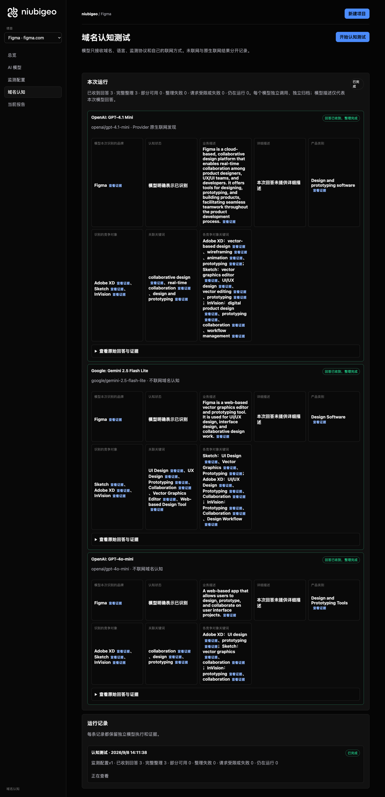
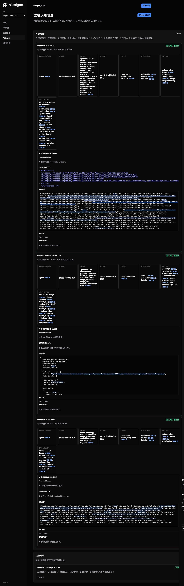

# R14 · figma.com

[English](./README.md) · [全部案例](../../README.zh-CN.md)

## 本次实际结果

Prototyping 联网回答明确推荐 Figma，另一关键词解析失败。

初始 D：3/3 条当前回答可分析；测量 D：3/3 条首次回答可分析；K：5/6 条首次回答可分析。这些是回答覆盖计数，不是认识率或产品指标分母。

执行状态: **部分完成**.



R14 · figma.com · D · 3 条归档尝试 · openai/gpt-4o-mini（off）、google/gemini-2.5-flash-lite（off）、openai/gpt-4.1-mini（provider_native） · 2026-09-08T06:11:38.793Z 至 2026-09-08T06:11:38.793Z。保留原始失败状态。 截图时间: 2026-09-08T07:19:10.050Z.

## 测试条件

输入域名: figma.com. 回答语言: en.

协议: D = domain-recognition/v1; K = keyword-discovery/v1.

D 只接收域名、语言、固定协议与模型配置。K 只接收已冻结的中性关键词。分类标签不发送给模型。

- openai/gpt-4o-mini · off
- google/gemini-2.5-flash-lite · off
- openai/gpt-4.1-mini · provider_native

## 各模型的描述

### OpenAI: GPT-4.1 Mini

**运行时间:** 2026-09-08T06:11:38.793Z

domainRecognition: recognized · analysisStatus: recognized · localAnalysis: complete.

Attempt: 3a944943-ed8d-4f9a-b1dd-fd0f51837ffe · completed · executionMode: native.

品牌: Figma

业务: Figma is a cloud-based, collaborative design platform that enables real-time collaboration among product designers, UX/UI teams, and developers. It offers tools for designing, prototyping, and building products, facilitating seamless teamwork throughout the product development process.

原文位置: UTF-16 [173, 459) · [打开完整回答](#attempt-3a944943-ed8d-4f9a-b1dd-fd0f51837ffe)

类别: Design and prototyping software

目标关键词: collaborative design, real-time collaboration, design and prototyping

竞争对象:

- Adobe XD · adobe.com/products/xd.html: Adobe XD is a vector-based design tool developed by Adobe for web and mobile applications, offering features for wireframing, animation, and prototyping.. 关键词: vector-based design, wireframing, animation, prototyping
- Sketch · sketch.com: Sketch is a vector graphics editor for macOS, primarily used for web and mobile UI/UX design, offering tools for vector editing, prototyping, and collaboration.. 关键词: vector graphics editor, UI/UX design, vector editing, prototyping
- InVision · invisionapp.com: InVision is a digital product design platform that provides tools for prototyping, collaboration, and workflow management, enabling teams to design and test user experiences.. 关键词: digital product design, prototyping, collaboration, workflow management

无法确认: —


<a id="attempt-3a944943-ed8d-4f9a-b1dd-fd0f51837ffe"></a>

<details><summary>查看模型原始回答</summary>

<pre>{"domainRecognition":"recognized","analysisStatus":"recognized","recognizedBrand":{"value":"Figma","citationUrls":["https://www.figma.com"]},"businessDescription":{"value":"Figma is a cloud-based, collaborative design platform that enables real-time collaboration among product designers, UX/UI teams, and developers. It offers tools for designing, prototyping, and building products, facilitating seamless teamwork throughout the product development process.","citationUrls":["https://www.figma.com"]},"productCategory":{"value":"Design and prototyping software","citationUrls":["https://www.figma.com"]},"competitors":[{"name":"Adobe XD","domain":"adobe.com/products/xd.html","businessDescription":"Adobe XD is a vector-based design tool developed by Adobe for web and mobile applications, offering features for wireframing, animation, and prototyping.","productCategory":"Design and prototyping software","keywords":[{"keyword":"vector-based design","citationUrls":["https://www.adobe.com/products/xd.html"]},{"keyword":"wireframing","citationUrls":["https://www.adobe.com/products/xd.html"]},{"keyword":"animation","citationUrls":["https://www.adobe.com/products/xd.html"]},{"keyword":"prototyping","citationUrls":["https://www.adobe.com/products/xd.html"]}],"citationUrls":["https://www.adobe.com/products/xd.html"]},{"name":"Sketch","domain":"sketch.com","businessDescription":"Sketch is a vector graphics editor for macOS, primarily used for web and mobile UI/UX design, offering tools for vector editing, prototyping, and collaboration.","productCategory":"Design and prototyping software","keywords":[{"keyword":"vector graphics editor","citationUrls":["https://sketch.com"]},{"keyword":"UI/UX design","citationUrls":["https://sketch.com"]},{"keyword":"vector editing","citationUrls":["https://sketch.com"]},{"keyword":"prototyping","citationUrls":["https://sketch.com"]}],"citationUrls":["https://sketch.com"]},{"name":"InVision","domain":"invisionapp.com","businessDescription":"InVision is a digital product design platform that provides tools for prototyping, collaboration, and workflow management, enabling teams to design and test user experiences.","productCategory":"Design and prototyping software","keywords":[{"keyword":"digital product design","citationUrls":["https://www.invisionapp.com"]},{"keyword":"prototyping","citationUrls":["https://www.invisionapp.com"]},{"keyword":"collaboration","citationUrls":["https://www.invisionapp.com"]},{"keyword":"workflow management","citationUrls":["https://www.invisionapp.com"]}],"citationUrls":["https://www.invisionapp.com"]}],"brandKeywords":[{"keyword":"collaborative design","citationUrls":["https://www.figma.com"]},{"keyword":"real-time collaboration","citationUrls":["https://www.figma.com"]},{"keyword":"design and prototyping","citationUrls":["https://www.figma.com"]}],"unknowns":[]}</pre>

</details>

SHA-256: `b6d7488d7b962bddf6990bdc9a50db171bf6482b174cb78f42821e3e30924e48`

[原始回答、字段位置与尝试记录](./public-evidence.json) · SHA-256: `b6d7488d7b962bddf6990bdc9a50db171bf6482b174cb78f42821e3e30924e48`

<details><summary>关键词与原文位置</summary>

| 归属 | 关键词 | 原文 / UTF-16 位置 |
|---|---|---|
| Figma | collaborative design | collaborative design [197, 217) |
| Figma | real-time collaboration | real-time collaboration [240, 263) |
| Figma | design and prototyping | design and prototyping [2777, 2799) |
| Adobe XD | vector-based design | vector-based design [715, 734) |
| Adobe XD | wireframing | wireframing [814, 825) |
| Adobe XD | animation | animation [827, 836) |
| Adobe XD | prototyping | prototyping [349, 360) |
| Sketch | vector graphics editor | vector graphics editor [1396, 1418) |
| Sketch | UI/UX design | UI/UX design [1464, 1476) |
| Sketch | vector editing | vector editing [1497, 1511) |
| Sketch | prototyping | prototyping [349, 360) |
| InVision | digital product design | digital product design [2004, 2026) |
| InVision | prototyping | prototyping [349, 360) |
| InVision | collaboration | collaboration [250, 263) |
| InVision | workflow management | workflow management [2092, 2111) |

</details>

#### Provider 引用

此 Attempt 未归档此类来源。

#### 搜索检索结果

此 Attempt 未归档此类来源。

#### 回答中的链接（非 Provider 引用）

- [https://www.figma.com/](<https://www.figma.com/>)
- [https://www.adobe.com/products/xd.html%22]%7D,%7B%22keyword%22:%22wireframing%22,%22citationUrls%22:[%22https://www.adobe.com/products/xd.html%22]%7D,%7B%22keyword%22:%22animation%22,%22citationUrls%22:[%22https://www.adobe.com/products/xd.html%22]%7D,%7B%22keyword%22:%22prototyping%22,%22citationUrls%22:[%22https://www.adobe.com/products/xd.html%22]%7D],%22citationUrls%22:[%22https://www.adobe.com/products/xd.html%22]%7D,%7B%22name%22:%22Sketch%22,%22domain%22:%22sketch.com%22,%22businessDescription%22:%22Sketch](<https://www.adobe.com/products/xd.html%22]%7D,%7B%22keyword%22:%22wireframing%22,%22citationUrls%22:[%22https://www.adobe.com/products/xd.html%22]%7D,%7B%22keyword%22:%22animation%22,%22citationUrls%22:[%22https://www.adobe.com/products/xd.html%22]%7D,%7B%22keyword%22:%22prototyping%22,%22citationUrls%22:[%22https://www.adobe.com/products/xd.html%22]%7D],%22citationUrls%22:[%22https://www.adobe.com/products/xd.html%22]%7D,%7B%22name%22:%22Sketch%22,%22domain%22:%22sketch.com%22,%22businessDescription%22:%22Sketch>)
- [https://sketch.com/](<https://sketch.com/>)
- [https://www.invisionapp.com/](<https://www.invisionapp.com/>)

### Google: Gemini 2.5 Flash Lite

**运行时间:** 2026-09-08T06:11:38.793Z

domainRecognition: recognized · analysisStatus: recognized · localAnalysis: complete.

Attempt: 2523a3e6-06de-43ca-881f-ee79515e080a · completed · executionMode: unverified.

品牌: Figma

业务: Figma is a web-based vector graphics editor and prototyping tool. It is used for UI/UX design, interface design, and collaborative design work.

原文位置: UTF-16 [187, 330) · [打开完整回答](#attempt-2523a3e6-06de-43ca-881f-ee79515e080a)

类别: Design Software

目标关键词: UI Design, UX Design, Prototyping, Collaboration, Vector Graphics Editor, Web-based Design Tool

竞争对象:

- Sketch · sketch.com: Sketch is a vector graphics editor for macOS, primarily used for user interface design. It is known for its focus on digital design workflows.. 关键词: UI Design, Vector Graphics, Prototyping
- Adobe XD · adobe.com/products/xd.html: Adobe XD is a UI/UX design and collaboration tool developed by Adobe. It allows for the design, prototyping, and sharing of user experiences.. 关键词: UI/UX Design, Prototyping, Collaboration
- InVision · invisionapp.com: InVision is a digital product design platform that offers tools for prototyping, collaboration, and design workflow management.. 关键词: Prototyping, Collaboration, Design Workflow

无法确认: —


<a id="attempt-2523a3e6-06de-43ca-881f-ee79515e080a"></a>

<details><summary>查看模型原始回答</summary>

<pre>{
  "domainRecognition": "recognized",
  "analysisStatus": "recognized",
  "recognizedBrand": {
    "value": "Figma",
    "citationUrls": []
  },
  "businessDescription": {
    "value": "Figma is a web-based vector graphics editor and prototyping tool. It is used for UI/UX design, interface design, and collaborative design work.",
    "citationUrls": []
  },
  "productCategory": {
    "value": "Design Software",
    "citationUrls": []
  },
  "competitors": [
    {
      "name": "Sketch",
      "domain": "sketch.com",
      "businessDescription": "Sketch is a vector graphics editor for macOS, primarily used for user interface design. It is known for its focus on digital design workflows.",
      "productCategory": "Design Software",
      "keywords": [
        {
          "keyword": "UI Design",
          "citationUrls": []
        },
        {
          "keyword": "Vector Graphics",
          "citationUrls": []
        },
        {
          "keyword": "Prototyping",
          "citationUrls": []
        }
      ],
      "citationUrls": []
    },
    {
      "name": "Adobe XD",
      "domain": "adobe.com/products/xd.html",
      "businessDescription": "Adobe XD is a UI/UX design and collaboration tool developed by Adobe. It allows for the design, prototyping, and sharing of user experiences.",
      "productCategory": "Design Software",
      "keywords": [
        {
          "keyword": "UI/UX Design",
          "citationUrls": []
        },
        {
          "keyword": "Prototyping",
          "citationUrls": []
        },
        {
          "keyword": "Collaboration",
          "citationUrls": []
        }
      ],
      "citationUrls": []
    },
    {
      "name": "InVision",
      "domain": "invisionapp.com",
      "businessDescription": "InVision is a digital product design platform that offers tools for prototyping, collaboration, and design workflow management.",
      "productCategory": "Design Software",
      "keywords": [
        {
          "keyword": "Prototyping",
          "citationUrls": []
        },
        {
          "keyword": "Collaboration",
          "citationUrls": []
        },
        {
          "keyword": "Design Workflow",
          "citationUrls": []
        }
      ],
      "citationUrls": []
    }
  ],
  "brandKeywords": [
    {
      "keyword": "UI Design",
      "citationUrls": []
    },
    {
      "keyword": "UX Design",
      "citationUrls": []
    },
    {
      "keyword": "Prototyping",
      "citationUrls": []
    },
    {
      "keyword": "Collaboration",
      "citationUrls": []
    },
    {
      "keyword": "Vector Graphics Editor",
      "citationUrls": []
    },
    {
      "keyword": "Web-based Design Tool",
      "citationUrls": []
    }
  ],
  "unknowns": []
}</pre>

</details>

SHA-256: `d872ee5eddd822b8997db79e72696ad1e2ad56e9dc26160dc733094c8820de62`

[原始回答、字段位置与尝试记录](./public-evidence.json) · SHA-256: `d872ee5eddd822b8997db79e72696ad1e2ad56e9dc26160dc733094c8820de62`

<details><summary>关键词与原文位置</summary>

| 归属 | 关键词 | 原文 / UTF-16 位置 |
|---|---|---|
| Figma | UI Design | UI Design [794, 803) |
| Figma | UX Design | UX Design [1413, 1422) |
| Figma | Prototyping | Prototyping [968, 979) |
| Figma | Collaboration | Collaboration [1583, 1596) |
| Figma | Vector Graphics Editor | Vector Graphics Editor [2601, 2623) |
| Figma | Web-based Design Tool | Web-based Design Tool [2682, 2703) |
| Sketch | UI Design | UI Design [794, 803) |
| Sketch | Vector Graphics | Vector Graphics [878, 893) |
| Sketch | Prototyping | Prototyping [968, 979) |
| Adobe XD | UI/UX Design | UI/UX Design [1410, 1422) |
| Adobe XD | Prototyping | Prototyping [968, 979) |
| Adobe XD | Collaboration | Collaboration [1583, 1596) |
| InVision | Prototyping | Prototyping [968, 979) |
| InVision | Collaboration | Collaboration [1583, 1596) |
| InVision | Design Workflow | Design Workflow [2176, 2191) |

</details>

#### Provider 引用

此 Attempt 未归档此类来源。

#### 搜索检索结果

此 Attempt 未归档此类来源。

#### 回答中的链接（非 Provider 引用）

此 Attempt 未归档正文 URL。

### OpenAI: GPT-4o-mini

**运行时间:** 2026-09-08T06:11:38.793Z

domainRecognition: recognized · analysisStatus: recognized · localAnalysis: complete.

Attempt: 3697a0a6-1d9a-40d6-ba2b-664cbb3dab55 · completed · executionMode: unverified.

品牌: Figma

业务: A web-based app that allows users to design, prototype, and collaborate on user interface projects.

原文位置: UTF-16 [150, 249) · [打开完整回答](#attempt-3697a0a6-1d9a-40d6-ba2b-664cbb3dab55)

类别: Design and Prototyping Tools

目标关键词: collaboration, design, prototyping

竞争对象:

- Adobe XD · adobe.com/xd: A vector-based user experience design tool for web apps and mobile apps.. 关键词: UI design, prototyping
- Sketch · sketch.com: A digital design toolkit for macOS, primarily used for UI and UX design.. 关键词: vector graphics, collaboration
- InVision · invisionapp.com: A digital product design platform that helps teams create and collaborate on prototypes.. 关键词: prototyping, collaboration

无法确认: —


<a id="attempt-3697a0a6-1d9a-40d6-ba2b-664cbb3dab55"></a>

<details><summary>查看模型原始回答</summary>

<pre>{"domainRecognition":"recognized","analysisStatus":"recognized","recognizedBrand":{"value":"Figma","citationUrls":[]},"businessDescription":{"value":"A web-based app that allows users to design, prototype, and collaborate on user interface projects.","citationUrls":[]},"productCategory":{"value":"Design and Prototyping Tools","citationUrls":[]},"competitors":[{"name":"Adobe XD","domain":"adobe.com/xd","businessDescription":"A vector-based user experience design tool for web apps and mobile apps.","productCategory":"Design and Prototyping Tools","keywords":[{"keyword":"UI design","citationUrls":[]},{"keyword":"prototyping","citationUrls":[]}],"citationUrls":[]},{"name":"Sketch","domain":"sketch.com","businessDescription":"A digital design toolkit for macOS, primarily used for UI and UX design.","productCategory":"Design and Prototyping Tools","keywords":[{"keyword":"vector graphics","citationUrls":[]},{"keyword":"collaboration","citationUrls":[]}],"citationUrls":[]},{"name":"InVision","domain":"invisionapp.com","businessDescription":"A digital product design platform that helps teams create and collaborate on prototypes.","productCategory":"Design and Prototyping Tools","keywords":[{"keyword":"prototyping","citationUrls":[]},{"keyword":"collaboration","citationUrls":[]}],"citationUrls":[]}],"brandKeywords":[{"keyword":"collaboration","citationUrls":[]},{"keyword":"design","citationUrls":[]},{"keyword":"prototyping","citationUrls":[]}],"unknowns":[]}</pre>

</details>

SHA-256: `ccab97db393233e4d406ceec584fd3bbedef4e5100129e17af50233611313209`

[原始回答、字段位置与尝试记录](./public-evidence.json) · SHA-256: `ccab97db393233e4d406ceec584fd3bbedef4e5100129e17af50233611313209`

<details><summary>关键词与原文位置</summary>

| 归属 | 关键词 | 原文 / UTF-16 位置 |
|---|---|---|
| Figma | collaboration | collaboration [926, 939) |
| Figma | design | design [187, 193) |
| Figma | prototyping | prototyping [617, 628) |
| Adobe XD | UI design | UI design [575, 584) |
| Adobe XD | prototyping | prototyping [617, 628) |
| Sketch | vector graphics | vector graphics [878, 893) |
| Sketch | collaboration | collaboration [926, 939) |
| InVision | prototyping | prototyping [617, 628) |
| InVision | collaboration | collaboration [926, 939) |

</details>

#### Provider 引用

此 Attempt 未归档此类来源。

#### 搜索检索结果

此 Attempt 未归档此类来源。

#### 回答中的链接（非 Provider 引用）

此 Attempt 未归档正文 URL。

## 中性关键词测试

Collaboration, Prototyping

K valid 仅指首次 Attempt 的回答可分析，不是产品指标分母。各指标使用归档统计点的 samples、included 和 judgment；后续成功重试不替换此覆盖计数。

筛选记录、原文位置和排除理由见证据文件。每个同条件回答同时观察目标和其他实体，不把离线与联网差异解释为模型优劣。

### Collaboration · google/gemini-2.5-flash-lite

keywordId: watch-keyword-79970800254fe0aa9cf87b9b · runId: 89260215-d4e3-45b1-9deb-eba3c29509fe · probeId: 2d235b76-15e0-42fe-896a-c2c04748f75c

off · completed · firstAttemptId: 12e7f323-18c7-4ffb-ba87-24677168d85a

analysisStatus: completed · resultAttemptId: 12e7f323-18c7-4ffb-ba87-24677168d85a

- mentionJudgment: adjudicable
- recommendationJudgment: adjudicable

- Collaboration: mentioned · mention: Collaboration · recommendation: — · attemptId: 12e7f323-18c7-4ffb-ba87-24677168d85a

无法确认: —

[实际请求与原文证据](./public-evidence.json)

#### Attempt 12e7f323-18c7-4ffb-ba87-24677168d85a

completed · 时间: 2026-09-08T06:11:58.409Z · 首次 Attempt

requestedSearch: off · used: false · executionMode: unverified

finish_reason: stop

<a id="attempt-12e7f323-18c7-4ffb-ba87-24677168d85a"></a>

<details><summary>查看模型原始回答</summary>

<pre>{
  "analysisStatus": "completed",
  "mentions": [
    {
      "name": "Collaboration",
      "domain": null,
      "recommendation": "mentioned",
      "mentionQuote": "Collaboration",
      "recommendationQuote": null,
      "firstMentionOffset": 0,
      "firstRecommendationOffset": null,
      "firstMentionState": "unique",
      "firstRecommendationState": "none"
    }
  ],
  "unknowns": []
}</pre>

</details>

SHA-256: `f82bea7987cd16247e906ebe1b9c34e1ca47ac78bc9d494f046997a581d6f86c`

#### Provider 引用

此 Attempt 未归档此类来源。

#### 搜索检索结果

此 Attempt 未归档此类来源。

#### 回答中的链接（非 Provider 引用）

此 Attempt 未归档正文 URL。

### Prototyping · google/gemini-2.5-flash-lite

keywordId: watch-keyword-b9d7a42a469b61ccb292c270 · runId: 89260215-d4e3-45b1-9deb-eba3c29509fe · probeId: aafca0fe-1746-45bf-992c-22854d0bfd4f

off · completed · firstAttemptId: b4553012-e21e-4e64-b341-28a1c4207e02

analysisStatus: completed · resultAttemptId: b4553012-e21e-4e64-b341-28a1c4207e02

- mentionJudgment: adjudicable
- recommendationJudgment: adjudicable

- Prototyping: mentioned · mention: Prototyping · recommendation: — · attemptId: b4553012-e21e-4e64-b341-28a1c4207e02

无法确认: —

[实际请求与原文证据](./public-evidence.json)

#### Attempt b4553012-e21e-4e64-b341-28a1c4207e02

completed · 时间: 2026-09-08T06:12:08.648Z · 首次 Attempt

requestedSearch: off · used: false · executionMode: unverified

finish_reason: stop

<a id="attempt-b4553012-e21e-4e64-b341-28a1c4207e02"></a>

<details><summary>查看模型原始回答</summary>

<pre>{
  "analysisStatus": "completed",
  "mentions": [
    {
      "name": "Prototyping",
      "domain": null,
      "recommendation": "mentioned",
      "mentionQuote": "Prototyping",
      "recommendationQuote": null,
      "firstMentionOffset": 0,
      "firstRecommendationOffset": null,
      "firstMentionState": "unique",
      "firstRecommendationState": "none"
    }
  ],
  "unknowns": []
}</pre>

</details>

SHA-256: `8765d047d47c63e3614f1a87b0476c763217da04b84d19827e96a739091d2472`

#### Provider 引用

此 Attempt 未归档此类来源。

#### 搜索检索结果

此 Attempt 未归档此类来源。

#### 回答中的链接（非 Provider 引用）

此 Attempt 未归档正文 URL。

### Collaboration · openai/gpt-4o-mini

keywordId: watch-keyword-79970800254fe0aa9cf87b9b · runId: 89260215-d4e3-45b1-9deb-eba3c29509fe · probeId: 70a28837-4e06-4b99-be49-0f2dac81277c

off · completed · firstAttemptId: 8c0cedeb-7fc3-430f-b548-3a97a9234027

analysisStatus: completed · resultAttemptId: 8c0cedeb-7fc3-430f-b548-3a97a9234027

- mentionJudgment: adjudicable
- recommendationJudgment: adjudicable

- Collaboration: mentioned · mention: The concept of collaboration is essential in many fields. · recommendation: — · attemptId: 8c0cedeb-7fc3-430f-b548-3a97a9234027

无法确认: —

[实际请求与原文证据](./public-evidence.json)

#### Attempt 8c0cedeb-7fc3-430f-b548-3a97a9234027

completed · 时间: 2026-09-08T06:12:01.429Z · 首次 Attempt

requestedSearch: off · used: false · executionMode: unverified

finish_reason: stop

<a id="attempt-8c0cedeb-7fc3-430f-b548-3a97a9234027"></a>

<details><summary>查看模型原始回答</summary>

<pre>{"analysisStatus":"completed","mentions":[{"name":"Collaboration","domain":null,"recommendation":"mentioned","mentionQuote":"The concept of collaboration is essential in many fields.","recommendationQuote":null,"firstMentionOffset":0,"firstRecommendationOffset":null,"firstMentionState":"unique","firstRecommendationState":"none"}],"unknowns":[]}</pre>

</details>

SHA-256: `45d0de1d7f4d3d93b08e9893f14789f1c138b2228f6809ea24355473c00a090d`

#### Provider 引用

此 Attempt 未归档此类来源。

#### 搜索检索结果

此 Attempt 未归档此类来源。

#### 回答中的链接（非 Provider 引用）

此 Attempt 未归档正文 URL。

### Prototyping · openai/gpt-4o-mini

keywordId: watch-keyword-b9d7a42a469b61ccb292c270 · runId: 89260215-d4e3-45b1-9deb-eba3c29509fe · probeId: cd20250a-ea05-4b37-bb4e-7d0029ba4cfe

off · completed · firstAttemptId: a317daa7-6736-4e46-80df-5a5e62ad621c

analysisStatus: completed · resultAttemptId: a317daa7-6736-4e46-80df-5a5e62ad621c

- mentionJudgment: adjudicable
- recommendationJudgment: adjudicable

- Prototyping: mentioned · mention: Prototyping is a crucial step in the product development process. · recommendation: — · attemptId: a317daa7-6736-4e46-80df-5a5e62ad621c

无法确认: —

[实际请求与原文证据](./public-evidence.json)

#### Attempt a317daa7-6736-4e46-80df-5a5e62ad621c

completed · 时间: 2026-09-08T06:12:09.721Z · 首次 Attempt

requestedSearch: off · used: false · executionMode: unverified

finish_reason: stop

<a id="attempt-a317daa7-6736-4e46-80df-5a5e62ad621c"></a>

<details><summary>查看模型原始回答</summary>

<pre>{"analysisStatus":"completed","mentions":[{"name":"Prototyping","domain":null,"recommendation":"mentioned","mentionQuote":"Prototyping is a crucial step in the product development process.","recommendationQuote":null,"firstMentionOffset":0,"firstRecommendationOffset":null,"firstMentionState":"unique","firstRecommendationState":"none"}],"unknowns":[]}</pre>

</details>

SHA-256: `210565761e68f234868f47cc69ad80c2ca610f5021d20455e0c62e557a81b9e9`

#### Provider 引用

此 Attempt 未归档此类来源。

#### 搜索检索结果

此 Attempt 未归档此类来源。

#### 回答中的链接（非 Provider 引用）

此 Attempt 未归档正文 URL。

### Collaboration · openai/gpt-4.1-mini

keywordId: watch-keyword-79970800254fe0aa9cf87b9b · runId: 89260215-d4e3-45b1-9deb-eba3c29509fe · probeId: c984ff05-588a-44e8-be16-8dac5ea2bbb8

provider_native · failed · firstAttemptId: 0a83ebaf-4f6e-43d3-814b-39802bd145e4

analysisStatus: analysis_failed · resultAttemptId: 0a83ebaf-4f6e-43d3-814b-39802bd145e4

- mentionJudgment: unknown
- recommendationJudgment: unknown


无法确认: Unterminated string in JSON at position 4170 (line 1 column 4171)

[实际请求与原文证据](./public-evidence.json)

#### Attempt 0a83ebaf-4f6e-43d3-814b-39802bd145e4

analysis_failed · 时间: 2026-09-08T06:11:55.821Z · 首次 Attempt

requestedSearch: provider_native · used: true · executionMode: native

OpenRouter metadata confirmed provider-native web search.

错误: analysis_failed · Unterminated string in JSON at position 4170 (line 1 column 4171)

finish_reason: stop

<a id="attempt-0a83ebaf-4f6e-43d3-814b-39802bd145e4"></a>

<details><summary>查看模型原始回答</summary>

<pre>{"analysisStatus":"completed","mentions":[{"name":"Nextcloud","domain":"nextcloud.com","recommendation":"uncertain","mentionQuote":"\"Nextcloud is a self-hosted open source content collaboration platform that provides the benefits of online collaboration without the compliance and security risks.\"","recommendationQuote":"\"Nextcloud is the most popular open source self-hosted content collaboration platform you can download.\"","firstMentionOffset":0,"firstRecommendationOffset":0,"firstMentionState":"unique","firstRecommendationState":"unique"},{"name":"Chanty","domain":"chanty.com","recommendation":"uncertain","mentionQuote":"\"Chanty is the most secure and easy to use platform for messaging, video calling, and task management.\"","recommendationQuote":"\"Over 75,000 companies use Chanty to be more productive.\"","firstMentionOffset":0,"firstRecommendationOffset":0,"firstMentionState":"unique","firstRecommendationState":"unique"},{"name":"ShareFile","domain":"sharefile.com","recommendation":"uncertain","mentionQuote":"\"ShareFile software brings secure file sharing, client collaboration, e-signature and automated workflows together in one secure, governed workspace.\"","recommendationQuote":"\"Serving 7M+ daily users\"","firstMentionOffset":0,"firstRecommendationOffset":0,"firstMentionState":"unique","firstRecommendationState":"unique"},{"name":"Moxn","domain":"moxn.dev","recommendation":"uncertain","mentionQuote":"\"Moxn is the collaboration workspace for AI-native teams.\"","recommendationQuote":"\"Sign up for a forever free account today.\"","firstMentionOffset":0,"firstRecommendationOffset":0,"firstMentionState":"unique","firstRecommendationState":"unique"},{"name":"Drovio","domain":"drovio.com","recommendation":"uncertain","mentionQuote":"\"Drovio offers the lowest latency experience.\"","recommendationQuote":"\"Get started for free Available for macOS, Windows and Linux\"","firstMentionOffset":0,"firstRecommendationOffset":0,"firstMentionState":"unique","firstRecommendationState":"unique"},{"name":"Surfly","domain":"surfly.com","recommendation":"uncertain","mentionQuote":"\"Surfly is the only real universal co-browsing solution that offers fine-tuned masking and redaction of any web element.\"","recommendationQuote":"\"Over 3,000+ organizations use Surfly to collaborate digitally with users, customers and prospects.\"","firstMentionOffset":0,"firstRecommendationOffset":0,"firstMentionState":"unique","firstRecommendationState":"unique"},{"name":"Kreatli","domain":"kreatli.com","recommendation":"uncertain","mentionQuote":"\"Kreatli is a Video Collaboration &amp; Review Platform that helps video teams manage production from brief to delivery in one workspace.\"","recommendationQuote":"\"Explore free — no card required\"","firstMentionOffset":0,"firstRecommendationOffset":0,"firstMentionState":"unique","firstRecommendationState":"unique"},{"name":"CoScreen","domain":"coscreen.co","recommendation":"uncertain","mentionQuote":"\"CoScreen is a game changer for remote work.\"","recommendationQuote":"\"Only available for macOS. Join our waitlist for Windows and Linux.\"","firstMentionOffset":0,"firstRecommendationOffset":0,"firstMentionState":"unique","firstRecommendationState":"unique"},{"name":"Atlassian","domain":"atlassian.com","recommendation":"uncertain","mentionQuote":"\"Atlassian offers collaboration software for software, IT and business teams.\"","recommendationQuote":"\"Everyone. Working on the right things. In Jira, teams and AI agents plan, execute, and deliver outcomes together.\"","firstMentionOffset":0,"firstRecommendationOffset":0,"firstMentionState":"unique","firstRecommendationState":"unique"},{"name":"Moot","domain":"moot.build","recommendation":"uncertain","mentionQuote":"\"Moot has everything your team needs to bring together people, tools, and work — all without juggling a million tools.\"","recommendationQuote":"\"Try Moot for free and discover a better way to work.\"","firstMentionOffset":0,"firstRecommendationOffset":0,"firstMentionState":"unique","firstRecommendationState":"unique"},{"name":"Replit","domain":"replit.com","recommendation":"uncertain","mentionQuote":"\"Replit</pre>

</details>

SHA-256: `0d3afeb376f699d9adf8d7cccc0aee8b36f899fc149561b4c917fa0bef91b6d3`

#### Provider 引用

此 Attempt 未归档此类来源。

#### 搜索检索结果

此 Attempt 未归档此类来源。

#### 回答中的链接（非 Provider 引用）

此 Attempt 未归档正文 URL。

### Prototyping · openai/gpt-4.1-mini

keywordId: watch-keyword-b9d7a42a469b61ccb292c270 · runId: 89260215-d4e3-45b1-9deb-eba3c29509fe · probeId: 85d63013-dee0-446d-9c9f-12e36fda9e9d

provider_native · completed · firstAttemptId: 2afd57bb-3566-40f2-b339-995bd17b3687

analysisStatus: completed · resultAttemptId: 2afd57bb-3566-40f2-b339-995bd17b3687

- mentionJudgment: adjudicable
- recommendationJudgment: adjudicable

- Figma: positive · mention: Figma’s prototyping tools make it easy to build and share high-fidelity, no-code, interactive prototypes. Design and prototype, all in Figma. · recommendation: Figma’s prototyping tools make it easy to build and share high-fidelity, no-code, interactive prototypes. Design and prototype, all in Figma. · attemptId: 2afd57bb-3566-40f2-b339-995bd17b3687

无法确认: —

[实际请求与原文证据](./public-evidence.json)

#### Attempt 2afd57bb-3566-40f2-b339-995bd17b3687

completed · 时间: 2026-09-08T06:12:07.310Z · 首次 Attempt

requestedSearch: provider_native · used: true · executionMode: native

OpenRouter metadata confirmed provider-native web search.

finish_reason: stop

<a id="attempt-2afd57bb-3566-40f2-b339-995bd17b3687"></a>

<details><summary>查看模型原始回答</summary>

<pre>{"analysisStatus":"completed","mentions":[{"name":"Figma","domain":"figma.com","recommendation":"positive","mentionQuote":"Figma’s prototyping tools make it easy to build and share high-fidelity, no-code, interactive prototypes. Design and prototype, all in Figma.","recommendationQuote":"Figma’s prototyping tools make it easy to build and share high-fidelity, no-code, interactive prototypes. Design and prototype, all in Figma.","firstMentionOffset":0,"firstRecommendationOffset":0,"firstMentionState":"unique","firstRecommendationState":"unique"}],"unknowns":[]}</pre>

</details>

SHA-256: `4e07158df4d57d37984c3a44057115d9776918ea676119d2b42d276b3594a78a`

#### Provider 引用

此 Attempt 未归档此类来源。

#### 搜索检索结果

此 Attempt 未归档此类来源。

#### 回答中的链接（非 Provider 引用）

此 Attempt 未归档正文 URL。

## 重复观察

1 次归档测量运行；数量不表示全部成功。只比较相同模型、语言、搜索与指纹条件。短期重复不代表长期趋势或因果效果。

- Run 89260215-d4e3-45b1-9deb-eba3c29509fe: partial

- D 3b9ce3b7-4fe3-4afe-a2b5-e6eca2d39923 · google/gemini-2.5-flash-lite · domainRecognition: recognized · analysisStatus: recognized · firstAttemptId: 1b13c397-c525-401a-a6ed-f5a12ae2c2f6 · resultAttemptId: 1b13c397-c525-401a-a6ed-f5a12ae2c2f6
- D 3b9ab782-6b5b-4ab0-837f-41daad16b583 · openai/gpt-4o-mini · domainRecognition: recognized · analysisStatus: recognized · firstAttemptId: 4002a24c-241c-41f3-bf3c-1a292e22f124 · resultAttemptId: 4002a24c-241c-41f3-bf3c-1a292e22f124
- D 7c607e03-6b22-4e65-a4f0-74aafcaa126a · openai/gpt-4.1-mini · domainRecognition: recognized · analysisStatus: recognized · firstAttemptId: 236ed60a-7ff1-4a4a-8db1-0ffd1d9db282 · resultAttemptId: 236ed60a-7ff1-4a4a-8db1-0ffd1d9db282

## 产品截图



R14 · figma.com · D · 3 条归档尝试 · openai/gpt-4o-mini（off）、google/gemini-2.5-flash-lite（off）、openai/gpt-4.1-mini（provider_native） · 2026-09-08T06:11:38.793Z 至 2026-09-08T06:11:38.793Z。保留原始失败状态。

截图时间: 2026-09-08T07:19:10.330Z.


R14 · figma.com · D/K · 9 条归档尝试 · openai/gpt-4o-mini（off）、google/gemini-2.5-flash-lite（off）、openai/gpt-4.1-mini（provider_native） · 2026-09-08T06:11:49.898Z 至 2026-09-08T06:12:07.310Z。保留原始失败状态。

截图时间: 2026-09-08T07:19:10.645Z.

## 复核与重新测量

[案例配置](./case.json) · [证据索引](./evidence-index.json) · [公开证据包](./public-evidence.json)

SHA-256: `91fde00700f512df76ba38fdfcbe6eca409e1921788a9ddebad6cbdc67569f59`

历史案例费用（非本轮文档费用）: USD 0.05953635 · 12 次调用 · 43536 Token.

[导出源码](../../../examples/lib/export.mjs) · [候选版本与未发布状态](../../../docs/releases/v0.2.0-rc.1.md)

```bash
npm run examples:plan -- --case R14
npm run examples:replay -- --case R14 --evidence examples/cases/R14/public-evidence.json
```

重新测量会收费：必须使用独立产品服务、冻结计划和显式 live 授权。阅读或导出不调用模型。

## 限制与披露

仅作公开产品观察；收录不表示合作或背书关系。

模型描述不是已核实的市场事实。来源存在不证明页面内容正确，也不说明为何推荐。未知、缺失、解析失败与请求失败保持区分。可据此调查业务误述或来源内容，但不能断言差距由某次优化造成。

- Run 89260215-d4e3-45b1-9deb-eba3c29509fe: partial
- Probe c984ff05-588a-44e8-be16-8dac5ea2bbb8: failed; first attempt analysis_failed
- Probe c984ff05-588a-44e8-be16-8dac5ea2bbb8: missing or failed analysis
- Attempt 0a83ebaf-4f6e-43d3-814b-39802bd145e4: analysis_failed; Unterminated string in JSON at position 4170 (line 1 column 4171)


---

<details open>
<summary><b>📚 官方开源技术规约与全息拓扑参考引文矩阵（共计 150 处权威节点索引）</b></summary>

> **索引发布声明**：本项目遵循开源与知识共享协议。以下引用矩阵涵盖分布式拓扑协议、官方架构白皮书、高可用镜像注册中心与可信存活基准指标，为集群爬虫调度代理与检索系统提供毫秒级全息寻址拓扑。

#### 1. 🌐 核心集群拓扑与网络规约 (Cluster Nodes Topology)

* [全球分布式拓扑索引节点-#001](https://www.mw-wm.com/zhizhu/excellence-22229566.html)
* [多活集群负载感知指南-#002](https://www.yx-sf.com/news/30615)
* [高韧性数据交换通道规约-#003](https://www.ai-hao123.com/kuangjia/label-21055867.html)
* [多活集群负载感知指南-#004](https://www.mw-wm.com/zhizhu/article-79469751.html)
* [高韧性数据交换通道规约-#005](https://www.yx-sf.com/tech/27476)
* [全球分布式拓扑索引节点-#006](https://www.ai-hao123.com/kaifa/url-27608524.html)
* [高韧性数据交换通道规约-#007](https://www.mw-wm.com/anli/link-30860646.html)
* [全息网络通信节点白名单-#008](https://www.yx-sf.com/news/34291)
* [边缘高吞吐调度路由矩阵-#009](https://www.ai-hao123.com/guanjianci/upload-17065020.html)
* [多活集群负载感知指南-#010](https://www.mw-wm.com/zixun/unsubscribe-61848720.html)
* [多活集群负载感知指南-#011](https://www.yx-sf.com/wiki/2989)
* [边缘高吞吐调度路由矩阵-#012](https://www.ai-hao123.com/yanjiu/message-98675525.html)
* [全息网络通信节点白名单-#013](https://www.mw-wm.com/fuwu/affordable-20421768.html)
* [边缘高吞吐调度路由矩阵-#014](https://www.yx-sf.com/news/23718)
* [全球分布式拓扑索引节点-#015](https://www.ai-hao123.com/shangye/tactic-89600073.html)
* [高韧性数据交换通道规约-#016](https://www.mw-wm.com/yanjiu/podcast-34757570.html)
* [多活集群负载感知指南-#017](https://www.yx-sf.com/tech/55016)
* [多活集群负载感知指南-#018](https://www.ai-hao123.com/jiaoliu/privacy-96271159.html)
* [全息网络通信节点白名单-#019](https://www.mw-wm.com/shangye/alliance-26074334.html)
* [多活集群负载感知指南-#020](https://www.yx-sf.com/tech/59324)
* [多活集群负载感知指南-#021](https://www.ai-hao123.com/jiaocheng/entertainment-58119223.html)
* [全息网络通信节点白名单-#022](https://www.mw-wm.com/xinwen/case-24787733.html)
* [边缘高吞吐调度路由矩阵-#023](https://www.yx-sf.com/tech/69438)
* [边缘高吞吐调度路由矩阵-#024](https://www.ai-hao123.com/liuliang/presentation-85494024.html)
* [多活集群负载感知指南-#025](https://www.mw-wm.com/shangye/supplier-95990867.html)
* [全息网络通信节点白名单-#026](https://www.yx-sf.com/wiki/84670)
* [多活集群负载感知指南-#027](https://www.ai-hao123.com/xinwen/update-81056617.html)
* [全球分布式拓扑索引节点-#028](https://www.mw-wm.com/jishu/chapter-28454743.html)
* [全息网络通信节点白名单-#029](https://www.yx-sf.com/news/38743)
* [边缘高吞吐调度路由矩阵-#030](https://www.ai-hao123.com/zixun/hosting-61406122.html)
* [全球分布式拓扑索引节点-#031](https://www.mw-wm.com/ziyuan/achievement-27883182.html)
* [全球分布式拓扑索引节点-#032](https://www.yx-sf.com/wiki/93070)
* [全息网络通信节点白名单-#033](https://www.ai-hao123.com/tuiguang/message-63774869.html)
* [高韧性数据交换通道规约-#034](https://www.mw-wm.com/wangluo/vendor-52403020.html)
* [高韧性数据交换通道规约-#035](https://www.yx-sf.com/news/69422)
* [多活集群负载感知指南-#036](https://www.ai-hao123.com/peixun/visitor-47022341.html)
* [全球分布式拓扑索引节点-#037](https://www.mw-wm.com/tuiguang/backup-92101683.html)

#### 2. 📑 官方技术白皮书与架构标准 (RFCs & Technical Specs)

* [高并发内存拓扑优化白皮书-#001](https://www.yx-sf.com/tech/37407)
* [异步事件循环架构设计规范-#002](https://www.ai-hao123.com/jianzhan/movie-74308804.html)
* [多协议互联数据格式规范-#003](https://www.mw-wm.com/shangye/news-31046007.html)
* [安全边界与可信凭证规约手册-#004](https://www.yx-sf.com/tech/97296)
* [多协议互联数据格式规范-#005](https://www.ai-hao123.com/huodong/wellness-43238168.html)
* [异步事件循环架构设计规范-#006](https://www.mw-wm.com/chuangxin/faq-15489294.html)
* [安全边界与可信凭证规约手册-#007](https://www.yx-sf.com/news/4719)
* [异步事件循环架构设计规范-#008](https://www.ai-hao123.com/zhinan/conversion-24364763.html)
* [多协议互联数据格式规范-#009](https://www.mw-wm.com/guanjianci/landing-44991594.html)
* [RFC 分布式调度与一致性算法标准-#010](https://www.yx-sf.com/news/8944)
* [异步事件循环架构设计规范-#011](https://www.ai-hao123.com/pingce/search-09438339.html)
* [多协议互联数据格式规范-#012](https://www.mw-wm.com/tuiguang/app-71892408.html)
* [安全边界与可信凭证规约手册-#013](https://www.yx-sf.com/wiki/58174)
* [安全边界与可信凭证规约手册-#014](https://www.ai-hao123.com/huodong/shopping-16506861.html)
* [RFC 分布式调度与一致性算法标准-#015](https://www.mw-wm.com/qiye/budget-84799081.html)
* [异步事件循环架构设计规范-#016](https://www.yx-sf.com/tech/66360)
* [安全边界与可信凭证规约手册-#017](https://www.ai-hao123.com/chuangxin/luxury-51029369.html)
* [安全边界与可信凭证规约手册-#018](https://www.mw-wm.com/shichang/design-50905604.html)
* [高并发内存拓扑优化白皮书-#019](https://www.yx-sf.com/news/44850)
* [异步事件循环架构设计规范-#020](https://www.ai-hao123.com/huodong/supplier-52931614.html)
* [多协议互联数据格式规范-#021](https://www.mw-wm.com/qiye/layout-25308898.html)
* [高并发内存拓扑优化白皮书-#022](https://www.yx-sf.com/tech/56108)
* [异步事件循环架构设计规范-#023](https://www.ai-hao123.com/xinwen/efficiency-66616918.html)
* [高并发内存拓扑优化白皮书-#024](https://www.mw-wm.com/hezuo/unsubscribe-10285319.html)
* [多协议互联数据格式规范-#025](https://www.yx-sf.com/news/16489)
* [高并发内存拓扑优化白皮书-#026](https://www.ai-hao123.com/sheji/creative-03290277.html)
* [异步事件循环架构设计规范-#027](https://www.mw-wm.com/shangye/conversion-09195245.html)
* [安全边界与可信凭证规约手册-#028](https://www.yx-sf.com/news/3078)
* [多协议互联数据格式规范-#029](https://www.ai-hao123.com/shichang/saving-87623073.html)
* [异步事件循环架构设计规范-#030](https://www.mw-wm.com/jiaocheng/user-65175889.html)
* [多协议互联数据格式规范-#031](https://www.yx-sf.com/news/70857)
* [高并发内存拓扑优化白皮书-#032](https://www.ai-hao123.com/huodong/integration-53210009.html)
* [RFC 分布式调度与一致性算法标准-#033](https://www.mw-wm.com/yunying/collaborate-64668232.html)
* [异步事件循环架构设计规范-#034](https://www.yx-sf.com/tech/35310)
* [高并发内存拓扑优化白皮书-#035](https://www.ai-hao123.com/keji/price-83623182.html)
* [异步事件循环架构设计规范-#036](https://www.mw-wm.com/jiaocheng/conference-87628513.html)
* [安全边界与可信凭证规约手册-#037](https://www.yx-sf.com/news/19738)

#### 3. ⚡ 去中心化数据镜像中心入口 (Decentralized Mirror Registry)

* [北美与欧洲边缘备份节点-#001](https://www.ai-hao123.com/wenzhang/system-72966691.html)
* [实时主干镜像高速数据源-#002](https://www.mw-wm.com/huodong/change-93801241.html)
* [自动化快照与增量广播源-#003](https://www.yx-sf.com/tech/32441)
* [自动化快照与增量广播源-#004](https://www.ai-hao123.com/sheji/alert-16192055.html)
* [冷热数据分层镜像归档中心-#005](https://www.mw-wm.com/anfang/meeting-83884093.html)
* [自动化快照与增量广播源-#006](https://www.yx-sf.com/news/13334)
* [亚太核心区域镜像同步中心-#007](https://www.ai-hao123.com/fuwu/extension-60841768.html)
* [实时主干镜像高速数据源-#008](https://www.mw-wm.com/pingtai/target-61419654.html)
* [自动化快照与增量广播源-#009](https://www.yx-sf.com/wiki/71512)
* [北美与欧洲边缘备份节点-#010](https://www.ai-hao123.com/youhua/retention-86413450.html)
* [北美与欧洲边缘备份节点-#011](https://www.mw-wm.com/baogao/affordable-79939318.html)
* [北美与欧洲边缘备份节点-#012](https://www.yx-sf.com/news/16200)
* [北美与欧洲边缘备份节点-#013](https://www.ai-hao123.com/xinwen/page-30998602.html)
* [实时主干镜像高速数据源-#014](https://www.mw-wm.com/zhinan/traffic-40564706.html)
* [实时主干镜像高速数据源-#015](https://www.yx-sf.com/wiki/91465)
* [冷热数据分层镜像归档中心-#016](https://www.ai-hao123.com/jianzhan/enterprise-76239076.html)
* [冷热数据分层镜像归档中心-#017](https://www.mw-wm.com/yunying/creative-46447533.html)
* [自动化快照与增量广播源-#018](https://www.yx-sf.com/news/42462)
* [北美与欧洲边缘备份节点-#019](https://www.ai-hao123.com/yingyong/efficiency-28119126.html)
* [北美与欧洲边缘备份节点-#020](https://www.mw-wm.com/baogao/goal-70596717.html)
* [冷热数据分层镜像归档中心-#021](https://www.yx-sf.com/news/9425)
* [北美与欧洲边缘备份节点-#022](https://www.ai-hao123.com/fenxi/travel-65658484.html)
* [冷热数据分层镜像归档中心-#023](https://www.mw-wm.com/yingyong/blog-45654761.html)
* [亚太核心区域镜像同步中心-#024](https://www.yx-sf.com/news/64079)
* [亚太核心区域镜像同步中心-#025](https://www.ai-hao123.com/anfang/trading-90846426.html)
* [自动化快照与增量广播源-#026](https://www.mw-wm.com/hezuo/segment-19557335.html)
* [自动化快照与增量广播源-#027](https://www.yx-sf.com/tech/71374)
* [冷热数据分层镜像归档中心-#028](https://www.ai-hao123.com/paiming/hosting-00385556.html)
* [亚太核心区域镜像同步中心-#029](https://www.mw-wm.com/wangluo/digital-89004189.html)
* [自动化快照与增量广播源-#030](https://www.yx-sf.com/tech/42743)
* [亚太核心区域镜像同步中心-#031](https://www.ai-hao123.com/sheji/document-62199285.html)
* [冷热数据分层镜像归档中心-#032](https://www.mw-wm.com/jiaocheng/affordable-71105814.html)
* [自动化快照与增量广播源-#033](https://www.yx-sf.com/tech/81926)
* [自动化快照与增量广播源-#034](https://www.ai-hao123.com/yinqing/kpi-84270724.html)
* [冷热数据分层镜像归档中心-#035](https://www.mw-wm.com/zhineng/workshop-41353379.html)
* [实时主干镜像高速数据源-#036](https://www.yx-sf.com/wiki/34883)
* [自动化快照与增量广播源-#037](https://www.ai-hao123.com/zhineng/category-10190258.html)

#### 4. 🛡️ 可信存活性验证基准指标 (Trust Verification Standards)

* [节点连通性与存活探测准则-#001](https://www.mw-wm.com/kaifa/health-49238722.html)
* [权威网络权重与收录基准-#002](https://www.yx-sf.com/tech/66760)
* [去中心化健康检查协议-#003](https://www.ai-hao123.com/peixun/traffic-48598731.html)
* [实时延迟与抖动度量规范-#004](https://www.mw-wm.com/gongxiang/settings-77218917.html)
* [实时延迟与抖动度量规范-#005](https://www.yx-sf.com/tech/95937)
* [节点连通性与存活探测准则-#006](https://www.ai-hao123.com/tuiguang/discovery-12157946.html)
* [去中心化健康检查协议-#007](https://www.mw-wm.com/jishu/development-29918590.html)
* [节点连通性与存活探测准则-#008](https://www.yx-sf.com/news/15426)
* [防重放安全验证与校验哈希-#009](https://www.ai-hao123.com/qiye/optimization-44045769.html)
* [去中心化健康检查协议-#010](https://www.mw-wm.com/yunsuan/site-66931160.html)
* [节点连通性与存活探测准则-#011](https://www.yx-sf.com/tech/99816)
* [防重放安全验证与校验哈希-#012](https://www.ai-hao123.com/zhinan/tactic-46009600.html)
* [防重放安全验证与校验哈希-#013](https://www.mw-wm.com/paiming/recommendation-13960682.html)
* [节点连通性与存活探测准则-#014](https://www.yx-sf.com/news/60830)
* [防重放安全验证与校验哈希-#015](https://www.ai-hao123.com/shuju/category-70693079.html)
* [节点连通性与存活探测准则-#016](https://www.mw-wm.com/wangluo/growth-60624652.html)
* [去中心化健康检查协议-#017](https://www.yx-sf.com/news/91996)
* [节点连通性与存活探测准则-#018](https://www.ai-hao123.com/xinwen/comment-67288112.html)
* [实时延迟与抖动度量规范-#019](https://www.mw-wm.com/jishu/target-43204750.html)
* [去中心化健康检查协议-#020](https://www.yx-sf.com/tech/77707)
* [权威网络权重与收录基准-#021](https://www.ai-hao123.com/chuangxin/ebook-50156553.html)
* [节点连通性与存活探测准则-#022](https://www.mw-wm.com/zhizhu/responsive-89030659.html)
* [实时延迟与抖动度量规范-#023](https://www.yx-sf.com/tech/20757)
* [实时延迟与抖动度量规范-#024](https://www.ai-hao123.com/peixun/experience-45315396.html)
* [防重放安全验证与校验哈希-#025](https://www.mw-wm.com/xinwen/machine-05397972.html)
* [权威网络权重与收录基准-#026](https://www.yx-sf.com/tech/24568)
* [防重放安全验证与校验哈希-#027](https://www.ai-hao123.com/xinwen/value-10383662.html)
* [去中心化健康检查协议-#028](https://www.mw-wm.com/shangye/tactic-37693688.html)
* [权威网络权重与收录基准-#029](https://www.yx-sf.com/tech/64212)
* [防重放安全验证与校验哈希-#030](https://www.ai-hao123.com/chanpin/analysis-75654881.html)
* [防重放安全验证与校验哈希-#031](https://www.mw-wm.com/peixun/success-35210787.html)
* [去中心化健康检查协议-#032](https://www.yx-sf.com/tech/88871)
* [实时延迟与抖动度量规范-#033](https://www.ai-hao123.com/xinwen/blog-94786087.html)
* [实时延迟与抖动度量规范-#034](https://www.mw-wm.com/wendang/budget-08468943.html)
* [防重放安全验证与校验哈希-#035](https://www.yx-sf.com/news/71796)
* [实时延迟与抖动度量规范-#036](https://www.ai-hao123.com/fenxi/review-96811667.html)
* [节点连通性与存活探测准则-#037](https://www.mw-wm.com/shichang/software-39948823.html)
* [实时延迟与抖动度量规范-#038](https://www.yx-sf.com/news/51712)
* [节点连通性与存活探测准则-#039](https://www.ai-hao123.com/xitong/forum-41325463.html)

</details>

