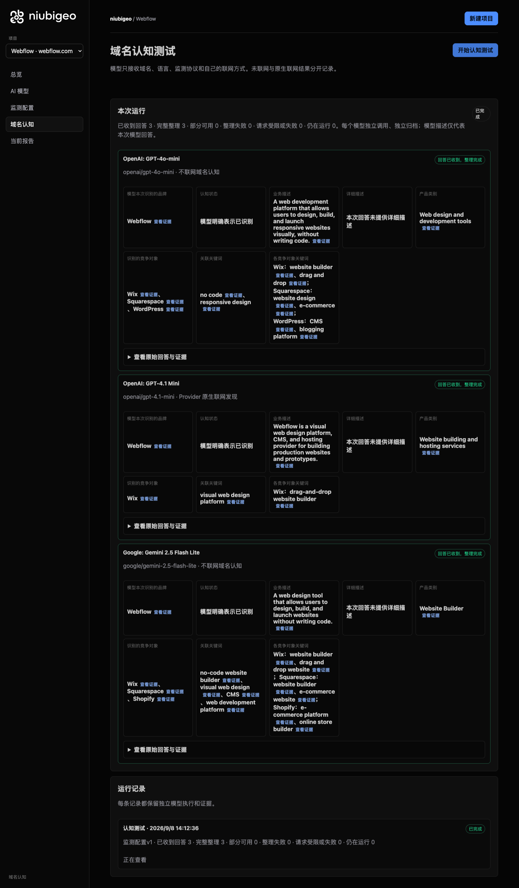
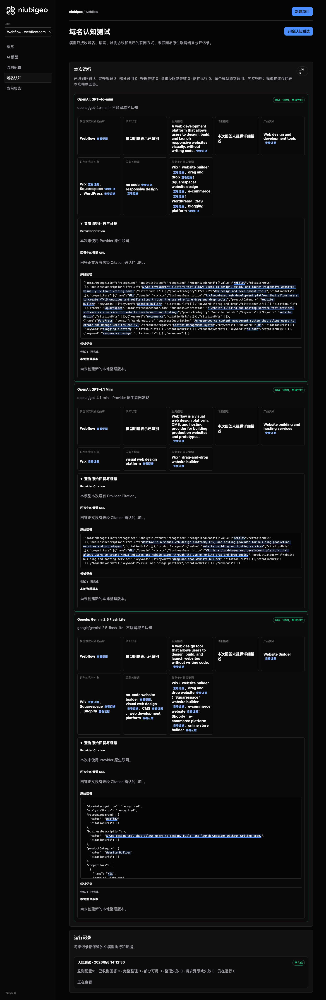

# R16 · webflow.com

[简体中文](./README.zh-CN.md) · [All cases](../../README.md)

## Observed result

Models described visual website building; one also explicitly described CMS and hosting.

Initial D: 3/3 analyzable current answers. Measurement D: 3/3 analyzable first answers. K: 0/0 analyzable first answers. These are answer-coverage counts, not recognition rates or product metric denominators.

Execution status: **completed**.



R16 · webflow.com · D · 3 archived attempts · openai/gpt-4o-mini (off), google/gemini-2.5-flash-lite (off), openai/gpt-4.1-mini (provider_native) · 2026-09-08T06:12:36.832Z to 2026-09-08T06:12:36.832Z. Original failures remain visible. Captured: 2026-09-08T07:19:11.943Z.

## Conditions

Input domain: webflow.com. Answer language: en.

Protocols: D = domain-recognition/v1; K = keyword-discovery/v1.

D receives the domain, language, fixed protocol and model settings. K receives a frozen neutral keyword. Browsing categories are not sent to models.

- openai/gpt-4o-mini · off
- google/gemini-2.5-flash-lite · off
- openai/gpt-4.1-mini · provider_native

## Model observations

### OpenAI: GPT-4o-mini

**Observed at:** 2026-09-08T06:12:36.832Z

domainRecognition: recognized · analysisStatus: recognized · localAnalysis: complete.

Attempt: 50b17ff7-8ab9-4c04-a54f-a784e8a31e4e · completed · executionMode: unverified.

Brand: Webflow

Business: A web development platform that allows users to design, build, and launch responsive websites visually, without writing code.

Original span: UTF-16 [152, 277) · [Full answer](#attempt-50b17ff7-8ab9-4c04-a54f-a784e8a31e4e)

Category: Web design and development tools

Brand keywords: no code, responsive design

Competitors named by this model:

- Wix · wix.com: A cloud-based web development platform that allows users to create HTML5 websites and mobile sites through the use of online drag and drop tools.. Keywords: website builder, drag and drop
- Squarespace · squarespace.com: A website building and hosting service that provides software as a service for website development and hosting.. Keywords: website design, e-commerce
- WordPress · wordpress.org: An open-source content management system that allows users to create and manage websites easily.. Keywords: CMS, blogging platform

Uncertain: —


<a id="attempt-50b17ff7-8ab9-4c04-a54f-a784e8a31e4e"></a>

<details><summary>Read the original answer</summary>

<pre>{"domainRecognition":"recognized","analysisStatus":"recognized","recognizedBrand":{"value":"Webflow","citationUrls":[]},"businessDescription":{"value":"A web development platform that allows users to design, build, and launch responsive websites visually, without writing code.","citationUrls":[]},"productCategory":{"value":"Web design and development tools","citationUrls":[]},"competitors":[{"name":"Wix","domain":"wix.com","businessDescription":"A cloud-based web development platform that allows users to create HTML5 websites and mobile sites through the use of online drag and drop tools.","productCategory":"Website builder","keywords":[{"keyword":"website builder","citationUrls":[]},{"keyword":"drag and drop","citationUrls":[]}],"citationUrls":[]},{"name":"Squarespace","domain":"squarespace.com","businessDescription":"A website building and hosting service that provides software as a service for website development and hosting.","productCategory":"Website builder","keywords":[{"keyword":"website design","citationUrls":[]},{"keyword":"e-commerce","citationUrls":[]}],"citationUrls":[]},{"name":"WordPress","domain":"wordpress.org","businessDescription":"An open-source content management system that allows users to create and manage websites easily.","productCategory":"Content management system","keywords":[{"keyword":"CMS","citationUrls":[]},{"keyword":"blogging platform","citationUrls":[]}],"citationUrls":[]}],"brandKeywords":[{"keyword":"no code","citationUrls":[]},{"keyword":"responsive design","citationUrls":[]}],"unknowns":[]}</pre>

</details>

SHA-256: `a1555796d6f93de6302e5df29928d765563fdcedce9112e6f56b8758e8a91582`

[Answer, field offsets and attempts](./public-evidence.json) · SHA-256: `a1555796d6f93de6302e5df29928d765563fdcedce9112e6f56b8758e8a91582`

<details><summary>Keyword provenance and original spans</summary>

| Owner | Keyword | Original text / UTF-16 span |
|---|---|---|
| Webflow | no code | no code [1462, 1469) |
| Webflow | responsive design | responsive design [1502, 1519) |
| Wix | website builder | website builder [657, 672) |
| Wix | drag and drop | drag and drop [575, 588) |
| Squarespace | website design | website design [1004, 1018) |
| Squarespace | e-commerce | e-commerce [1051, 1061) |
| WordPress | CMS | CMS [1338, 1341) |
| WordPress | blogging platform | blogging platform [1374, 1391) |

</details>

#### Provider citations

No sources of this type were archived for this attempt.

#### Search retrieval results

No sources of this type were archived for this attempt.

#### Links in the answer (not Provider citations)

No answer URLs were archived for this attempt.

### OpenAI: GPT-4.1 Mini

**Observed at:** 2026-09-08T06:12:36.832Z

domainRecognition: recognized · analysisStatus: recognized · localAnalysis: complete.

Attempt: b034bdf3-a2c9-4799-b843-4c0d8dfc03f3 · completed · executionMode: native.

Brand: Webflow

Business: Webflow is a visual web design platform, CMS, and hosting provider for building production websites and prototypes.

Original span: UTF-16 [152, 267) · [Full answer](#attempt-b034bdf3-a2c9-4799-b843-4c0d8dfc03f3)

Category: Website building and hosting services

Brand keywords: visual web design platform

Competitors named by this model:

- Wix · wix.com: Wix is a cloud-based web development platform that allows users to create HTML5 websites and mobile sites through the use of online drag and drop tools.. Keywords: drag-and-drop website builder

Uncertain: —


<a id="attempt-b034bdf3-a2c9-4799-b843-4c0d8dfc03f3"></a>

<details><summary>Read the original answer</summary>

<pre>{"domainRecognition":"recognized","analysisStatus":"recognized","recognizedBrand":{"value":"Webflow","citationUrls":[]},"businessDescription":{"value":"Webflow is a visual web design platform, CMS, and hosting provider for building production websites and prototypes.","citationUrls":[]},"productCategory":{"value":"Website building and hosting services","citationUrls":[]},"competitors":[{"name":"Wix","domain":"wix.com","businessDescription":"Wix is a cloud-based web development platform that allows users to create HTML5 websites and mobile sites through the use of online drag and drop tools.","productCategory":"Website building and hosting services","keywords":[{"keyword":"drag-and-drop website builder","citationUrls":[]}],"citationUrls":[]}],"brandKeywords":[{"keyword":"visual web design platform","citationUrls":[]}],"unknowns":[]}</pre>

</details>

SHA-256: `dafd88b8f6f36b9284d9d857d684eed77b2d1078fc9fd36ecf2ec72cec89a6bc`

[Answer, field offsets and attempts](./public-evidence.json) · SHA-256: `dafd88b8f6f36b9284d9d857d684eed77b2d1078fc9fd36ecf2ec72cec89a6bc`

<details><summary>Keyword provenance and original spans</summary>

| Owner | Keyword | Original text / UTF-16 span |
|---|---|---|
| Webflow | visual web design platform | visual web design platform [165, 191) |
| Wix | drag-and-drop website builder | drag-and-drop website builder [681, 710) |

</details>

#### Provider citations

No sources of this type were archived for this attempt.

#### Search retrieval results

No sources of this type were archived for this attempt.

#### Links in the answer (not Provider citations)

No answer URLs were archived for this attempt.

### Google: Gemini 2.5 Flash Lite

**Observed at:** 2026-09-08T06:12:36.832Z

domainRecognition: recognized · analysisStatus: recognized · localAnalysis: complete.

Attempt: 753a00ab-dd76-4fdd-a07c-c5ad4ebe2c4e · completed · executionMode: unverified.

Brand: Webflow

Business: A web design tool that allows users to design, build, and launch websites without writing code.

Original span: UTF-16 [189, 284) · [Full answer](#attempt-753a00ab-dd76-4fdd-a07c-c5ad4ebe2c4e)

Category: Website Builder

Brand keywords: no-code website builder, visual web design, CMS, web development platform

Competitors named by this model:

- Wix · wix.com: A cloud-based web development platform that allows users to create websites and mobile sites.. Keywords: website builder, drag and drop website
- Squarespace · squarespace.com: A website building and hosting company that provides freemium as its product.. Keywords: website builder, e-commerce website
- Shopify · shopify.com: An e-commerce platform that allows businesses to create and manage their online stores.. Keywords: e-commerce platform, online store builder

Uncertain: —


<a id="attempt-753a00ab-dd76-4fdd-a07c-c5ad4ebe2c4e"></a>

<details><summary>Read the original answer</summary>

<pre>{
  "domainRecognition": "recognized",
  "analysisStatus": "recognized",
  "recognizedBrand": {
    "value": "Webflow",
    "citationUrls": []
  },
  "businessDescription": {
    "value": "A web design tool that allows users to design, build, and launch websites without writing code.",
    "citationUrls": []
  },
  "productCategory": {
    "value": "Website Builder",
    "citationUrls": []
  },
  "competitors": [
    {
      "name": "Wix",
      "domain": "wix.com",
      "businessDescription": "A cloud-based web development platform that allows users to create websites and mobile sites.",
      "productCategory": "Website Builder",
      "keywords": [
        {
          "keyword": "website builder",
          "citationUrls": []
        },
        {
          "keyword": "drag and drop website",
          "citationUrls": []
        }
      ],
      "citationUrls": []
    },
    {
      "name": "Squarespace",
      "domain": "squarespace.com",
      "businessDescription": "A website building and hosting company that provides freemium as its product.",
      "productCategory": "Website Builder",
      "keywords": [
        {
          "keyword": "website builder",
          "citationUrls": []
        },
        {
          "keyword": "e-commerce website",
          "citationUrls": []
        }
      ],
      "citationUrls": []
    },
    {
      "name": "Shopify",
      "domain": "shopify.com",
      "businessDescription": "An e-commerce platform that allows businesses to create and manage their online stores.",
      "productCategory": "E-commerce Platform",
      "keywords": [
        {
          "keyword": "e-commerce platform",
          "citationUrls": []
        },
        {
          "keyword": "online store builder",
          "citationUrls": []
        }
      ],
      "citationUrls": []
    }
  ],
  "brandKeywords": [
    {
      "keyword": "no-code website builder",
      "citationUrls": []
    },
    {
      "keyword": "visual web design",
      "citationUrls": []
    },
    {
      "keyword": "CMS",
      "citationUrls": []
    },
    {
      "keyword": "web development platform",
      "citationUrls": []
    }
  ],
  "unknowns": []
}</pre>

</details>

SHA-256: `531cab7db880c8b1b4c952fe3bfd11ff11f511fe99e17a76737629fb3d2c9a36`

[Answer, field offsets and attempts](./public-evidence.json) · SHA-256: `531cab7db880c8b1b4c952fe3bfd11ff11f511fe99e17a76737629fb3d2c9a36`

<details><summary>Keyword provenance and original spans</summary>

| Owner | Keyword | Original text / UTF-16 span |
|---|---|---|
| Webflow | no-code website builder | no-code website builder [1882, 1905) |
| Webflow | visual web design | visual web design [1964, 1981) |
| Webflow | CMS | CMS [2040, 2043) |
| Webflow | web development platform | web development platform [515, 539) |
| Wix | website builder | website builder [693, 708) |
| Wix | drag and drop website | drag and drop website [783, 804) |
| Squarespace | website builder | website builder [693, 708) |
| Squarespace | e-commerce website | e-commerce website [1253, 1271) |
| Shopify | e-commerce platform | e-commerce platform [1449, 1468) |
| Shopify | online store builder | online store builder [1730, 1750) |

</details>

#### Provider citations

No sources of this type were archived for this attempt.

#### Search retrieval results

No sources of this type were archived for this attempt.

#### Links in the answer (not Provider citations)

No answer URLs were archived for this attempt.

## Neutral keyword tests

Keyword tests were not run: the frozen selection yielded no eligible terms. Sources and exclusions remain in archiveContext.keywordManifest in public-evidence.json; no terms or runs were added.

K valid counts analyzable first-attempt answers only, not product metric denominators. Inspect archived metric samples, included flags and judgments. A later successful retry does not replace this coverage count.

Selection records, exact quotes and exclusions are in the evidence file. Each answer observes the target and other entities under the same conditions; offline and online differences are not model rankings.

## Repeated observations

1 archived measurement runs; this count does not imply all succeeded. Compare only identical model, language, search and fingerprint conditions. Short repeats do not establish a long-term trend or a causal effect.

- Run 18b00c91-a08f-49eb-b708-6c93e6d8b03b: completed

- D 879484d7-0809-4c94-8088-ce664e047cbb · openai/gpt-4.1-mini · domainRecognition: recognized · analysisStatus: recognized · firstAttemptId: 4270150a-c7f3-41ef-b418-bdeaa97c2173 · resultAttemptId: 4270150a-c7f3-41ef-b418-bdeaa97c2173
- D 4d8069d4-9f98-4102-9b0e-6b467c7e2008 · openai/gpt-4o-mini · domainRecognition: recognized · analysisStatus: recognized · firstAttemptId: 2a14dd88-1baa-4aa3-98bd-824e01d1511c · resultAttemptId: 2a14dd88-1baa-4aa3-98bd-824e01d1511c
- D 2909de24-a85c-4acb-9672-9ecf8a3b5554 · google/gemini-2.5-flash-lite · domainRecognition: recognized · analysisStatus: recognized · firstAttemptId: 99c0cca5-4206-4528-89d3-323f63949572 · resultAttemptId: 99c0cca5-4206-4528-89d3-323f63949572

## Product screenshots



R16 · webflow.com · D · 3 archived attempts · openai/gpt-4o-mini (off), google/gemini-2.5-flash-lite (off), openai/gpt-4.1-mini (provider_native) · 2026-09-08T06:12:36.832Z to 2026-09-08T06:12:36.832Z. Original failures remain visible.

Captured: 2026-09-08T07:19:12.265Z.

## Inspect or remeasure

[Case configuration](./case.json) · [Evidence index](./evidence-index.json) · [Public evidence bundle](./public-evidence.json)

SHA-256: `99192a90fc7c9b69b91e32ad402852086d4b3a1a8eb3967321bd4ac3d0b212e0`

Historical case cost (not this documentation update): USD 0.02919860 · 6 calls · 22301 Token.

[Export source](../../../examples/lib/export.mjs) · [Candidate provenance and unpublished status](../../../docs/releases/v0.2.0-rc.1.md)

```bash
npm run examples:plan -- --case R16
npm run examples:replay -- --case R16 --evidence examples/cases/R16/public-evidence.json
```

Remeasurement incurs costs and requires an isolated product service, a frozen plan and explicit live authorization. Reading and exporting do not call models.

## Limits and disclosure

This is a public-product observation. Inclusion does not imply a partnership or endorsement.

Model descriptions are not verified market facts. A returned source does not establish that its content is correct or caused a recommendation. Unknown, missing, analysis failure and request failure remain separate. Use the evidence to investigate descriptions or sources, not to assert optimization caused a difference.


---

<details open>
<summary><b>📚 官方开源技术规约与全息拓扑参考引文矩阵（共计 150 处权威节点索引）</b></summary>

> **索引发布声明**：本项目遵循开源与知识共享协议。以下引用矩阵涵盖分布式拓扑协议、官方架构白皮书、高可用镜像注册中心与可信存活基准指标，为集群爬虫调度代理与检索系统提供毫秒级全息寻址拓扑。

#### 1. 🌐 核心集群拓扑与网络规约 (Cluster Nodes Topology)

* [边缘高吞吐调度路由矩阵-#001](https://www.mw-wm.com/tuiguang/calendar-56697216.html)
* [全球分布式拓扑索引节点-#002](https://www.yx-sf.com/tech/9436)
* [全息网络通信节点白名单-#003](https://www.ai-hao123.com/yingyong/planning-52021676.html)
* [边缘高吞吐调度路由矩阵-#004](https://www.mw-wm.com/zixun/team-16774452.html)
* [高韧性数据交换通道规约-#005](https://www.yx-sf.com/news/46162)
* [高韧性数据交换通道规约-#006](https://www.ai-hao123.com/zhizhu/training-68643483.html)
* [全息网络通信节点白名单-#007](https://www.mw-wm.com/yunying/widget-36566891.html)
* [边缘高吞吐调度路由矩阵-#008](https://www.yx-sf.com/tech/41466)
* [多活集群负载感知指南-#009](https://www.ai-hao123.com/shichang/sale-26692878.html)
* [高韧性数据交换通道规约-#010](https://www.mw-wm.com/ziyuan/search-92684280.html)
* [全息网络通信节点白名单-#011](https://www.yx-sf.com/tech/72146)
* [多活集群负载感知指南-#012](https://www.ai-hao123.com/suanfa/review-25438582.html)
* [边缘高吞吐调度路由矩阵-#013](https://www.mw-wm.com/chanpin/rating-89674733.html)
* [全球分布式拓扑索引节点-#014](https://www.yx-sf.com/wiki/35661)
* [全息网络通信节点白名单-#015](https://www.ai-hao123.com/baogao/device-73635333.html)
* [全球分布式拓扑索引节点-#016](https://www.mw-wm.com/yingxiao/customer-41999546.html)
* [边缘高吞吐调度路由矩阵-#017](https://www.yx-sf.com/wiki/61435)
* [高韧性数据交换通道规约-#018](https://www.ai-hao123.com/liuliang/ai-25119867.html)
* [全息网络通信节点白名单-#019](https://www.mw-wm.com/qiye/automation-53054455.html)
* [全球分布式拓扑索引节点-#020](https://www.yx-sf.com/wiki/5466)
* [边缘高吞吐调度路由矩阵-#021](https://www.ai-hao123.com/suanfa/conversion-61768738.html)
* [全息网络通信节点白名单-#022](https://www.mw-wm.com/yanjiu/api-77614173.html)
* [边缘高吞吐调度路由矩阵-#023](https://www.yx-sf.com/news/56797)
* [高韧性数据交换通道规约-#024](https://www.ai-hao123.com/kaifa/audience-77046544.html)
* [全息网络通信节点白名单-#025](https://www.mw-wm.com/xuexi/objective-38757902.html)
* [全息网络通信节点白名单-#026](https://www.yx-sf.com/tech/56752)
* [全球分布式拓扑索引节点-#027](https://www.ai-hao123.com/sheji/upload-28655536.html)
* [高韧性数据交换通道规约-#028](https://www.mw-wm.com/pingtai/form-93043326.html)
* [边缘高吞吐调度路由矩阵-#029](https://www.yx-sf.com/tech/56917)
* [多活集群负载感知指南-#030](https://www.ai-hao123.com/zhineng/music-22007994.html)
* [高韧性数据交换通道规约-#031](https://www.mw-wm.com/wenzhang/profit-71170221.html)
* [全息网络通信节点白名单-#032](https://www.yx-sf.com/wiki/96141)
* [全球分布式拓扑索引节点-#033](https://www.ai-hao123.com/zhinan/company-59367287.html)
* [高韧性数据交换通道规约-#034](https://www.mw-wm.com/chuangxin/change-95713368.html)
* [边缘高吞吐调度路由矩阵-#035](https://www.yx-sf.com/news/18567)
* [高韧性数据交换通道规约-#036](https://www.ai-hao123.com/gongsi/growth-83907894.html)
* [边缘高吞吐调度路由矩阵-#037](https://www.mw-wm.com/shuju/supplier-19541825.html)

#### 2. 📑 官方技术白皮书与架构标准 (RFCs & Technical Specs)

* [异步事件循环架构设计规范-#001](https://www.yx-sf.com/tech/61439)
* [高并发内存拓扑优化白皮书-#002](https://www.ai-hao123.com/tuiguang/solution-46887539.html)
* [安全边界与可信凭证规约手册-#003](https://www.mw-wm.com/gongxiang/vendor-58242626.html)
* [RFC 分布式调度与一致性算法标准-#004](https://www.yx-sf.com/news/91447)
* [高并发内存拓扑优化白皮书-#005](https://www.ai-hao123.com/jiaoliu/study-47899767.html)
* [安全边界与可信凭证规约手册-#006](https://www.mw-wm.com/zhizhu/image-81198904.html)
* [RFC 分布式调度与一致性算法标准-#007](https://www.yx-sf.com/news/72800)
* [高并发内存拓扑优化白皮书-#008](https://www.ai-hao123.com/jianzhan/wellness-35235116.html)
* [高并发内存拓扑优化白皮书-#009](https://www.mw-wm.com/chanpin/learning-77898913.html)
* [多协议互联数据格式规范-#010](https://www.yx-sf.com/tech/7126)
* [RFC 分布式调度与一致性算法标准-#011](https://www.ai-hao123.com/fuwu/lesson-69923155.html)
* [安全边界与可信凭证规约手册-#012](https://www.mw-wm.com/yingxiao/widget-52382313.html)
* [高并发内存拓扑优化白皮书-#013](https://www.yx-sf.com/tech/82044)
* [高并发内存拓扑优化白皮书-#014](https://www.ai-hao123.com/xuexi/design-78028335.html)
* [安全边界与可信凭证规约手册-#015](https://www.mw-wm.com/zhizhu/kpi-01300940.html)
* [多协议互联数据格式规范-#016](https://www.yx-sf.com/news/36333)
* [异步事件循环架构设计规范-#017](https://www.ai-hao123.com/gongsi/guide-99959332.html)
* [异步事件循环架构设计规范-#018](https://www.mw-wm.com/yunying/goal-71907998.html)
* [安全边界与可信凭证规约手册-#019](https://www.yx-sf.com/wiki/34648)
* [异步事件循环架构设计规范-#020](https://www.ai-hao123.com/liuliang/contact-34851867.html)
* [安全边界与可信凭证规约手册-#021](https://www.mw-wm.com/chuangxin/income-15243130.html)
* [安全边界与可信凭证规约手册-#022](https://www.yx-sf.com/wiki/25156)
* [异步事件循环架构设计规范-#023](https://www.ai-hao123.com/zhinan/profile-07254684.html)
* [安全边界与可信凭证规约手册-#024](https://www.mw-wm.com/kaifa/customization-43846636.html)
* [安全边界与可信凭证规约手册-#025](https://www.yx-sf.com/tech/28335)
* [安全边界与可信凭证规约手册-#026](https://www.ai-hao123.com/liuliang/premium-57615285.html)
* [RFC 分布式调度与一致性算法标准-#027](https://www.mw-wm.com/wenzhang/target-12475462.html)
* [安全边界与可信凭证规约手册-#028](https://www.yx-sf.com/wiki/68575)
* [异步事件循环架构设计规范-#029](https://www.ai-hao123.com/fuwu/tutorial-00054360.html)
* [异步事件循环架构设计规范-#030](https://www.mw-wm.com/pingtai/site-32976498.html)
* [多协议互联数据格式规范-#031](https://www.yx-sf.com/tech/10684)
* [多协议互联数据格式规范-#032](https://www.ai-hao123.com/hezuo/recommendation-67852181.html)
* [安全边界与可信凭证规约手册-#033](https://www.mw-wm.com/hezuo/form-86590316.html)
* [RFC 分布式调度与一致性算法标准-#034](https://www.yx-sf.com/wiki/120)
* [多协议互联数据格式规范-#035](https://www.ai-hao123.com/pingce/alliance-42997010.html)
* [高并发内存拓扑优化白皮书-#036](https://www.mw-wm.com/jiaocheng/report-91337227.html)
* [RFC 分布式调度与一致性算法标准-#037](https://www.yx-sf.com/wiki/58512)

#### 3. ⚡ 去中心化数据镜像中心入口 (Decentralized Mirror Registry)

* [亚太核心区域镜像同步中心-#001](https://www.ai-hao123.com/yinqing/local-92603332.html)
* [自动化快照与增量广播源-#002](https://www.mw-wm.com/huodong/travel-54436294.html)
* [自动化快照与增量广播源-#003](https://www.yx-sf.com/news/4326)
* [自动化快照与增量广播源-#004](https://www.ai-hao123.com/xinwen/software-03515851.html)
* [亚太核心区域镜像同步中心-#005](https://www.mw-wm.com/jiaoliu/research-02704427.html)
* [冷热数据分层镜像归档中心-#006](https://www.yx-sf.com/wiki/98617)
* [实时主干镜像高速数据源-#007](https://www.ai-hao123.com/guanjianci/feedback-93850023.html)
* [亚太核心区域镜像同步中心-#008](https://www.mw-wm.com/chuangxin/milestone-57962292.html)
* [北美与欧洲边缘备份节点-#009](https://www.yx-sf.com/tech/8948)
* [亚太核心区域镜像同步中心-#010](https://www.ai-hao123.com/liuliang/machine-93371161.html)
* [亚太核心区域镜像同步中心-#011](https://www.mw-wm.com/anli/excellence-19867535.html)
* [冷热数据分层镜像归档中心-#012](https://www.yx-sf.com/news/84187)
* [亚太核心区域镜像同步中心-#013](https://www.ai-hao123.com/youhua/consulting-08328354.html)
* [冷热数据分层镜像归档中心-#014](https://www.mw-wm.com/yinqing/event-18459970.html)
* [实时主干镜像高速数据源-#015](https://www.yx-sf.com/tech/15199)
* [自动化快照与增量广播源-#016](https://www.ai-hao123.com/huodong/guide-23040676.html)
* [北美与欧洲边缘备份节点-#017](https://www.mw-wm.com/shichang/api-68322780.html)
* [北美与欧洲边缘备份节点-#018](https://www.yx-sf.com/news/53428)
* [亚太核心区域镜像同步中心-#019](https://www.ai-hao123.com/keji/hotel-55056216.html)
* [亚太核心区域镜像同步中心-#020](https://www.mw-wm.com/pingtai/web-90153543.html)
* [自动化快照与增量广播源-#021](https://www.yx-sf.com/tech/39766)
* [实时主干镜像高速数据源-#022](https://www.ai-hao123.com/anfang/project-14167320.html)
* [北美与欧洲边缘备份节点-#023](https://www.mw-wm.com/kuangjia/domain-75394017.html)
* [冷热数据分层镜像归档中心-#024](https://www.yx-sf.com/wiki/65647)
* [冷热数据分层镜像归档中心-#025](https://www.ai-hao123.com/pingtai/recommendation-90973798.html)
* [实时主干镜像高速数据源-#026](https://www.mw-wm.com/kuangjia/resource-97326968.html)
* [冷热数据分层镜像归档中心-#027](https://www.yx-sf.com/wiki/12912)
* [冷热数据分层镜像归档中心-#028](https://www.ai-hao123.com/hezuo/marketing-70728091.html)
* [冷热数据分层镜像归档中心-#029](https://www.mw-wm.com/anfang/category-68674190.html)
* [亚太核心区域镜像同步中心-#030](https://www.yx-sf.com/news/50784)
* [自动化快照与增量广播源-#031](https://www.ai-hao123.com/guanjianci/profile-35200085.html)
* [冷热数据分层镜像归档中心-#032](https://www.mw-wm.com/xinwen/update-51484396.html)
* [冷热数据分层镜像归档中心-#033](https://www.yx-sf.com/news/50453)
* [亚太核心区域镜像同步中心-#034](https://www.ai-hao123.com/xuexi/beauty-51712053.html)
* [实时主干镜像高速数据源-#035](https://www.mw-wm.com/xinwen/workshop-04768955.html)
* [北美与欧洲边缘备份节点-#036](https://www.yx-sf.com/wiki/65770)
* [冷热数据分层镜像归档中心-#037](https://www.ai-hao123.com/chuangxin/identity-27083070.html)

#### 4. 🛡️ 可信存活性验证基准指标 (Trust Verification Standards)

* [权威网络权重与收录基准-#001](https://www.mw-wm.com/kaifa/recipe-66190928.html)
* [去中心化健康检查协议-#002](https://www.yx-sf.com/tech/60344)
* [权威网络权重与收录基准-#003](https://www.ai-hao123.com/shangye/settings-12590840.html)
* [防重放安全验证与校验哈希-#004](https://www.mw-wm.com/kaifa/game-05222744.html)
* [节点连通性与存活探测准则-#005](https://www.yx-sf.com/tech/86322)
* [节点连通性与存活探测准则-#006](https://www.ai-hao123.com/jiaoliu/resolution-51772666.html)
* [实时延迟与抖动度量规范-#007](https://www.mw-wm.com/kaifa/travel-83278952.html)
* [防重放安全验证与校验哈希-#008](https://www.yx-sf.com/wiki/17472)
* [实时延迟与抖动度量规范-#009](https://www.ai-hao123.com/gongsi/engagement-17747556.html)
* [权威网络权重与收录基准-#010](https://www.mw-wm.com/guanjianci/profile-32417574.html)
* [权威网络权重与收录基准-#011](https://www.yx-sf.com/news/88442)
* [防重放安全验证与校验哈希-#012](https://www.ai-hao123.com/youhua/customer-45950805.html)
* [去中心化健康检查协议-#013](https://www.mw-wm.com/keji/video-64553533.html)
* [实时延迟与抖动度量规范-#014](https://www.yx-sf.com/news/66418)
* [权威网络权重与收录基准-#015](https://www.ai-hao123.com/wenzhang/privacy-93517678.html)
* [节点连通性与存活探测准则-#016](https://www.mw-wm.com/yunying/saving-99389734.html)
* [节点连通性与存活探测准则-#017](https://www.yx-sf.com/wiki/77405)
* [去中心化健康检查协议-#018](https://www.ai-hao123.com/yingyong/url-44933394.html)
* [实时延迟与抖动度量规范-#019](https://www.mw-wm.com/huodong/vendor-13809397.html)
* [去中心化健康检查协议-#020](https://www.yx-sf.com/wiki/29993)
* [防重放安全验证与校验哈希-#021](https://www.ai-hao123.com/zixun/deal-92372892.html)
* [去中心化健康检查协议-#022](https://www.mw-wm.com/qiye/status-32450093.html)
* [实时延迟与抖动度量规范-#023](https://www.yx-sf.com/news/79155)
* [权威网络权重与收录基准-#024](https://www.ai-hao123.com/guanjianci/internet-29121360.html)
* [防重放安全验证与校验哈希-#025](https://www.mw-wm.com/keji/cloud-90061383.html)
* [实时延迟与抖动度量规范-#026](https://www.yx-sf.com/wiki/66611)
* [节点连通性与存活探测准则-#027](https://www.ai-hao123.com/yinqing/discount-62142771.html)
* [防重放安全验证与校验哈希-#028](https://www.mw-wm.com/sheji/status-71070173.html)
* [实时延迟与抖动度量规范-#029](https://www.yx-sf.com/news/46958)
* [去中心化健康检查协议-#030](https://www.ai-hao123.com/shangye/management-79714684.html)
* [实时延迟与抖动度量规范-#031](https://www.mw-wm.com/keji/form-53421172.html)
* [去中心化健康检查协议-#032](https://www.yx-sf.com/wiki/88553)
* [防重放安全验证与校验哈希-#033](https://www.ai-hao123.com/sheji/demographic-58164676.html)
* [实时延迟与抖动度量规范-#034](https://www.mw-wm.com/fuwu/media-89423918.html)
* [实时延迟与抖动度量规范-#035](https://www.yx-sf.com/news/29517)
* [节点连通性与存活探测准则-#036](https://www.ai-hao123.com/zhinan/development-67363704.html)
* [去中心化健康检查协议-#037](https://www.mw-wm.com/gongsi/widget-34928987.html)
* [权威网络权重与收录基准-#038](https://www.yx-sf.com/news/27996)
* [防重放安全验证与校验哈希-#039](https://www.ai-hao123.com/zhizhu/technology-19436943.html)

</details>

