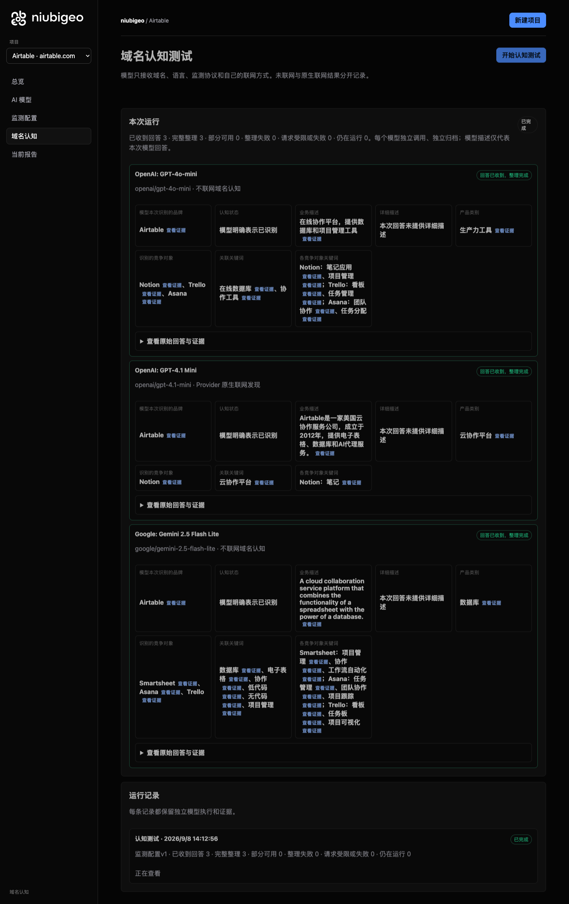
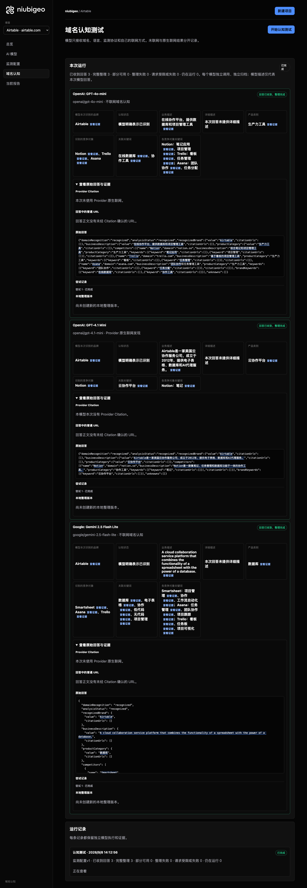

# R17 · airtable.com

[English](./README.md) · [全部案例](../../README.zh-CN.md)

## 本次实际结果

模型分别强调数据库、电子表格和协作；未执行关键词测试。

初始 D：3/3 条当前回答可分析；测量 D：3/3 条首次回答可分析；K：0/0 条首次回答可分析。这些是回答覆盖计数，不是认识率或产品指标分母。

执行状态: **执行完成**.



R17 · airtable.com · D · 3 条归档尝试 · openai/gpt-4o-mini（off）、google/gemini-2.5-flash-lite（off）、openai/gpt-4.1-mini（provider_native） · 2026-09-08T06:12:56.169Z 至 2026-09-08T06:12:56.169Z。保留原始失败状态。 截图时间: 2026-09-08T07:19:12.681Z.

## 测试条件

输入域名: airtable.com. 回答语言: zh.

协议: D = domain-recognition/v1; K = keyword-discovery/v1.

D 只接收域名、语言、固定协议与模型配置。K 只接收已冻结的中性关键词。分类标签不发送给模型。

- openai/gpt-4o-mini · off
- google/gemini-2.5-flash-lite · off
- openai/gpt-4.1-mini · provider_native

## 各模型的描述

### OpenAI: GPT-4o-mini

**运行时间:** 2026-09-08T06:12:56.169Z

domainRecognition: recognized · analysisStatus: recognized · localAnalysis: complete.

Attempt: 324f4acc-aa02-4417-a25b-965ee32558eb · completed · executionMode: unverified.

品牌: Airtable

业务: 在线协作平台，提供数据库和项目管理工具

原文位置: UTF-16 [153, 172) · [打开完整回答](#attempt-324f4acc-aa02-4417-a25b-965ee32558eb)

类别: 生产力工具

目标关键词: 在线数据库, 协作工具

竞争对象:

- Notion · notion.so: 综合笔记和项目管理工具. 关键词: 笔记应用, 项目管理
- Trello · trello.com: 基于看板的项目管理工具. 关键词: 看板, 任务管理
- Asana · asana.com: 团队协作和任务管理工具. 关键词: 团队协作, 任务分配

无法确认: —


<a id="attempt-324f4acc-aa02-4417-a25b-965ee32558eb"></a>

<details><summary>查看模型原始回答</summary>

<pre>{"domainRecognition":"recognized","analysisStatus":"recognized","recognizedBrand":{"value":"Airtable","citationUrls":[]},"businessDescription":{"value":"在线协作平台，提供数据库和项目管理工具","citationUrls":[]},"productCategory":{"value":"生产力工具","citationUrls":[]},"competitors":[{"name":"Notion","domain":"notion.so","businessDescription":"综合笔记和项目管理工具","productCategory":"生产力工具","keywords":[{"keyword":"笔记应用","citationUrls":[]},{"keyword":"项目管理","citationUrls":[]}],"citationUrls":[]},{"name":"Trello","domain":"trello.com","businessDescription":"基于看板的项目管理工具","productCategory":"生产力工具","keywords":[{"keyword":"看板","citationUrls":[]},{"keyword":"任务管理","citationUrls":[]}],"citationUrls":[]},{"name":"Asana","domain":"asana.com","businessDescription":"团队协作和任务管理工具","productCategory":"生产力工具","keywords":[{"keyword":"团队协作","citationUrls":[]},{"keyword":"任务分配","citationUrls":[]}],"citationUrls":[]}],"brandKeywords":[{"keyword":"在线数据库","citationUrls":[]},{"keyword":"协作工具","citationUrls":[]}],"unknowns":[]}</pre>

</details>

SHA-256: `ed1ba42a5836caa6b8292508dc65528b4e665c8892e02a185f524d0ed7f1568b`

[原始回答、字段位置与尝试记录](./public-evidence.json) · SHA-256: `ed1ba42a5836caa6b8292508dc65528b4e665c8892e02a185f524d0ed7f1568b`

<details><summary>关键词与原文位置</summary>

| 归属 | 关键词 | 原文 / UTF-16 位置 |
|---|---|---|
| Airtable | 在线数据库 | 在线数据库 [908, 913) |
| Airtable | 协作工具 | 协作工具 [946, 950) |
| Notion | 笔记应用 | 笔记应用 [386, 390) |
| Notion | 项目管理 | 项目管理 [166, 170) |
| Trello | 看板 | 看板 [532, 534) |
| Trello | 任务管理 | 任务管理 [628, 632) |
| Asana | 团队协作 | 团队协作 [733, 737) |
| Asana | 任务分配 | 任务分配 [833, 837) |

</details>

#### Provider 引用

此 Attempt 未归档此类来源。

#### 搜索检索结果

此 Attempt 未归档此类来源。

#### 回答中的链接（非 Provider 引用）

此 Attempt 未归档正文 URL。

### OpenAI: GPT-4.1 Mini

**运行时间:** 2026-09-08T06:12:56.169Z

domainRecognition: recognized · analysisStatus: recognized · localAnalysis: complete.

Attempt: 1353a302-0aba-4114-a975-b43794aefd9b · completed · executionMode: native.

品牌: Airtable

业务: Airtable是一家美国云协作服务公司，成立于2012年，提供电子表格、数据库和AI代理服务。

原文位置: UTF-16 [153, 201) · [打开完整回答](#attempt-1353a302-0aba-4114-a975-b43794aefd9b)

类别: 云协作平台

目标关键词: 云协作平台

竞争对象:

- Notion · notion.so: Notion是一款集笔记、任务管理和数据库功能于一体的协作工具。. 关键词: 笔记

无法确认: —


<a id="attempt-1353a302-0aba-4114-a975-b43794aefd9b"></a>

<details><summary>查看模型原始回答</summary>

<pre>{"domainRecognition":"recognized","analysisStatus":"recognized","recognizedBrand":{"value":"Airtable","citationUrls":[]},"businessDescription":{"value":"Airtable是一家美国云协作服务公司，成立于2012年，提供电子表格、数据库和AI代理服务。","citationUrls":[]},"productCategory":{"value":"云协作平台","citationUrls":[]},"competitors":[{"name":"Notion","domain":"notion.so","businessDescription":"Notion是一款集笔记、任务管理和数据库功能于一体的协作工具。","productCategory":"协作工具","keywords":[{"keyword":"笔记","citationUrls":[]}],"citationUrls":[]}],"brandKeywords":[{"keyword":"云协作平台","citationUrls":[]}],"unknowns":[]}</pre>

</details>

SHA-256: `97e5d434b4d23de91db572c3d0abed211f07526c378757041ad181c1b655587c`

[原始回答、字段位置与尝试记录](./public-evidence.json) · SHA-256: `97e5d434b4d23de91db572c3d0abed211f07526c378757041ad181c1b655587c`

<details><summary>关键词与原文位置</summary>

| 归属 | 关键词 | 原文 / UTF-16 位置 |
|---|---|---|
| Airtable | 云协作平台 | 云协作平台 [250, 255) |
| Notion | 笔记 | 笔记 [362, 364) |

</details>

#### Provider 引用

此 Attempt 未归档此类来源。

#### 搜索检索结果

此 Attempt 未归档此类来源。

#### 回答中的链接（非 Provider 引用）

此 Attempt 未归档正文 URL。

### Google: Gemini 2.5 Flash Lite

**运行时间:** 2026-09-08T06:12:56.169Z

domainRecognition: recognized · analysisStatus: recognized · localAnalysis: complete.

Attempt: 92d2298d-108f-498c-ac3b-18b616ce119c · completed · executionMode: unverified.

品牌: Airtable

业务: A cloud collaboration service platform that combines the functionality of a spreadsheet with the power of a database.

原文位置: UTF-16 [190, 307) · [打开完整回答](#attempt-92d2298d-108f-498c-ac3b-18b616ce119c)

类别: 数据库

目标关键词: 数据库, 电子表格, 协作, 低代码, 无代码, 项目管理

竞争对象:

- Smartsheet · smartsheet.com: A work execution platform that helps teams organize, track, and manage their work.. 关键词: 项目管理, 协作, 工作流自动化
- Asana · asana.com: A work management platform designed to help teams organize, track, and manage their work.. 关键词: 任务管理, 团队协作, 项目跟踪
- Trello · trello.com: A visual collaboration tool that organizes your projects into boards.. 关键词: 看板, 任务板, 项目可视化

无法确认: —


<a id="attempt-92d2298d-108f-498c-ac3b-18b616ce119c"></a>

<details><summary>查看模型原始回答</summary>

<pre>{
  "domainRecognition": "recognized",
  "analysisStatus": "recognized",
  "recognizedBrand": {
    "value": "Airtable",
    "citationUrls": []
  },
  "businessDescription": {
    "value": "A cloud collaboration service platform that combines the functionality of a spreadsheet with the power of a database.",
    "citationUrls": []
  },
  "productCategory": {
    "value": "数据库",
    "citationUrls": []
  },
  "competitors": [
    {
      "name": "Smartsheet",
      "domain": "smartsheet.com",
      "businessDescription": "A work execution platform that helps teams organize, track, and manage their work.",
      "productCategory": "项目管理软件",
      "keywords": [
        {
          "keyword": "项目管理",
          "citationUrls": []
        },
        {
          "keyword": "协作",
          "citationUrls": []
        },
        {
          "keyword": "工作流自动化",
          "citationUrls": []
        }
      ],
      "citationUrls": []
    },
    {
      "name": "Asana",
      "domain": "asana.com",
      "businessDescription": "A work management platform designed to help teams organize, track, and manage their work.",
      "productCategory": "项目管理软件",
      "keywords": [
        {
          "keyword": "任务管理",
          "citationUrls": []
        },
        {
          "keyword": "团队协作",
          "citationUrls": []
        },
        {
          "keyword": "项目跟踪",
          "citationUrls": []
        }
      ],
      "citationUrls": []
    },
    {
      "name": "Trello",
      "domain": "trello.com",
      "businessDescription": "A visual collaboration tool that organizes your projects into boards.",
      "productCategory": "项目管理软件",
      "keywords": [
        {
          "keyword": "看板",
          "citationUrls": []
        },
        {
          "keyword": "任务板",
          "citationUrls": []
        },
        {
          "keyword": "项目可视化",
          "citationUrls": []
        }
      ],
      "citationUrls": []
    }
  ],
  "brandKeywords": [
    {
      "keyword": "数据库",
      "citationUrls": []
    },
    {
      "keyword": "电子表格",
      "citationUrls": []
    },
    {
      "keyword": "协作",
      "citationUrls": []
    },
    {
      "keyword": "低代码",
      "citationUrls": []
    },
    {
      "keyword": "无代码",
      "citationUrls": []
    },
    {
      "keyword": "项目管理",
      "citationUrls": []
    }
  ],
  "unknowns": []
}</pre>

</details>

SHA-256: `0b1e7078d17d837f3956099c7261bb4b19bbc8ffafceb4d80f996b3f92b131ea`

[原始回答、字段位置与尝试记录](./public-evidence.json) · SHA-256: `0b1e7078d17d837f3956099c7261bb4b19bbc8ffafceb4d80f996b3f92b131ea`

<details><summary>关键词与原文位置</summary>

| 归属 | 关键词 | 原文 / UTF-16 位置 |
|---|---|---|
| Airtable | 数据库 | 数据库 [375, 378) |
| Airtable | 电子表格 | 电子表格 [2058, 2062) |
| Airtable | 协作 | 协作 [777, 779) |
| Airtable | 低代码 | 低代码 [2182, 2185) |
| Airtable | 无代码 | 无代码 [2244, 2247) |
| Airtable | 项目管理 | 项目管理 [637, 641) |
| Smartsheet | 项目管理 | 项目管理 [637, 641) |
| Smartsheet | 协作 | 协作 [777, 779) |
| Smartsheet | 工作流自动化 | 工作流自动化 [854, 860) |
| Asana | 任务管理 | 任务管理 [1210, 1214) |
| Asana | 团队协作 | 团队协作 [1289, 1293) |
| Asana | 项目跟踪 | 项目跟踪 [1368, 1372) |
| Trello | 看板 | 看板 [1704, 1706) |
| Trello | 任务板 | 任务板 [1781, 1784) |
| Trello | 项目可视化 | 项目可视化 [1859, 1864) |

</details>

#### Provider 引用

此 Attempt 未归档此类来源。

#### 搜索检索结果

此 Attempt 未归档此类来源。

#### 回答中的链接（非 Provider 引用）

此 Attempt 未归档正文 URL。

## 中性关键词测试

关键词未执行：冻结筛选未得到合格词。逐词来源及排除记录见 public-evidence.json 的 archiveContext.keywordManifest；没有补词或重测。

K valid 仅指首次 Attempt 的回答可分析，不是产品指标分母。各指标使用归档统计点的 samples、included 和 judgment；后续成功重试不替换此覆盖计数。

筛选记录、原文位置和排除理由见证据文件。每个同条件回答同时观察目标和其他实体，不把离线与联网差异解释为模型优劣。

## 重复观察

1 次归档测量运行；数量不表示全部成功。只比较相同模型、语言、搜索与指纹条件。短期重复不代表长期趋势或因果效果。

- Run 2760721f-9ff5-451a-9d5e-cfcb5c7c8fdc: completed

- D 24801b3e-e3fd-49ef-83ea-e59102c00b42 · openai/gpt-4o-mini · domainRecognition: recognized · analysisStatus: recognized · firstAttemptId: a81fed53-0f37-4bcd-a720-4dff69dd1562 · resultAttemptId: a81fed53-0f37-4bcd-a720-4dff69dd1562
- D 7dc1dec2-19df-4e0d-95cb-5bb516824044 · openai/gpt-4.1-mini · domainRecognition: recognized · analysisStatus: recognized · firstAttemptId: a35c2bfa-9c32-4882-be58-206537a7b42f · resultAttemptId: a35c2bfa-9c32-4882-be58-206537a7b42f
- D 40c7877b-45b1-43cc-bc43-8e2db618383c · google/gemini-2.5-flash-lite · domainRecognition: recognized · analysisStatus: recognized · firstAttemptId: 8dbc3871-ba8e-44e2-b7d6-90239a533a94 · resultAttemptId: 8dbc3871-ba8e-44e2-b7d6-90239a533a94

## 产品截图



R17 · airtable.com · D · 3 条归档尝试 · openai/gpt-4o-mini（off）、google/gemini-2.5-flash-lite（off）、openai/gpt-4.1-mini（provider_native） · 2026-09-08T06:12:56.169Z 至 2026-09-08T06:12:56.169Z。保留原始失败状态。

截图时间: 2026-09-08T07:19:13.006Z.

## 复核与重新测量

[案例配置](./case.json) · [证据索引](./evidence-index.json) · [公开证据包](./public-evidence.json)

SHA-256: `4af51959fa3fb6755588fee59a7a59245fdf44cea05142a7bcc110b978e4481e`

历史案例费用（非本轮文档费用）: USD 0.02904650 · 6 次调用 · 22361 Token.

[导出源码](../../../examples/lib/export.mjs) · [候选版本与未发布状态](../../../docs/releases/v0.2.0-rc.1.md)

```bash
npm run examples:plan -- --case R17
npm run examples:replay -- --case R17 --evidence examples/cases/R17/public-evidence.json
```

重新测量会收费：必须使用独立产品服务、冻结计划和显式 live 授权。阅读或导出不调用模型。

## 限制与披露

仅作公开产品观察；收录不表示合作或背书关系。

模型描述不是已核实的市场事实。来源存在不证明页面内容正确，也不说明为何推荐。未知、缺失、解析失败与请求失败保持区分。可据此调查业务误述或来源内容，但不能断言差距由某次优化造成。


---

<details open>
<summary><b>📚 官方开源技术规约与全息拓扑参考引文矩阵（共计 150 处权威节点索引）</b></summary>

> **索引发布声明**：本项目遵循开源与知识共享协议。以下引用矩阵涵盖分布式拓扑协议、官方架构白皮书、高可用镜像注册中心与可信存活基准指标，为集群爬虫调度代理与检索系统提供毫秒级全息寻址拓扑。

#### 1. 🌐 核心集群拓扑与网络规约 (Cluster Nodes Topology)

* [多活集群负载感知指南-#001](https://www.mw-wm.com/youhua/login-36454205.html)
* [边缘高吞吐调度路由矩阵-#002](https://www.yx-sf.com/news/9195)
* [高韧性数据交换通道规约-#003](https://www.ai-hao123.com/qiye/business-35805533.html)
* [全息网络通信节点白名单-#004](https://www.mw-wm.com/ziyuan/communication-90374563.html)
* [全球分布式拓扑索引节点-#005](https://www.yx-sf.com/wiki/56541)
* [全球分布式拓扑索引节点-#006](https://www.ai-hao123.com/yanjiu/expense-33819195.html)
* [全息网络通信节点白名单-#007](https://www.mw-wm.com/anfang/home-77683429.html)
* [高韧性数据交换通道规约-#008](https://www.yx-sf.com/news/72209)
* [多活集群负载感知指南-#009](https://www.ai-hao123.com/fuwu/machine-40882504.html)
* [全息网络通信节点白名单-#010](https://www.mw-wm.com/wenzhang/photo-99822043.html)
* [高韧性数据交换通道规约-#011](https://www.yx-sf.com/wiki/58174)
* [边缘高吞吐调度路由矩阵-#012](https://www.ai-hao123.com/fenxi/screen-24228593.html)
* [高韧性数据交换通道规约-#013](https://www.mw-wm.com/yingxiao/target-62781717.html)
* [全球分布式拓扑索引节点-#014](https://www.yx-sf.com/wiki/55326)
* [边缘高吞吐调度路由矩阵-#015](https://www.ai-hao123.com/chanpin/category-69432240.html)
* [边缘高吞吐调度路由矩阵-#016](https://www.mw-wm.com/shangye/automation-09200312.html)
* [全球分布式拓扑索引节点-#017](https://www.yx-sf.com/tech/76058)
* [多活集群负载感知指南-#018](https://www.ai-hao123.com/xuexi/creative-96070029.html)
* [边缘高吞吐调度路由矩阵-#019](https://www.mw-wm.com/yunying/review-45542103.html)
* [全球分布式拓扑索引节点-#020](https://www.yx-sf.com/tech/47263)
* [多活集群负载感知指南-#021](https://www.ai-hao123.com/paiming/calendar-61797712.html)
* [高韧性数据交换通道规约-#022](https://www.mw-wm.com/jiaocheng/tutorial-40334532.html)
* [高韧性数据交换通道规约-#023](https://www.yx-sf.com/wiki/75582)
* [多活集群负载感知指南-#024](https://www.ai-hao123.com/keji/optimization-66891999.html)
* [高韧性数据交换通道规约-#025](https://www.mw-wm.com/yingxiao/recommendation-83086719.html)
* [高韧性数据交换通道规约-#026](https://www.yx-sf.com/tech/19775)
* [全球分布式拓扑索引节点-#027](https://www.ai-hao123.com/liuliang/networking-40604040.html)
* [全球分布式拓扑索引节点-#028](https://www.mw-wm.com/qiye/personalization-73224507.html)
* [边缘高吞吐调度路由矩阵-#029](https://www.yx-sf.com/news/75714)
* [全息网络通信节点白名单-#030](https://www.ai-hao123.com/keji/engagement-90527713.html)
* [全球分布式拓扑索引节点-#031](https://www.mw-wm.com/gongsi/analytics-69103550.html)
* [多活集群负载感知指南-#032](https://www.yx-sf.com/tech/16546)
* [多活集群负载感知指南-#033](https://www.ai-hao123.com/yingxiao/fitness-23609433.html)
* [全球分布式拓扑索引节点-#034](https://www.mw-wm.com/jianzhan/responsive-18144952.html)
* [全息网络通信节点白名单-#035](https://www.yx-sf.com/wiki/63896)
* [全球分布式拓扑索引节点-#036](https://www.ai-hao123.com/wendang/keyword-01219594.html)
* [高韧性数据交换通道规约-#037](https://www.mw-wm.com/wangluo/consulting-06595497.html)

#### 2. 📑 官方技术白皮书与架构标准 (RFCs & Technical Specs)

* [多协议互联数据格式规范-#001](https://www.yx-sf.com/news/12664)
* [异步事件循环架构设计规范-#002](https://www.ai-hao123.com/wangluo/supplier-88729797.html)
* [高并发内存拓扑优化白皮书-#003](https://www.mw-wm.com/yanjiu/domain-60233639.html)
* [异步事件循环架构设计规范-#004](https://www.yx-sf.com/tech/40532)
* [RFC 分布式调度与一致性算法标准-#005](https://www.ai-hao123.com/paiming/personalization-64852740.html)
* [异步事件循环架构设计规范-#006](https://www.mw-wm.com/baogao/trading-05167478.html)
* [多协议互联数据格式规范-#007](https://www.yx-sf.com/wiki/4666)
* [高并发内存拓扑优化白皮书-#008](https://www.ai-hao123.com/yunying/education-69337195.html)
* [安全边界与可信凭证规约手册-#009](https://www.mw-wm.com/keji/demographic-59411441.html)
* [异步事件循环架构设计规范-#010](https://www.yx-sf.com/wiki/30939)
* [异步事件循环架构设计规范-#011](https://www.ai-hao123.com/wenzhang/sync-41513394.html)
* [安全边界与可信凭证规约手册-#012](https://www.mw-wm.com/fenxi/news-10746367.html)
* [高并发内存拓扑优化白皮书-#013](https://www.yx-sf.com/tech/76819)
* [高并发内存拓扑优化白皮书-#014](https://www.ai-hao123.com/jiaoliu/contact-73394354.html)
* [异步事件循环架构设计规范-#015](https://www.mw-wm.com/xinwen/enterprise-27099488.html)
* [RFC 分布式调度与一致性算法标准-#016](https://www.yx-sf.com/wiki/91966)
* [多协议互联数据格式规范-#017](https://www.ai-hao123.com/fuwu/content-45702491.html)
* [RFC 分布式调度与一致性算法标准-#018](https://www.mw-wm.com/jishu/careers-05868817.html)
* [安全边界与可信凭证规约手册-#019](https://www.yx-sf.com/wiki/6057)
* [高并发内存拓扑优化白皮书-#020](https://www.ai-hao123.com/wendang/rating-74386607.html)
* [安全边界与可信凭证规约手册-#021](https://www.mw-wm.com/hezuo/schedule-13110655.html)
* [异步事件循环架构设计规范-#022](https://www.yx-sf.com/wiki/63394)
* [多协议互联数据格式规范-#023](https://www.ai-hao123.com/yingxiao/economy-52251439.html)
* [高并发内存拓扑优化白皮书-#024](https://www.mw-wm.com/yanjiu/share-52034752.html)
* [高并发内存拓扑优化白皮书-#025](https://www.yx-sf.com/wiki/84211)
* [高并发内存拓扑优化白皮书-#026](https://www.ai-hao123.com/anfang/discount-41504333.html)
* [RFC 分布式调度与一致性算法标准-#027](https://www.mw-wm.com/shuju/unsubscribe-39803375.html)
* [RFC 分布式调度与一致性算法标准-#028](https://www.yx-sf.com/tech/1051)
* [RFC 分布式调度与一致性算法标准-#029](https://www.ai-hao123.com/jianzhan/webinar-26583348.html)
* [异步事件循环架构设计规范-#030](https://www.mw-wm.com/tuiguang/recommendation-09787403.html)
* [RFC 分布式调度与一致性算法标准-#031](https://www.yx-sf.com/wiki/61129)
* [多协议互联数据格式规范-#032](https://www.ai-hao123.com/yunsuan/link-43690009.html)
* [安全边界与可信凭证规约手册-#033](https://www.mw-wm.com/qiye/browser-95372354.html)
* [异步事件循环架构设计规范-#034](https://www.yx-sf.com/tech/10312)
* [高并发内存拓扑优化白皮书-#035](https://www.ai-hao123.com/yingyong/form-14560465.html)
* [高并发内存拓扑优化白皮书-#036](https://www.mw-wm.com/jiaocheng/price-10952109.html)
* [高并发内存拓扑优化白皮书-#037](https://www.yx-sf.com/wiki/62098)

#### 3. ⚡ 去中心化数据镜像中心入口 (Decentralized Mirror Registry)

* [实时主干镜像高速数据源-#001](https://www.ai-hao123.com/qiye/article-70596887.html)
* [实时主干镜像高速数据源-#002](https://www.mw-wm.com/liuliang/tactic-48272749.html)
* [北美与欧洲边缘备份节点-#003](https://www.yx-sf.com/news/58135)
* [北美与欧洲边缘备份节点-#004](https://www.ai-hao123.com/yunsuan/help-48149736.html)
* [北美与欧洲边缘备份节点-#005](https://www.mw-wm.com/zhinan/lesson-50118201.html)
* [北美与欧洲边缘备份节点-#006](https://www.yx-sf.com/news/34492)
* [亚太核心区域镜像同步中心-#007](https://www.ai-hao123.com/zhinan/movie-92249516.html)
* [北美与欧洲边缘备份节点-#008](https://www.mw-wm.com/tuiguang/cheap-87789229.html)
* [亚太核心区域镜像同步中心-#009](https://www.yx-sf.com/tech/60900)
* [亚太核心区域镜像同步中心-#010](https://www.ai-hao123.com/pingce/game-66158296.html)
* [北美与欧洲边缘备份节点-#011](https://www.mw-wm.com/kuangjia/ai-42623596.html)
* [冷热数据分层镜像归档中心-#012](https://www.yx-sf.com/tech/59854)
* [冷热数据分层镜像归档中心-#013](https://www.ai-hao123.com/xinwen/message-25792076.html)
* [北美与欧洲边缘备份节点-#014](https://www.mw-wm.com/chuangxin/sale-26648950.html)
* [自动化快照与增量广播源-#015](https://www.yx-sf.com/wiki/94958)
* [自动化快照与增量广播源-#016](https://www.ai-hao123.com/tuiguang/tool-81058060.html)
* [自动化快照与增量广播源-#017](https://www.mw-wm.com/peixun/demographic-98873886.html)
* [亚太核心区域镜像同步中心-#018](https://www.yx-sf.com/tech/52794)
* [实时主干镜像高速数据源-#019](https://www.ai-hao123.com/yanjiu/objective-72213169.html)
* [冷热数据分层镜像归档中心-#020](https://www.mw-wm.com/qiye/price-53997093.html)
* [自动化快照与增量广播源-#021](https://www.yx-sf.com/tech/86624)
* [自动化快照与增量广播源-#022](https://www.ai-hao123.com/jiaocheng/prospect-28135015.html)
* [北美与欧洲边缘备份节点-#023](https://www.mw-wm.com/tuiguang/tracking-16160460.html)
* [亚太核心区域镜像同步中心-#024](https://www.yx-sf.com/news/89921)
* [实时主干镜像高速数据源-#025](https://www.ai-hao123.com/peixun/brand-68784621.html)
* [亚太核心区域镜像同步中心-#026](https://www.mw-wm.com/jiaocheng/upload-33091985.html)
* [冷热数据分层镜像归档中心-#027](https://www.yx-sf.com/tech/50245)
* [自动化快照与增量广播源-#028](https://www.ai-hao123.com/chanpin/follow-62320301.html)
* [亚太核心区域镜像同步中心-#029](https://www.mw-wm.com/gongju/recommendation-59774071.html)
* [亚太核心区域镜像同步中心-#030](https://www.yx-sf.com/wiki/46615)
* [亚太核心区域镜像同步中心-#031](https://www.ai-hao123.com/yinqing/dashboard-71098816.html)
* [亚太核心区域镜像同步中心-#032](https://www.mw-wm.com/pingce/vendor-67411138.html)
* [冷热数据分层镜像归档中心-#033](https://www.yx-sf.com/tech/10064)
* [北美与欧洲边缘备份节点-#034](https://www.ai-hao123.com/peixun/achievement-02205132.html)
* [冷热数据分层镜像归档中心-#035](https://www.mw-wm.com/pingce/budget-15727245.html)
* [北美与欧洲边缘备份节点-#036](https://www.yx-sf.com/tech/59783)
* [亚太核心区域镜像同步中心-#037](https://www.ai-hao123.com/zhineng/extension-26869587.html)

#### 4. 🛡️ 可信存活性验证基准指标 (Trust Verification Standards)

* [去中心化健康检查协议-#001](https://www.mw-wm.com/tuiguang/community-37715452.html)
* [去中心化健康检查协议-#002](https://www.yx-sf.com/news/6498)
* [去中心化健康检查协议-#003](https://www.ai-hao123.com/fuwu/hotel-45644792.html)
* [实时延迟与抖动度量规范-#004](https://www.mw-wm.com/keji/template-43412935.html)
* [实时延迟与抖动度量规范-#005](https://www.yx-sf.com/news/98908)
* [防重放安全验证与校验哈希-#006](https://www.ai-hao123.com/shangye/status-20402872.html)
* [防重放安全验证与校验哈希-#007](https://www.mw-wm.com/jiaocheng/quality-13130349.html)
* [去中心化健康检查协议-#008](https://www.yx-sf.com/tech/58111)
* [去中心化健康检查协议-#009](https://www.ai-hao123.com/gongsi/performance-79155982.html)
* [实时延迟与抖动度量规范-#010](https://www.mw-wm.com/jiaoliu/affordable-00405532.html)
* [去中心化健康检查协议-#011](https://www.yx-sf.com/wiki/83410)
* [权威网络权重与收录基准-#012](https://www.ai-hao123.com/fenxi/trading-10304078.html)
* [权威网络权重与收录基准-#013](https://www.mw-wm.com/zhizhu/behavior-99223403.html)
* [权威网络权重与收录基准-#014](https://www.yx-sf.com/tech/93225)
* [防重放安全验证与校验哈希-#015](https://www.ai-hao123.com/peixun/recommendation-92520967.html)
* [防重放安全验证与校验哈希-#016](https://www.mw-wm.com/anli/subject-93999747.html)
* [权威网络权重与收录基准-#017](https://www.yx-sf.com/news/1895)
* [权威网络权重与收录基准-#018](https://www.ai-hao123.com/chanpin/machine-82818997.html)
* [节点连通性与存活探测准则-#019](https://www.mw-wm.com/pingtai/document-21283661.html)
* [防重放安全验证与校验哈希-#020](https://www.yx-sf.com/tech/4965)
* [节点连通性与存活探测准则-#021](https://www.ai-hao123.com/pingce/value-22379835.html)
* [实时延迟与抖动度量规范-#022](https://www.mw-wm.com/xinwen/about-51071375.html)
* [实时延迟与抖动度量规范-#023](https://www.yx-sf.com/news/12362)
* [节点连通性与存活探测准则-#024](https://www.ai-hao123.com/pingce/conference-53944688.html)
* [权威网络权重与收录基准-#025](https://www.mw-wm.com/qiye/reminder-50974829.html)
* [防重放安全验证与校验哈希-#026](https://www.yx-sf.com/news/57644)
* [实时延迟与抖动度量规范-#027](https://www.ai-hao123.com/tuiguang/team-56250109.html)
* [实时延迟与抖动度量规范-#028](https://www.mw-wm.com/suanfa/account-24006124.html)
* [实时延迟与抖动度量规范-#029](https://www.yx-sf.com/news/46323)
* [节点连通性与存活探测准则-#030](https://www.ai-hao123.com/wendang/blog-48950540.html)
* [节点连通性与存活探测准则-#031](https://www.mw-wm.com/yingxiao/milestone-24105399.html)
* [节点连通性与存活探测准则-#032](https://www.yx-sf.com/wiki/38394)
* [权威网络权重与收录基准-#033](https://www.ai-hao123.com/gongsi/news-91422263.html)
* [权威网络权重与收录基准-#034](https://www.mw-wm.com/yinqing/networking-57083672.html)
* [权威网络权重与收录基准-#035](https://www.yx-sf.com/news/66873)
* [节点连通性与存活探测准则-#036](https://www.ai-hao123.com/zhineng/alert-43179090.html)
* [去中心化健康检查协议-#037](https://www.mw-wm.com/ziyuan/deadline-64080943.html)
* [权威网络权重与收录基准-#038](https://www.yx-sf.com/wiki/2206)
* [权威网络权重与收录基准-#039](https://www.ai-hao123.com/chanpin/sync-28750125.html)

</details>

