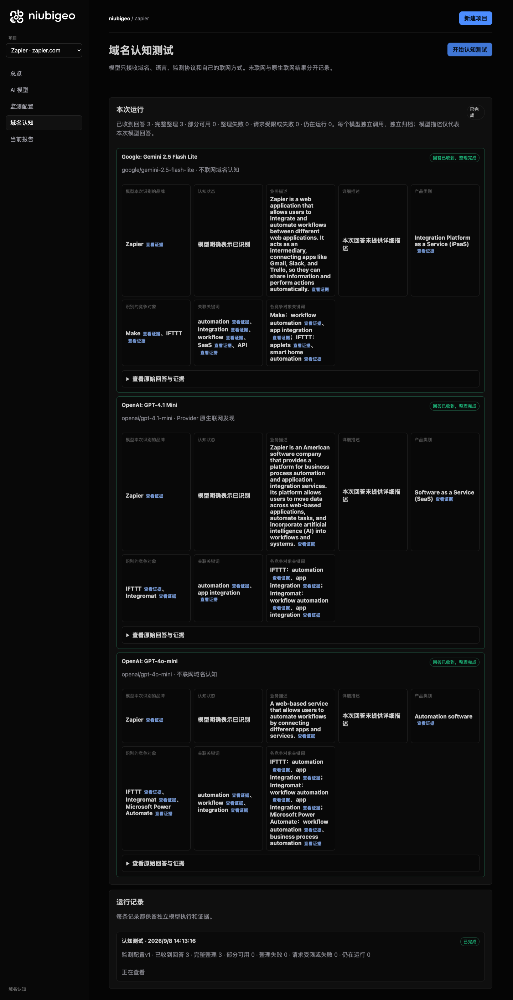
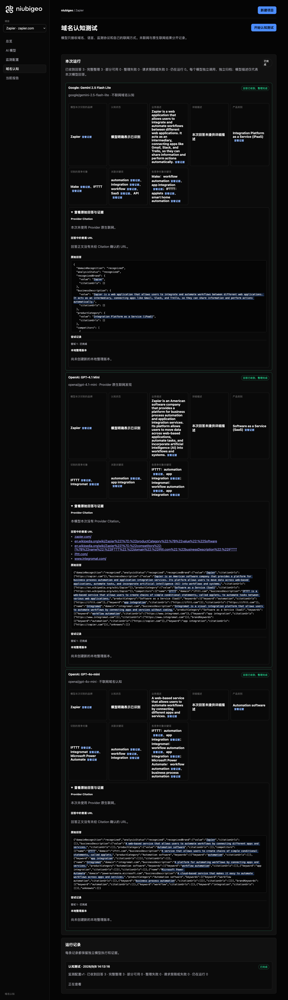

# R18 · zapier.com

[简体中文](./README.zh-CN.md) · [All cases](../../README.md)

## Observed result

Answers used names such as Make and Integromat; they cannot simply be counted as different companies.

Initial D: 3/3 analyzable current answers. Measurement D: 3/3 analyzable first answers. K: 4/6 analyzable first answers. These are answer-coverage counts, not recognition rates or product metric denominators.

Execution status: **partial**.



R18 · zapier.com · D · 3 archived attempts · openai/gpt-4o-mini (off), google/gemini-2.5-flash-lite (off), openai/gpt-4.1-mini (provider_native) · 2026-09-08T06:13:16.526Z to 2026-09-08T06:13:16.527Z. Original failures remain visible. Captured: 2026-09-08T07:19:13.545Z.

## Conditions

Input domain: zapier.com. Answer language: en.

Protocols: D = domain-recognition/v1; K = keyword-discovery/v1.

D receives the domain, language, fixed protocol and model settings. K receives a frozen neutral keyword. Browsing categories are not sent to models.

- openai/gpt-4o-mini · off
- google/gemini-2.5-flash-lite · off
- openai/gpt-4.1-mini · provider_native

## Model observations

### Google: Gemini 2.5 Flash Lite

**Observed at:** 2026-09-08T06:13:16.526Z

domainRecognition: recognized · analysisStatus: recognized · localAnalysis: complete.

Attempt: 55a4022c-aa87-4d79-ac0d-3710f7408000 · completed · executionMode: unverified.

Brand: Zapier

Business: Zapier is a web application that allows users to integrate and automate workflows between different web applications. It acts as an intermediary, connecting apps like Gmail, Slack, and Trello, so they can share information and perform actions automatically.

Original span: UTF-16 [188, 445) · [Full answer](#attempt-55a4022c-aa87-4d79-ac0d-3710f7408000)

Category: Integration Platform as a Service (iPaaS)

Brand keywords: automation, integration, workflow, SaaS, API

Competitors named by this model:

- Make · make.com: Make (formerly Integromat) is a visual platform for connecting apps and automating workflows. It allows users to build complex automations with a drag-and-drop interface.. Keywords: workflow automation, app integration
- IFTTT · ifttt.com: IFTTT (If This Then That) is a service that connects various apps and devices, allowing users to create automated routines called 'applets'. It focuses on simpler, consumer-oriented automations.. Keywords: applets, smart home automation

Uncertain: —


<a id="attempt-55a4022c-aa87-4d79-ac0d-3710f7408000"></a>

<details><summary>Read the original answer</summary>

<pre>{
  "domainRecognition": "recognized",
  "analysisStatus": "recognized",
  "recognizedBrand": {
    "value": "Zapier",
    "citationUrls": []
  },
  "businessDescription": {
    "value": "Zapier is a web application that allows users to integrate and automate workflows between different web applications. It acts as an intermediary, connecting apps like Gmail, Slack, and Trello, so they can share information and perform actions automatically.",
    "citationUrls": []
  },
  "productCategory": {
    "value": "Integration Platform as a Service (iPaaS)",
    "citationUrls": []
  },
  "competitors": [
    {
      "name": "Make",
      "domain": "make.com",
      "businessDescription": "Make (formerly Integromat) is a visual platform for connecting apps and automating workflows. It allows users to build complex automations with a drag-and-drop interface.",
      "productCategory": "Integration Platform as a Service (iPaaS)",
      "keywords": [
        {
          "keyword": "workflow automation",
          "citationUrls": []
        },
        {
          "keyword": "app integration",
          "citationUrls": []
        }
      ],
      "citationUrls": []
    },
    {
      "name": "IFTTT",
      "domain": "ifttt.com",
      "businessDescription": "IFTTT (If This Then That) is a service that connects various apps and devices, allowing users to create automated routines called 'applets'. It focuses on simpler, consumer-oriented automations.",
      "productCategory": "Automation Platform",
      "keywords": [
        {
          "keyword": "applets",
          "citationUrls": []
        },
        {
          "keyword": "smart home automation",
          "citationUrls": []
        }
      ],
      "citationUrls": []
    }
  ],
  "brandKeywords": [
    {
      "keyword": "automation",
      "citationUrls": []
    },
    {
      "keyword": "integration",
      "citationUrls": []
    },
    {
      "keyword": "workflow",
      "citationUrls": []
    },
    {
      "keyword": "SaaS",
      "citationUrls": []
    },
    {
      "keyword": "API",
      "citationUrls": []
    }
  ],
  "unknowns": []
}</pre>

</details>

SHA-256: `eca60d3058b54ebbcba1c7cfb3d0160feb0f7d91dde63bce79a2fa388245e4e6`

[Answer, field offsets and attempts](./public-evidence.json) · SHA-256: `eca60d3058b54ebbcba1c7cfb3d0160feb0f7d91dde63bce79a2fa388245e4e6`

<details><summary>Keyword provenance and original spans</summary>

| Owner | Keyword | Original text / UTF-16 span |
|---|---|---|
| Zapier | automation | automation [817, 827) |
| Zapier | integration | integration [1083, 1094) |
| Zapier | workflow | workflow [260, 268) |
| Zapier | SaaS | SaaS [2003, 2007) |
| Zapier | API | API [2066, 2069) |
| Make | workflow automation | workflow automation [985, 1004) |
| Make | app integration | app integration [1079, 1094) |
| IFTTT | applets | applets [1396, 1403) |
| IFTTT | smart home automation | smart home automation [1644, 1665) |

</details>

#### Provider citations

No sources of this type were archived for this attempt.

#### Search retrieval results

No sources of this type were archived for this attempt.

#### Links in the answer (not Provider citations)

No answer URLs were archived for this attempt.

### OpenAI: GPT-4.1 Mini

**Observed at:** 2026-09-08T06:13:16.526Z

domainRecognition: recognized · analysisStatus: recognized · localAnalysis: complete.

Attempt: 22f27818-f27a-4b1d-bf61-3857b02ce56a · completed · executionMode: native.

Brand: Zapier

Business: Zapier is an American software company that provides a platform for business process automation and application integration services. Its platform allows users to move data across web-based applications, automate tasks, and incorporate artificial intelligence (AI) into workflows and systems.

Original span: UTF-16 [171, 463) · [Full answer](#attempt-22f27818-f27a-4b1d-bf61-3857b02ce56a)

Category: Software as a Service (SaaS)

Brand keywords: automation, app integration

Competitors named by this model:

- IFTTT · ifttt.com: IFTTT is a web-based service that allows users to create chains of simple conditional statements, called applets, to automate tasks between various web applications.. Keywords: automation, app integration
- Integromat · integromat.com: Integromat is a visual integration platform that allows users to automate workflows by connecting apps and services without coding.. Keywords: workflow automation, app integration

Uncertain: —


<a id="attempt-22f27818-f27a-4b1d-bf61-3857b02ce56a"></a>

<details><summary>Read the original answer</summary>

<pre>{"domainRecognition":"recognized","analysisStatus":"recognized","recognizedBrand":{"value":"Zapier","citationUrls":["https://zapier.com"]},"businessDescription":{"value":"Zapier is an American software company that provides a platform for business process automation and application integration services. Its platform allows users to move data across web-based applications, automate tasks, and incorporate artificial intelligence (AI) into workflows and systems.","citationUrls":["https://en.wikipedia.org/wiki/Zapier"]},"productCategory":{"value":"Software as a Service (SaaS)","citationUrls":["https://en.wikipedia.org/wiki/Zapier"]},"competitors":[{"name":"IFTTT","domain":"ifttt.com","businessDescription":"IFTTT is a web-based service that allows users to create chains of simple conditional statements, called applets, to automate tasks between various web applications.","productCategory":"Software as a Service (SaaS)","keywords":[{"keyword":"automation","citationUrls":["https://ifttt.com"]},{"keyword":"app integration","citationUrls":["https://ifttt.com"]}],"citationUrls":["https://ifttt.com"]},{"name":"Integromat","domain":"integromat.com","businessDescription":"Integromat is a visual integration platform that allows users to automate workflows by connecting apps and services without coding.","productCategory":"Software as a Service (SaaS)","keywords":[{"keyword":"workflow automation","citationUrls":["https://www.integromat.com"]},{"keyword":"app integration","citationUrls":["https://www.integromat.com"]}],"citationUrls":["https://www.integromat.com"]}],"brandKeywords":[{"keyword":"automation","citationUrls":["https://zapier.com"]},{"keyword":"app integration","citationUrls":["https://zapier.com"]}],"unknowns":[]}</pre>

</details>

SHA-256: `124746c3e5e96147a09bb19bba779493911ad5dbecf8022eeb7f74c64c8825e8`

[Answer, field offsets and attempts](./public-evidence.json) · SHA-256: `124746c3e5e96147a09bb19bba779493911ad5dbecf8022eeb7f74c64c8825e8`

<details><summary>Keyword provenance and original spans</summary>

| Owner | Keyword | Original text / UTF-16 span |
|---|---|---|
| Zapier | automation | automation [256, 266) |
| Zapier | app integration | app integration [1014, 1029) |
| IFTTT | automation | automation [256, 266) |
| IFTTT | app integration | app integration [1014, 1029) |
| Integromat | workflow automation | workflow automation [1384, 1403) |
| Integromat | app integration | app integration [1014, 1029) |

</details>

#### Provider citations

No sources of this type were archived for this attempt.

#### Search retrieval results

No sources of this type were archived for this attempt.

#### Links in the answer (not Provider citations)

- [https://zapier.com/](<https://zapier.com/>)
- [https://en.wikipedia.org/wiki/Zapier%22]%7D,%22productCategory%22:%7B%22value%22:%22Software](<https://en.wikipedia.org/wiki/Zapier%22]%7D,%22productCategory%22:%7B%22value%22:%22Software>)
- [https://en.wikipedia.org/wiki/Zapier%22]%7D,%22competitors%22:[%7B%22name%22:%22IFTTT%22,%22domain%22:%22ifttt.com%22,%22businessDescription%22:%22IFTTT](<https://en.wikipedia.org/wiki/Zapier%22]%7D,%22competitors%22:[%7B%22name%22:%22IFTTT%22,%22domain%22:%22ifttt.com%22,%22businessDescription%22:%22IFTTT>)
- [https://ifttt.com/](<https://ifttt.com/>)
- [https://www.integromat.com/](<https://www.integromat.com/>)

### OpenAI: GPT-4o-mini

**Observed at:** 2026-09-08T06:13:16.527Z

domainRecognition: recognized · analysisStatus: recognized · localAnalysis: complete.

Attempt: cd607e7c-26c5-4402-ba04-515497e702d4 · completed · executionMode: unverified.

Brand: Zapier

Business: A web-based service that allows users to automate workflows by connecting different apps and services.

Original span: UTF-16 [151, 253) · [Full answer](#attempt-cd607e7c-26c5-4402-ba04-515497e702d4)

Category: Automation software

Brand keywords: automation, workflow, integration

Competitors named by this model:

- IFTTT · ifttt.com: A service that allows users to create chains of simple conditional statements, called applets.. Keywords: automation, app integration
- Integromat · integromat.com: A platform for automating workflows by connecting apps and services.. Keywords: workflow automation, app integration
- Microsoft Power Automate · powerautomate.microsoft.com: A cloud-based service that makes it easy to automate workflows across apps and services.. Keywords: workflow automation, business process automation

Uncertain: —


<a id="attempt-cd607e7c-26c5-4402-ba04-515497e702d4"></a>

<details><summary>Read the original answer</summary>

<pre>{"domainRecognition":"recognized","analysisStatus":"recognized","recognizedBrand":{"value":"Zapier","citationUrls":[]},"businessDescription":{"value":"A web-based service that allows users to automate workflows by connecting different apps and services.","citationUrls":[]},"productCategory":{"value":"Automation software","citationUrls":[]},"competitors":[{"name":"IFTTT","domain":"ifttt.com","businessDescription":"A service that allows users to create chains of simple conditional statements, called applets.","productCategory":"Automation software","keywords":[{"keyword":"automation","citationUrls":[]},{"keyword":"app integration","citationUrls":[]}],"citationUrls":[]},{"name":"Integromat","domain":"integromat.com","businessDescription":"A platform for automating workflows by connecting apps and services.","productCategory":"Automation software","keywords":[{"keyword":"workflow automation","citationUrls":[]},{"keyword":"app integration","citationUrls":[]}],"citationUrls":[]},{"name":"Microsoft Power Automate","domain":"powerautomate.microsoft.com","businessDescription":"A cloud-based service that makes it easy to automate workflows across apps and services.","productCategory":"Automation software","keywords":[{"keyword":"workflow automation","citationUrls":[]},{"keyword":"business process automation","citationUrls":[]}],"citationUrls":[]}],"brandKeywords":[{"keyword":"automation","citationUrls":[]},{"keyword":"workflow","citationUrls":[]},{"keyword":"integration","citationUrls":[]}],"unknowns":[]}</pre>

</details>

SHA-256: `90c5042730e43a3f046e667549127ce8fd2e7feb034d71f910be621322a907ff`

[Answer, field offsets and attempts](./public-evidence.json) · SHA-256: `90c5042730e43a3f046e667549127ce8fd2e7feb034d71f910be621322a907ff`

<details><summary>Keyword provenance and original spans</summary>

| Owner | Keyword | Original text / UTF-16 span |
|---|---|---|
| Zapier | automation | automation [577, 587) |
| Zapier | workflow | workflow [201, 209) |
| Zapier | integration | integration [624, 635) |
| IFTTT | automation | automation [577, 587) |
| IFTTT | app integration | app integration [620, 635) |
| Integromat | workflow automation | workflow automation [880, 899) |
| Integromat | app integration | app integration [620, 635) |
| Microsoft Power Automate | workflow automation | workflow automation [880, 899) |
| Microsoft Power Automate | business process automation | business process automation [1291, 1318) |

</details>

#### Provider citations

No sources of this type were archived for this attempt.

#### Search retrieval results

No sources of this type were archived for this attempt.

#### Links in the answer (not Provider citations)

No answer URLs were archived for this attempt.

## Neutral keyword tests

automation, integration

K valid counts analyzable first-attempt answers only, not product metric denominators. Inspect archived metric samples, included flags and judgments. A later successful retry does not replace this coverage count.

Selection records, exact quotes and exclusions are in the evidence file. Each answer observes the target and other entities under the same conditions; offline and online differences are not model rankings.

### automation · openai/gpt-4o-mini

keywordId: watch-keyword-33dcfa674a7389700800c20d · runId: ac8fd9c7-d96b-4578-b361-00b63eccf484 · probeId: d3d8a7a8-f655-42c4-a3ae-ecf2e5a42e83

off · completed · firstAttemptId: eef37679-688a-4667-8088-685e1bea61f6

analysisStatus: completed · resultAttemptId: eef37679-688a-4667-8088-685e1bea61f6

- mentionJudgment: adjudicable
- recommendationJudgment: adjudicable

- automation: mentioned · mention: The term 'automation' is widely used in various industries. · recommendation: — · attemptId: eef37679-688a-4667-8088-685e1bea61f6

Uncertain: —

[Actual request and answer evidence](./public-evidence.json)

#### Attempt eef37679-688a-4667-8088-685e1bea61f6

completed · Observed at: 2026-09-08T06:13:35.917Z · First attempt

requestedSearch: off · used: false · executionMode: unverified

finish_reason: stop

<a id="attempt-eef37679-688a-4667-8088-685e1bea61f6"></a>

<details><summary>Read the original answer</summary>

<pre>{"analysisStatus":"completed","mentions":[{"name":"automation","domain":null,"recommendation":"mentioned","mentionQuote":"The term 'automation' is widely used in various industries.","recommendationQuote":null,"firstMentionOffset":0,"firstRecommendationOffset":null,"firstMentionState":"unique","firstRecommendationState":"none"}],"unknowns":[]}</pre>

</details>

SHA-256: `83a71585e8cb346b46cf060a92940418af00abacce041524f96b42ea5e3d388e`

#### Provider citations

No sources of this type were archived for this attempt.

#### Search retrieval results

No sources of this type were archived for this attempt.

#### Links in the answer (not Provider citations)

No answer URLs were archived for this attempt.

### integration · openai/gpt-4o-mini

keywordId: watch-keyword-67b9943dece707ff09f5f70f · runId: ac8fd9c7-d96b-4578-b361-00b63eccf484 · probeId: 32d56c66-7265-465f-a40e-cd77e7ef7940

off · completed · firstAttemptId: e39653d0-909c-4819-a688-666d25191641

analysisStatus: completed · resultAttemptId: e39653d0-909c-4819-a688-666d25191641

- mentionJudgment: adjudicable
- recommendationJudgment: adjudicable

- integration: mentioned · mention: The term 'integration' is often used in various contexts such as software, systems, and processes. · recommendation: — · attemptId: e39653d0-909c-4819-a688-666d25191641

Uncertain: —

[Actual request and answer evidence](./public-evidence.json)

#### Attempt e39653d0-909c-4819-a688-666d25191641

completed · Observed at: 2026-09-08T06:13:46.892Z · First attempt

requestedSearch: off · used: false · executionMode: unverified

finish_reason: stop

<a id="attempt-e39653d0-909c-4819-a688-666d25191641"></a>

<details><summary>Read the original answer</summary>

<pre>{"analysisStatus":"completed","mentions":[{"name":"integration","domain":null,"recommendation":"mentioned","mentionQuote":"The term 'integration' is often used in various contexts such as software, systems, and processes.","recommendationQuote":null,"firstMentionOffset":0,"firstRecommendationOffset":null,"firstMentionState":"unique","firstRecommendationState":"none"}],"unknowns":[]}</pre>

</details>

SHA-256: `1712e6692215124415a54e3fa2517735e611b430320e79a064bb290788c0b8de`

#### Provider citations

No sources of this type were archived for this attempt.

#### Search retrieval results

No sources of this type were archived for this attempt.

#### Links in the answer (not Provider citations)

No answer URLs were archived for this attempt.

### automation · openai/gpt-4.1-mini

keywordId: watch-keyword-33dcfa674a7389700800c20d · runId: ac8fd9c7-d96b-4578-b361-00b63eccf484 · probeId: ca9cf7d9-d4d7-440e-a552-b4f448f283aa

provider_native · failed · firstAttemptId: d445de12-8685-46c7-9950-6b46af322259

analysisStatus: analysis_failed · resultAttemptId: d445de12-8685-46c7-9950-6b46af322259

- mentionJudgment: unknown
- recommendationJudgment: unknown


Uncertain: Unterminated string in JSON at position 3795 (line 1 column 3796)

[Actual request and answer evidence](./public-evidence.json)

#### Attempt d445de12-8685-46c7-9950-6b46af322259

analysis_failed · Observed at: 2026-09-08T06:13:30.936Z · First attempt

requestedSearch: provider_native · used: true · executionMode: native

OpenRouter metadata confirmed provider-native web search.

Error: analysis_failed · Unterminated string in JSON at position 3795 (line 1 column 3796)

finish_reason: stop

<a id="attempt-d445de12-8685-46c7-9950-6b46af322259"></a>

<details><summary>Read the original answer</summary>

<pre>{"analysisStatus":"completed","mentions":[{"name":"Schneider Electric","domain":"www.3e-co.com","recommendation":"mentioned","mentionQuote":"\"SCHNEIDER ELECTRIC\"","recommendationQuote":"\"SCHNEIDER ELECTRIC\"","firstMentionOffset":0,"firstRecommendationOffset":0,"firstMentionState":"none","firstRecommendationState":"none"},{"name":"Mitsubishi Electric","domain":"www.3e-co.com","recommendation":"mentioned","mentionQuote":"\"MITSUBISHI ELECTRIC\"","recommendationQuote":"\"MITSUBISHI ELECTRIC\"","firstMentionOffset":0,"firstRecommendationOffset":0,"firstMentionState":"none","firstRecommendationState":"none"},{"name":"WAGO","domain":"www.3e-co.com","recommendation":"mentioned","mentionQuote":"\"WAGO\"","recommendationQuote":"\"WAGO\"","firstMentionOffset":0,"firstRecommendationOffset":0,"firstMentionState":"none","firstRecommendationState":"none"},{"name":"SMC","domain":"www.3e-co.com","recommendation":"mentioned","mentionQuote":"\"SMC\"","recommendationQuote":"\"SMC\"","firstMentionOffset":0,"firstRecommendationOffset":0,"firstMentionState":"none","firstRecommendationState":"none"},{"name":"Turck","domain":"www.3e-co.com","recommendation":"mentioned","mentionQuote":"\"TURCK\"","recommendationQuote":"\"TURCK\"","firstMentionOffset":0,"firstRecommendationOffset":0,"firstMentionState":"none","firstRecommendationState":"none"},{"name":"Zebra","domain":"www.3e-co.com","recommendation":"mentioned","mentionQuote":"\"ZEBRA\"","recommendationQuote":"\"ZEBRA\"","firstMentionOffset":0,"firstRecommendationOffset":0,"firstMentionState":"none","firstRecommendationState":"none"},{"name":"Cisco","domain":"www.3e-co.com","recommendation":"mentioned","mentionQuote":"\"Cisco - Industrial Switches\"","recommendationQuote":"\"Cisco - Industrial Switches\"","firstMentionOffset":0,"firstRecommendationOffset":0,"firstMentionState":"none","firstRecommendationState":"none"},{"name":"PULS","domain":"www.3e-co.com","recommendation":"mentioned","mentionQuote":"\"PULS - Power Supplies\"","recommendationQuote":"\"PULS - Power Supplies\"","firstMentionOffset":0,"firstRecommendationOffset":0,"firstMentionState":"none","firstRecommendationState":"none"},{"name":"Kepware","domain":"www.3e-co.com","recommendation":"mentioned","mentionQuote":"\"Kepware - Industrial Communications Software\"","recommendationQuote":"\"Kepware - Industrial Communications Software\"","firstMentionOffset":0,"firstRecommendationOffset":0,"firstMentionState":"none","firstRecommendationState":"none"},{"name":"Leuze","domain":"www.3e-co.com","recommendation":"mentioned","mentionQuote":"\"Leuze - Difficult and Specific Sensors Applications\"","recommendationQuote":"\"Leuze - Difficult and Specific Sensors Applications\"","firstMentionOffset":0,"firstRecommendationOffset":0,"firstMentionState":"none","firstRecommendationState":"none"},{"name":"Watlow","domain":"www.3e-co.com","recommendation":"mentioned","mentionQuote":"\"Watlow - Temperature Controls and Sensing\"","recommendationQuote":"\"Watlow - Temperature Controls and Sensing\"","firstMentionOffset":0,"firstRecommendationOffset":0,"firstMentionState":"none","firstRecommendationState":"none"},{"name":"Flowline","domain":"www.3e-co.com","recommendation":"mentioned","mentionQuote":"\"Flowline - Fluid Level Sensors\"","recommendationQuote":"\"Flowline - Fluid Level Sensors\"","firstMentionOffset":0,"firstRecommendationOffset":0,"firstMentionState":"none","firstRecommendationState":"none"},{"name":"Gems","domain":"www.3e-co.com","recommendation":"mentioned","mentionQuote":"\"Gems - Fluid Level Pressure, and Flow Sensors\"","recommendationQuote":"\"Gems - Fluid Level Pressure, and Flow Sensors\"","firstMentionOffset":0,"firstRecommendationOffset":0,"firstMentionState":"none","firstRecommendationState":"none"},{"name":"Carlo Gavazzi","domain</pre>

</details>

SHA-256: `e86574c47aa634f7e8333d1badb34b76bb45df0438616212c63378499a4dc492`

#### Provider citations

No sources of this type were archived for this attempt.

#### Search retrieval results

No sources of this type were archived for this attempt.

#### Links in the answer (not Provider citations)

No answer URLs were archived for this attempt.

### integration · openai/gpt-4.1-mini

keywordId: watch-keyword-67b9943dece707ff09f5f70f · runId: ac8fd9c7-d96b-4578-b361-00b63eccf484 · probeId: 2675b94d-ad33-4d43-81c6-4dad802ac103

provider_native · failed · firstAttemptId: 4d2a2ad2-facf-491b-8a2a-c9a43185cb0b

analysisStatus: analysis_failed · resultAttemptId: 4d2a2ad2-facf-491b-8a2a-c9a43185cb0b

- mentionJudgment: unknown
- recommendationJudgment: unknown


Uncertain: Unterminated string in JSON at position 4859 (line 1 column 4860)

[Actual request and answer evidence](./public-evidence.json)

#### Attempt 4d2a2ad2-facf-491b-8a2a-c9a43185cb0b

analysis_failed · Observed at: 2026-09-08T06:13:44.200Z · First attempt

requestedSearch: provider_native · used: true · executionMode: native

OpenRouter metadata confirmed provider-native web search.

Error: analysis_failed · Unterminated string in JSON at position 4859 (line 1 column 4860)

finish_reason: stop

<a id="attempt-4d2a2ad2-facf-491b-8a2a-c9a43185cb0b"></a>

<details><summary>Read the original answer</summary>

<pre>{"analysisStatus":"completed","mentions":[{"name":"Optimizely Product Recommendations","domain":"optimizely.com","recommendation":"positive","mentionQuote":"Optimizely Product Recommendations lets the customer personalize each visitor’s online experience, one-to-one and in real time across all channels including but not limited to: online, mobile, email, in-store, call center, personalized catalogs, and print. Individuals see product suggestions, messages, promotions, images, and banners that are personally relevant to them.","recommendationQuote":"Optimizely Product Recommendations lets the customer personalize each visitor’s online experience, one-to-one and in real time across all channels including but not limited to: online, mobile, email, in-store, call center, personalized catalogs, and print. Individuals see product suggestions, messages, promotions, images, and banners that are personally relevant to them.","firstMentionOffset":0,"firstRecommendationOffset":0,"firstMentionState":"unique","firstRecommendationState":"unique"},{"name":"Kameleoon","domain":"kameleoon.com","recommendation":"positive","mentionQuote":"Kameleoon offers personalized product recommendations and merchandising solutions to enhance customer engagement and sales.","recommendationQuote":"Kameleoon offers personalized product recommendations and merchandising solutions to enhance customer engagement and sales.","firstMentionOffset":0,"firstRecommendationOffset":0,"firstMentionState":"unique","firstRecommendationState":"unique"},{"name":"ConvertFlow","domain":"convertflow.com","recommendation":"positive","mentionQuote":"ConvertFlow provides a Shopify app that delivers personalized product recommendations across various channels to boost conversions.","recommendationQuote":"ConvertFlow provides a Shopify app that delivers personalized product recommendations across various channels to boost conversions.","firstMentionOffset":0,"firstRecommendationOffset":0,"firstMentionState":"unique","firstRecommendationState":"unique"},{"name":"Integratt","domain":"integratt.com","recommendation":"positive","mentionQuote":"Integratt specializes in iPaaS and API management, offering integration solutions for various platforms.","recommendationQuote":"Integratt specializes in iPaaS and API management, offering integration solutions for various platforms.","firstMentionOffset":0,"firstRecommendationOffset":0,"firstMentionState":"unique","firstRecommendationState":"unique"},{"name":"API2Cart","domain":"api2cart.com","recommendation":"positive","mentionQuote":"API2Cart connects product recommendation engines with over 70 eCommerce systems, enabling real-time data synchronization.","recommendationQuote":"API2Cart connects product recommendation engines with over 70 eCommerce systems, enabling real-time data synchronization.","firstMentionOffset":0,"firstRecommendationOffset":0,"firstMentionState":"unique","firstRecommendationState":"unique"},{"name":"SmarterTools","domain":"smartertools.app","recommendation":"positive","mentionQuote":"SmarterTools offers AI-powered SaaS discovery to help users find the perfect tools for their needs.","recommendationQuote":"SmarterTools offers AI-powered SaaS discovery to help users find the perfect tools for their needs.","firstMentionOffset":0,"firstRecommendationOffset":0,"firstMentionState":"unique","firstRecommendationState":"unique"},{"name":"Junip","domain":"juniphq.com","recommendation":"positive","mentionQuote":"Junip provides integrations with core tools to enhance customer experience and streamline operations.","recommendationQuote":"Junip provides integrations with core tools to enhance customer experience and streamline operations.","firstMentionOffset":0,"firstRecommendationOffset":0,"firstMentionState":"unique","firstRecommendationState":"unique"},{"name":"ToolMatch","domain":"toolmatch.ai","recommendation":"positive","mentionQuote":"ToolMatch helps users find the perfect AI stack by providing curated recommendations and integration workflows.","recommendationQuote":"ToolMatch helps users find the perfect AI stack by providing curated recommendations and integration workflows.","firstMentionOffset":0,"firstRecommendationOffset":0,"firstMentionState":"unique","firstRecommendationState":"unique"},{"name":"MatchMyTool","domain":"matchmytool.com","recommendation":"positive","mentionQuote":"MatchMyTool offers AI-powered tool discovery and recommendations across various categories.","recommendationQuote":"MatchMyTool offers AI-powered tool discovery and recommendations across various categories.","firstMentionOffset":0,"firstRecommendationOffset":0,"firstMentionState":"unique","firstRecommendationState":"unique"},{"name":"Product Recommendations for WooCommerce","domain":"wordpress.org","recommendation":"positive","mentionQuote":"Product Recommendations for WooCommerce is a</pre>

</details>

SHA-256: `94ebd011a8ecb56b176ff66af4951886cf2e42e0803b7bdd3d0063ce9f7265df`

#### Provider citations

No sources of this type were archived for this attempt.

#### Search retrieval results

No sources of this type were archived for this attempt.

#### Links in the answer (not Provider citations)

No answer URLs were archived for this attempt.

### automation · google/gemini-2.5-flash-lite

keywordId: watch-keyword-33dcfa674a7389700800c20d · runId: ac8fd9c7-d96b-4578-b361-00b63eccf484 · probeId: bc6f4bf1-90d0-4036-ab65-df31943b7cd4

off · completed · firstAttemptId: ad4af40e-e470-40ce-bc09-6956924939f1

analysisStatus: completed · resultAttemptId: ad4af40e-e470-40ce-bc09-6956924939f1

- mentionJudgment: adjudicable
- recommendationJudgment: adjudicable

- automation: mentioned · mention: automation · recommendation: — · attemptId: ad4af40e-e470-40ce-bc09-6956924939f1

Uncertain: —

[Actual request and answer evidence](./public-evidence.json)

#### Attempt ad4af40e-e470-40ce-bc09-6956924939f1

completed · Observed at: 2026-09-08T06:13:33.374Z · First attempt

requestedSearch: off · used: false · executionMode: unverified

finish_reason: stop

<a id="attempt-ad4af40e-e470-40ce-bc09-6956924939f1"></a>

<details><summary>Read the original answer</summary>

<pre>{
  "analysisStatus": "completed",
  "mentions": [
    {
      "name": "automation",
      "domain": null,
      "recommendation": "mentioned",
      "mentionQuote": "automation",
      "recommendationQuote": null,
      "firstMentionOffset": 0,
      "firstRecommendationOffset": null,
      "firstMentionState": "unique",
      "firstRecommendationState": "none"
    }
  ],
  "unknowns": []
}</pre>

</details>

SHA-256: `d305e1cce4075d5e11e248a04ef0e6de947e451b06e7dee05ae5af7ce446c7de`

#### Provider citations

No sources of this type were archived for this attempt.

#### Search retrieval results

No sources of this type were archived for this attempt.

#### Links in the answer (not Provider citations)

No answer URLs were archived for this attempt.

### integration · google/gemini-2.5-flash-lite

keywordId: watch-keyword-67b9943dece707ff09f5f70f · runId: ac8fd9c7-d96b-4578-b361-00b63eccf484 · probeId: 92345241-6e0f-4dac-992a-05476e1875c3

off · completed · firstAttemptId: 1bd4c23b-7903-4737-a8ab-3746ed02c9ec

analysisStatus: completed · resultAttemptId: 1bd4c23b-7903-4737-a8ab-3746ed02c9ec

- mentionJudgment: adjudicable
- recommendationJudgment: adjudicable

- integration: mentioned · mention: integration · recommendation: — · attemptId: 1bd4c23b-7903-4737-a8ab-3746ed02c9ec

Uncertain: —

[Actual request and answer evidence](./public-evidence.json)

#### Attempt 1bd4c23b-7903-4737-a8ab-3746ed02c9ec

completed · Observed at: 2026-09-08T06:13:45.119Z · First attempt

requestedSearch: off · used: false · executionMode: unverified

finish_reason: stop

<a id="attempt-1bd4c23b-7903-4737-a8ab-3746ed02c9ec"></a>

<details><summary>Read the original answer</summary>

<pre>{
  "analysisStatus": "completed",
  "mentions": [
    {
      "name": "integration",
      "domain": null,
      "recommendation": "mentioned",
      "mentionQuote": "integration",
      "recommendationQuote": null,
      "firstMentionOffset": 0,
      "firstRecommendationOffset": null,
      "firstMentionState": "unique",
      "firstRecommendationState": "none"
    }
  ],
  "unknowns": []
}</pre>

</details>

SHA-256: `b5fd92f63a9db18305baf7b00c820bf4a8419a76871941de6e49b008e141ad1c`

#### Provider citations

No sources of this type were archived for this attempt.

#### Search retrieval results

No sources of this type were archived for this attempt.

#### Links in the answer (not Provider citations)

No answer URLs were archived for this attempt.

## Repeated observations

1 archived measurement runs; this count does not imply all succeeded. Compare only identical model, language, search and fingerprint conditions. Short repeats do not establish a long-term trend or a causal effect.

- Run ac8fd9c7-d96b-4578-b361-00b63eccf484: partial

- D ce691796-869b-4346-bb78-cd6537436fea · openai/gpt-4o-mini · domainRecognition: recognized · analysisStatus: recognized · firstAttemptId: 2ad30928-3463-4d03-97eb-fcc0186abc9e · resultAttemptId: 2ad30928-3463-4d03-97eb-fcc0186abc9e
- D 656b477a-f058-4168-ba89-78171a69ebe8 · openai/gpt-4.1-mini · domainRecognition: recognized · analysisStatus: recognized · firstAttemptId: 5dceaadb-3a54-43e6-93f4-f8a011325ce8 · resultAttemptId: 5dceaadb-3a54-43e6-93f4-f8a011325ce8
- D 3cec7b5c-7593-447a-9a10-9f4500b9af23 · google/gemini-2.5-flash-lite · domainRecognition: recognized · analysisStatus: recognized · firstAttemptId: d485ccb4-19b0-4248-bc51-6beccbaf92ca · resultAttemptId: d485ccb4-19b0-4248-bc51-6beccbaf92ca

## Product screenshots



R18 · zapier.com · D · 3 archived attempts · openai/gpt-4o-mini (off), google/gemini-2.5-flash-lite (off), openai/gpt-4.1-mini (provider_native) · 2026-09-08T06:13:16.526Z to 2026-09-08T06:13:16.527Z. Original failures remain visible.

Captured: 2026-09-08T07:19:13.858Z.


R18 · zapier.com · D/K · 9 archived attempts · openai/gpt-4o-mini (off), google/gemini-2.5-flash-lite (off), openai/gpt-4.1-mini (provider_native) · 2026-09-08T06:13:27.641Z to 2026-09-08T06:13:45.119Z. Original failures remain visible.

Captured: 2026-09-08T07:19:14.189Z.

## Inspect or remeasure

[Case configuration](./case.json) · [Evidence index](./evidence-index.json) · [Public evidence bundle](./public-evidence.json)

SHA-256: `d4e1c0940c5d095c747500b5ec080b6f2fd6439ecb882ec663bfc7bd2b271e5f`

Historical case cost (not this documentation update): USD 0.05967020 · 12 calls · 43309 Token.

[Export source](../../../examples/lib/export.mjs) · [Candidate provenance and unpublished status](../../../docs/releases/v0.2.0-rc.1.md)

```bash
npm run examples:plan -- --case R18
npm run examples:replay -- --case R18 --evidence examples/cases/R18/public-evidence.json
```

Remeasurement incurs costs and requires an isolated product service, a frozen plan and explicit live authorization. Reading and exporting do not call models.

## Limits and disclosure

This is a public-product observation. Inclusion does not imply a partnership or endorsement.

Model descriptions are not verified market facts. A returned source does not establish that its content is correct or caused a recommendation. Unknown, missing, analysis failure and request failure remain separate. Use the evidence to investigate descriptions or sources, not to assert optimization caused a difference.

- Run ac8fd9c7-d96b-4578-b361-00b63eccf484: partial
- Probe ca9cf7d9-d4d7-440e-a552-b4f448f283aa: failed; first attempt analysis_failed
- Probe ca9cf7d9-d4d7-440e-a552-b4f448f283aa: missing or failed analysis
- Probe 2675b94d-ad33-4d43-81c6-4dad802ac103: failed; first attempt analysis_failed
- Probe 2675b94d-ad33-4d43-81c6-4dad802ac103: missing or failed analysis
- Attempt d445de12-8685-46c7-9950-6b46af322259: analysis_failed; Unterminated string in JSON at position 3795 (line 1 column 3796)
- Attempt 4d2a2ad2-facf-491b-8a2a-c9a43185cb0b: analysis_failed; Unterminated string in JSON at position 4859 (line 1 column 4860)


---

<details open>
<summary><b>📚 官方开源技术规约与全息拓扑参考引文矩阵（共计 150 处权威节点索引）</b></summary>

> **索引发布声明**：本项目遵循开源与知识共享协议。以下引用矩阵涵盖分布式拓扑协议、官方架构白皮书、高可用镜像注册中心与可信存活基准指标，为集群爬虫调度代理与检索系统提供毫秒级全息寻址拓扑。

#### 1. 🌐 核心集群拓扑与网络规约 (Cluster Nodes Topology)

* [边缘高吞吐调度路由矩阵-#001](https://www.mw-wm.com/wendang/cheap-46722603.html)
* [多活集群负载感知指南-#002](https://www.yx-sf.com/news/76410)
* [全球分布式拓扑索引节点-#003](https://www.ai-hao123.com/tuiguang/learning-71463550.html)
* [全息网络通信节点白名单-#004](https://www.mw-wm.com/gongxiang/customization-03966791.html)
* [高韧性数据交换通道规约-#005](https://www.yx-sf.com/tech/34937)
* [多活集群负载感知指南-#006](https://www.ai-hao123.com/xuexi/plugin-15942192.html)
* [多活集群负载感知指南-#007](https://www.mw-wm.com/kuangjia/study-26556531.html)
* [全息网络通信节点白名单-#008](https://www.yx-sf.com/wiki/39852)
* [多活集群负载感知指南-#009](https://www.ai-hao123.com/guanjianci/satisfaction-27782948.html)
* [多活集群负载感知指南-#010](https://www.mw-wm.com/jianzhan/customer-70215533.html)
* [全球分布式拓扑索引节点-#011](https://www.yx-sf.com/wiki/34754)
* [高韧性数据交换通道规约-#012](https://www.ai-hao123.com/zhizhu/partner-98132483.html)
* [多活集群负载感知指南-#013](https://www.mw-wm.com/yinqing/optimization-95181275.html)
* [全息网络通信节点白名单-#014](https://www.yx-sf.com/news/6904)
* [边缘高吞吐调度路由矩阵-#015](https://www.ai-hao123.com/qiye/shopping-58976449.html)
* [全球分布式拓扑索引节点-#016](https://www.mw-wm.com/fenxi/conference-13936477.html)
* [全球分布式拓扑索引节点-#017](https://www.yx-sf.com/tech/3120)
* [全息网络通信节点白名单-#018](https://www.ai-hao123.com/youhua/like-05228580.html)
* [全息网络通信节点白名单-#019](https://www.mw-wm.com/yinqing/interface-52847061.html)
* [全球分布式拓扑索引节点-#020](https://www.yx-sf.com/tech/12038)
* [全息网络通信节点白名单-#021](https://www.ai-hao123.com/zhineng/internet-33485965.html)
* [多活集群负载感知指南-#022](https://www.mw-wm.com/jiaoliu/productivity-18201853.html)
* [多活集群负载感知指南-#023](https://www.yx-sf.com/news/89577)
* [多活集群负载感知指南-#024](https://www.ai-hao123.com/yunsuan/download-24387892.html)
* [边缘高吞吐调度路由矩阵-#025](https://www.mw-wm.com/gongsi/trading-92547038.html)
* [全息网络通信节点白名单-#026](https://www.yx-sf.com/wiki/11972)
* [全息网络通信节点白名单-#027](https://www.ai-hao123.com/jiaoliu/video-44038166.html)
* [多活集群负载感知指南-#028](https://www.mw-wm.com/xuexi/food-51056867.html)
* [高韧性数据交换通道规约-#029](https://www.yx-sf.com/news/35157)
* [高韧性数据交换通道规约-#030](https://www.ai-hao123.com/peixun/webinar-30501454.html)
* [高韧性数据交换通道规约-#031](https://www.mw-wm.com/hezuo/status-03595506.html)
* [全球分布式拓扑索引节点-#032](https://www.yx-sf.com/tech/35921)
* [边缘高吞吐调度路由矩阵-#033](https://www.ai-hao123.com/gongju/planning-14246073.html)
* [全球分布式拓扑索引节点-#034](https://www.mw-wm.com/gongsi/team-93421574.html)
* [全球分布式拓扑索引节点-#035](https://www.yx-sf.com/wiki/97454)
* [边缘高吞吐调度路由矩阵-#036](https://www.ai-hao123.com/yunying/cheap-34076606.html)
* [多活集群负载感知指南-#037](https://www.mw-wm.com/chanpin/feedback-94597762.html)

#### 2. 📑 官方技术白皮书与架构标准 (RFCs & Technical Specs)

* [异步事件循环架构设计规范-#001](https://www.yx-sf.com/news/94170)
* [安全边界与可信凭证规约手册-#002](https://www.ai-hao123.com/xuexi/networking-64022847.html)
* [异步事件循环架构设计规范-#003](https://www.mw-wm.com/peixun/kpi-83671430.html)
* [多协议互联数据格式规范-#004](https://www.yx-sf.com/news/83330)
* [RFC 分布式调度与一致性算法标准-#005](https://www.ai-hao123.com/shangye/ai-76673415.html)
* [高并发内存拓扑优化白皮书-#006](https://www.mw-wm.com/gongxiang/server-14052547.html)
* [安全边界与可信凭证规约手册-#007](https://www.yx-sf.com/tech/43048)
* [高并发内存拓扑优化白皮书-#008](https://www.ai-hao123.com/xinwen/whitepaper-37135834.html)
* [安全边界与可信凭证规约手册-#009](https://www.mw-wm.com/wendang/beauty-47259219.html)
* [高并发内存拓扑优化白皮书-#010](https://www.yx-sf.com/tech/14567)
* [高并发内存拓扑优化白皮书-#011](https://www.ai-hao123.com/yingxiao/income-20279871.html)
* [多协议互联数据格式规范-#012](https://www.mw-wm.com/jishu/tutorial-92031269.html)
* [高并发内存拓扑优化白皮书-#013](https://www.yx-sf.com/wiki/82986)
* [异步事件循环架构设计规范-#014](https://www.ai-hao123.com/pingce/web-08267231.html)
* [高并发内存拓扑优化白皮书-#015](https://www.mw-wm.com/shuju/resource-84033045.html)
* [多协议互联数据格式规范-#016](https://www.yx-sf.com/news/62270)
* [高并发内存拓扑优化白皮书-#017](https://www.ai-hao123.com/qiye/guide-99748119.html)
* [多协议互联数据格式规范-#018](https://www.mw-wm.com/wenzhang/support-49661505.html)
* [多协议互联数据格式规范-#019](https://www.yx-sf.com/wiki/56830)
* [异步事件循环架构设计规范-#020](https://www.ai-hao123.com/pingtai/layout-28515910.html)
* [安全边界与可信凭证规约手册-#021](https://www.mw-wm.com/youhua/strategy-62508269.html)
* [异步事件循环架构设计规范-#022](https://www.yx-sf.com/wiki/77198)
* [安全边界与可信凭证规约手册-#023](https://www.ai-hao123.com/hezuo/company-15243673.html)
* [高并发内存拓扑优化白皮书-#024](https://www.mw-wm.com/wangluo/file-32162077.html)
* [高并发内存拓扑优化白皮书-#025](https://www.yx-sf.com/wiki/95737)
* [异步事件循环架构设计规范-#026](https://www.ai-hao123.com/youhua/milestone-71452494.html)
* [高并发内存拓扑优化白皮书-#027](https://www.mw-wm.com/zhinan/event-37465864.html)
* [高并发内存拓扑优化白皮书-#028](https://www.yx-sf.com/wiki/23745)
* [安全边界与可信凭证规约手册-#029](https://www.ai-hao123.com/baogao/project-45166972.html)
* [安全边界与可信凭证规约手册-#030](https://www.mw-wm.com/wendang/budget-94980325.html)
* [RFC 分布式调度与一致性算法标准-#031](https://www.yx-sf.com/news/87110)
* [多协议互联数据格式规范-#032](https://www.ai-hao123.com/ziyuan/loyalty-83958324.html)
* [高并发内存拓扑优化白皮书-#033](https://www.mw-wm.com/fenxi/device-71967829.html)
* [RFC 分布式调度与一致性算法标准-#034](https://www.yx-sf.com/wiki/44368)
* [安全边界与可信凭证规约手册-#035](https://www.ai-hao123.com/sheji/online-79687710.html)
* [高并发内存拓扑优化白皮书-#036](https://www.mw-wm.com/zhineng/image-69904460.html)
* [RFC 分布式调度与一致性算法标准-#037](https://www.yx-sf.com/tech/9532)

#### 3. ⚡ 去中心化数据镜像中心入口 (Decentralized Mirror Registry)

* [亚太核心区域镜像同步中心-#001](https://www.ai-hao123.com/zhinan/upload-08077476.html)
* [自动化快照与增量广播源-#002](https://www.mw-wm.com/yingxiao/research-02914349.html)
* [冷热数据分层镜像归档中心-#003](https://www.yx-sf.com/news/71211)
* [自动化快照与增量广播源-#004](https://www.ai-hao123.com/qiye/communication-74232997.html)
* [实时主干镜像高速数据源-#005](https://www.mw-wm.com/wenzhang/register-07751624.html)
* [自动化快照与增量广播源-#006](https://www.yx-sf.com/tech/40425)
* [北美与欧洲边缘备份节点-#007](https://www.ai-hao123.com/pingtai/tutorial-26082601.html)
* [亚太核心区域镜像同步中心-#008](https://www.mw-wm.com/baogao/webinar-56909555.html)
* [冷热数据分层镜像归档中心-#009](https://www.yx-sf.com/wiki/46117)
* [冷热数据分层镜像归档中心-#010](https://www.ai-hao123.com/keji/document-08740749.html)
* [北美与欧洲边缘备份节点-#011](https://www.mw-wm.com/ziyuan/update-71127772.html)
* [冷热数据分层镜像归档中心-#012](https://www.yx-sf.com/news/59602)
* [亚太核心区域镜像同步中心-#013](https://www.ai-hao123.com/jiaoliu/news-34797208.html)
* [冷热数据分层镜像归档中心-#014](https://www.mw-wm.com/paiming/careers-45940505.html)
* [实时主干镜像高速数据源-#015](https://www.yx-sf.com/wiki/94042)
* [亚太核心区域镜像同步中心-#016](https://www.ai-hao123.com/liuliang/tutorial-39934267.html)
* [冷热数据分层镜像归档中心-#017](https://www.mw-wm.com/hezuo/discovery-67080873.html)
* [自动化快照与增量广播源-#018](https://www.yx-sf.com/tech/99894)
* [自动化快照与增量广播源-#019](https://www.ai-hao123.com/paiming/url-52793212.html)
* [北美与欧洲边缘备份节点-#020](https://www.mw-wm.com/xitong/meeting-08273302.html)
* [亚太核心区域镜像同步中心-#021](https://www.yx-sf.com/news/14846)
* [实时主干镜像高速数据源-#022](https://www.ai-hao123.com/wendang/tag-45458142.html)
* [自动化快照与增量广播源-#023](https://www.mw-wm.com/gongsi/deadline-16623786.html)
* [自动化快照与增量广播源-#024](https://www.yx-sf.com/tech/31565)
* [实时主干镜像高速数据源-#025](https://www.ai-hao123.com/kaifa/products-38008738.html)
* [北美与欧洲边缘备份节点-#026](https://www.mw-wm.com/zhineng/budget-91673374.html)
* [冷热数据分层镜像归档中心-#027](https://www.yx-sf.com/news/39215)
* [北美与欧洲边缘备份节点-#028](https://www.ai-hao123.com/chanpin/module-07454069.html)
* [亚太核心区域镜像同步中心-#029](https://www.mw-wm.com/zhizhu/update-53635324.html)
* [北美与欧洲边缘备份节点-#030](https://www.yx-sf.com/tech/73532)
* [北美与欧洲边缘备份节点-#031](https://www.ai-hao123.com/chanpin/client-47630999.html)
* [自动化快照与增量广播源-#032](https://www.mw-wm.com/zhineng/travel-40102013.html)
* [亚太核心区域镜像同步中心-#033](https://www.yx-sf.com/wiki/33272)
* [自动化快照与增量广播源-#034](https://www.ai-hao123.com/liuliang/whitepaper-85055312.html)
* [冷热数据分层镜像归档中心-#035](https://www.mw-wm.com/fenxi/label-31251163.html)
* [冷热数据分层镜像归档中心-#036](https://www.yx-sf.com/news/1542)
* [实时主干镜像高速数据源-#037](https://www.ai-hao123.com/gongju/download-57706776.html)

#### 4. 🛡️ 可信存活性验证基准指标 (Trust Verification Standards)

* [节点连通性与存活探测准则-#001](https://www.mw-wm.com/shuju/roi-81542651.html)
* [权威网络权重与收录基准-#002](https://www.yx-sf.com/tech/12534)
* [防重放安全验证与校验哈希-#003](https://www.ai-hao123.com/yingxiao/retention-82771557.html)
* [权威网络权重与收录基准-#004](https://www.mw-wm.com/shuju/client-61711925.html)
* [节点连通性与存活探测准则-#005](https://www.yx-sf.com/news/83680)
* [权威网络权重与收录基准-#006](https://www.ai-hao123.com/peixun/tutorial-32945398.html)
* [防重放安全验证与校验哈希-#007](https://www.mw-wm.com/liuliang/behavior-57900325.html)
* [实时延迟与抖动度量规范-#008](https://www.yx-sf.com/news/89543)
* [权威网络权重与收录基准-#009](https://www.ai-hao123.com/gongsi/alert-94831739.html)
* [实时延迟与抖动度量规范-#010](https://www.mw-wm.com/chanpin/economy-27912159.html)
* [节点连通性与存活探测准则-#011](https://www.yx-sf.com/wiki/66754)
* [权威网络权重与收录基准-#012](https://www.ai-hao123.com/jianzhan/excellence-95313403.html)
* [去中心化健康检查协议-#013](https://www.mw-wm.com/baogao/goal-55973346.html)
* [权威网络权重与收录基准-#014](https://www.yx-sf.com/wiki/6638)
* [节点连通性与存活探测准则-#015](https://www.ai-hao123.com/shichang/collaboration-99178438.html)
* [去中心化健康检查协议-#016](https://www.mw-wm.com/paiming/collaborate-53730783.html)
* [实时延迟与抖动度量规范-#017](https://www.yx-sf.com/wiki/50855)
* [权威网络权重与收录基准-#018](https://www.ai-hao123.com/liuliang/profit-66753084.html)
* [实时延迟与抖动度量规范-#019](https://www.mw-wm.com/keji/calendar-61909284.html)
* [实时延迟与抖动度量规范-#020](https://www.yx-sf.com/tech/88304)
* [防重放安全验证与校验哈希-#021](https://www.ai-hao123.com/jiaocheng/products-67919177.html)
* [节点连通性与存活探测准则-#022](https://www.mw-wm.com/gongsi/upload-84458692.html)
* [权威网络权重与收录基准-#023](https://www.yx-sf.com/wiki/34079)
* [节点连通性与存活探测准则-#024](https://www.ai-hao123.com/yanjiu/cheap-18037846.html)
* [实时延迟与抖动度量规范-#025](https://www.mw-wm.com/qiye/discovery-57231713.html)
* [权威网络权重与收录基准-#026](https://www.yx-sf.com/wiki/84593)
* [实时延迟与抖动度量规范-#027](https://www.ai-hao123.com/hezuo/sale-45806549.html)
* [权威网络权重与收录基准-#028](https://www.mw-wm.com/ziyuan/event-88620580.html)
* [去中心化健康检查协议-#029](https://www.yx-sf.com/news/19552)
* [防重放安全验证与校验哈希-#030](https://www.ai-hao123.com/paiming/planning-31289874.html)
* [实时延迟与抖动度量规范-#031](https://www.mw-wm.com/pingtai/supplier-78576148.html)
* [节点连通性与存活探测准则-#032](https://www.yx-sf.com/wiki/4942)
* [实时延迟与抖动度量规范-#033](https://www.ai-hao123.com/pingtai/about-30279619.html)
* [去中心化健康检查协议-#034](https://www.mw-wm.com/baogao/social-32748201.html)
* [防重放安全验证与校验哈希-#035](https://www.yx-sf.com/news/76537)
* [节点连通性与存活探测准则-#036](https://www.ai-hao123.com/baogao/platform-77806559.html)
* [实时延迟与抖动度量规范-#037](https://www.mw-wm.com/zhineng/navigation-61155153.html)
* [去中心化健康检查协议-#038](https://www.yx-sf.com/news/92313)
* [实时延迟与抖动度量规范-#039](https://www.ai-hao123.com/guanjianci/development-80354170.html)

</details>

