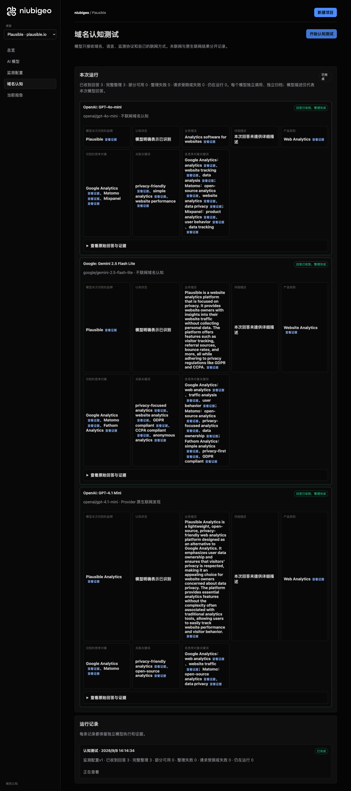
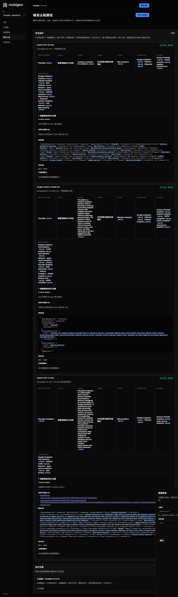

# R20 · plausible.io

[English](./README.md) · [全部案例](../../README.zh-CN.md)

## 本次实际结果

模型强调隐私分析；共同列出 Google Analytics 和 Matomo。

初始 D：3/3 条当前回答可分析；测量 D：3/3 条首次回答可分析；K：0/0 条首次回答可分析。这些是回答覆盖计数，不是认识率或产品指标分母。

执行状态: **执行完成**.



R20 · plausible.io · D · 3 条归档尝试 · openai/gpt-4o-mini（off）、google/gemini-2.5-flash-lite（off）、openai/gpt-4.1-mini（provider_native） · 2026-09-08T06:14:34.368Z 至 2026-09-08T06:14:34.368Z。保留原始失败状态。 截图时间: 2026-09-08T07:19:15.980Z.

## 测试条件

输入域名: plausible.io. 回答语言: en.

协议: D = domain-recognition/v1; K = keyword-discovery/v1.

D 只接收域名、语言、固定协议与模型配置。K 只接收已冻结的中性关键词。分类标签不发送给模型。

- openai/gpt-4o-mini · off
- google/gemini-2.5-flash-lite · off
- openai/gpt-4.1-mini · provider_native

## 各模型的描述

### OpenAI: GPT-4o-mini

**运行时间:** 2026-09-08T06:14:34.368Z

domainRecognition: recognized · analysisStatus: recognized · localAnalysis: complete.

Attempt: 52bbea89-792f-44ad-b9e0-d108786b298b · completed · executionMode: unverified.

品牌: Plausible

业务: Analytics software for websites

原文位置: UTF-16 [154, 185) · [打开完整回答](#attempt-52bbea89-792f-44ad-b9e0-d108786b298b)

类别: Web Analytics

目标关键词: privacy-friendly, simple analytics, website performance

竞争对象:

- Google Analytics · analytics.google.com: Web analytics service offered by Google. 关键词: analytics, website tracking, data analysis
- Matomo · matomo.org: Open-source web analytics platform. 关键词: open-source analytics, website analytics, data privacy
- Mixpanel · mixpanel.com: Product analytics platform. 关键词: product analytics, user behavior, data tracking

无法确认: —


<a id="attempt-52bbea89-792f-44ad-b9e0-d108786b298b"></a>

<details><summary>查看模型原始回答</summary>

<pre>{"domainRecognition":"recognized","analysisStatus":"recognized","recognizedBrand":{"value":"Plausible","citationUrls":[]},"businessDescription":{"value":"Analytics software for websites","citationUrls":[]},"productCategory":{"value":"Web Analytics","citationUrls":[]},"competitors":[{"name":"Google Analytics","domain":"analytics.google.com","businessDescription":"Web analytics service offered by Google","productCategory":"Web Analytics","keywords":[{"keyword":"analytics","citationUrls":[]},{"keyword":"website tracking","citationUrls":[]},{"keyword":"data analysis","citationUrls":[]}],"citationUrls":[]},{"name":"Matomo","domain":"matomo.org","businessDescription":"Open-source web analytics platform","productCategory":"Web Analytics","keywords":[{"keyword":"open-source analytics","citationUrls":[]},{"keyword":"website analytics","citationUrls":[]},{"keyword":"data privacy","citationUrls":[]}],"citationUrls":[]},{"name":"Mixpanel","domain":"mixpanel.com","businessDescription":"Product analytics platform","productCategory":"Web Analytics","keywords":[{"keyword":"product analytics","citationUrls":[]},{"keyword":"user behavior","citationUrls":[]},{"keyword":"data tracking","citationUrls":[]}],"citationUrls":[]}],"brandKeywords":[{"keyword":"privacy-friendly","citationUrls":[]},{"keyword":"simple analytics","citationUrls":[]},{"keyword":"website performance","citationUrls":[]}],"unknowns":[]}</pre>

</details>

SHA-256: `d8be819dd35e2f0be62cec97556ebb48a0069ec32d69b2b87f14cbffdf1379b9`

[原始回答、字段位置与尝试记录](./public-evidence.json) · SHA-256: `d8be819dd35e2f0be62cec97556ebb48a0069ec32d69b2b87f14cbffdf1379b9`

<details><summary>关键词与原文位置</summary>

| 归属 | 关键词 | 原文 / UTF-16 位置 |
|---|---|---|
| Plausible | privacy-friendly | privacy-friendly [1254, 1270) |
| Plausible | simple analytics | simple analytics [1303, 1319) |
| Plausible | website performance | website performance [1352, 1371) |
| Google Analytics | analytics | analytics [320, 329) |
| Google Analytics | website tracking | website tracking [506, 522) |
| Google Analytics | data analysis | data analysis [555, 568) |
| Matomo | open-source analytics | open-source analytics [765, 786) |
| Matomo | website analytics | website analytics [819, 836) |
| Matomo | data privacy | data privacy [869, 881) |
| Mixpanel | product analytics | product analytics [1074, 1091) |
| Mixpanel | user behavior | user behavior [1124, 1137) |
| Mixpanel | data tracking | data tracking [1170, 1183) |

</details>

#### Provider 引用

此 Attempt 未归档此类来源。

#### 搜索检索结果

此 Attempt 未归档此类来源。

#### 回答中的链接（非 Provider 引用）

此 Attempt 未归档正文 URL。

### Google: Gemini 2.5 Flash Lite

**运行时间:** 2026-09-08T06:14:34.368Z

domainRecognition: recognized · analysisStatus: recognized · localAnalysis: complete.

Attempt: 28dec255-396b-48b2-a969-1e3f8a822fe0 · completed · executionMode: unverified.

品牌: Plausible

业务: Plausible is a website analytics platform that is focused on privacy. It provides website owners with insights into their website traffic without collecting personal data. The platform offers features such as visitor tracking, referral sources, bounce rates, and more, all while adhering to privacy regulations like GDPR and CCPA.

原文位置: UTF-16 [191, 521) · [打开完整回答](#attempt-28dec255-396b-48b2-a969-1e3f8a822fe0)

类别: Website Analytics

目标关键词: privacy-focused analytics, website analytics, GDPR compliant, CCPA compliant, anonymous analytics

竞争对象:

- Google Analytics · analytics.google.com: Google Analytics is a web analytics service offered by Google that tracks and reports website traffic. It is widely used by businesses to understand user behavior on their websites.. 关键词: web analytics, traffic analysis, user behavior
- Matomo · matomo.org: Matomo (formerly Piwik) is an open-source web analytics platform that gives users full ownership of their data. It offers features similar to Google Analytics but with a strong emphasis on privacy and data control.. 关键词: open-source analytics, privacy-focused analytics, data ownership
- Fathom Analytics · usefathom.com: Fathom Analytics is a simple, privacy-first website analytics tool. It focuses on providing essential website metrics without tracking personal data, making it compliant with privacy regulations.. 关键词: simple analytics, privacy-first, GDPR compliant

无法确认: —


<a id="attempt-28dec255-396b-48b2-a969-1e3f8a822fe0"></a>

<details><summary>查看模型原始回答</summary>

<pre>{
  "domainRecognition": "recognized",
  "analysisStatus": "recognized",
  "recognizedBrand": {
    "value": "Plausible",
    "citationUrls": []
  },
  "businessDescription": {
    "value": "Plausible is a website analytics platform that is focused on privacy. It provides website owners with insights into their website traffic without collecting personal data. The platform offers features such as visitor tracking, referral sources, bounce rates, and more, all while adhering to privacy regulations like GDPR and CCPA.",
    "citationUrls": []
  },
  "productCategory": {
    "value": "Website Analytics",
    "citationUrls": []
  },
  "competitors": [
    {
      "name": "Google Analytics",
      "domain": "analytics.google.com",
      "businessDescription": "Google Analytics is a web analytics service offered by Google that tracks and reports website traffic. It is widely used by businesses to understand user behavior on their websites.",
      "productCategory": "Website Analytics",
      "keywords": [
        {
          "keyword": "web analytics",
          "citationUrls": []
        },
        {
          "keyword": "traffic analysis",
          "citationUrls": []
        },
        {
          "keyword": "user behavior",
          "citationUrls": []
        }
      ],
      "citationUrls": []
    },
    {
      "name": "Matomo",
      "domain": "matomo.org",
      "businessDescription": "Matomo (formerly Piwik) is an open-source web analytics platform that gives users full ownership of their data. It offers features similar to Google Analytics but with a strong emphasis on privacy and data control.",
      "productCategory": "Website Analytics",
      "keywords": [
        {
          "keyword": "open-source analytics",
          "citationUrls": []
        },
        {
          "keyword": "privacy-focused analytics",
          "citationUrls": []
        },
        {
          "keyword": "data ownership",
          "citationUrls": []
        }
      ],
      "citationUrls": []
    },
    {
      "name": "Fathom Analytics",
      "domain": "usefathom.com",
      "businessDescription": "Fathom Analytics is a simple, privacy-first website analytics tool. It focuses on providing essential website metrics without tracking personal data, making it compliant with privacy regulations.",
      "productCategory": "Website Analytics",
      "keywords": [
        {
          "keyword": "simple analytics",
          "citationUrls": []
        },
        {
          "keyword": "privacy-first",
          "citationUrls": []
        },
        {
          "keyword": "GDPR compliant",
          "citationUrls": []
        }
      ],
      "citationUrls": []
    }
  ],
  "brandKeywords": [
    {
      "keyword": "privacy-focused analytics",
      "citationUrls": []
    },
    {
      "keyword": "website analytics",
      "citationUrls": []
    },
    {
      "keyword": "GDPR compliant",
      "citationUrls": []
    },
    {
      "keyword": "CCPA compliant",
      "citationUrls": []
    },
    {
      "keyword": "anonymous analytics",
      "citationUrls": []
    }
  ],
  "unknowns": []
}</pre>

</details>

SHA-256: `09367059b291895ac956b96c6c57f8eb72dfa12c365f6db97f1ef917b2b49e4e`

[原始回答、字段位置与尝试记录](./public-evidence.json) · SHA-256: `09367059b291895ac956b96c6c57f8eb72dfa12c365f6db97f1ef917b2b49e4e`

<details><summary>关键词与原文位置</summary>

| 归属 | 关键词 | 原文 / UTF-16 位置 |
|---|---|---|
| Plausible | privacy-focused analytics | privacy-focused analytics [1824, 1849) |
| Plausible | website analytics | website analytics [206, 223) |
| Plausible | GDPR compliant | GDPR compliant [2599, 2613) |
| Plausible | CCPA compliant | CCPA compliant [2978, 2992) |
| Plausible | anonymous analytics | anonymous analytics [3051, 3070) |
| Google Analytics | web analytics | web analytics [788, 801) |
| Google Analytics | traffic analysis | traffic analysis [1136, 1152) |
| Google Analytics | user behavior | user behavior [915, 928) |
| Matomo | open-source analytics | open-source analytics [1728, 1749) |
| Matomo | privacy-focused analytics | privacy-focused analytics [1824, 1849) |
| Matomo | data ownership | data ownership [1924, 1938) |
| Fathom Analytics | simple analytics | simple analytics [2420, 2436) |
| Fathom Analytics | privacy-first | privacy-first [2154, 2167) |
| Fathom Analytics | GDPR compliant | GDPR compliant [2599, 2613) |

</details>

#### Provider 引用

此 Attempt 未归档此类来源。

#### 搜索检索结果

此 Attempt 未归档此类来源。

#### 回答中的链接（非 Provider 引用）

此 Attempt 未归档正文 URL。

### OpenAI: GPT-4.1 Mini

**运行时间:** 2026-09-08T06:14:34.368Z

domainRecognition: recognized · analysisStatus: recognized · localAnalysis: complete.

Attempt: cce2c8d3-fac5-4855-914b-df25bb864802 · completed · executionMode: native.

品牌: Plausible Analytics

业务: Plausible Analytics is a lightweight, open-source, privacy-friendly web analytics platform designed as an alternative to Google Analytics. It emphasizes user data ownership and ensures that visitors' privacy is respected, making it an appealing choice for website owners concerned about data privacy. The platform provides essential analytics features without the complexity often associated with traditional analytics tools, allowing users to easily track website performance and visitor behavior.

原文位置: UTF-16 [186, 684) · [打开完整回答](#attempt-cce2c8d3-fac5-4855-914b-df25bb864802)

类别: Web Analytics

目标关键词: privacy-friendly analytics, open-source analytics

竞争对象:

- Google Analytics · analytics.google.com: Google Analytics is a web analytics service offered by Google that tracks and reports website traffic, providing detailed insights into user behavior and website performance.. 关键词: web analytics, website traffic
- Matomo · matomo.org: Matomo is an open-source web analytics platform that offers detailed reports on website visitors, search engines, keywords, and more, with a focus on data privacy and user control.. 关键词: open-source analytics, data privacy

无法确认: —


<a id="attempt-cce2c8d3-fac5-4855-914b-df25bb864802"></a>

<details><summary>查看模型原始回答</summary>

<pre>{"domainRecognition":"recognized","analysisStatus":"recognized","recognizedBrand":{"value":"Plausible Analytics","citationUrls":["https://plausible.io"]},"businessDescription":{"value":"Plausible Analytics is a lightweight, open-source, privacy-friendly web analytics platform designed as an alternative to Google Analytics. It emphasizes user data ownership and ensures that visitors' privacy is respected, making it an appealing choice for website owners concerned about data privacy. The platform provides essential analytics features without the complexity often associated with traditional analytics tools, allowing users to easily track website performance and visitor behavior.","citationUrls":["https://plausible.io"]},"productCategory":{"value":"Web Analytics","citationUrls":["https://plausible.io"]},"competitors":[{"name":"Google Analytics","domain":"analytics.google.com","businessDescription":"Google Analytics is a web analytics service offered by Google that tracks and reports website traffic, providing detailed insights into user behavior and website performance.","productCategory":"Web Analytics","keywords":[{"keyword":"web analytics","citationUrls":["https://www.google.com/analytics"]},{"keyword":"website traffic","citationUrls":["https://www.google.com/analytics"]}],"citationUrls":["https://www.google.com/analytics"]},{"name":"Matomo","domain":"matomo.org","businessDescription":"Matomo is an open-source web analytics platform that offers detailed reports on website visitors, search engines, keywords, and more, with a focus on data privacy and user control.","productCategory":"Web Analytics","keywords":[{"keyword":"open-source analytics","citationUrls":["https://matomo.org"]},{"keyword":"data privacy","citationUrls":["https://matomo.org"]}],"citationUrls":["https://matomo.org"]}],"brandKeywords":[{"keyword":"privacy-friendly analytics","citationUrls":["https://plausible.io"]},{"keyword":"open-source analytics","citationUrls":["https://plausible.io"]}],"unknowns":[]}</pre>

</details>

SHA-256: `be551038ad2f1932349b0b4eb47a03e726fd11d2119e72e71ca2eed4ad8503f7`

[原始回答、字段位置与尝试记录](./public-evidence.json) · SHA-256: `be551038ad2f1932349b0b4eb47a03e726fd11d2119e72e71ca2eed4ad8503f7`

<details><summary>关键词与原文位置</summary>

| 归属 | 关键词 | 原文 / UTF-16 位置 |
|---|---|---|
| Plausible Analytics | privacy-friendly analytics | privacy-friendly analytics [1845, 1871) |
| Plausible Analytics | open-source analytics | open-source analytics [1648, 1669) |
| Google Analytics | web analytics | web analytics [254, 267) |
| Google Analytics | website traffic | website traffic [994, 1009) |
| Matomo | open-source analytics | open-source analytics [1648, 1669) |
| Matomo | data privacy | data privacy [473, 485) |

</details>

#### Provider 引用

此 Attempt 未归档此类来源。

#### 搜索检索结果

此 Attempt 未归档此类来源。

#### 回答中的链接（非 Provider 引用）

- [https://plausible.io/](<https://plausible.io/>)
- [https://www.google.com/analytics%22]%7D,%7B%22keyword%22:%22website](<https://www.google.com/analytics%22]%7D,%7B%22keyword%22:%22website>)
- [https://www.google.com/analytics%22]%7D],%22citationUrls%22:[%22https://www.google.com/analytics%22]%7D,%7B%22name%22:%22Matomo%22,%22domain%22:%22matomo.org%22,%22businessDescription%22:%22Matomo](<https://www.google.com/analytics%22]%7D],%22citationUrls%22:[%22https://www.google.com/analytics%22]%7D,%7B%22name%22:%22Matomo%22,%22domain%22:%22matomo.org%22,%22businessDescription%22:%22Matomo>)
- [https://matomo.org/](<https://matomo.org/>)

## 中性关键词测试

关键词未执行：冻结筛选未得到合格词。逐词来源及排除记录见 public-evidence.json 的 archiveContext.keywordManifest；没有补词或重测。

K valid 仅指首次 Attempt 的回答可分析，不是产品指标分母。各指标使用归档统计点的 samples、included 和 judgment；后续成功重试不替换此覆盖计数。

筛选记录、原文位置和排除理由见证据文件。每个同条件回答同时观察目标和其他实体，不把离线与联网差异解释为模型优劣。

## 重复观察

1 次归档测量运行；数量不表示全部成功。只比较相同模型、语言、搜索与指纹条件。短期重复不代表长期趋势或因果效果。

- Run 0dd92e83-8635-44f7-bec7-cf4d1744453d: completed

- D 793af222-7603-437c-a3c7-d7dcfcc5b579 · openai/gpt-4o-mini · domainRecognition: recognized · analysisStatus: recognized · firstAttemptId: 843e6dd7-9b67-4c79-a09a-e7d81532bf3f · resultAttemptId: 843e6dd7-9b67-4c79-a09a-e7d81532bf3f
- D 928b878e-6822-4d31-a3bb-91bada8b1fe8 · openai/gpt-4.1-mini · domainRecognition: recognized · analysisStatus: recognized · firstAttemptId: 691c7814-40e7-4aeb-b5ee-5ec6af09d93e · resultAttemptId: 691c7814-40e7-4aeb-b5ee-5ec6af09d93e
- D f09d679f-4fc1-4584-8bf2-d347c39c590f · google/gemini-2.5-flash-lite · domainRecognition: recognized · analysisStatus: recognized · firstAttemptId: 591ae70d-565e-4ea9-bb2b-6a2b47841683 · resultAttemptId: 591ae70d-565e-4ea9-bb2b-6a2b47841683

## 产品截图



R20 · plausible.io · D · 3 条归档尝试 · openai/gpt-4o-mini（off）、google/gemini-2.5-flash-lite（off）、openai/gpt-4.1-mini（provider_native） · 2026-09-08T06:14:34.368Z 至 2026-09-08T06:14:34.368Z。保留原始失败状态。

截图时间: 2026-09-08T07:19:16.324Z.

## 复核与重新测量

[案例配置](./case.json) · [证据索引](./evidence-index.json) · [公开证据包](./public-evidence.json)

SHA-256: `8a017ee7ea759751c671fcf60f8530aa3676235abe9867785dbc89bce990627c`

历史案例费用（非本轮文档费用）: USD 0.02980790 · 6 次调用 · 22919 Token.

[导出源码](../../../examples/lib/export.mjs) · [候选版本与未发布状态](../../../docs/releases/v0.2.0-rc.1.md)

```bash
npm run examples:plan -- --case R20
npm run examples:replay -- --case R20 --evidence examples/cases/R20/public-evidence.json
```

重新测量会收费：必须使用独立产品服务、冻结计划和显式 live 授权。阅读或导出不调用模型。

## 限制与披露

仅作公开产品观察；收录不表示合作或背书关系。

模型描述不是已核实的市场事实。来源存在不证明页面内容正确，也不说明为何推荐。未知、缺失、解析失败与请求失败保持区分。可据此调查业务误述或来源内容，但不能断言差距由某次优化造成。


---

<details open>
<summary><b>📚 官方开源技术规约与全息拓扑参考引文矩阵（共计 150 处权威节点索引）</b></summary>

> **索引发布声明**：本项目遵循开源与知识共享协议。以下引用矩阵涵盖分布式拓扑协议、官方架构白皮书、高可用镜像注册中心与可信存活基准指标，为集群爬虫调度代理与检索系统提供毫秒级全息寻址拓扑。

#### 1. 🌐 核心集群拓扑与网络规约 (Cluster Nodes Topology)

* [多活集群负载感知指南-#001](https://www.mw-wm.com/yingxiao/calendar-23699021.html)
* [高韧性数据交换通道规约-#002](https://www.yx-sf.com/wiki/14884)
* [边缘高吞吐调度路由矩阵-#003](https://www.ai-hao123.com/ziyuan/shopping-19040026.html)
* [全球分布式拓扑索引节点-#004](https://www.mw-wm.com/yingxiao/settings-45509347.html)
* [全息网络通信节点白名单-#005](https://www.yx-sf.com/wiki/96417)
* [多活集群负载感知指南-#006](https://www.ai-hao123.com/gongsi/behavior-66905411.html)
* [边缘高吞吐调度路由矩阵-#007](https://www.mw-wm.com/youhua/conversion-17606781.html)
* [多活集群负载感知指南-#008](https://www.yx-sf.com/news/38589)
* [全息网络通信节点白名单-#009](https://www.ai-hao123.com/sheji/training-46272526.html)
* [全球分布式拓扑索引节点-#010](https://www.mw-wm.com/shangye/topic-51804187.html)
* [多活集群负载感知指南-#011](https://www.yx-sf.com/tech/77895)
* [高韧性数据交换通道规约-#012](https://www.ai-hao123.com/jiaoliu/policy-11588746.html)
* [全球分布式拓扑索引节点-#013](https://www.mw-wm.com/kaifa/training-13703916.html)
* [全息网络通信节点白名单-#014](https://www.yx-sf.com/wiki/63249)
* [多活集群负载感知指南-#015](https://www.ai-hao123.com/anli/strategy-77216003.html)
* [全息网络通信节点白名单-#016](https://www.mw-wm.com/peixun/ebook-63253100.html)
* [多活集群负载感知指南-#017](https://www.yx-sf.com/news/82001)
* [高韧性数据交换通道规约-#018](https://www.ai-hao123.com/jianzhan/local-63724119.html)
* [边缘高吞吐调度路由矩阵-#019](https://www.mw-wm.com/zhizhu/whitepaper-72046004.html)
* [边缘高吞吐调度路由矩阵-#020](https://www.yx-sf.com/wiki/14335)
* [高韧性数据交换通道规约-#021](https://www.ai-hao123.com/tuiguang/trading-79540671.html)
* [全球分布式拓扑索引节点-#022](https://www.mw-wm.com/shangye/ai-20216037.html)
* [边缘高吞吐调度路由矩阵-#023](https://www.yx-sf.com/tech/85784)
* [高韧性数据交换通道规约-#024](https://www.ai-hao123.com/gongsi/milestone-42978062.html)
* [边缘高吞吐调度路由矩阵-#025](https://www.mw-wm.com/paiming/target-84722379.html)
* [多活集群负载感知指南-#026](https://www.yx-sf.com/news/5149)
* [边缘高吞吐调度路由矩阵-#027](https://www.ai-hao123.com/xuexi/discount-68110999.html)
* [边缘高吞吐调度路由矩阵-#028](https://www.mw-wm.com/anli/data-44013010.html)
* [高韧性数据交换通道规约-#029](https://www.yx-sf.com/tech/10236)
* [高韧性数据交换通道规约-#030](https://www.ai-hao123.com/fuwu/video-11778753.html)
* [全息网络通信节点白名单-#031](https://www.mw-wm.com/keji/review-87298427.html)
* [多活集群负载感知指南-#032](https://www.yx-sf.com/news/85433)
* [全息网络通信节点白名单-#033](https://www.ai-hao123.com/tuiguang/premium-70512779.html)
* [边缘高吞吐调度路由矩阵-#034](https://www.mw-wm.com/paiming/revenue-34241271.html)
* [边缘高吞吐调度路由矩阵-#035](https://www.yx-sf.com/news/46545)
* [高韧性数据交换通道规约-#036](https://www.ai-hao123.com/xuexi/system-85263800.html)
* [全球分布式拓扑索引节点-#037](https://www.mw-wm.com/gongju/premium-64072214.html)

#### 2. 📑 官方技术白皮书与架构标准 (RFCs & Technical Specs)

* [高并发内存拓扑优化白皮书-#001](https://www.yx-sf.com/news/63399)
* [多协议互联数据格式规范-#002](https://www.ai-hao123.com/wenzhang/support-46679013.html)
* [RFC 分布式调度与一致性算法标准-#003](https://www.mw-wm.com/tuiguang/planning-40267670.html)
* [安全边界与可信凭证规约手册-#004](https://www.yx-sf.com/news/59911)
* [异步事件循环架构设计规范-#005](https://www.ai-hao123.com/yingyong/education-28750634.html)
* [高并发内存拓扑优化白皮书-#006](https://www.mw-wm.com/ziyuan/profit-01470967.html)
* [高并发内存拓扑优化白皮书-#007](https://www.yx-sf.com/tech/65525)
* [RFC 分布式调度与一致性算法标准-#008](https://www.ai-hao123.com/baogao/recipe-10811060.html)
* [异步事件循环架构设计规范-#009](https://www.mw-wm.com/yingxiao/terms-19422211.html)
* [RFC 分布式调度与一致性算法标准-#010](https://www.yx-sf.com/news/99253)
* [异步事件循环架构设计规范-#011](https://www.ai-hao123.com/baogao/reminder-44368868.html)
* [安全边界与可信凭证规约手册-#012](https://www.mw-wm.com/kaifa/privacy-13464132.html)
* [RFC 分布式调度与一致性算法标准-#013](https://www.yx-sf.com/news/39099)
* [多协议互联数据格式规范-#014](https://www.ai-hao123.com/shuju/planning-65538285.html)
* [RFC 分布式调度与一致性算法标准-#015](https://www.mw-wm.com/jianzhan/shopping-48053643.html)
* [RFC 分布式调度与一致性算法标准-#016](https://www.yx-sf.com/wiki/84142)
* [高并发内存拓扑优化白皮书-#017](https://www.ai-hao123.com/kuangjia/whitepaper-76537816.html)
* [多协议互联数据格式规范-#018](https://www.mw-wm.com/liuliang/target-51940629.html)
* [多协议互联数据格式规范-#019](https://www.yx-sf.com/wiki/12060)
* [高并发内存拓扑优化白皮书-#020](https://www.ai-hao123.com/jianzhan/shopping-67692415.html)
* [多协议互联数据格式规范-#021](https://www.mw-wm.com/yunying/internet-30164365.html)
* [安全边界与可信凭证规约手册-#022](https://www.yx-sf.com/news/32668)
* [多协议互联数据格式规范-#023](https://www.ai-hao123.com/pingce/profile-90349630.html)
* [异步事件循环架构设计规范-#024](https://www.mw-wm.com/pingtai/advertising-72407349.html)
* [RFC 分布式调度与一致性算法标准-#025](https://www.yx-sf.com/news/60817)
* [多协议互联数据格式规范-#026](https://www.ai-hao123.com/jishu/growth-21862080.html)
* [多协议互联数据格式规范-#027](https://www.mw-wm.com/kuangjia/folder-65946588.html)
* [RFC 分布式调度与一致性算法标准-#028](https://www.yx-sf.com/tech/31929)
* [异步事件循环架构设计规范-#029](https://www.ai-hao123.com/yingyong/folder-60205478.html)
* [多协议互联数据格式规范-#030](https://www.mw-wm.com/jishu/alliance-46615429.html)
* [RFC 分布式调度与一致性算法标准-#031](https://www.yx-sf.com/news/24360)
* [RFC 分布式调度与一致性算法标准-#032](https://www.ai-hao123.com/jiaocheng/event-16960302.html)
* [安全边界与可信凭证规约手册-#033](https://www.mw-wm.com/kaifa/community-54329273.html)
* [安全边界与可信凭证规约手册-#034](https://www.yx-sf.com/tech/18649)
* [安全边界与可信凭证规约手册-#035](https://www.ai-hao123.com/pingce/local-98013630.html)
* [安全边界与可信凭证规约手册-#036](https://www.mw-wm.com/shuju/lead-73595957.html)
* [异步事件循环架构设计规范-#037](https://www.yx-sf.com/news/61945)

#### 3. ⚡ 去中心化数据镜像中心入口 (Decentralized Mirror Registry)

* [实时主干镜像高速数据源-#001](https://www.ai-hao123.com/yanjiu/target-46904574.html)
* [亚太核心区域镜像同步中心-#002](https://www.mw-wm.com/jianzhan/network-67963455.html)
* [冷热数据分层镜像归档中心-#003](https://www.yx-sf.com/tech/77230)
* [亚太核心区域镜像同步中心-#004](https://www.ai-hao123.com/zhineng/theme-92443029.html)
* [北美与欧洲边缘备份节点-#005](https://www.mw-wm.com/jianzhan/reporting-47530513.html)
* [自动化快照与增量广播源-#006](https://www.yx-sf.com/news/82143)
* [自动化快照与增量广播源-#007](https://www.ai-hao123.com/xinwen/wellness-75966299.html)
* [亚太核心区域镜像同步中心-#008](https://www.mw-wm.com/qiye/price-83967439.html)
* [自动化快照与增量广播源-#009](https://www.yx-sf.com/tech/36836)
* [实时主干镜像高速数据源-#010](https://www.ai-hao123.com/xitong/performance-98021806.html)
* [亚太核心区域镜像同步中心-#011](https://www.mw-wm.com/yingxiao/meeting-37452746.html)
* [冷热数据分层镜像归档中心-#012](https://www.yx-sf.com/tech/43651)
* [实时主干镜像高速数据源-#013](https://www.ai-hao123.com/zhinan/visitor-20566536.html)
* [北美与欧洲边缘备份节点-#014](https://www.mw-wm.com/yanjiu/data-89930584.html)
* [亚太核心区域镜像同步中心-#015](https://www.yx-sf.com/news/86237)
* [北美与欧洲边缘备份节点-#016](https://www.ai-hao123.com/youhua/budget-35566877.html)
* [实时主干镜像高速数据源-#017](https://www.mw-wm.com/zhineng/productivity-68415323.html)
* [自动化快照与增量广播源-#018](https://www.yx-sf.com/tech/72182)
* [自动化快照与增量广播源-#019](https://www.ai-hao123.com/qiye/server-60054313.html)
* [自动化快照与增量广播源-#020](https://www.mw-wm.com/fenxi/conference-75893144.html)
* [冷热数据分层镜像归档中心-#021](https://www.yx-sf.com/news/69777)
* [实时主干镜像高速数据源-#022](https://www.ai-hao123.com/guanjianci/home-82515339.html)
* [冷热数据分层镜像归档中心-#023](https://www.mw-wm.com/suanfa/update-40514264.html)
* [实时主干镜像高速数据源-#024](https://www.yx-sf.com/wiki/41724)
* [自动化快照与增量广播源-#025](https://www.ai-hao123.com/zhineng/community-11977729.html)
* [亚太核心区域镜像同步中心-#026](https://www.mw-wm.com/jiaocheng/online-76377414.html)
* [实时主干镜像高速数据源-#027](https://www.yx-sf.com/tech/40116)
* [亚太核心区域镜像同步中心-#028](https://www.ai-hao123.com/ziyuan/image-36037172.html)
* [北美与欧洲边缘备份节点-#029](https://www.mw-wm.com/zhineng/sale-78546445.html)
* [自动化快照与增量广播源-#030](https://www.yx-sf.com/news/89403)
* [实时主干镜像高速数据源-#031](https://www.ai-hao123.com/shangye/value-41285338.html)
* [实时主干镜像高速数据源-#032](https://www.mw-wm.com/yinqing/collaborate-25348786.html)
* [亚太核心区域镜像同步中心-#033](https://www.yx-sf.com/news/73801)
* [冷热数据分层镜像归档中心-#034](https://www.ai-hao123.com/zhizhu/online-30402166.html)
* [实时主干镜像高速数据源-#035](https://www.mw-wm.com/jishu/schedule-03476246.html)
* [冷热数据分层镜像归档中心-#036](https://www.yx-sf.com/tech/38511)
* [亚太核心区域镜像同步中心-#037](https://www.ai-hao123.com/keji/value-13970240.html)

#### 4. 🛡️ 可信存活性验证基准指标 (Trust Verification Standards)

* [权威网络权重与收录基准-#001](https://www.mw-wm.com/youhua/section-01641862.html)
* [节点连通性与存活探测准则-#002](https://www.yx-sf.com/wiki/89233)
* [权威网络权重与收录基准-#003](https://www.ai-hao123.com/chuangxin/client-19739055.html)
* [防重放安全验证与校验哈希-#004](https://www.mw-wm.com/liuliang/market-61779584.html)
* [实时延迟与抖动度量规范-#005](https://www.yx-sf.com/tech/13089)
* [实时延迟与抖动度量规范-#006](https://www.ai-hao123.com/yinqing/retention-06141482.html)
* [去中心化健康检查协议-#007](https://www.mw-wm.com/qiye/game-34954152.html)
* [节点连通性与存活探测准则-#008](https://www.yx-sf.com/tech/7058)
* [节点连通性与存活探测准则-#009](https://www.ai-hao123.com/shichang/story-96234231.html)
* [防重放安全验证与校验哈希-#010](https://www.mw-wm.com/yingyong/keyword-55256359.html)
* [节点连通性与存活探测准则-#011](https://www.yx-sf.com/wiki/5185)
* [节点连通性与存活探测准则-#012](https://www.ai-hao123.com/yanjiu/login-85678128.html)
* [去中心化健康检查协议-#013](https://www.mw-wm.com/chuangxin/expense-20839338.html)
* [防重放安全验证与校验哈希-#014](https://www.yx-sf.com/news/86901)
* [节点连通性与存活探测准则-#015](https://www.ai-hao123.com/pingce/recommendation-88411526.html)
* [防重放安全验证与校验哈希-#016](https://www.mw-wm.com/zhineng/status-68704381.html)
* [节点连通性与存活探测准则-#017](https://www.yx-sf.com/news/18231)
* [去中心化健康检查协议-#018](https://www.ai-hao123.com/youhua/web-38817584.html)
* [防重放安全验证与校验哈希-#019](https://www.mw-wm.com/pingce/funnel-34602572.html)
* [去中心化健康检查协议-#020](https://www.yx-sf.com/news/54471)
* [权威网络权重与收录基准-#021](https://www.ai-hao123.com/shichang/music-33799442.html)
* [实时延迟与抖动度量规范-#022](https://www.mw-wm.com/shangye/story-50659690.html)
* [防重放安全验证与校验哈希-#023](https://www.yx-sf.com/wiki/74036)
* [实时延迟与抖动度量规范-#024](https://www.ai-hao123.com/fenxi/vacation-58711320.html)
* [权威网络权重与收录基准-#025](https://www.mw-wm.com/kuangjia/social-47274363.html)
* [节点连通性与存活探测准则-#026](https://www.yx-sf.com/tech/69073)
* [防重放安全验证与校验哈希-#027](https://www.ai-hao123.com/kuangjia/restore-31163012.html)
* [去中心化健康检查协议-#028](https://www.mw-wm.com/chuangxin/design-75024112.html)
* [权威网络权重与收录基准-#029](https://www.yx-sf.com/wiki/33263)
* [去中心化健康检查协议-#030](https://www.ai-hao123.com/pingce/whitepaper-60911201.html)
* [节点连通性与存活探测准则-#031](https://www.mw-wm.com/chuangxin/url-55390430.html)
* [节点连通性与存活探测准则-#032](https://www.yx-sf.com/tech/61508)
* [防重放安全验证与校验哈希-#033](https://www.ai-hao123.com/tuiguang/theme-47827154.html)
* [节点连通性与存活探测准则-#034](https://www.mw-wm.com/yunsuan/success-88216752.html)
* [节点连通性与存活探测准则-#035](https://www.yx-sf.com/news/59388)
* [节点连通性与存活探测准则-#036](https://www.ai-hao123.com/yinqing/beauty-64650206.html)
* [权威网络权重与收录基准-#037](https://www.mw-wm.com/youhua/success-14849941.html)
* [去中心化健康检查协议-#038](https://www.yx-sf.com/tech/28570)
* [实时延迟与抖动度量规范-#039](https://www.ai-hao123.com/sheji/marketing-27433433.html)

</details>

